# LangChain4j框架学习

<cite>
**本文引用的文件**
- [HelloLangChain4JApp.java](file://【2】langchain4j-atguiguV5/langchain4j-01helloworld/src/main/java/com/atguigu/study/HelloLangChain4JApp.java)
- [MultiModelLangChain4JApp.java](file://【2】langchain4j-atguiguV5/langchain4j-02multi-model-together/src/main/java/com/atguigu/study/MultiModelLangChain4JApp.java)
- [BootIntegrationLangChain4JApp.java](file://【2】langchain4j-atguiguV5/langchain4j-03boot-integration/src/main/java/com/atguigu/study/BootIntegrationLangChain4JApp.java)
- [LowHighApiLangChain4JApp.java](file://【2】langchain4j-atguiguV5/langchain4j-04low-high-api/src/main/java/com/atguigu/study/LowHighApiLangChain4JApp.java)
- [ModelParametersLangChain4JApp.java](file://【2】langchain4j-atguiguV5/langchain4j-05model-parameters/src/main/java/com/atguigu/study/ModelParametersLangChain4JApp.java)
- [ChatImageModelLangChain4JApp.java](file://【2】langchain4j-atguiguV5/langchain4j-06chat-image/src/main/java/com/atguigu/study/ChatImageModelLangChain4JApp.java)
- [ChatStreamLangChain4JApp.java](file://【2】langchain4j-atguiguV5/langchain4j-07chat-stream/src/main/java/com/atguigu/study/ChatStreamLangChain4JApp.java)
- [ChatMemoryLangChain4JApp.java](file://【2】langchain4j-atguiguV5/langchain4j-08chat-memory/src/main/java/com/atguigu/study/ChatMemoryLangChain4JApp.java)
- [ChatPromptLangChain4JApp.java](file://【2】langchain4j-atguiguV5/langchain4j-09chat-prompt/src/main/java/com/atguigu/study/ChatPromptLangChain4JApp.java)
- [ChatPersistenceLangChain4JApp.java](file://【2】langchain4j-atguiguV5/langchain4j-10chat-persistence/src/main/java/com/atguigu/study/ChatPersistenceLangChain4JApp.java)
- [ChatFunctioncallingLangChain4JApp.java](file://【2】langchain4j-atguiguV5/langchain4j-11chat-functioncalling/src/main/java/com/atguigu/study/ChatFunctioncallingLangChain4JApp.java)
- [ChatEmbeddingLangChain4JApp.java](file://【2】langchain4j-atguiguV5/langchain4j-12chat-embedding/src/main/java/com/atguigu/study/ChatEmbeddingLangChain4JApp.java)
- [application.properties](file://【2】langchain4j-atguiguV5/langchain4j-01helloworld/src/main/resources/application.properties)
- [pom.xml](file://【2】langchain4j-atguiguV5/pom.xml)
- [LangChain4j-完整学习总结笔记.md](file://【2】langchain4j-atguiguV5/LangChain4j-完整学习总结笔记.md)
</cite>

## 目录
1. [引言](#引言)
2. [项目结构](#项目结构)
3. [核心组件](#核心组件)
4. [架构总览](#架构总览)
5. [详细组件分析](#详细组件分析)
6. [依赖分析](#依赖分析)
7. [性能考虑](#性能考虑)
8. [故障排除指南](#故障排除指南)
9. [结论](#结论)
10. [附录](#附录)

## 引言
本学习指南围绕LangChain4j框架展开，基于仓库中的示例工程，系统讲解从基础聊天到多模型集成、Spring Boot集成、低层/高层API使用、模型参数配置、图像生成、流式输出、记忆与持久化、函数调用、嵌入向量化以及RAG等进阶能力。每个模块均结合具体示例文件进行原理说明与最佳实践建议，并提供性能优化与常见问题解决方案，帮助开发者高效掌握框架。

## 项目结构
LangChain4j示例工程采用按主题分模块的组织方式，每个模块对应一个独立的Spring Boot应用，便于循序渐进地学习不同特性。核心模块包括：
- hello world：基础聊天交互
- 多模型集成：在同一应用中整合多个模型
- Spring Boot集成：在Spring环境中装配LangChain4j
- 低/高层API：对比不同抽象层级的使用方式
- 模型参数：演示如何配置模型参数
- 图像生成：支持图像输入/输出的聊天
- 流式输出：实时流式响应
- 记忆：会话记忆管理
- Prompt：提示词工程
- 持久化：消息与会话持久化
- 函数调用：工具/函数调用
- 嵌入向量化：文本向量化
- RAG：检索增强生成（示例）

```mermaid
graph TB
subgraph "LangChain4j示例模块"
A["01-helloworld<br/>基础聊天"] --> B["02-multi-model<br/>多模型集成"]
B --> C["03-boot-integration<br/>Spring Boot集成"]
C --> D["04-low-high-api<br/>低/高层API"]
D --> E["05-model-parameters<br/>模型参数"]
E --> F["06-chat-image<br/>图像聊天"]
F --> G["07-chat-stream<br/>流式输出"]
G --> H["08-chat-memory<br/>记忆"]
H --> I["09-chat-prompt<br/>提示词工程"]
I --> J["10-chat-persistence<br/>持久化"]
J --> K["11-chat-functioncalling<br/>函数调用"]
K --> L["12-chat-embedding<br/>嵌入向量化"]
L --> M["13-chat-rag01<br/>RAG示例"]
M --> N["14-chat-mcp<br/>MCP工具链"]
end
```

**章节来源**
- [pom.xml:1-200](file://【2】langchain4j-atguiguV5/pom.xml#L1-L200)

## 核心组件
LangChain4j在示例工程中通过以下核心组件实现端到端的AI应用能力：
- ChatModel：负责对话生成，支持文本与图像输入
- ImageModel：负责图像生成或理解
- EmbeddingModel：负责文本向量化
- VectorStore：向量存储与检索
- Memory：会话记忆（如历史消息）
- ToolSpecifications：函数/工具定义
- PromptTemplate：提示词模板
- Stream：流式输出处理器
- Spring Boot自动装配：简化配置与注入

这些组件在各模块中以不同组合出现，形成从简单到复杂的完整能力矩阵。

**章节来源**
- [HelloLangChain4JApp.java:1-200](file://【2】langchain4j-atguiguV5/langchain4j-01helloworld/src/main/java/com/atguigu/study/HelloLangChain4JApp.java#L1-L200)
- [ChatFunctioncallingLangChain4JApp.java:1-200](file://【2】langchain4j-atguiguV5/langchain4j-11chat-functioncalling/src/main/java/com/atguigu/study/ChatFunctioncallingLangChain4JApp.java#L1-L200)
- [ChatEmbeddingLangChain4JApp.java:1-200](file://【2】langchain4j-atguiguV5/langchain4j-12chat-embedding/src/main/java/com/atguigu/study/ChatEmbeddingLangChain4JApp.java#L1-L200)

## 架构总览
LangChain4j在Spring Boot中的典型架构由三层组成：
- 表现层：Controller接收请求，调用Service
- 业务层：Service封装LangChain4j组件，编排ChatModel/EmbeddingModel等
- 配置层：Spring Boot自动装配LangChain4j组件，加载外部模型供应商

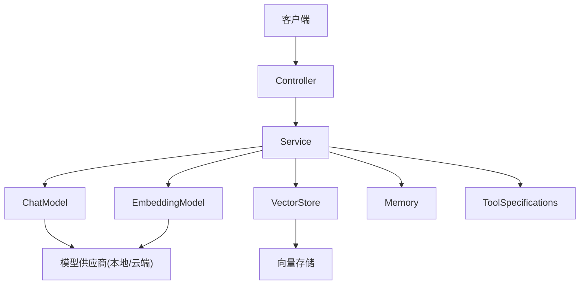

**图表来源**
- [BootIntegrationLangChain4JApp.java:1-200](file://【2】langchain4j-atguiguV5/langchain4j-03boot-integration/src/main/java/com/atguigu/study/BootIntegrationLangChain4JApp.java#L1-L200)
- [LowHighApiLangChain4JApp.java:1-200](file://【2】langchain4j-atguiguV5/langchain4j-04low-high-api/src/main/java/com/atguigu/study/LowHighApiLangChain4JApp.java#L1-L200)

## 详细组件分析

### 基础聊天（Hello World）
- 目标：展示最简化的对话流程
- 关键点：创建ChatModel，发送用户消息，接收模型回复
- 最佳实践：合理设置系统提示词，避免上下文污染；对敏感信息做脱敏处理

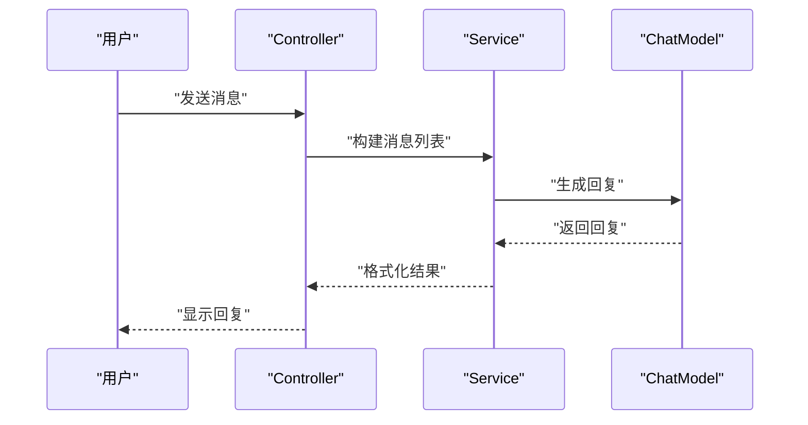

**图表来源**
- [HelloLangChain4JApp.java:1-200](file://【2】langchain4j-atguiguV5/langchain4j-01helloworld/src/main/java/com/atguigu/study/HelloLangChain4JApp.java#L1-L200)

**章节来源**
- [HelloLangChain4JApp.java:1-200](file://【2】langchain4j-atguiguV5/langchain4j-01helloworld/src/main/java/com/atguigu/study/HelloLangChain4JApp.java#L1-L200)
- [application.properties:1-100](file://【2】langchain4j-atguiguV5/langchain4j-01helloworld/src/main/resources/application.properties#L1-L100)

### 多模型集成
- 目标：在同一应用中使用多个模型供应商或不同类型的模型
- 关键点：通过配置切换模型；统一接口适配不同供应商
- 最佳实践：为不同场景选择合适模型；统一异常处理与降级策略

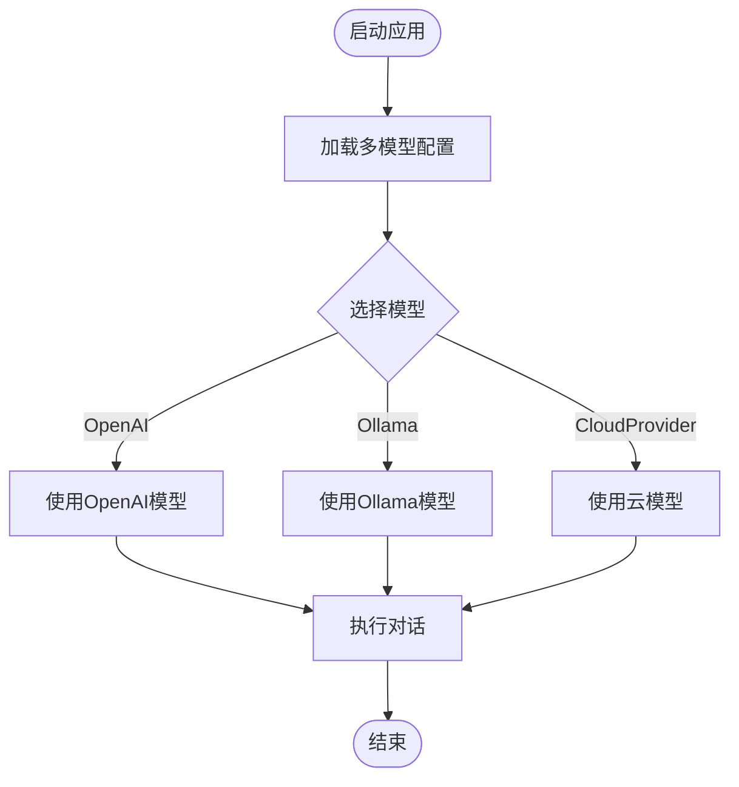

**图表来源**
- [MultiModelLangChain4JApp.java:1-200](file://【2】langchain4j-atguiguV5/langchain4j-02multi-model-together/src/main/java/com/atguigu/study/MultiModelLangChain4JApp.java#L1-L200)

**章节来源**
- [MultiModelLangChain4JApp.java:1-200](file://【2】langchain4j-atguiguV5/langchain4j-02multi-model-together/src/main/java/com/atguigu/study/MultiModelLangChain4JApp.java#L1-L200)

### Spring Boot集成
- 目标：在Spring Boot中自动装配LangChain4j组件
- 关键点：通过配置文件声明模型供应商；自动注入ChatModel/EmbeddingModel
- 最佳实践：将配置集中管理；区分开发/生产环境配置

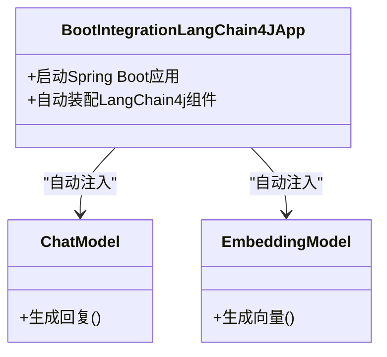

**图表来源**
- [BootIntegrationLangChain4JApp.java:1-200](file://【2】langchain4j-atguiguV5/langchain4j-03boot-integration/src/main/java/com/atguigu/study/BootIntegrationLangChain4JApp.java#L1-L200)

**章节来源**
- [BootIntegrationLangChain4JApp.java:1-200](file://【2】langchain4j-atguiguV5/langchain4j-03boot-integration/src/main/java/com/atguigu/study/BootIntegrationLangChain4JApp.java#L1-L200)

### 低层/高层API使用
- 目标：对比低层API（直接操作模型）与高层API（链式/管道）的差异
- 关键点：高层API更易组合与扩展；低层API更灵活可控
- 最佳实践：优先使用高层API简化开发；复杂场景下使用低层API微调

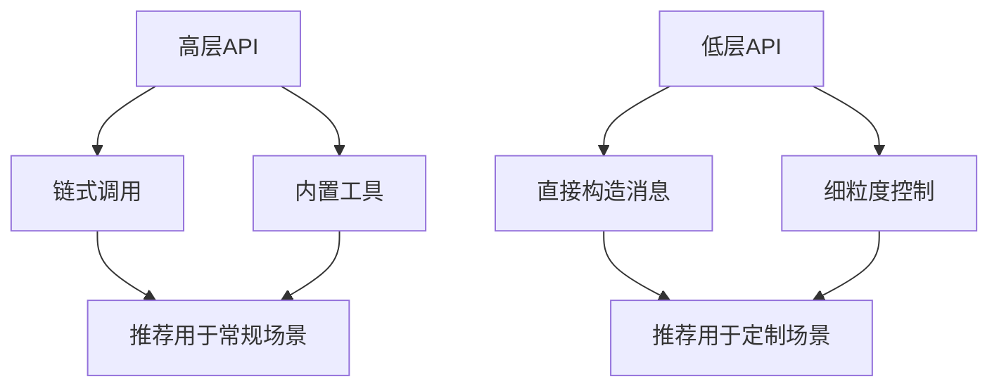

**图表来源**
- [LowHighApiLangChain4JApp.java:1-200](file://【2】langchain4j-atguiguV5/langchain4j-04low-high-api/src/main/java/com/atguigu/study/LowHighApiLangChain4JApp.java#L1-L200)

**章节来源**
- [LowHighApiLangChain4JApp.java:1-200](file://【2】langchain4j-atguiguV5/langchain4j-04low-high-api/src/main/java/com/atguigu/study/LowHighApiLangChain4JApp.java#L1-L200)

### 模型参数配置
- 目标：演示如何配置温度、最大令牌数、topP等参数
- 关键点：参数直接影响生成质量与稳定性
- 最佳实践：根据任务类型调整参数；记录参数变更与效果对比

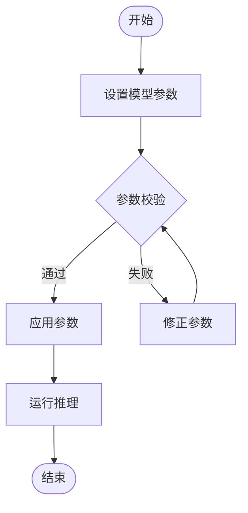

**图表来源**
- [ModelParametersLangChain4JApp.java:1-200](file://【2】langchain4j-atguiguV5/langchain4j-05model-parameters/src/main/java/com/atguigu/study/ModelParametersLangChain4JApp.java#L1-L200)

**章节来源**
- [ModelParametersLangChain4JApp.java:1-200](file://【2】langchain4j-atguiguV5/langchain4j-05model-parameters/src/main/java/com/atguigu/study/ModelParametersLangChain4JApp.java#L1-L200)

### 图像聊天
- 目标：支持图像输入的多模态对话
- 关键点：ImageModel与ChatModel协同；注意图像尺寸与格式
- 最佳实践：预处理图像；限制并发；缓存常用图像特征

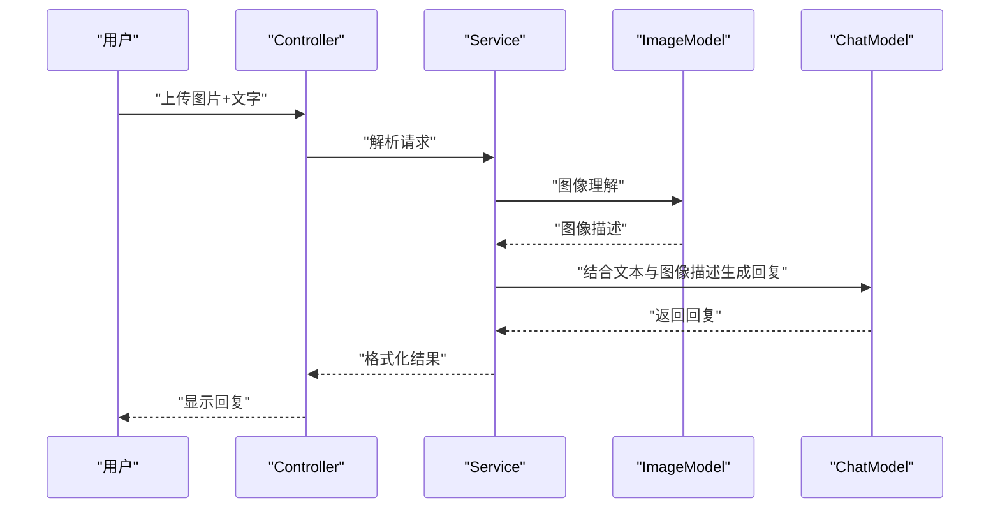

**图表来源**
- [ChatImageModelLangChain4JApp.java:1-200](file://【2】langchain4j-atguiguV5/langchain4j-06chat-image/src/main/java/com/atguigu/study/ChatImageModelLangChain4JApp.java#L1-L200)

**章节来源**
- [ChatImageModelLangChain4JApp.java:1-200](file://【2】langchain4j-atguiguV5/langchain4j-06chat-image/src/main/java/com/atguigu/study/ChatImageModelLangChain4JApp.java#L1-L200)

### 流式输出
- 目标：实现实时流式响应，提升用户体验
- 关键点：使用回调/监听器逐段推送；处理中断与重连
- 最佳实践：设置超时与重试；前端做好缓冲与拼接

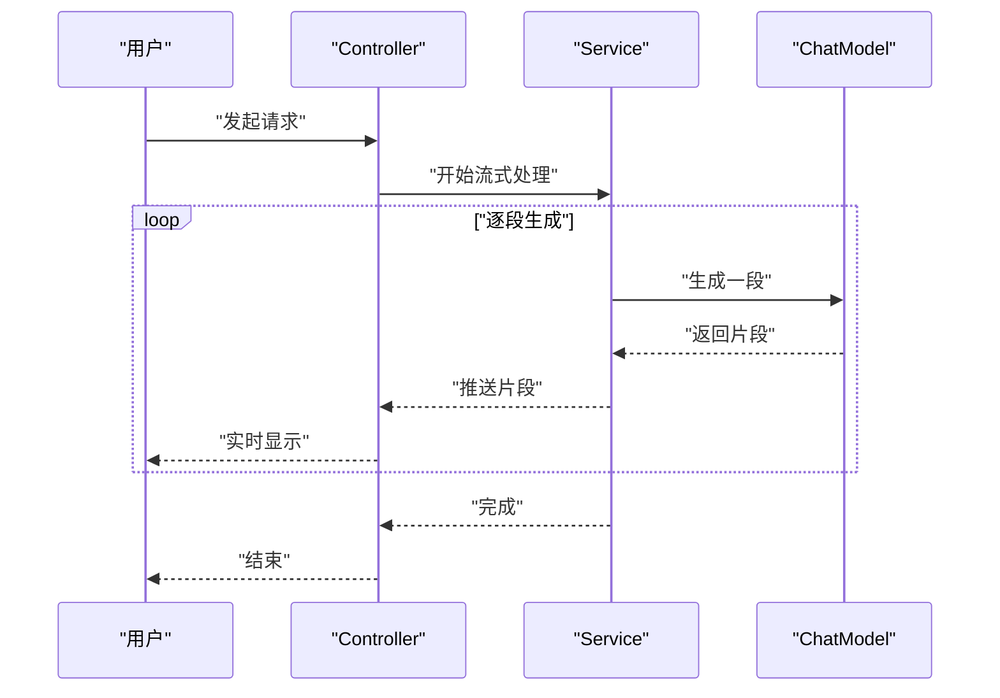

**图表来源**
- [ChatStreamLangChain4JApp.java:1-200](file://【2】langchain4j-atguiguV5/langchain4j-07chat-stream/src/main/java/com/atguigu/study/ChatStreamLangChain4JApp.java#L1-L200)

**章节来源**
- [ChatStreamLangChain4JApp.java:1-200](file://【2】langchain4j-atguiguV5/langchain4j-07chat-stream/src/main/java/com/atguigu/study/ChatStreamLangChain4JApp.java#L1-L200)

### 记忆与持久化
- 目标：维护会话历史，实现上下文延续
- 关键点：Memory存储消息；持久化保存会话；清理过期记忆
- 最佳实践：分页与压缩；区分用户会话；定期归档

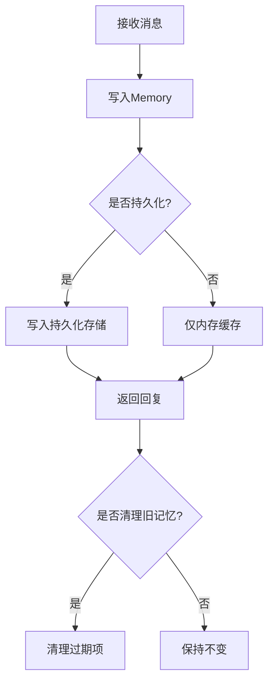

**图表来源**
- [ChatMemoryLangChain4JApp.java:1-200](file://【2】langchain4j-atguiguV5/langchain4j-08chat-memory/src/main/java/com/atguigu/study/ChatMemoryLangChain4JApp.java#L1-L200)
- [ChatPersistenceLangChain4JApp.java:1-200](file://【2】langchain4j-atguiguV5/langchain4j-10chat-persistence/src/main/java/com/atguigu/study/ChatPersistenceLangChain4JApp.java#L1-L200)

**章节来源**
- [ChatMemoryLangChain4JApp.java:1-200](file://【2】langchain4j-atguiguV5/langchain4j-08chat-memory/src/main/java/com/atguigu/study/ChatMemoryLangChain4JApp.java#L1-L200)
- [ChatPersistenceLangChain4JApp.java:1-200](file://【2】langchain4j-atguiguV5/langchain4j-10chat-persistence/src/main/java/com/atguigu/study/ChatPersistenceLangChain4JApp.java#L1-L200)

### 提示词工程
- 目标：通过精心设计的提示词提升模型表现
- 关键点：结构化提示词模板；动态参数注入；A/B测试
- 最佳实践：版本化提示词；监控命中率与满意度

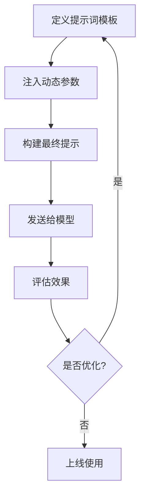

**图表来源**
- [ChatPromptLangChain4JApp.java:1-200](file://【2】langchain4j-atguiguV5/langchain4j-09chat-prompt/src/main/java/com/atguigu/study/ChatPromptLangChain4JApp.java#L1-L200)

**章节来源**
- [ChatPromptLangChain4JApp.java:1-200](file://【2】langchain4j-atguiguV5/langchain4j-09chat-prompt/src/main/java/com/atguigu/study/ChatPromptLangChain4JApp.java#L1-L200)

### 函数调用
- 目标：让模型调用外部工具/函数，扩展能力边界
- 关键点：定义ToolSpecifications；实现工具逻辑；处理错误与回滚
- 最佳实践：最小权限原则；幂等性设计；可观测性

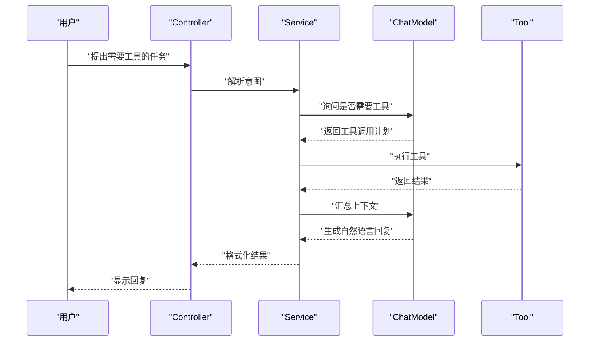

**图表来源**
- [ChatFunctioncallingLangChain4JApp.java:1-200](file://【2】langchain4j-atguiguV5/langchain4j-11chat-functioncalling/src/main/java/com/atguigu/study/ChatFunctioncallingLangChain4JApp.java#L1-L200)

**章节来源**
- [ChatFunctioncallingLangChain4JApp.java:1-200](file://【2】langchain4j-atguiguV5/langchain4j-11chat-functioncalling/src/main/java/com/atguigu/study/ChatFunctioncallingLangChain4JApp.java#L1-L200)

### 嵌入向量化
- 目标：将文本转换为向量，支撑检索与相似度计算
- 关键点：选择合适的EmbeddingModel；批量处理；向量存储
- 最佳实践：向量维度与相似度阈值调优；增量更新策略

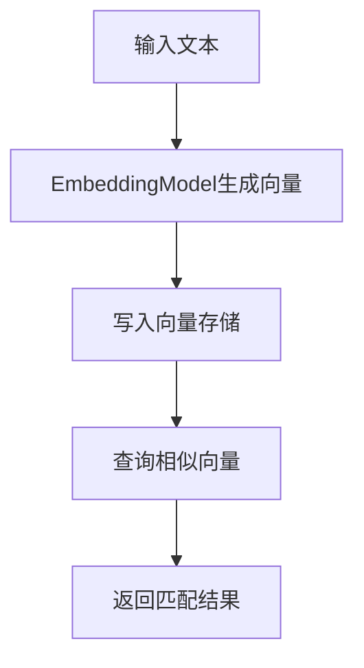

**图表来源**
- [ChatEmbeddingLangChain4JApp.java:1-200](file://【2】langchain4j-atguiguV5/langchain4j-12chat-embedding/src/main/java/com/atguigu/study/ChatEmbeddingLangChain4JApp.java#L1-L200)

**章节来源**
- [ChatEmbeddingLangChain4JApp.java:1-200](file://【2】langchain4j-atguiguV5/langchain4j-12chat-embedding/src/main/java/com/atguigu/study/ChatEmbeddingLangChain4JApp.java#L1-L200)

### RAG（检索增强生成）
- 目标：结合检索与生成，提升回答准确性
- 关键点：构建知识库；检索Top-K；拼接上下文
- 最佳实践：分块策略；去重与过滤；缓存检索结果

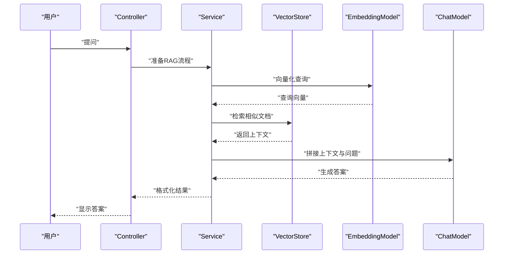

**图表来源**
- [LangChain4j-完整学习总结笔记.md:1-300](file://【2】langchain4j-atguiguV5/LangChain4j-完整学习总结笔记.md#L1-L300)

**章节来源**
- [LangChain4j-完整学习总结笔记.md:1-300](file://【2】langchain4j-atguiguV5/LangChain4j-完整学习总结笔记.md#L1-L300)

## 依赖分析
LangChain4j示例工程的依赖关系以模块化方式呈现，核心依赖集中在父pom中，各子模块按需引入。整体依赖关系如下：

```mermaid
graph TB
POM["父pom.xml"] --> M1["langchain4j-01helloworld"]
POM --> M2["langchain4j-02multi-model-together"]
POM --> M3["langchain4j-03boot-integration"]
POM --> M4["langchain4j-04low-high-api"]
POM --> M5["langchain4j-05model-parameters"]
POM --> M6["langchain4j-06chat-image"]
POM --> M7["langchain4j-07chat-stream"]
POM --> M8["langchain4j-08chat-memory"]
POM --> M9["langchain4j-09chat-prompt"]
POM --> M10["langchain4j-10chat-persistence"]
POM --> M11["langchain4j-11chat-functioncalling"]
POM --> M12["langchain4j-12chat-embedding"]
POM --> M13["langchain4j-13chat-rag01"]
POM --> M14["langchain4j-14chat-mcp"]
```

**图表来源**
- [pom.xml:1-200](file://【2】langchain4j-atguiguV5/pom.xml#L1-L200)

**章节来源**
- [pom.xml:1-200](file://【2】langchain4j-atguiguV5/pom.xml#L1-L200)

## 性能考虑
- 模型选择与参数：根据任务选择合适模型与参数，避免过度计算
- 缓存策略：对重复请求与中间结果进行缓存，减少往返
- 并发与限流：控制并发度与速率，防止下游过载
- 流式输出：优先使用流式响应，降低首字节延迟
- 向量化与检索：合理设置向量维度与相似度阈值，平衡精度与速度
- 内存与持久化：及时清理过期记忆，定期归档历史会话

## 故障排除指南
- 连接超时：检查网络与代理；增加超时时间；启用重试
- 参数错误：核对模型参数范围；使用默认参数作为基准
- 权限不足：确认API密钥与访问权限；检查白名单
- 资源耗尽：监控内存/CPU；限制并发；启用降级
- 日志与追踪：开启详细日志；统一追踪ID；聚合告警

## 结论
通过本学习指南，您已从基础聊天起步，逐步掌握了LangChain4j在多模型集成、Spring Boot集成、低/高层API、模型参数配置、图像聊天、流式输出、记忆与持久化、函数调用、嵌入向量化及RAG等领域的实践方法。建议在实际项目中结合业务场景，持续优化参数与流程，建立完善的监控与运维体系，以获得稳定且高性能的AI应用体验。

## 附录
- 示例工程路径：【2】langchain4j-atguiguV5
- 学习笔记参考：LangChain4j-完整学习总结笔记.md
- 配置文件参考：application.properties（各模块resources目录）