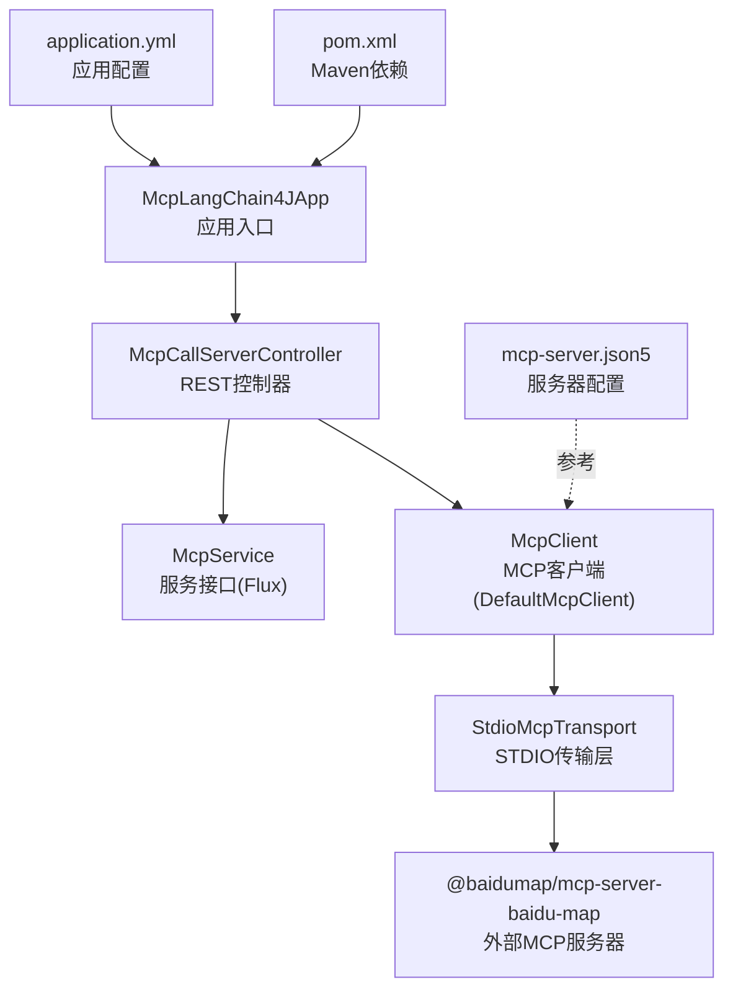
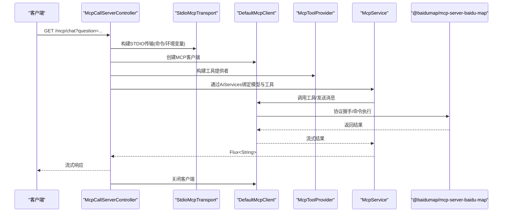
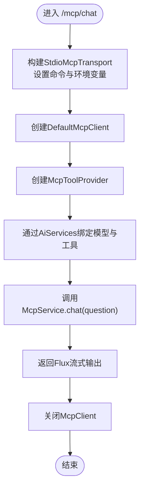
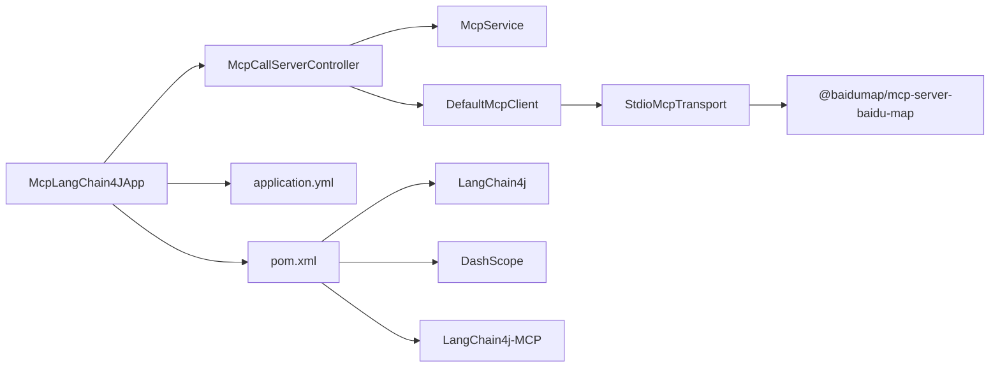

# MCP集成

<cite>
**本文引用的文件**
- [McpCallServerController.java](file://【2】langchain4j-atguiguV5/langchain4j-14chat-mcp/src/main/java/com/atguigu/study/controller/McpCallServerController.java)
- [McpService.java](file://【2】langchain4j-atguiguV5/langchain4j-14chat-mcp/src/main/java/com/atguigu/study/service/McpService.java)
- [application.yml](file://【2】langchain4j-atguiguV5/langchain4j-14chat-mcp/src/main/resources/application.yml)
- [McpLangChain4JApp.java](file://【2】langchain4j-atguiguV5/langchain4j-14chat-mcp/src/main/java/com/atguigu/study/McpLangChain4JApp.java)
- [pom.xml](file://【2】langchain4j-atguiguV5/langchain4j-14chat-mcp/pom.xml)
- [mcp-server.json5](file://【1】SpringAIAlibaba-atguiguV1/SAA-16ClientCallBaiduMcpServer/src/main/resources/mcp-server.json5)
</cite>

## 目录
1. [引言](#引言)
2. [项目结构](#项目结构)
3. [核心组件](#核心组件)
4. [架构总览](#架构总览)
5. [组件详解](#组件详解)
6. [依赖关系分析](#依赖关系分析)
7. [性能考量](#性能考量)
8. [故障排查指南](#故障排查指南)
9. [结论](#结论)
10. [附录](#附录)

## 引言
本指南围绕LangChain4j MCP（Model Context Protocol）集成模块，系统讲解MCP协议在工具调用与消息传递方面的实现方式，并结合具体代码示例，帮助读者完成MCP客户端与服务器的开发、配置与部署。文档重点覆盖：
- MCP协议工作原理与应用场景
- 客户端控制器McpCallServerController如何实现协议握手、命令执行与结果返回
- 服务接口McpService如何承载流式对话与工具调用
- application.yml中的MCP相关配置项与最佳实践
- MCP服务器配置文件mcp-server.json5的结构与用法
- MCP服务器实现示例、客户端集成方案与部署注意事项
- 协议兼容性检查、安全考虑与调试工具使用

## 项目结构
该模块位于LangChain4j示例工程中，采用Spring Boot标准目录组织，包含控制器、服务接口、配置文件与Maven依赖声明。

**图表来源**
- [McpLangChain4JApp.java:1-19](file://【2】langchain4j-atguiguV5/langchain4j-14chat-mcp/src/main/java/com/atguigu/study/McpLangChain4JApp.java#L1-L19)
- [McpCallServerController.java:1-89](file://【2】langchain4j-atguiguV5/langchain4j-14chat-mcp/src/main/java/com/atguigu/study/controller/McpCallServerController.java#L1-L89)
- [McpService.java:1-14](file://【2】langchain4j-atguiguV5/langchain4j-14chat-mcp/src/main/java/com/atguigu/study/service/McpService.java#L1-L14)
- [application.yml:1-27](file://【2】langchain4j-atguiguV5/langchain4j-14chat-mcp/src/main/resources/application.yml#L1-L27)
- [pom.xml:1-83](file://【2】langchain4j-atguiguV5/langchain4j-14chat-mcp/pom.xml#L1-L83)
- [mcp-server.json5:1-23](file://【1】SpringAIAlibaba-atguiguV1/SAA-16ClientCallBaiduMcpServer/src/main/resources/mcp-server.json5#L1-L23)

**章节来源**
- [McpLangChain4JApp.java:1-19](file://【2】langchain4j-atguiguV5/langchain4j-14chat-mcp/src/main/java/com/atguigu/study/McpLangChain4JApp.java#L1-L19)
- [application.yml:1-27](file://【2】langchain4j-atguiguV5/langchain4j-14chat-mcp/src/main/resources/application.yml#L1-L27)
- [pom.xml:1-83](file://【2】langchain4j-atguiguV5/langchain4j-14chat-mcp/pom.xml#L1-L83)

## 核心组件
- 应用入口：负责启动Spring Boot应用上下文。
- REST控制器：接收HTTP请求，构建MCP传输层与客户端，注入工具提供者，调用服务接口并返回流式响应。
- 服务接口：定义高阶API（如chat），返回Flux<String>以支持流式输出。
- 配置文件：定义服务器端口、字符集、日志级别以及第三方模型接入参数。
- Maven依赖：包含Spring Web、LangChain4j核心、DashScope接入与MCP客户端依赖。

**章节来源**
- [McpCallServerController.java:1-89](file://【2】langchain4j-atguiguV5/langchain4j-14chat-mcp/src/main/java/com/atguigu/study/controller/McpCallServerController.java#L1-L89)
- [McpService.java:1-14](file://【2】langchain4j-atguiguV5/langchain4j-14chat-mcp/src/main/java/com/atguigu/study/service/McpService.java#L1-L14)
- [application.yml:1-27](file://【2】langchain4j-atguiguV5/langchain4j-14chat-mcp/src/main/resources/application.yml#L1-L27)
- [pom.xml:1-83](file://【2】langchain4j-atguiguV5/langchain4j-14chat-mcp/pom.xml#L1-L83)

## 架构总览
下图展示了从HTTP请求到MCP服务器的完整调用链路，包括协议握手、命令执行与结果返回。

**图表来源**
- [McpCallServerController.java:43-86](file://【2】langchain4j-atguiguV5/langchain4j-14chat-mcp/src/main/java/com/atguigu/study/controller/McpCallServerController.java#L43-L86)
- [McpService.java:10-13](file://【2】langchain4j-atguiguV5/langchain4j-14chat-mcp/src/main/java/com/atguigu/study/service/McpService.java#L10-L13)

## 组件详解

### 控制器：McpCallServerController
职责与流程要点：
- 接收HTTP请求参数question，构建STDIO传输层，指定外部MCP服务器命令与环境变量（如API密钥）。
- 创建MCP客户端并注入工具提供者，随后通过AiServices绑定流式聊天模型与工具集。
- 调用服务接口的chat方法，返回Flux<String>以支持流式输出。
- 在finally块中确保MCP客户端被正确关闭，避免资源泄漏。

**图表来源**
- [McpCallServerController.java:43-86](file://【2】langchain4j-atguiguV5/langchain4j-14chat-mcp/src/main/java/com/atguigu/study/controller/McpCallServerController.java#L43-L86)

**章节来源**
- [McpCallServerController.java:1-89](file://【2】langchain4j-atguiguV5/langchain4j-14chat-mcp/src/main/java/com/atguigu/study/controller/McpCallServerController.java#L1-L89)

### 服务接口：McpService
- 定义高阶API方法chat，返回Flux<String>，便于与流式聊天模型对接。
- 作为AiServices的代理目标，由控制器注入工具提供者与模型后生成实现。

**章节来源**
- [McpService.java:1-14](file://【2】langchain4j-atguiguV5/langchain4j-14chat-mcp/src/main/java/com/atguigu/study/service/McpService.java#L1-L14)

### 应用配置：application.yml
- server.port：应用监听端口
- servlet.encoding：字符集与强制编码
- spring.application.name：应用名称
- langchain4j.community.dashscope.*：DashScope（通义千问）接入参数（API Key、模型名等）
- logging.level.dev.langchain4j：日志级别（需配合日志框架配置）

注意：当前示例未直接启用MCP专用配置项，但可通过MCP客户端与传输层进行配置。

**章节来源**
- [application.yml:1-27](file://【2】langchain4j-atguiguV5/langchain4j-14chat-mcp/src/main/resources/application.yml#L1-L27)

### Maven依赖：pom.xml
- Spring Boot Starter Web：提供Web容器与注解支持
- LangChain4j核心与OpenAI适配：提供聊天模型与工具调用能力
- DashScope Spring Boot Starter：接入阿里云百炼平台
- LangChain4j MCP：MCP客户端SDK
- Reactor实现：支持Flux流式输出
- Lombok与Hutool：辅助开发

**章节来源**
- [pom.xml:1-83](file://【2】langchain4j-atguiguV5/langchain4j-14chat-mcp/pom.xml#L1-L83)

### MCP服务器配置：mcp-server.json5
- mcpServers：服务器集合
- baidu-map：服务器别名
- command/args：启动外部MCP服务器的命令与参数（Windows CMD + npx）
- env：环境变量（如API密钥）

该文件可用于参考或在其他场景中统一管理MCP服务器配置。

**章节来源**
- [mcp-server.json5:1-23](file://【1】SpringAIAlibaba-atguiguV1/SAA-16ClientCallBaiduMcpServer/src/main/resources/mcp-server.json5#L1-L23)

## 依赖关系分析
MCP集成模块的依赖关系如下所示：

**图表来源**
- [McpLangChain4JApp.java:1-19](file://【2】langchain4j-atguiguV5/langchain4j-14chat-mcp/src/main/java/com/atguigu/study/McpLangChain4JApp.java#L1-L19)
- [McpCallServerController.java:1-89](file://【2】langchain4j-atguiguV5/langchain4j-14chat-mcp/src/main/java/com/atguigu/study/controller/McpCallServerController.java#L1-L89)
- [McpService.java:1-14](file://【2】langchain4j-atguiguV5/langchain4j-14chat-mcp/src/main/java/com/atguigu/study/service/McpService.java#L1-L14)
- [application.yml:1-27](file://【2】langchain4j-atguiguV5/langchain4j-14chat-mcp/src/main/resources/application.yml#L1-L27)
- [pom.xml:1-83](file://【2】langchain4j-atguiguV5/langchain4j-14chat-mcp/pom.xml#L1-L83)

**章节来源**
- [pom.xml:1-83](file://【2】langchain4j-atguiguV5/langchain4j-14chat-mcp/pom.xml#L1-L83)

## 性能考量
- 流式输出：通过Flux<String>实现边生成边返回，降低首字节延迟，提升用户体验。
- 资源释放：在控制器中确保MCP客户端在finally块中关闭，避免子进程与套接字资源泄露。
- 连接复用：若在同一会话内多次调用，建议复用McpClient实例，减少重复握手成本。
- 超时与重试：根据业务需求在传输层或客户端层设置合理的超时与重试策略，避免长时间阻塞。
- 日志级别：生产环境建议适度降低日志级别，避免过多I/O影响吞吐。

## 故障排查指南
- 环境变量缺失：当外部MCP服务器需要API密钥时，需确保环境变量已正确传入传输层。
- 命令不可执行：确认npx与目标包名可用，Windows环境下命令格式应匹配。
- 端口占用：检查应用端口与外部MCP服务器端口是否冲突。
- 日志定位：提高日志级别以捕获MCP握手与工具调用过程中的异常信息。
- 资源清理：若出现子进程堆积，检查finally块是否被执行，确保客户端被正确关闭。

**章节来源**
- [McpCallServerController.java:55-85](file://【2】langchain4j-atguiguV5/langchain4j-14chat-mcp/src/main/java/com/atguigu/study/controller/McpCallServerController.java#L55-L85)
- [application.yml:24-27](file://【2】langchain4j-atguiguV5/langchain4j-14chat-mcp/src/main/resources/application.yml#L24-L27)

## 结论
本指南基于LangChain4j MCP集成模块，系统阐述了MCP协议在工具调用与消息传递中的实现路径。通过控制器构建传输层与客户端、注入工具提供者并绑定流式模型，最终实现从HTTP请求到外部MCP服务器的完整调用链路。结合mcp-server.json5与application.yml的配置，开发者可以快速搭建MCP客户端并扩展到更多外部服务。

## 附录

### MCP配置项说明（基于当前示例）
- 服务器端口：server.port
- 字符集与强制编码：servlet.encoding
- 应用名称：spring.application.name
- DashScope接入参数：langchain4j.community.dashscope.*
- 日志级别：logging.level.dev.langchain4j

注意：当前示例未直接启用MCP专用配置项，但可通过MCP客户端与传输层进行配置。

**章节来源**
- [application.yml:1-27](file://【2】langchain4j-atguiguV5/langchain4j-14chat-mcp/src/main/resources/application.yml#L1-L27)

### MCP服务器实现与客户端集成建议
- 服务器实现：可参考mcp-server.json5的结构，使用npx或自研进程启动外部MCP服务器。
- 客户端集成：在控制器中构建StdioMcpTransport与DefaultMcpClient，注入工具提供者后绑定到服务接口。
- 部署注意事项：确保命令可执行、环境变量可用、网络连通性正常；生产环境建议限制命令来源与参数校验。

**章节来源**
- [mcp-server.json5:1-23](file://【1】SpringAIAlibaba-atguiguV1/SAA-16ClientCallBaiduMcpServer/src/main/resources/mcp-server.json5#L1-L23)
- [McpCallServerController.java:55-85](file://【2】langchain4j-atguiguV5/langchain4j-14chat-mcp/src/main/java/com/atguigu/study/controller/McpCallServerController.java#L55-L85)