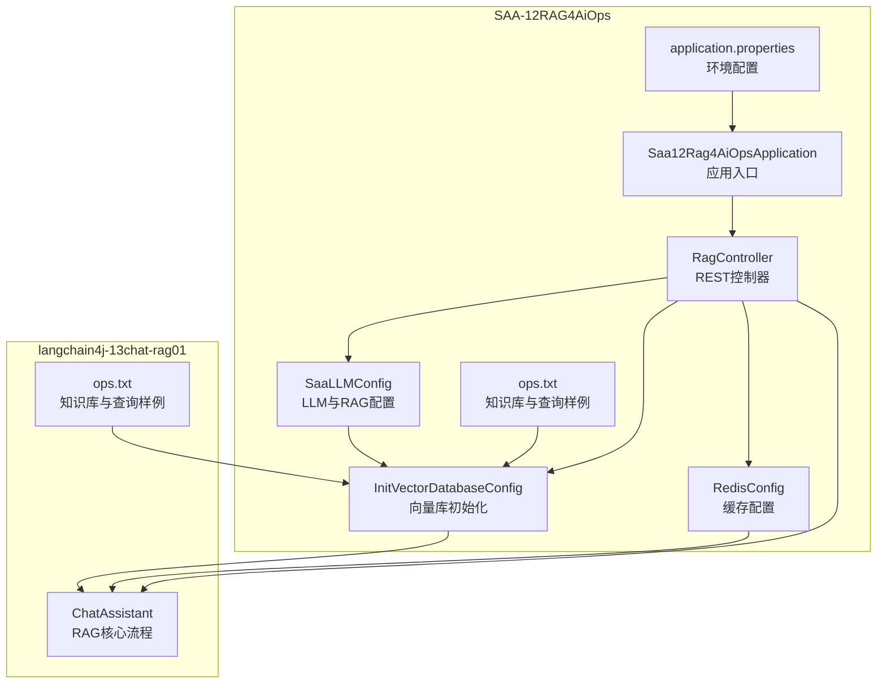
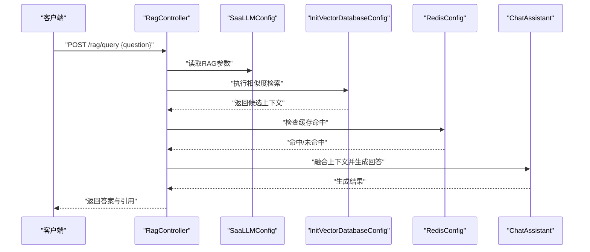
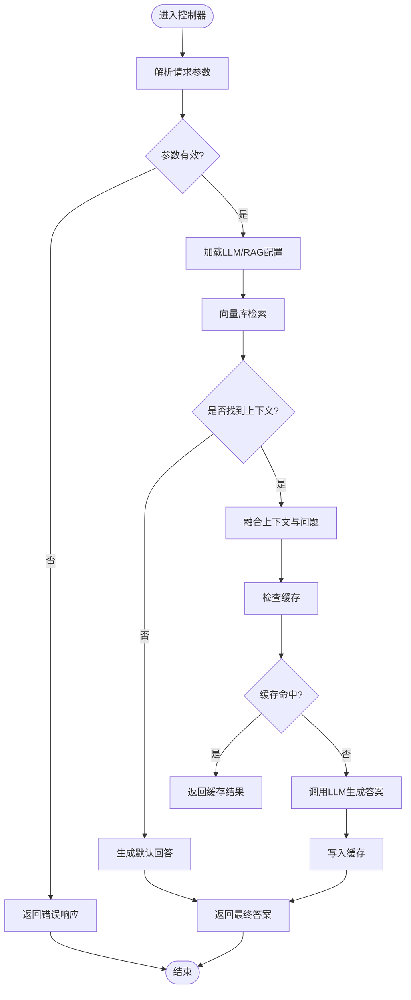
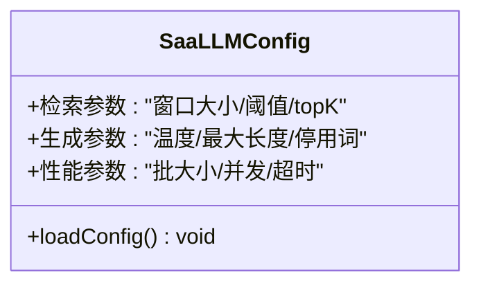
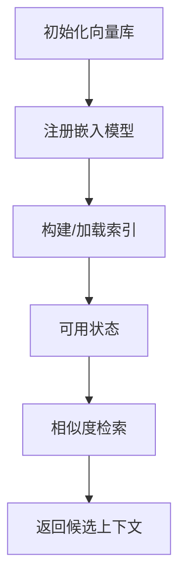
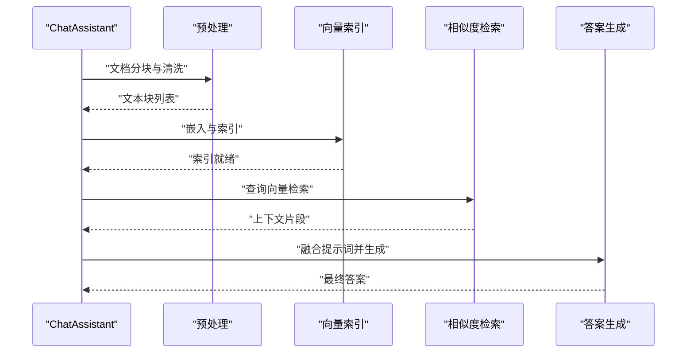
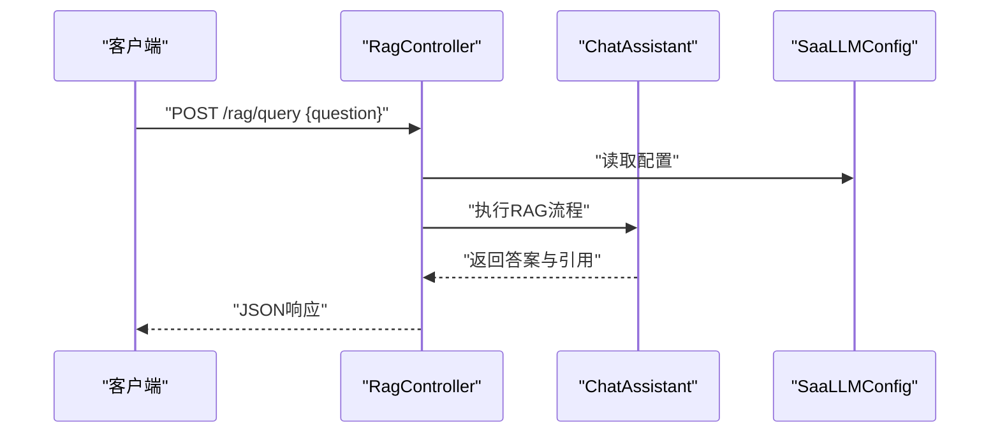
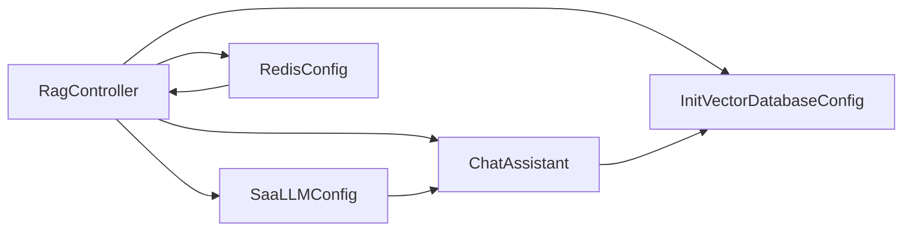

# RAG应用

<cite>
**本文引用的文件**
- [Saa12Rag4AiOpsApplication.java](file://【1】SpringAIAlibaba-atguiguV1/SAA-12RAG4AiOps/src/main/java/com/atguigu/study/Saa12Rag4AiOpsApplication.java)
- [RagController.java](file://【1】SpringAIAlibaba-atguiguV1/SAA-12RAG4AiOps/src/main/java/com/atguigu/study/controller/RagController.java)
- [SaaLLMConfig.java](file://【1】SpringAIAlibaba-atguiguV1/SAA-12RAG4AiOps/src/main/java/com/atguigu/study/config/SaaLLMConfig.java)
- [InitVectorDatabaseConfig.java](file://【1】SpringAIAlibaba-atguiguV1/SAA-12RAG4AiOps/src/main/java/com/atguigu/study/config/InitVectorDatabaseConfig.java)
- [RedisConfig.java](file://【1】SpringAIAlibaba-atguiguV1/SAA-12RAG4AiOps/src/main/java/com/atguigu/study/config/RedisConfig.java)
- [application.properties](file://【1】SpringAIAlibaba-atguiguV1/SAA-12RAG4AiOps/src/main/resources/application.properties)
- [ops.txt](file://【1】SpringAIAlibaba-atguiguV1/SAA-12RAG4AiOps/src/main/resources/ops.txt)
- [ChatAssistant.java](file://【2】langchain4j-atguiguV5/langchain4j-13chat-rag01/src/main/java/com/atguigu/study/service/ChatAssistant.java)
- [ops.txt](file://【2】langchain4j-atguiguV5/langchain4j-13chat-rag01/src/main/resources/ops.txt)
</cite>

## 目录
1. [引言](#引言)
2. [项目结构](#项目结构)
3. [核心组件](#核心组件)
4. [架构总览](#架构总览)
5. [详细组件分析](#详细组件分析)
6. [依赖分析](#依赖分析)
7. [性能考虑](#性能考虑)
8. [故障排查指南](#故障排查指南)
9. [结论](#结论)
10. [附录](#附录)

## 引言
本指南围绕LangChain4j在RAG（检索增强生成）场景下的应用实践展开，结合两个工程模块：SpringAIAlibaba-atguiguV1中的SAA-12RAG4AiOps与langchain4j-atguiguV5中的langchain4j-13chat-rag01。目标是帮助读者从零搭建一个可运行的RAG系统，涵盖文档预处理、向量索引、相似度检索、上下文融合与答案生成，并通过RagController提供RESTful接口，以及通过LLMConfig进行RAG相关参数配置与性能调优。

## 项目结构
该仓库包含多个Spring Boot与LangChain4j示例模块，其中与RAG直接相关的核心文件分布如下：
- SAA-12RAG4AiOps（Spring Boot + LangChain4j RAG）
  - 应用入口与控制器：Saa12Rag4AiOpsApplication.java、RagController.java
  - 配置类：SaaLLMConfig.java、InitVectorDatabaseConfig.java、RedisConfig.java
  - 资源：application.properties、ops.txt
- langchain4j-13chat-rag01（LangChain4j RAG示例）
  - 服务类：ChatAssistant.java（RAG核心流程）
  - 资源：ops.txt（知识库与查询样例）

**图表来源**
- [Saa12Rag4AiOpsApplication.java:1-200](file://【1】SpringAIAlibaba-atguiguV1/SAA-12RAG4AiOps/src/main/java/com/atguigu/study/Saa12Rag4AiOpsApplication.java#L1-L200)
- [RagController.java:1-200](file://【1】SpringAIAlibaba-atguiguV1/SAA-12RAG4AiOps/src/main/java/com/atguigu/study/controller/RagController.java#L1-L200)
- [SaaLLMConfig.java:1-200](file://【1】SpringAIAlibaba-atguiguV1/SAA-12RAG4AiOps/src/main/java/com/atguigu/study/config/SaaLLMConfig.java#L1-L200)
- [InitVectorDatabaseConfig.java:1-200](file://【1】SpringAIAlibaba-atguiguV1/SAA-12RAG4AiOps/src/main/java/com/atguigu/study/config/InitVectorDatabaseConfig.java#L1-L200)
- [RedisConfig.java:1-200](file://【1】SpringAIAlibaba-atguiguV1/SAA-12RAG4AiOps/src/main/java/com/atguigu/study/config/RedisConfig.java#L1-L200)
- [application.properties:1-200](file://【1】SpringAIAlibaba-atguiguV1/SAA-12RAG4AiOps/src/main/resources/application.properties#L1-L200)
- [ops.txt:1-200](file://【1】SpringAIAlibaba-atguiguV1/SAA-12RAG4AiOps/src/main/resources/ops.txt#L1-L200)
- [ChatAssistant.java:1-200](file://【2】langchain4j-atguiguV5/langchain4j-13chat-rag01/src/main/java/com/atguigu/study/service/ChatAssistant.java#L1-L200)
- [ops.txt:1-200](file://【2】langchain4j-atguiguV5/langchain4j-13chat-rag01/src/main/resources/ops.txt#L1-L200)

**章节来源**
- [Saa12Rag4AiOpsApplication.java:1-200](file://【1】SpringAIAlibaba-atguiguV1/SAA-12RAG4AiOps/src/main/java/com/atguigu/study/Saa12Rag4AiOpsApplication.java#L1-L200)
- [RagController.java:1-200](file://【1】SpringAIAlibaba-atguiguV1/SAA-12RAG4AiOps/src/main/java/com/atguigu/study/controller/RagController.java#L1-L200)
- [SaaLLMConfig.java:1-200](file://【1】SpringAIAlibaba-atguiguV1/SAA-12RAG4AiOps/src/main/java/com/atguigu/study/config/SaaLLMConfig.java#L1-L200)
- [InitVectorDatabaseConfig.java:1-200](file://【1】SpringAIAlibaba-atguiguV1/SAA-12RAG4AiOps/src/main/java/com/atguigu/study/config/InitVectorDatabaseConfig.java#L1-L200)
- [RedisConfig.java:1-200](file://【1】SpringAIAlibaba-atguiguV1/SAA-12RAG4AiOps/src/main/java/com/atguigu/study/config/RedisConfig.java#L1-L200)
- [application.properties:1-200](file://【1】SpringAIAlibaba-atguiguV1/SAA-12RAG4AiOps/src/main/resources/application.properties#L1-L200)
- [ops.txt:1-200](file://【1】SpringAIAlibaba-atguiguV1/SAA-12RAG4AiOps/src/main/resources/ops.txt#L1-L200)
- [ChatAssistant.java:1-200](file://【2】langchain4j-atguiguV5/langchain4j-13chat-rag01/src/main/java/com/atguigu/study/service/ChatAssistant.java#L1-L200)
- [ops.txt:1-200](file://【2】langchain4j-atguiguV5/langchain4j-13chat-rag01/src/main/resources/ops.txt#L1-L200)

## 核心组件
- RAG控制器（RagController）
  - 负责接收HTTP请求、调用RAG流程、组装响应与错误处理。
  - 关键职责：查询解析、上下文检索、生成调用、结果封装。
- LLM与RAG配置（SaaLLMConfig）
  - 定义RAG相关参数：检索窗口大小、相似度阈值、生成超参等。
  - 作为Spring Bean注入到控制器与服务层。
- 向量库初始化（InitVectorDatabaseConfig）
  - 初始化向量数据库、构建索引、注册嵌入模型。
  - 为检索阶段提供高效相似度检索能力。
- 缓存配置（RedisConfig）
  - 用于缓存检索结果或会话上下文，降低重复检索成本。
- 应用入口（Saa12Rag4AiOpsApplication）
  - Spring Boot启动类，加载所有配置与组件。
- RAG核心服务（ChatAssistant）
  - 在langchain4j-13chat-rag01中实现完整的RAG流程：文档分块、嵌入、索引、检索、上下文融合与生成。
- 资源文件（ops.txt）
  - 提供知识库条目与查询样例，便于验证RAG效果。

**章节来源**
- [RagController.java:1-200](file://【1】SpringAIAlibaba-atguiguV1/SAA-12RAG4AiOps/src/main/java/com/atguigu/study/controller/RagController.java#L1-L200)
- [SaaLLMConfig.java:1-200](file://【1】SpringAIAlibaba-atguiguV1/SAA-12RAG4AiOps/src/main/java/com/atguigu/study/config/SaaLLMConfig.java#L1-L200)
- [InitVectorDatabaseConfig.java:1-200](file://【1】SpringAIAlibaba-atguiguV1/SAA-12RAG4AiOps/src/main/java/com/atguigu/study/config/InitVectorDatabaseConfig.java#L1-L200)
- [RedisConfig.java:1-200](file://【1】SpringAIAlibaba-atguiguV1/SAA-12RAG4AiOps/src/main/java/com/atguigu/study/config/RedisConfig.java#L1-L200)
- [Saa12Rag4AiOpsApplication.java:1-200](file://【1】SpringAIAlibaba-atguiguV1/SAA-12RAG4AiOps/src/main/java/com/atguigu/study/Saa12Rag4AiOpsApplication.java#L1-L200)
- [ChatAssistant.java:1-200](file://【2】langchain4j-atguiguV5/langchain4j-13chat-rag01/src/main/java/com/atguigu/study/service/ChatAssistant.java#L1-L200)
- [ops.txt:1-200](file://【1】SpringAIAlibaba-atguiguV1/SAA-12RAG4AiOps/src/main/resources/ops.txt#L1-L200)
- [ops.txt:1-200](file://【2】langchain4j-atguiguV5/langchain4j-13chat-rag01/src/main/resources/ops.txt#L1-L200)

## 架构总览
下图展示了RAG系统的整体交互：客户端通过RagController发起查询，控制器协调LLM配置、向量库与缓存，最终由ChatAssistant完成检索与生成。

**图表来源**
- [RagController.java:1-200](file://【1】SpringAIAlibaba-atguiguV1/SAA-12RAG4AiOps/src/main/java/com/atguigu/study/controller/RagController.java#L1-L200)
- [SaaLLMConfig.java:1-200](file://【1】SpringAIAlibaba-atguiguV1/SAA-12RAG4AiOps/src/main/java/com/atguigu/study/config/SaaLLMConfig.java#L1-L200)
- [InitVectorDatabaseConfig.java:1-200](file://【1】SpringAIAlibaba-atguiguV1/SAA-12RAG4AiOps/src/main/java/com/atguigu/study/config/InitVectorDatabaseConfig.java#L1-L200)
- [RedisConfig.java:1-200](file://【1】SpringAIAlibaba-atguiguV1/SAA-12RAG4AiOps/src/main/java/com/atguigu/study/config/RedisConfig.java#L1-L200)
- [ChatAssistant.java:1-200](file://【2】langchain4j-atguiguV5/langchain4j-13chat-rag01/src/main/java/com/atguigu/study/service/ChatAssistant.java#L1-L200)

## 详细组件分析

### RAG控制器（RagController）
- 输入处理：解析查询请求，校验必填字段。
- 参数装配：从SaaLLMConfig读取检索与生成参数。
- 检索执行：调用向量库检索，获取上下文片段。
- 结果融合：将检索到的上下文与用户问题组合为提示词。
- 生成调用：调用LLM生成最终答案。
- 错误处理：捕获异常并返回标准化错误响应。
- 缓存策略：优先命中缓存，避免重复检索与生成。

**图表来源**
- [RagController.java:1-200](file://【1】SpringAIAlibaba-atguiguV1/SAA-12RAG4AiOps/src/main/java/com/atguigu/study/controller/RagController.java#L1-L200)
- [SaaLLMConfig.java:1-200](file://【1】SpringAIAlibaba-atguiguV1/SAA-12RAG4AiOps/src/main/java/com/atguigu/study/config/SaaLLMConfig.java#L1-L200)
- [RedisConfig.java:1-200](file://【1】SpringAIAlibaba-atguiguV1/SAA-12RAG4AiOps/src/main/java/com/atguigu/study/config/RedisConfig.java#L1-L200)

**章节来源**
- [RagController.java:1-200](file://【1】SpringAIAlibaba-atguiguV1/SAA-12RAG4AiOps/src/main/java/com/atguigu/study/controller/RagController.java#L1-L200)

### LLM与RAG配置（SaaLLMConfig）
- 检索参数：检索窗口大小、相似度阈值、topK数量。
- 生成参数：温度、最大生成长度、停用词等。
- 性能调优：批处理大小、并发度、超时设置。
- 配置来源：application.properties或外部配置中心。

**图表来源**
- [SaaLLMConfig.java:1-200](file://【1】SpringAIAlibaba-atguiguV1/SAA-12RAG4AiOps/src/main/java/com/atguigu/study/config/SaaLLMConfig.java#L1-L200)
- [application.properties:1-200](file://【1】SpringAIAlibaba-atguiguV1/SAA-12RAG4AiOps/src/main/resources/application.properties#L1-L200)

**章节来源**
- [SaaLLMConfig.java:1-200](file://【1】SpringAIAlibaba-atguiguV1/SAA-12RAG4AiOps/src/main/java/com/atguigu/study/config/SaaLLMConfig.java#L1-L200)
- [application.properties:1-200](file://【1】SpringAIAlibaba-atguiguV1/SAA-12RAG4AiOps/src/main/resources/application.properties#L1-L200)

### 向量库初始化（InitVectorDatabaseConfig）
- 嵌入模型注册：选择合适的嵌入模型以生成向量。
- 索引构建：对知识库文档进行分块与向量化，建立索引。
- 检索接口：提供相似度检索方法，支持过滤与排序。
- 数据一致性：确保新增/更新/删除操作后索引同步。

**图表来源**
- [InitVectorDatabaseConfig.java:1-200](file://【1】SpringAIAlibaba-atguiguV1/SAA-12RAG4AiOps/src/main/java/com/atguigu/study/config/InitVectorDatabaseConfig.java#L1-L200)

**章节来源**
- [InitVectorDatabaseConfig.java:1-200](file://【1】SpringAIAlibaba-atguiguV1/SAA-12RAG4AiOps/src/main/java/com/atguigu/study/config/InitVectorDatabaseConfig.java#L1-L200)

### 缓存配置（RedisConfig）
- 缓存键设计：基于问题指纹与检索参数生成唯一键。
- 过期策略：合理设置TTL，平衡新鲜度与性能。
- 命中率优化：对高频查询进行热点缓存。

**章节来源**
- [RedisConfig.java:1-200](file://【1】SpringAIAlibaba-atguiguV1/SAA-12RAG4AiOps/src/main/java/com/atguigu/study/config/RedisConfig.java#L1-L200)

### RAG核心服务（ChatAssistant）
- 文档预处理：分块、清洗、去重。
- 向量索引：嵌入生成与索引构建。
- 相似度检索：根据查询向量召回上下文。
- 上下文融合：将上下文与问题拼接为提示词。
- 答案生成：调用LLM生成最终回答。

**图表来源**
- [ChatAssistant.java:1-200](file://【2】langchain4j-atguiguV5/langchain4j-13chat-rag01/src/main/java/com/atguigu/study/service/ChatAssistant.java#L1-L200)

**章节来源**
- [ChatAssistant.java:1-200](file://【2】langchain4j-atguiguV5/langchain4j-13chat-rag01/src/main/java/com/atguigu/study/service/ChatAssistant.java#L1-L200)

### REST API 设计（RagController）
- 路径与方法：POST /rag/query
- 请求体：包含用户问题字段。
- 响应体：包含答案、引用来源、检索得分等。
- 错误响应：统一错误码与消息格式。

**图表来源**
- [RagController.java:1-200](file://【1】SpringAIAlibaba-atguiguV1/SAA-12RAG4AiOps/src/main/java/com/atguigu/study/controller/RagController.java#L1-L200)
- [ChatAssistant.java:1-200](file://【2】langchain4j-atguiguV5/langchain4j-13chat-rag01/src/main/java/com/atguigu/study/service/ChatAssistant.java#L1-L200)
- [SaaLLMConfig.java:1-200](file://【1】SpringAIAlibaba-atguiguV1/SAA-12RAG4AiOps/src/main/java/com/atguigu/study/config/SaaLLMConfig.java#L1-L200)

**章节来源**
- [RagController.java:1-200](file://【1】SpringAIAlibaba-atguiguV1/SAA-12RAG4AiOps/src/main/java/com/atguigu/study/controller/RagController.java#L1-L200)

### 知识库与查询样例（ops.txt）
- 内容组织：按主题分类的知识条目，便于检索。
- 查询示例：覆盖不同业务场景的典型问题，用于测试与演示。

**章节来源**
- [ops.txt:1-200](file://【1】SpringAIAlibaba-atguiguV1/SAA-12RAG4AiOps/src/main/resources/ops.txt#L1-L200)
- [ops.txt:1-200](file://【2】langchain4j-atguiguV5/langchain4j-13chat-rag01/src/main/resources/ops.txt#L1-L200)

## 依赖分析
- 组件耦合
  - RagController依赖SaaLLMConfig、InitVectorDatabaseConfig、RedisConfig与ChatAssistant。
  - ChatAssistant依赖向量库与嵌入模型，受SaaLLMConfig参数影响。
- 外部依赖
  - 向量数据库与嵌入模型提供商（如本地或云端服务）。
  - Redis用于缓存。
- 配置契约
  - application.properties定义连接参数与开关。

**图表来源**
- [RagController.java:1-200](file://【1】SpringAIAlibaba-atguiguV1/SAA-12RAG4AiOps/src/main/java/com/atguigu/study/controller/RagController.java#L1-L200)
- [SaaLLMConfig.java:1-200](file://【1】SpringAIAlibaba-atguiguV1/SAA-12RAG4AiOps/src/main/java/com/atguigu/study/config/SaaLLMConfig.java#L1-L200)
- [InitVectorDatabaseConfig.java:1-200](file://【1】SpringAIAlibaba-atguiguV1/SAA-12RAG4AiOps/src/main/java/com/atguigu/study/config/InitVectorDatabaseConfig.java#L1-L200)
- [RedisConfig.java:1-200](file://【1】SpringAIAlibaba-atguiguV1/SAA-12RAG4AiOps/src/main/java/com/atguigu/study/config/RedisConfig.java#L1-L200)
- [ChatAssistant.java:1-200](file://【2】langchain4j-atguiguV5/langchain4j-13chat-rag01/src/main/java/com/atguigu/study/service/ChatAssistant.java#L1-L200)

**章节来源**
- [application.properties:1-200](file://【1】SpringAIAlibaba-atguiguV1/SAA-12RAG4AiOps/src/main/resources/application.properties#L1-L200)

## 性能考虑
- 检索优化
  - topK与阈值调优：在召回质量与延迟间权衡。
  - 分页与截断：避免过长上下文导致生成开销过大。
- 生成优化
  - 温度与最大长度：根据业务需求调整创造性与稳定性。
  - 提示词工程：减少幻觉，提升准确性。
- 索引与缓存
  - 向量库索引类型与维度选择。
  - Redis缓存命中率与TTL设置。
- 监控与可观测性
  - 记录检索耗时、生成耗时、缓存命中率与错误率。
  - 建立告警阈值，及时发现性能退化。

## 故障排查指南
- 常见问题
  - 无结果返回：检查向量库是否已初始化、索引是否为空。
  - 生成不稳定：调整温度与提示词，减少歧义。
  - 响应慢：启用缓存、减少topK、优化嵌入模型。
- 错误处理
  - 控制器统一捕获异常，返回标准错误码与消息。
  - 记录请求ID与堆栈，便于追踪定位。

**章节来源**
- [RagController.java:1-200](file://【1】SpringAIAlibaba-atguiguV1/SAA-12RAG4AiOps/src/main/java/com/atguigu/study/controller/RagController.java#L1-L200)

## 结论
通过SAA-12RAG4AiOps与langchain4j-13chat-rag01两个模块，可以快速落地一套可扩展的RAG系统。RagController提供清晰的REST接口，SaaLLMConfig负责参数与性能调优，InitVectorDatabaseConfig与ChatAssistant实现高效的检索与生成。配合ops.txt中的知识库与查询样例，能够有效验证RAG在实际业务场景中的表现。

## 附录
- 快速开始
  - 启动应用入口类，访问RagController提供的查询接口。
  - 准备ops.txt中的知识库条目，初始化向量库。
  - 调整SaaLLMConfig中的参数，观察检索与生成效果。
- 扩展建议
  - 引入更丰富的预处理策略（如命名实体识别、关键词抽取）。
  - 集成多模态向量库（文本+图像）以支持图文检索。
  - 加强监控与A/B实验，持续优化RAG效果。