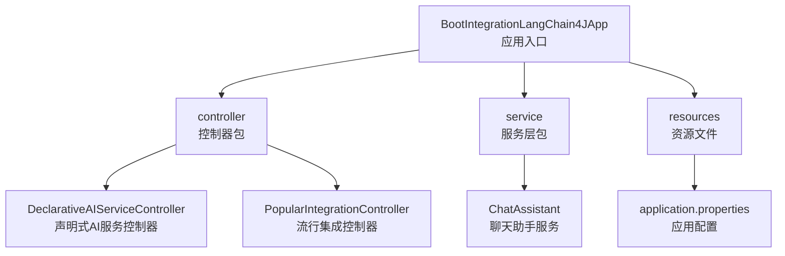
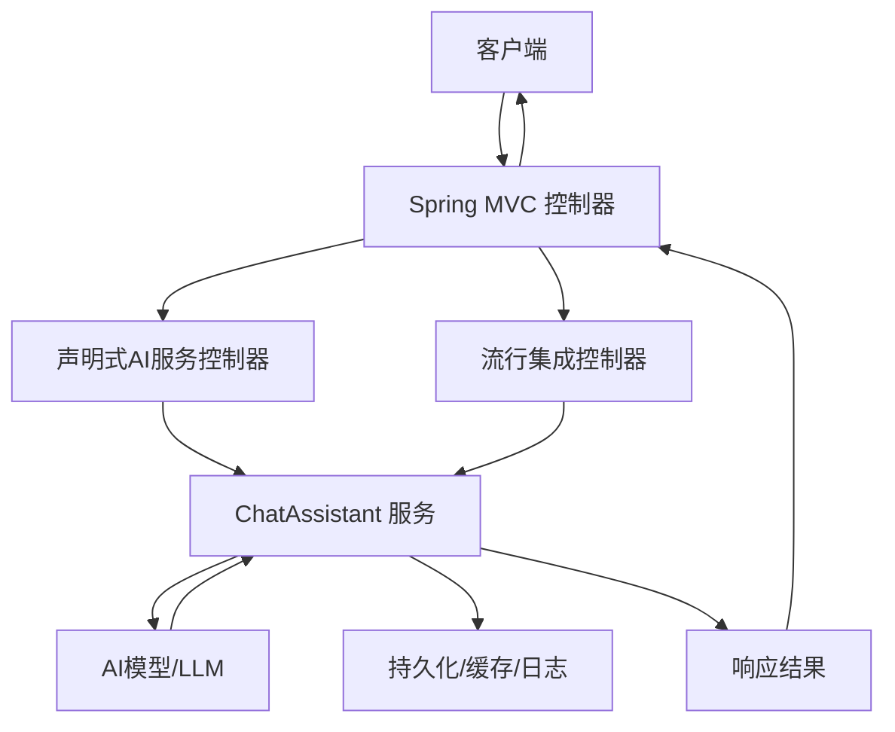
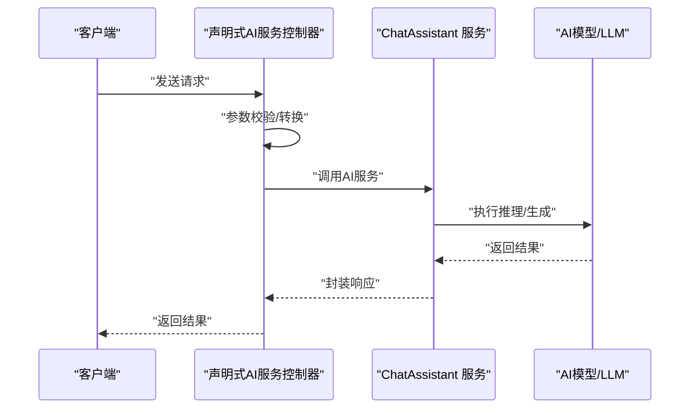
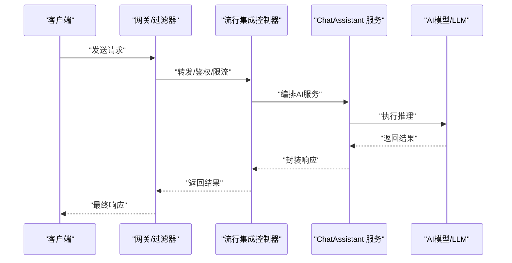
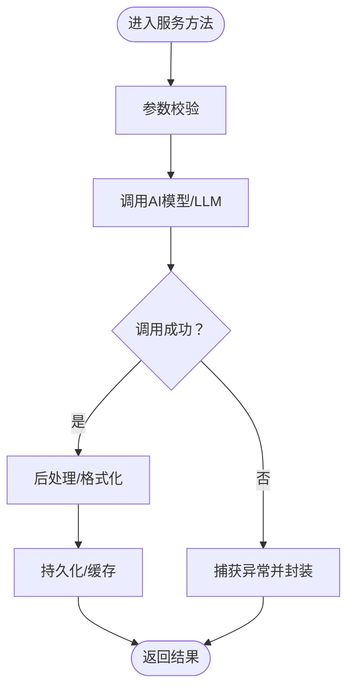
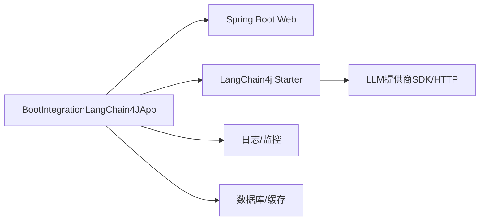

# Spring Boot集成

<cite>
**本文引用的文件**
- [BootIntegrationLangChain4JApp.java](file://【2】langchain4j-atguiguV5/langchain4j-03boot-integration/src/main/java/com/atguigu/study/BootIntegrationLangChain4JApp.java)
- [DeclarativeAIServiceController.java](file://【2】langchain4j-atguiguV5/langchain4j-03boot-integration/src/main/java/com/atguigu/study/controller/DeclarativeAIServiceController.java)
- [PopularIntegrationController.java](file://【2】langchain4j-atguiguV5/langchain4j-03boot-integration/src/main/java/com/atguigu/study/controller/PopularIntegrationController.java)
- [ChatAssistant.java](file://【2】langchain4j-atguiguV5/langchain4j-03boot-integration/src/main/java/com/atguigu/study/service/ChatAssistant.java)
- [application.properties](file://【2】langchain4j-atguiguV5/langchain4j-03boot-integration/src/main/resources/application.properties)
- [pom.xml](file://【2】langchain4j-atguiguV5/langchain4j-03boot-integration/pom.xml)
</cite>

## 目录
1. [引言](#引言)
2. [项目结构](#项目结构)
3. [核心组件](#核心组件)
4. [架构总览](#架构总览)
5. [详细组件分析](#详细组件分析)
6. [依赖分析](#依赖分析)
7. [性能考虑](#性能考虑)
8. [故障排查指南](#故障排查指南)
9. [结论](#结论)
10. [附录](#附录)

## 引言
本指南聚焦于LangChain4j与Spring Boot的集成实践，围绕“声明式AI服务控制器”与“流行集成控制器”两种模式，系统讲解自动配置、Bean管理与依赖注入最佳实践；并通过ChatAssistant服务类展示企业级AI功能的服务层设计、异常处理与事务管理策略；最后提供配置示例、启动流程与部署建议，帮助开发者构建生产级别的AI应用。

## 项目结构
该模块位于LangChain4j示例工程中的“boot集成”子项目，采用标准Spring Boot目录结构，包含应用入口、控制器与服务层，以及资源配置文件。

**图表来源**
- [BootIntegrationLangChain4JApp.java:1-200](file://【2】langchain4j-atguiguV5/langchain4j-03boot-integration/src/main/java/com/atguigu/study/BootIntegrationLangChain4JApp.java#L1-L200)
- [DeclarativeAIServiceController.java:1-200](file://【2】langchain4j-atguiguV5/langchain4j-03boot-integration/src/main/java/com/atguigu/study/controller/DeclarativeAIServiceController.java#L1-L200)
- [PopularIntegrationController.java:1-200](file://【2】langchain4j-atguiguV5/langchain4j-03boot-integration/src/main/java/com/atguigu/study/controller/PopularIntegrationController.java#L1-L200)
- [ChatAssistant.java:1-200](file://【2】langchain4j-atguiguV5/langchain4j-03boot-integration/src/main/java/com/atguigu/study/service/ChatAssistant.java#L1-L200)
- [application.properties:1-200](file://【2】langchain4j-atguiguV5/langchain4j-03boot-integration/src/main/resources/application.properties#L1-L200)

**章节来源**
- [BootIntegrationLangChain4JApp.java:1-200](file://【2】langchain4j-atguiguV5/langchain4j-03boot-integration/src/main/java/com/atguigu/study/BootIntegrationLangChain4JApp.java#L1-L200)
- [application.properties:1-200](file://【2】langchain4j-atguiguV5/langchain4j-03boot-integration/src/main/resources/application.properties#L1-L200)

## 核心组件
- 应用入口：负责引导Spring Boot容器与加载配置。
- 控制器层：
  - 声明式AI服务控制器：以声明式方式暴露AI能力，便于快速集成与测试。
  - 流行集成控制器：面向常见集成场景的控制器封装，强调易用性与可扩展性。
- 服务层：
  - 聊天助手服务：封装AI交互逻辑，提供统一的业务方法，便于复用与测试。
- 配置层：
  - 应用配置：集中管理模型参数、连接信息与行为开关等。

**章节来源**
- [DeclarativeAIServiceController.java:1-200](file://【2】langchain4j-atguiguV5/langchain4j-03boot-integration/src/main/java/com/atguigu/study/controller/DeclarativeAIServiceController.java#L1-L200)
- [PopularIntegrationController.java:1-200](file://【2】langchain4j-atguiguV5/langchain4j-03boot-integration/src/main/java/com/atguigu/study/controller/PopularIntegrationController.java#L1-L200)
- [ChatAssistant.java:1-200](file://【2】langchain4j-atguiguV5/langchain4j-03boot-integration/src/main/java/com/atguigu/study/service/ChatAssistant.java#L1-L200)

## 架构总览
下图展示了从HTTP请求到AI服务再到持久化或外部系统的典型调用链路，体现声明式与流行集成两种模式在架构上的差异与共性。

**图表来源**
- [DeclarativeAIServiceController.java:1-200](file://【2】langchain4j-atguiguV5/langchain4j-03boot-integration/src/main/java/com/atguigu/study/controller/DeclarativeAIServiceController.java#L1-L200)
- [PopularIntegrationController.java:1-200](file://【2】langchain4j-atguiguV5/langchain4j-03boot-integration/src/main/java/com/atguigu/study/controller/PopularIntegrationController.java#L1-L200)
- [ChatAssistant.java:1-200](file://【2】langchain4j-atguiguV5/langchain4j-03boot-integration/src/main/java/com/atguigu/study/service/ChatAssistant.java#L1-L200)

## 详细组件分析

### 声明式AI服务控制器（DeclarativeAIServiceController）
- 设计要点
  - 以声明式方式定义AI服务端点，简化控制器职责，突出业务语义。
  - 将输入校验、参数转换与响应封装集中在控制器层，便于统一治理。
- 典型流程
  - 客户端发起请求 → 控制器接收并校验 → 调用服务层执行AI逻辑 → 返回标准化结果。
- 适用场景
  - 快速原型与内部工具集成，强调“即插即用”的开发体验。
- 优缺点
  - 优点：上手快、代码简洁、易于测试。
  - 缺点：对复杂业务编排与跨域协作支持有限，扩展性受声明式约束。

**图表来源**
- [DeclarativeAIServiceController.java:1-200](file://【2】langchain4j-atguiguV5/langchain4j-03boot-integration/src/main/java/com/atguigu/study/controller/DeclarativeAIServiceController.java#L1-L200)
- [ChatAssistant.java:1-200](file://【2】langchain4j-atguiguV5/langchain4j-03boot-integration/src/main/java/com/atguigu/study/service/ChatAssistant.java#L1-L200)

**章节来源**
- [DeclarativeAIServiceController.java:1-200](file://【2】langchain4j-atguiguV5/langchain4j-03boot-integration/src/main/java/com/atguigu/study/controller/DeclarativeAIServiceController.java#L1-L200)

### 流行集成控制器（PopularIntegrationController）
- 设计要点
  - 面向常见集成场景进行封装，提供更灵活的扩展点与中间件接入能力。
  - 在控制器层引入拦截、限流、熔断等横切关注点，提升系统韧性。
- 典型流程
  - 请求进入 → 中间件/拦截器处理 → 控制器编排 → 服务层执行 → 结果回传。
- 适用场景
  - 需要与网关、监控、安全等基础设施协同的企业级应用。
- 优缺点
  - 优点：扩展性强、生态友好、可观测性好。
  - 缺点：学习成本较高，初期开发复杂度上升。

**图表来源**
- [PopularIntegrationController.java:1-200](file://【2】langchain4j-atguiguV5/langchain4j-03boot-integration/src/main/java/com/atguigu/study/controller/PopularIntegrationController.java#L1-L200)
- [ChatAssistant.java:1-200](file://【2】langchain4j-atguiguV5/langchain4j-03boot-integration/src/main/java/com/atguigu/study/service/ChatAssistant.java#L1-L200)

**章节来源**
- [PopularIntegrationController.java:1-200](file://【2】langchain4j-atguiguV5/langchain4j-03boot-integration/src/main/java/com/atguigu/study/controller/PopularIntegrationController.java#L1-L200)

### ChatAssistant服务类（企业级AI功能组织）
- 服务层设计
  - 单一职责：封装与AI交互的核心逻辑，避免控制器膨胀。
  - 可测试性：通过接口抽象与依赖注入，便于单元测试与替换实现。
  - 可复用性：对外暴露稳定的方法签名，支撑多端或多控制器调用。
- 异常处理
  - 统一封装AI调用异常，区分网络错误、模型错误与业务异常，保障上层可控。
  - 记录关键上下文（如用户ID、会话ID、提示词摘要），便于定位问题。
- 事务管理
  - 对写入型操作（如保存对话、更新状态）采用本地事务，确保一致性。
  - 对只读查询与外部调用尽量无副作用，必要时采用补偿机制。
- 数据与流程示意

**图表来源**
- [ChatAssistant.java:1-200](file://【2】langchain4j-atguiguV5/langchain4j-03boot-integration/src/main/java/com/atguigu/study/service/ChatAssistant.java#L1-L200)

**章节来源**
- [ChatAssistant.java:1-200](file://【2】langchain4j-atguiguV5/langchain4j-03boot-integration/src/main/java/com/atguigu/study/service/ChatAssistant.java#L1-L200)

## 依赖分析
- 模块依赖
  - Spring Boot Starter Web：提供Web运行时与MVC支持。
  - LangChain4j相关Starter：提供自动配置与Bean装配能力。
  - 日志与监控：用于生产可观测性。
- 外部集成
  - LLM提供商SDK或HTTP客户端：按需引入，避免不必要的依赖。
  - 存储与缓存：根据业务选择数据库或Redis等。
- 依赖关系示意

**图表来源**
- [pom.xml:1-200](file://【2】langchain4j-atguiguV5/langchain4j-03boot-integration/pom.xml#L1-L200)

**章节来源**
- [pom.xml:1-200](file://【2】langchain4j-atguiguV5/langchain4j-03boot-integration/pom.xml#L1-L200)

## 性能考虑
- 连接池与超时
  - 合理设置HTTP客户端连接池大小与超时阈值，避免阻塞与资源耗尽。
- 流式输出
  - 对长文本或流式生成场景，采用分块传输与背压策略，降低内存峰值。
- 缓存策略
  - 对热点提示与中间结果进行缓存，减少重复计算与网络往返。
- 并发与限流
  - 在网关或控制器层实施限流与熔断，保护下游模型服务。
- 监控指标
  - 关键指标包括请求延迟、错误率、吞吐量与队列长度，结合告警闭环优化。

## 故障排查指南
- 常见问题
  - 配置未生效：检查配置文件是否正确加载，确认环境变量覆盖顺序。
  - Bean缺失：确认LangChain4j Starter已引入且版本兼容。
  - 超时与重试：调整超时参数与重试策略，避免业务抖动。
- 排查步骤
  - 开启DEBUG日志，定位请求链路与异常栈。
  - 校验外部服务连通性与鉴权信息。
  - 分环境对比配置，逐步缩小问题范围。
- 服务层异常建议
  - 包装为领域异常，保留上下文信息，避免泄露敏感细节。

**章节来源**
- [application.properties:1-200](file://【2】langchain4j-atguiguV5/langchain4j-03boot-integration/src/main/resources/application.properties#L1-L200)

## 结论
通过声明式与流行集成两种控制器模式，结合清晰的服务层设计与完善的异常与事务策略，可在Spring Boot中高效落地LangChain4j应用。建议在开发初期明确模式选择与边界划分，在演进过程中持续完善可观测性与稳定性能力，以支撑生产级AI应用的长期发展。

## 附录
- 启动流程
  - 确认配置文件与依赖齐全 → 执行应用入口类 → 访问对应控制器端点 → 观察日志与指标。
- 部署建议
  - 使用容器镜像与编排平台，配合健康检查与滚动升级。
  - 将敏感配置放入密钥管理或环境变量，避免硬编码。
- 最佳实践清单
  - 明确控制器职责边界，优先使用服务层封装复杂逻辑。
  - 统一异常处理与日志规范，确保可追踪性。
  - 为关键路径编写集成测试与压力测试，保障质量。