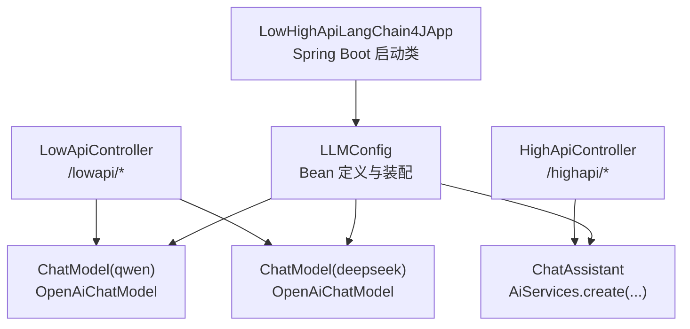
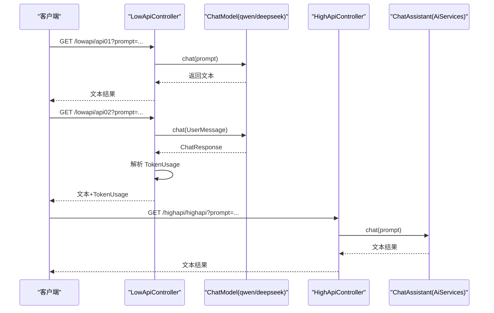
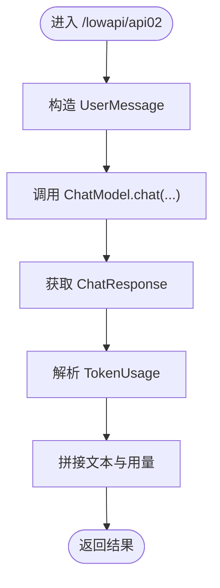
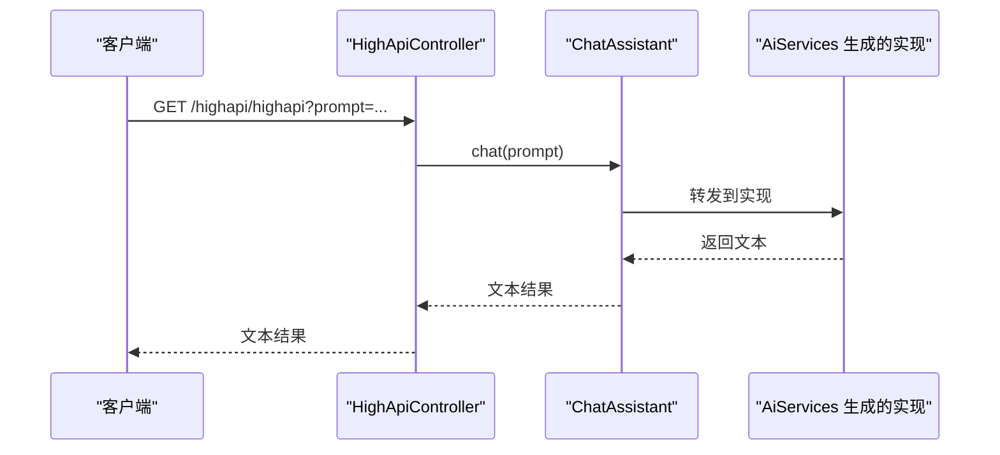
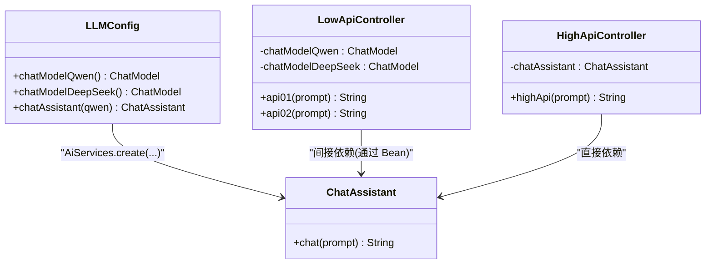
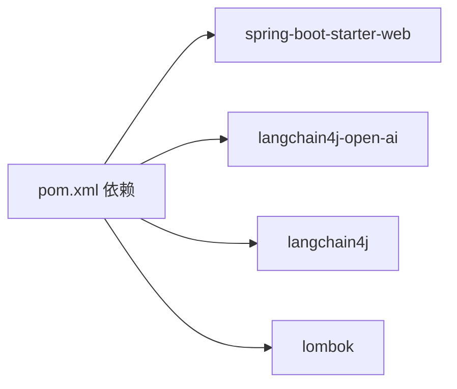

# 低层/高层API

<cite>
**本文引用的文件**
- [LowApiController.java](file://【2】langchain4j-atguiguV5/langchain4j-04low-high-api/src/main/java/com/atguigu/study/controller/LowApiController.java)
- [HighApiController.java](file://【2】langchain4j-atguiguV5/langchain4j-04low-high-api/src/main/java/com/atguigu/study/controller/HighApiController.java)
- [ChatAssistant.java（接口）](file://【2】langchain4j-atguiguV5/langchain4j-04low-high-api/src/main/java/com/atguigu/study/service/ChatAssistant.java)
- [LLMConfig.java](file://【2】langchain4j-atguiguV5/langchain4j-04low-high-api/src/main/java/com/atguigu/study/config/LLMConfig.java)
- [application.properties](file://【2】langchain4j-atguiguV5/langchain4j-04low-high-api/src/main/resources/application.properties)
- [pom.xml](file://【2】langchain4j-atguiguV5/langchain4j-04low-high-api/pom.xml)
- [LowHighApiLangChain4JApp.java](file://【2】langchain4j-atguiguV5/langchain4j-04low-high-api/src/main/java/com/atguigu/study/LowHighApiLangChain4JApp.java)
</cite>

## 目录
1. [引言](#引言)
2. [项目结构](#项目结构)
3. [核心组件](#核心组件)
4. [架构总览](#架构总览)
5. [详细组件分析](#详细组件分析)
6. [依赖分析](#依赖分析)
7. [性能考量](#性能考量)
8. [故障排查指南](#故障排查指南)
9. [结论](#结论)
10. [附录](#附录)

## 引言
本文件围绕 LangChain4j 的“低层 API”与“高层 API”进行深入技术分析，结合示例工程中的 LowApiController、HighApiController 与 ChatAssistant 服务接口，系统对比两类 API 的设计理念、使用场景与性能特征。低层 API 强调细粒度控制，允许手动管理模型参数、自定义处理流程与精确错误控制；高层 API 则强调声明式编程与自动配置，以降低开发复杂度，提升快速迭代效率。本文还提供面向实际应用的差异与选择策略、性能基准测试建议、内存使用分析与最佳实践。

## 项目结构
该示例工程位于 langchain4j-04low-high-api 模块，采用 Spring Boot Web 作为入口，通过控制器暴露 REST 接口，配置类负责注入与装配 ChatModel 实例，并由高层 API 的 AiServices 将接口自动实现为可调用的服务对象。

**图表来源**
- [LowHighApiLangChain4JApp.java:11-18](file://【2】langchain4j-atguiguV5/langchain4j-04low-high-api/src/main/java/com/atguigu/study/LowHighApiLangChain4JApp.java#L11-L18)
- [LLMConfig.java:19-52](file://【2】langchain4j-atguiguV5/langchain4j-04low-high-api/src/main/java/com/atguigu/study/config/LLMConfig.java#L19-L52)
- [LowApiController.java:25-29](file://【2】langchain4j-atguiguV5/langchain4j-04low-high-api/src/main/java/com/atguigu/study/controller/LowApiController.java#L25-L29)
- [HighApiController.java:20-21](file://【2】langchain4j-atguiguV5/langchain4j-04low-high-api/src/main/java/com/atguigu/study/controller/HighApiController.java#L20-L21)

**章节来源**
- [application.properties:1-3](file://【2】langchain4j-atguiguV5/langchain4j-04low-high-api/src/main/resources/application.properties#L1-L3)
- [pom.xml:21-49](file://【2】langchain4j-atguiguV5/langchain4j-04low-high-api/pom.xml#L21-L49)

## 核心组件
- LowApiController：直接依赖 ChatModel Bean，手动构建请求与解析响应，便于细粒度控制与精确统计（如 TokenUsage）。
- HighApiController：依赖 ChatAssistant 接口，通过 AiServices 自动实现，简化调用链路，强调声明式与快速开发。
- ChatAssistant 接口：高层 API 的入口契约，AiServices 在运行时生成实现类，屏蔽底层细节。
- LLMConfig：定义多个 ChatModel Bean 并通过 AiServices 创建高层服务实例，集中管理模型配置。
- 启动类与配置：Spring Boot 启动应用，暴露端口与应用名，配合 Maven 依赖完成编译打包。

**章节来源**
- [LowApiController.java:31-62](file://【2】langchain4j-atguiguV5/langchain4j-04low-high-api/src/main/java/com/atguigu/study/controller/LowApiController.java#L31-L62)
- [HighApiController.java:23-27](file://【2】langchain4j-atguiguV5/langchain4j-04low-high-api/src/main/java/com/atguigu/study/controller/HighApiController.java#L23-L27)
- [ChatAssistant.java:12-15](file://【2】langchain4j-atguiguV5/langchain4j-04low-high-api/src/main/java/com/atguigu/study/service/ChatAssistant.java#L12-L15)
- [LLMConfig.java:19-52](file://【2】langchain4j-atguiguV5/langchain4j-04low-high-api/src/main/java/com/atguigu/study/config/LLMConfig.java#L19-L52)

## 架构总览
下图展示了低层与高层 API 的调用路径与职责边界：

**图表来源**
- [LowApiController.java:31-62](file://【2】langchain4j-atguiguV5/langchain4j-04low-high-api/src/main/java/com/atguigu/study/controller/LowApiController.java#L31-L62)
- [HighApiController.java:23-27](file://【2】langchain4j-atguiguV5/langchain4j-04low-high-api/src/main/java/com/atguigu/study/controller/HighApiController.java#L23-L27)
- [LLMConfig.java:48-52](file://【2】langchain4j-atguiguV5/langchain4j-04low-high-api/src/main/java/com/atguigu/study/config/LLMConfig.java#L48-L52)

## 详细组件分析

### LowApiController 组件分析
- 设计理念：直接操作 ChatModel，显式构造请求与解析响应，适合需要精细控制的场景（如自定义消息格式、手动统计 TokenUsage、错误分支处理等）。
- 关键点：
  - 注入多个 ChatModel Bean，分别对应不同供应商或模型。
  - 第二个接口演示了如何从 ChatResponse 中提取 TokenUsage，体现低层 API 的可观测性与可控性。
- 适用场景：性能敏感、需要严格审计与成本控制、需自定义中间件或拦截器的系统。

**图表来源**
- [LowApiController.java:46-62](file://【2】langchain4j-atguiguV5/langchain4j-04low-high-api/src/main/java/com/atguigu/study/controller/LowApiController.java#L46-L62)

**章节来源**
- [LowApiController.java:25-29](file://【2】langchain4j-atguiguV5/langchain4j-04low-high-api/src/main/java/com/atguigu/study/controller/LowApiController.java#L25-L29)
- [LowApiController.java:46-62](file://【2】langchain4j-atguiguV5/langchain4j-04low-high-api/src/main/java/com/atguigu/study/controller/LowApiController.java#L46-L62)

### HighApiController 组件分析
- 设计理念：通过 ChatAssistant 接口与 AiServices 实现声明式调用，隐藏底层细节，提升开发效率与可维护性。
- 关键点：
  - 控制器仅依赖服务接口，无需关心具体实现与模型细节。
  - 服务实现由 LLMConfig 中的 AiServices.create(...) 动态生成，集中配置模型参数。
- 适用场景：快速原型、业务逻辑简单、希望减少样板代码与配置负担的项目。

**图表来源**
- [HighApiController.java:23-27](file://【2】langchain4j-atguiguV5/langchain4j-04low-high-api/src/main/java/com/atguigu/study/controller/HighApiController.java#L23-L27)
- [LLMConfig.java:48-52](file://【2】langchain4j-atguiguV5/langchain4j-04low-high-api/src/main/java/com/atguigu/study/config/LLMConfig.java#L48-L52)

**章节来源**
- [HighApiController.java:20-21](file://【2】langchain4j-atguiguV5/langchain4j-04low-high-api/src/main/java/com/atguigu/study/controller/HighApiController.java#L20-L21)
- [ChatAssistant.java:12-15](file://【2】langchain4j-atguiguV5/langchain4j-04low-high-api/src/main/java/com/atguigu/study/service/ChatAssistant.java#L12-L15)
- [LLMConfig.java:48-52](file://【2】langchain4j-atguiguV5/langchain4j-04low-high-api/src/main/java/com/atguigu/study/config/LLMConfig.java#L48-L52)

### ChatAssistant 服务接口分析
- 角色定位：高层 API 的契约接口，AiServices 在运行时生成实现，将自然语言交互映射为方法调用。
- 设计优势：接口简洁、职责单一，便于单元测试与替换实现；与底层 ChatModel 解耦。
- 与低层 API 的差异：低层直接面向 ChatModel，高层面向接口；高层更易扩展与组合。

**图表来源**
- [ChatAssistant.java:12-15](file://【2】langchain4j-atguiguV5/langchain4j-04low-high-api/src/main/java/com/atguigu/study/service/ChatAssistant.java#L12-L15)
- [LLMConfig.java:19-52](file://【2】langchain4j-atguiguV5/langchain4j-04low-high-api/src/main/java/com/atguigu/study/config/LLMConfig.java#L19-L52)
- [LowApiController.java:25-29](file://【2】langchain4j-atguiguV5/langchain4j-04low-high-api/src/main/java/com/atguigu/study/controller/LowApiController.java#L25-L29)
- [HighApiController.java:20-21](file://【2】langchain4j-atguiguV5/langchain4j-04low-high-api/src/main/java/com/atguigu/study/controller/HighApiController.java#L20-L21)

**章节来源**
- [ChatAssistant.java:12-15](file://【2】langchain4j-atguiguV5/langchain4j-04low-high-api/src/main/java/com/atguigu/study/service/ChatAssistant.java#L12-L15)
- [LLMConfig.java:48-52](file://【2】langchain4j-atguiguV5/langchain4j-04low-high-api/src/main/java/com/atguigu/study/config/LLMConfig.java#L48-L52)

## 依赖分析
- Spring Boot Starter Web：提供 Web 控制器与嵌入式服务器。
- LangChain4j OpenAI 集成：统一 OpenAI 协议的 ChatModel 实现，便于多供应商接入。
- LangChain4j 核心：提供 AiServices 等高层 API 能力。
- Lombok：简化日志与样板代码。

**图表来源**
- [pom.xml:21-49](file://【2】langchain4j-atguiguV5/langchain4j-04low-high-api/pom.xml#L21-L49)

**章节来源**
- [pom.xml:21-49](file://【2】langchain4j-atguiguV5/langchain4j-04low-high-api/pom.xml#L21-L49)

## 性能考量
- 低层 API 的优势
  - 显式控制：可按需构造消息、选择参数、精确统计 TokenUsage，便于成本控制与性能优化。
  - 扩展性强：可插入自定义中间件、缓存策略、重试与熔断逻辑。
  - 诊断友好：可直接访问底层响应对象，便于埋点与可观测性增强。
- 高层 API 的优势
  - 开发效率高：声明式接口与自动实现，减少样板代码与配置。
  - 易于测试：接口隔离清晰，便于单元测试与模拟。
  - 运维简化：集中配置与统一行为，降低维护成本。
- 性能基准测试建议
  - 场景设计：并发 QPS、延迟分布（P50/P95/P99）、吞吐量、Token 使用率、内存占用曲线。
  - 指标采集：请求耗时、错误率、重试次数、TokenUsage、GC 次数与停顿时间。
  - 对比维度：低层 API（手动参数与统计）vs 高层 API（默认行为），同模型同参数。
  - 建议工具：JMH（微基准）、Gatling（压测）、Micrometer + Prometheus + Grafana（监控）。
- 内存使用分析
  - 低层：对象生命周期可控，适合细粒度复用与回收；注意避免重复构造消息与响应对象。
  - 高层：AiServices 生成实现可能引入额外对象与代理开销，需关注启动与热身阶段的内存峰值。
  - 建议：在生产环境启用内存分析工具（如 JFR/JProfiler）观察对象分配与 GC 行为，结合压测结果调整线程池与连接池大小。

[本节为通用性能讨论，未直接分析具体文件，故无“章节来源”]

## 故障排查指南
- 常见问题
  - 模型参数缺失：确认 ChatModel Bean 的 apiKey、baseUrl、modelName 是否正确配置。
  - 接口返回为空：检查 ChatResponse 的 aiMessage 是否存在，必要时增加空值保护与降级策略。
  - TokenUsage 为空：确认底层模型是否返回用量信息，或在低层显式解析。
  - 高层调用异常：检查 AiServices 创建过程与接口签名是否匹配，确保依赖注入成功。
- 排查步骤
  - 启用日志：开启 Spring 日志与 LangChain4j 相关包的日志级别，定位异常堆栈。
  - 分层验证：先验证 ChatModel 能否独立返回结果，再逐步上移到高层 API。
  - 压测辅助：通过小流量压测发现资源瓶颈与异常模式，结合指标仪表盘定位根因。
- 修复建议
  - 参数校验：在控制器层增加输入校验与默认值处理。
  - 错误包装：将底层异常转换为统一的业务异常，保留上下文信息。
  - 限流熔断：在网关或服务层增加限流与熔断策略，防止雪崩。

[本节为通用故障排查建议，未直接分析具体文件，故无“章节来源”]

## 结论
- 低层 API 适合对性能、成本与可观测性有强约束的场景，强调“可控”与“可见”。
- 高层 API 适合快速迭代与简化开发的场景，强调“声明式”与“可维护”。
- 实际项目中可根据业务目标与团队能力选择：初期优先高层 API 加速交付，稳定后在关键路径引入低层 API 进行精细化优化。
- 建议建立统一的性能基准测试体系与监控告警机制，持续评估两类 API 的适用性与演进方向。

[本节为总结性内容，未直接分析具体文件，故无“章节来源”]

## 附录
- 快速验证
  - 启动应用后，访问以下接口进行验证：
    - GET http://localhost:9004/lowapi/api01?prompt=你好
    - GET http://localhost:9004/lowapi/api02?prompt=你好
    - GET http://localhost:9004/highapi/highapi?prompt=你好
- 配置参考
  - 端口与应用名：application.properties
  - 依赖与插件：pom.xml
  - 模型与服务：LLMConfig

**章节来源**
- [application.properties:1-3](file://【2】langchain4j-atguiguV5/langchain4j-04low-high-api/src/main/resources/application.properties#L1-L3)
- [pom.xml:52-59](file://【2】langchain4j-atguiguV5/langchain4j-04low-high-api/pom.xml#L52-L59)
- [LLMConfig.java:19-52](file://【2】langchain4j-atguiguV5/langchain4j-04low-high-api/src/main/java/com/atguigu/study/config/LLMConfig.java#L19-L52)