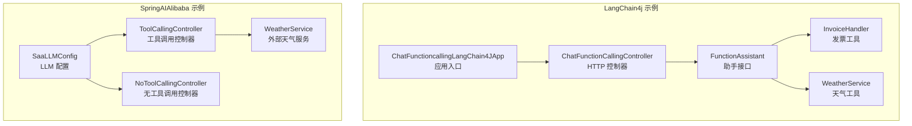
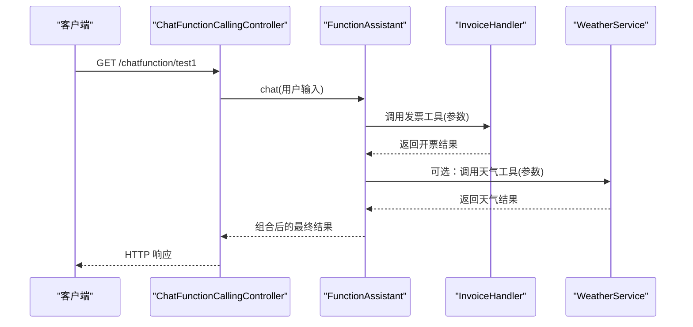
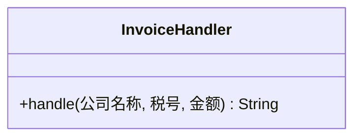
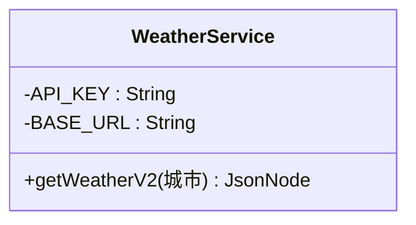
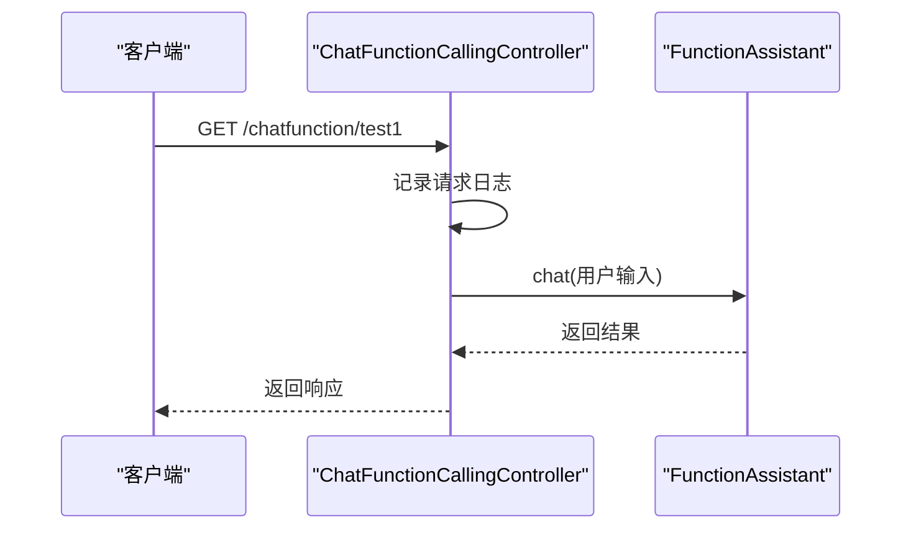
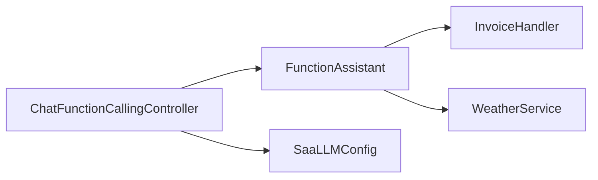

# 函数调用

<cite>
**本文引用的文件**
- [ChatFunctioncallingLangChain4JApp.java](file://【2】langchain4j-atguiguV5/langchain4j-11chat-functioncalling/src/main/java/com/atguigu/study/ChatFunctioncallingLangChain4JApp.java)
- [ChatFunctionCallingController.java](file://【2】langchain4j-atguiguV5/langchain4j-11chat-functioncalling/src/main/java/com/atguigu/study/controller/ChatFunctionCallingController.java)
- [FunctionAssistant.java](file://【2】langchain4j-atguiguV5/langchain4j-11chat-functioncalling/src/main/java/com/atguigu/study/service/FunctionAssistant.java)
- [InvoiceHandler.java](file://【2】langchain4j-atguiguV5/langchain4j-11chat-functioncalling/src/main/java/com/atguigu/study/service/InvoiceHandler.java)
- [WeatherService.java](file://【2】langchain4j-atguiguV5/langchain4j-11chat-functioncalling/src/main/java/com/atguigu/study/service/WeatherService.java)
- [SaaLLMConfig.java](file://【1】SpringAIAlibaba-atguiguV1/SAA-13ToolCalling/src/main/java/com/atguigu/study/config/SaaLLMConfig.java)
- [ToolCallingController.java](file://【1】SpringAIAlibaba-atguiguV1/SAA-13ToolCalling/src/main/java/com/atguigu/study/controller/ToolCallingController.java)
- [NoToolCallingController.java](file://【1】SpringAIAlibaba-atguiguV1/SAA-13ToolCalling/src/main/java/com/atguigu/study/controller/NoToolCallingController.java)
- [WeatherService.java](file://【1】SpringAIAlibaba-atguiguV1/SAA-14LocalMcpServer/src/main/java/com/atguigu/study/service/WeatherService.java)
</cite>

## 目录
1. [引言](#引言)
2. [项目结构](#项目结构)
3. [核心组件](#核心组件)
4. [架构总览](#架构总览)
5. [组件详细分析](#组件详细分析)
6. [依赖关系分析](#依赖关系分析)
7. [性能考量](#性能考量)
8. [故障排查指南](#故障排查指南)
9. [结论](#结论)
10. [附录](#附录)

## 引言
本指南围绕LangChain4j函数调用模块，系统讲解如何将AI模型与外部工具进行无缝集成，覆盖函数注册、参数传递、结果处理与错误处理。通过FunctionAssistant演示多步推理与条件判断流程，并以InvoiceHandler与WeatherService两类工具分别展示“业务工具”和“外部API工具”的实现范式。同时，结合SAA-13与SAA-14工程中的LLM配置与控制器设计，给出接口层的权限控制、速率限制与审计日志思路，以及LLMConfig中工具相关配置项的说明与最佳实践。

## 项目结构
本仓库包含两套工程与示例：
- LangChain4j示例工程（langchain4j-11chat-functioncalling）：聚焦LangChain4j函数调用与工具集成，包含控制器、助手接口与工具实现。
- SpringAIAlibaba示例工程（SAA-13ToolCalling、SAA-14LocalMcpServer）：提供LLM配置、工具调用控制器与本地MCP服务示例，便于理解工具配置与外部服务对接。

**图示来源**
- [ChatFunctioncallingLangChain4JApp.java:1-19](file://【2】langchain4j-atguiguV5/langchain4j-11chat-functioncalling/src/main/java/com/atguigu/study/ChatFunctioncallingLangChain4JApp.java#L1-L19)
- [ChatFunctionCallingController.java:1-33](file://【2】langchain4j-atguiguV5/langchain4j-11chat-functioncalling/src/main/java/com/atguigu/study/controller/ChatFunctionCallingController.java#L1-L33)
- [FunctionAssistant.java:1-16](file://【2】langchain4j-atguiguV5/langchain4j-11chat-functioncalling/src/main/java/com/atguigu/study/service/FunctionAssistant.java#L1-L16)
- [InvoiceHandler.java:1-30](file://【2】langchain4j-atguiguV5/langchain4j-11chat-functioncalling/src/main/java/com/atguigu/study/service/InvoiceHandler.java#L1-L30)
- [WeatherService.java:1-47](file://【2】langchain4j-atguiguV5/langchain4j-11chat-functioncalling/src/main/java/com/atguigu/study/service/WeatherService.java#L1-L47)
- [SaaLLMConfig.java](file://【1】SpringAIAlibaba-atguiguV1/SAA-13ToolCalling/src/main/java/com/atguigu/study/config/SaaLLMConfig.java)
- [ToolCallingController.java](file://【1】SpringAIAlibaba-atguiguV1/SAA-13ToolCalling/src/main/java/com/atguigu/study/controller/ToolCallingController.java)
- [NoToolCallingController.java](file://【1】SpringAIAlibaba-atguiguV1/SAA-13ToolCalling/src/main/java/com/atguigu/study/controller/NoToolCallingController.java)
- [WeatherService.java](file://【1】SpringAIAlibaba-atguiguV1/SAA-14LocalMcpServer/src/main/java/com/atguigu/study/service/WeatherService.java)

**章节来源**
- [ChatFunctioncallingLangChain4JApp.java:1-19](file://【2】langchain4j-atguiguV5/langchain4j-11chat-functioncalling/src/main/java/com/atguigu/study/ChatFunctioncallingLangChain4JApp.java#L1-L19)
- [ChatFunctionCallingController.java:1-33](file://【2】langchain4j-atguiguV5/langchain4j-11chat-functioncalling/src/main/java/com/atguigu/study/controller/ChatFunctionCallingController.java#L1-L33)

## 核心组件
- 应用入口：负责启动Spring Boot应用，承载控制器与服务。
- 控制器：对外暴露HTTP接口，接收用户输入并委派给助手。
- 助手接口：定义统一的聊天/工具调用入口，便于扩展不同实现。
- 工具实现：
  - 发票工具（InvoiceHandler）：基于LangChain4j注解声明工具，接收结构化参数并执行业务逻辑。
  - 天气工具（WeatherService）：封装第三方API调用，返回结构化结果。
- LLM配置：集中管理模型参数、工具配置、超时与重试策略等。

**章节来源**
- [FunctionAssistant.java:1-16](file://【2】langchain4j-atguiguV5/langchain4j-11chat-functioncalling/src/main/java/com/atguigu/study/service/FunctionAssistant.java#L1-L16)
- [InvoiceHandler.java:1-30](file://【2】langchain4j-atguiguV5/langchain4j-11chat-functioncalling/src/main/java/com/atguigu/study/service/InvoiceHandler.java#L1-L30)
- [WeatherService.java:1-47](file://【2】langchain4j-atguiguV5/langchain4j-11chat-functioncalling/src/main/java/com/atguigu/study/service/WeatherService.java#L1-L47)
- [SaaLLMConfig.java](file://【1】SpringAIAlibaba-atguiguV1/SAA-13ToolCalling/src/main/java/com/atguigu/study/config/SaaLLMConfig.java)

## 架构总览
LangChain4j函数调用的整体流程如下：客户端通过HTTP请求进入控制器，控制器调用助手接口；助手根据用户意图选择合适的工具，工具完成外部调用或业务处理后返回结果，最终由控制器组装响应。

**图示来源**
- [ChatFunctionCallingController.java:1-33](file://【2】langchain4j-atguiguV5/langchain4j-11chat-functioncalling/src/main/java/com/atguigu/study/controller/ChatFunctionCallingController.java#L1-L33)
- [FunctionAssistant.java:1-16](file://【2】langchain4j-atguiguV5/langchain4j-11chat-functioncalling/src/main/java/com/atguigu/study/service/FunctionAssistant.java#L1-L16)
- [InvoiceHandler.java:1-30](file://【2】langchain4j-atguiguV5/langchain4j-11chat-functioncalling/src/main/java/com/atguigu/study/service/InvoiceHandler.java#L1-L30)
- [WeatherService.java:1-47](file://【2】langchain4j-atguiguV5/langchain4j-11chat-functioncalling/src/main/java/com/atguigu/study/service/WeatherService.java#L1-L47)

## 组件详细分析

### FunctionAssistant 接口与实现要点
- 角色定位：作为工具调用的统一入口，屏蔽底层工具细节。
- 设计建议：
  - 明确职责边界：仅负责路由与编排，不直接处理业务。
  - 参数校验与异常包装：在进入工具前进行参数合法性检查与异常标准化。
  - 结果聚合：对多个工具返回结果进行合并与格式化。

**章节来源**
- [FunctionAssistant.java:1-16](file://【2】langchain4j-atguiguV5/langchain4j-11chat-functioncalling/src/main/java/com/atguigu/study/service/FunctionAssistant.java#L1-L16)

### InvoiceHandler：业务工具实现范式
- 工具声明：使用LangChain4j注解声明工具，明确工具名与用途。
- 参数传递：通过注解参数绑定，确保参数名与工具描述一致。
- 业务处理：在工具内部实现业务逻辑，可调用数据库、消息队列、第三方接口等。
- 错误处理：捕获异常并转换为可被模型理解的错误信息，避免泄露内部异常细节。

**图示来源**
- [InvoiceHandler.java:1-30](file://【2】langchain4j-atguiguV5/langchain4j-11chat-functioncalling/src/main/java/com/atguigu/study/service/InvoiceHandler.java#L1-L30)

**章节来源**
- [InvoiceHandler.java:1-30](file://【2】langchain4j-atguiguV5/langchain4j-11chat-functioncalling/src/main/java/com/atguigu/study/service/InvoiceHandler.java#L1-L30)

### WeatherService：外部API工具实现范式
- 外部调用：封装HTTP客户端，构造URL并发起请求。
- 结果解析：将第三方返回的JSON解析为结构化对象，供上层使用。
- 配置管理：通过环境变量或配置中心注入API密钥，避免硬编码。
- 容错与降级：在网络异常或第三方限流时，提供合理的回退策略。

**图示来源**
- [WeatherService.java:1-47](file://【2】langchain4j-atguiguV5/langchain4j-11chat-functioncalling/src/main/java/com/atguigu/study/service/WeatherService.java#L1-L47)

**章节来源**
- [WeatherService.java:1-47](file://【2】langchain4j-atguiguV5/langchain4j-11chat-functioncalling/src/main/java/com/atguigu/study/service/WeatherService.java#L1-L47)

### ChatFunctionCallingController：接口设计与扩展
- 路径设计：提供简洁的REST路径，便于测试与集成。
- 日志与审计：记录请求时间、参数与响应摘要，便于审计与排障。
- 扩展点：可在此处加入权限校验、速率限制与熔断降级等横切关注点。

**图示来源**
- [ChatFunctionCallingController.java:1-33](file://【2】langchain4j-atguiguV5/langchain4j-11chat-functioncalling/src/main/java/com/atguigu/study/controller/ChatFunctionCallingController.java#L1-L33)

**章节来源**
- [ChatFunctionCallingController.java:1-33](file://【2】langchain4j-atguiguV5/langchain4j-11chat-functioncalling/src/main/java/com/atguigu/study/controller/ChatFunctionCallingController.java#L1-L33)

### LLMConfig：工具配置与运行时参数
- 超时设置：控制模型调用与工具调用的超时阈值，避免阻塞。
- 重试策略：对网络抖动或瞬时失败进行指数退避重试。
- 监控指标：埋点请求耗时、成功率、失败原因等，支撑可观测性。
- 工具注册：集中管理可用工具列表与参数约束，便于动态启用/禁用。

**章节来源**
- [SaaLLMConfig.java](file://【1】SpringAIAlibaba-atguiguV1/SAA-13ToolCalling/src/main/java/com/atguigu/study/config/SaaLLMConfig.java)

### 工具调用控制器：权限控制与速率限制
- 权限控制：在控制器层校验用户身份与资源访问权限，拒绝未授权请求。
- 速率限制：基于IP或用户维度进行QPS限制，防止滥用。
- 审计日志：记录关键操作的时间戳、用户ID、工具名与参数摘要。

**章节来源**
- [ToolCallingController.java](file://【1】SpringAIAlibaba-atguiguV1/SAA-13ToolCalling/src/main/java/com/atguigu/study/controller/ToolCallingController.java)
- [NoToolCallingController.java](file://【1】SpringAIAlibaba-atguiguV1/SAA-13ToolCalling/src/main/java/com/atguigu/study/controller/NoToolCallingController.java)

## 依赖关系分析
- 控制器依赖助手接口，通过依赖注入获取具体实现。
- 助手在运行时根据用户输入选择工具，工具之间相互独立，降低耦合度。
- 外部API工具依赖HTTP客户端与配置中心，需注意密钥管理与网络稳定性。
- LLM配置贯穿于控制器与助手，影响工具调用的超时、重试与监控行为。

**图示来源**
- [ChatFunctionCallingController.java:1-33](file://【2】langchain4j-atguiguV5/langchain4j-11chat-functioncalling/src/main/java/com/atguigu/study/controller/ChatFunctionCallingController.java#L1-L33)
- [FunctionAssistant.java:1-16](file://【2】langchain4j-atguiguV5/langchain4j-11chat-functioncalling/src/main/java/com/atguigu/study/service/FunctionAssistant.java#L1-L16)
- [InvoiceHandler.java:1-30](file://【2】langchain4j-atguiguV5/langchain4j-11chat-functioncalling/src/main/java/com/atguigu/study/service/InvoiceHandler.java#L1-L30)
- [WeatherService.java:1-47](file://【2】langchain4j-atguiguV5/langchain4j-11chat-functioncalling/src/main/java/com/atguigu/study/service/WeatherService.java#L1-L47)
- [SaaLLMConfig.java](file://【1】SpringAIAlibaba-atguiguV1/SAA-13ToolCalling/src/main/java/com/atguigu/study/config/SaaLLMConfig.java)

## 性能考量
- 工具并发：合理设置线程池大小与队列长度，避免工具调用成为瓶颈。
- 缓存策略：对外部API结果进行缓存，减少重复请求与网络开销。
- 超时与重试：为外部调用设置合理的超时与重试上限，避免雪崩效应。
- 监控与告警：对工具调用耗时、失败率与依赖健康度进行实时监控。

## 故障排查指南
- 参数校验失败：检查工具注解参数名与调用方传参是否一致。
- 外部服务异常：确认密钥配置、网络连通性与第三方限流策略。
- 超时与重试：调整LLM配置中的超时与重试参数，观察效果。
- 日志审计：通过控制器与工具的日志定位问题根因。

**章节来源**
- [ChatFunctionCallingController.java:1-33](file://【2】langchain4j-atguiguV5/langchain4j-11chat-functioncalling/src/main/java/com/atguigu/study/controller/ChatFunctionCallingController.java#L1-L33)
- [WeatherService.java:1-47](file://【2】langchain4j-atguiguV5/langchain4j-11chat-functioncalling/src/main/java/com/atguigu/study/service/WeatherService.java#L1-L47)
- [SaaLLMConfig.java](file://【1】SpringAIAlibaba-atguiguV1/SAA-13ToolCalling/src/main/java/com/atguigu/study/config/SaaLLMConfig.java)

## 结论
LangChain4j函数调用模块通过清晰的接口与工具抽象，实现了AI与外部系统的高效协同。结合统一的LLM配置与控制器层的权限、限流与审计能力，可在保证安全性与稳定性的同时，灵活扩展更多工具与业务场景。

## 附录
- 最佳实践
  - 工具命名与参数描述要语义明确，便于模型正确选择与调用。
  - 在工具内部做好异常隔离与结果格式化，避免将内部异常透传给模型。
  - 将敏感配置放入环境变量或配置中心，避免硬编码。
- 安全考虑
  - 控制器层进行身份认证与授权校验。
  - 对外部API调用进行白名单与域名限制。
  - 审计日志中避免记录敏感参数与响应体。
- 性能优化
  - 合理设置超时与重试，避免长尾请求拖慢整体吞吐。
  - 对热点数据与接口进行缓存与异步化处理。
  - 使用连接池与并发控制，提升外部服务调用效率。