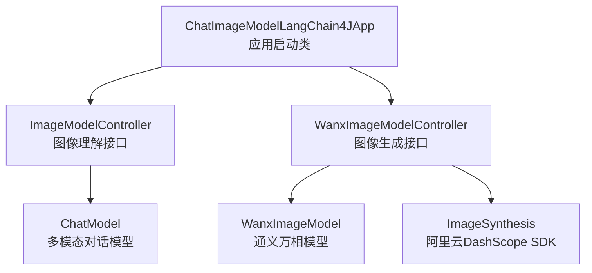
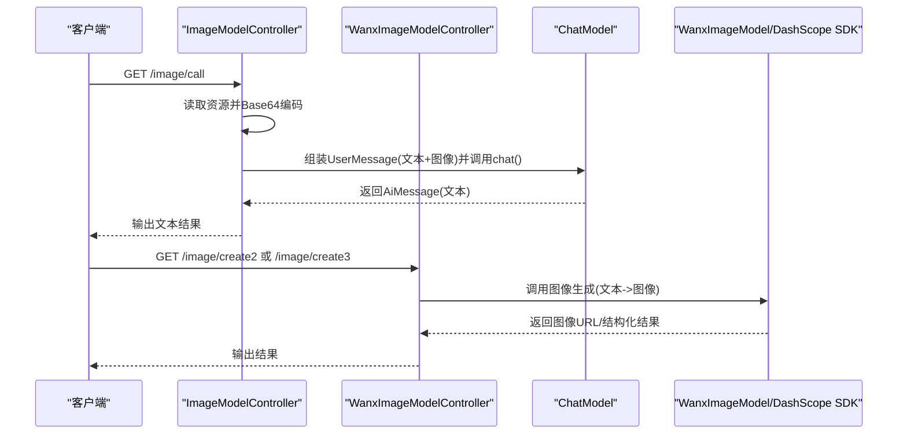
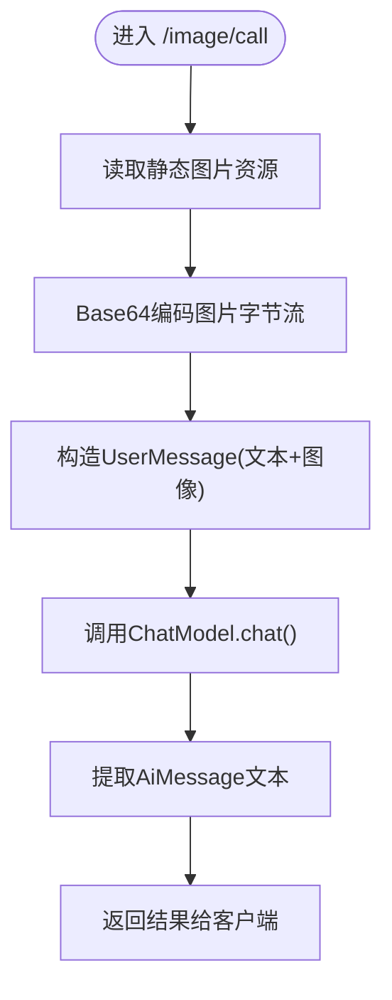
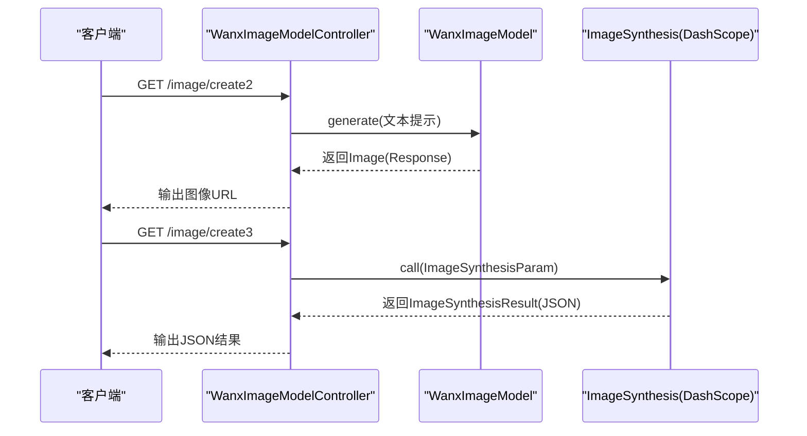
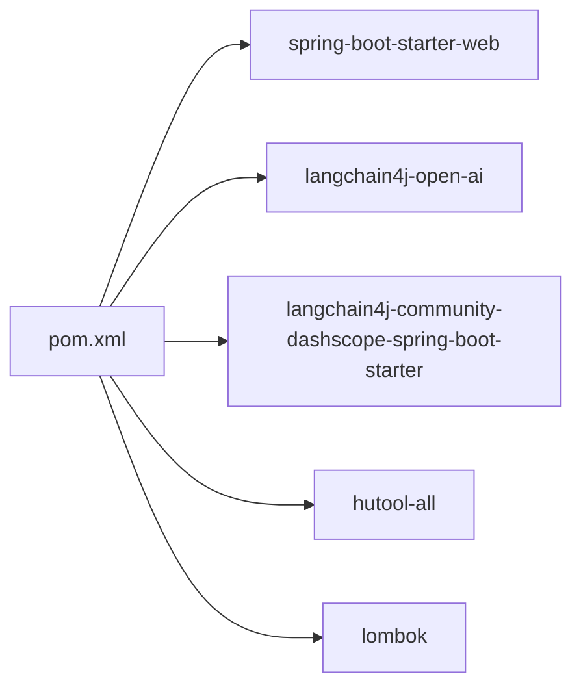

# 图像聊天功能

<cite>
**本文引用的文件**
- [ChatImageModelLangChain4JApp.java](file://【2】langchain4j-atguiguV5/langchain4j-06chat-image/src/main/java/com/atguigu/study/ChatImageModelLangChain4JApp.java)
- [ImageModelController.java](file://【2】langchain4j-atguiguV5/langchain4j-06chat-image/src/main/java/com/atguigu/study/controller/ImageModelController.java)
- [WanxImageModelController.java](file://【2】langchain4j-atguiguV5/langchain4j-06chat-image/src/main/java/com/atguigu/study/controller/WanxImageModelController.java)
- [pom.xml](file://【2】langchain4j-atguiguV5/langchain4j-06chat-image/pom.xml)
</cite>

## 目录
1. [引言](#引言)
2. [项目结构](#项目结构)
3. [核心组件](#核心组件)
4. [架构总览](#架构总览)
5. [详细组件分析](#详细组件分析)
6. [依赖分析](#依赖分析)
7. [性能考虑](#性能考虑)
8. [故障排查指南](#故障排查指南)
9. [结论](#结论)
10. [附录](#附录)

## 引言
本指南聚焦于LangChain4j在图像聊天场景下的多模态处理能力，围绕两类典型能力展开：
- 基础图像理解与描述：通过将图像与文本提示组合，驱动多模态语言模型完成图像内容识别、信息抽取与自然语言生成。
- 高阶图像生成与创意：借助DashScope（通义万相）等外部图像生成服务，实现从文本到图像的双向转换与创意生成。

文档以ImageModelController与WanxImageModelController两个控制器为核心入口，串联起图像预处理、特征提取（由模型内部完成）、多模态融合与上下文关联的完整链路，并给出配置要点、错误处理策略与实践建议。

## 项目结构
该模块位于LangChain4j示例工程中，采用Spring Boot标准结构，包含应用启动类、控制器与Maven依赖配置。核心文件如下：
- 应用启动类：负责引导Spring容器与Web环境
- 控制器：提供图像理解与图像生成的REST接口
- 依赖：集成OpenAI与DashScope（通义千问）生态，支撑多模态与图像生成

**图表来源**
- [ChatImageModelLangChain4JApp.java:1-19](file://【2】langchain4j-atguiguV5/langchain4j-06chat-image/src/main/java/com/atguigu/study/ChatImageModelLangChain4JApp.java#L1-L19)
- [ImageModelController.java:1-70](file://【2】langchain4j-atguiguV5/langchain4j-06chat-image/src/main/java/com/atguigu/study/controller/ImageModelController.java#L1-L70)
- [WanxImageModelController.java:1-79](file://【2】langchain4j-atguiguV5/langchain4j-06chat-image/src/main/java/com/atguigu/study/controller/WanxImageModelController.java#L1-L79)

**章节来源**
- [ChatImageModelLangChain4JApp.java:1-19](file://【2】langchain4j-atguiguV5/langchain4j-06chat-image/src/main/java/com/atguigu/study/ChatImageModelLangChain4JApp.java#L1-L19)
- [ImageModelController.java:1-70](file://【2】langchain4j-atguiguV5/langchain4j-06chat-image/src/main/java/com/atguigu/study/controller/ImageModelController.java#L1-L70)
- [WanxImageModelController.java:1-79](file://【2】langchain4j-atguiguV5/langchain4j-06chat-image/src/main/java/com/atguigu/study/controller/WanxImageModelController.java#L1-L79)

## 核心组件
- ImageModelController：提供图像理解能力，将图像与文本提示封装为用户消息，调用多模态对话模型，返回自然语言描述或分析结果。
- WanxImageModelController：提供图像生成能力，通过通义万相模型或DashScope SDK直接生成图像，返回图像URL或结构化结果。
- ChatModel：多模态对话模型抽象，用于接收文本与图像混合输入并输出文本响应。
- WanxImageModel：LangChain4j对通义万相的封装，简化图像生成调用。
- Spring Boot Web：提供REST接口与自动装配能力。

**章节来源**
- [ImageModelController.java:27-68](file://【2】langchain4j-atguiguV5/langchain4j-06chat-image/src/main/java/com/atguigu/study/controller/ImageModelController.java#L27-L68)
- [WanxImageModelController.java:26-42](file://【2】langchain4j-atguiguV5/langchain4j-06chat-image/src/main/java/com/atguigu/study/controller/WanxImageModelController.java#L26-L42)

## 架构总览
下图展示了从HTTP请求到模型推理再到结果返回的整体流程，涵盖图像理解与图像生成两条主线。

**图表来源**
- [ImageModelController.java:42-68](file://【2】langchain4j-atguiguV5/langchain4j-06chat-image/src/main/java/com/atguigu/study/controller/ImageModelController.java#L42-L68)
- [WanxImageModelController.java:32-42](file://【2】langchain4j-atguiguV5/langchain4j-06chat-image/src/main/java/com/atguigu/study/controller/WanxImageModelController.java#L32-L42)
- [WanxImageModelController.java:47-77](file://【2】langchain4j-atguiguV5/langchain4j-06chat-image/src/main/java/com/atguigu/study/controller/WanxImageModelController.java#L47-L77)

## 详细组件分析

### 图像理解流程（ImageModelController）
该控制器演示了“图像+文本”的多模态输入如何被封装并传递给模型，最终得到自然语言输出。关键步骤包括：
- 图像读取与编码：从静态资源读取二进制数据并进行Base64编码
- 消息构造：将文本提示与图像内容封装为用户消息
- 模型调用：通过ChatModel.chat()执行推理
- 结果解析：从响应中提取AI消息的文本内容

**图表来源**
- [ImageModelController.java:42-68](file://【2】langchain4j-atguiguV5/langchain4j-06chat-image/src/main/java/com/atguigu/study/controller/ImageModelController.java#L42-L68)

**章节来源**
- [ImageModelController.java:42-68](file://【2】langchain4j-atguiguV5/langchain4j-06chat-image/src/main/java/com/atguigu/study/controller/ImageModelController.java#L42-L68)

### 图像生成流程（WanxImageModelController）
该控制器演示了两种图像生成路径：
- 通过WanxImageModel.generate()直接生成图像
- 通过DashScope SDK的ImageSynthesis进行同步调用，支持风格、尺寸、数量等参数

**图表来源**
- [WanxImageModelController.java:32-42](file://【2】langchain4j-atguiguV5/langchain4j-06chat-image/src/main/java/com/atguigu/study/controller/WanxImageModelController.java#L32-L42)
- [WanxImageModelController.java:47-77](file://【2】langchain4j-atguiguV5/langchain4j-06chat-image/src/main/java/com/atguigu/study/controller/WanxImageModelController.java#L47-L77)

**章节来源**
- [WanxImageModelController.java:32-42](file://【2】langchain4j-atguiguV5/langchain4j-06chat-image/src/main/java/com/atguigu/study/controller/WanxImageModelController.java#L32-L42)
- [WanxImageModelController.java:47-77](file://【2】langchain4j-atguiguV5/langchain4j-06chat-image/src/main/java/com/atguigu/study/controller/WanxImageModelController.java#L47-L77)

### 多模态模型配置与参数调优（概念性说明）
- 模型选择：根据业务场景选择OpenAI多模态模型或DashScope系列模型；前者适合通用视觉理解与生成，后者在中文语境与特定风格上具备优势。
- 参数调优：图像生成时可调整分辨率、风格标签、采样数量等；图像理解时可通过提示词工程提升准确性与稳定性。
- 性能优化：合理缓存图像编码结果、复用模型实例、限制并发与批量大小，避免超时与内存压力。

[本节为通用指导，不直接分析具体文件]

## 依赖分析
该模块通过Maven引入以下关键依赖：
- spring-boot-starter-web：提供Web环境与自动装配
- langchain4j-open-ai：提供OpenAI协议的多模态模型适配
- langchain4j-community-dashscope-spring-boot-starter：提供DashScope生态集成（含通义万相）
- hutool：提供便捷的工具方法（如IO与编码）
- lombok：减少样板代码

**图表来源**
- [pom.xml:21-62](file://【2】langchain4j-atguiguV5/langchain4j-06chat-image/pom.xml#L21-L62)

**章节来源**
- [pom.xml:21-62](file://【2】langchain4j-atguiguV5/langchain4j-06chat-image/pom.xml#L21-L62)

## 性能考虑
- 输入预处理：优先在服务端完成图像读取与Base64编码，避免重复计算；对高频请求可缓存编码结果。
- 模型调用：合理设置超时与重试策略；对长文本与高分辨率图像适当降采样或裁剪。
- 并发控制：限制并发请求数与批量大小，防止模型过载；必要时引入队列与异步处理。
- 资源管理：及时释放图像与响应对象，避免内存泄漏。

[本节为通用指导，不直接分析具体文件]

## 故障排查指南
- 图像读取失败：检查静态资源路径是否正确，确认文件存在且可访问。
- Base64编码异常：确认字节流非空，字符集与MIME类型匹配。
- 模型调用超时：检查网络连通性与API密钥配置；适当增大超时阈值。
- DashScope调用报错：核对API Key与模型规格；捕获异常并记录错误码与消息。
- 响应解析失败：确保响应结构符合预期，对空值与异常分支做健壮性处理。

**章节来源**
- [WanxImageModelController.java:66-71](file://【2】langchain4j-atguiguV5/langchain4j-06chat-image/src/main/java/com/atguigu/study/controller/WanxImageModelController.java#L66-L71)

## 结论
本指南基于LangChain4j示例工程，系统梳理了图像聊天的两大能力路径：图像理解与图像生成。通过ImageModelController与WanxImageModelController，开发者可以快速实现“文本+图像”的多模态交互，并借助DashScope生态扩展创意生成能力。建议在生产环境中关注输入预处理、模型参数调优与性能监控，以获得稳定高效的用户体验。

## 附录
- 接口清单
  - GET /image/call：图像理解，返回自然语言描述
  - GET /image/create2：图像生成（通义万相），返回图像URL
  - GET /image/create3：图像生成（DashScope SDK），返回结构化结果

**章节来源**
- [ImageModelController.java:42-68](file://【2】langchain4j-atguiguV5/langchain4j-06chat-image/src/main/java/com/atguigu/study/controller/ImageModelController.java#L42-L68)
- [WanxImageModelController.java:32-42](file://【2】langchain4j-atguiguV5/langchain4j-06chat-image/src/main/java/com/atguigu/study/controller/WanxImageModelController.java#L32-L42)
- [WanxImageModelController.java:47-77](file://【2】langchain4j-atguiguV5/langchain4j-06chat-image/src/main/java/com/atguigu/study/controller/WanxImageModelController.java#L47-L77)