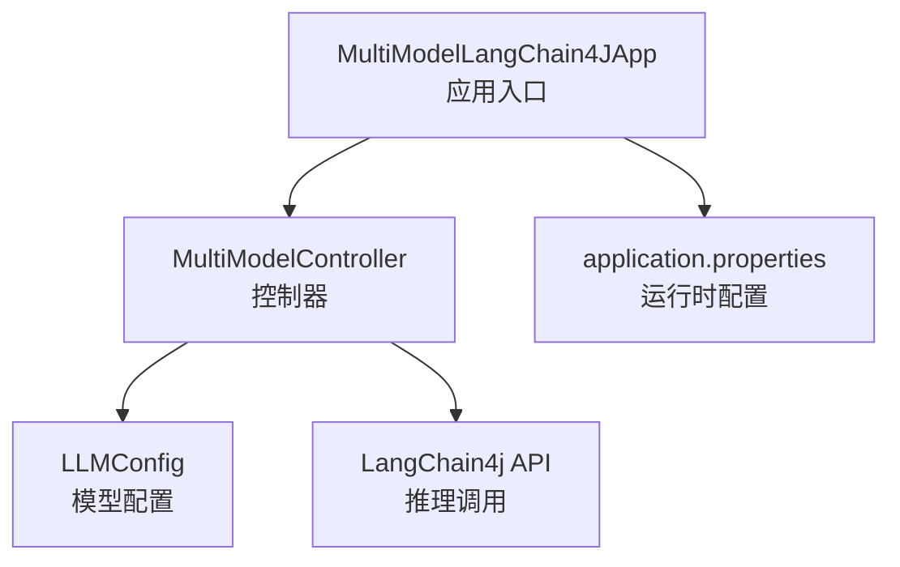
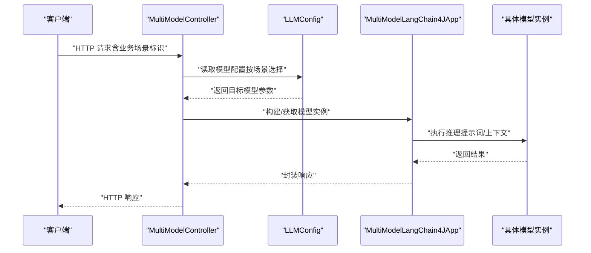
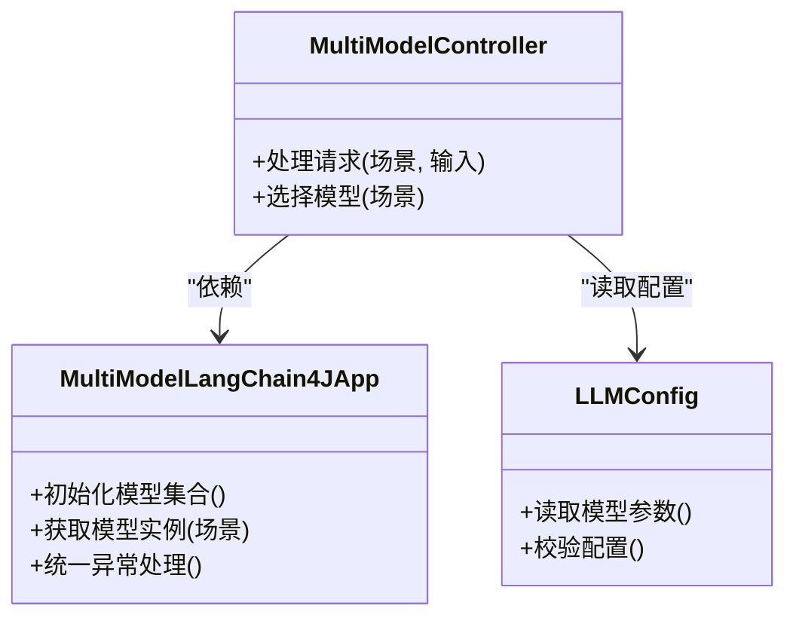
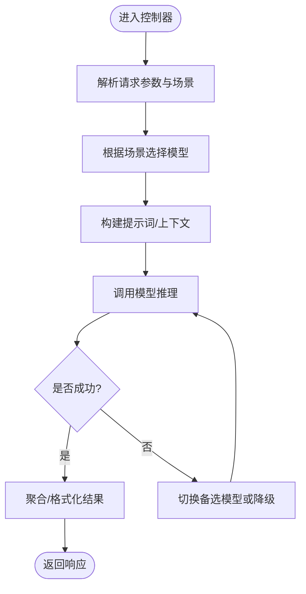
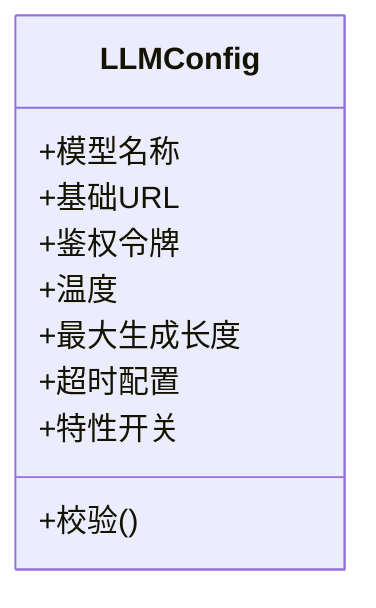
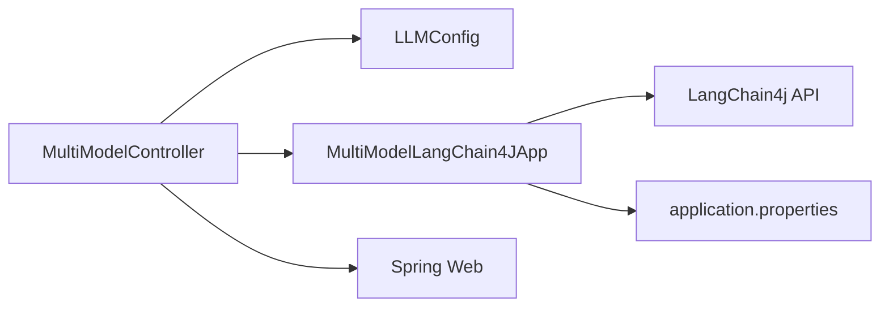

# 多模型集成

<cite>
**本文引用的文件**
- [MultiModelLangChain4JApp.java](file://【2】langchain4j-atguiguV5/langchain4j-02multi-model-together/src/main/java/com/atguigu/study/MultiModelLangChain4JApp.java)
- [MultiModelController.java](file://【2】langchain4j-atguiguV5/langchain4j-02multi-model-together/src/main/java/com/atguigu/study/controller/MultiModelController.java)
- [LLMConfig.java](file://【2】langchain4j-atguiguV5/langchain4j-02multi-model-together/src/main/java/com/atguigu/study/config/LLMConfig.java)
- [application.properties](file://【2】langchain4j-atguiguV5/langchain4j-02multi-model-together/src/main/resources/application.properties)
- [LangChain4j-完整学习总结笔记.md](file://4、LangChain4j-完整学习总结笔记.md)
</cite>

## 目录
1. [引言](#引言)
2. [项目结构](#项目结构)
3. [核心组件](#核心组件)
4. [架构总览](#架构总览)
5. [详细组件分析](#详细组件分析)
6. [依赖分析](#依赖分析)
7. [性能考虑](#性能考虑)
8. [故障排查指南](#故障排查指南)
9. [结论](#结论)
10. [附录](#附录)

## 引言
本技术指南围绕 LangChain4j 多模型集成模块展开，目标是在同一应用中统一管理与动态选择多个 AI 模型，覆盖模型切换机制、性能对比与负载均衡策略，并以 MultiModelLangChain4JApp 的架构设计为主线，结合 LLMConfig 配置类与 MultiModelController 控制器的实际示例，帮助读者在不同业务场景下做出合理的模型选择与优化决策。

## 项目结构
该模块位于 langchain4j-02multi-model-together 示例工程中，采用 Spring Boot 结构组织，关键文件如下：
- 应用入口：MultiModelLangChain4JApp
- 控制层：MultiModelController
- 配置类：LLMConfig
- 配置文件：application.properties
- 学习笔记：LangChain4j-完整学习总结笔记.md（包含多模型相关章节）

**图表来源**
- [MultiModelLangChain4JApp.java:1-200](file://【2】langchain4j-atguiguV5/langchain4j-02multi-model-together/src/main/java/com/atguigu/study/MultiModelLangChain4JApp.java#L1-L200)
- [MultiModelController.java:1-200](file://【2】langchain4j-atguiguV5/langchain4j-02multi-model-together/src/main/java/com/atguigu/study/controller/MultiModelController.java#L1-L200)
- [LLMConfig.java:1-200](file://【2】langchain4j-atguiguV5/langchain4j-02multi-model-together/src/main/java/com/atguigu/study/config/LLMConfig.java#L1-L200)
- [application.properties:1-200](file://【2】langchain4j-atguiguV5/langchain4j-02multi-model-together/src/main/resources/application.properties#L1-L200)

**章节来源**
- [MultiModelLangChain4JApp.java:1-200](file://【2】langchain4j-atguiguV5/langchain4j-02multi-model-together/src/main/java/com/atguigu/study/MultiModelLangChain4JApp.java#L1-L200)
- [MultiModelController.java:1-200](file://【2】langchain4j-atguiguV5/langchain4j-02multi-model-together/src/main/java/com/atguigu/study/controller/MultiModelController.java#L1-L200)
- [LLMConfig.java:1-200](file://【2】langchain4j-atguiguV5/langchain4j-02multi-model-together/src/main/java/com/atguigu/study/config/LLMConfig.java#L1-L200)
- [application.properties:1-200](file://【2】langchain4j-atguiguV5/langchain4j-02multi-model-together/src/main/resources/application.properties#L1-L200)

## 核心组件
- MultiModelLangChain4JApp：应用启动类，负责初始化多模型实例与路由注册，作为整体控制中心。
- MultiModelController：对外暴露 HTTP 接口，接收业务请求并根据场景选择合适模型执行推理。
- LLMConfig：集中管理各模型的连接参数、超时设置、温度、采样策略等配置项，支持按需切换与热更新。
- application.properties：提供运行时开关、模型地址、鉴权令牌等外部化配置。

这些组件共同构成“配置驱动 + 控制器调度”的多模型运行框架，便于在不修改业务代码的情况下灵活调整模型与参数。

**章节来源**
- [MultiModelLangChain4JApp.java:1-200](file://【2】langchain4j-atguiguV5/langchain4j-02multi-model-together/src/main/java/com/atguigu/study/MultiModelLangChain4JApp.java#L1-L200)
- [MultiModelController.java:1-200](file://【2】langchain4j-atguiguV5/langchain4j-02multi-model-together/src/main/java/com/atguigu/study/controller/MultiModelController.java#L1-L200)
- [LLMConfig.java:1-200](file://【2】langchain4j-atguiguV5/langchain4j-02multi-model-together/src/main/java/com/atguigu/study/config/LLMConfig.java#L1-L200)
- [application.properties:1-200](file://【2】langchain4j-atguiguV5/langchain4j-02multi-model-together/src/main/resources/application.properties#L1-L200)

## 架构总览
下图展示了从客户端到控制器、再到多模型选择与推理的整体流程：

**图表来源**
- [MultiModelController.java:1-200](file://【2】langchain4j-atguiguV5/langchain4j-02multi-model-together/src/main/java/com/atguigu/study/controller/MultiModelController.java#L1-L200)
- [LLMConfig.java:1-200](file://【2】langchain4j-atguiguV5/langchain4j-02multi-model-together/src/main/java/com/atguigu/study/config/LLMConfig.java#L1-L200)
- [MultiModelLangChain4JApp.java:1-200](file://【2】langchain4j-atguiguV5/langchain4j-02multi-model-together/src/main/java/com/atguigu/study/MultiModelLangChain4JApp.java#L1-L200)

## 详细组件分析

### MultiModelLangChain4JApp 架构设计
- 职责边界
  - 初始化多个模型 Bean，统一注册到 Spring 容器
  - 提供模型工厂或选择器，供控制器按场景挑选
  - 统一异常处理与日志埋点
- 关键点
  - 模型实例缓存与复用，避免频繁创建
  - 支持基于配置的延迟加载与懒初始化
  - 将模型能力抽象为统一接口，便于扩展新模型

**图表来源**
- [MultiModelLangChain4JApp.java:1-200](file://【2】langchain4j-atguiguV5/langchain4j-02multi-model-together/src/main/java/com/atguigu/study/MultiModelLangChain4JApp.java#L1-L200)
- [MultiModelController.java:1-200](file://【2】langchain4j-atguiguV5/langchain4j-02multi-model-together/src/main/java/com/atguigu/study/controller/MultiModelController.java#L1-L200)
- [LLMConfig.java:1-200](file://【2】langchain4j-atguiguV5/langchain4j-02multi-model-together/src/main/java/com/atguigu/study/config/LLMConfig.java#L1-L200)

**章节来源**
- [MultiModelLangChain4JApp.java:1-200](file://【2】langchain4j-atguiguV5/langchain4j-02multi-model-together/src/main/java/com/atguigu/study/MultiModelLangChain4JApp.java#L1-L200)

### MultiModelController 动态模型选择
- 场景识别：根据请求中的业务标签、优先级、SLA 要求等选择模型
- 参数映射：将业务输入转换为模型可理解的提示词与上下文
- 结果聚合：对多模型并行结果进行融合或择优
- 错误回退：当首选模型失败时，自动切换备选模型

**图表来源**
- [MultiModelController.java:1-200](file://【2】langchain4j-atguiguV5/langchain4j-02multi-model-together/src/main/java/com/atguigu/study/controller/MultiModelController.java#L1-L200)

**章节来源**
- [MultiModelController.java:1-200](file://【2】langchain4j-atguiguV5/langchain4j-02multi-model-together/src/main/java/com/atguigu/study/controller/MultiModelController.java#L1-L200)

### LLMConfig 配置类与多模型参数
- 配置维度
  - 连接参数：地址、端口、鉴权令牌
  - 推理参数：温度、最大生成长度、topP、停用词等
  - 超时与重试：连接超时、读超时、重试次数与退避策略
  - 特性开关：是否启用流式输出、是否启用函数调用、是否启用 RAG
- 设计要点
  - 分环境分模型分场景的配置隔离
  - 支持热更新与灰度切换
  - 参数校验与默认值兜底

**图表来源**
- [LLMConfig.java:1-200](file://【2】langchain4j-atguiguV5/langchain4j-02multi-model-together/src/main/java/com/atguigu/study/config/LLMConfig.java#L1-L200)

**章节来源**
- [LLMConfig.java:1-200](file://【2】langchain4j-atguiguV5/langchain4j-02multi-model-together/src/main/java/com/atguigu/study/config/LLMConfig.java#L1-L200)

### 性能对比与负载均衡策略
- 性能对比
  - 延迟：首字节时间、全文生成耗时、并发吞吐
  - 准确性：评测指标（如 BLEU、ROUGE、人工评分）
  - 成本：按 Token 计费与资源占用
- 负载均衡
  - 轮询/权重轮询：按模型容量分配请求
  - 最少连接：优先选择空闲实例
  - 基于延迟的自适应：动态调整流量分配
- 实践建议
  - 为高优先级场景预留专用模型实例
  - 对长文本与复杂推理开启流式输出以改善感知延迟
  - 在控制器层引入熔断与限流，防止雪崩

[本节为通用实践建议，无需特定文件引用]

### 错误处理与监控方案
- 错误处理
  - 网络异常：重试与退避、切换备选模型
  - 服务不可用：快速失败与降级（如返回缓存或默认文案）
  - 参数错误：前置校验与明确错误码
- 监控指标
  - QPS、P95/P99 延迟、错误率、成功率
  - 模型利用率、队列长度、超时比例
- 告警策略
  - 延迟突增、错误率上升、可用性下降触发告警
  - 对关键业务场景设置独立阈值

[本节为通用实践建议，无需特定文件引用]

## 依赖分析
- 组件内聚与耦合
  - MultiModelController 仅依赖 LLMConfig 与 App 的抽象接口，降低耦合
  - LLMConfig 作为纯配置载体，无副作用，高内聚
  - MultiModelLangChain4JApp 承担实例化与编排职责，保持清晰边界
- 外部依赖
  - LangChain4j 核心 API
  - Spring Web（控制器）
  - 配置中心/环境变量（application.properties）

**图表来源**
- [MultiModelController.java:1-200](file://【2】langchain4j-atguiguV5/langchain4j-02multi-model-together/src/main/java/com/atguigu/study/controller/MultiModelController.java#L1-L200)
- [MultiModelLangChain4JApp.java:1-200](file://【2】langchain4j-atguiguV5/langchain4j-02multi-model-together/src/main/java/com/atguigu/study/MultiModelLangChain4JApp.java#L1-L200)
- [application.properties:1-200](file://【2】langchain4j-atguiguV5/langchain4j-02multi-model-together/src/main/resources/application.properties#L1-L200)

**章节来源**
- [MultiModelController.java:1-200](file://【2】langchain4j-atguiguV5/langchain4j-02multi-model-together/src/main/java/com/atguigu/study/controller/MultiModelController.java#L1-L200)
- [MultiModelLangChain4JApp.java:1-200](file://【2】langchain4j-atguiguV5/langchain4j-02multi-model-together/src/main/java/com/atguigu/study/MultiModelLangChain4JApp.java#L1-L200)
- [application.properties:1-200](file://【2】langchain4j-atguiguV5/langchain4j-02multi-model-together/src/main/resources/application.properties#L1-L200)

## 性能考虑
- 模型实例池化：减少初始化开销，提升并发能力
- 流式输出：对长文本与复杂任务启用流式，改善用户体验
- 缓存策略：对重复查询与常用提示词进行缓存
- 资源隔离：为不同业务场景划分线程池与连接池
- 参数调优：根据任务类型调整温度、长度与采样策略

[本节为通用性能建议，无需特定文件引用]

## 故障排查指南
- 常见问题
  - 模型不可用：检查地址、鉴权与网络连通性
  - 超时频繁：增大超时或启用重试；必要时切换更稳定的模型
  - 结果质量差：调整温度、topP 或提示词工程
- 排查步骤
  - 查看控制器日志与链路追踪
  - 校验 LLMConfig 中的参数是否生效
  - 对比不同模型在同一输入下的表现
- 降级预案
  - 自动切换备选模型
  - 返回缓存或默认文案
  - 限制并发与速率，保护下游

[本节为通用排查建议，无需特定文件引用]

## 结论
通过 MultiModelLangChain4JApp 的统一编排、MultiModelController 的动态选择以及 LLMConfig 的集中配置，可以在同一应用中高效地集成与管理多个 AI 模型。配合完善的性能优化、错误处理与监控方案，能够满足多样化业务场景对速度、准确性和成本的要求。

## 附录
- 参考学习笔记中的多模型相关章节，可进一步了解参数对比与最佳实践。

**章节来源**
- [LangChain4j-完整学习总结笔记.md:1100-1600](file://4、LangChain4j-完整学习总结笔记.md#L1100-L1600)