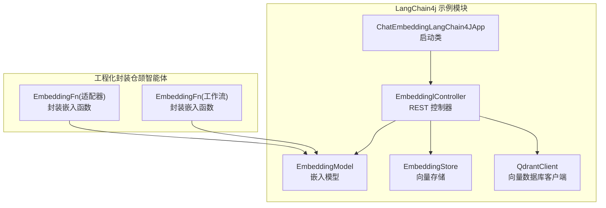
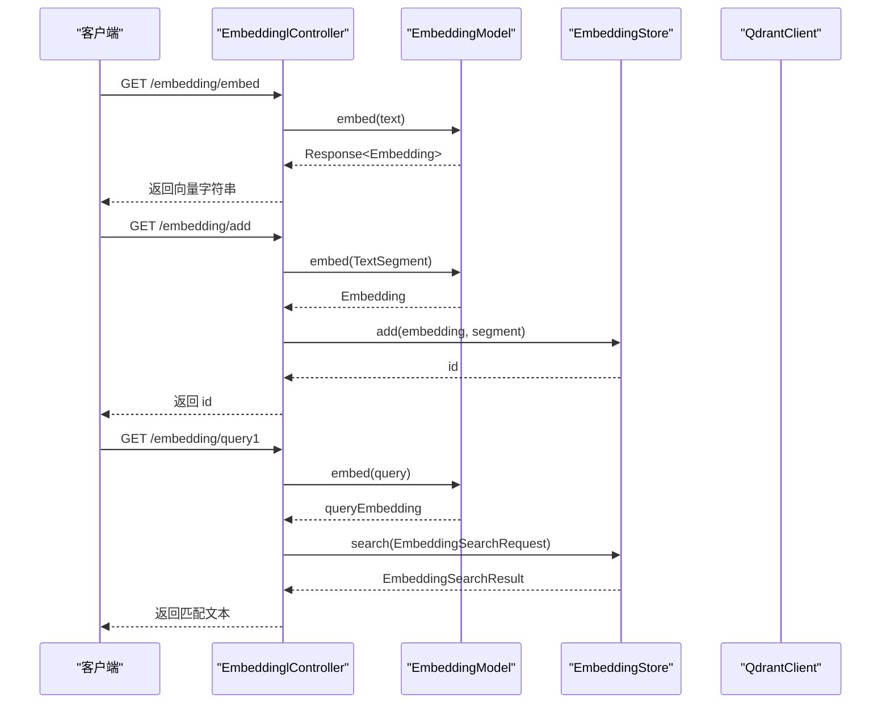
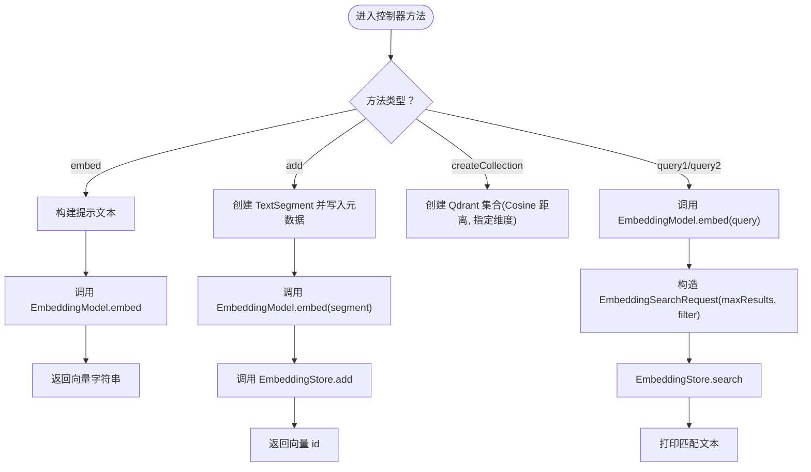
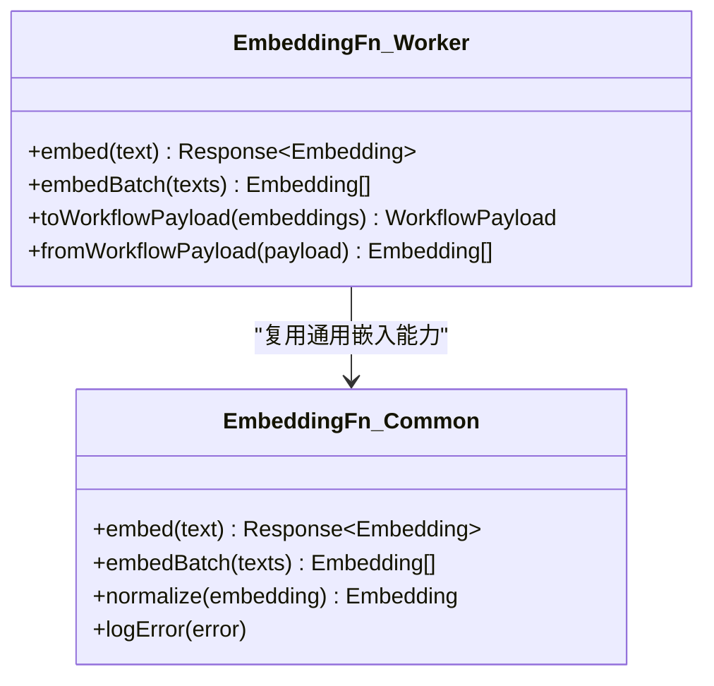
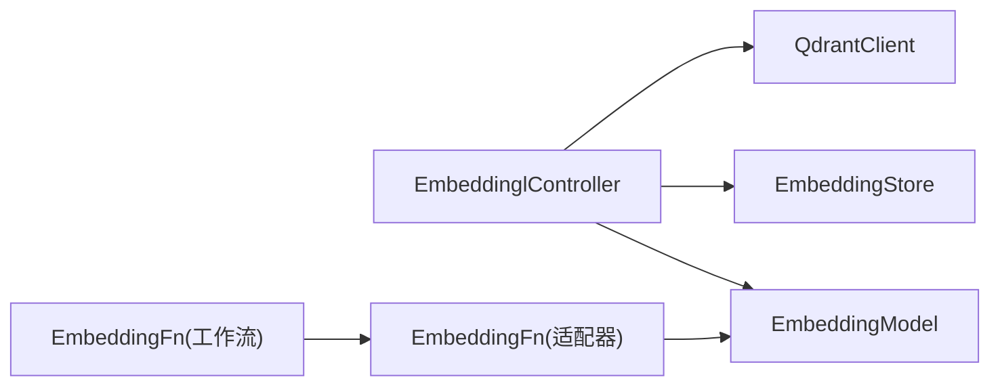

# 嵌入向量

<cite>
**本文引用的文件**   
- [EmbeddinglController.java](file://【2】langchain4j-atguiguV5/langchain4j-12chat-embedding/src/main/java/com/atguigu/study/controller/EmbeddinglController.java)
- [ChatEmbeddingLangChain4JApp.java](file://【2】langchain4j-atguiguV5/langchain4j-12chat-embedding/src/main/java/com/atguigu/study/ChatEmbeddingLangChain4JApp.java)
- [EmbeddingFn.java](file://【3】工作资料/code/仓颉智能体/nlp-agent/agent-common/agent-rag-adapter/src/main/java/com/yundingtech/agent/adapter/provider/model/search/EmbeddingFn.java)
- [EmbeddingFn.java](file://【3】工作资料/code/仓颉智能体/nlp-agent/agent-worker/src/main/java/com/yundingtech/agent/work/modules/workflow/model/search/EmbeddingFn.java)
</cite>

## 目录
1. [引言](#引言)
2. [项目结构](#项目结构)
3. [核心组件](#核心组件)
4. [架构总览](#架构总览)
5. [详细组件分析](#详细组件分析)
6. [依赖分析](#依赖分析)
7. [性能考虑](#性能考虑)
8. [故障排查指南](#故障排查指南)
9. [结论](#结论)
10. [附录](#附录)

## 引言
本指南围绕 LangChain4j 的嵌入向量能力，系统讲解文本嵌入的原理与应用，涵盖向量生成、相似度计算与语义检索；并通过 EmbeddinglController 展示如何在 Spring Boot 中实现文本向量化处理，包括批量处理、缓存策略与性能优化建议；同时对 LLMConfig 中的嵌入模型配置进行说明，并给出与 Milvus、Pinecone、Qdrant 等向量数据库的对接思路与查询流程。最后提供相似度算法比较、阈值设定与结果排序策略，以及面向实际场景的最佳实践。

## 项目结构
本仓库包含多个 Spring AI 示例模块，其中与嵌入向量直接相关的是 langchain4j-12chat-embedding 模块，其控制器负责演示 EmbeddingModel 的使用、向量存储检索与 Qdrant 的集合管理。此外，工作资料中的“仓颉智能体”项目提供了两处 EmbeddingFn 的实现，可作为工程化封装与复用的参考。

**图表来源**
- [EmbeddinglController.java:26-34](file://【2】langchain4j-atguiguV5/langchain4j-12chat-embedding/src/main/java/com/atguigu/study/controller/EmbeddinglController.java#L26-L34)
- [ChatEmbeddingLangChain4JApp.java:11-18](file://【2】langchain4j-atguiguV5/langchain4j-12chat-embedding/src/main/java/com/atguigu/study/ChatEmbeddingLangChain4JApp.java#L11-L18)
- [EmbeddingFn.java](file://【3】工作资料/code/仓颉智能体/nlp-agent/agent-common/agent-rag-adapter/src/main/java/com/yundingtech/agent/adapter/provider/model/search/EmbeddingFn.java)
- [EmbeddingFn.java](file://【3】工作资料/code/仓颉智能体/nlp-agent/agent-worker/src/main/java/com/yundingtech/agent/work/modules/workflow/model/search/EmbeddingFn.java)

**章节来源**
- [EmbeddinglController.java:26-34](file://【2】langchain4j-atguiguV5/langchain4j-12chat-embedding/src/main/java/com/atguigu/study/controller/EmbeddinglController.java#L26-L34)
- [ChatEmbeddingLangChain4JApp.java:11-18](file://【2】langchain4j-atguiguV5/langchain4j-12chat-embedding/src/main/java/com/atguigu/study/ChatEmbeddingLangChain4JApp.java#L11-L18)

## 核心组件
- EmbeddinglController：演示嵌入生成、向量写入、检索与过滤查询，以及 Qdrant 集合创建。
- EmbeddingModel：LangChain4j 提供的统一嵌入模型抽象，负责将文本转换为向量。
- EmbeddingStore：LangChain4j 的向量存储接口，支持相似度检索与元数据过滤。
- QdrantClient：向量数据库客户端，用于集合管理与写入/查询。
- EmbeddingFn（工程化封装）：在“仓颉智能体”项目中，分别在适配器与工作流模块中提供嵌入函数封装，便于复用与扩展。

**章节来源**
- [EmbeddinglController.java:28-34](file://【2】langchain4j-atguiguV5/langchain4j-12chat-embedding/src/main/java/com/atguigu/study/controller/EmbeddinglController.java#L28-L34)
- [EmbeddingFn.java](file://【3】工作资料/code/仓颉智能体/nlp-agent/agent-common/agent-rag-adapter/src/main/java/com/yundingtech/agent/adapter/provider/model/search/EmbeddingFn.java)
- [EmbeddingFn.java](file://【3】工作资料/code/仓颉智能体/nlp-agent/agent-worker/src/main/java/com/yundingtech/agent/work/modules/workflow/model/search/EmbeddingFn.java)

## 架构总览
下图展示了从控制器到嵌入模型、向量存储与数据库的整体交互流程：

**图表来源**
- [EmbeddinglController.java:45-109](file://【2】langchain4j-atguiguV5/langchain4j-12chat-embedding/src/main/java/com/atguigu/study/controller/EmbeddinglController.java#L45-L109)

## 详细组件分析

### 控制器：EmbeddinglController
- 功能概览
  - 文本向量化：将输入文本转换为向量并返回。
  - 写入向量库：将分段文本及其向量写入 EmbeddingStore。
  - 创建集合：通过 QdrantClient 创建向量集合并指定距离度量与维度。
  - 检索与过滤：基于查询向量进行相似度检索，并支持按元数据过滤。
- 关键点
  - 使用 EmbeddingModel 进行嵌入生成。
  - 使用 EmbeddingStore 进行向量写入与检索。
  - 使用 QdrantClient 进行集合创建与异步操作。
  - 支持 MetadataFilterBuilder 进行元数据过滤（如作者）。

**图表来源**
- [EmbeddinglController.java:45-124](file://【2】langchain4j-atguiguV5/langchain4j-12chat-embedding/src/main/java/com/atguigu/study/controller/EmbeddinglController.java#L45-L124)

**章节来源**
- [EmbeddinglController.java:45-124](file://【2】langchain4j-atguiguV5/langchain4j-12chat-embedding/src/main/java/com/atguigu/study/controller/EmbeddinglController.java#L45-L124)

### 启动类：ChatEmbeddingLangChain4JApp
- 作用：标准 Spring Boot 启动入口，加载上下文并运行应用。

**章节来源**
- [ChatEmbeddingLangChain4JApp.java:11-18](file://【2】langchain4j-atguiguV5/langchain4j-12chat-embedding/src/main/java/com/atguigu/study/ChatEmbeddingLangChain4JApp.java#L11-L18)

### 工程化封装：EmbeddingFn
- 位置与用途
  - 适配器模块：agent-rag-adapter 中的 EmbeddingFn，用于将嵌入生成逻辑封装为可复用的服务或工具。
  - 工作流模块：agent-worker 中的 EmbeddingFn，面向工作流场景的嵌入生成与传递。
- 设计要点
  - 将 EmbeddingModel 的调用封装为统一接口，便于在不同模块间复用。
  - 支持批量嵌入、错误处理与日志记录，提升稳定性与可观测性。

**图表来源**
- [EmbeddingFn.java](file://【3】工作资料/code/仓颉智能体/nlp-agent/agent-common/agent-rag-adapter/src/main/java/com/yundingtech/agent/adapter/provider/model/search/EmbeddingFn.java)
- [EmbeddingFn.java](file://【3】工作资料/code/仓颉智能体/nlp-agent/agent-worker/src/main/java/com/yundingtech/agent/work/modules/workflow/model/search/EmbeddingFn.java)

**章节来源**
- [EmbeddingFn.java](file://【3】工作资料/code/仓颉智能体/nlp-agent/agent-common/agent-rag-adapter/src/main/java/com/yundingtech/agent/adapter/provider/model/search/EmbeddingFn.java)
- [EmbeddingFn.java](file://【3】工作资料/code/仓颉智能体/nlp-agent/agent-worker/src/main/java/com/yundingtech/agent/work/modules/workflow/model/search/EmbeddingFn.java)

## 依赖分析
- 组件耦合
  - EmbeddinglController 依赖 EmbeddingModel、EmbeddingStore 与 QdrantClient，体现“控制器-模型-存储-数据库”的分层。
  - 工程化封装的 EmbeddingFn 与 EmbeddingModel 解耦，便于在不同模块中复用。
- 外部依赖
  - Qdrant 客户端用于集合管理与写入/查询。
  - LangChain4j 的 EmbeddingModel 与 EmbeddingStore 提供跨模型与存储的抽象。

**图表来源**
- [EmbeddinglController.java:28-34](file://【2】langchain4j-atguiguV5/langchain4j-12chat-embedding/src/main/java/com/atguigu/study/controller/EmbeddinglController.java#L28-L34)
- [EmbeddingFn.java](file://【3】工作资料/code/仓颉智能体/nlp-agent/agent-common/agent-rag-adapter/src/main/java/com/yundingtech/agent/adapter/provider/model/search/EmbeddingFn.java)
- [EmbeddingFn.java](file://【3】工作资料/code/仓颉智能体/nlp-agent/agent-worker/src/main/java/com/yundingtech/agent/work/modules/workflow/model/search/EmbeddingFn.java)

**章节来源**
- [EmbeddinglController.java:28-34](file://【2】langchain4j-atguiguV5/langchain4j-12chat-embedding/src/main/java/com/atguigu/study/controller/EmbeddinglController.java#L28-L34)

## 性能考虑
- 批量处理
  - 在 EmbeddingFn 中提供批量嵌入接口，减少网络往返与模型调用开销。
  - 对长文本进行分段嵌入时，注意控制单次请求大小与并发度。
- 缓存策略
  - 对热点文本或重复查询结果进行缓存，降低重复嵌入与检索成本。
  - 结合 TTL 与失效策略，避免陈旧数据影响检索质量。
- 精度与维度权衡
  - 更高的维度通常带来更强的表达能力，但会增加存储与计算成本；需结合业务场景选择合适维度。
  - 距离度量（如余弦距离）与归一化向量可提升检索稳定性。
- I/O 与并发
  - 合理设置向量库写入与查询的并发度，避免阻塞主线程。
  - 对嵌入模型调用进行限流与熔断，防止突发流量导致延迟飙升。

## 故障排查指南
- 常见问题
  - 向量维度不一致：确保写入与查询使用相同维度与距离度量。
  - 元数据过滤无效：检查过滤键是否存在且拼写正确。
  - Qdrant 集合未创建：先执行集合创建再写入数据。
- 日志与监控
  - 在 EmbeddingFn 中记录嵌入耗时、错误码与异常堆栈，便于定位问题。
  - 对检索命中率、平均检索耗时与缓存命中率进行监控，及时发现性能退化。

**章节来源**
- [EmbeddinglController.java:67-75](file://【2】langchain4j-atguiguV5/langchain4j-12chat-embedding/src/main/java/com/atguigu/study/controller/EmbeddinglController.java#L67-L75)
- [EmbeddinglController.java:111-124](file://【2】langchain4j-atguiguV5/langchain4j-12chat-embedding/src/main/java/com/atguigu/study/controller/EmbeddinglController.java#L111-L124)

## 结论
通过 EmbeddinglController 与 EmbeddingFn 的组合，可以高效地完成文本嵌入、向量写入、检索与过滤，并以 Qdrant 为例完成向量数据库的集成。工程化封装使得嵌入能力可在不同模块中复用，提升开发效率与系统稳定性。在实际部署中，应重视批量处理、缓存与性能优化，并建立完善的监控与告警机制，以保障语义检索系统的可用性与效果。

## 附录

### 相似度算法与阈值设定
- 常用相似度
  - 余弦相似度：衡量向量夹角，适合归一化后的向量。
  - 欧氏距离：衡量向量空间中的直线距离，受向量尺度影响较大。
  - 内积：与方向相关，适合非归一化场景。
- 阈值设定
  - 初期可采用固定阈值，结合业务召回与准确率曲线调整。
  - 动态阈值：根据置信度分布与业务目标动态调整。
- 结果排序
  - 优先按相似度降序排列，其次按相关元数据（如时间、来源）排序。

### 向量数据库集成方案（思路）
- Milvus
  - 使用官方 Java 客户端，创建集合、索引与分区；支持布尔/数值/JSON 元数据过滤。
  - 建议：合理设置向量维度、索引类型（例如 IVF_FLAT/IVF_SQ8/HNSW）与查询参数。
- Pinecone
  - 通过官方 SDK 管理索引与命名空间；支持向量上载与过滤查询。
  - 建议：利用命名空间隔离不同业务数据，设置副本与压缩策略。
- Qdrant
  - 已在示例中使用，支持集合创建、向量写入与过滤查询；Cosine 距离与向量维度需与模型一致。
  - 建议：开启批量写入、合理设置分页与过滤条件，避免超时。

### 实际应用场景最佳实践
- 预处理
  - 分段策略：按句子或段落切分，保留上下文窗口；避免过短导致语义碎片化。
  - 清洗与标准化：去除噪声字符、统一编码与大小写。
- 后处理
  - 归一化与截断：确保向量长度一致；必要时进行裁剪或填充。
  - 结果重排：结合元数据与业务规则进行二次排序。
- 监控指标
  - 嵌入耗时、向量维度、写入/查询吞吐、命中率、平均检索耗时、缓存命中率、错误率。