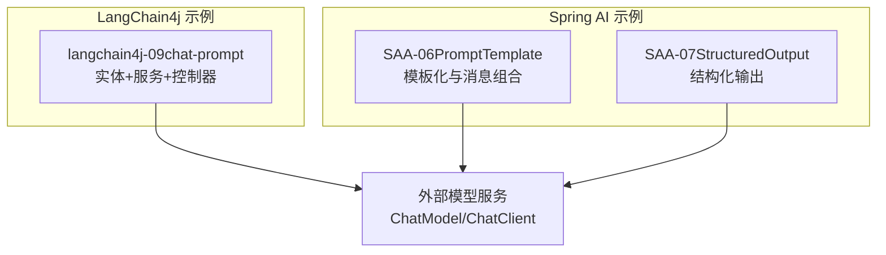
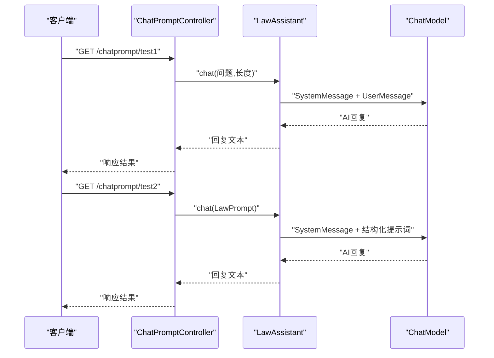
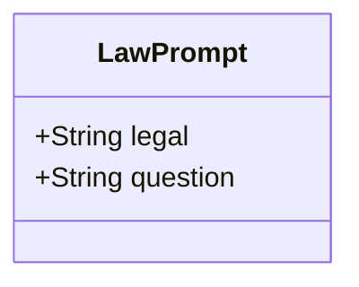
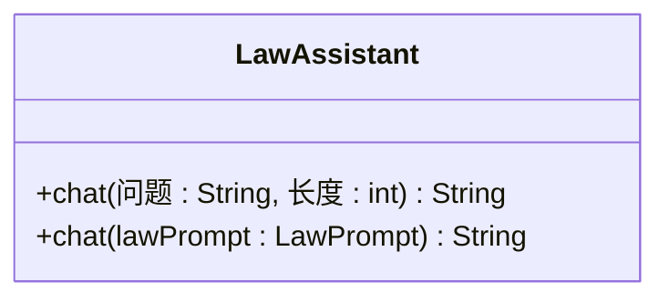
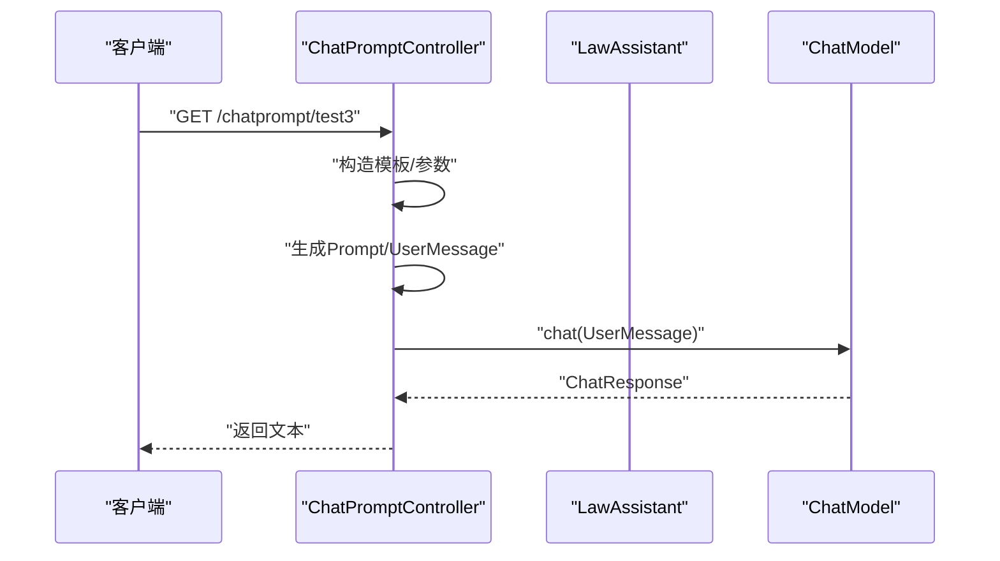
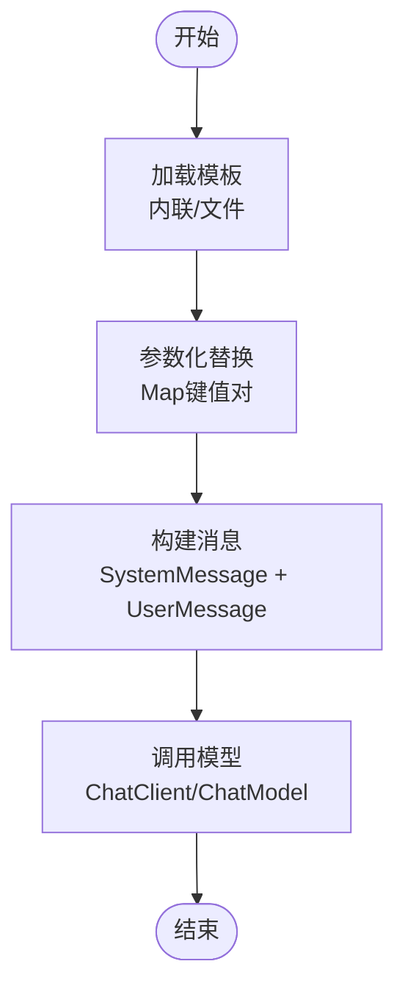
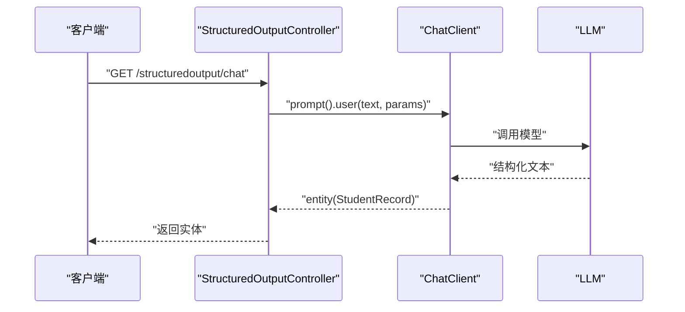
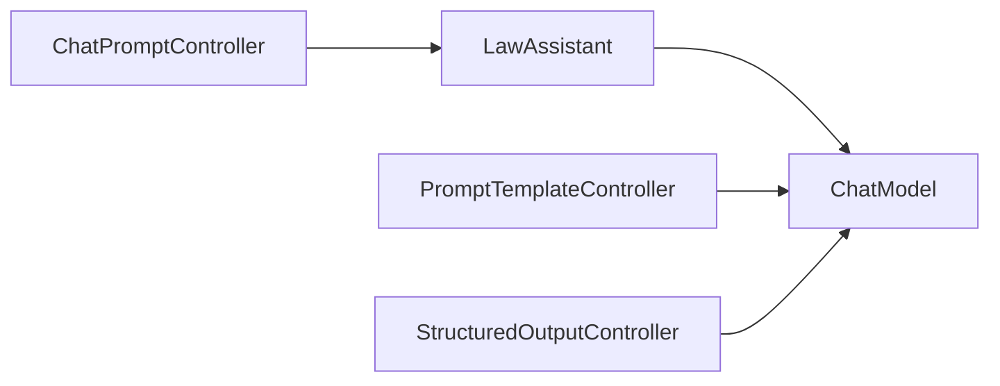

# 提示词工程

<cite>
**本文引用的文件**
- [LawPrompt.java](file://【2】langchain4j-atguiguV5/langchain4j-09chat-prompt/src/main/java/com/atguigu/study/entities/LawPrompt.java)
- [LawAssistant.java](file://【2】langchain4j-atguiguV5/langchain4j-09chat-prompt/src/main/java/com/atguigu/study/service/LawAssistant.java)
- [ChatPromptController.java](file://【2】langchain4j-atguiguV5/langchain4j-09chat-prompt/src/main/java/com/atguigu/study/controller/ChatPromptController.java)
- [PromptTemplateController.java](file://【1】SpringAIAlibaba-atguiguV1/SAA-06PromptTemplate/src/main/java/com/atguigu/study/controller/PromptTemplateController.java)
- [StructuredOutputController.java](file://【1】SpringAIAlibaba-atguiguV1/SAA-07StructuredOutput/src/main/java/com/atguigu/study/controller/StructuredOutputController.java)
- [atguigu-template.txt](file://【1】SpringAIAlibaba-atguiguV1/SAA-06PromptTemplate/src/main/resources/prompttemplate/atguigu-template.txt)
</cite>

## 目录
1. [引言](#引言)
2. [项目结构](#项目结构)
3. [核心组件](#核心组件)
4. [架构总览](#架构总览)
5. [详细组件分析](#详细组件分析)
6. [依赖分析](#依赖分析)
7. [性能考量](#性能考量)
8. [故障排查指南](#故障排查指南)
9. [结论](#结论)
10. [附录](#附录)

## 引言
本设计指南围绕LangChain4j提示词工程模块，系统阐述提示词设计原则与实践方法，涵盖指令清晰性、上下文提供与输出格式约束三大维度。通过“法律咨询”场景的LawPrompt实体与LawAssistant服务，演示结构化提示词模板的设计要点与合规边界；结合ChatPromptController提供的完整API接口设计，覆盖提示词验证、错误处理与性能优化；同时补充PromptTemplate与结构化输出等通用能力，形成从模板到执行的全链路设计与落地方案。最后给出提示词效果评估方法、A/B测试策略与持续改进流程，帮助团队建立可复用、可演进的提示词工程体系。

## 项目结构
本仓库包含多套Spring AI与LangChain4j示例工程，其中与提示词工程直接相关的核心模块如下：
- langchain4j-09chat-prompt：包含LawPrompt实体、LawAssistant服务与ChatPromptController，用于演示结构化提示词与API集成。
- SAA-06PromptTemplate：演示PromptTemplate模板化管理、参数化替换与系统消息/用户消息组合。
- SAA-07StructuredOutput：演示结构化输出与实体映射，便于将LLM输出约束到固定结构。

**章节来源**
- [ChatPromptController.java:1-106](file://【2】langchain4j-atguiguV5/langchain4j-09chat-prompt/src/main/java/com/atguigu/study/controller/ChatPromptController.java#L1-L106)
- [PromptTemplateController.java:1-157](file://【1】SpringAIAlibaba-atguiguV1/SAA-06PromptTemplate/src/main/java/com/atguigu/study/controller/PromptTemplateController.java#L1-L157)
- [StructuredOutputController.java:1-66](file://【1】SpringAIAlibaba-atguiguV1/SAA-07StructuredOutput/src/main/java/com/atguigu/study/controller/StructuredOutputController.java#L1-L66)

## 核心组件
- LawPrompt：基于LangChain4j的结构化提示词注解，定义法律领域输入参数与模板文本，确保参数化替换与模板一致性。
- LawAssistant：定义面向法律咨询的提示词接口，包含系统消息与用户消息的职责边界，以及结构化提示词调用方式。
- ChatPromptController：提供HTTP接口，演示参数化提示词、结构化提示词与模板化提示词的多种调用路径，包含基础验证与返回封装。
- PromptTemplateController：展示模板文件加载、参数化替换、系统消息与用户消息组合、流式输出等能力。
- StructuredOutputController：展示将LLM输出映射为结构化实体，确保输出格式与业务模型一致。

**章节来源**
- [LawPrompt.java:1-18](file://【2】langchain4j-atguiguV5/langchain4j-09chat-prompt/src/main/java/com/atguigu/study/entities/LawPrompt.java#L1-L18)
- [LawAssistant.java:1-28](file://【2】langchain4j-atguiguV5/langchain4j-09chat-prompt/src/main/java/com/atguigu/study/service/LawAssistant.java#L1-L28)
- [ChatPromptController.java:1-106](file://【2】langchain4j-atguiguV5/langchain4j-09chat-prompt/src/main/java/com/atguigu/study/controller/ChatPromptController.java#L1-L106)
- [PromptTemplateController.java:1-157](file://【1】SpringAIAlibaba-atguiguV1/SAA-06PromptTemplate/src/main/java/com/atguigu/study/controller/PromptTemplateController.java#L1-L157)
- [StructuredOutputController.java:1-66](file://【1】SpringAIAlibaba-atguiguV1/SAA-07StructuredOutput/src/main/java/com/atguigu/study/controller/StructuredOutputController.java#L1-L66)

## 架构总览
提示词工程的端到端流程包括：模板定义与参数化、消息构建与系统边界设定、模型调用与输出解析、结果返回与监控评估。下图展示了从控制器到服务再到模型调用的关键交互：

**图表来源**
- [ChatPromptController.java:34-51](file://【2】langchain4j-atguiguV5/langchain4j-09chat-prompt/src/main/java/com/atguigu/study/controller/ChatPromptController.java#L34-L51)
- [ChatPromptController.java:59-72](file://【2】langchain4j-atguiguV5/langchain4j-09chat-prompt/src/main/java/com/atguigu/study/controller/ChatPromptController.java#L59-L72)
- [LawAssistant.java:15-27](file://【2】langchain4j-atguiguV5/langchain4j-09chat-prompt/src/main/java/com/atguigu/study/service/LawAssistant.java#L15-L27)

**章节来源**
- [ChatPromptController.java:1-106](file://【2】langchain4j-atguiguV5/langchain4j-09chat-prompt/src/main/java/com/atguigu/study/controller/ChatPromptController.java#L1-L106)
- [LawAssistant.java:1-28](file://【2】langchain4j-atguiguV5/langchain4j-09chat-prompt/src/main/java/com/atguigu/study/service/LawAssistant.java#L1-L28)

## 详细组件分析

### LawPrompt 实体设计
- 设计原则
  - 指令清晰性：通过结构化注解明确模板文本与参数占位符，避免歧义。
  - 参数最小化：仅暴露必要字段，降低调用复杂度。
  - 可扩展性：新增参数时保持模板兼容与默认值策略。
- 数据结构与复杂度
  - 字段数量少、访问简单，复杂度为O(1)。
  - 与LangChain4j结构化提示词注解配合，实现编译期/运行期参数绑定。
- 关键点
  - 模板字符串中使用参数占位符，确保与服务层参数名称一致。
  - 避免在模板中硬编码敏感信息或超出领域范围的内容。

**图表来源**
- [LawPrompt.java:11-17](file://【2】langchain4j-atguiguV5/langchain4j-09chat-prompt/src/main/java/com/atguigu/study/entities/LawPrompt.java#L11-L17)

**章节来源**
- [LawPrompt.java:1-18](file://【2】langchain4j-atguiguV5/langchain4j-09chat-prompt/src/main/java/com/atguigu/study/entities/LawPrompt.java#L1-L18)

### LawAssistant 服务接口
- 设计原则
  - 指令清晰性：系统消息明确角色与边界，限定回答领域。
  - 上下文提供：通过参数化提示词与结构化实体传递上下文。
  - 输出格式约束：在系统消息中约束输出格式与长度，减少后处理成本。
- 方法与职责
  - 参数化提示词调用：面向通用问题，灵活传参。
  - 结构化提示词调用：面向法律咨询场景，统一模板与参数。
- 错误与边界
  - 对于非法律领域问题，系统消息应直接拒绝回答，避免误导。

**图表来源**
- [LawAssistant.java:13-27](file://【2】langchain4j-atguiguV5/langchain4j-09chat-prompt/src/main/java/com/atguigu/study/service/LawAssistant.java#L13-L27)

**章节来源**
- [LawAssistant.java:1-28](file://【2】langchain4j-atguiguV5/langchain4j-09chat-prompt/src/main/java/com/atguigu/study/service/LawAssistant.java#L1-L28)

### ChatPromptController API 设计
- 功能概览
  - test1：参数化提示词调用，演示跨领域问题与合规边界。
  - test2：结构化提示词调用，使用LawPrompt实体。
  - test3：模板化提示词调用，展示PromptTemplate与UserMessage转换。
- 提示词验证
  - 参数校验：对必填参数进行判空与长度限制。
  - 模板占位符匹配：确保模板中的占位符与传入参数一致。
- 错误处理
  - 捕获模型调用异常，返回统一错误信息。
  - 对于非法律问题，依据系统消息直接返回预设提示。
- 性能优化
  - 复用ChatModel实例，避免重复创建。
  - 对高频调用场景启用连接池与超时控制。
  - 控制输出长度，减少Token消耗与往返延迟。

**图表来源**
- [ChatPromptController.java:80-104](file://【2】langchain4j-atguiguV5/langchain4j-09chat-prompt/src/main/java/com/atguigu/study/controller/ChatPromptController.java#L80-L104)

**章节来源**
- [ChatPromptController.java:1-106](file://【2】langchain4j-atguiguV5/langchain4j-09chat-prompt/src/main/java/com/atguigu/study/controller/ChatPromptController.java#L1-L106)

### PromptTemplate 模板化与消息组合
- 模板化管理
  - 内联模板：适合简单场景，参数直接拼接。
  - 文件模板：通过资源文件加载，便于版本管理与多人协作。
- 参数化替换
  - 使用Map进行键值替换，注意占位符命名一致性。
  - 默认占位符行为：当使用单参数且未指定名称时，系统可能采用默认占位符策略。
- 消息组合
  - SystemPromptTemplate与PromptTemplate组合，形成系统边界与用户意图的完整提示词。
  - 支持ChatClient与ChatModel两种调用方式，满足不同场景的性能与易用性需求。

**图表来源**
- [PromptTemplateController.java:54-69](file://【1】SpringAIAlibaba-atguiguV1/SAA-06PromptTemplate/src/main/java/com/atguigu/study/controller/PromptTemplateController.java#L54-L69)
- [PromptTemplateController.java:81-89](file://【1】SpringAIAlibaba-atguiguV1/SAA-06PromptTemplate/src/main/java/com/atguigu/study/controller/PromptTemplateController.java#L81-L89)
- [PromptTemplateController.java:101-114](file://【1】SpringAIAlibaba-atguiguV1/SAA-06PromptTemplate/src/main/java/com/atguigu/study/controller/PromptTemplateController.java#L101-L114)

**章节来源**
- [PromptTemplateController.java:1-157](file://【1】SpringAIAlibaba-atguiguV1/SAA-06PromptTemplate/src/main/java/com/atguigu/study/controller/PromptTemplateController.java#L1-L157)
- [atguigu-template.txt:1-1](file://【1】SpringAIAlibaba-atguiguV1/SAA-06PromptTemplate/src/main/resources/prompttemplate/atguigu-template.txt#L1-L1)

### 结构化输出与实体映射
- 设计原则
  - 输出约束：通过结构化实体约束LLM输出格式，减少后处理与解析成本。
  - 参数化输入：将业务参数注入到提示词中，保证上下文完整性。
- 实现要点
  - 将提示词文本与参数通过ChatClient或ChatModel注入。
  - 使用实体映射方法将模型输出转换为强类型对象。
  - 在模板中明确字段占位符，确保与实体属性一一对应。

**图表来源**
- [StructuredOutputController.java:28-42](file://【1】SpringAIAlibaba-atguiguV1/SAA-07StructuredOutput/src/main/java/com/atguigu/study/controller/StructuredOutputController.java#L28-L42)
- [StructuredOutputController.java:50-64](file://【1】SpringAIAlibaba-atguiguV1/SAA-07StructuredOutput/src/main/java/com/atguigu/study/controller/StructuredOutputController.java#L50-L64)

**章节来源**
- [StructuredOutputController.java:1-66](file://【1】SpringAIAlibaba-atguiguV1/SAA-07StructuredOutput/src/main/java/com/atguigu/study/controller/StructuredOutputController.java#L1-L66)

## 依赖分析
- 组件耦合
  - ChatPromptController依赖LawAssistant与ChatModel，体现控制层与服务层的清晰分层。
  - LawAssistant通过LangChain4j注解与模型交互，降低对具体实现的耦合。
  - PromptTemplateController与StructuredOutputController分别演示模板化与结构化输出，彼此独立。
- 外部依赖
  - ChatModel/ChatClient：负责与外部大模型服务通信。
  - Hutool：用于时间格式化等辅助功能（在控制器中使用）。
- 潜在风险
  - 模板占位符与参数名称不一致会导致运行时异常。
  - 非法律领域问题若未正确设置系统消息边界，可能导致越权输出。

**图表来源**
- [ChatPromptController.java:29-32](file://【2】langchain4j-atguiguV5/langchain4j-09chat-prompt/src/main/java/com/atguigu/study/controller/ChatPromptController.java#L29-L32)
- [PromptTemplateController.java:28-36](file://【1】SpringAIAlibaba-atguiguV1/SAA-06PromptTemplate/src/main/java/com/atguigu/study/controller/PromptTemplateController.java#L28-L36)
- [StructuredOutputController.java:20-21](file://【1】SpringAIAlibaba-atguiguV1/SAA-07StructuredOutput/src/main/java/com/atguigu/study/controller/StructuredOutputController.java#L20-L21)

**章节来源**
- [ChatPromptController.java:1-106](file://【2】langchain4j-atguiguV5/langchain4j-09chat-prompt/src/main/java/com/atguigu/study/controller/ChatPromptController.java#L1-L106)
- [PromptTemplateController.java:1-157](file://【1】SpringAIAlibaba-atguiguV1/SAA-06PromptTemplate/src/main/java/com/atguigu/study/controller/PromptTemplateController.java#L1-L157)
- [StructuredOutputController.java:1-66](file://【1】SpringAIAlibaba-atguiguV1/SAA-07StructuredOutput/src/main/java/com/atguigu/study/controller/StructuredOutputController.java#L1-L66)

## 性能考量
- 模板与参数
  - 优先使用文件模板与参数化替换，减少字符串拼接开销。
  - 对高频参数进行缓存与复用，避免重复构建。
- 消息与调用
  - 合理设置系统消息边界，减少无效输出与重试。
  - 控制输出长度与上下文长度，降低Token消耗与延迟。
- 并发与资源
  - 复用ChatModel/ChatClient实例，避免频繁创建销毁。
  - 在高并发场景下启用连接池与超时控制，保障稳定性。
- 监控与观测
  - 记录提示词长度、响应时间、错误率等指标，持续优化模板与参数。

## 故障排查指南
- 常见问题
  - 模板占位符缺失：检查模板与参数Map的键是否一致。
  - 非法律领域问题：确认系统消息边界是否正确设置。
  - 模型调用异常：捕获异常并记录上下文参数，便于定位。
- 排查步骤
  - 打印最终提示词与参数，核对占位符替换结果。
  - 分别测试系统消息与用户消息，定位问题来源。
  - 逐步缩小参数范围，定位导致异常的具体参数。
- 建议
  - 在控制器层增加参数校验与默认值处理。
  - 对关键路径增加日志与指标埋点，便于回溯与优化。

**章节来源**
- [ChatPromptController.java:34-51](file://【2】langchain4j-atguiguV5/langchain4j-09chat-prompt/src/main/java/com/atguigu/study/controller/ChatPromptController.java#L34-L51)
- [PromptTemplateController.java:54-69](file://【1】SpringAIAlibaba-atguiguV1/SAA-06PromptTemplate/src/main/java/com/atguigu/study/controller/PromptTemplateController.java#L54-L69)

## 结论
通过LawPrompt实体与LawAssistant服务，本设计将“指令清晰性、上下文提供、输出格式约束”三大原则贯穿到模板设计与接口实现中；结合ChatPromptController的API设计，实现了从模板化管理、参数化替换到动态调整的完整闭环。配合PromptTemplate与结构化输出能力，可进一步提升提示词的可维护性与输出稳定性。建议在实际落地中引入效果评估与A/B测试机制，持续迭代提示词质量与用户体验。

## 附录
- 提示词设计原则速览
  - 指令清晰性：明确角色、任务与边界。
  - 上下文提供：提供必要背景与约束条件。
  - 输出格式约束：限定格式、长度与风格。
- 评估与改进流程
  - 评估指标：准确性、一致性、用户满意度、成本与耗时。
  - A/B测试：对比不同模板与参数组合的效果差异。
  - 持续改进：基于反馈与指标定期优化模板与参数策略。