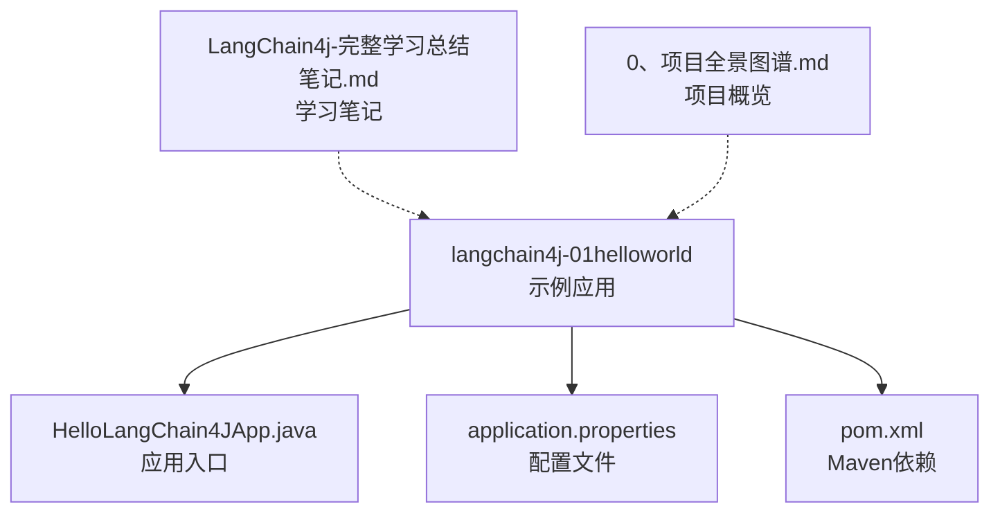
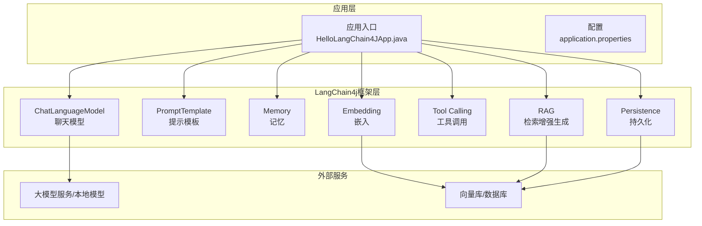
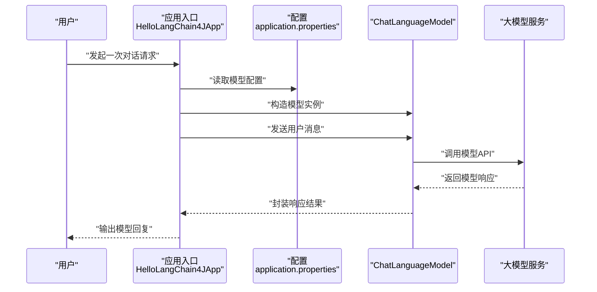

# 框架基础

<cite>
**本文引用的文件**
- [HelloLangChain4JApp.java](file://【2】langchain4j-atguiguV5/langchain4j-01helloworld/src/main/java/com/atguigu/study/HelloLangChain4JApp.java)
- [application.properties](file://【2】langchain4j-atguiguV5/langchain4j-01helloworld/src/main/resources/application.properties)
- [pom.xml](file://【2】langchain4j-atguiguV5/langchain4j-01helloworld/pom.xml)
- [LangChain4j-完整学习总结笔记.md](file://【2】langchain4j-atguiguV5/LangChain4j-完整学习总结笔记.md)
- [LangChain4j-完整学习总结笔记 - 副本.md](file://【2】langchain4j-atguiguV5/LangChain4j-完整学习总结笔记 - 副本.md)
- [README.md](file://0、项目全景图谱.md)
</cite>

## 目录
1. [引言](#引言)
2. [项目结构](#项目结构)
3. [核心组件](#核心组件)
4. [架构总览](#架构总览)
5. [详细组件分析](#详细组件分析)
6. [依赖分析](#依赖分析)
7. [性能考虑](#性能考虑)
8. [故障排查指南](#故障排查指南)
9. [结论](#结论)
10. [附录](#附录)

## 引言
本指南面向初学者，系统介绍LangChain4j在Java生态中的基础理念、架构与核心概念，并结合仓库中的Hello World示例，带你从零开始完成环境搭建、依赖配置与首次运行。你将理解LangChain4j如何以“链式思维”组织AI应用：将提示工程、模型交互、内存与持久化、工具调用等环节以统一抽象串联起来，从而显著降低传统AI开发中“拼装式集成”的复杂度。

LangChain4j的核心优势在于：
- 统一抽象：屏蔽不同大模型供应商与后端实现差异，提供一致的Java API。
- 易组合：通过链式与模块化设计，轻松拼装提示、记忆、工具与RAG等能力。
- 可扩展：支持本地与云端模型、自定义工具、流式输出、结构化输出等。
- 生态友好：与Spring Boot、Micronaut、Quarkus等主流框架无缝集成。

适用场景举例：
- 聊天机器人与客服对话系统
- 结构化问答与RAG检索增强
- 工作流编排与多模态（文本/图像）应用
- 工具调用与外部系统集成

与传统AI开发方式的区别：
- 传统：直接对接SDK或HTTP API，分散处理提示构造、流式输出、错误重试、上下文管理等。
- LangChain4j：以统一的模型接口与组件抽象，将上述关注点内聚到框架层，开发者聚焦业务逻辑。

## 项目结构
本仓库包含多个LangChain4j示例模块，覆盖从Hello World到多模型、流式输出、提示模板、函数调用、嵌入与RAG等主题。本次入门以“Hello World”模块为例，配合Spring Boot进行演示。

**图示来源**
- [HelloLangChain4JApp.java](file://【2】langchain4j-atguiguV5/langchain4j-01helloworld/src/main/java/com/atguigu/study/HelloLangChain4JApp.java)
- [application.properties](file://【2】langchain4j-atguiguV5/langchain4j-01helloworld/src/main/resources/application.properties)
- [pom.xml](file://【2】langchain4j-atguiguV5/langchain4j-01helloworld/pom.xml)
- [LangChain4j-完整学习总结笔记.md](file://【2】langchain4j-atguiguV5/LangChain4j-完整学习总结笔记.md)
- [README.md](file://0、项目全景图谱.md)

**章节来源**
- [HelloLangChain4JApp.java](file://【2】langchain4j-atguiguV5/langchain4j-01helloworld/src/main/java/com/atguigu/study/HelloLangChain4JApp.java)
- [application.properties](file://【2】langchain4j-atguiguV5/langchain4j-01helloworld/src/main/resources/application.properties)
- [pom.xml](file://【2】langchain4j-atguiguV5/langchain4j-01helloworld/pom.xml)
- [README.md](file://0、项目全景图谱.md)

## 核心组件
- ChatLanguageModel（聊天语言模型）
  - 抽象统一的聊天模型调用接口，支持文本输入与多轮对话。
  - 在示例中作为最基础的“与模型对话”能力入口。
- PromptTemplate（提示模板）
  - 将提示词与动态参数解耦，便于复用与迭代。
  - 支持占位符注入、格式化与多段落提示构建。
- Memory（记忆）
  - 记住历史对话，形成上下文，提升连贯性与个性化。
- Persistence（持久化）
  - 将对话、向量、工具调用结果等持久化，支撑跨会话与可恢复能力。
- Tool Calling（工具调用）
  - 将LLM的推理与外部系统能力打通，实现“思考-行动”的闭环。
- Embedding（嵌入）
  - 将文本映射到向量空间，支撑RAG与相似度检索。
- RAG（检索增强生成）
  - 结合检索与生成，提升事实准确性与领域适配能力。

这些组件在示例中以最小可行方式呈现，后续章节将结合具体模块逐步展开。

**章节来源**
- [LangChain4j-完整学习总结笔记.md](file://【2】langchain4j-atguiguV5/LangChain4j-完整学习总结笔记.md)

## 架构总览
下图展示了LangChain4j在应用中的典型位置与交互关系：

**图示来源**
- [HelloLangChain4JApp.java](file://【2】langchain4j-atguiguV5/langchain4j-01helloworld/src/main/java/com/atguigu/study/HelloLangChain4JApp.java)
- [application.properties](file://【2】langchain4j-atguiguV5/langchain4j-01helloworld/src/main/resources/application.properties)

## 详细组件分析

### Hello World 示例（入门必读）
目标：通过一个最小示例，完成一次“与模型对话”的全流程，理解ChatLanguageModel与Spring Boot的集成方式。

- 运行步骤
  1) 准备JDK与Maven：确保已安装JDK与Maven，并可在命令行执行。
  2) 导入模块：打开“langchain4j-01helloworld”模块。
  3) 配置依赖：检查Maven依赖是否齐全（见下一节）。
  4) 配置模型：在配置文件中填写模型访问凭据与参数。
  5) 运行应用：启动应用入口类，观察控制台输出。
  6) 验证结果：确认能收到模型的响应，且无异常。

- 关键文件定位
  - 应用入口：[HelloLangChain4JApp.java](file://【2】langchain4j-atguiguV5/langchain4j-01helloworld/src/main/java/com/atguigu/study/HelloLangChain4JApp.java)
  - 配置文件：[application.properties](file://【2】langchain4j-atguiguV5/langchain4j-01helloworld/src/main/resources/application.properties)
  - 依赖声明：[pom.xml](file://【2】langchain4j-atguiguV5/langchain4j-01helloworld/pom.xml)

- 代码级时序（示例调用链）

**图示来源**
- [HelloLangChain4JApp.java](file://【2】langchain4j-atguiguV5/langchain4j-01helloworld/src/main/java/com/atguigu/study/HelloLangChain4JApp.java)
- [application.properties](file://【2】langchain4j-atguiguV5/langchain4j-01helloworld/src/main/resources/application.properties)

**章节来源**
- [HelloLangChain4JApp.java](file://【2】langchain4j-atguiguV5/langchain4j-01helloworld/src/main/java/com/atguigu/study/HelloLangChain4JApp.java)
- [application.properties](file://【2】langchain4j-atguiguV5/langchain4j-01helloworld/src/main/resources/application.properties)
- [pom.xml](file://【2】langchain4j-atguiguV5/langchain4j-01helloworld/pom.xml)

### 提示模板（PromptTemplate）工作原理
- 设计要点
  - 将“固定提示”与“动态参数”分离，提升可维护性与复用性。
  - 支持多段落、条件分支与参数校验，便于复杂提示的模块化管理。
- 典型流程
  1) 定义模板：在资源目录放置模板文件或以字符串形式声明。
  2) 注入参数：将业务变量替换到模板占位符。
  3) 执行模型：将最终提示交给ChatLanguageModel执行。
- 适用场景
  - 规范化的问答模板
  - 多轮引导与角色扮演
  - 多语言或多领域的提示复用

**章节来源**
- [LangChain4j-完整学习总结笔记.md](file://【2】langchain4j-atguiguV5/LangChain4j-完整学习总结笔记.md)

### 记忆与持久化（Memory/Persistence）
- 记忆（Memory）
  - 保存最近的对话历史，作为后续请求的上下文。
  - 支持内存与外部存储两种实现，便于在性能与容量间权衡。
- 持久化（Persistence）
  - 将对话、向量、工具调用结果等写入数据库或向量库。
  - 支撑跨会话恢复、审计与二次加工。

**章节来源**
- [LangChain4j-完整学习总结笔记.md](file://【2】langchain4j-atguiguV5/LangChain4j-完整学习总结笔记.md)

### 工具调用（Tool Calling）
- 价值
  - 将LLM的“推理”与“执行”解耦，实现“思考-行动”的闭环。
- 实现思路
  - 定义工具签名与行为，注册到LangChain4j工具集合。
  - 在提示中引导模型选择合适工具与参数。
  - 执行工具并回传结果，继续生成最终答案。

**章节来源**
- [LangChain4j-完整学习总结笔记.md](file://【2】langchain4j-atguiguV5/LangChain4j-完整学习总结笔记.md)

### 嵌入与RAG（Embedding/RAG）
- 嵌入（Embedding）
  - 将文本映射到稠密向量，支持相似度检索与聚类。
- RAG
  - 通过检索与生成结合，提升事实准确性与领域适配能力。
  - 典型流程：查询向量化 -> 向量检索 -> 上下文拼接 -> 生成回答。

**章节来源**
- [LangChain4j-完整学习总结笔记.md](file://【2】langchain4j-atguiguV5/LangChain4j-完整学习总结笔记.md)

## 依赖分析
- Maven坐标与版本
  - LangChain4j核心依赖与各模块（如Spring Boot Starter、模型适配器、向量库客户端等）均在示例模块的pom.xml中声明。
  - 建议优先锁定稳定版本，避免因版本冲突导致的运行时异常。
- 典型依赖关系
  - 应用入口依赖LangChain4j Spring Boot Starter。
  - 模型适配器（如OpenAI、Ollama、本地模型）按需引入。
  - 向量库与数据库驱动根据持久化方案引入。
- 版本兼容性
  - JDK版本要求与Maven插件版本需与所选依赖匹配。
  - 若使用Spring Boot，建议遵循其官方版本矩阵。

**章节来源**
- [pom.xml](file://【2】langchain4j-atguiguV5/langchain4j-01helloworld/pom.xml)

## 性能考虑
- 模型调用
  - 合理设置超时与重试策略，避免阻塞主线程。
  - 对长上下文进行截断或摘要，减少Token消耗。
- 流式输出
  - 利用流式接口逐步渲染，改善用户体验。
- 缓存与批处理
  - 对重复提示与嵌入结果进行缓存。
  - 合理批处理嵌入与检索，提升吞吐。
- 内存与持久化
  - 控制记忆窗口大小，定期清理过期会话。
  - 将热点数据放入内存，冷数据下沉到持久化存储。

## 故障排查指南
- 无法连接模型服务
  - 检查网络连通性与代理设置。
  - 确认配置文件中的访问地址、密钥与超时参数。
- 响应为空或异常
  - 查看模型返回的状态码与错误信息。
  - 开启框架日志，定位是提示构造问题还是模型调用失败。
- 依赖冲突
  - 清理Maven缓存并重新下载依赖。
  - 使用依赖树工具排查冲突模块并排除多余版本。
- 上下文过长
  - 优化提示模板，移除冗余信息。
  - 使用摘要或分段策略降低输入长度。
- 记忆与持久化异常
  - 检查数据库连接与表结构。
  - 确认序列化/反序列化兼容性。

## 结论
通过本入门指南，你已了解LangChain4j的核心理念、关键组件与典型架构，并完成了Hello World示例的环境搭建与运行。建议在掌握基础后，逐步探索提示模板、记忆与持久化、工具调用、嵌入与RAG等进阶主题，以构建更贴近生产需求的AI应用。

## 附录
- 学习笔记参考
  - [LangChain4j-完整学习总结笔记.md](file://【2】langchain4j-atguiguV5/LangChain4j-完整学习总结笔记.md)
  - [LangChain4j-完整学习总结笔记 - 副本.md](file://【2】langchain4j-atguiguV5/LangChain4j-完整学习总结笔记 - 副本.md)
- 项目概览
  - [README.md](file://0、项目全景图谱.md)