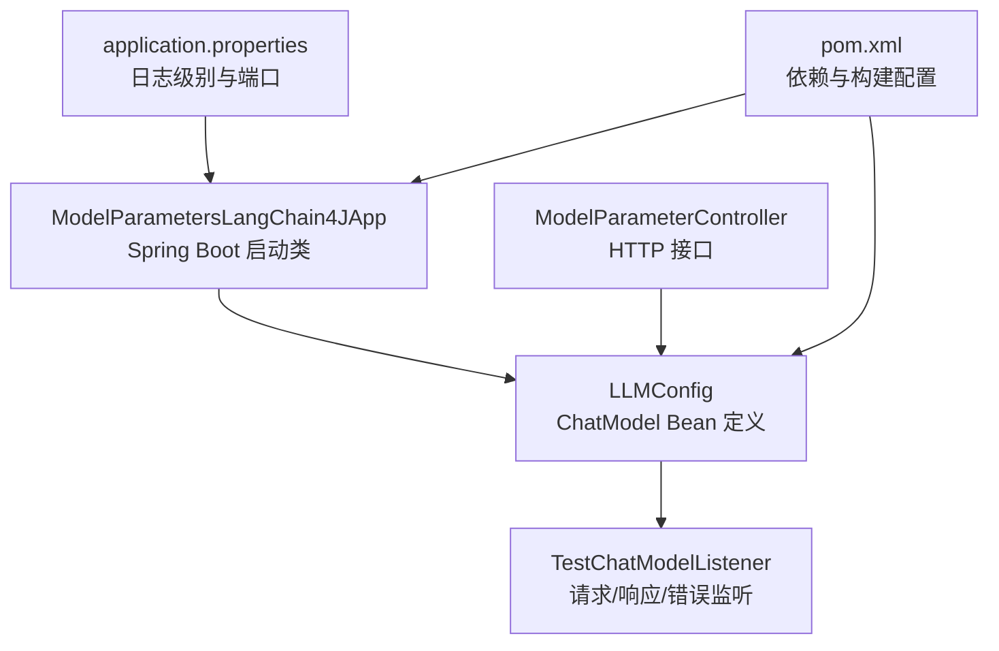
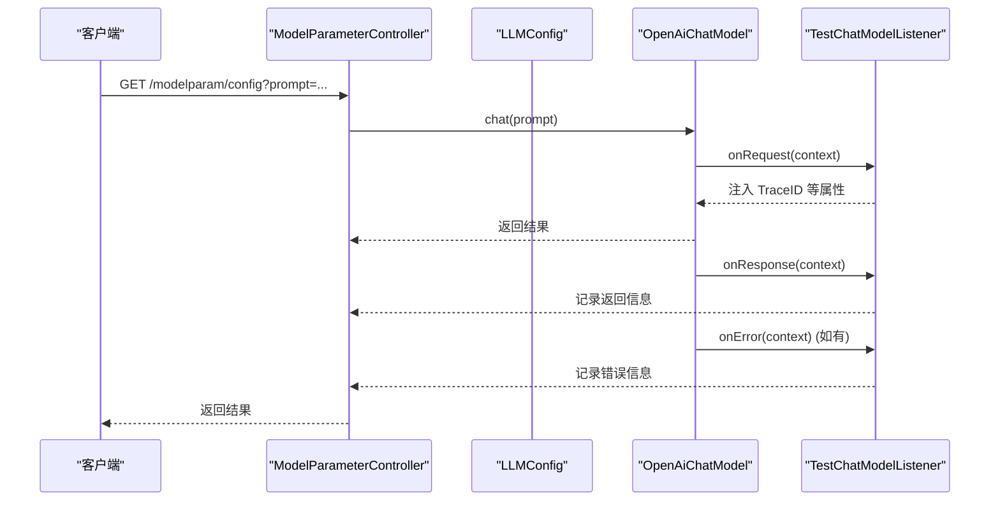
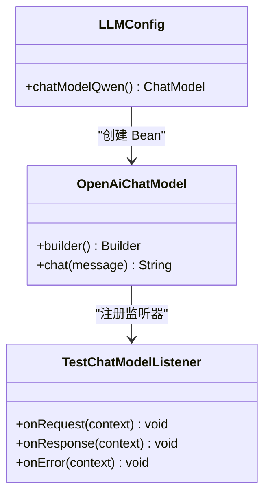
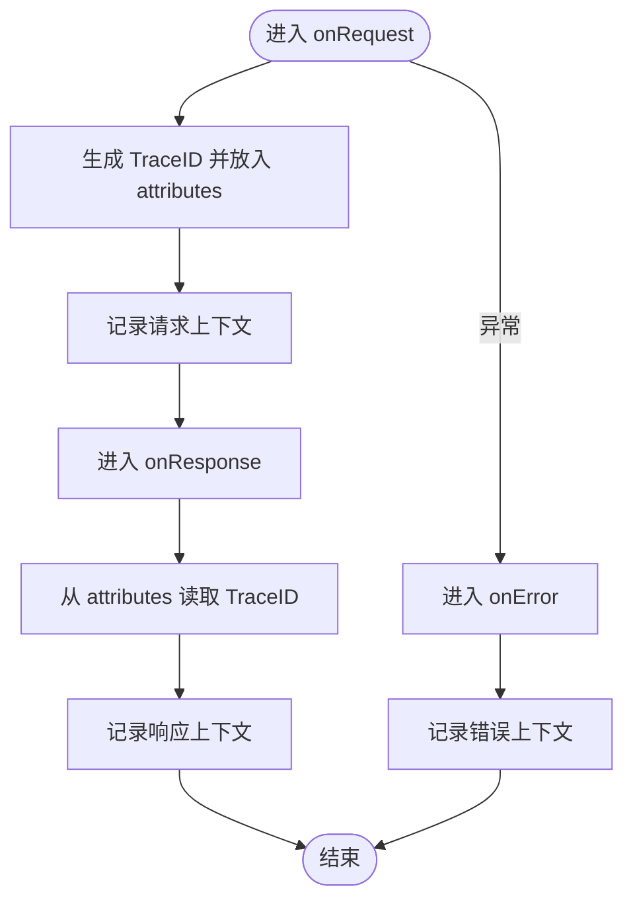
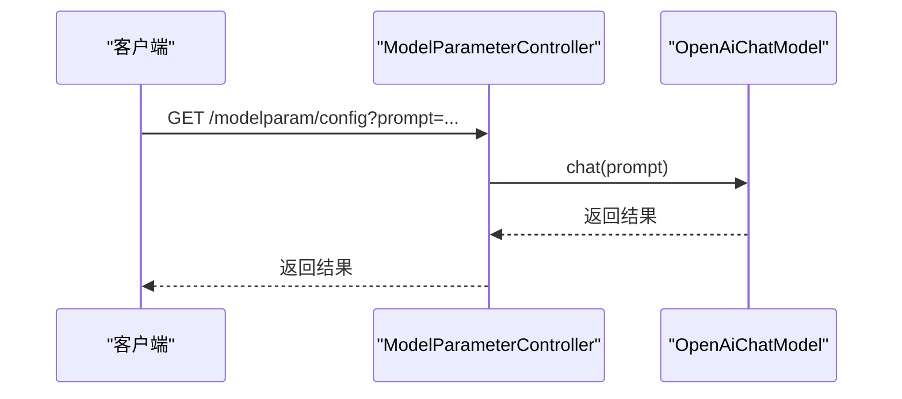
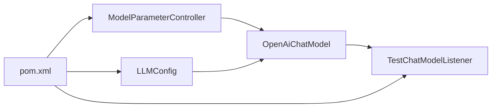

# 模型参数配置

<cite>
**本文引用的文件**
- [ModelParametersLangChain4JApp.java](file://【2】langchain4j-atguiguV5/langchain4j-05model-parameters/src/main/java/com/atguigu/study/ModelParametersLangChain4JApp.java)
- [LLMConfig.java](file://【2】langchain4j-atguiguV5/langchain4j-05model-parameters/src/main/java/com/atguigu/study/config/LLMConfig.java)
- [TestChatModelListener.java](file://【2】langchain4j-atguiguV5/langchain4j-05model-parameters/src/main/java/com/atguigu/study/listener/TestChatModelListener.java)
- [ModelParameterController.java](file://【2】langchain4j-atguiguV5/langchain4j-05model-parameters/src/main/java/com/atguigu/study/controller/ModelParameterController.java)
- [application.properties](file://【2】langchain4j-atguiguV5/langchain4j-05model-parameters/src/main/resources/application.properties)
- [pom.xml](file://【2】langchain4j-atguiguV5/langchain4j-05model-parameters/pom.xml)
</cite>

## 目录
1. [引言](#引言)
2. [项目结构](#项目结构)
3. [核心组件](#核心组件)
4. [架构总览](#架构总览)
5. [详细组件分析](#详细组件分析)
6. [依赖分析](#依赖分析)
7. [性能考虑](#性能考虑)
8. [故障排查指南](#故障排查指南)
9. [结论](#结论)
10. [附录](#附录)

## 引言
本指南围绕 LangChain4j 的“模型参数配置”模块，系统讲解温度（temperature）、最大生成长度（max_tokens）、采样核（top_p）等关键参数的作用机制与调优策略，并结合 LLMConfig 统一配置、环境变量与动态参数调整的实践方法，演示如何通过 TestChatModelListener 监听器采集性能指标、追踪错误与调试信息。同时给出最佳实践、性能基准测试思路以及不同应用场景下的参数选择建议。

## 项目结构
该模块是一个基于 Spring Boot 的最小可运行示例，包含一个配置类用于定义 ChatModel，一个控制器用于对外提供 HTTP 接口，一个监听器用于观察模型调用生命周期，以及基础的 Maven 依赖与日志配置。

**图表来源**
- [ModelParametersLangChain4JApp.java:1-19](file://【2】langchain4j-atguiguV5/langchain4j-05model-parameters/src/main/java/com/atguigu/study/ModelParametersLangChain4JApp.java#L1-L19)
- [LLMConfig.java:1-37](file://【2】langchain4j-atguiguV5/langchain4j-05model-parameters/src/main/java/com/atguigu/study/config/LLMConfig.java#L1-L37)
- [TestChatModelListener.java:1-42](file://【2】langchain4j-atguiguV5/langchain4j-05model-parameters/src/main/java/com/atguigu/study/listener/TestChatModelListener.java#L1-L42)
- [ModelParameterController.java:1-36](file://【2】langchain4j-atguiguV5/langchain4j-05model-parameters/src/main/java/com/atguigu/study/controller/ModelParameterController.java#L1-L36)
- [application.properties:1-6](file://【2】langchain4j-atguiguV5/langchain4j-05model-parameters/src/main/resources/application.properties#L1-L6)
- [pom.xml:1-69](file://【2】langchain4j-atguiguV5/langchain4j-05model-parameters/pom.xml#L1-L69)

**章节来源**
- [ModelParametersLangChain4JApp.java:1-19](file://【2】langchain4j-atguiguV5/langchain4j-05model-parameters/src/main/java/com/atguigu/study/ModelParametersLangChain4JApp.java#L1-L19)
- [application.properties:1-6](file://【2】langchain4j-atguiguV5/langchain4j-05model-parameters/src/main/resources/application.properties#L1-L6)

## 核心组件
- LLMConfig：集中管理 ChatModel Bean，设置模型提供商、认证、超时、重试、日志开关与监听器等。
- TestChatModelListener：实现 ChatModelListener，拦截请求、响应与错误事件，便于观测与排障。
- ModelParameterController：对外暴露 HTTP 接口，调用 ChatModel 执行推理。
- application.properties：设置端口与日志级别，确保 LangChain4j 请求/响应日志生效。
- pom.xml：声明 Spring Web、LangChain4j OpenAI 集成、Lombok、Hutool 等依赖。

**章节来源**
- [LLMConfig.java:1-37](file://【2】langchain4j-atguiguV5/langchain4j-05model-parameters/src/main/java/com/atguigu/study/config/LLMConfig.java#L1-L37)
- [TestChatModelListener.java:1-42](file://【2】langchain4j-atguiguV5/langchain4j-05model-parameters/src/main/java/com/atguigu/study/listener/TestChatModelListener.java#L1-L42)
- [ModelParameterController.java:1-36](file://【2】langchain4j-atguiguV5/langchain4j-05model-parameters/src/main/java/com/atguigu/study/controller/ModelParameterController.java#L1-L36)
- [application.properties:1-6](file://【2】langchain4j-atguiguV5/langchain4j-05model-parameters/src/main/resources/application.properties#L1-L6)
- [pom.xml:1-69](file://【2】langchain4j-atguiguV5/langchain4j-05model-parameters/pom.xml#L1-L69)

## 架构总览
下图展示了从 HTTP 请求到模型推理再到监听器观测的整体流程。

**图表来源**
- [ModelParameterController.java:25-34](file://【2】langchain4j-atguiguV5/langchain4j-05model-parameters/src/main/java/com/atguigu/study/controller/ModelParameterController.java#L25-L34)
- [LLMConfig.java:22-35](file://【2】langchain4j-atguiguV5/langchain4j-05model-parameters/src/main/java/com/atguigu/study/config/LLMConfig.java#L22-L35)
- [TestChatModelListener.java:18-40](file://【2】langchain4j-atguiguV5/langchain4j-05model-parameters/src/main/java/com/atguigu/study/listener/TestChatModelListener.java#L18-L40)

## 详细组件分析

### LLMConfig：统一参数与行为配置
- 模型提供商与认证：通过 builder 指定模型名称与 API 密钥、基础地址，适配兼容 OpenAI 协议的第三方服务。
- 超时与重试：设置请求超时与最大重试次数，提升稳定性与可观测性。
- 日志：开启请求/响应日志，需配合日志级别为 debug 才会输出。
- 监听器：注册 TestChatModelListener，贯穿请求生命周期。
- Bean 名称：显式命名为 qwen，便于注入与切换。

**图表来源**
- [LLMConfig.java:22-35](file://【2】langchain4j-atguiguV5/langchain4j-05model-parameters/src/main/java/com/atguigu/study/config/LLMConfig.java#L22-L35)
- [TestChatModelListener.java:16-41](file://【2】langchain4j-atguiguV5/langchain4j-05model-parameters/src/main/java/com/atguigu/study/listener/TestChatModelListener.java#L16-L41)

**章节来源**
- [LLMConfig.java:22-35](file://【2】langchain4j-atguiguV5/langchain4j-05model-parameters/src/main/java/com/atguigu/study/config/LLMConfig.java#L22-L35)

### TestChatModelListener：调用过程观测与调试
- 请求阶段：生成 TraceID 并写入上下文属性，便于跨阶段关联。
- 响应阶段：从上下文读取 TraceID 并记录返回信息，辅助链路追踪。
- 错误阶段：捕获异常上下文并记录错误日志，便于定位问题。

**图表来源**
- [TestChatModelListener.java:18-40](file://【2】langchain4j-atguiguV5/langchain4j-05model-parameters/src/main/java/com/atguigu/study/listener/TestChatModelListener.java#L18-L40)

**章节来源**
- [TestChatModelListener.java:18-40](file://【2】langchain4j-atguiguV5/langchain4j-05model-parameters/src/main/java/com/atguigu/study/listener/TestChatModelListener.java#L18-L40)

### ModelParameterController：参数化调用入口
- 提供 HTTP 接口，接收 prompt 参数并调用 ChatModel 执行推理。
- 将结果打印到控制台并返回给客户端。

**图表来源**
- [ModelParameterController.java:25-34](file://【2】langchain4j-atguiguV5/langchain4j-05model-parameters/src/main/java/com/atguigu/study/controller/ModelParameterController.java#L25-L34)

**章节来源**
- [ModelParameterController.java:25-34](file://【2】langchain4j-atguiguV5/langchain4j-05model-parameters/src/main/java/com/atguigu/study/controller/ModelParameterController.java#L25-L34)

### application.properties：日志与端口
- 设置服务端口与应用名。
- 将 LangChain4j 日志级别设为 debug，使请求/响应日志生效。

**章节来源**
- [application.properties:1-6](file://【2】langchain4j-atguiguV5/langchain4j-05model-parameters/src/main/resources/application.properties#L1-L6)

### pom.xml：依赖与构建
- Spring Web：提供 Web 控制器与 HTTP 服务。
- LangChain4j OpenAI 集成：适配 OpenAI 协议的模型调用。
- LangChain4j 核心：提供高级能力与工具。
- Lombok：减少样板代码。
- Hutool：提供常用工具方法（如 UUID）。

**章节来源**
- [pom.xml:21-56](file://【2】langchain4j-atguiguV5/langchain4j-05model-parameters/pom.xml#L21-L56)

## 依赖分析
- 组件耦合：控制器依赖 ChatModel Bean；配置类负责创建与装配；监听器作为横切关注点被注册到 ChatModel。
- 外部依赖：OpenAI 协议兼容的服务端点、日志框架、Web 框架。
- 可能的循环依赖：当前结构无循环依赖风险。

**图表来源**
- [ModelParameterController.java:22-23](file://【2】langchain4j-atguiguV5/langchain4j-05model-parameters/src/main/java/com/atguigu/study/controller/ModelParameterController.java#L22-L23)
- [LLMConfig.java:22-35](file://【2】langchain4j-atguiguV5/langchain4j-05model-parameters/src/main/java/com/atguigu/study/config/LLMConfig.java#L22-L35)
- [TestChatModelListener.java:16-41](file://【2】langchain4j-atguiguV5/langchain4j-05model-parameters/src/main/java/com/atguigu/study/listener/TestChatModelListener.java#L16-L41)
- [pom.xml:21-56](file://【2】langchain4j-atguiguV5/langchain4j-05model-parameters/pom.xml#L21-L56)

**章节来源**
- [pom.xml:21-56](file://【2】langchain4j-atguiguV5/langchain4j-05model-parameters/pom.xml#L21-L56)

## 性能考虑
- 超时与重试：合理设置超时与重试次数，避免长时间阻塞与资源浪费。
- 日志开销：仅在调试阶段开启请求/响应日志，生产环境建议关闭或降级。
- 监听器成本：监听器会引入额外的上下文操作与日志输出，应避免在高并发场景中进行重型计算。
- 连接池与并发：根据下游服务的并发能力与 SLA 调整并发与队列大小。
- 缓存与预热：对热点模型进行预热与缓存，降低首包延迟。

## 故障排查指南
- 无法看到请求/响应日志：确认日志级别已设为 debug，且配置了正确的日志输出。
- 超时错误：检查网络连通性、服务端点可用性与超时阈值是否过低。
- 错误追踪：利用监听器中的 TraceID 关联请求与响应，定位异常发生环节。
- 动态参数调整：在 LLMConfig 中修改超时、重试与日志开关，验证效果后再推广到生产。

**章节来源**
- [application.properties:5-6](file://【2】langchain4j-atguiguV5/langchain4j-05model-parameters/src/main/resources/application.properties#L5-L6)
- [LLMConfig.java:33-34](file://【2】langchain4j-atguiguV5/langchain4j-05model-parameters/src/main/java/com/atguigu/study/config/LLMConfig.java#L33-L34)
- [TestChatModelListener.java:37-40](file://【2】langchain4j-atguiguV5/langchain4j-05model-parameters/src/main/java/com/atguigu/study/listener/TestChatModelListener.java#L37-L40)

## 结论
本模块以 LLMConfig 为中心，统一管理模型参数与行为，结合监听器实现可观测性与可调试性。通过合理的超时、重试与日志策略，可在保证稳定性的同时兼顾性能。后续可根据业务场景进一步扩展参数维度与观测指标，形成可复用的参数调优与运维体系。

## 附录

### 参数作用机制与调优策略（概念性说明）
- 温度（temperature）
  - 作用：控制采样多样性。值越低越保守，越高越随机。
  - 调优：创意类任务可适度提高；确定性任务建议降低。
- 最大生成长度（max_tokens）
  - 作用：限制输出长度，影响吞吐与成本。
  - 调优：根据任务目标长度设定上限，避免过度消耗。
- 采样核（top_p）
  - 作用：按累积概率保留候选词，平衡多样性与质量。
  - 调优：与 temperature 协同，常用于稳定输出质量。

### 默认值设置、环境变量与动态调整
- 默认值：在 LLMConfig 中集中设置，确保一致性。
- 环境变量：可通过外部配置中心或环境变量注入敏感信息（如 API Key），避免硬编码。
- 动态调整：在运行时通过配置刷新或 A/B 实验对比不同参数组合的效果。

### 性能基准测试思路
- 指标：P95 延迟、吞吐、错误率、成本（按 token 计费）。
- 场景：不同 prompt 长度、不同 temperature 与 top_p 组合。
- 方法：固定并发与批大小，多轮采样取稳定值；对比不同配置的综合表现。

### 应用场景下的参数选择建议
- 写作与创意：较高 temperature 与 top_p，较长 max_tokens。
- 技术问答：较低 temperature，适中 top_p，较短 max_tokens。
- 结构化输出：较低 temperature，严格 prompt 控制，必要时启用函数调用或 JSON 输出模式。