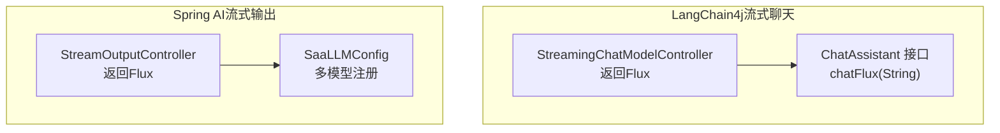
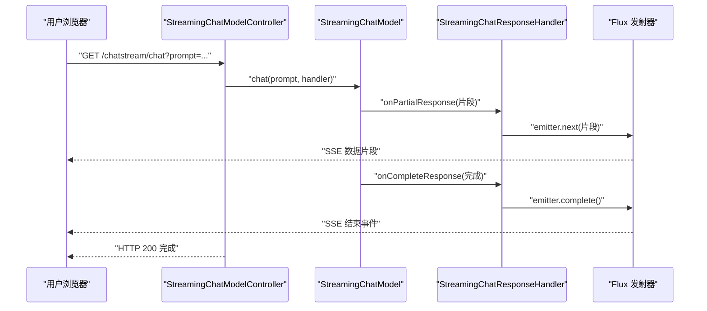
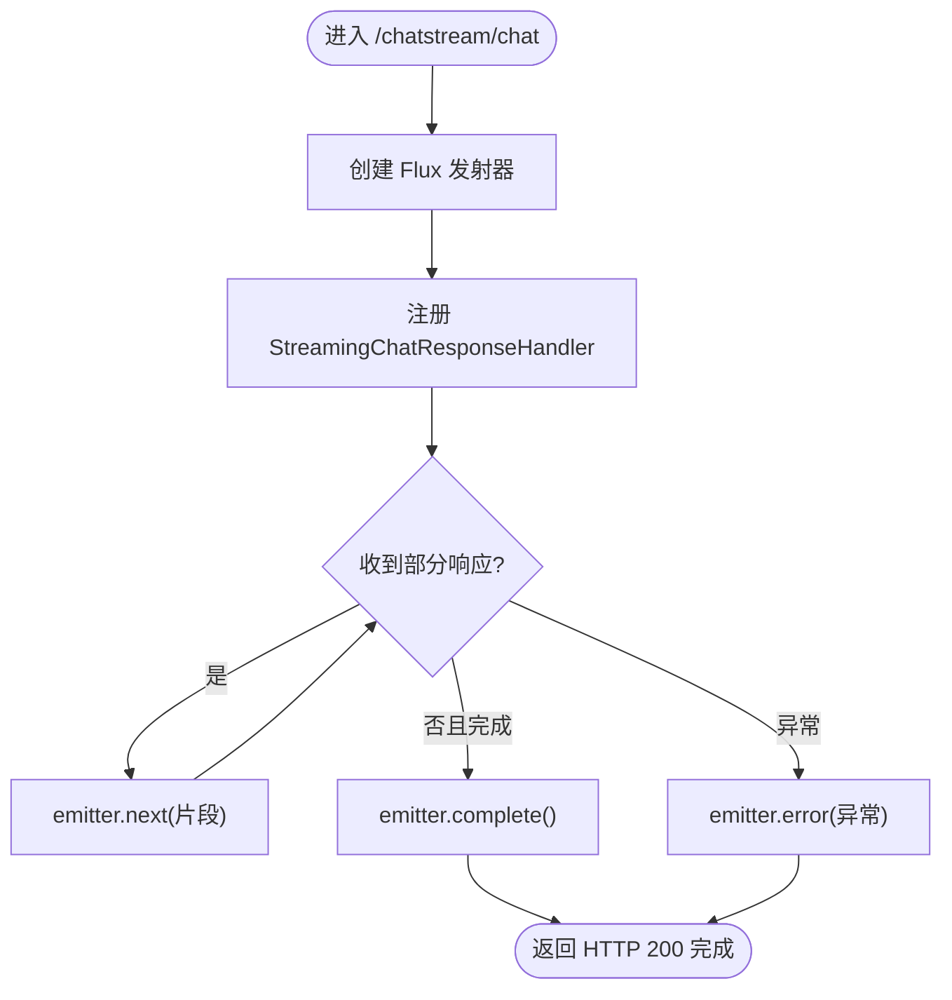
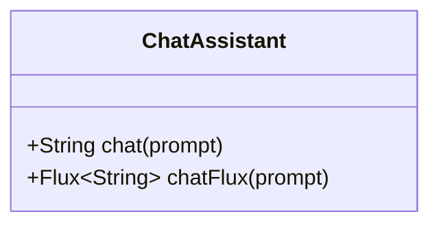
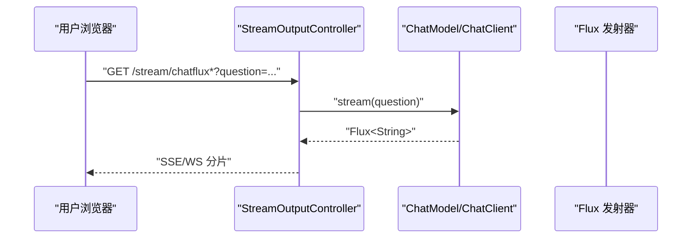
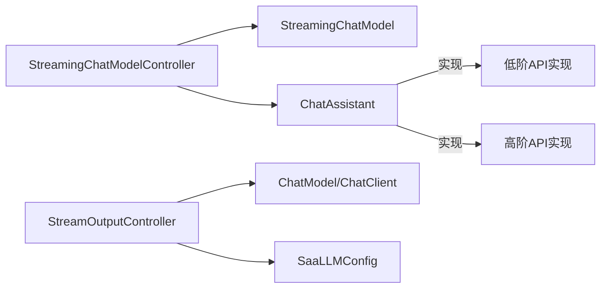

# 流式聊天

<cite>
**本文引用的文件**
- [StreamingChatModelController.java](file://【2】langchain4j-atguiguV5/langchain4j-07chat-stream/src/main/java/com/atguigu/study/controller/StreamingChatModelController.java)
- [ChatAssistant.java](file://【2】langchain4j-atguiguV5/langchain4j-07chat-stream/src/main/java/com/atguigu/study/service/ChatAssistant.java)
- [StreamOutputController.java](file://【1】SpringAIAlibaba-atguiguV1/SAA-04StreamingOutput/src/main/java/com/atguigu/study/controller/StreamOutputController.java)
- [SaaLLMConfig.java](file://【1】SpringAIAlibaba-atguiguV1/SAA-04StreamingOutput/src/main/java/com/atguigu/study/config/SaaLLMConfig.java)
- [Saa04StreamingOutputApplication.java](file://【1】SpringAIAlibaba-atguiguV1/SAA-04StreamingOutput/src/main/java/com/atguigu/study/Saa04StreamingOutputApplication.java)
- [ChatAssistant.java](file://【2】langchain4j-atguiguV5/langchain4j-04low-high-api/src/main/java/com/atguigu/study/service/ChatAssistant.java)
- [ChatAssistant.java](file://【2】langchain4j-atguiguV5/langchain4j-03boot-integration/src/main/java/com/atguigu/study/service/ChatAssistant.java)
- [ChatAssistant.java](file://【2】langchain4j-atguiguV5/langchain4j-08chat-memory/src/main/java/com/atguigu/study/service/ChatAssistant.java)
- [ChatAssistant.java](file://【2】langchain4j-atguiguV5/langchain4j-13chat-rag01/src/main/java/com/atguigu/study/service/ChatAssistant.java)
</cite>

## 目录
1. [引言](#引言)
2. [项目结构](#项目结构)
3. [核心组件](#核心组件)
4. [架构总览](#架构总览)
5. [详细组件分析](#详细组件分析)
6. [依赖分析](#依赖分析)
7. [性能考虑](#性能考虑)
8. [故障排除指南](#故障排除指南)
9. [结论](#结论)
10. [附录](#附录)

## 引言
本指南围绕LangChain4j流式聊天模块，系统讲解SSE（Server-Sent Events）流式传输的实现原理与应用场景，重点覆盖实时响应、用户体验优化与网络效率提升。文档以StreamingChatModelController展示的Flux流式输出为主线，串联服务层ChatAssistant的缓冲与错误恢复策略，并提供前端集成示例、WebSocket替代方案及部署注意事项。同时给出性能优化技巧、并发处理策略与故障排除建议。

## 项目结构
本次分析聚焦于两个相关模块：
- langchain4j-07chat-stream：基于LangChain4j的低阶/高阶API实现流式聊天，控制器直接返回Flux，前端可使用SSE或WebSocket消费增量片段。
- SAA-04StreamingOutput：基于Spring AI的ChatModel/ChatClient实现流式输出，同样返回Flux，便于对比不同框架的流式能力。

**图示来源**
- [StreamingChatModelController.java:1-109](file://【2】langchain4j-atguiguV5/langchain4j-07chat-stream/src/main/java/com/atguigu/study/controller/StreamingChatModelController.java#L1-L109)
- [ChatAssistant.java:1-16](file://【2】langchain4j-atguiguV5/langchain4j-07chat-stream/src/main/java/com/atguigu/study/service/ChatAssistant.java#L1-L16)
- [StreamOutputController.java:1-55](file://【1】SpringAIAlibaba-atguiguV1/SAA-04StreamingOutput/src/main/java/com/atguigu/study/controller/StreamOutputController.java#L1-L55)
- [SaaLLMConfig.java](file://【1】SpringAIAlibaba-atguiguV1/SAA-04StreamingOutput/src/main/java/com/atguigu/study/config/SaaLLMConfig.java)

**章节来源**
- [StreamingChatModelController.java:1-109](file://【2】langchain4j-atguiguV5/langchain4j-07chat-stream/src/main/java/com/atguigu/study/controller/StreamingChatModelController.java#L1-L109)
- [StreamOutputController.java:1-55](file://【1】SpringAIAlibaba-atguiguV1/SAA-04StreamingOutput/src/main/java/com/atguigu/study/controller/StreamOutputController.java#L1-L55)

## 核心组件
- StreamingChatModelController：提供三个流式接口，分别使用LangChain4j低阶API直接返回Flux、低阶API控制台打印、以及通过ChatAssistant高阶API返回Flux。
- ChatAssistant：定义统一的聊天接口，其中chatFlux用于返回增量字符串的Flux流，便于上层控制器统一处理。
- StreamOutputController：在Spring AI生态中，通过ChatModel或ChatClient直接返回Flux，验证不同框架的流式输出能力。
- SaaLLMConfig：在Spring AI模块中负责多模型注册与命名注入，支撑不同模型的流式输出。

**章节来源**
- [StreamingChatModelController.java:30-107](file://【2】langchain4j-atguiguV5/langchain4j-07chat-stream/src/main/java/com/atguigu/study/controller/StreamingChatModelController.java#L30-L107)
- [ChatAssistant.java:10-16](file://【2】langchain4j-atguiguV5/langchain4j-07chat-stream/src/main/java/com/atguigu/study/service/ChatAssistant.java#L10-L16)
- [StreamOutputController.java:25-53](file://【1】SpringAIAlibaba-atguiguV1/SAA-04StreamingOutput/src/main/java/com/atguigu/study/controller/StreamOutputController.java#L25-L53)
- [SaaLLMConfig.java](file://【1】SpringAIAlibaba-atguiguV1/SAA-04StreamingOutput/src/main/java/com/atguigu/study/config/SaaLLMConfig.java)

## 架构总览
下图展示了从HTTP请求到流式响应的关键路径，涵盖事件流建立、数据分片传输与连接管理。

**图示来源**
- [StreamingChatModelController.java:35-63](file://【2】langchain4j-atguiguV5/langchain4j-07chat-stream/src/main/java/com/atguigu/study/controller/StreamingChatModelController.java#L35-L63)

## 详细组件分析

### StreamingChatModelController：流式输出的完整实现
- 低阶API直接返回Flux：通过Flux.create与StreamingChatResponseHandler回调，将partial response逐段发射，onCompleteResponse触发完成，onError触发异常传播。
- 控制台打印版本：用于开发调试，观察增量输出与结束信号。
- 高阶API返回Flux：委托ChatAssistant.chatFlux，统一服务层处理，便于扩展与监控。

**图示来源**
- [StreamingChatModelController.java:35-63](file://【2】langchain4j-atguiguV5/langchain4j-07chat-stream/src/main/java/com/atguigu/study/controller/StreamingChatModelController.java#L35-L63)

**章节来源**
- [StreamingChatModelController.java:30-107](file://【2】langchain4j-atguiguV5/langchain4j-07chat-stream/src/main/java/com/atguigu/study/controller/StreamingChatModelController.java#L30-L107)

### ChatAssistant服务类：服务层流式处理
- 接口职责：定义chat与chatFlux方法，chatFlux返回Flux<String>，便于在控制器中统一处理SSE/WS。
- 实现要点：服务层可封装缓冲区管理（如按行/按句号聚合）、错误恢复（重试/降级）、性能监控（吞吐、延迟、错误率）与上下文管理（历史消息、提示词模板）。
- 与控制器解耦：通过接口抽象，控制器仅依赖chatFlux，便于替换底层实现或接入不同模型。

**图示来源**
- [ChatAssistant.java:10-16](file://【2】langchain4j-atguiguV5/langchain4j-07chat-stream/src/main/java/com/atguigu/study/service/ChatAssistant.java#L10-L16)

**章节来源**
- [ChatAssistant.java:10-16](file://【2】langchain4j-atguiguV5/langchain4j-07chat-stream/src/main/java/com/atguigu/study/service/ChatAssistant.java#L10-L16)

### Spring AI流式输出：对比与集成
- ChatModel/ChatClient直连：StreamOutputController提供多条路由，分别使用不同模型或客户端进行流式输出，便于A/B测试与灰度。
- 多模型配置：SaaLLMConfig负责命名注入，支持多供应商模型并行流式输出。

**图示来源**
- [StreamOutputController.java:25-53](file://【1】SpringAIAlibaba-atguiguV1/SAA-04StreamingOutput/src/main/java/com/atguigu/study/controller/StreamOutputController.java#L25-L53)

**章节来源**
- [StreamOutputController.java:17-54](file://【1】SpringAIAlibaba-atguiguV1/SAA-04StreamingOutput/src/main/java/com/atguigu/study/controller/StreamOutputController.java#L17-L54)
- [SaaLLMConfig.java](file://【1】SpringAIAlibaba-atguiguV1/SAA-04StreamingOutput/src/main/java/com/atguigu/study/config/SaaLLMConfig.java)

## 依赖分析
- 控制器依赖：StreamingChatModelController依赖StreamingChatModel与ChatAssistant；StreamOutputController依赖ChatModel/ChatClient与配置。
- 服务层依赖：ChatAssistant作为接口，被控制器依赖，具体实现可来自不同模块（如低阶API、高阶API、内存/持久化等）。
- 外部依赖：Reactors Flux用于构建响应式流；SSE/WS用于前端消费；日志与异常处理贯穿各层。

**图示来源**
- [StreamingChatModelController.java:24-27](file://【2】langchain4j-atguiguV5/langchain4j-07chat-stream/src/main/java/com/atguigu/study/controller/StreamingChatModelController.java#L24-L27)
- [StreamOutputController.java:20-41](file://【1】SpringAIAlibaba-atguiguV1/SAA-04StreamingOutput/src/main/java/com/atguigu/study/controller/StreamOutputController.java#L20-L41)

**章节来源**
- [StreamingChatModelController.java:24-27](file://【2】langchain4j-atguiguV5/langchain4j-07chat-stream/src/main/java/com/atguigu/study/controller/StreamingChatModelController.java#L24-L27)
- [StreamOutputController.java:20-41](file://【1】SpringAIAlibaba-atguiguV1/SAA-04StreamingOutput/src/main/java/com/atguigu/study/controller/StreamOutputController.java#L20-L41)

## 性能考虑
- 增量渲染与首字节延迟：SSE/WS应尽早发送首个片段，降低感知延迟；前端可立即开始渲染，提升体验。
- 背压与背压策略：在高并发场景，合理设置背压策略（如drop、buffer、latest），避免内存压力。
- 缓冲与聚合：服务层可按句号/换行聚合片段，减少SSE帧数量，提高网络效率。
- 连接复用与超时：SSE长连接需设置合理的超时与心跳，避免资源泄露；对异常连接及时回收。
- 并发与限流：对模型调用进行限流与熔断，防止下游过载；结合指标监控动态调整并发度。
- 日志与追踪：为每条流式会话生成唯一traceId，便于定位性能瓶颈与异常根因。

## 故障排除指南
- SSE连接中断：检查后端是否在onComplete前抛出异常；确认emitter.error是否被正确传播；前端监听onerror并自动重连。
- 片段丢失或乱序：确保StreamingChatResponseHandler回调顺序与完整性；服务层对片段进行有序拼接与去重。
- 首字节延迟过高：优化模型侧推理速度，减少预热开销；前端尽早发起请求并启用缓存。
- 内存占用飙升：限制单次会话的最大片段数与总长度；对长文本采用分页/分块策略。
- WebSocket替代：若SSE不可用，可使用WebSocket推送文本片段；注意两端协议一致与心跳维护。

## 结论
LangChain4j与Spring AI均提供了简洁的Flux流式输出能力。通过StreamingChatModelController与ChatAssistant的清晰分层，既能满足SSE实时交互，也能平滑迁移到WebSocket或其他协议。结合缓冲、背压、限流与监控策略，可在保证用户体验的同时提升系统稳定性与网络效率。

## 附录
- 前端集成要点
  - SSE：使用EventSource监听“message”事件，解析data字段；监听“error”事件并实现指数退避重连。
  - WebSocket：在open事件后接收文本片段；在close/error事件中进行重连与降级处理。
- 部署注意事项
  - 反向代理：确保SSE/WS长连接不被超时或压缩；Nginx需配置proxy_set_header Upgrade与Connection。
  - 容器编排：为流式服务分配足够内存与CPU；开启健康检查与优雅停机。
  - 监控告警：关注QPS、P95/P99延迟、错误率、连接数与队列长度。