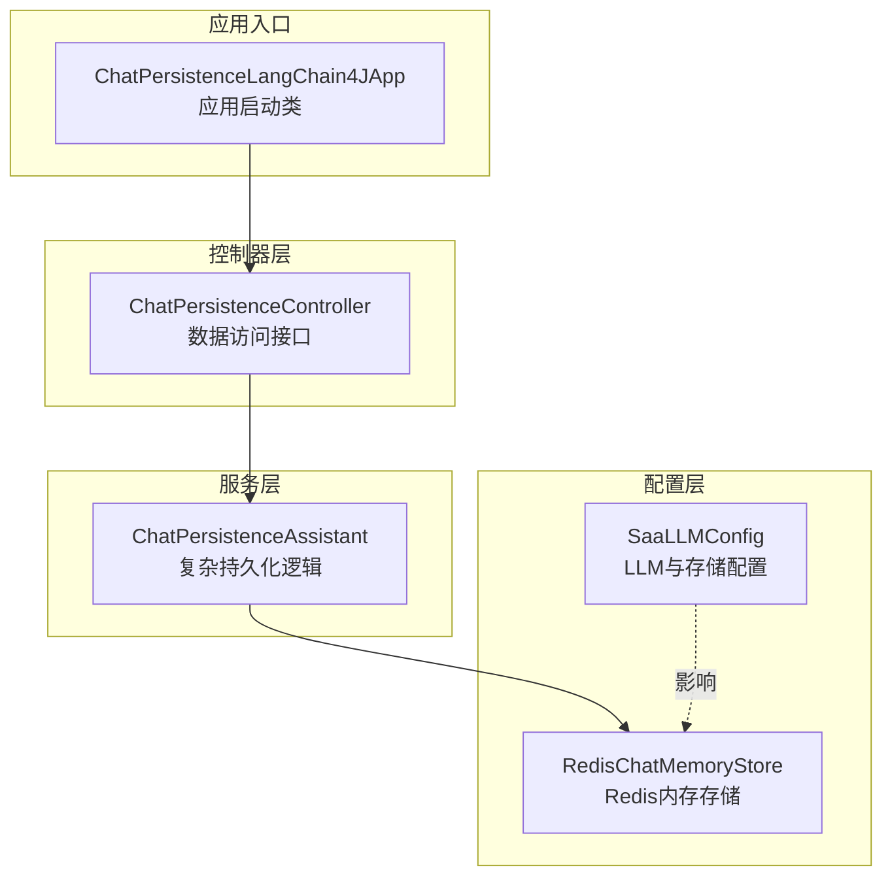
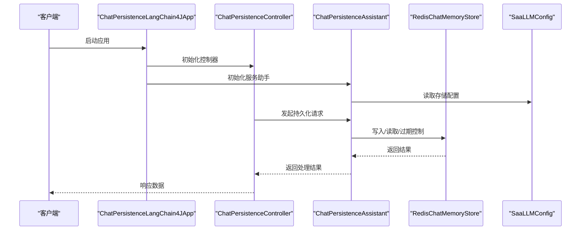
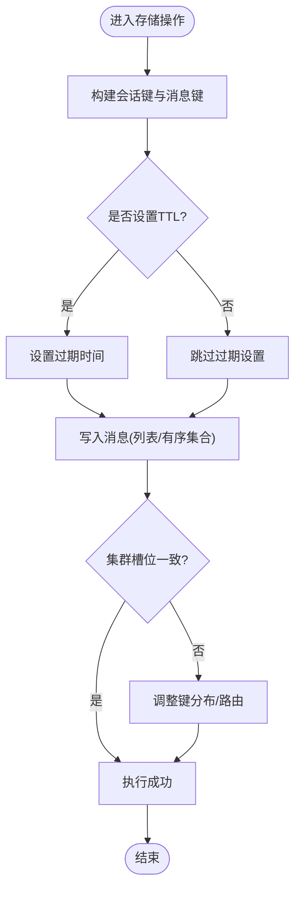
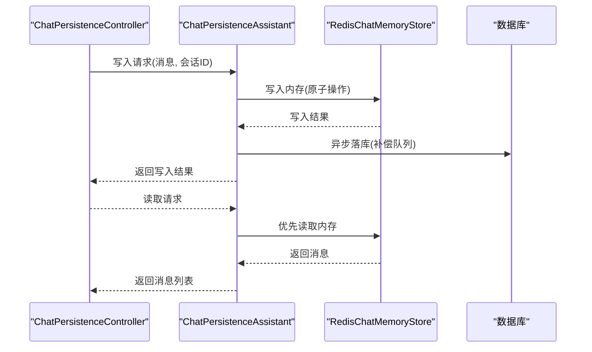
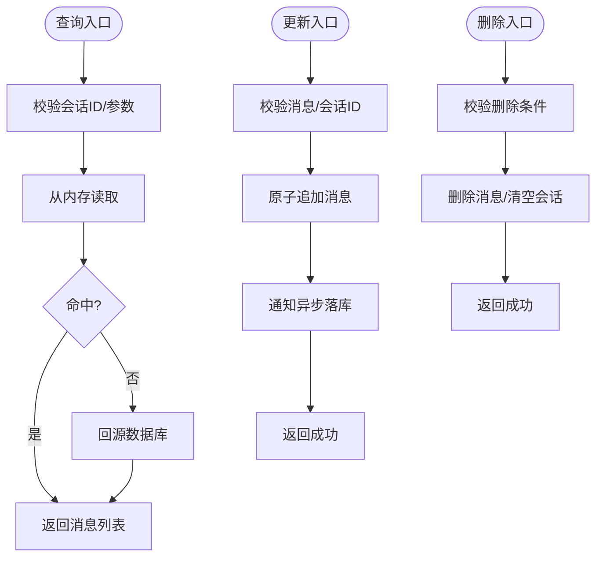

# 聊天持久化

<cite>
**本文引用的文件**
- [ChatPersistenceLangChain4JApp.java](file://【2】langchain4j-atguiguV5/langchain4j-10chat-persistence/src/main/java/com/atguigu/study/ChatPersistenceLangChain4JApp.java)
- [ChatPersistenceController.java](file://【2】langchain4j-atguiguV5/langchain4j-10chat-persistence/src/main/java/com/atguigu/study/controller/ChatPersistenceController.java)
- [ChatPersistenceAssistant.java](file://【2】langchain4j-atguiguV5/langchain4j-10chat-persistence/src/main/java/com/atguigu/study/service/ChatPersistenceAssistant.java)
- [RedisChatMemoryStore.java](file://【2】langchain4j-atguiguV5/langchain4j-10chat-persistence/src/main/java/com/atguigu/study/config/RedisChatMemoryStore.java)
- [SaaLLMConfig.java](file://【1】SpringAIAlibaba-atguiguV1/SAA-08Persistent/src/main/java/com/atguigu/Study/config/SaaLLMConfig.java)
- [application.properties](file://【2】langchain4j-atguiguV5/langchain4j-10chat-persistence/src/main/resources/application.properties)
</cite>

## 目录
1. [引言](#引言)
2. [项目结构](#项目结构)
3. [核心组件](#核心组件)
4. [架构总览](#架构总览)
5. [详细组件分析](#详细组件分析)
6. [依赖分析](#依赖分析)
7. [性能考虑](#性能考虑)
8. [故障排查指南](#故障排查指南)
9. [结论](#结论)
10. [附录](#附录)

## 引言
本指南围绕LangChain4j聊天持久化模块，系统阐述对话数据的持久化策略：数据库设计、缓存机制与分布式存储方案；以RedisChatMemoryStore为例讲解高性能内存存储的键值设计、过期策略与集群部署要点；通过ChatPersistenceAssistant服务类剖析复杂持久化逻辑（数据同步、一致性与故障恢复）；借助ChatPersistenceController提供完整的数据访问接口（查询、更新、删除）；并结合LLMConfig中的存储相关配置项（连接池、超时、监控指标），给出性能优化、容量规划与备份恢复策略。

## 项目结构
该模块位于LangChain4j示例工程中，采用按功能分层组织：应用入口、控制器、服务与配置。核心文件包括应用启动类、控制器、服务助手与Redis内存存储实现，并在独立的LLM配置类中体现存储相关参数。

**图表来源**
- [ChatPersistenceLangChain4JApp.java](file://【2】langchain4j-atguiguV5/langchain4j-10chat-persistence/src/main/java/com/atguigu/study/ChatPersistenceLangChain4JApp.java)
- [ChatPersistenceController.java](file://【2】langchain4j-atguiguV5/langchain4j-10chat-persistence/src/main/java/com/atguigu/study/controller/ChatPersistenceController.java)
- [ChatPersistenceAssistant.java](file://【2】langchain4j-atguiguV5/langchain4j-10chat-persistence/src/main/java/com/atguigu/study/service/ChatPersistenceAssistant.java)
- [RedisChatMemoryStore.java](file://【2】langchain4j-atguiguV5/langchain4j-10chat-persistence/src/main/java/com/atguigu/study/config/RedisChatMemoryStore.java)
- [SaaLLMConfig.java](file://【1】SpringAIAlibaba-atguiguV1/SAA-08Persistent/src/main/java/com/atguigu/Study/config/SaaLLMConfig.java)

**章节来源**
- [ChatPersistenceLangChain4JApp.java](file://【2】langchain4j-atguiguV5/langchain4j-10chat-persistence/src/main/java/com/atguigu/study/ChatPersistenceLangChain4JApp.java)
- [application.properties](file://【2】langchain4j-atguiguV5/langchain4j-10chat-persistence/src/main/resources/application.properties)

## 核心组件
- RedisChatMemoryStore：基于Redis的高性能内存存储实现，负责会话消息的读写、过期与清理。
- ChatPersistenceAssistant：封装复杂持久化逻辑，包含数据同步、一致性保障与故障恢复策略。
- ChatPersistenceController：对外暴露数据访问接口，支撑查询、更新、删除等操作。
- SaaLLMConfig：集中管理LLM与存储相关配置，如连接池、超时与监控指标，影响整体性能与稳定性。

**章节来源**
- [RedisChatMemoryStore.java](file://【2】langchain4j-atguiguV5/langchain4j-10chat-persistence/src/main/java/com/atguigu/study/config/RedisChatMemoryStore.java)
- [ChatPersistenceAssistant.java](file://【2】langchain4j-atguiguV5/langchain4j-10chat-persistence/src/main/java/com/atguigu/study/service/ChatPersistenceAssistant.java)
- [ChatPersistenceController.java](file://【2】langchain4j-atguiguV5/langchain4j-10chat-persistence/src/main/java/com/atguigu/study/controller/ChatPersistenceController.java)
- [SaaLLMConfig.java](file://【1】SpringAIAlibaba-atguiguV1/SAA-08Persistent/src/main/java/com/atguigu/Study/config/SaaLLMConfig.java)

## 架构总览
下图展示了从应用入口到控制器、服务与存储的整体交互流程，以及配置对存储的影响。

**图表来源**
- [ChatPersistenceLangChain4JApp.java](file://【2】langchain4j-atguiguV5/langchain4j-10chat-persistence/src/main/java/com/atguigu/study/ChatPersistenceLangChain4JApp.java)
- [ChatPersistenceController.java](file://【2】langchain4j-atguiguV5/langchain4j-10chat-persistence/src/main/java/com/atguigu/study/controller/ChatPersistenceController.java)
- [ChatPersistenceAssistant.java](file://【2】langchain4j-atguiguV5/langchain4j-10chat-persistence/src/main/java/com/atguigu/study/service/ChatPersistenceAssistant.java)
- [RedisChatMemoryStore.java](file://【2】langchain4j-atguiguV5/langchain4j-10chat-persistence/src/main/java/com/atguigu/study/config/RedisChatMemoryStore.java)
- [SaaLLMConfig.java](file://【1】SpringAIAlibaba-atguiguV1/SAA-08Persistent/src/main/java/com/atguigu/Study/config/SaaLLMConfig.java)

## 详细组件分析

### RedisChatMemoryStore：高性能内存存储
- 键值设计
  - 会话键命名规范：建议采用“前缀:会话ID”形式，便于分组与清理。
  - 消息列表键：可使用有序集合或列表维护消息顺序与去重。
  - 过期键：针对会话设置TTL，避免无界增长。
- 过期策略
  - 会话级TTL：根据业务设定合理的过期时间，支持热会话续期。
  - 清理策略：定期扫描或异步清理过期键，降低碎片与内存占用。
- 集群部署
  - 分片键：确保同一会话的所有键落在同一槽位，避免跨槽操作。
  - 主从复制：开启AOF/RDB持久化，设置合理重写阈值与快照周期。
  - 客户端连接：使用连接池，启用健康检查与自动重连。
- 一致性与并发
  - 使用Lua脚本保证原子性（如追加消息、更新时间戳）。
  - 并发写入时采用乐观锁或分布式锁，避免竞态条件。

**图表来源**
- [RedisChatMemoryStore.java](file://【2】langchain4j-atguiguV5/langchain4j-10chat-persistence/src/main/java/com/atguigu/study/config/RedisChatMemoryStore.java)

**章节来源**
- [RedisChatMemoryStore.java](file://【2】langchain4j-atguiguV5/langchain4j-10chat-persistence/src/main/java/com/atguigu/study/config/RedisChatMemoryStore.java)

### ChatPersistenceAssistant：复杂持久化逻辑
- 数据同步
  - 写入前置：先写内存存储，再异步落库，减少主流程阻塞。
  - 读取优先：优先从内存读取，失败回源数据库，提升响应速度。
- 一致性保障
  - 版本号/时间戳：为每条消息附加版本或时间戳，解决并发覆盖问题。
  - 幂等写入：基于唯一标识进行幂等判断，避免重复写入。
- 故障恢复
  - 降级策略：内存不可用时直连数据库，记录告警并上报监控。
  - 补偿机制：异步补偿队列，兜底修复未完成的持久化任务。
  - 快速失败：对超时与异常进行快速失败，避免级联故障。

**图表来源**
- [ChatPersistenceAssistant.java](file://【2】langchain4j-atguiguV5/langchain4j-10chat-persistence/src/main/java/com/atguigu/study/service/ChatPersistenceAssistant.java)
- [RedisChatMemoryStore.java](file://【2】langchain4j-atguiguV5/langchain4j-10chat-persistence/src/main/java/com/atguigu/study/config/RedisChatMemoryStore.java)

**章节来源**
- [ChatPersistenceAssistant.java](file://【2】langchain4j-atguiguV5/langchain4j-10chat-persistence/src/main/java/com/atguigu/study/service/ChatPersistenceAssistant.java)

### ChatPersistenceController：数据访问接口
- 查询接口
  - 支持按会话ID查询消息列表，可带分页与时间范围过滤。
  - 支持查询最近N条消息，满足上下文截断需求。
- 更新接口
  - 追加消息：原子追加到会话末尾，保持顺序与去重。
  - 更新元信息：如会话标题、标签等，不影响消息内容。
- 删除接口
  - 删除单条消息：基于消息ID删除，需校验归属与权限。
  - 清空会话：删除会话所有消息与元信息，释放资源。
- 错误处理
  - 参数校验：对会话ID、消息ID等进行合法性校验。
  - 异常捕获：统一异常转换为标准错误码与提示信息。

**图表来源**
- [ChatPersistenceController.java](file://【2】langchain4j-atguiguV5/langchain4j-10chat-persistence/src/main/java/com/atguigu/study/controller/ChatPersistenceController.java)

**章节来源**
- [ChatPersistenceController.java](file://【2】langchain4j-atguiguV5/langchain4j-10chat-persistence/src/main/java/com/atguigu/study/controller/ChatPersistenceController.java)

### LLMConfig中的存储配置选项
- 连接池设置
  - 最小/最大连接数：根据峰值QPS与RT设定，避免频繁创建销毁。
  - 连接超时与空闲超时：缩短连接等待时间，及时回收空闲连接。
- 超时配置
  - 读写超时：针对不同操作（查询、写入、批量）设置差异化超时。
  - 命令超时：对长耗时命令（如SCAN）设置上限，防止阻塞。
- 监控指标
  - 连接池指标：活跃连接数、等待队列长度、拒绝次数。
  - 命令指标：QPS、P99延迟、错误率、慢查询统计。
  - 健康检查：心跳检测、故障摘除与自动恢复。

**章节来源**
- [SaaLLMConfig.java](file://【1】SpringAIAlibaba-atguiguV1/SAA-08Persistent/src/main/java/com/atguigu/Study/config/SaaLLMConfig.java)

## 依赖分析
- 组件耦合
  - 控制器依赖服务助手；服务助手依赖存储实现；存储实现受配置影响。
- 外部依赖
  - Redis客户端与连接池；数据库驱动；监控SDK。
- 潜在环路
  - 控制器→服务助手→存储→配置→存储，形成单向依赖，无环路风险。

**图表来源**
- [ChatPersistenceController.java](file://【2】langchain4j-atguiguV5/langchain4j-10chat-persistence/src/main/java/com/atguigu/study/controller/ChatPersistenceController.java)
- [ChatPersistenceAssistant.java](file://【2】langchain4j-atguiguV5/langchain4j-10chat-persistence/src/main/java/com/atguigu/study/service/ChatPersistenceAssistant.java)
- [RedisChatMemoryStore.java](file://【2】langchain4j-atguiguV5/langchain4j-10chat-persistence/src/main/java/com/atguigu/study/config/RedisChatMemoryStore.java)
- [SaaLLMConfig.java](file://【1】SpringAIAlibaba-atguiguV1/SAA-08Persistent/src/main/java/com/atguigu/Study/config/SaaLLMConfig.java)

**章节来源**
- [ChatPersistenceController.java](file://【2】langchain4j-atguiguV5/langchain4j-10chat-persistence/src/main/java/com/atguigu/study/controller/ChatPersistenceController.java)
- [ChatPersistenceAssistant.java](file://【2】langchain4j-atguiguV5/langchain4j-10chat-persistence/src/main/java/com/atguigu/study/service/ChatPersistenceAssistant.java)
- [RedisChatMemoryStore.java](file://【2】langchain4j-atguiguV5/langchain4j-10chat-persistence/src/main/java/com/atguigu/study/config/RedisChatMemoryStore.java)
- [SaaLLMConfig.java](file://【1】SpringAIAlibaba-atguiguV1/SAA-08Persistent/src/main/java/com/atguigu/Study/config/SaaLLMConfig.java)

## 性能考虑
- 缓存命中优化
  - 合理设置会话TTL与热会话续期，提升命中率。
  - 使用流水线与批处理减少网络往返。
- 存储层优化
  - 列表/有序集合选择：根据是否需要排序与去重决定。
  - 分片键一致性：确保同一会话键落在同一槽位，避免跨槽。
- 服务层优化
  - 异步落库与补偿队列：降低主流程阻塞。
  - 幂等写入与版本控制：减少冲突与重试成本。
- 监控与告警
  - 关键指标实时监控，异常自动告警与限流。

## 故障排查指南
- 常见问题
  - 内存不可用：检查连接池配置与健康检查，启用降级直连数据库。
  - 过期键清理不及时：调整清理策略与TTL，避免内存泄漏。
  - 并发写入冲突：确认原子操作与幂等策略是否生效。
- 排查步骤
  - 查看控制器与服务日志，定位异常点。
  - 检查存储连接与命令执行情况，核对慢查询。
  - 核对配置参数，确保与生产环境一致。

**章节来源**
- [ChatPersistenceController.java](file://【2】langchain4j-atguiguV5/langchain4j-10chat-persistence/src/main/java/com/atguigu/study/controller/ChatPersistenceController.java)
- [ChatPersistenceAssistant.java](file://【2】langchain4j-atguiguV5/langchain4j-10chat-persistence/src/main/java/com/atguigu/study/service/ChatPersistenceAssistant.java)
- [RedisChatMemoryStore.java](file://【2】langchain4j-atguiguV5/langchain4j-10chat-persistence/src/main/java/com/atguigu/study/config/RedisChatMemoryStore.java)

## 结论
本指南从架构与实现两个维度，系统梳理了LangChain4j聊天持久化模块的关键要素：以Redis为内存存储的核心实现、以服务助手为核心的复杂持久化逻辑、以控制器为核心的完整数据访问接口，以及以LLMConfig为代表的存储配置体系。通过合理的键值设计、过期策略、集群部署与配置优化，可在高并发场景下实现高性能、高可用的对话数据持久化。

## 附录
- 配置参考
  - 连接池大小、超时参数与监控指标在LLM配置类中集中管理，便于统一治理与动态调整。
- 数据库设计建议
  - 会话表：会话ID、用户ID、创建/更新时间、标签等。
  - 消息表：消息ID、会话ID、角色、内容、时间戳、版本号等。
  - 索引：按会话ID与时间戳建立索引，支持高效查询与分页。
- 备份与恢复
  - 定期快照与增量备份，结合自动化恢复演练，确保RTO/RPO达标。

**章节来源**
- [application.properties](file://【2】langchain4j-atguiguV5/langchain4j-10chat-persistence/src/main/resources/application.properties)
- [SaaLLMConfig.java](file://【1】SpringAIAlibaba-atguiguV1/SAA-08Persistent/src/main/java/com/atguigu/Study/config/SaaLLMConfig.java)