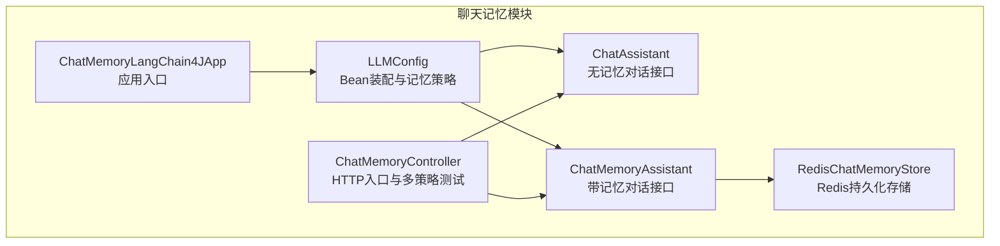
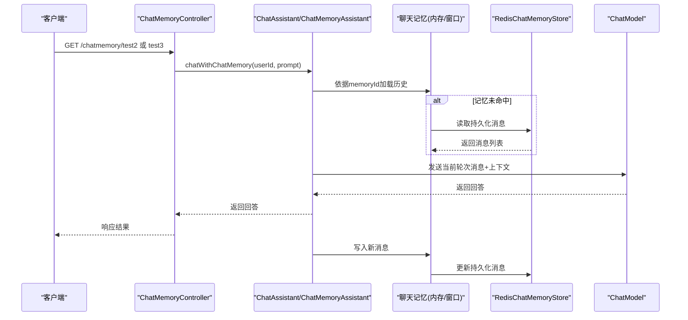
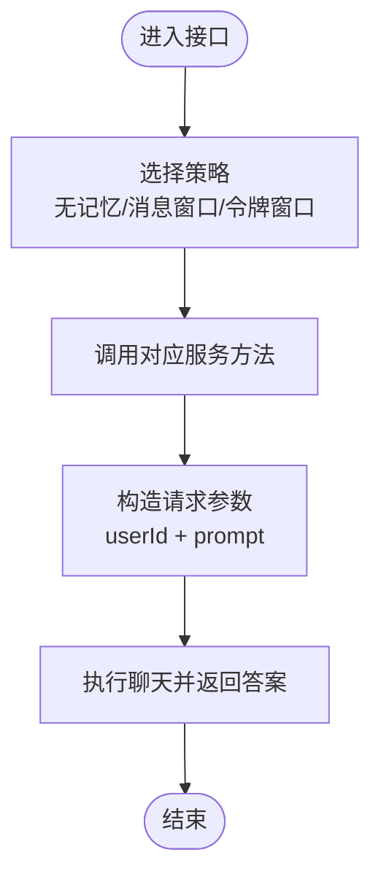
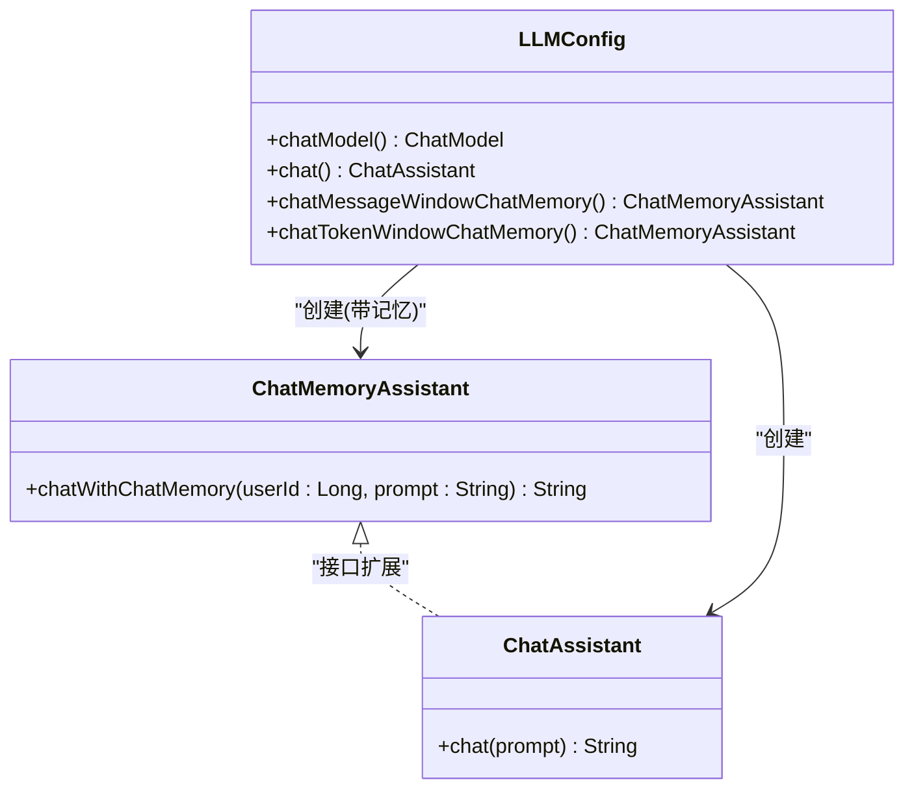
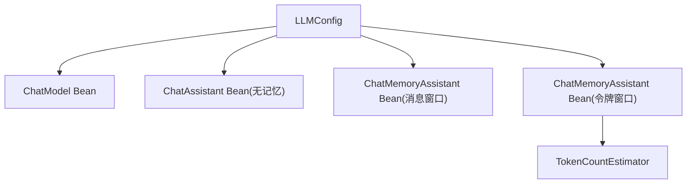
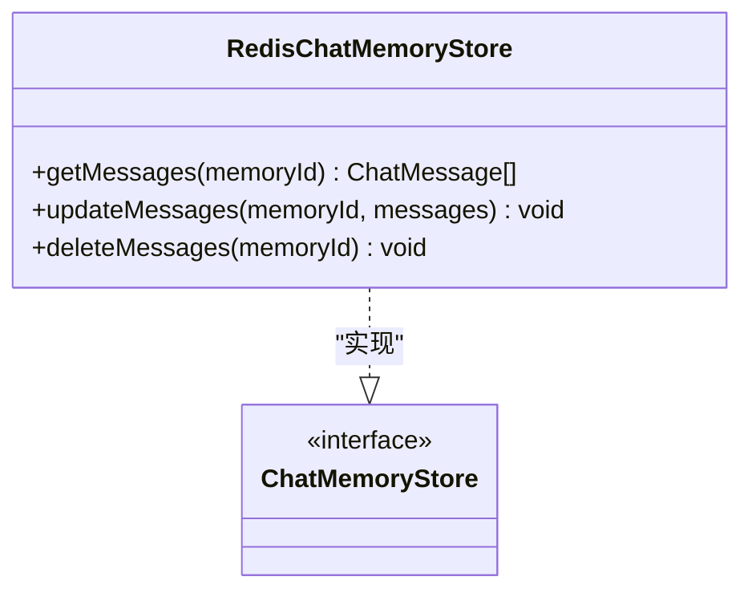
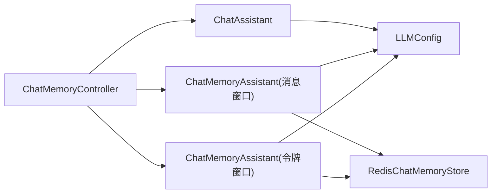

# 聊天记忆

<cite>
**本文引用的文件**   
- [ChatMemoryController.java](file://【2】langchain4j-atguiguV5/langchain4j-08chat-memory/src/main/java/com/atguigu/study/controller/ChatMemoryController.java)
- [ChatMemoryAssistant.java](file://【2】langchain4j-atguiguV5/langchain4j-08chat-memory/src/main/java/com/atguigu/study/service/ChatMemoryAssistant.java)
- [ChatAssistant.java](file://【2】langchain4j-atguiguV5/langchain4j-08chat-memory/src/main/java/com/atguigu/study/service/ChatAssistant.java)
- [LLMConfig.java](file://【2】langchain4j-atguiguV5/langchain4j-08chat-memory/src/main/java/com/atguigu/study/config/LLMConfig.java)
- [ChatMemoryLangChain4JApp.java](file://【2】langchain4j-atguiguV5/langchain4j-08chat-memory/src/main/java/com/atguigu/study/ChatMemoryLangChain4JApp.java)
- [RedisChatMemoryStore.java](file://【2】langchain4j-atguiguV5/langchain4j-10chat-persistence/src/main/java/com/atguigu/study/config/RedisChatMemoryStore.java)
</cite>

## 目录
1. [引言](#引言)
2. [项目结构](#项目结构)
3. [核心组件](#核心组件)
4. [架构总览](#架构总览)
5. [详细组件分析](#详细组件分析)
6. [依赖分析](#依赖分析)
7. [性能考虑](#性能考虑)
8. [故障排查指南](#故障排查指南)
9. [结论](#结论)
10. [附录](#附录)

## 引言
本指南围绕LangChain4j聊天记忆模块，系统讲解对话记忆的实现原理与工程实践，覆盖消息历史存储、上下文窗口管理、长期记忆机制、记忆接口设计、复杂记忆策略（压缩、重要性排序、检索增强）、LLM配置中的记忆相关项（缓存策略、过期时间、存储位置），以及内存优化、性能监控与最佳实践。读者可据此在实际场景中构建“记忆友好”的对话接口，并实现稳定高效的上下文管理。

## 项目结构
本仓库包含多个LangChain4j示例模块，其中与聊天记忆直接相关的核心模块如下：
- langchain4j-08chat-memory：演示基于消息窗口与令牌窗口的记忆实现，以及普通无记忆对话对比
- langchain4j-10chat-persistence：演示将聊天记忆持久化到Redis的存储实现
- langchain4j-08chat-memory 的配置与控制器：定义记忆型与非记忆型对话服务、注入不同窗口策略

**图示来源**
- [ChatMemoryLangChain4JApp.java:1-19](file://【2】langchain4j-atguiguV5/langchain4j-08chat-memory/src/main/java/com/atguigu/study/ChatMemoryLangChain4JApp.java#L1-L19)
- [LLMConfig.java:1-73](file://【2】langchain4j-atguiguV5/langchain4j-08chat-memory/src/main/java/com/atguigu/study/config/LLMConfig.java#L1-L73)
- [ChatAssistant.java:1-18](file://【2】langchain4j-atguiguV5/langchain4j-08chat-memory/src/main/java/com/atguigu/study/service/ChatAssistant.java#L1-L18)
- [ChatMemoryAssistant.java:1-23](file://【2】langchain4j-atguiguV5/langchain4j-08chat-memory/src/main/java/com/atguigu/study/service/ChatMemoryAssistant.java#L1-L23)
- [ChatMemoryController.java:1-91](file://【2】langchain4j-atguiguV5/langchain4j-08chat-memory/src/main/java/com/atguigu/study/controller/ChatMemoryController.java#L1-L91)
- [RedisChatMemoryStore.java:1-51](file://【2】langchain4j-atguiguV5/langchain4j-10chat-persistence/src/main/java/com/atguigu/study/config/RedisChatMemoryStore.java#L1-L51)

**章节来源**
- [ChatMemoryLangChain4JApp.java:1-19](file://【2】langchain4j-atguiguV5/langchain4j-08chat-memory/src/main/java/com/atguigu/study/ChatMemoryLangChain4JApp.java#L1-L19)
- [LLMConfig.java:1-73](file://【2】langchain4j-atguiguV5/langchain4j-08chat-memory/src/main/java/com/atguigu/study/config/LLMConfig.java#L1-L73)
- [ChatMemoryController.java:1-91](file://【2】langchain4j-atguiguV5/langchain4j-08chat-memory/src/main/java/com/atguigu/study/controller/ChatMemoryController.java#L1-L91)

## 核心组件
- ChatAssistant：普通聊天接口，不携带记忆，适合一次性问答或无需上下文的场景
- ChatMemoryAssistant：带记忆聊天接口，通过注解参数将用户ID映射为记忆ID，实现跨轮次上下文延续
- LLMConfig：装配ChatModel与AiServices，分别注册“无记忆”和“带记忆”的服务Bean；为带记忆服务配置消息窗口与令牌窗口两种策略
- ChatMemoryController：对外提供HTTP接口，分别调用普通与不同窗口策略的记忆服务，验证记忆效果
- RedisChatMemoryStore：实现LangChain4j的ChatMemoryStore接口，将消息序列化后以键值形式存储于Redis，实现长期记忆

**章节来源**
- [ChatAssistant.java:1-18](file://【2】langchain4j-atguiguV5/langchain4j-08chat-memory/src/main/java/com/atguigu/study/service/ChatAssistant.java#L1-L18)
- [ChatMemoryAssistant.java:1-23](file://【2】langchain4j-atguiguV5/langchain4j-08chat-memory/src/main/java/com/atguigu/study/service/ChatMemoryAssistant.java#L1-L23)
- [LLMConfig.java:1-73](file://【2】langchain4j-atguiguV5/langchain4j-08chat-memory/src/main/java/com/atguigu/study/config/LLMConfig.java#L1-L73)
- [ChatMemoryController.java:1-91](file://【2】langchain4j-atguiguV5/langchain4j-08chat-memory/src/main/java/com/atguigu/study/controller/ChatMemoryController.java#L1-L91)
- [RedisChatMemoryStore.java:1-51](file://【2】langchain4j-atguiguV5/langchain4j-10chat-persistence/src/main/java/com/atguigu/study/config/RedisChatMemoryStore.java#L1-L51)

## 架构总览
下图展示了从HTTP请求到记忆服务、再到LLM与持久化的整体流程：

**图示来源**
- [ChatMemoryController.java:34-91](file://【2】langchain4j-atguiguV5/langchain4j-08chat-memory/src/main/java/com/atguigu/study/controller/ChatMemoryController.java#L34-L91)
- [ChatMemoryAssistant.java:11-23](file://【2】langchain4j-atguiguV5/langchain4j-08chat-memory/src/main/java/com/atguigu/study/service/ChatMemoryAssistant.java#L11-L23)
- [LLMConfig.java:33-71](file://【2】langchain4j-atguiguV5/langchain4j-08chat-memory/src/main/java/com/atguigu/study/config/LLMConfig.java#L33-L71)
- [RedisChatMemoryStore.java:30-49](file://【2】langchain4j-atguiguV5/langchain4j-10chat-persistence/src/main/java/com/atguigu/study/config/RedisChatMemoryStore.java#L30-L49)

## 详细组件分析

### 组件一：ChatMemoryController（记忆友好的对话入口）
- 设计要点
  - 通过资源注入三种服务：普通ChatAssistant、按消息数限制的消息窗口ChatMemoryAssistant、按令牌数限制的令牌窗口ChatMemoryAssistant
  - 提供三个测试接口：test1（无记忆）、test2（消息窗口）、test3（令牌窗口）
  - 使用会话ID（userId）作为记忆ID，确保同一用户的多轮对话共享上下文
- 最佳实践
  - 在生产环境中，建议将会话ID与用户标识绑定，避免跨用户上下文污染
  - 对外暴露的接口应统一路径前缀与鉴权策略，便于监控与限流
  - 将不同窗口策略的服务Bean命名区分，便于按需选择

**章节来源**
- [ChatMemoryController.java:24-91](file://【2】langchain4j-atguiguV5/langchain4j-08chat-memory/src/main/java/com/atguigu/study/controller/ChatMemoryController.java#L24-L91)

### 组件二：ChatMemoryAssistant（记忆接口设计）
- 设计要点
  - 使用注解将方法参数映射为记忆ID与用户消息，实现“记忆友好”的对话签名
  - 通过AiServices自动注入记忆提供者，按memoryId隔离上下文
- 最佳实践
  - 将用户ID作为强一致的会话标识，避免频繁变更导致上下文丢失
  - 对敏感信息进行脱敏或过滤，防止隐私泄露
  - 在方法签名中明确区分“带记忆”与“无记忆”，便于调用方选择

**图示来源**
- [ChatAssistant.java:11-18](file://【2】langchain4j-atguiguV5/langchain4j-08chat-memory/src/main/java/com/atguigu/study/service/ChatAssistant.java#L11-L18)
- [ChatMemoryAssistant.java:11-23](file://【2】langchain4j-atguiguV5/langchain4j-08chat-memory/src/main/java/com/atguigu/study/service/ChatMemoryAssistant.java#L11-L23)
- [LLMConfig.java:33-71](file://【2】langchain4j-atguiguV5/langchain4j-08chat-memory/src/main/java/com/atguigu/study/config/LLMConfig.java#L33-L71)

**章节来源**
- [ChatMemoryAssistant.java:11-23](file://【2】langchain4j-atguiguV5/langchain4j-08chat-memory/src/main/java/com/atguigu/study/service/ChatMemoryAssistant.java#L11-L23)
- [LLMConfig.java:33-71](file://【2】langchain4j-atguiguV5/langchain4j-08chat-memory/src/main/java/com/atguigu/study/config/LLMConfig.java#L33-L71)

### 组件三：LLMConfig（记忆相关配置）
- 配置要点
  - ChatModel：示例中使用兼容模式的模型，便于对接第三方服务
  - ChatAssistant Bean：无记忆对话服务
  - ChatMemoryAssistant Bean（消息窗口）：按最大消息条数限制上下文
  - ChatMemoryAssistant Bean（令牌窗口）：按最大令牌数与Token计数估算器限制上下文
- 最佳实践
  - 根据模型最大上下文长度与业务对话复杂度，合理设置消息窗口与令牌窗口阈值
  - Token计数估算器需与模型分词器匹配，避免估算偏差导致截断异常
  - 将不同策略的Bean命名清晰化，便于按需启用

**图示来源**
- [LLMConfig.java:23-71](file://【2】langchain4j-atguiguV5/langchain4j-08chat-memory/src/main/java/com/atguigu/study/config/LLMConfig.java#L23-L71)

**章节来源**
- [LLMConfig.java:23-71](file://【2】langchain4j-atguiguV5/langchain4j-08chat-memory/src/main/java/com/atguigu/study/config/LLMConfig.java#L23-L71)

### 组件四：RedisChatMemoryStore（长期记忆）
- 实现要点
  - 实现LangChain4j的ChatMemoryStore接口，提供按memoryId读取、更新、删除消息的能力
  - 使用固定前缀拼接key，序列化/反序列化消息列表，保证跨进程/重启的一致性
- 最佳实践
  - 为key设置合理的TTL，避免无限增长
  - 在高并发场景下注意序列化开销与网络延迟
  - 结合业务需要，对敏感消息进行脱敏或只保留必要字段

**图示来源**
- [RedisChatMemoryStore.java:19-51](file://【2】langchain4j-atguiguV5/langchain4j-10chat-persistence/src/main/java/com/atguigu/study/config/RedisChatMemoryStore.java#L19-L51)

**章节来源**
- [RedisChatMemoryStore.java:19-51](file://【2】langchain4j-atguiguV5/langchain4j-10chat-persistence/src/main/java/com/atguigu/study/config/RedisChatMemoryStore.java#L19-L51)

### 组件五：ChatMemoryLangChain4JApp（应用入口）
- 入口职责
  - Spring Boot启动类，负责扫描并加载上述配置与控制器
- 最佳实践
  - 在生产环境启用健康检查、指标监控与日志聚合
  - 将模型密钥与地址等配置外部化，避免硬编码

**章节来源**
- [ChatMemoryLangChain4JApp.java:11-19](file://【2】langchain4j-atguiguV5/langchain4j-08chat-memory/src/main/java/com/atguigu/study/ChatMemoryLangChain4JApp.java#L11-L19)

## 依赖分析
- 控制层依赖服务层接口，服务层依赖AiServices与ChatModel
- 记忆服务依赖记忆提供者（内存窗口）与可选的持久化存储（Redis）
- 配置层负责装配各Bean并注入依赖

**图示来源**
- [ChatMemoryController.java:24-91](file://【2】langchain4j-atguiguV5/langchain4j-08chat-memory/src/main/java/com/atguigu/study/controller/ChatMemoryController.java#L24-L91)
- [LLMConfig.java:33-71](file://【2】langchain4j-atguiguV5/langchain4j-08chat-memory/src/main/java/com/atguigu/study/config/LLMConfig.java#L33-L71)
- [RedisChatMemoryStore.java:19-51](file://【2】langchain4j-atguiguV5/langchain4j-10chat-persistence/src/main/java/com/atguigu/study/config/RedisChatMemoryStore.java#L19-L51)

**章节来源**
- [ChatMemoryController.java:24-91](file://【2】langchain4j-atguiguV5/langchain4j-08chat-memory/src/main/java/com/atguigu/study/controller/ChatMemoryController.java#L24-L91)
- [LLMConfig.java:33-71](file://【2】langchain4j-atguiguV5/langchain4j-08chat-memory/src/main/java/com/atguigu/study/config/LLMConfig.java#L33-L71)
- [RedisChatMemoryStore.java:19-51](file://【2】langchain4j-atguiguV5/langchain4j-10chat-persistence/src/main/java/com/atguigu/study/config/RedisChatMemoryStore.java#L19-L51)

## 性能考虑
- 上下文窗口策略
  - 消息窗口：简单直观，适合消息条数可控的场景；注意消息长度差异导致的上下文占用波动
  - 令牌窗口：更贴合模型输入限制，需正确配置Token计数估算器，避免估算不准引发截断
- 持久化成本
  - Redis序列化/反序列化与网络IO可能成为瓶颈，建议批量写入、设置TTL、定期清理
- 计算与内存
  - 大规模会话并发时，建议将热点会话驻留于内存，冷数据落盘；或采用分片策略
- 监控与告警
  - 关注消息条数/令牌数分布、Redis读写延迟、LLM调用耗时与错误率

## 故障排查指南
- 记忆未生效
  - 检查是否使用了正确的Bean名称（如“chatMessageWindowChatMemory”、“chatTokenWindowChatMemory”）
  - 确认请求参数中传入了有效的会话ID（memoryId）
- Redis持久化异常
  - 核对RedisTemplate配置与连接信息
  - 检查消息序列化/反序列化是否与LangChain4j版本兼容
- Token估算不准确
  - 确认Token计数估算器与模型分词器一致
  - 对特殊字符、代码片段等进行预处理，避免估算偏差
- 性能抖动
  - 分析消息长度分布，调整窗口阈值
  - 评估Redis延迟，必要时引入连接池与异步写入

**章节来源**
- [ChatMemoryController.java:34-91](file://【2】langchain4j-atguiguV5/langchain4j-08chat-memory/src/main/java/com/atguigu/study/controller/ChatMemoryController.java#L34-L91)
- [RedisChatMemoryStore.java:30-49](file://【2】langchain4j-atguiguV5/langchain4j-10chat-persistence/src/main/java/com/atguigu/study/config/RedisChatMemoryStore.java#L30-L49)
- [LLMConfig.java:61-71](file://【2】langchain4j-atguiguV5/langchain4j-08chat-memory/src/main/java/com/atguigu/study/config/LLMConfig.java#L61-L71)

## 结论
通过消息窗口与令牌窗口两种策略，结合Redis持久化，LangChain4j能够灵活地在“短期上下文”与“长期记忆”之间取得平衡。配合清晰的接口设计（会话ID管理、消息分类、隐私保护）与完善的配置（缓存策略、过期时间、存储位置），可在实际业务中构建稳定、高效且可扩展的聊天记忆系统。建议在上线前完成容量规划、性能压测与监控体系建设，持续迭代优化。

## 附录
- 实际应用场景建议
  - 客服问答：优先令牌窗口，保障上下文长度上限
  - 代码辅助：消息窗口+关键上下文摘要，兼顾简洁与完整性
  - 长对话助手：结合Redis持久化，按会话维度清理旧数据
- 最佳实践清单
  - 明确会话ID来源与生命周期
  - 对敏感信息进行脱敏与最小化存储
  - 合理设置窗口阈值并动态调优
  - 建立监控与告警，关注延迟与错误率
  - 定期清理与归档，控制存储成本