# ChatClient实现详解

<cite>
**本文档引用的文件**
- [ChatClientController.java](file://【1】SpringAIAlibaba-atguiguV1/SAA-03ChatModelChatClient/src/main/java/com/atguigu/study/controller/ChatClientController.java)
- [ChatClientControllerV2.java](file://【1】SpringAIAlibaba-atguiguV1/SAA-03ChatModelChatClient/src/main/java/com/atguigu/study/controller/ChatClientControllerV2.java)
- [SaaLLMConfig.java](file://【1】SpringAIAlibaba-atguiguV1/SAA-03ChatModelChatClient/src/main/java/com/atguigu/study/config/SaaLLMConfig.java)
- [ChatClientService.java](file://【3】工作资料/code/仓颉智能体/nlp-agent/agent-builder/agent-build-core/src/main/java/com/yundingtech/agent/build/modules/chatapplication/service/impl/ChatClientService.java)
- [ChatClientServiceV1.java](file://【3】工作资料/code/仓颉智能体/nlp-agent/agent-common/agent-rag-adapter/src/main/java/com/yundingtech/agent/adapter/ragchat/service/ChatClientServiceV1.java)
- [ChatClientUtil.java](file://【3】工作资料/code/仓颉智能体/nlp-agent/agent-common/agent-model-adapter/src/main/java/com/yundingtech/agent/sdk/common/util/ChatClientUtil.java)
- [application.properties](file://【1】SpringAIAlibaba-atguiguV1/SAA-03ChatModelChatClient/src/main/resources/application.properties)
</cite>

## 目录
1. [引言](#引言)
2. [项目结构](#项目结构)
3. [核心组件](#核心组件)
4. [架构概览](#架构概览)
5. [详细组件分析](#详细组件分析)
6. [依赖关系分析](#依赖关系分析)
7. [性能考虑](#性能考虑)
8. [故障排除指南](#故障排除指南)
9. [结论](#结论)

## 引言

本文档深入解析Spring AI Alibaba项目中的ChatClient实现，重点关注ChatClientController的实现细节。ChatClient作为Spring AI框架的核心组件，提供了简洁易用的对话接口，支持多种大模型提供商和配置选项。

本项目展示了两种不同的ChatClient实现方式：基于Spring AI框架的原生实现和基于WebClient的自定义实现。每种实现都有其特定的应用场景和优势。

## 项目结构

该项目采用多模块架构，主要包含以下核心模块：

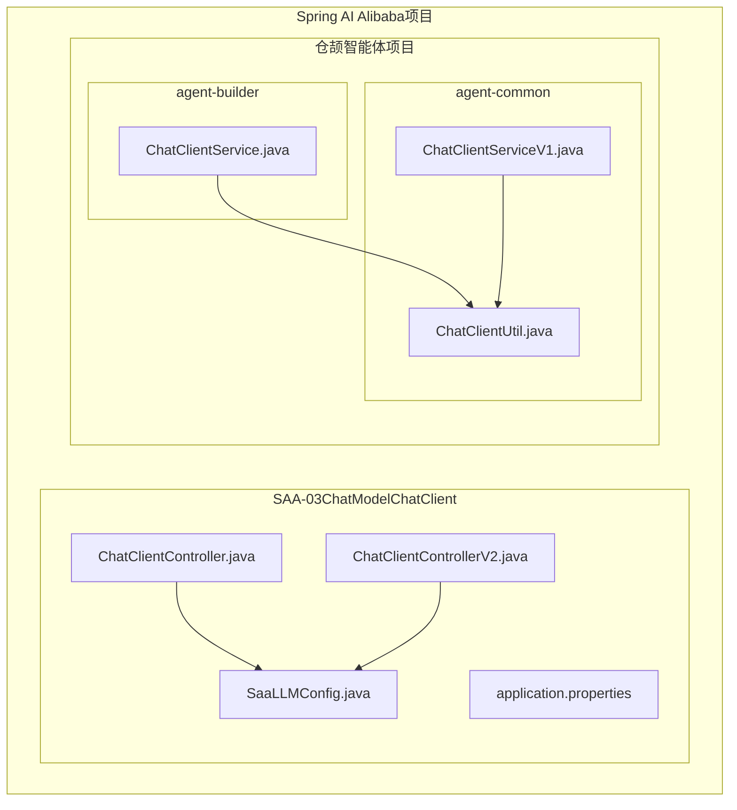

**图表来源**
- [ChatClientController.java:1-37](file://【1】SpringAIAlibaba-atguiguV1/SAA-03ChatModelChatClient/src/main/java/com/atguigu/study/controller/ChatClient.java#L1-L37)
- [ChatClientControllerV2.java:1-50](file://【1】SpringAIAlibaba-atguiguV1/SAA-03ChatModelChatClient/src/main/java/com/atguigu/study/controller/ChatClientControllerV2.java#L1-L50)
- [SaaLLMConfig.java:1-40](file://【1】SpringAIAlibaba-atguiguV1/SAA-03ChatModelChatClient/src/main/java/com/atguigu/study/config/SaaLLMConfig.java#L1-L40)

**章节来源**
- [ChatClientController.java:1-37](file://【1】SpringAIAlibaba-atguiguV1/SAA-03ChatModelChatClient/src/main/java/com/atguigu/study/controller/ChatClientController.java#L1-L37)
- [ChatClientControllerV2.java:1-50](file://【1】SpringAIAlibaba-atguiguV1/SAA-03ChatModelChatClient/src/main/java/com/atguigu/study/controller/ChatClientControllerV2.java#L1-L50)
- [SaaLLMConfig.java:1-40](file://【1】SpringAIAlibaba-atguiguV1/SAA-03ChatModelChatClient/src/main/java/com/atguigu/study/config/SaaLLMConfig.java#L1-L40)

## 核心组件

### ChatClientController - 基于Spring AI框架的实现

ChatClientController展示了Spring AI框架中ChatClient的基本使用方式：

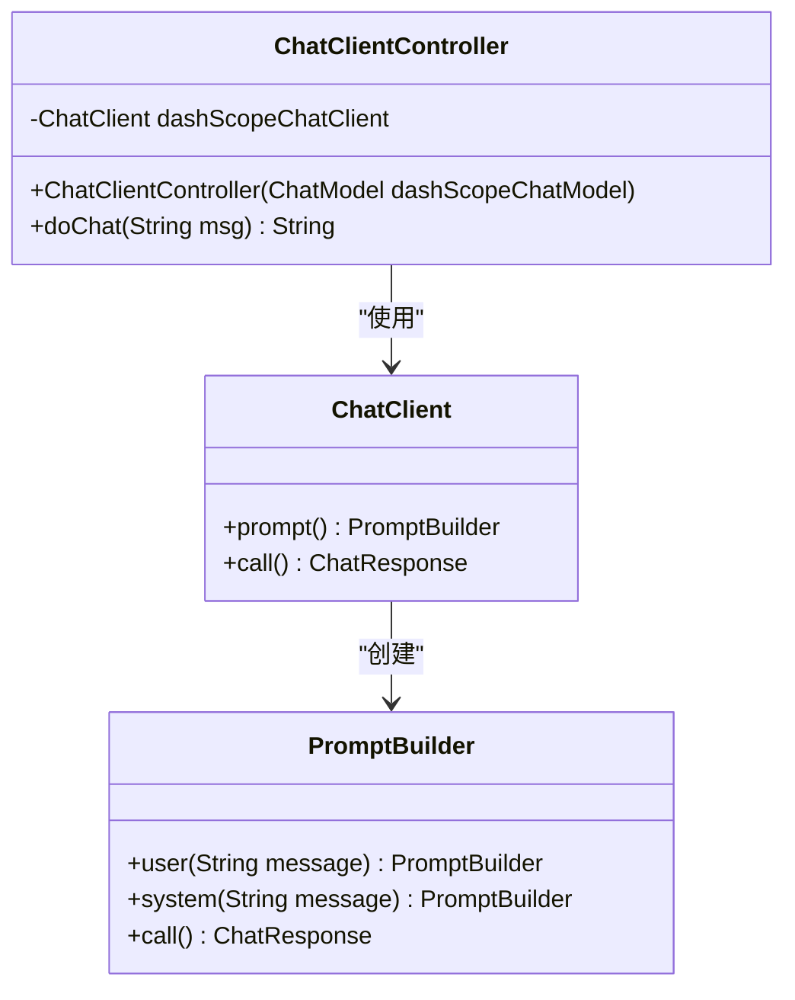

**图表来源**
- [ChatClientController.java:18-36](file://【1】SpringAIAlibaba-atguiguV1/SAA-03ChatModelChatClient/src/main/java/com/atguigu/study/controller/ChatClientController.java#L18-L36)

该控制器通过依赖注入获取ChatClient实例，并提供REST接口进行对话交互。其特点包括：
- 自动注入ChatClient Bean
- 简洁的API调用接口
- 支持动态消息参数

**章节来源**
- [ChatClientController.java:17-36](file://【1】SpringAIAlibaba-atguiguV1/SAA-03ChatModelChatClient/src/main/java/com/atguigu/study/controller/ChatClientController.java#L17-L36)

### ChatClientControllerV2 - 多种实现对比

ChatClientControllerV2展示了不同实现方式的对比：

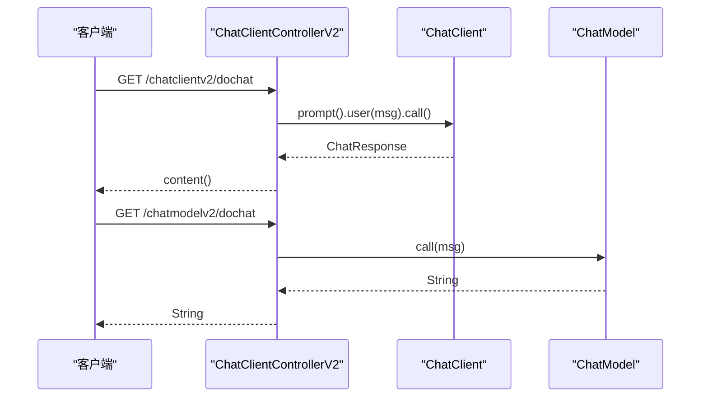

**图表来源**
- [ChatClientControllerV2.java:28-47](file://【1】SpringAIAlibaba-atguiguV1/SAA-03ChatModelChatClient/src/main/java/com/atguigu/study/controller/ChatClientControllerV2.java#L28-L47)

**章节来源**
- [ChatClientControllerV2.java:15-49](file://【1】SpringAIAlibaba-atguiguV1/SAA-03ChatModelChatClient/src/main/java/com/atguigu/study/controller/ChatClientControllerV2.java#L15-L49)

### SaaLLMConfig - 配置管理

SaaLLMConfig展示了如何在Spring容器中配置ChatClient：

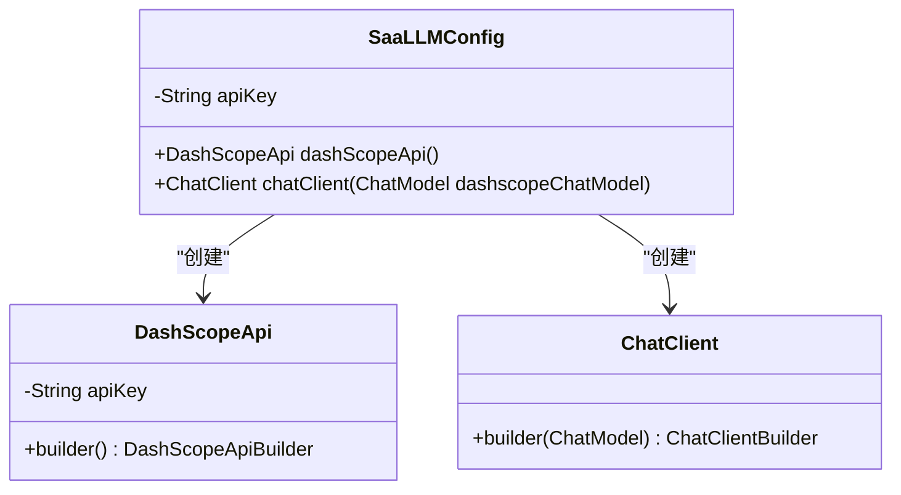

**图表来源**
- [SaaLLMConfig.java:15-39](file://【1】SpringAIAlibaba-atguiguV1/SAA-03ChatModelChatClient/src/main/java/com/atguigu/study/config/SaaLLMConfig.java#L15-L39)

**章节来源**
- [SaaLLMConfig.java:14-39](file://【1】SpringAIAlibaba-atguiguV1/SAA-03ChatModelChatClient/src/main/java/com/atguigu/study/config/SaaLLMConfig.java#L14-L39)

## 架构概览

项目整体架构分为三层：

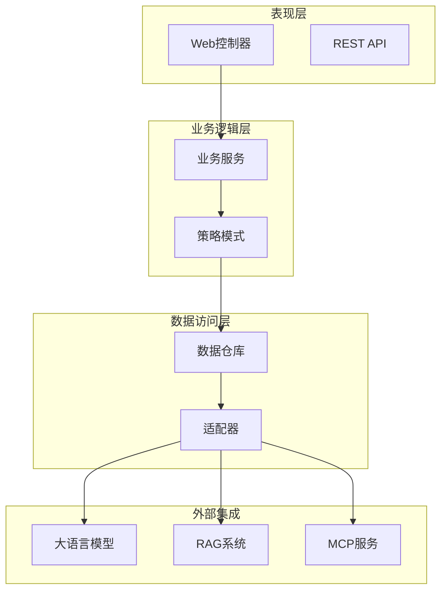

**图表来源**
- [ChatClientService.java:34-57](file://【3】工作资料/code/仓颉智能体/nlp-agent/agent-builder/agent-build-core/src/main/java/com/yundingtech/agent/build/modules/chatapplication/service/impl/ChatClientService.java#L34-L57)
- [ChatClientServiceV1.java:22-29](file://【3】工作资料/code/仓颉智能体/nlp-agent/agent-common/agent-rag-adapter/src/main/java/com/yundingtech/agent/adapter/ragchat/service/ChatClientServiceV1.java#L22-L29)

## 详细组件分析

### ChatClientService - 自定义实现

ChatClientService展示了基于WebClient的自定义ChatClient实现：

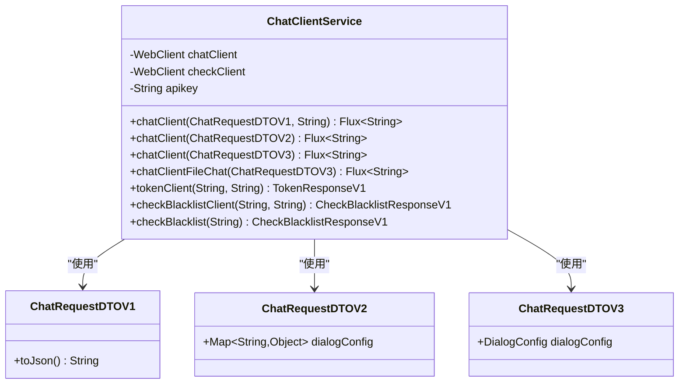

**图表来源**
- [ChatClientService.java:34-152](file://【3】工作资料/code/仓颉智能体/nlp-agent/agent-builder/agent-build-core/src/main/java/com/yundingtech/agent/build/modules/chatapplication/service/impl/ChatClientService.java#L34-L152)

该服务的特点包括：
- 支持多种请求格式（V1/V2/V3）
- 流式响应处理
- 黑名单检查功能
- 认证令牌管理

**章节来源**
- [ChatClientService.java:1-225](file://【3】工作资料/code/仓颉智能体/nlp-agent/agent-builder/agent-build-core/src/main/java/com/yundingtech/agent/build/modules/chatapplication/service/impl/ChatClientService.java#L1-L225)

### ChatClientServiceV1 - 简化实现

ChatClientServiceV1展示了简化版本的ChatClient实现：

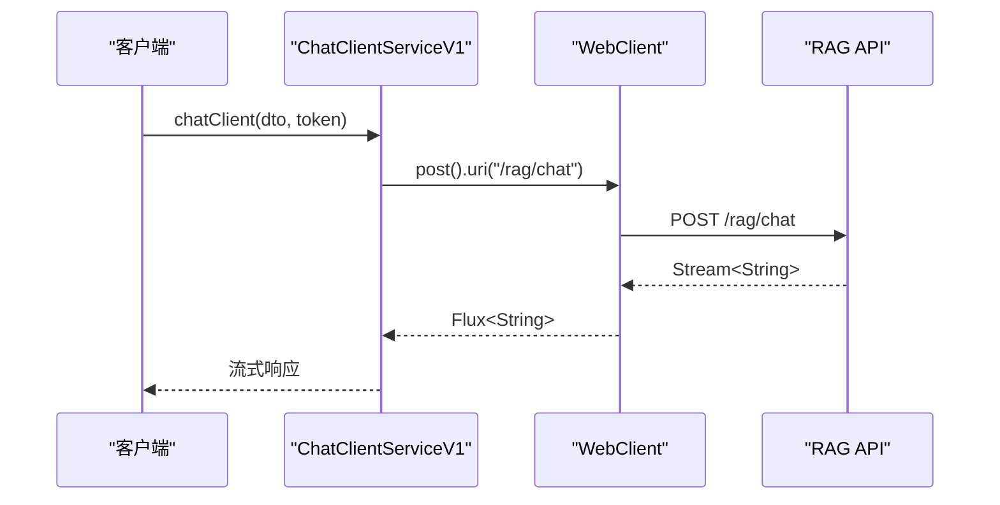

**图表来源**
- [ChatClientServiceV1.java:32-41](file://【3】工作资料/code/仓颉智能体/nlp-agent/agent-common/agent-rag-adapter/src/main/java/com/yundingtech/agent/adapter/ragchat/service/ChatClientServiceV1.java#L32-L41)

**章节来源**
- [ChatClientServiceV1.java:1-67](file://【3】工作资料/code/仓颉智能体/nlp-agent/agent-common/agent-rag-adapter/src/main/java/com/yundingtech/agent/adapter/ragchat/service/ChatClientServiceV1.java#L1-L67)

### ChatClientUtil - 工具类

ChatClientUtil提供了Spring AI消息格式转换工具：

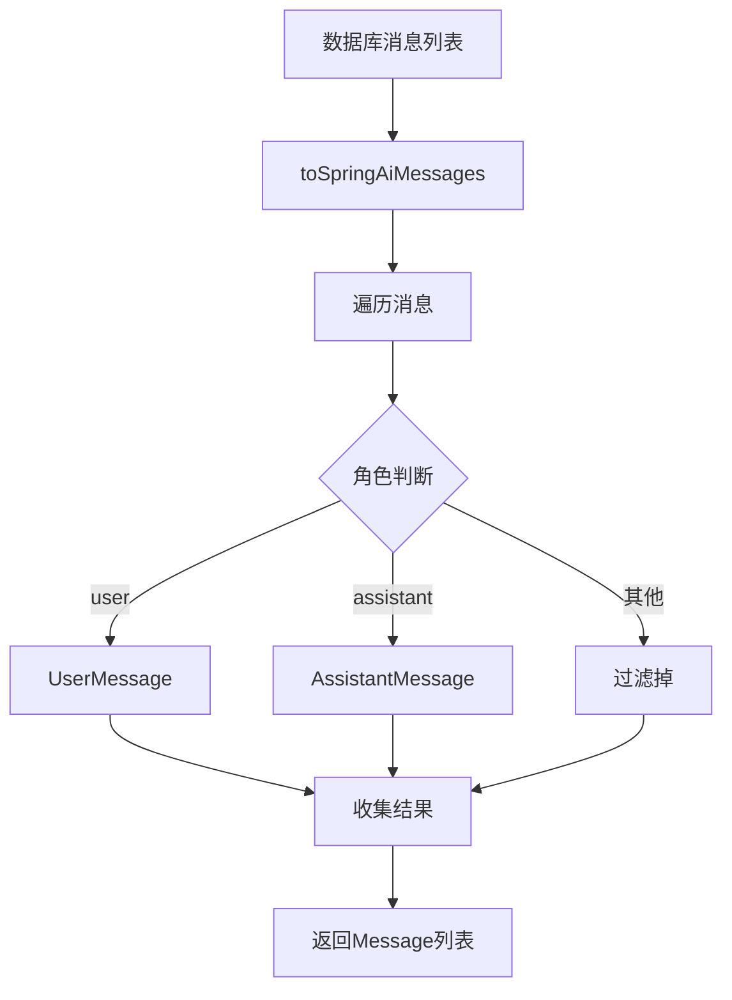

**图表来源**
- [ChatClientUtil.java:18-34](file://【3】工作资料/code/仓颉智能体/nlp-agent/agent-common/agent-model-adapter/src/main/java/com/yundingtech/agent/sdk/common/util/ChatClientUtil.java#L18-L34)

**章节来源**
- [ChatClientUtil.java:1-36](file://【3】工作资料/code/仓颉智能体/nlp-agent/agent-common/agent-model-adapter/src/main/java/com/yundingtech/agent/sdk/common/util/ChatClientUtil.java#L1-L36)

## 依赖关系分析

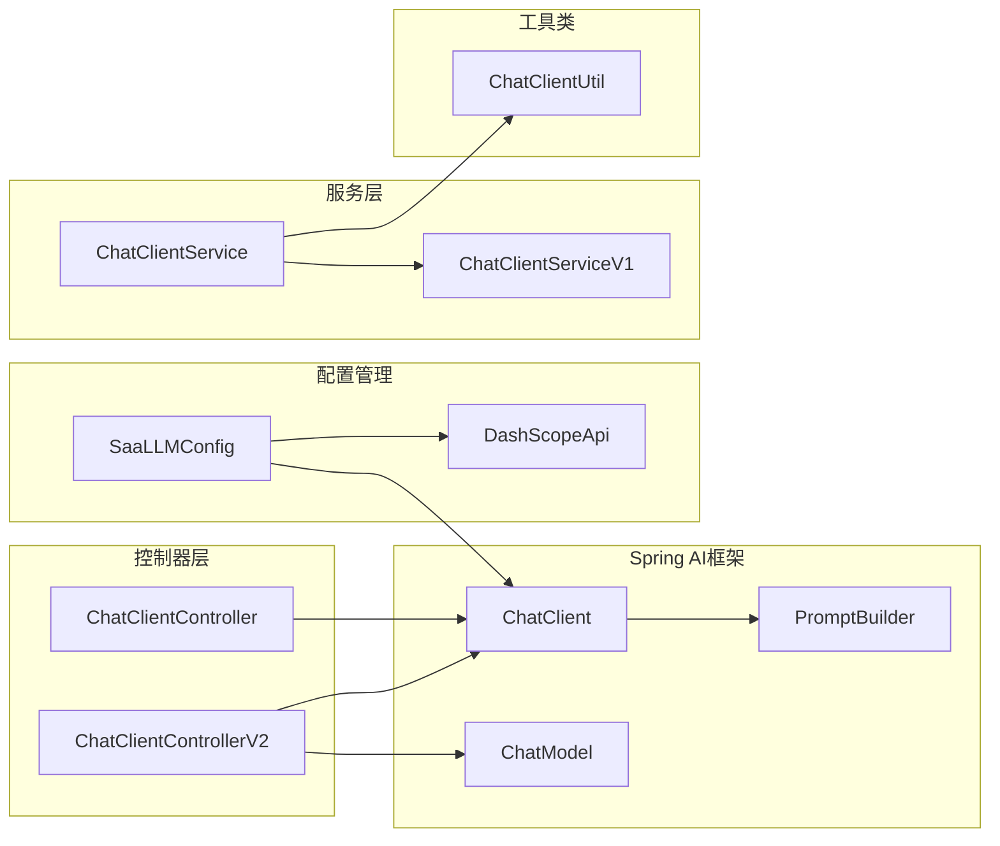

**图表来源**
- [SaaLLMConfig.java:35-39](file://【1】SpringAIAlibaba-atguiguV1/SAA-03ChatModelChatClient/src/main/java/com/atguigu/study/config/SaaLLMConfig.java#L35-L39)
- [ChatClientController.java:20-29](file://【1】SpringAIAlibaba-atguiguV1/SAA-03ChatModelChatClient/src/main/java/com/atguigu/study/controller/ChatClientController.java#L20-L29)

**章节来源**
- [SaaLLMConfig.java:14-39](file://【1】SpringAIAlibaba-atguiguV1/SAA-03ChatModelChatClient/src/main/java/com/atguigu/study/config/SaaLLMConfig.java#L14-L39)
- [ChatClientController.java:17-36](file://【1】SpringAIAlibaba-atguiguV1/SAA-03ChatModelChatClient/src/main/java/com/atguigu/study/controller/ChatClientController.java#L17-L36)
- [ChatClientControllerV2.java:15-49](file://【1】SpringAIAlibaba-atguiguV1/SAA-03ChatModelChatClient/src/main/java/com/atguigu/study/controller/ChatClientControllerV2.java#L15-L49)

## 性能考虑

### 流式响应处理

两种实现都支持流式响应处理，但实现方式不同：

1. **Spring AI框架实现**：
   - 使用`ChatResponse.content()`获取完整响应
   - 适合简单场景，开发效率高

2. **WebClient实现**：
   - 使用`Flux<String>`进行流式处理
   - 更灵活的错误处理和超时控制
   - 支持复杂的业务逻辑

### 连接池和资源管理

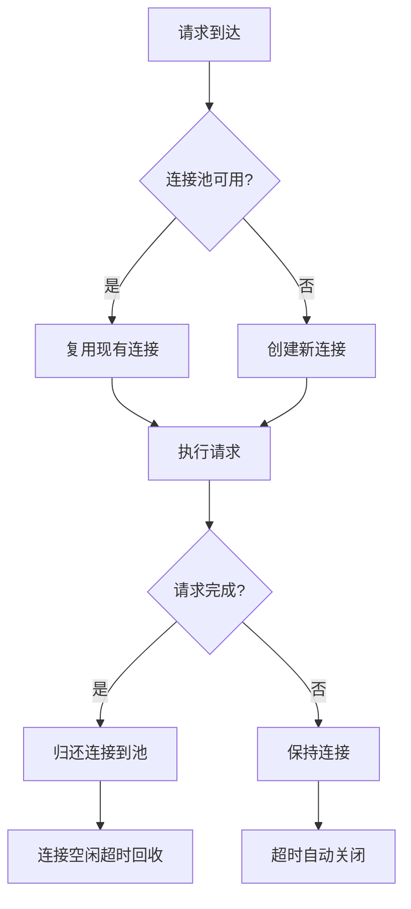

### 缓存策略

建议实施以下缓存策略：
- API密钥缓存
- 模型配置缓存
- 响应内容缓存（针对重复查询）

## 故障排除指南

### 常见问题及解决方案

| 问题类型 | 症状 | 可能原因 | 解决方案 |
|---------|------|----------|----------|
| 认证失败 | 401 Unauthorized | API密钥错误或过期 | 检查application.properties配置 |
| 连接超时 | TimeoutException | 网络延迟或服务器繁忙 | 增加超时时间，实施重试机制 |
| 内容被拦截 | 403 Forbidden | 黑名单检查失败 | 检查内容合规性，调整策略 |
| 响应格式错误 | JsonProcessingException | API响应格式变化 | 更新DTO映射，实施降级策略 |

### 异常处理最佳实践

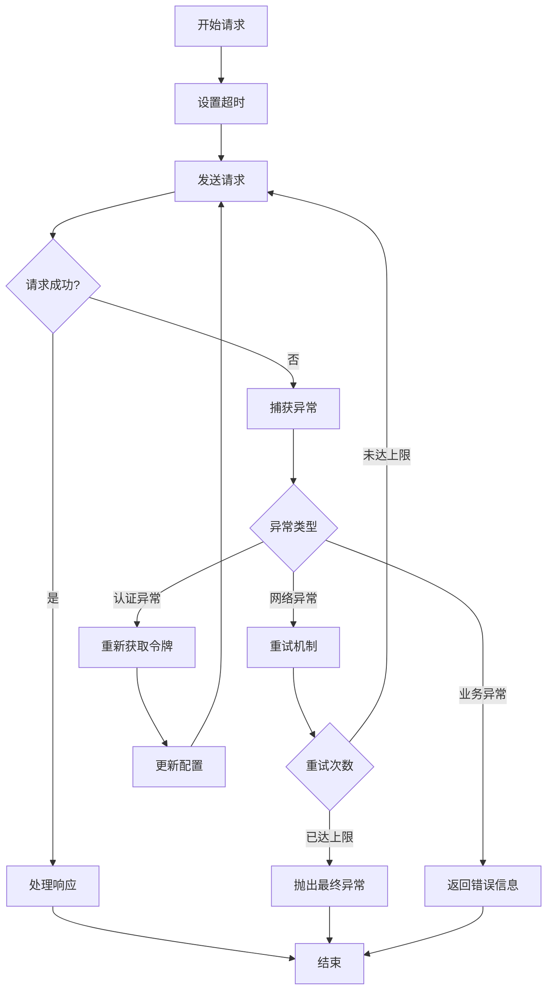

**章节来源**
- [ChatClientService.java:164-168](file://【3】工作资料/code/仓颉智能体/nlp-agent/agent-builder/agent-build-core/src/main/java/com/yundingtech/agent/build/modules/chatapplication/service/impl/ChatClientService.java#L164-L168)
- [ChatClientService.java:213-217](file://【3】工作资料/code/仓颉智能体/nlp-agent/agent-builder/agent-build-core/src/main/java/com/yundingtech/agent/build/modules/chatapplication/service/impl/ChatClientService.java#L213-L217)

## 结论

本项目展示了两种不同层次的ChatClient实现方式：

1. **Spring AI框架实现**（ChatClientController）：适合快速开发和简单应用场景，具有开发效率高的优点，但灵活性相对较低。

2. **自定义WebClient实现**（ChatClientService）：提供了更高的灵活性和控制力，支持复杂的业务逻辑和错误处理，但开发成本较高。

选择哪种实现方式取决于具体的业务需求：
- 简单对话场景：推荐使用Spring AI框架实现
- 复杂业务场景：推荐使用自定义WebClient实现
- 性能敏感场景：需要根据具体需求权衡两种实现的优缺点

通过合理的设计和配置，ChatClient可以很好地满足各种对话交互需求，为用户提供流畅的AI对话体验。