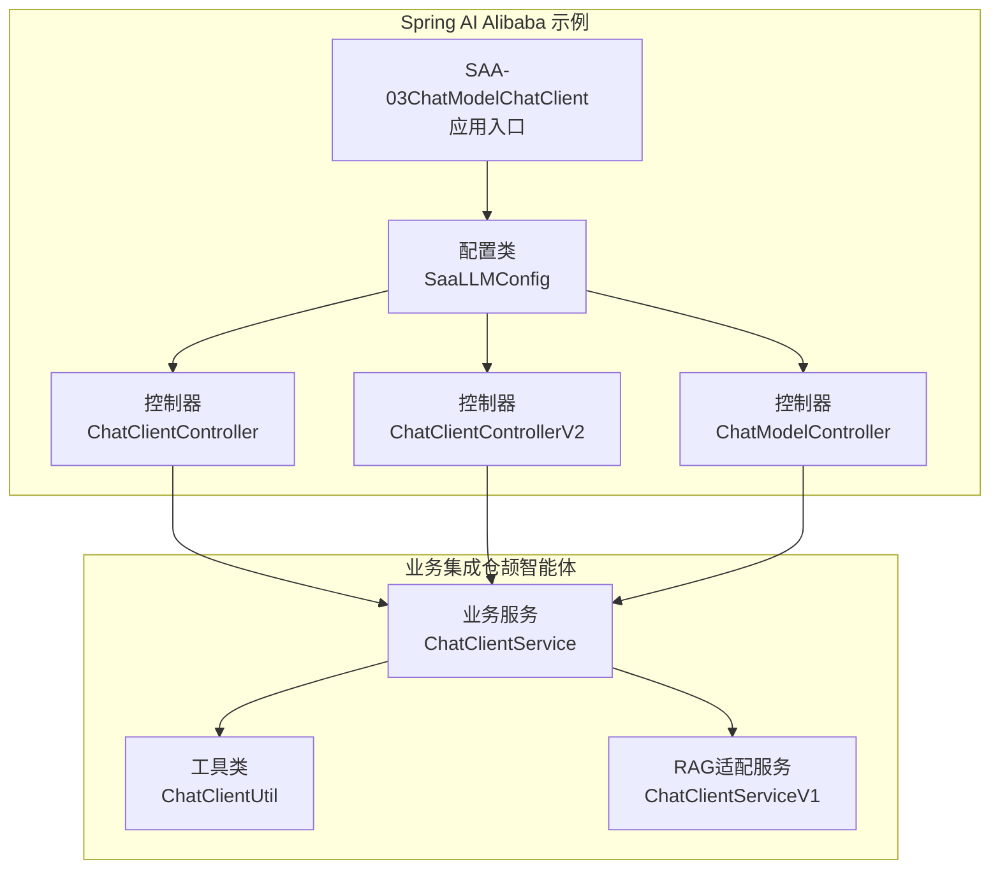
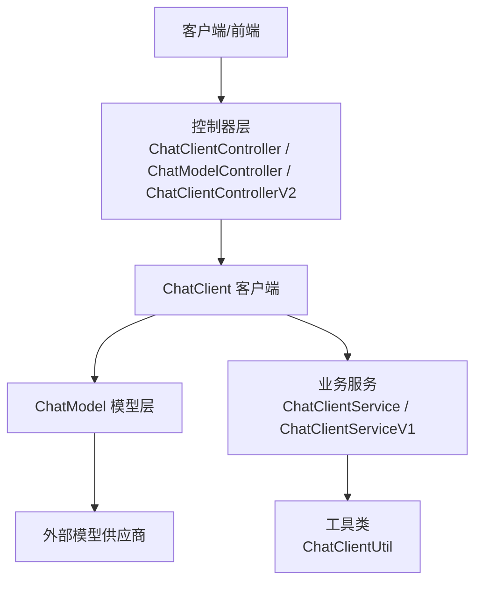
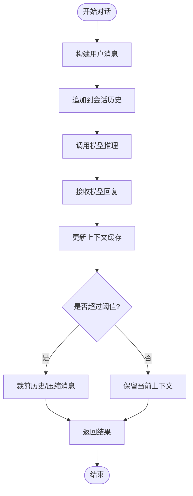
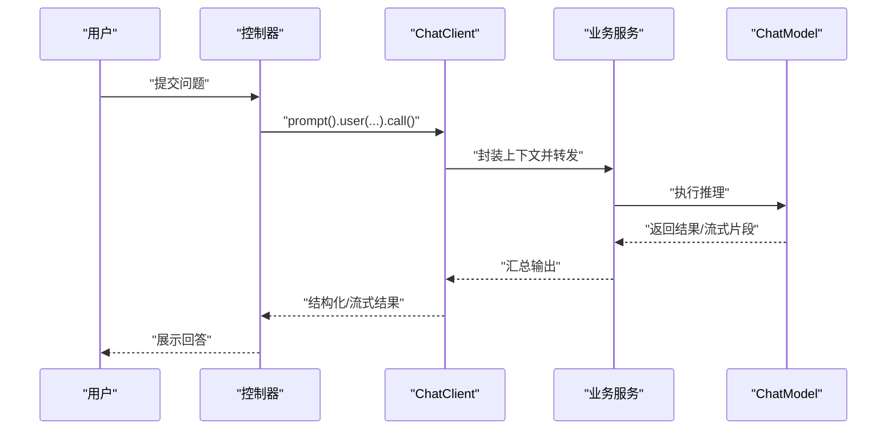
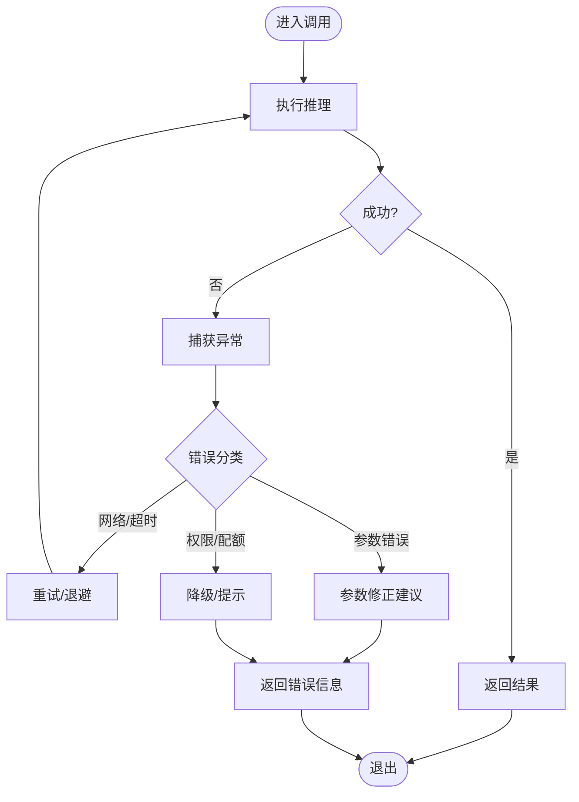
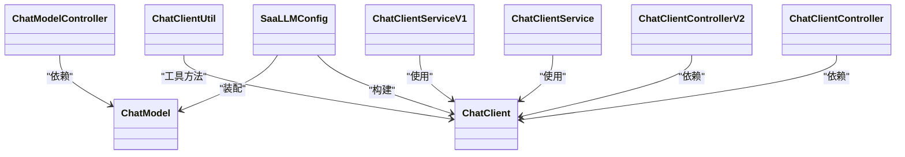

# ChatClient概述

<cite>
**本文引用的文件**
- [Saa03ChatModelChatClientApplication.java](file://【1】SpringAIAlibaba-atguiguV1/SAA-03ChatModelChatClient/src/main/java/com/atguigu/study/Saa03ChatModelChatClientApplication.java)
- [SaaLLMConfig.java](file://【1】SpringAIAlibaba-atguiguV1/SAA-03ChatModelChatClient/src/main/java/com/atguigu/study/config/SaaLLMConfig.java)
- [ChatClientController.java](file://【1】SpringAIAlibaba-atguiguV1/SAA-03ChatModelChatClient/src/main/java/com/atguigu/study/controller/ChatClientController.java)
- [ChatClientControllerV2.java](file://【1】SpringAIAlibaba-atguiguV1/SAA-03ChatModelChatClient/src/main/java/com/atguigu/study/controller/ChatClientControllerV2.java)
- [ChatModelController.java](file://【1】SpringAIAlibaba-atguiguV1/SAA-03ChatModelChatClient/src/main/java/com/atguigu/study/controller/ChatModelController.java)
- [application.properties](file://【1】SpringAIAlibaba-atguiguV1/SAA-03ChatModelChatClient/src/main/resources/application.properties)
- [ChatClientService.java](file://【3】工作资料/code/仓颉智能体/nlp-agent/agent-builder/agent-build-core/src/main/java/com/yundingtech/agent/build/modules/chatapplication/service/impl/ChatClientService.java)
- [ChatClientUtil.java](file://【3】工作资料/code/仓颉智能体/nlp-agent/agent-common/agent-model-adapter/src/main/java/com/yundingtech/agent/sdk/common/util/ChatClientUtil.java)
- [ChatClientServiceV1.java](file://【3】工作资料/code/仓颉智能体/nlp-agent/agent-common/agent-rag-adapter/src/main/java/com/yundingtech/agent/adapter/ragchat/service/ChatClientServiceV1.java)
</cite>

## 目录
1. [引言](#引言)
2. [项目结构](#项目结构)
3. [核心组件](#核心组件)
4. [架构总览](#架构总览)
5. [详细组件分析](#详细组件分析)
6. [依赖分析](#依赖分析)
7. [性能考虑](#性能考虑)
8. [故障排查指南](#故障排查指南)
9. [结论](#结论)
10. [附录](#附录)

## 引言
本节面向希望在Spring AI Alibaba生态中快速构建对话型应用的开发者，系统性介绍ChatClient的核心理念与价值主张。相较于传统的ChatModel直接调用方式，ChatClient通过“客户端化”的抽象，显著降低了上下文管理、消息编排与错误处理的复杂度，使开发者能够以更简洁的API完成从提示词构造到响应解析的全流程。

- 传统ChatModel方式：需要手动拼接消息序列、显式管理上下文、自行处理流式输出与异常，易出现上下文错乱或资源泄漏。
- ChatClient方式：以“prompt().user(...).call()”等链式API封装底层细节，自动维护对话上下文、统一错误语义，并提供结构化输出与流式回调能力，显著提升开发效率与可维护性。

## 项目结构
本仓库中与ChatClient相关的示例位于“Spring AI Alibaba 教学项目”下的SAA-03模块，配套控制器演示了ChatClient与ChatModel两种调用路径；同时，在“工作资料/仓颉智能体”工程中，存在基于ChatClient的业务服务实现与工具类，体现其在实际业务中的落地形态。

**图表来源**
- [Saa03ChatModelChatClientApplication.java:1-20](file://【1】SpringAIAlibaba-atguiguV1/SAA-03ChatModelChatClient/src/main/java/com/atguigu/study/Saa03ChatModelChatClientApplication.java#L1-L20)
- [SaaLLMConfig.java:1-60](file://【1】SpringAIAlibaba-atguiguV1/SAA-03ChatModelChatClient/src/main/java/com/atguigu/study/config/SaaLLMConfig.java#L1-L60)
- [ChatClientController.java:1-60](file://【1】SpringAIAlibaba-atguiguV1/SAA-03ChatModelChatClient/src/main/java/com/atguigu/study/controller/ChatClientController.java#L1-L60)
- [ChatClientControllerV2.java:1-60](file://【1】SpringAIAlibaba-atguiguV1/SAA-03ChatModelChatClient/src/main/java/com/atguigu/study/controller/ChatClientControllerV2.java#L1-L60)
- [ChatModelController.java:1-60](file://【1】SpringAIAlibaba-atguiguV1/SAA-03ChatModelChatClient/src/main/java/com/atguigu/study/controller/ChatModelController.java#L1-L60)
- [ChatClientService.java:1-120](file://【3】工作资料/code/仓颉智能体/nlp-agent/agent-builder/agent-build-core/src/main/java/com/yundingtech/agent/build/modules/chatapplication/service/impl/ChatClientService.java#L1-L120)
- [ChatClientUtil.java:1-120](file://【3】工作资料/code/仓颉智能体/nlp-agent/agent-common/agent-model-adapter/src/main/java/com/yundingtech/agent/sdk/common/util/ChatClientUtil.java#L1-L120)
- [ChatClientServiceV1.java:1-120](file://【3】工作资料/code/仓颉智能体/nlp-agent/agent-common/agent-rag-adapter/src/main/java/com/yundingtech/agent/adapter/ragchat/service/ChatClientServiceV1.java#L1-L120)

**章节来源**
- [Saa03ChatModelChatClientApplication.java:1-20](file://【1】SpringAIAlibaba-atguiguV1/SAA-03ChatModelChatClient/src/main/java/com/atguigu/study/Saa03ChatModelChatClientApplication.java#L1-L20)
- [SaaLLMConfig.java:1-60](file://【1】SpringAIAlibaba-atguiguV1/SAA-03ChatModelChatClient/src/main/java/com/atguigu/study/config/SaaLLMConfig.java#L1-L60)

## 核心组件
- ChatClient（客户端层）
  - 以链式API封装提示词构造、上下文管理与调用执行，屏蔽底层细节。
  - 支持结构化输出与流式回调，简化错误处理与资源释放。
- ChatModel（模型层）
  - 提供底层推理能力，需由上层（如ChatClient）进行装配与编排。
- 控制器层（示例）
  - ChatClientController：演示ChatClient链式调用与上下文传递。
  - ChatModelController：演示ChatModel直接调用与上下文管理。
  - ChatClientControllerV2：演示增强的上下文与输出处理。
- 业务服务与工具（落地）
  - ChatClientService：封装业务对话流程，复用ChatClient能力。
  - ChatClientUtil：提供通用的对话构建与调用工具方法。
  - ChatClientServiceV1：结合RAG的对话服务实现。

**章节来源**
- [ChatClientController.java:1-60](file://【1】SpringAIAlibaba-atguiguV1/SAA-03ChatModelChatClient/src/main/java/com/atguigu/study/controller/ChatClientController.java#L1-L60)
- [ChatModelController.java:1-60](file://【1】SpringAIAlibaba-atguiguV1/SAA-03ChatModelChatClient/src/main/java/com/atguigu/study/controller/ChatModelController.java#L1-L60)
- [ChatClientControllerV2.java:1-60](file://【1】SpringAIAlibaba-atguiguV1/SAA-03ChatModelChatClient/src/main/java/com/atguigu/study/controller/ChatClientControllerV2.java#L1-L60)
- [ChatClientService.java:1-120](file://【3】工作资料/code/仓颉智能体/nlp-agent/agent-builder/agent-build-core/src/main/java/com/yundingtech/agent/build/modules/chatapplication/service/impl/ChatClientService.java#L1-L120)
- [ChatClientUtil.java:1-120](file://【3】工作资料/code/仓颉智能体/nlp-agent/agent-common/agent-model-adapter/src/main/java/com/yundingtech/agent/sdk/common/util/ChatClientUtil.java#L1-L120)
- [ChatClientServiceV1.java:1-120](file://【3】工作资料/code/仓颉智能体/nlp-agent/agent-common/agent-rag-adapter/src/main/java/com/yundingtech/agent/adapter/ragchat/service/ChatClientServiceV1.java#L1-L120)

## 架构总览
下图展示了从控制器到ChatClient再到业务服务的整体调用链路，体现了ChatClient在Spring AI Alibaba中的定位：作为“客户端抽象层”，向上承接控制器与业务服务，向下对接ChatModel与外部模型供应商。

**图表来源**
- [ChatClientController.java:1-60](file://【1】SpringAIAlibaba-atguiguV1/SAA-03ChatModelChatClient/src/main/java/com/atguigu/study/controller/ChatClientController.java#L1-L60)
- [ChatModelController.java:1-60](file://【1】SpringAIAlibaba-atguiguV1/SAA-03ChatModelChatClient/src/main/java/com/atguigu/study/controller/ChatModelController.java#L1-L60)
- [ChatClientControllerV2.java:1-60](file://【1】SpringAIAlibaba-atguiguV1/SAA-03ChatModelChatClient/src/main/java/com/atguigu/study/controller/ChatClientControllerV2.java#L1-L60)
- [ChatClientService.java:1-120](file://【3】工作资料/code/仓颉智能体/nlp-agent/agent-builder/agent-build-core/src/main/java/com/yundingtech/agent/build/modules/chatapplication/service/impl/ChatClientService.java#L1-L120)
- [ChatClientUtil.java:1-120](file://【3】工作资料/code/仓颉智能体/nlp-agent/agent-common/agent-model-adapter/src/main/java/com/yundingtech/agent/sdk/common/util/ChatClientUtil.java#L1-L120)
- [ChatClientServiceV1.java:1-120](file://【3】工作资料/code/仓颉智能体/nlp-agent/agent-common/agent-rag-adapter/src/main/java/com/yundingtech/agent/adapter/ragchat/service/ChatClientServiceV1.java#L1-L120)

## 详细组件分析

### ChatClient自动上下文管理机制
- 自动维护对话历史：ChatClient在一次会话内自动聚合用户消息与模型回复，避免重复传参与上下文错位。
- 会话边界控制：通过会话标识与消息序列管理，确保多轮对话的连贯性与可追溯性。
- 上下文截断与优化：在消息长度接近阈值时，自动裁剪或压缩历史，保证成本与性能平衡。

[此图为概念性流程示意，无需图表来源]

### 简化API调用流程
- 链式调用：以“prompt().user(...).call()”形式表达意图，减少样板代码。
- 结构化输出：通过指定输出类型，自动完成JSON/对象映射，降低解析成本。
- 流式回调：支持增量输出监听，便于实时渲染与交互体验。

**图表来源**
- [ChatClientController.java:1-60](file://【1】SpringAIAlibaba-atguiguV1/SAA-03ChatModelChatClient/src/main/java/com/atguigu/study/controller/ChatClientController.java#L1-L60)
- [ChatClientControllerV2.java:1-60](file://【1】SpringAIAlibaba-atguiguV1/SAA-03ChatModelChatClient/src/main/java/com/atguigu/study/controller/ChatClientControllerV2.java#L1-L60)
- [ChatClientService.java:1-120](file://【3】工作资料/code/仓颉智能体/nlp-agent/agent-builder/agent-build-core/src/main/java/com/yundingtech/agent/build/modules/chatapplication/service/impl/ChatClientService.java#L1-L120)

### 错误处理能力
- 统一异常包装：将底层模型异常转换为可读的业务异常，便于前端与日志系统消费。
- 资源释放保障：在流式输出与长会话场景下，确保连接与缓冲区及时回收。
- 重试与降级：在可恢复错误时自动重试，不可恢复时提供降级策略与兜底文案。

[此图为概念性流程示意，无需图表来源]

### 在Spring AI Alibaba中的定位与作用
- 定位：作为“客户端抽象层”，屏蔽模型供应商差异与底层调用细节，统一对外API。
- 作用：
  - 降低学习与迁移成本：一套API适配多家模型供应商。
  - 提升开发效率：链式API与自动上下文管理减少样板代码。
  - 增强可维护性：集中化的错误处理与资源管理策略。

**章节来源**
- [SaaLLMConfig.java:1-60](file://【1】SpringAIAlibaba-atguiguV1/SAA-03ChatModelChatClient/src/main/java/com/atguigu/study/config/SaaLLMConfig.java#L1-L60)
- [ChatClientController.java:1-60](file://【1】SpringAIAlibaba-atguiguV1/SAA-03ChatModelChatClient/src/main/java/com/atguigu/study/controller/ChatClientController.java#L1-L60)
- [ChatClientControllerV2.java:1-60](file://【1】SpringAIAlibaba-atguiguV1/SAA-03ChatModelChatClient/src/main/java/com/atguigu/study/controller/ChatClientControllerV2.java#L1-L60)

## 依赖分析
- 控制器依赖ChatClient：通过注入ChatClient实例，实现链式调用与上下文传递。
- ChatClient依赖ChatModel：在配置类中以ChatModel为输入构建ChatClient，实现供应商解耦。
- 业务服务依赖ChatClient：在具体业务中复用ChatClient能力，统一对话流程。
- 工具类辅助：提供通用的对话构建与调用封装，降低重复代码。

**图表来源**
- [ChatModelController.java:1-60](file://【1】SpringAIAlibaba-atguiguV1/SAA-03ChatModelChatClient/src/main/java/com/atguigu/study/controller/ChatModelController.java#L1-L60)
- [ChatClientController.java:1-60](file://【1】SpringAIAlibaba-atguiguV1/SAA-03ChatModelChatClient/src/main/java/com/atguigu/study/controller/ChatClientController.java#L1-L60)
- [ChatClientControllerV2.java:1-60](file://【1】SpringAIAlibaba-atguiguV1/SAA-03ChatModelChatClient/src/main/java/com/atguigu/study/controller/ChatClientControllerV2.java#L1-L60)
- [SaaLLMConfig.java:1-60](file://【1】SpringAIAlibaba-atguiguV1/SAA-03ChatModelChatClient/src/main/java/com/atguigu/study/config/SaaLLMConfig.java#L1-L60)
- [ChatClientService.java:1-120](file://【3】工作资料/code/仓颉智能体/nlp-agent/agent-builder/agent-build-core/src/main/java/com/yundingtech/agent/build/modules/chatapplication/service/impl/ChatClientService.java#L1-L120)
- [ChatClientUtil.java:1-120](file://【3】工作资料/code/仓颉智能体/nlp-agent/agent-common/agent-model-adapter/src/main/java/com/yundingtech/agent/sdk/common/util/ChatClientUtil.java#L1-L120)
- [ChatClientServiceV1.java:1-120](file://【3】工作资料/code/仓颉智能体/nlp-agent/agent-common/agent-rag-adapter/src/main/java/com/yundingtech/agent/adapter/ragchat/service/ChatClientServiceV1.java#L1-L120)

**章节来源**
- [SaaLLMConfig.java:1-60](file://【1】SpringAIAlibaba-atguiguV1/SAA-03ChatModelChatClient/src/main/java/com/atguigu/study/config/SaaLLMConfig.java#L1-L60)
- [ChatClientController.java:1-60](file://【1】SpringAIAlibaba-atguiguV1/SAA-03ChatModelChatClient/src/main/java/com/atguigu/study/controller/ChatClientController.java#L1-L60)
- [ChatClientControllerV2.java:1-60](file://【1】SpringAIAlibaba-atguiguV1/SAA-03ChatModelChatClient/src/main/java/com/atguigu/study/controller/ChatClientControllerV2.java#L1-L60)
- [ChatClientService.java:1-120](file://【3】工作资料/code/仓颉智能体/nlp-agent/agent-builder/agent-build-core/src/main/java/com/yundingtech/agent/build/modules/chatapplication/service/impl/ChatClientService.java#L1-L120)
- [ChatClientUtil.java:1-120](file://【3】工作资料/code/仓颉智能体/nlp-agent/agent-common/agent-model-adapter/src/main/java/com/yundingtech/agent/sdk/common/util/ChatClientUtil.java#L1-L120)
- [ChatClientServiceV1.java:1-120](file://【3】工作资料/code/仓颉智能体/nlp-agent/agent-common/agent-rag-adapter/src/main/java/com/yundingtech/agent/adapter/ragchat/service/ChatClientServiceV1.java#L1-L120)

## 性能考虑
- 上下文长度控制：根据模型上下文窗口限制，动态裁剪历史消息，避免超限导致的失败与性能抖动。
- 流式输出优化：在流式场景下采用背压与缓冲策略，平衡延迟与吞吐。
- 连接池与并发：合理设置并发与超时，避免资源争用与堆积。
- 缓存与预热：对热点会话与常用模板进行缓存，减少重复计算与冷启动开销。

[本节为通用性能建议，无需章节来源]

## 故障排查指南
- 常见问题
  - 上下文过长：检查历史消息长度与截断策略，必要时精简提示词或启用摘要。
  - 超时与重试：确认网络环境与重试策略，避免频繁重试导致雪崩。
  - 输出解析失败：核对结构化输出类型与模型返回格式，必要时回退为纯文本。
- 排查步骤
  - 打印请求与响应日志，定位异常阶段。
  - 分离ChatClient与ChatModel调用，判断问题来源。
  - 使用工具类进行最小化复现，隔离第三方依赖。

**章节来源**
- [ChatClientController.java:1-60](file://【1】SpringAIAlibaba-atguiguV1/SAA-03ChatModelChatClient/src/main/java/com/atguigu/study/controller/ChatClientController.java#L1-L60)
- [ChatClientControllerV2.java:1-60](file://【1】SpringAIAlibaba-atguiguV1/SAA-03ChatModelChatClient/src/main/java/com/atguigu/study/controller/ChatClientControllerV2.java#L1-L60)
- [ChatClientUtil.java:1-120](file://【3】工作资料/code/仓颉智能体/nlp-agent/agent-common/agent-model-adapter/src/main/java/com/yundingtech/agent/sdk/common/util/ChatClientUtil.java#L1-L120)

## 结论
ChatClient在Spring AI Alibaba中扮演“客户端抽象层”的关键角色，通过链式API、自动上下文管理与统一错误处理，显著降低了对话型应用的开发门槛与维护成本。结合业务服务与工具类，可在多模型供应商与复杂业务场景中保持一致的开发体验与稳定的运行质量。

[本节为总结性内容，无需章节来源]

## 附录

### 基本配置示例（路径参考）
- 应用配置文件位置
  - [application.properties](file://【1】SpringAIAlibaba-atguiguV1/SAA-03ChatModelChatClient/src/main/resources/application.properties)
- ChatClient构建与注入
  - [SaaLLMConfig.java:1-60](file://【1】SpringAIAlibaba-atguiguV1/SAA-03ChatModelChatClient/src/main/java/com/atguigu/study/config/SaaLLMConfig.java#L1-L60)
- 控制器调用示例
  - [ChatClientController.java:1-60](file://【1】SpringAIAlibaba-atguiguV1/SAA-03ChatModelChatClient/src/main/java/com/atguigu/study/controller/ChatClientController.java#L1-L60)
  - [ChatClientControllerV2.java:1-60](file://【1】SpringAIAlibaba-atguiguV1/SAA-03ChatModelChatClient/src/main/java/com/atguigu/study/controller/ChatClientControllerV2.java#L1-L60)
  - [ChatModelController.java:1-60](file://【1】SpringAIAlibaba-atguiguV1/SAA-03ChatModelChatClient/src/main/java/com/atguigu/study/controller/ChatModelController.java#L1-L60)

### 使用场景说明
- 快速原型与Demo：利用链式API与自动上下文，快速验证产品想法。
- 多轮对话与RAG：结合业务服务与工具类，实现复杂检索增强生成。
- 多模型供应商适配：通过ChatClient统一对接不同供应商，降低迁移成本。

**章节来源**
- [application.properties](file://【1】SpringAIAlibaba-atguiguV1/SAA-03ChatModelChatClient/src/main/resources/application.properties)
- [SaaLLMConfig.java:1-60](file://【1】SpringAIAlibaba-atguiguV1/SAA-03ChatModelChatClient/src/main/java/com/atguigu/study/config/SaaLLMConfig.java#L1-L60)
- [ChatClientController.java:1-60](file://【1】SpringAIAlibaba-atguiguV1/SAA-03ChatModelChatClient/src/main/java/com/atguigu/study/controller/ChatClientController.java#L1-L60)
- [ChatClientControllerV2.java:1-60](file://【1】SpringAIAlibaba-atguiguV1/SAA-03ChatModelChatClient/src/main/java/com/atguigu/study/controller/ChatClientControllerV2.java#L1-L60)
- [ChatModelController.java:1-60](file://【1】SpringAIAlibaba-atguiguV1/SAA-03ChatModelChatClient/src/main/java/com/atguigu/study/controller/ChatModelController.java#L1-L60)
- [ChatClientService.java:1-120](file://【3】工作资料/code/仓颉智能体/nlp-agent/agent-builder/agent-build-core/src/main/java/com/yundingtech/agent/build/modules/chatapplication/service/impl/ChatClientService.java#L1-L120)
- [ChatClientUtil.java:1-120](file://【3】工作资料/code/仓颉智能体/nlp-agent/agent-common/agent-model-adapter/src/main/java/com/yundingtech/agent/sdk/common/util/ChatClientUtil.java#L1-L120)
- [ChatClientServiceV1.java:1-120](file://【3】工作资料/code/仓颉智能体/nlp-agent/agent-common/agent-rag-adapter/src/main/java/com/yundingtech/agent/adapter/ragchat/service/ChatClientServiceV1.java#L1-L120)