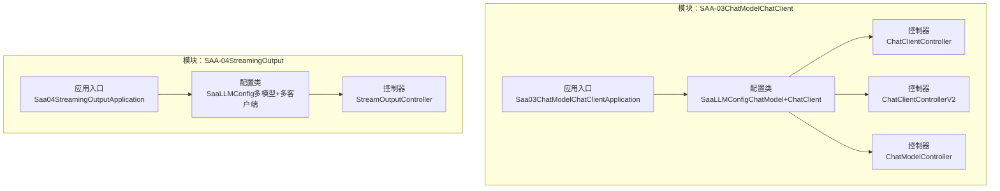
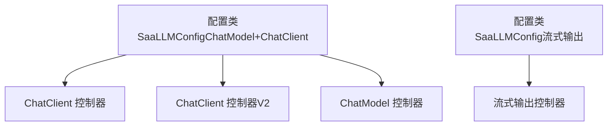
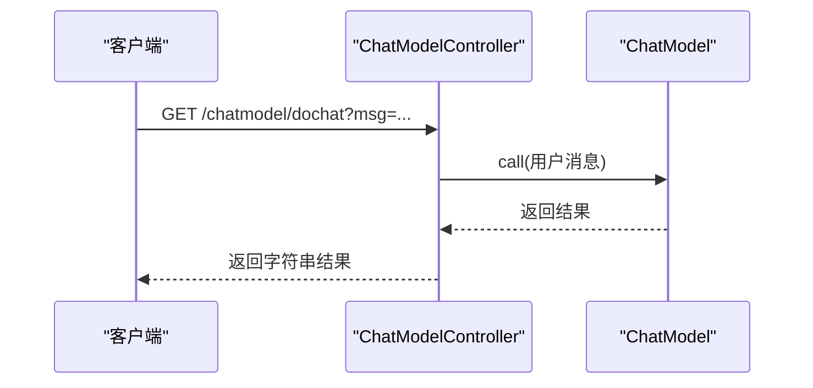
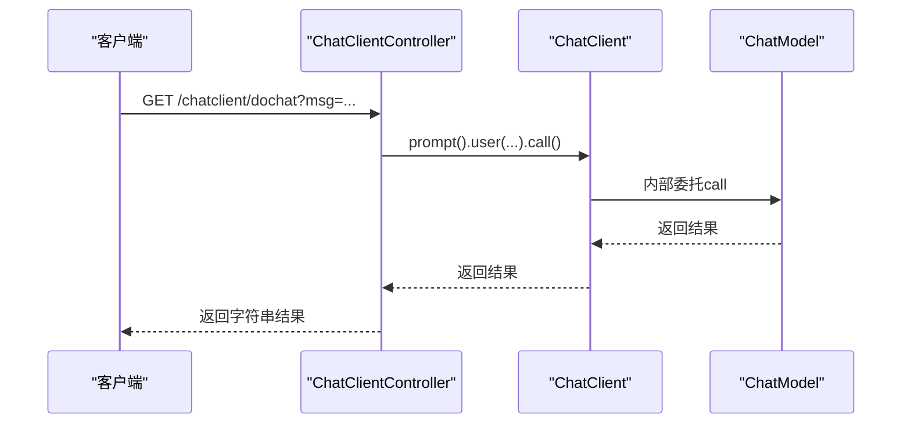
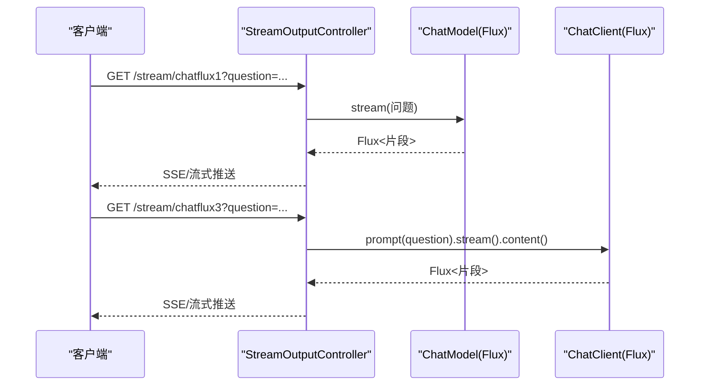
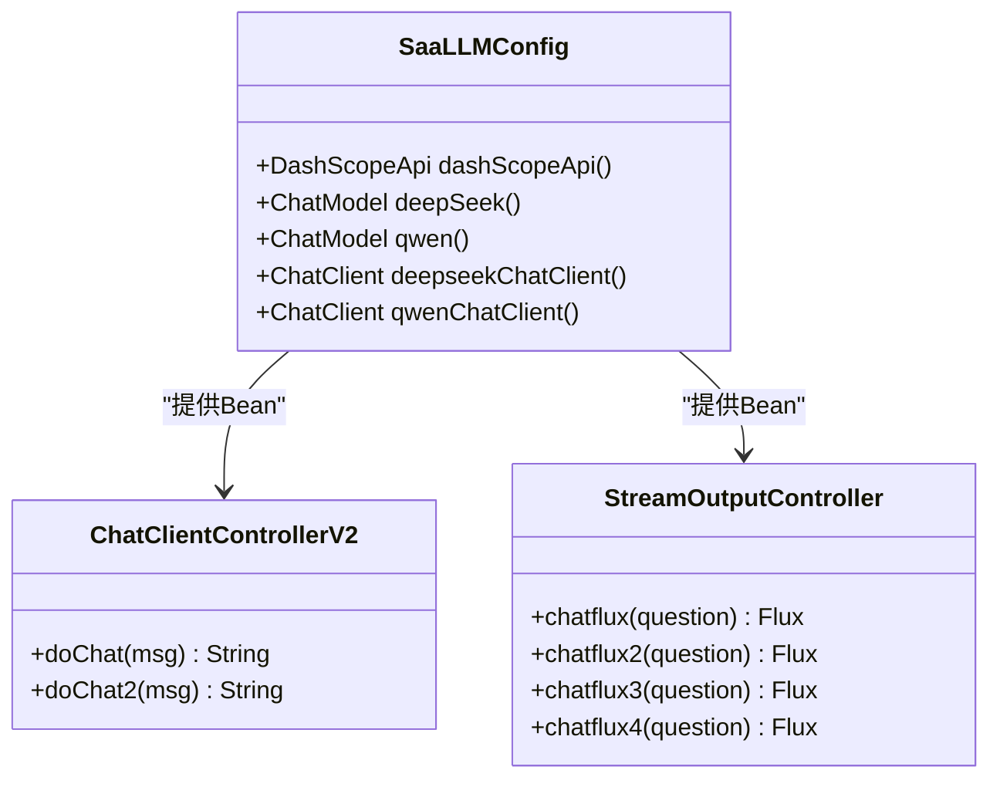
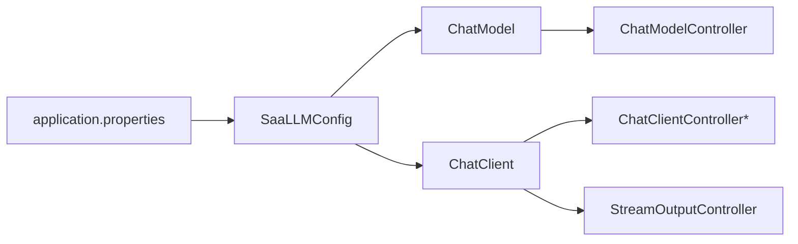

# ChatClient模式

<cite>
**本文引用的文件**
- [Saa03ChatModelChatClientApplication.java](file://【1】SpringAIAlibaba-atguiguV1/SAA-03ChatModelChatClient/src/main/java/com/atguigu/study/Saa03ChatModelChatClientApplication.java)
- [SaaLLMConfig.java（ChatModel+ChatClient）](file://【1】SpringAIAlibaba-atguiguV1/SAA-03ChatModelChatClient/src/main/java/com/atguigu/study/config/SaaLLMConfig.java)
- [ChatClientController.java](file://【1】SpringAIAlibaba-atguiguV1/SAA-03ChatModelChatClient/src/main/java/com/atguigu/study/controller/ChatClientController.java)
- [ChatClientControllerV2.java](file://【1】SpringAIAlibaba-atguiguV1/SAA-03ChatModelChatClient/src/main/java/com/atguigu/study/controller/ChatClientControllerV2.java)
- [ChatModelController.java](file://【1】SpringAIAlibaba-atguiguV1/SAA-03ChatModelChatClient/src/main/java/com/atguigu/study/controller/ChatModelController.java)
- [Saa04StreamingOutputApplication.java](file://【1】SpringAIAlibaba-atguiguV1/SAA-04StreamingOutput/src/main/java/com/atguigu/study/Saa04StreamingOutputApplication.java)
- [SaaLLMConfig.java（流式输出）](file://【1】SpringAIAlibaba-atguiguV1/SAA-04StreamingOutput/src/main/java/com/atguigu/study/config/SaaLLMConfig.java)
- [StreamOutputController.java](file://【1】SpringAIAlibaba-atguiguV1/SAA-04StreamingOutput/src/main/java/com/atguigu/study/controller/StreamOutputController.java)
- [application.properties（ChatModel+ChatClient）](file://【1】SpringAIAlibaba-atguiguV1/SAA-03ChatModelChatClient/src/main/resources/application.properties)
- [application.properties（流式输出）](file://【1】SpringAIAlibaba-atguiguV1/SAA-04StreamingOutput/src/main/resources/application.properties)
</cite>

## 目录
1. [引言](#引言)
2. [项目结构](#项目结构)
3. [核心组件](#核心组件)
4. [架构总览](#架构总览)
5. [详细组件分析](#详细组件分析)
6. [依赖分析](#依赖分析)
7. [性能考量](#性能考量)
8. [故障排查指南](#故障排查指南)
9. [结论](#结论)
10. [附录](#附录)

## 引言
本指南围绕“ChatClient模式”展开，系统讲解两种主流编程范式：ChatModel与ChatClient，并结合仓库中的示例工程，给出清晰的适用场景、性能特点、调用方式对比（同步、异步、流式）、配置类设计、控制器编写与最佳实践。读者可据此在Spring AI生态中高效选择并落地合适的对话能力实现方案。

## 项目结构
本仓库包含两个与ChatClient模式直接相关的示例模块：
- SAA-03ChatModelChatClient：演示ChatModel与ChatClient两种模式的对比与组合使用
- SAA-04StreamingOutput：演示基于ChatModel与ChatClient的流式输出能力

**图表来源**
- [Saa03ChatModelChatClientApplication.java:1-16](file://【1】SpringAIAlibaba-atguiguV1/SAA-03ChatModelChatClient/src/main/java/com/atguigu/study/Saa03ChatModelChatClientApplication.java#L1-L16)
- [SaaLLMConfig.java（ChatModel+ChatClient）:1-40](file://【1】SpringAIAlibaba-atguiguV1/SAA-03ChatModelChatClient/src/main/java/com/atguigu/study/config/SaaLLMConfig.java#L1-L40)
- [ChatClientController.java:1-37](file://【1】SpringAIAlibaba-atguiguV1/SAA-03ChatModelChatClient/src/main/java/com/atguigu/study/controller/ChatClientController.java#L1-L37)
- [ChatClientControllerV2.java:1-50](file://【1】SpringAIAlibaba-atguiguV1/SAA-03ChatModelChatClient/src/main/java/com/atguigu/study/controller/ChatClientControllerV2.java#L1-L50)
- [ChatModelController.java:1-37](file://【1】SpringAIAlibaba-atguiguV1/SAA-03ChatModelChatClient/src/main/java/com/atguigu/study/controller/ChatModelController.java#L1-L37)
- [Saa04StreamingOutputApplication.java:1-21](file://【1】SpringAIAlibaba-atguiguV1/SAA-04StreamingOutput/src/main/java/com/atguigu/study/Saa04StreamingOutputApplication.java#L1-L21)
- [SaaLLMConfig.java（流式输出）:1-64](file://【1】SpringAIAlibaba-atguiguV1/SAA-04StreamingOutput/src/main/java/com/atguigu/study/config/SaaLLMConfig.java#L1-L64)
- [StreamOutputController.java:1-55](file://【1】SpringAIAlibaba-atguiguV1/SAA-04StreamingOutput/src/main/java/com/atguigu/study/controller/StreamOutputController.java#L1-L55)

**章节来源**
- [Saa03ChatModelChatClientApplication.java:1-16](file://【1】SpringAIAlibaba-atguiguV1/SAA-03ChatModelChatClient/src/main/java/com/atguigu/study/Saa03ChatModelChatClientApplication.java#L1-L16)
- [Saa04StreamingOutputApplication.java:1-21](file://【1】SpringAIAlibaba-atguiguV1/SAA-04StreamingOutput/src/main/java/com/atguigu/study/Saa04StreamingOutputApplication.java#L1-L21)

## 核心组件
- 配置类（Spring Bean装配）
  - ChatModel与DashScope集成的配置
  - ChatClient构建与默认选项设置
  - 多模型（Qwen、DeepSeek）共存与命名限定
- 控制器（对外HTTP接口）
  - ChatModel同步调用
  - ChatClient同步调用
  - ChatClient/ChatModel流式输出
- 应用入口（Spring Boot启动）

上述组件在两个模块中分别体现，便于对比与迁移。

**章节来源**
- [SaaLLMConfig.java（ChatModel+ChatClient）:1-40](file://【1】SpringAIAlibaba-atguiguV1/SAA-03ChatModelChatClient/src/main/java/com/atguigu/study/config/SaaLLMConfig.java#L1-L40)
- [SaaLLMConfig.java（流式输出）:1-64](file://【1】SpringAIAlibaba-atguiguV1/SAA-04StreamingOutput/src/main/java/com/atguigu/study/config/SaaLLMConfig.java#L1-L64)
- [ChatModelController.java:1-37](file://【1】SpringAIAlibaba-atguiguV1/SAA-03ChatModelChatClient/src/main/java/com/atguigu/study/controller/ChatModelController.java#L1-L37)
- [ChatClientController.java:1-37](file://【1】SpringAIAlibaba-atguiguV1/SAA-03ChatModelChatClient/src/main/java/com/atguigu/study/controller/ChatClientController.java#L1-L37)
- [ChatClientControllerV2.java:1-50](file://【1】SpringAIAlibaba-atguiguV1/SAA-03ChatModelChatClient/src/main/java/com/atguigu/study/controller/ChatClientControllerV2.java#L1-L50)
- [StreamOutputController.java:1-55](file://【1】SpringAIAlibaba-atguiguV1/SAA-04StreamingOutput/src/main/java/com/atguigu/study/controller/StreamOutputController.java#L1-L55)

## 架构总览
下图展示了ChatClient与ChatModel两种模式在本仓库中的组织方式与交互路径。两者均通过DashScope ChatModel作为底层能力，ChatClient在此基础上提供更丰富的API链式调用与默认选项管理；ChatModel则提供最直接的字符串到字符串的调用。

**图表来源**
- [SaaLLMConfig.java（ChatModel+ChatClient）:1-40](file://【1】SpringAIAlibaba-atguiguV1/SAA-03ChatModelChatClient/src/main/java/com/atguigu/study/config/SaaLLMConfig.java#L1-L40)
- [ChatClientController.java:1-37](file://【1】SpringAIAlibaba-atguiguV1/SAA-03ChatModelChatClient/src/main/java/com/atguigu/study/controller/ChatClientController.java#L1-L37)
- [ChatClientControllerV2.java:1-50](file://【1】SpringAIAlibaba-atguiguV1/SAA-03ChatModelChatClient/src/main/java/com/atguigu/study/controller/ChatClientControllerV2.java#L1-L50)
- [ChatModelController.java:1-37](file://【1】SpringAIAlibaba-atguiguV1/SAA-03ChatModelChatClient/src/main/java/com/atguigu/study/controller/ChatModelController.java#L1-L37)
- [SaaLLMConfig.java（流式输出）:1-64](file://【1】SpringAIAlibaba-atguiguV1/SAA-04StreamingOutput/src/main/java/com/atguigu/study/config/SaaLLMConfig.java#L1-L64)
- [StreamOutputController.java:1-55](file://【1】SpringAIAlibaba-atguiguV1/SAA-04StreamingOutput/src/main/java/com/atguigu/study/controller/StreamOutputController.java#L1-L55)

## 详细组件分析

### ChatModel模式
- 特点
  - 最小API面，适合简单场景
  - 无内置上下文管理，需自行维护会话历史
  - 调用简洁，适合批量或后台任务
- 示例
  - 控制器通过资源注入ChatModel，直接调用字符串到字符串的call方法
- 适用场景
  - 简单问答、批处理、离线推理
- 注意事项
  - 需自行拼接历史消息，避免重复传参

**图表来源**
- [ChatModelController.java:1-37](file://【1】SpringAIAlibaba-atguiguV1/SAA-03ChatModelChatClient/src/main/java/com/atguigu/study/controller/ChatModelController.java#L1-L37)

**章节来源**
- [ChatModelController.java:1-37](file://【1】SpringAIAlibaba-atguiguV1/SAA-03ChatModelChatClient/src/main/java/com/atguigu/study/controller/ChatModelController.java#L1-L37)

### ChatClient模式
- 特点
  - 提供prompt().user(...).call()等链式API，语义化更强
  - 支持默认选项与上下文管理（如历史消息），减少样板代码
  - 更易扩展（如流式输出、工具调用等）
- 示例
  - 两种写法：构造函数注入ChatModel后构建ChatClient；或直接注入已存在的ChatClient Bean
- 适用场景
  - Web交互、多轮对话、需要上下文与默认配置的复杂对话

**图表来源**
- [ChatClientController.java:1-37](file://【1】SpringAIAlibaba-atguiguV1/SAA-03ChatModelChatClient/src/main/java/com/atguigu/study/controller/ChatClientController.java#L1-L37)
- [SaaLLMConfig.java（ChatModel+ChatClient）:1-40](file://【1】SpringAIAlibaba-atguiguV1/SAA-03ChatModelChatClient/src/main/java/com/atguigu/study/config/SaaLLMConfig.java#L1-L40)

**章节来源**
- [ChatClientController.java:1-37](file://【1】SpringAIAlibaba-atguiguV1/SAA-03ChatModelChatClient/src/main/java/com/atguigu/study/controller/ChatClientController.java#L1-L37)
- [ChatClientControllerV2.java:1-50](file://【1】SpringAIAlibaba-atguiguV1/SAA-03ChatModelChatClient/src/main/java/com/atguigu/study/controller/ChatClientControllerV2.java#L1-L50)
- [SaaLLMConfig.java（ChatModel+ChatClient）:1-40](file://【1】SpringAIAlibaba-atguiguV1/SAA-03ChatModelChatClient/src/main/java/com/atguigu/study/config/SaaLLMConfig.java#L1-L40)

### 流式输出（同步 vs 异步 vs 流式）
- 同步调用
  - ChatModel：直接返回完整结果
  - ChatClient：通过prompt().call()返回完整结果
- 异步/流式调用
  - ChatModel：通过stream()返回Flux片段
  - ChatClient：通过prompt().stream().content()返回Flux片段
- 示例
  - 两个模块均提供相同功能的多条路由，便于对比

**图表来源**
- [StreamOutputController.java:1-55](file://【1】SpringAIAlibaba-atguiguV1/SAA-04StreamingOutput/src/main/java/com/atguigu/study/controller/StreamOutputController.java#L1-L55)
- [SaaLLMConfig.java（流式输出）:1-64](file://【1】SpringAIAlibaba-atguiguV1/SAA-04StreamingOutput/src/main/java/com/atguigu/study/config/SaaLLMConfig.java#L1-L64)

**章节来源**
- [StreamOutputController.java:1-55](file://【1】SpringAIAlibaba-atguiguV1/SAA-04StreamingOutput/src/main/java/com/atguigu/study/controller/StreamOutputController.java#L1-L55)
- [SaaLLMConfig.java（流式输出）:1-64](file://【1】SpringAIAlibaba-atguiguV1/SAA-04StreamingOutput/src/main/java/com/atguigu/study/config/SaaLLMConfig.java#L1-L64)

### 配置类设计（多模型与多客户端）
- 单一模型：直接构建ChatModel与对应的ChatClient
- 多模型：通过@Bean指定名称，配合@Qualifier在控制器中按名注入
- 默认选项：在ChatClient与ChatModel上统一设置模型名、温度等参数

**图表来源**
- [SaaLLMConfig.java（流式输出）:1-64](file://【1】SpringAIAlibaba-atguiguV1/SAA-04StreamingOutput/src/main/java/com/atguigu/study/config/SaaLLMConfig.java#L1-L64)
- [ChatClientControllerV2.java:1-50](file://【1】SpringAIAlibaba-atguiguV1/SAA-03ChatModelChatClient/src/main/java/com/atguigu/study/controller/ChatClientControllerV2.java#L1-L50)
- [StreamOutputController.java:1-55](file://【1】SpringAIAlibaba-atguiguV1/SAA-04StreamingOutput/src/main/java/com/atguigu/study/controller/StreamOutputController.java#L1-L55)

**章节来源**
- [SaaLLMConfig.java（ChatModel+ChatClient）:1-40](file://【1】SpringAIAlibaba-atguiguV1/SAA-03ChatModelChatClient/src/main/java/com/atguigu/study/config/SaaLLMConfig.java#L1-L40)
- [SaaLLMConfig.java（流式输出）:1-64](file://【1】SpringAIAlibaba-atguiguV1/SAA-04StreamingOutput/src/main/java/com/atguigu/study/config/SaaLLMConfig.java#L1-L64)

### 控制器编写与最佳实践
- 注入策略
  - ChatModel：推荐@Resource自动注入，便于复用
  - ChatClient：可通过构造函数或@Bean注入，便于在多个接口中复用
- 上下文管理
  - ChatClient支持默认上下文与历史消息管理，减少重复传参
  - ChatModel需自行维护历史消息
- 错误处理
  - 统一封装异常，返回明确的错误码与提示
  - 对外部依赖（如DashScope）进行超时与重试策略
- 性能优化
  - 合理设置模型参数（温度、最大长度等）
  - 在流式输出场景中，注意背压与客户端SSE处理

**章节来源**
- [ChatClientController.java:1-37](file://【1】SpringAIAlibaba-atguiguV1/SAA-03ChatModelChatClient/src/main/java/com/atguigu/study/controller/ChatClientController.java#L1-L37)
- [ChatClientControllerV2.java:1-50](file://【1】SpringAIAlibaba-atguiguV1/SAA-03ChatModelChatClient/src/main/java/com/atguigu/study/controller/ChatClientControllerV2.java#L1-L50)
- [ChatModelController.java:1-37](file://【1】SpringAIAlibaba-atguiguV1/SAA-03ChatModelChatClient/src/main/java/com/atguigu/study/controller/ChatModelController.java#L1-L37)

## 依赖分析
- 组件耦合
  - 控制器仅依赖ChatModel或ChatClient抽象，降低对具体实现的耦合
  - 配置类集中管理模型与客户端实例，便于切换与扩展
- 外部依赖
  - DashScope API Key由配置文件注入
  - Spring Web用于HTTP接口暴露
  - Reactor Flux用于流式输出

**图表来源**
- [application.properties（ChatModel+ChatClient）](file://【1】SpringAIAlibaba-atguiguV1/SAA-03ChatModelChatClient/src/main/resources/application.properties)
- [application.properties（流式输出）](file://【1】SpringAIAlibaba-atguiguV1/SAA-04StreamingOutput/src/main/resources/application.properties)
- [SaaLLMConfig.java（ChatModel+ChatClient）:1-40](file://【1】SpringAIAlibaba-atguiguV1/SAA-03ChatModelChatClient/src/main/java/com/atguigu/study/config/SaaLLMConfig.java#L1-L40)
- [SaaLLMConfig.java（流式输出）:1-64](file://【1】SpringAIAlibaba-atguiguV1/SAA-04StreamingOutput/src/main/java/com/atguigu/study/config/SaaLLMConfig.java#L1-L64)
- [ChatModelController.java:1-37](file://【1】SpringAIAlibaba-atguiguV1/SAA-03ChatModelChatClient/src/main/java/com/atguigu/study/controller/ChatModelController.java#L1-L37)
- [ChatClientController.java:1-37](file://【1】SpringAIAlibaba-atguiguV1/SAA-03ChatModelChatClient/src/main/java/com/atguigu/study/controller/ChatClientController.java#L1-L37)
- [ChatClientControllerV2.java:1-50](file://【1】SpringAIAlibaba-atguiguV1/SAA-03ChatModelChatClient/src/main/java/com/atguigu/study/controller/ChatClientControllerV2.java#L1-L50)
- [StreamOutputController.java:1-55](file://【1】SpringAIAlibaba-atguiguV1/SAA-04StreamingOutput/src/main/java/com/atguigu/study/controller/StreamOutputController.java#L1-L55)

**章节来源**
- [application.properties（ChatModel+ChatClient）](file://【1】SpringAIAlibaba-atguiguV1/SAA-03ChatModelChatClient/src/main/resources/application.properties)
- [application.properties（流式输出）](file://【1】SpringAIAlibaba-atguiguV1/SAA-04StreamingOutput/src/main/resources/application.properties)

## 性能考量
- 模型选择与参数
  - 根据业务场景选择合适模型（如Qwen适合通用对话，DeepSeek适合推理）
  - 合理设置temperature、max_tokens等参数，平衡质量与延迟
- 连接与并发
  - 控制并发请求数，避免下游限流
  - 对外暴露的流式接口需考虑客户端背压与连接超时
- 缓存与预热
  - 对热点问题可做结果缓存（需注意隐私与时效性）
  - 应用启动时预热模型，减少首次调用延迟
- 监控与告警
  - 记录请求耗时、错误率、吞吐量
  - 对异常与慢查询进行告警

## 故障排查指南
- 常见问题
  - API Key未配置或过期：检查application.properties中的DashScope API Key
  - 模型不可用或被禁用：确认模型名称与权限
  - 流式输出无数据：检查客户端是否正确处理SSE与缓冲
- 定位手段
  - 打印请求参数与返回结果，定位是上游还是下游问题
  - 分别测试ChatModel与ChatClient路径，缩小范围
  - 查看网络与超时设置，必要时增加重试与熔断
- 修复建议
  - 补充统一异常处理器，返回标准错误格式
  - 对流式输出增加心跳与断线重连逻辑

**章节来源**
- [application.properties（ChatModel+ChatClient）](file://【1】SpringAIAlibaba-atguiguV1/SAA-03ChatModelChatClient/src/main/resources/application.properties)
- [application.properties（流式输出）](file://【1】SpringAIAlibaba-atguiguV1/SAA-04StreamingOutput/src/main/resources/application.properties)
- [StreamOutputController.java:1-55](file://【1】SpringAIAlibaba-atguiguV1/SAA-04StreamingOutput/src/main/java/com/atguigu/study/controller/StreamOutputController.java#L1-L55)

## 结论
- ChatModel适合简单、稳定的调用场景，代码最小化，易于集成
- ChatClient提供更丰富的API与上下文管理能力，适合复杂的Web交互与多轮对话
- 流式输出在用户体验与实时性方面优势明显，需关注客户端与网络稳定性
- 通过配置类集中管理模型与客户端，可实现多模型共存与灵活切换

## 附录
- 快速开始
  - 配置API Key与模型参数
  - 启动任一模块的应用入口类
  - 访问对应HTTP接口进行测试
- 推荐实践
  - 将配置类拆分为环境化配置文件，便于不同环境切换
  - 对外接口增加鉴权与限流
  - 对流式输出增加健康检查与降级策略