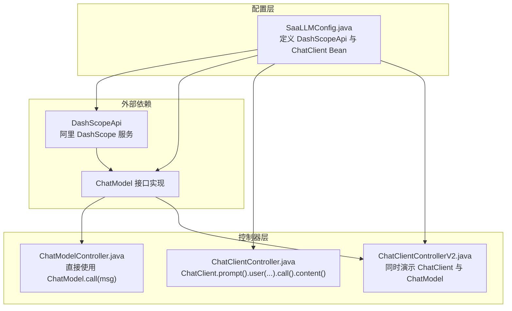
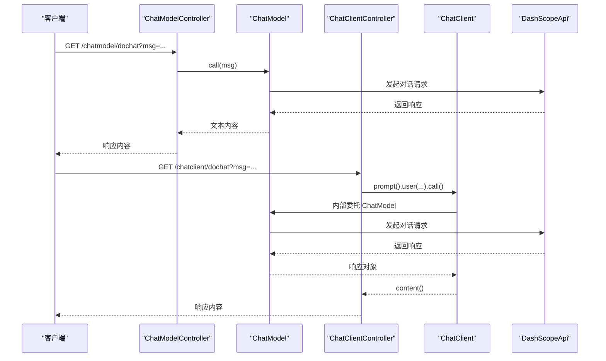
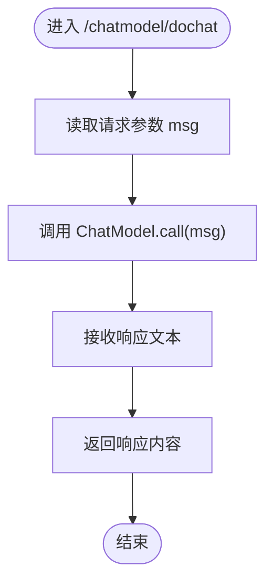
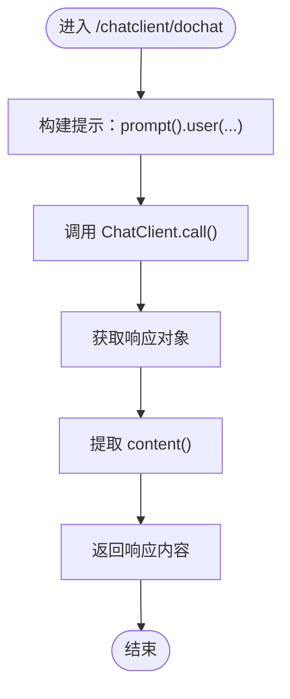
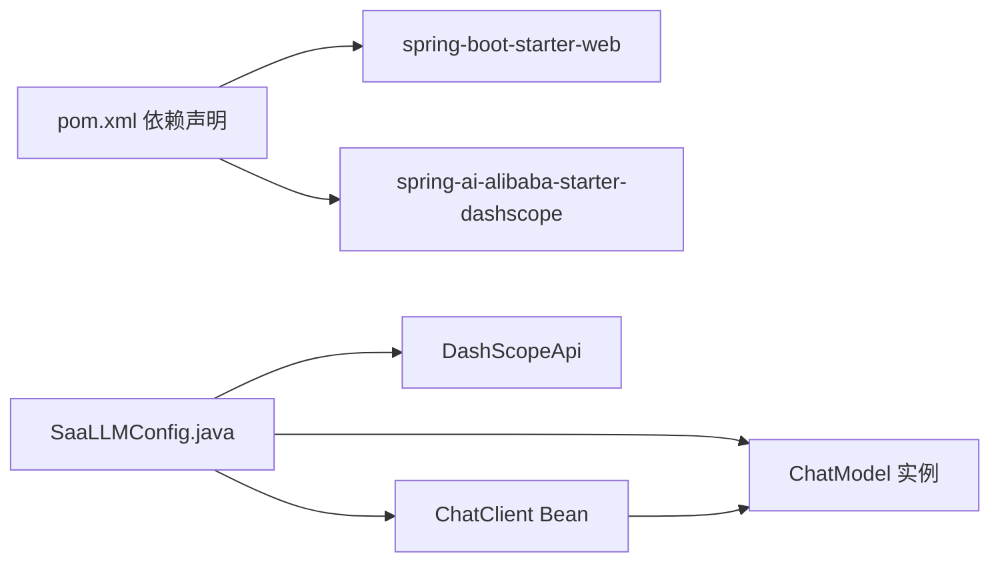

# ChatModel对比分析

<cite>
**本文引用的文件**
- [SaaLLMConfig.java](file://【1】SpringAIAlibaba-atguiguV1/SAA-03ChatModelChatClient/src/main/java/com/atguigu/study/config/SaaLLMConfig.java)
- [ChatClientController.java](file://【1】SpringAIAlibaba-atguiguV1/SAA-03ChatModelChatClient/src/main/java/com/atguigu/study/controller/ChatClientController.java)
- [ChatClientControllerV2.java](file://【1】SpringAIAlibaba-atguiguV1/SAA-03ChatModelChatClient/src/main/java/com/atguigu/study/controller/ChatClientControllerV2.java)
- [ChatModelController.java](file://【1】SpringAIAlibaba-atguiguV1/SAA-03ChatModelChatClient/src/main/java/com/atguigu/study/controller/ChatModelController.java)
- [application.properties](file://【1】SpringAIAlibaba-atguiguV1/SAA-03ChatModelChatClient/src/main/resources/application.properties)
- [pom.xml](file://【1】SpringAIAlibaba-atguiguV1/SAA-03ChatModelChatClient/pom.xml)
</cite>

## 目录
1. [引言](#引言)
2. [项目结构](#项目结构)
3. [核心组件](#核心组件)
4. [架构总览](#架构总览)
5. [详细组件分析](#详细组件分析)
6. [依赖分析](#依赖分析)
7. [性能考量](#性能考量)
8. [故障排查指南](#故障排查指南)
9. [结论](#结论)
10. [附录](#附录)

## 引言
本文件围绕 ChatClient 与 ChatModel 两种编程模式进行深入对比分析，重点涵盖：
- API 设计差异与使用复杂度
- 性能表现与资源占用
- 适用场景与最佳实践
- 底层实现机制与为何 ChatClient 能简化开发流程
- 提供可对照的代码片段路径，帮助开发者在实际项目中做出合理选择

## 项目结构
本仓库中的示例工程 SAA-03ChatModelChatClient 展示了两种模式的并行实现：
- ChatModel 模式：通过注入 ChatModel 接口直接发起对话调用
- ChatClient 模式：通过 ChatClient 构建器封装 ChatModel，提供链式提示构建与调用方式

**图表来源**
- [SaaLLMConfig.java:14-40](file://【1】SpringAIAlibaba-atguiguV1/SAA-03ChatModelChatClient/src/main/java/com/atguigu/study/config/SaaLLMConfig.java#L14-L40)
- [ChatModelController.java:15-37](file://【1】SpringAIAlibaba-atguiguV1/SAA-03ChatModelChatClient/src/main/java/com/atguigu/study/controller/ChatModelController.java#L15-L37)
- [ChatClientController.java:17-37](file://【1】SpringAIAlibaba-atguiguV1/SAA-03ChatModelChatClient/src/main/java/com/atguigu/study/controller/ChatClientController.java#L17-L37)
- [ChatClientControllerV2.java:15-50](file://【1】SpringAIAlibaba-atguiguV1/SAA-03ChatModelChatClient/src/main/java/com/atguigu/study/controller/ChatClientControllerV2.java#L15-L50)

**章节来源**
- [SaaLLMConfig.java:14-40](file://【1】SpringAIAlibaba-atguiguV1/SAA-03ChatModelChatClient/src/main/java/com/atguigu/study/config/SaaLLMConfig.java#L14-L40)
- [ChatModelController.java:15-37](file://【1】SpringAIAlibaba-atguiguV1/SAA-03ChatModelChatClient/src/main/java/com/atguigu/study/controller/ChatModelController.java#L15-L37)
- [ChatClientController.java:17-37](file://【1】SpringAIAlibaba-atguiguV1/SAA-03ChatModelChatClient/src/main/java/com/atguigu/study/controller/ChatClientController.java#L17-L37)
- [ChatClientControllerV2.java:15-50](file://【1】SpringAIAlibaba-atguiguV1/SAA-03ChatModelChatClient/src/main/java/com/atguigu/study/controller/ChatClientControllerV2.java#L15-L50)

## 核心组件
- ChatModel 接口：抽象对话模型调用能力，典型实现来自 DashScope 等供应商适配包
- ChatClient：基于 ChatModel 的高层封装，提供链式 API（prompt.user(...).call().content()），便于组合提示与流式输出等高级特性
- 配置类 SaaLLMConfig：负责构建 DashScopeApi 与 ChatClient Bean，并注入到 Spring 容器

关键要点：
- ChatModel 支持自动注入，适合直接在业务层以“模型即服务”的方式调用
- ChatClient 需要以构造器或工厂方法注入 ChatModel，再通过 builder 构建自身；适合需要统一提示构建与调用流程的场景

**章节来源**
- [SaaLLMConfig.java:14-40](file://【1】SpringAIAlibaba-atguiguV1/SAA-03ChatModelChatClient/src/main/java/com/atguigu/study/config/SaaLLMConfig.java#L14-L40)
- [ChatModelController.java:15-37](file://【1】SpringAIAlibaba-atguiguV1/SAA-03ChatModelChatClient/src/main/java/com/atguigu/study/controller/ChatModelController.java#L15-L37)
- [ChatClientController.java:17-37](file://【1】SpringAIAlibaba-atguiguV1/SAA-03ChatModelChatClient/src/main/java/com/atguigu/study/controller/ChatClientController.java#L17-L37)
- [ChatClientControllerV2.java:15-50](file://【1】SpringAIAlibaba-atguiguV1/SAA-03ChatModelChatClient/src/main/java/com/atguigu/study/controller/ChatClientControllerV2.java#L15-L50)

## 架构总览
下图展示了两种模式在运行时的交互关系与职责划分：

**图表来源**
- [ChatModelController.java:28-35](file://【1】SpringAIAlibaba-atguiguV1/SAA-03ChatModelChatClient/src/main/java/com/atguigu/study/controller/ChatModelController.java#L28-L35)
- [ChatClientController.java:31-35](file://【1】SpringAIAlibaba-atguiguV1/SAA-03ChatModelChatClient/src/main/java/com/atguigu/study/controller/ChatClientController.java#L31-L35)
- [SaaLLMConfig.java:35-39](file://【1】SpringAIAlibaba-atguiguV1/SAA-03ChatModelChatClient/src/main/java/com/atguigu/study/config/SaaLLMConfig.java#L35-L39)

## 详细组件分析

### ChatModel 模式
- 特点
  - 直接调用：通过 ChatModel.call(msg) 即可完成一次对话
  - 自动注入：控制器可直接注入 ChatModel 实例，无需额外装配
  - 低耦合：面向接口编程，易于替换不同供应商实现
- 适用场景
  - 快速原型与简单对话
  - 对提示构建无强需求的纯文本问答
  - 需要最小化样板代码的场景

**图表来源**
- [ChatModelController.java:28-35](file://【1】SpringAIAlibaba-atguiguV1/SAA-03ChatModelChatClient/src/main/java/com/atguigu/study/controller/ChatModelController.java#L28-L35)

**章节来源**
- [ChatModelController.java:15-37](file://【1】SpringAIAlibaba-atguiguV1/SAA-03ChatModelChatClient/src/main/java/com/atguigu/study/controller/ChatModelController.java#L15-L37)

### ChatClient 模式
- 特点
  - 链式 API：prompt().user(...).call().content() 更贴近“提示构建 + 调用”的自然表达
  - 统一入口：ChatClient 作为统一入口，便于扩展流式输出、工具调用、内存管理等功能
  - 依赖 ChatModel：需要先注入 ChatModel，再通过 builder 构建 ChatClient
- 适用场景
  - 需要复杂提示模板与多轮对话的场景
  - 需要流式输出、分片聚合等高级能力
  - 团队协作中希望统一提示构建规范

**图表来源**
- [ChatClientController.java:31-35](file://【1】SpringAIAlibaba-atguiguV1/SAA-03ChatModelChatClient/src/main/java/com/atguigu/study/controller/ChatClientController.java#L31-L35)

**章节来源**
- [ChatClientController.java:17-37](file://【1】SpringAIAlibaba-atguiguV1/SAA-03ChatModelChatClient/src/main/java/com/atguigu/study/controller/ChatClientController.java#L17-L37)

### 两种模式的对比与选择
- API 设计
  - ChatModel：简洁直接，适合一次性问答
  - ChatClient：链式构建，适合多步提示与复杂流程
- 使用复杂度
  - ChatModel：零样板，上手最快
  - ChatClient：需理解提示构建与调用链，但长期收益更高
- 依赖与装配
  - ChatModel：可直接注入
  - ChatClient：需以 ChatModel 为依赖进行装配

**章节来源**
- [ChatClientControllerV2.java:15-50](file://【1】SpringAIAlibaba-atguiguV1/SAA-03ChatModelChatClient/src/main/java/com/atguigu/study/controller/ChatClientControllerV2.java#L15-L50)
- [SaaLLMConfig.java:35-39](file://【1】SpringAIAlibaba-atguiguV1/SAA-03ChatModelChatClient/src/main/java/com/atguigu/study/config/SaaLLMConfig.java#L35-L39)

## 依赖分析
- 外部依赖
  - spring-ai-alibaba-starter-dashscope：提供 DashScope API 与 ChatModel 实现
  - spring-boot-starter-web：提供 Web 控制器能力
- 内部依赖
  - ChatClient 依赖 ChatModel；ChatModel 由 DashScopeApi 驱动

**图表来源**
- [pom.xml:21-48](file://【1】SpringAIAlibaba-atguiguV1/SAA-03ChatModelChatClient/pom.xml#L21-L48)
- [SaaLLMConfig.java:14-40](file://【1】SpringAIAlibaba-atguiguV1/SAA-03ChatModelChatClient/src/main/java/com/atguigu/study/config/SaaLLMConfig.java#L14-L40)

**章节来源**
- [pom.xml:21-48](file://【1】SpringAIAlibaba-atguiguV1/SAA-03ChatModelChatClient/pom.xml#L21-L48)
- [SaaLLMConfig.java:14-40](file://【1】SpringAIAlibaba-atguiguV1/SAA-03ChatModelChatClient/src/main/java/com/atguigu/study/config/SaaLLMConfig.java#L14-L40)

## 性能考量
- 调用路径
  - ChatModel：直接调用，调用栈最短，延迟最低
  - ChatClient：内部委托 ChatModel，存在一层封装开销，但通常可忽略
- 资源占用
  - ChatModel：仅持有 ChatModel 实例，内存占用更低
  - ChatClient：额外持有 ChatClient 实例与可能的提示构建缓存，内存略增
- 扩展成本
  - ChatClient 在需要流式输出、工具调用、多轮对话时具备更好的扩展性，避免重复造轮子

[本节为通用性能讨论，不直接分析具体文件]

## 故障排查指南
- 端口与编码
  - 确认 server.port 与字符集设置符合预期
- 配置项
  - 确认 spring.ai.dashscope.api-key 正确且可用
- 注入问题
  - ChatModel 可直接注入；ChatClient 需确保 ChatModel Bean 已正确装配后再构建

**章节来源**
- [application.properties:1-11](file://【1】SpringAIAlibaba-atguiguV1/SAA-03ChatModelChatClient/src/main/resources/application.properties#L1-L11)
- [ChatClientControllerV2.java:15-50](file://【1】SpringAIAlibaba-atguiguV1/SAA-03ChatModelChatClient/src/main/java/com/atguigu/study/controller/ChatClientControllerV2.java#L15-L50)

## 结论
- 若追求极致简洁与低延迟，优先选择 ChatModel
- 若需要统一提示构建、流式输出、多轮对话与团队协作规范，优先选择 ChatClient
- 两者在本示例中均基于相同的 DashScope 实现，可按需自由切换

[本节为总结性内容，不直接分析具体文件]

## 附录
- 代码片段路径参考
  - ChatModel 控制器：[ChatModelController.java:28-35](file://【1】SpringAIAlibaba-atguiguV1/SAA-03ChatModelChatClient/src/main/java/com/atguigu/study/controller/ChatModelController.java#L28-L35)
  - ChatClient 控制器（链式调用）：[ChatClientController.java:31-35](file://【1】SpringAIAlibaba-atguiguV1/SAA-03ChatModelChatClient/src/main/java/com/atguigu/study/controller/ChatClientController.java#L31-L35)
  - ChatClient/ChatModel 并行对比：[ChatClientControllerV2.java:28-47](file://【1】SpringAIAlibaba-atguiguV1/SAA-03ChatModelChatClient/src/main/java/com/atguigu/study/controller/ChatClientControllerV2.java#L28-L47)
  - 配置与 Bean 装配：[SaaLLMConfig.java:35-39](file://【1】SpringAIAlibaba-atguiguV1/SAA-03ChatModelChatClient/src/main/java/com/atguigu/study/config/SaaLLMConfig.java#L35-L39)
  - 外部依赖声明：[pom.xml:21-48](file://【1】SpringAIAlibaba-atguiguV1/SAA-03ChatModelChatClient/pom.xml#L21-L48)
  - 运行参数与密钥：[application.properties:1-11](file://【1】SpringAIAlibaba-atguiguV1/SAA-03ChatModelChatClient/src/main/resources/application.properties#L1-L11)