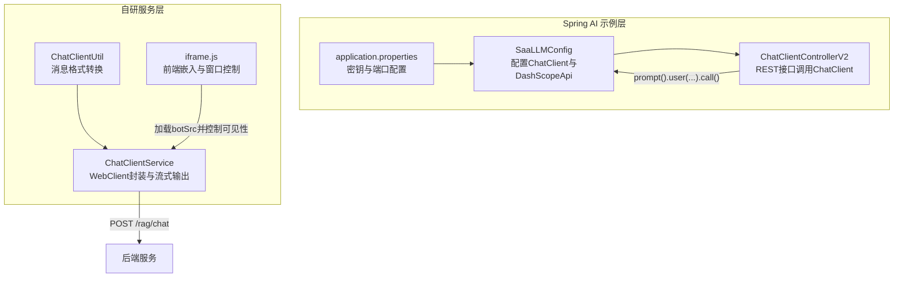
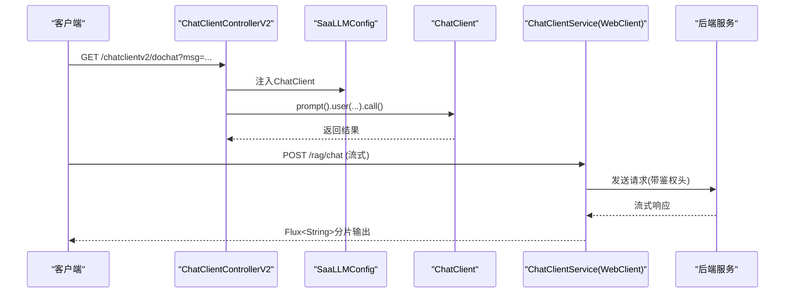
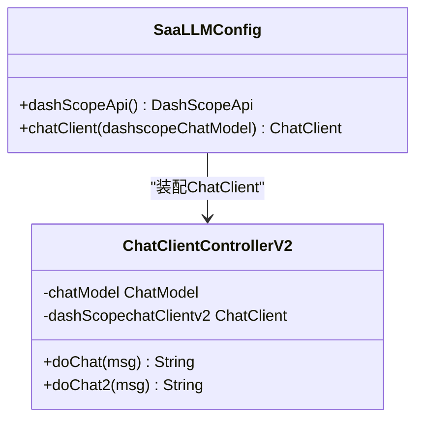
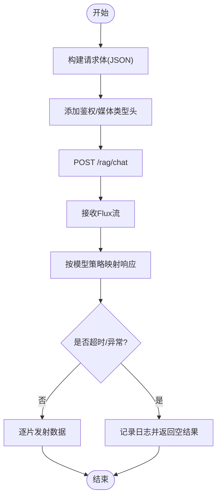
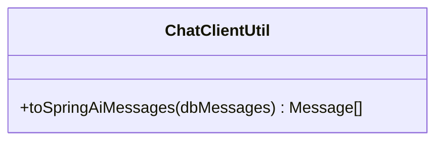
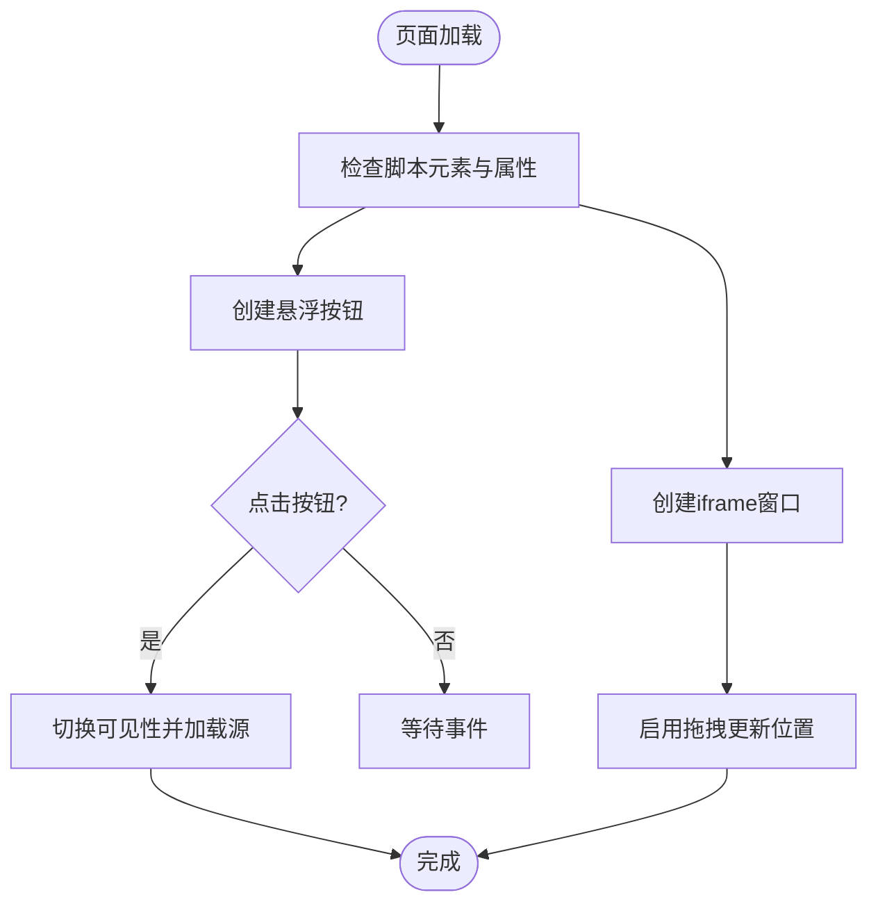
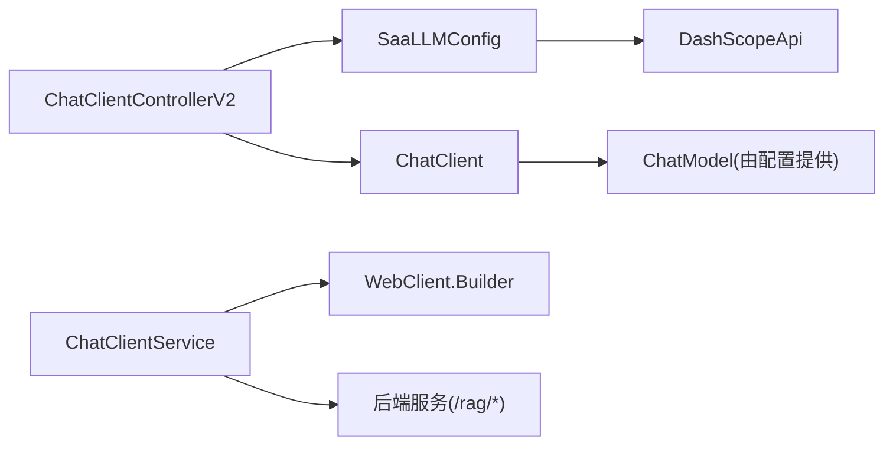

# 高级ChatClient特性

<cite>
**本文引用的文件**
- [ChatClientControllerV2.java](file://【1】SpringAIAlibaba-atguiguV1/SAA-03ChatModelChatClient/src/main/java/com/atguigu/study/controller/ChatClientControllerV2.java)
- [SaaLLMConfig.java](file://【1】SpringAIAlibaba-atguiguV1/SAA-03ChatModelChatClient/src/main/java/com/atguigu/study/config/SaaLLMConfig.java)
- [application.properties](file://【1】SpringAIAlibaba-atguiguV1/SAA-03ChatModelChatClient/src/main/resources/application.properties)
- [ChatClientService.java](file://【3】工作资料/code/仓颉智能体/nlp-agent/agent-builder/agent-build-core/src/main/java/com/yundingtech/agent/build/modules/chatapplication/service/impl/ChatClientService.java)
- [ChatClientUtil.java](file://【3】工作资料/code/仓颉智能体/nlp-agent/agent-common/agent-model-adapter/src/main/java/com/yundingtech/agent/sdk/common/util/ChatClientUtil.java)
- [iframe.js](file://【3】工作资料/code/仓颉智能体/nlp-frontend-web/public/iframe.js)
</cite>

## 目录
1. [引言](#引言)
2. [项目结构](#项目结构)
3. [核心组件](#核心组件)
4. [架构总览](#架构总览)
5. [详细组件分析](#详细组件分析)
6. [依赖分析](#依赖分析)
7. [性能考虑](#性能考虑)
8. [故障排查指南](#故障排查指南)
9. [结论](#结论)
10. [附录](#附录)

## 引言
本章节聚焦于高级ChatClient特性与扩展能力，涵盖自定义配置、拦截器使用、异步处理与批量操作等主题，并结合仓库中的实际实现进行深入解析。同时，我们将对比Spring AI的ChatClient与基于WebClient的自研ChatClient服务，展示不同场景下的最佳实践与性能调优策略。

## 项目结构
本仓库中与ChatClient相关的实现分布在两个层面：
- Spring AI示例层：通过注解注入ChatClient与ChatModel，演示基础与进阶调用方式。
- 自研WebClient服务层：封装RAG与文件对话接口，提供异步流式输出、超时与错误处理等高级特性。

**图表来源**
- [SaaLLMConfig.java:15-40](file://【1】SpringAIAlibaba-atguiguV1/SAA-03ChatModelChatClient/src/main/java/com/atguigu/study/config/SaaLLMConfig.java#L15-L40)
- [ChatClientControllerV2.java:16-49](file://【1】SpringAIAlibaba-atguiguV1/SAA-03ChatModelChatClient/src/main/java/com/atguigu/study/controller/ChatClientControllerV2.java#L16-L49)
- [application.properties:1-11](file://【1】SpringAIAlibaba-atguiguV1/SAA-03ChatModelChatClient/src/main/resources/application.properties#L1-L11)
- [ChatClientService.java:35-225](file://【3】工作资料/code/仓颉智能体/nlp-agent/agent-builder/agent-build-core/src/main/java/com/yundingtech/agent/build/modules/chatapplication/service/impl/ChatClientService.java#L35-L225)
- [ChatClientUtil.java:14-36](file://【3】工作资料/code/仓颉智能体/nlp-agent/agent-common/agent-model-adapter/src/main/java/com/yundingtech/agent/sdk/common/util/ChatClientUtil.java#L14-L36)
- [iframe.js:1-168](file://【3】工作资料/code/仓颉智能体/nlp-frontend-web/public/iframe.js#L1-L168)

**章节来源**
- [SaaLLMConfig.java:15-40](file://【1】SpringAIAlibaba-atguiguV1/SAA-03ChatModelChatClient/src/main/java/com/atguigu/study/config/SaaLLMConfig.java#L15-L40)
- [ChatClientControllerV2.java:16-49](file://【1】SpringAIAlibaba-atguiguV1/SAA-03ChatModelChatClient/src/main/java/com/atguigu/study/controller/ChatClientControllerV2.java#L16-L49)
- [application.properties:1-11](file://【1】SpringAIAlibaba-atguiguV1/SAA-03ChatModelChatClient/src/main/resources/application.properties#L1-L11)
- [ChatClientService.java:35-225](file://【3】工作资料/code/仓颉智能体/nlp-agent/agent-builder/agent-build-core/src/main/java/com/yundingtech/agent/build/modules/chatapplication/service/impl/ChatClientService.java#L35-L225)
- [ChatClientUtil.java:14-36](file://【3】工作资料/code/仓颉智能体/nlp-agent/agent-common/agent-model-adapter/src/main/java/com/yundingtech/agent/sdk/common/util/ChatClientUtil.java#L14-L36)
- [iframe.js:1-168](file://【3】工作资料/code/仓颉智能体/nlp-frontend-web/public/iframe.js#L1-L168)

## 核心组件
- Spring AI ChatClient与ChatModel集成：通过配置类装配ChatClient并注入到控制器，实现简洁的链式调用。
- 自研WebClient服务：封装RAG对话、文件对话、令牌获取与黑名单校验等接口，支持流式输出与超时控制。
- 消息格式转换工具：将数据库消息列表转换为Spring AI的消息对象，便于复用历史上下文。
- 前端嵌入脚本：负责在页面中动态插入聊天窗口与控制其可见性。

**章节来源**
- [SaaLLMConfig.java:15-40](file://【1】SpringAIAlibaba-atguiguV1/SAA-03ChatModelChatClient/src/main/java/com/atguigu/study/config/SaaLLMConfig.java#L15-L40)
- [ChatClientControllerV2.java:16-49](file://【1】SpringAIAlibaba-atguiguV1/SAA-03ChatModelChatClient/src/main/java/com/atguigu/study/controller/ChatClientControllerV2.java#L16-L49)
- [ChatClientService.java:35-225](file://【3】工作资料/code/仓颉智能体/nlp-agent/agent-builder/agent-build-core/src/main/java/com/yundingtech/agent/build/modules/chatapplication/service/impl/ChatClientService.java#L35-L225)
- [ChatClientUtil.java:14-36](file://【3】工作资料/code/仓颉智能体/nlp-agent/agent-common/agent-model-adapter/src/main/java/com/yundingtech/agent/sdk/common/util/ChatClientUtil.java#L14-L36)
- [iframe.js:1-168](file://【3】工作资料/code/仓颉智能体/nlp-frontend-web/public/iframe.js#L1-L168)

## 架构总览
下图展示了从控制器到配置、再到WebClient服务的整体交互路径，以及前端嵌入脚本如何与后端服务协同工作。

**图表来源**
- [ChatClientControllerV2.java:28-34](file://【1】SpringAIAlibaba-atguiguV1/SAA-03ChatModelChatClient/src/main/java/com/atguigu/study/controller/ChatClientControllerV2.java#L28-L34)
- [SaaLLMConfig.java:35-39](file://【1】SpringAIAlibaba-atguiguV1/SAA-03ChatModelChatClient/src/main/java/com/atguigu/study/config/SaaLLMConfig.java#L35-L39)
- [ChatClientService.java:60-91](file://【3】工作资料/code/仓颉智能体/nlp-agent/agent-builder/agent-build-core/src/main/java/com/yundingtech/agent/build/modules/chatapplication/service/impl/ChatClientService.java#L60-L91)

## 详细组件分析

### Spring AI ChatClient（V2）与配置
- 配置装配：通过配置类创建DashScopeApi与ChatClient Bean，注入到控制器中。
- 控制器调用：使用链式API发起对话，简化了参数构建与调用过程。
- 最佳实践：将密钥与端口等外部化配置，避免硬编码；在控制器中仅做薄层编排。

**图表来源**
- [SaaLLMConfig.java:15-40](file://【1】SpringAIAlibaba-atguiguV1/SAA-03ChatModelChatClient/src/main/java/com/atguigu/study/config/SaaLLMConfig.java#L15-L40)
- [ChatClientControllerV2.java:16-49](file://【1】SpringAIAlibaba-atguiguV1/SAA-03ChatModelChatClient/src/main/java/com/atguigu/study/controller/ChatClientControllerV2.java#L16-L49)

**章节来源**
- [SaaLLMConfig.java:15-40](file://【1】SpringAIAlibaba-atguiguV1/SAA-03ChatModelChatClient/src/main/java/com/atguigu/study/config/SaaLLMConfig.java#L15-L40)
- [ChatClientControllerV2.java:16-49](file://【1】SpringAIAlibaba-atguiguV1/SAA-03ChatModelChatClient/src/main/java/com/atguigu/study/controller/ChatClientControllerV2.java#L16-L49)
- [application.properties:1-11](file://【1】SpringAIAlibaba-atguiguV1/SAA-03ChatModelChatClient/src/main/resources/application.properties#L1-L11)

### 自研WebClient服务（高级特性）
- 异步与流式输出：通过WebClient发送POST请求，接收Flux<String>流式响应，适合长文本或逐步生成场景。
- 超时与错误处理：对令牌与黑名单接口设置超时与异常恢复，避免阻塞与雪崩。
- 批量与多模型适配：根据对话配置动态移除特定字段并按需映射响应，支持多模型与策略切换。
- 安全与鉴权：统一添加鉴权头或API Key头，确保跨服务调用安全。

**图表来源**
- [ChatClientService.java:71-91](file://【3】工作资料/code/仓颉智能体/nlp-agent/agent-builder/agent-build-core/src/main/java/com/yundingtech/agent/build/modules/chatapplication/service/impl/ChatClientService.java#L71-L91)
- [ChatClientService.java:124-152](file://【3】工作资料/code/仓颉智能体/nlp-agent/agent-builder/agent-build-core/src/main/java/com/yundingtech/agent/build/modules/chatapplication/service/impl/ChatClientService.java#L124-L152)
- [ChatClientService.java:154-169](file://【3】工作资料/code/仓颉智能体/nlp-agent/agent-builder/agent-build-core/src/main/java/com/yundingtech/agent/build/modules/chatapplication/service/impl/ChatClientService.java#L154-L169)

**章节来源**
- [ChatClientService.java:35-225](file://【3】工作资料/code/仓颉智能体/nlp-agent/agent-builder/agent-build-core/src/main/java/com/yundingtech/agent/build/modules/chatapplication/service/impl/ChatClientService.java#L35-L225)

### 消息格式转换工具
- 功能：将数据库消息列表转换为Spring AI的Message对象，便于在对话中复用历史上下文。
- 适用场景：与ChatClient配合，实现上下文拼接与角色区分。

**图表来源**
- [ChatClientUtil.java:14-36](file://【3】工作资料/code/仓颉智能体/nlp-agent/agent-common/agent-model-adapter/src/main/java/com/yundingtech/agent/sdk/common/util/ChatClientUtil.java#L14-L36)

**章节来源**
- [ChatClientUtil.java:14-36](file://【3】工作资料/code/仓颉智能体/nlp-agent/agent-common/agent-model-adapter/src/main/java/com/yundingtech/agent/sdk/common/util/ChatClientUtil.java#L14-L36)

### 前端嵌入脚本（iframe.js）
- 动态创建悬浮按钮与聊天窗口，支持拖拽与默认展开。
- 通过属性控制图标、尺寸与默认状态，按需加载botSrc。
- 与后端服务协同，实现用户交互与窗口控制。

**图表来源**
- [iframe.js:1-168](file://【3】工作资料/code/仓颉智能体/nlp-frontend-web/public/iframe.js#L1-L168)

**章节来源**
- [iframe.js:1-168](file://【3】工作资料/code/仓颉智能体/nlp-frontend-web/public/iframe.js#L1-L168)

## 依赖分析
- 组件耦合：控制器依赖配置类提供的ChatClient；WebClient服务依赖WebClient.Builder与外部服务地址。
- 外部依赖：DashScope API（Spring AI示例）、RAG后端服务（自研WebClient服务）。
- 潜在风险：超时未配置可能导致阻塞；错误处理缺失可能引发异常扩散。

**图表来源**
- [ChatClientControllerV2.java:16-49](file://【1】SpringAIAlibaba-atguiguV1/SAA-03ChatModelChatClient/src/main/java/com/atguigu/study/controller/ChatClientControllerV2.java#L16-L49)
- [SaaLLMConfig.java:15-40](file://【1】SpringAIAlibaba-atguiguV1/SAA-03ChatModelChatClient/src/main/java/com/atguigu/study/config/SaaLLMConfig.java#L15-L40)
- [ChatClientService.java:35-57](file://【3】工作资料/code/仓颉智能体/nlp-agent/agent-builder/agent-build-core/src/main/java/com/yundingtech/agent/build/modules/chatapplication/service/impl/ChatClientService.java#L35-L57)

**章节来源**
- [ChatClientControllerV2.java:16-49](file://【1】SpringAIAlibaba-atguiguV1/SAA-03ChatModelChatClient/src/main/java/com/atguigu/study/controller/ChatClientControllerV2.java#L16-L49)
- [SaaLLMConfig.java:15-40](file://【1】SpringAIAlibaba-atguiguV1/SAA-03ChatModelChatClient/src/main/java/com/atguigu/study/config/SaaLLMConfig.java#L15-L40)
- [ChatClientService.java:35-57](file://【3】工作资料/code/仓颉智能体/nlp-agent/agent-builder/agent-build-core/src/main/java/com/yundingtech/agent/build/modules/chatapplication/service/impl/ChatClientService.java#L35-L57)

## 性能考虑
- 超时与背压：对WebClient请求设置合理超时，避免长时间阻塞；在流式场景中注意背压与消费者速率匹配。
- 连接池与代理：根据并发量调整连接池大小；必要时配置HTTP代理以提升稳定性。
- 缓存与预热：对频繁访问的模型或配置进行缓存；在高并发前进行预热，减少首帧延迟。
- 日志与监控：对关键路径增加埋点与指标采集，定位瓶颈与异常。

[本节为通用指导，无需列出具体文件来源]

## 故障排查指南
- ChatClient调用失败：检查配置类中的API Key与模型参数是否正确；确认端口与网络连通性。
- WebClient流式输出中断：查看超时与异常恢复逻辑，确认后端服务是否稳定；检查客户端消费速率。
- 前端窗口无法显示：核对脚本属性与botSrc是否正确；检查iframe的可见性与拖拽逻辑。

**章节来源**
- [application.properties:1-11](file://【1】SpringAIAlibaba-atguiguV1/SAA-03ChatModelChatClient/src/main/resources/application.properties#L1-L11)
- [ChatClientService.java:154-169](file://【3】工作资料/code/仓颉智能体/nlp-agent/agent-builder/agent-build-core/src/main/java/com/yundingtech/agent/build/modules/chatapplication/service/impl/ChatClientService.java#L154-L169)
- [iframe.js:107-127](file://【3】工作资料/code/仓颉智能体/nlp-frontend-web/public/iframe.js#L107-L127)

## 结论
通过Spring AI的ChatClient与自研WebClient服务相结合，可以在保证易用性的同时实现高性能与可扩展的对话能力。建议在生产环境中统一配置超时、重试与限流策略，完善监控与告警，并针对不同业务场景选择合适的异步与流式输出方案。

[本节为总结性内容，无需列出具体文件来源]

## 附录
- 高级配置示例（概念性说明）
  - 超时设置：为WebClient与令牌接口分别设置超时阈值，避免阻塞。
  - 重试机制：对非幂等请求谨慎重试；对幂等请求可采用指数退避策略。
  - 并发控制：限制最大并发请求数，结合队列与熔断保护。
  - 资源管理：合理配置连接池大小与空闲回收策略，避免资源泄漏。

[本节为通用指导，无需列出具体文件来源]