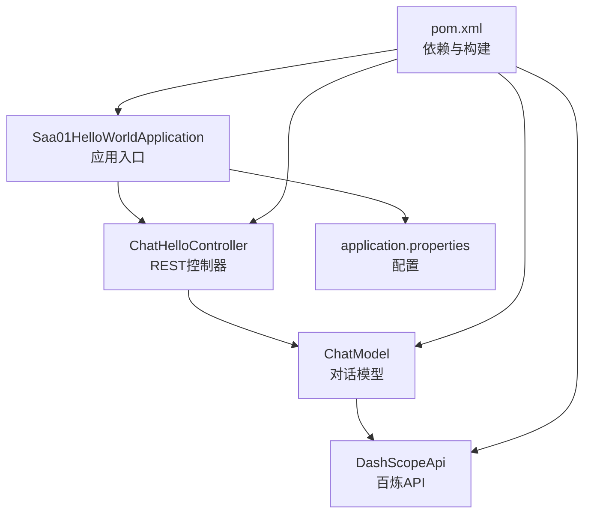
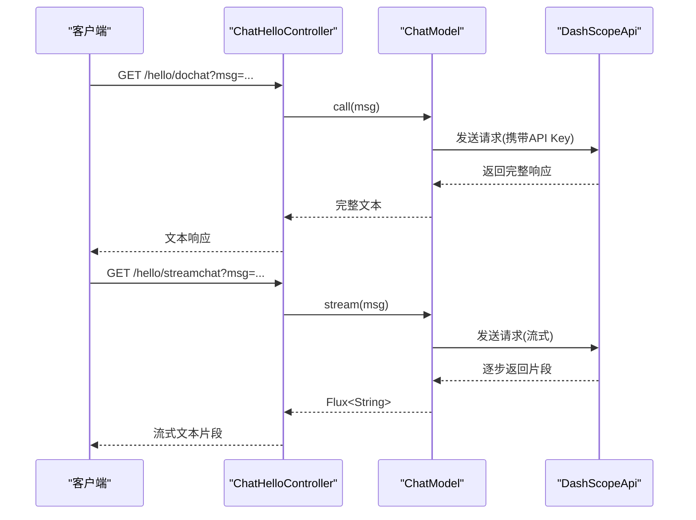
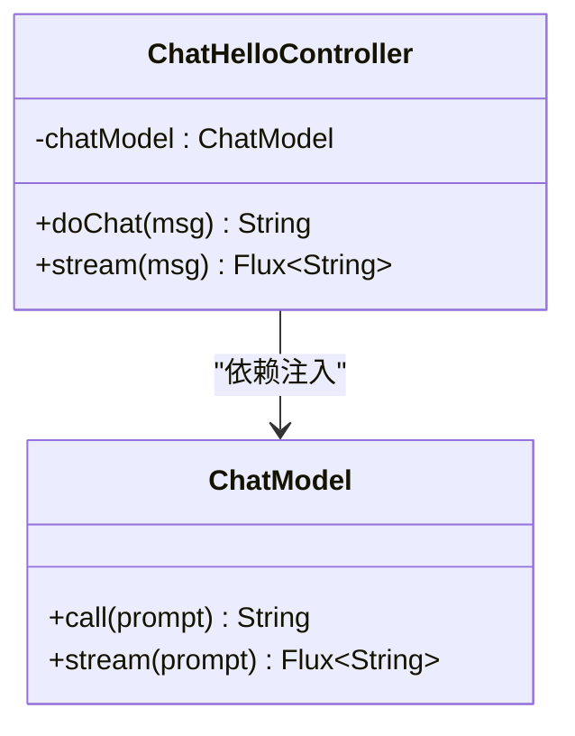
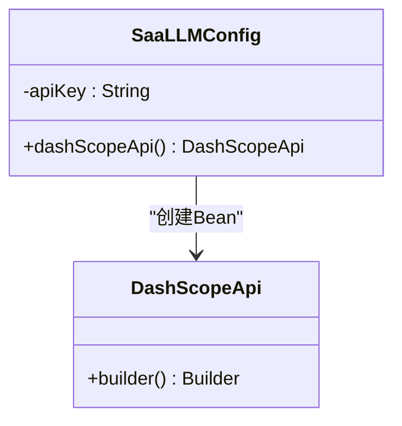
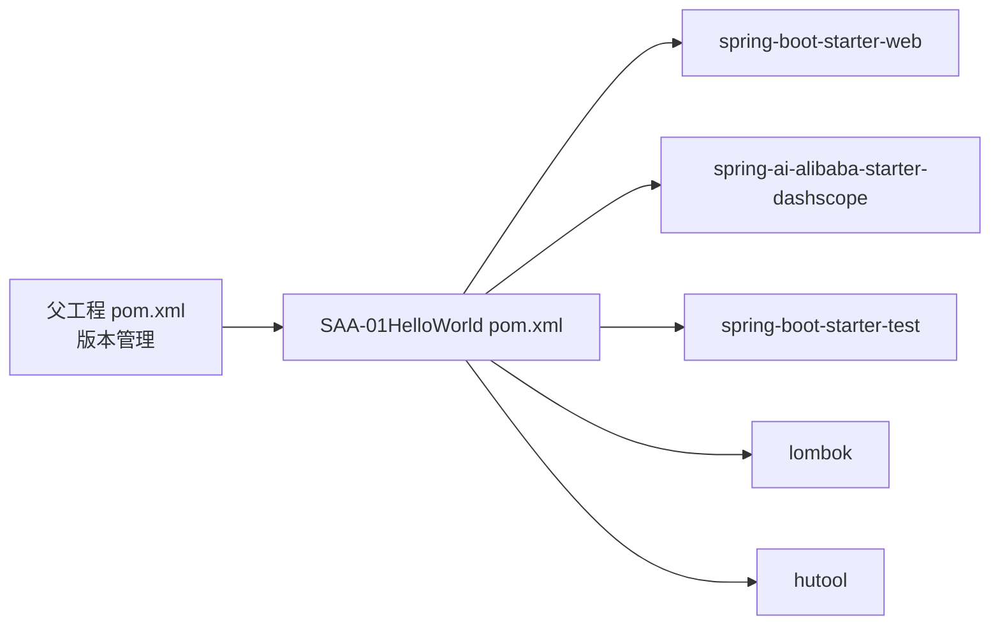

# Hello World模块

<cite>
**本文引用的文件**
- [Saa01HelloWorldApplication.java](file://【1】SpringAIAlibaba-atguiguV1/SAA-01HelloWorld/src/main/java/com/atguigu/study/Saa01HelloWorldApplication.java)
- [ChatHelloController.java](file://【1】SpringAIAlibaba-atguiguV1/SAA-01HelloWorld/src/main/java/com/atguigu/study/controller/ChatHelloController.java)
- [SaaLLMConfig.java](file://【1】SpringAIAlibaba-atguiguV1/SAA-01HelloWorld/src/main/java/com/atguigu/study/config/SaaLLMConfig.java)
- [application.properties](file://【1】SpringAIAlibaba-atguiguV1/SAA-01HelloWorld/src/main/resources/application.properties)
- [pom.xml](file://【1】SpringAIAlibaba-atguiguV1/SAA-01HelloWorld/pom.xml)
- [Saa01HelloWorldApplicationTests.java](file://【1】SpringAIAlibaba-atguiguV1/SAA-01HelloWorld/src/test/java/com/atguigu/study/Saa01HelloWorldApplicationTests.java)
- [SpringAIAlibaba-完整学习总结笔记.md](file://3、SpringAIAlibaba-完整学习总结笔记.md)
- [SpringAIAlibaba-atguiguV1/pom.xml](file://【1】SpringAIAlibaba-atguiguV1/pom.xml)
</cite>

## 目录
1. [引言](#引言)
2. [项目结构](#项目结构)
3. [核心组件](#核心组件)
4. [架构总览](#架构总览)
5. [详细组件分析](#详细组件分析)
6. [依赖分析](#依赖分析)
7. [性能考虑](#性能考虑)
8. [故障排查指南](#故障排查指南)
9. [结论](#结论)
10. [附录](#附录)

## 引言
本指南面向初学者与实践者，系统讲解“Hello World模块”的完整实现过程，涵盖项目结构、配置类设计、控制器实现与API接口开发。重点阐释如何通过Spring AI Alibaba生态中的ChatModel与DashScope（百炼）平台进行大语言模型的同步与流式调用，并结合依赖注入机制、配置参数与运行测试流程，帮助读者快速搭建一个可交互的REST API服务，完成第一个AI应用的落地实践。

## 项目结构
Hello World模块位于“SpringAIAlibaba-atguiguV1”工程中，采用标准Spring Boot多模块组织方式。核心文件分布如下：
- 应用入口：Saa01HelloWorldApplication.java
- 控制器：ChatHelloController.java（提供同步与流式对话接口）
- 配置类：SaaLLMConfig.java（定义DashScope API实例）
- 配置文件：application.properties（端口、编码、模型与API密钥等）
- 构建配置：pom.xml（依赖管理与插件）
- 单元测试：Saa01HelloWorldApplicationTests.java
- 学习笔记：3、SpringAIAlibaba-完整学习总结笔记.md（包含接口与问题汇总）

**图表来源**
- [Saa01HelloWorldApplication.java:1-16](file://【1】SpringAIAlibaba-atguiguV1/SAA-01HelloWorld/src/main/java/com/atguigu/study/Saa01HelloWorldApplication.java#L1-L16)
- [ChatHelloController.java:1-48](file://【1】SpringAIAlibaba-atguiguV1/SAA-01HelloWorld/src/main/java/com/atguigu/study/controller/ChatHelloController.java#L1-L48)
- [SaaLLMConfig.java:1-46](file://【1】SpringAIAlibaba-atguiguV1/SAA-01HelloWorld/src/main/java/com/atguigu/study/config/SaaLLMConfig.java#L1-L46)
- [application.properties:1-20](file://【1】SpringAIAlibaba-atguiguV1/SAA-01HelloWorld/src/main/resources/application.properties#L1-L20)
- [pom.xml:1-85](file://【1】SpringAIAlibaba-atguiguV1/SAA-01HelloWorld/pom.xml#L1-L85)

**章节来源**
- [Saa01HelloWorldApplication.java:1-16](file://【1】SpringAIAlibaba-atguiguV1/SAA-01HelloWorld/src/main/java/com/atguigu/study/Saa01HelloWorldApplication.java#L1-L16)
- [ChatHelloController.java:1-48](file://【1】SpringAIAlibaba-atguiguV1/SAA-01HelloWorld/src/main/java/com/atguigu/study/controller/ChatHelloController.java#L1-L48)
- [SaaLLMConfig.java:1-46](file://【1】SpringAIAlibaba-atguiguV1/SAA-01HelloWorld/src/main/java/com/atguigu/study/config/SaaLLMConfig.java#L1-L46)
- [application.properties:1-20](file://【1】SpringAIAlibaba-atguiguV1/SAA-01HelloWorld/src/main/resources/application.properties#L1-L20)
- [pom.xml:1-85](file://【1】SpringAIAlibaba-atguiguV1/SAA-01HelloWorld/pom.xml#L1-L85)

## 核心组件
- 应用入口与启动
  - 通过@SpringBootApplication启用自动装配，主函数启动Spring容器。
- REST控制器
  - 提供两个GET接口：同步对话与流式对话，均基于ChatModel进行调用。
- 配置类
  - 通过@Bean声明DashScopeApi实例，使用@Value从配置文件读取API密钥。
- 配置文件
  - 定义服务器端口、字符集编码、Spring AI Alibaba与OpenAI兼容配置项。
- 依赖与构建
  - 引入spring-boot-starter-web与spring-ai-alibaba-starter-dashscope，统一由父工程版本管理。

**章节来源**
- [Saa01HelloWorldApplication.java:1-16](file://【1】SpringAIAlibaba-atguiguV1/SAA-01HelloWorld/src/main/java/com/atguigu/study/Saa01HelloWorldApplication.java#L1-L16)
- [ChatHelloController.java:1-48](file://【1】SpringAIAlibaba-atguiguV1/SAA-01HelloWorld/src/main/java/com/atguigu/study/controller/ChatHelloController.java#L1-L48)
- [SaaLLMConfig.java:1-46](file://【1】SpringAIAlibaba-atguiguV1/SAA-01HelloWorld/src/main/java/com/atguigu/study/config/SaaLLMConfig.java#L1-L46)
- [application.properties:1-20](file://【1】SpringAIAlibaba-atguiguV1/SAA-01HelloWorld/src/main/resources/application.properties#L1-L20)
- [pom.xml:1-85](file://【1】SpringAIAlibaba-atguiguV1/SAA-01HelloWorld/pom.xml#L1-L85)

## 架构总览
本模块遵循“控制器-模型-适配器”的分层设计：
- 控制器层：接收HTTP请求，封装参数，调用ChatModel。
- 模型层：ChatModel抽象统一不同后端（DashScope等）。
- 适配器层：DashScopeApi负责与百炼平台通信。
- 配置层：application.properties与SaaLLMConfig提供参数与Bean。

**图表来源**
- [ChatHelloController.java:30-46](file://【1】SpringAIAlibaba-atguiguV1/SAA-01HelloWorld/src/main/java/com/atguigu/study/controller/ChatHelloController.java#L30-L46)
- [SaaLLMConfig.java:24-28](file://【1】SpringAIAlibaba-atguiguV1/SAA-01HelloWorld/src/main/java/com/atguigu/study/config/SaaLLMConfig.java#L24-L28)
- [application.properties:10-20](file://【1】SpringAIAlibaba-atguiguV1/SAA-01HelloWorld/src/main/resources/application.properties#L10-L20)

## 详细组件分析

### 应用入口与启动
- 作用：标记为Spring Boot应用，启动时加载上下文与Web容器。
- 关键点：使用@SpringBootApplication启用组件扫描与自动配置；主函数启动应用。

**章节来源**
- [Saa01HelloWorldApplication.java:7-14](file://【1】SpringAIAlibaba-atguiguV1/SAA-01HelloWorld/src/main/java/com/atguigu/study/Saa01HelloWorldApplication.java#L7-L14)

### REST控制器：ChatHelloController
- 作用：对外提供两个HTTP接口，分别支持同步与流式对话。
- 实现要点：
  - 依赖注入：通过@Resource注入ChatModel，实现对底层模型的调用。
  - 同步接口：/hello/dochat，返回完整文本。
  - 流式接口：/hello/streamchat，返回Flux<String>，实现逐字输出。
  - 参数处理：默认参数保障首次访问的友好体验。
- 错误与边界：若模型不可用或网络异常，将抛出相应异常；建议在生产环境增加异常处理与超时设置。

**图表来源**
- [ChatHelloController.java:18-47](file://【1】SpringAIAlibaba-atguiguV1/SAA-01HelloWorld/src/main/java/com/atguigu/study/controller/ChatHelloController.java#L18-L47)

**章节来源**
- [ChatHelloController.java:22-46](file://【1】SpringAIAlibaba-atguiguV1/SAA-01HelloWorld/src/main/java/com/atguigu/study/controller/ChatHelloController.java#L22-L46)

### 配置类：SaaLLMConfig
- 作用：定义DashScopeApi Bean，供ChatModel使用。
- 实现要点：
  - 通过@Value("${spring.ai.dashscope.api-key}")从配置文件读取API Key。
  - 使用DashScopeApi.builder().apiKey(...)构建API实例。
  - 提供两种读取API Key的方式：@Value与System.getenv，推荐使用@Value避免IDE环境变量继承问题。
- 依赖注入：Spring容器自动注入DashScopeApi到ChatModel。

**图表来源**
- [SaaLLMConfig.java:13-45](file://【1】SpringAIAlibaba-atguiguV1/SAA-01HelloWorld/src/main/java/com/atguigu/study/config/SaaLLMConfig.java#L13-L45)

**章节来源**
- [SaaLLMConfig.java:21-28](file://【1】SpringAIAlibaba-atguiguV1/SAA-01HelloWorld/src/main/java/com/atguigu/study/config/SaaLLMConfig.java#L21-L28)

### 配置文件：application.properties
- 作用：集中管理运行参数与模型配置。
- 关键配置：
  - server.port：服务监听端口。
  - 编码配置：确保中文显示正常。
  - Spring AI Alibaba：DashScope API Key与模型选项。
  - OpenAI兼容：可选的OpenAI模型名，便于后续迁移或对比。
- 注意事项：API Key应保密，建议通过环境变量或安全配置中心管理；在IDE中可通过VM Options或运行配置传递。

**章节来源**
- [application.properties:1-20](file://【1】SpringAIAlibaba-atguiguV1/SAA-01HelloWorld/src/main/resources/application.properties#L1-L20)

### 依赖与构建：pom.xml
- 作用：声明模块依赖与构建插件。
- 关键依赖：
  - spring-boot-starter-web：Web栈。
  - spring-ai-alibaba-starter-dashscope：DashScope适配器。
  - 测试与工具：spring-boot-starter-test、lombok、hutool。
- 版本管理：由父工程统一管理Spring Boot、Spring AI与Spring AI Alibaba版本。

**章节来源**
- [pom.xml:20-49](file://【1】SpringAIAlibaba-atguiguV1/SAA-01HelloWorld/pom.xml#L20-L49)
- [SpringAIAlibaba-atguiguV1/pom.xml:52-78](file://【1】SpringAIAlibaba-atguiguV1/pom.xml#L52-L78)

### 单元测试：Saa01HelloWorldApplicationTests
- 作用：验证应用上下文是否成功加载。
- 建议扩展：可增加对控制器接口的集成测试，覆盖同步与流式调用场景。

**章节来源**
- [Saa01HelloWorldApplicationTests.java:6-13](file://【1】SpringAIAlibaba-atguiguV1/SAA-01HelloWorld/src/test/java/com/atguigu/study/Saa01HelloWorldApplicationTests.java#L6-L13)

## 依赖分析
- 模块间关系
  - SAA-01HelloWorld为独立子模块，依赖父工程版本管理。
  - 通过starter引入DashScope适配器，实现ChatModel与百炼平台的对接。
- 外部依赖
  - Spring Boot Web：提供HTTP接口能力。
  - Spring AI Alibaba：提供DashScope适配器与ChatModel抽象。
- 潜在风险
  - API Key泄露：应避免硬编码，优先使用环境变量或配置中心。
  - 编码问题：需确保UTF-8配置生效，避免中文乱码。
  - 网络与超时：建议增加重试与超时策略，提升健壮性。

**图表来源**
- [SpringAIAlibaba-atguiguV1/pom.xml:52-78](file://【1】SpringAIAlibaba-atguiguV1/pom.xml#L52-L78)
- [pom.xml:20-49](file://【1】SpringAIAlibaba-atguiguV1/SAA-01HelloWorld/pom.xml#L20-L49)

**章节来源**
- [SpringAIAlibaba-atguiguV1/pom.xml:52-78](file://【1】SpringAIAlibaba-atguiguV1/pom.xml#L52-L78)
- [pom.xml:20-49](file://【1】SpringAIAlibaba-atguiguV1/SAA-01HelloWorld/pom.xml#L20-L49)

## 性能考虑
- 同步vs流式
  - 同步调用适合短文本、低延迟要求的场景；流式调用适合长文本、需要即时反馈的场景。
- 资源占用
  - 流式输出会持续占用网络与内存资源，建议在网关或控制器层设置合理的超时与背压策略。
- 网络与并发
  - 在高并发场景下，建议引入限流、熔断与重试机制，避免下游服务过载。
- 日志与监控
  - 记录请求耗时、错误码与响应大小，便于性能分析与问题定位。

## 故障排查指南
- API Key为空
  - 现象：报错提示API Key不可为空。
  - 原因：使用System.getenv读取环境变量但IDE未继承系统环境变量。
  - 解决：改用@Value从配置文件读取API Key。
- 中文乱码
  - 现象：响应中文显示异常。
  - 解决：确保配置文件中已开启UTF-8编码。
- 接口不可用
  - 现象：访问404或500。
  - 排查：确认应用已启动、端口正确、控制器路径无误；检查依赖是否完整。

**章节来源**
- [SpringAIAlibaba-完整学习总结笔记.md:2032-2056](file://3、SpringAIAlibaba-完整学习总结笔记.md#L2032-L2056)

## 结论
Hello World模块以最小实现展示了如何在Spring AI Alibaba生态中接入DashScope（百炼）平台，完成从REST接口到大语言模型调用的闭环。通过ChatHelloController的两个接口，读者可以快速掌握同步与流式两种调用方式；借助SaaLLMConfig与application.properties，可以灵活配置模型与认证参数。建议在此基础上逐步扩展为更复杂的对话、提示词工程与RAG应用。

## 附录

### 运行步骤
- 准备工作
  - 确保已安装JDK 21与Maven。
  - 准备DashScope API Key（可在百炼平台申请）。
- 配置API Key
  - 在application.properties中填写spring.ai.dashscope.api-key。
- 启动应用
  - 在模块根目录执行Maven命令启动应用。
- 访问接口
  - 同步对话：GET http://localhost:8001/hello/dochat?msg=...
  - 流式对话：GET http://localhost:8001/hello/streamchat?msg=...

**章节来源**
- [application.properties:10-20](file://【1】SpringAIAlibaba-atguiguV1/SAA-01HelloWorld/src/main/resources/application.properties#L10-L20)
- [SpringAIAlibaba-完整学习总结笔记.md:1996-1998](file://3、SpringAIAlibaba-完整学习总结笔记.md#L1996-L1998)

### 测试方法
- 单元测试
  - 运行Saa01HelloWorldApplicationTests验证上下文加载。
- 接口测试
  - 使用浏览器或curl访问上述两个接口，观察响应是否正常。
  - 对流式接口，建议使用支持SSE的客户端或浏览器开发者工具观察数据流。

**章节来源**
- [Saa01HelloWorldApplicationTests.java:10-13](file://【1】SpringAIAlibaba-atguiguV1/SAA-01HelloWorld/src/test/java/com/atguigu/study/Saa01HelloWorldApplicationTests.java#L10-L13)
- [SpringAIAlibaba-完整学习总结笔记.md:110-123](file://3、SpringAIAlibaba-完整学习总结笔记.md#L110-L123)

### 常见问题与解决方案
- API Key为null
  - 使用@Value从配置文件读取，避免System.getenv导致的IDE环境变量缺失。
- 中文乱码
  - 确认UTF-8编码配置已启用。
- 端口冲突
  - 修改server.port为其他可用端口。

**章节来源**
- [SpringAIAlibaba-完整学习总结笔记.md:2032-2056](file://3、SpringAIAlibaba-完整学习总结笔记.md#L2032-L2056)