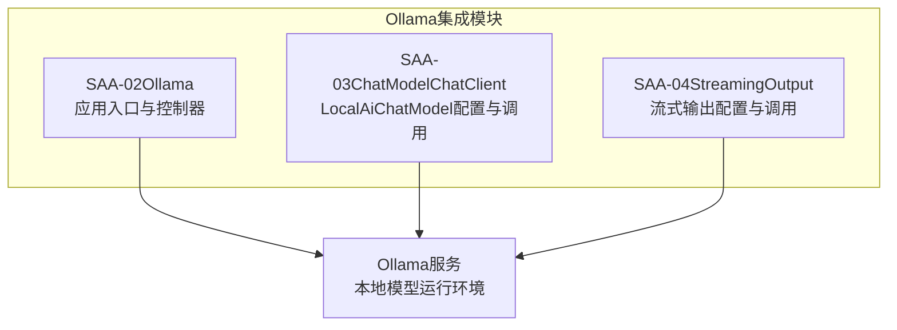
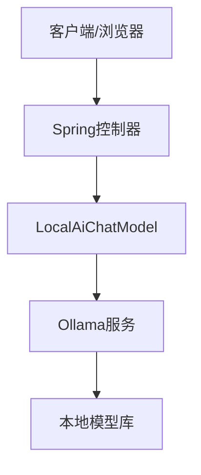
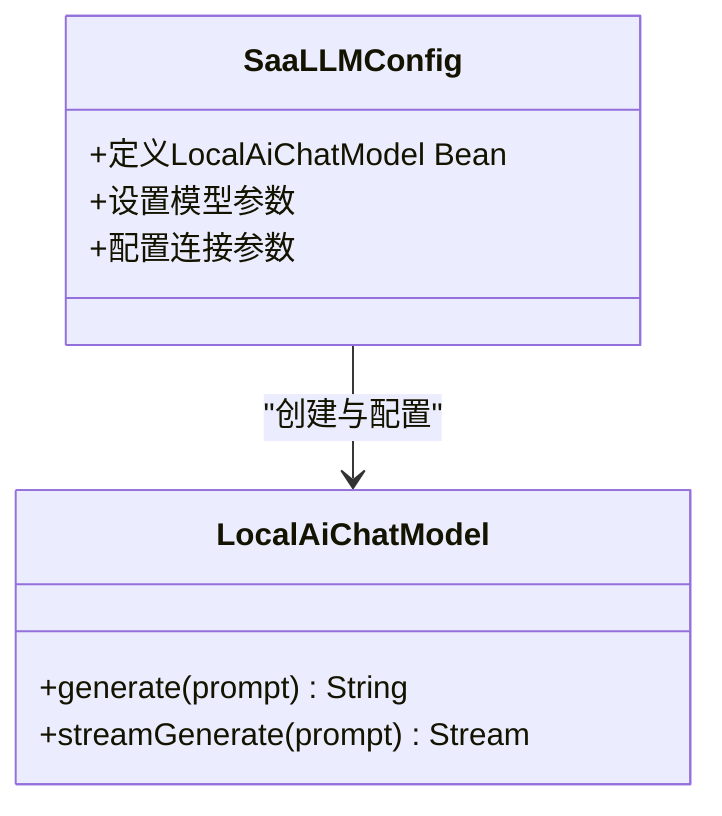
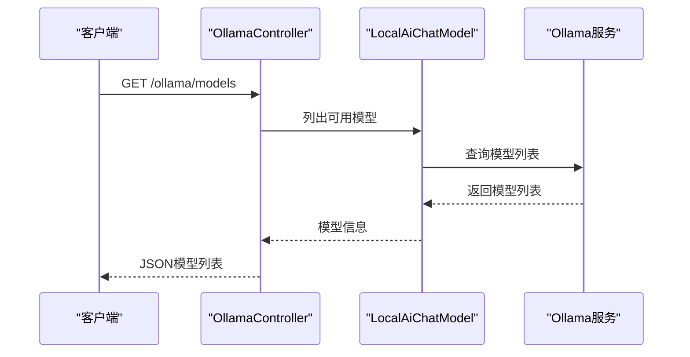
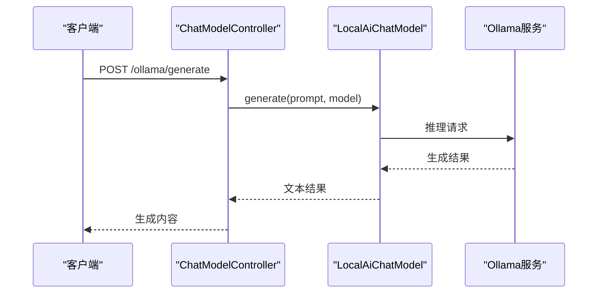
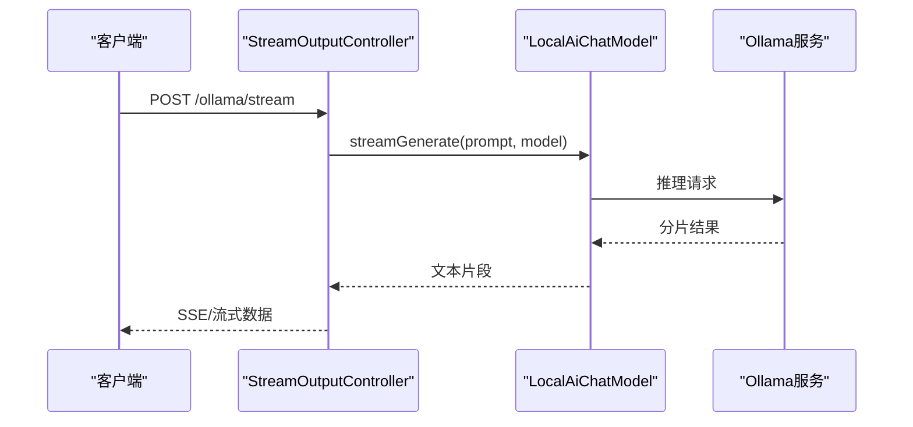
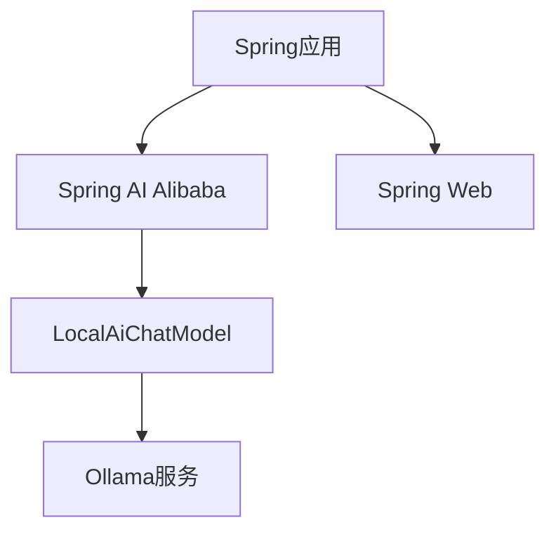

# Ollama本地模型集成

<cite>
**本文引用的文件**
- [SAA-02OllamaApplication.java](file://【1】SpringAIAlibaba-atguiguV1/SAA-02Ollama/src/main/java/com/atguigu/study/Saa02OllamaApplication.java)
- [OllamaController.java](file://【1】SpringAIAlibaba-atguiguV1/SAA-02Ollama/src/main/java/com/atguigu/study/controller/OllamaController.java)
- [application.properties](file://【1】SpringAIAlibaba-atguiguV1/SAA-02Ollama/src/main/resources/application.properties)
- [pom.xml](file://【1】SpringAIAlibaba-atguiguV1/SAA-02Ollama/pom.xml)
- [SaaLLMConfig.java](file://【1】SpringAIAlibaba-atguiguV1/SAA-03ChatModelChatClient/src/main/java/com/atguigu/study/config/SaaLLMConfig.java)
- [ChatModelController.java](file://【1】SpringAIAlibaba-atguiguV1/SAA-03ChatModelChatClient/src/main/java/com/atguigu/study/controller/ChatModelController.java)
- [ChatClientController.java](file://【1】SpringAIAlibaba-atguiguV1/SAA-03ChatModelChatClient/src/main/java/com/atguigu/study/controller/ChatClientController.java)
- [application.properties](file://【1】SpringAIAlibaba-atguiguV1/SAA-03ChatModelChatClient/src/main/resources/application.properties)
- [SaaLLMConfig.java](file://【1】SpringAIAlibaba-atguiguV1/SAA-04StreamingOutput/src/main/java/com/atguigu/study/config/SaaLLMConfig.java)
- [StreamOutputController.java](file://【1】SpringAIAlibaba-atguiguV1/SAA-04StreamingOutput/src/main/java/com/atguigu/study/controller/StreamOutputController.java)
- [application.properties](file://【1】SpringAIAlibaba-atguiguV1/SAA-04StreamingOutput/src/main/resources/application.properties)
</cite>

## 目录
1. [引言](#引言)
2. [项目结构](#项目结构)
3. [核心组件](#核心组件)
4. [架构总览](#架构总览)
5. [详细组件分析](#详细组件分析)
6. [依赖分析](#依赖分析)
7. [性能考虑](#性能考虑)
8. [故障排除指南](#故障排除指南)
9. [结论](#结论)
10. [附录](#附录)

## 引言
本技术文档面向在Spring AI Alibaba框架中集成Ollama本地大语言模型（如Llama系列）的开发者，系统性阐述从Ollama服务安装配置、模型下载与启动，到在Spring应用中通过LocalAiChatModel进行模型调用、参数配置与性能优化的完整流程。文档同时提供模型列表查询、文本生成与流式输出的API调用示例，并对本地模型与云端模型在性能与使用场景上的差异进行对比分析，帮助读者在不同业务需求下做出合理选择。

## 项目结构
本仓库包含多个Spring AI Alibaba示例模块，其中与Ollama集成直接相关的核心模块为：
- SAA-02Ollama：Ollama基础集成示例，包含应用入口与控制器，演示如何通过Spring配置访问本地Ollama服务。
- SAA-03ChatModelChatClient：展示如何在Spring中配置LocalAiChatModel并进行文本生成调用。
- SAA-04StreamingOutput：展示如何启用并消费流式输出，提升用户体验与响应速度。

**图表来源**
- [SAA-02OllamaApplication.java:1-200](file://【1】SpringAIAlibaba-atguiguV1/SAA-02Ollama/src/main/java/com/atguigu/study/Saa02OllamaApplication.java#L1-L200)
- [OllamaController.java:1-200](file://【1】SpringAIAlibaba-atguiguV1/SAA-02Ollama/src/main/java/com/atguigu/study/controller/OllamaController.java#L1-L200)
- [SaaLLMConfig.java:1-200](file://【1】SpringAIAlibaba-atguiguV1/SAA-03ChatModelChatClient/src/main/java/com/atguigu/study/config/SaaLLMConfig.java#L1-L200)
- [ChatModelController.java:1-200](file://【1】SpringAIAlibaba-atguiguV1/SAA-03ChatModelChatClient/src/main/java/com/atguigu/study/controller/ChatModelController.java#L1-L200)
- [SaaLLMConfig.java:1-200](file://【1】SpringAIAlibaba-atguiguV1/SAA-04StreamingOutput/src/main/java/com/atguigu/study/config/SaaLLMConfig.java#L1-L200)
- [StreamOutputController.java:1-200](file://【1】SpringAIAlibaba-atguiguV1/SAA-04StreamingOutput/src/main/java/com/atguigu/study/controller/StreamOutputController.java#L1-L200)

**章节来源**
- [SAA-02OllamaApplication.java:1-200](file://【1】SpringAIAlibaba-atguiguV1/SAA-02Ollama/src/main/java/com/atguigu/study/Saa02OllamaApplication.java#L1-L200)
- [OllamaController.java:1-200](file://【1】SpringAIAlibaba-atguiguV1/SAA-02Ollama/src/main/java/com/atguigu/study/controller/OllamaController.java#L1-L200)
- [SaaLLMConfig.java:1-200](file://【1】SpringAIAlibaba-atguiguV1/SAA-03ChatModelChatClient/src/main/java/com/atguigu/study/config/SaaLLMConfig.java#L1-L200)
- [ChatModelController.java:1-200](file://【1】SpringAIAlibaba-atguiguV1/SAA-03ChatModelChatClient/src/main/java/com/atguigu/study/controller/ChatModelController.java#L1-L200)
- [SaaLLMConfig.java:1-200](file://【1】SpringAIAlibaba-atguiguV1/SAA-04StreamingOutput/src/main/java/com/atguigu/study/config/SaaLLMConfig.java#L1-L200)
- [StreamOutputController.java:1-200](file://【1】SpringAIAlibaba-atguiguV1/SAA-04StreamingOutput/src/main/java/com/atguigu/study/controller/StreamOutputController.java#L1-L200)

## 核心组件
- Ollama服务：作为本地推理引擎，提供模型列表查询、文本生成与流式输出能力。需确保Ollama服务已正确安装并启动，且可被Spring应用访问。
- LocalAiChatModel：Spring AI Alibaba提供的本地模型适配器，负责将Spring AI的统一接口映射到Ollama服务，实现模型调用与参数传递。
- 控制器层：封装HTTP接口，接收用户请求，调用LocalAiChatModel执行推理，并返回结果或流式数据。
- 配置层：定义LocalAiChatModel的Bean、连接参数与超时设置，确保与Ollama服务的稳定通信。

**章节来源**
- [SAA-02OllamaApplication.java:1-200](file://【1】SpringAIAlibaba-atguiguV1/SAA-02Ollama/src/main/java/com/atguigu/study/Saa02OllamaApplication.java#L1-L200)
- [SaaLLMConfig.java:1-200](file://【1】SpringAIAlibaba-atguiguV1/SAA-03ChatModelChatClient/src/main/java/com/atguigu/study/config/SaaLLMConfig.java#L1-L200)
- [SaaLLMConfig.java:1-200](file://【1】SpringAIAlibaba-atguiguV1/SAA-04StreamingOutput/src/main/java/com/atguigu/study/config/SaaLLMConfig.java#L1-L200)

## 架构总览
下图展示了Spring应用与Ollama服务之间的交互关系，以及LocalAiChatModel在其中的作用。

**图表来源**
- [OllamaController.java:1-200](file://【1】SpringAIAlibaba-atguiguV1/SAA-02Ollama/src/main/java/com/atguigu/study/controller/OllamaController.java#L1-L200)
- [ChatModelController.java:1-200](file://【1】SpringAIAlibaba-atguiguV1/SAA-03ChatModelChatClient/src/main/java/com/atguigu/study/controller/ChatModelController.java#L1-L200)
- [StreamOutputController.java:1-200](file://【1】SpringAIAlibaba-atguiguV1/SAA-04StreamingOutput/src/main/java/com/atguigu/study/controller/StreamOutputController.java#L1-L200)

## 详细组件分析

### Ollama服务安装与配置
- 安装与启动：请参考Ollama官方文档完成安装与启动，确保服务监听地址与端口可被Spring应用访问。
- 模型下载：通过Ollama命令行工具拉取所需模型（如Llama系列），确保模型名称与Spring配置一致。
- 网络连通性：确认Spring应用所在主机能够访问Ollama服务的网络端口，避免跨主机或容器网络问题导致连接失败。

### LocalAiChatModel使用方法与参数配置
- Bean定义：在配置类中定义LocalAiChatModel Bean，设置模型名称、温度、最大生成长度等参数。
- 连接参数：配置Base URL指向Ollama服务地址，设置超时时间以平衡响应速度与稳定性。
- 参数优化：根据业务场景调整温度、top_p、repeat_penalty等参数，以获得更佳的生成质量与稳定性。

**图表来源**
- [SaaLLMConfig.java:1-200](file://【1】SpringAIAlibaba-atguiguV1/SAA-03ChatModelChatClient/src/main/java/com/atguigu/study/config/SaaLLMConfig.java#L1-L200)
- [SaaLLMConfig.java:1-200](file://【1】SpringAIAlibaba-atguiguV1/SAA-04StreamingOutput/src/main/java/com/atguigu/study/config/SaaLLMConfig.java#L1-L200)

**章节来源**
- [SaaLLMConfig.java:1-200](file://【1】SpringAIAlibaba-atguiguV1/SAA-03ChatModelChatClient/src/main/java/com/atguigu/study/config/SaaLLMConfig.java#L1-L200)
- [SaaLLMConfig.java:1-200](file://【1】SpringAIAlibaba-atguiguV1/SAA-04StreamingOutput/src/main/java/com/atguigu/study/config/SaaLLMConfig.java#L1-L200)

### API调用示例

#### 模型列表查询
- 请求方式：GET
- 路径：/ollama/models
- 功能：调用Ollama服务获取已下载模型列表
- 返回：模型名称与版本信息

**图表来源**
- [OllamaController.java:1-200](file://【1】SpringAIAlibaba-atguiguV1/SAA-02Ollama/src/main/java/com/atguigu/study/controller/OllamaController.java#L1-L200)

**章节来源**
- [OllamaController.java:1-200](file://【1】SpringAIAlibaba-atguiguV1/SAA-02Ollama/src/main/java/com/atguigu/study/controller/OllamaController.java#L1-L200)

#### 文本生成
- 请求方式：POST
- 路径：/ollama/generate
- 请求体：包含prompt与模型名称
- 功能：调用指定模型进行文本生成
- 返回：生成的文本内容

**图表来源**
- [ChatModelController.java:1-200](file://【1】SpringAIAlibaba-atguiguV1/SAA-03ChatModelChatClient/src/main/java/com/atguigu/study/controller/ChatModelController.java#L1-L200)

**章节来源**
- [ChatModelController.java:1-200](file://【1】SpringAIAlibaba-atguiguV1/SAA-03ChatModelChatClient/src/main/java/com/atguigu/study/controller/ChatModelController.java#L1-L200)

#### 流式输出
- 请求方式：POST
- 路径：/ollama/stream
- 请求体：包含prompt与模型名称
- 功能：逐步返回生成的文本片段，提升实时体验
- 返回：事件流，逐段推送生成内容

**图表来源**
- [StreamOutputController.java:1-200](file://【1】SpringAIAlibaba-atguiguV1/SAA-04StreamingOutput/src/main/java/com/atguigu/study/controller/StreamOutputController.java#L1-L200)

**章节来源**
- [StreamOutputController.java:1-200](file://【1】SpringAIAlibaba-atguiguV1/SAA-04StreamingOutput/src/main/java/com/atguigu/study/controller/StreamOutputController.java#L1-L200)

### 性能优化策略
- 连接池与超时：合理设置连接超时与读取超时，避免长时间阻塞影响吞吐。
- 参数调优：根据业务场景调整温度、top_p、repeat_penalty等参数，平衡生成质量与速度。
- 缓存与预热：对常用模型进行预热加载，减少首次调用延迟；结合应用层缓存热点问题。
- 并发控制：限制并发请求数，防止本地资源过载；必要时引入队列与限流。
- 硬件资源：确保CPU/GPU资源充足，模型量化与显存管理得当，避免OOM与降频。

## 依赖分析
- Spring AI Alibaba：提供LocalAiChatModel与统一的AI抽象接口。
- Ollama服务：提供本地模型推理能力，支持模型列表查询与文本生成。
- Spring Web：提供HTTP接口与Web MVC能力，承载控制器层。
- Maven依赖：通过pom.xml声明相关依赖，确保编译与运行环境一致。

**图表来源**
- [pom.xml:1-200](file://【1】SpringAIAlibaba-atguiguV1/SAA-02Ollama/pom.xml#L1-L200)
- [SaaLLMConfig.java:1-200](file://【1】SpringAIAlibaba-atguiguV1/SAA-03ChatModelChatClient/src/main/java/com/atguigu/study/config/SaaLLMConfig.java#L1-L200)
- [SaaLLMConfig.java:1-200](file://【1】SpringAIAlibaba-atguiguV1/SAA-04StreamingOutput/src/main/java/com/atguigu/study/config/SaaLLMConfig.java#L1-L200)

**章节来源**
- [pom.xml:1-200](file://【1】SpringAIAlibaba-atguiguV1/SAA-02Ollama/pom.xml#L1-L200)

## 性能考虑
- 本地模型优势：无需网络传输，隐私安全可控，延迟低；适合内网部署与敏感数据处理。
- 云端模型优势：算力强大、模型丰富、易于扩展；适合高并发与复杂推理任务。
- 选择建议：对延迟敏感与数据隐私要求高的场景优先选择本地模型；对模型多样性与弹性扩展有强需求时可考虑云端模型。

## 故障排除指南
- 连接失败：检查Ollama服务是否启动、端口是否开放、防火墙策略与网络连通性。
- 模型不可用：确认模型名称与Ollama中的实际名称一致，确保模型已成功下载。
- 超时异常：适当增大超时时间，检查本地资源占用情况，避免过载导致响应缓慢。
- 参数错误：核对LocalAiChatModel的参数配置，确保与Ollama服务兼容。

**章节来源**
- [application.properties:1-200](file://【1】SpringAIAlibaba-atguiguV1/SAA-02Ollama/src/main/resources/application.properties#L1-L200)
- [application.properties:1-200](file://【1】SpringAIAlibaba-atguiguV1/SAA-03ChatModelChatClient/src/main/resources/application.properties#L1-L200)
- [application.properties:1-200](file://【1】SpringAIAlibaba-atguiguV1/SAA-04StreamingOutput/src/main/resources/application.properties#L1-L200)

## 结论
通过本技术文档，您可以在Spring AI Alibaba框架中顺利完成Ollama本地模型的集成与调用。从服务安装、模型准备到LocalAiChatModel的配置与优化，再到模型列表查询、文本生成与流式输出的完整API示例，均已在示例模块中得到体现。建议在生产环境中结合业务场景进行参数调优与资源规划，以获得最佳的性能与稳定性表现。

## 附录
- 示例模块路径与用途：
  - SAA-02Ollama：Ollama基础集成与控制器示例
  - SAA-03ChatModelChatClient：LocalAiChatModel配置与文本生成
  - SAA-04StreamingOutput：流式输出配置与调用示例
- 关键配置文件：
  - application.properties：应用与服务连接配置
  - pom.xml：项目依赖与构建配置