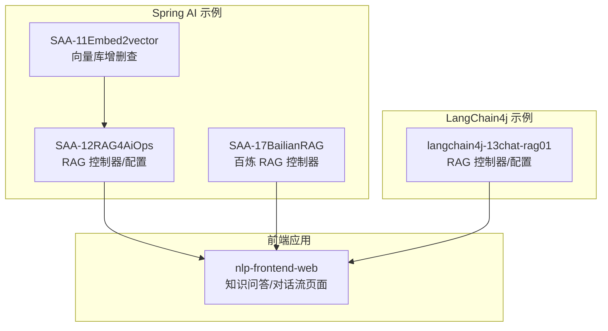
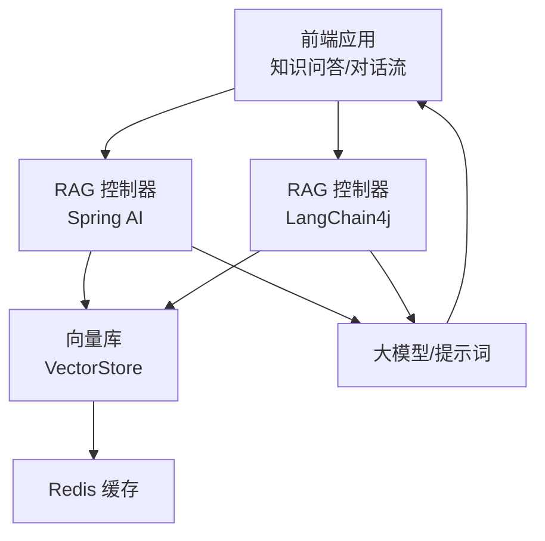
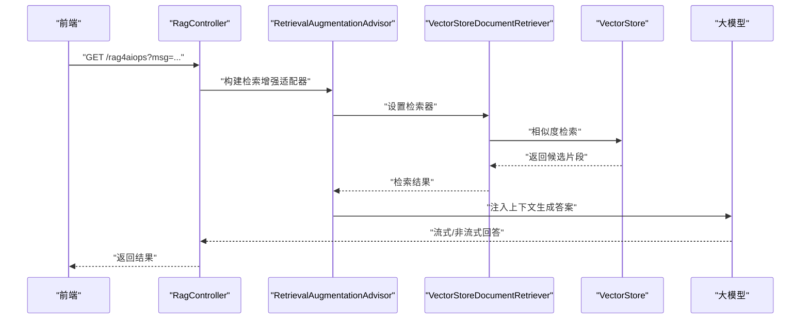
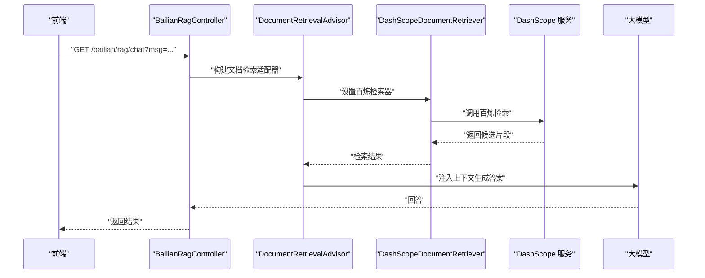
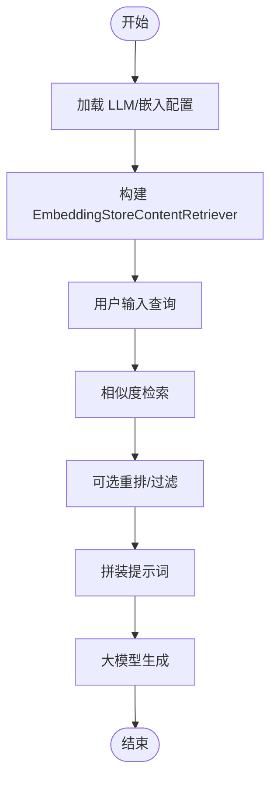
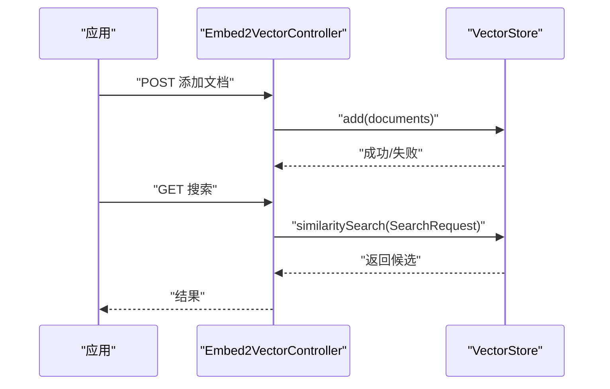
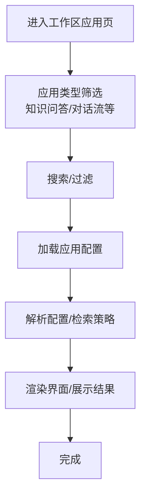
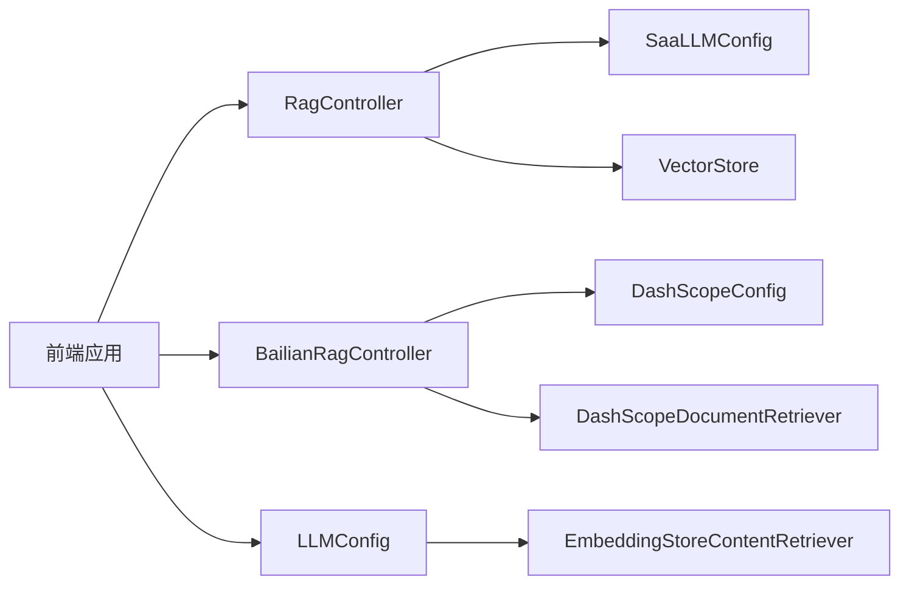

# RAG应用 (AiOps)

<cite>
**本文引用的文件**
- [Saa12Rag4AiOpsApplication.java](file://【1】SpringAIAlibaba-atguiguV1/SAA-12RAG4AiOps/src/main/java/com/atguigu/study/Saa12Rag4AiOpsApplication.java)
- [RagController.java](file://【1】SpringAIAlibaba-atguiguV1/SAA-12RAG4AiOps/src/main/java/com/atguigu/study/controller/RagController.java)
- [SaaLLMConfig.java](file://【1】SpringAIAlibaba-atguiguV1/SAA-12RAG4AiOps/src/main/java/com/atguigu/study/config/SaaLLMConfig.java)
- [InitVectorDatabaseConfig.java](file://【1】SpringAIAlibaba-atguiguV1/SAA-12RAG4AiOps/src/main/java/com/atguigu/study/config/InitVectorDatabaseConfig.java)
- [RedisConfig.java](file://【1】SpringAIAlibaba-atguiguV1/SAA-12RAG4AiOps/src/main/java/com/atguigu/study/config/RedisConfig.java)
- [application.properties](file://【1】SpringAIAlibaba-atguiguV1/SAA-12RAG4AiOps/src/main/resources/application.properties)
- [ops.txt](file://【1】SpringAIAlibaba-atguiguV1/SAA-12RAG4AiOps/src/main/resources/ops.txt)
- [BailianRagController.java](file://【1】SpringAIAlibaba-atguiguV1/SAA-17BailianRAG/src/main/java/com/atguigu/study/controller/BailianRagController.java)
- [DashScopeConfig.java](file://【1】SpringAIAlibaba-atguiguV1/SAA-17BailianRAG/src/main/java/com/atguigu/study/config/DashScopeConfig.java)
- [Embed2VectorController.java](file://【1】SpringAIAlibaba-atguiguV1/SAA-11Embed2vector/src/main/java/com/atguigu/study/controller/Embed2VectorController.java)
- [Saa11Embed2vectorApplication.java](file://【1】SpringAIAlibaba-atguiguV1/SAA-11Embed2vector/src/main/java/com/atguigu/study/Saa11Embed2vectorApplication.java)
- [ChatRAGLangChain4JApp.java](file://【2】langchain4j-atguiguV5/langchain4j-13chat-rag01/src/main/java/com/atguigu/study/ChatRAGLangChain4JApp.java)
- [RAGController.java](file://【2】langchain4j-atguiguV5/langchain4j-13chat-rag01/src/main/java/com/atguigu/study/controller/RAGController.java)
- [LLMConfig.java](file://【2】langchain4j-atguiguV5/langchain4j-13chat-rag01/src/main/java/com/atguigu/study/config/LLMConfig.java)
- [index.vue](file://【3】工作资料/code/仓颉智能体/nlp-frontend-web/src/views/workspace/pages/workApps/index.vue)
- [pages/index.vue](file://【3】工作资料/code/仓颉智能体/nlp-frontend-web/src/views/workspace/pages/workApps/pages/index.vue)
</cite>

## 目录
1. [引言](#引言)
2. [项目结构](#项目结构)
3. [核心组件](#核心组件)
4. [架构总览](#架构总览)
5. [详细组件分析](#详细组件分析)
6. [依赖分析](#依赖分析)
7. [性能考虑](#性能考虑)
8. [故障排查指南](#故障排查指南)
9. [结论](#结论)
10. [附录](#附录)

## 引言
本指南面向在 AiOps 领域落地 RAG 的工程团队，系统性阐述从文档预处理、向量索引建立、查询检索到答案生成的完整实现流程，并结合仓库中的 Spring AI 与 LangChain4j 示例，给出可直接参考的代码级实现路径。同时覆盖性能瓶颈与优化方法、部署经验、监控指标与故障排查建议，帮助读者在生产环境中稳定地交付 RAG 能力。

## 项目结构
本仓库包含三类 RAG 实现与相关配套：
- Spring AI（阿里云生态）：SAA-12RAG4AiOps 展示基于 RetrievalAugmentationAdvisor 与 VectorStore 的 RAG；SAA-17BailianRAG 展示百炼文档检索适配器；SAA-11Embed2vector 展示向量库增删查流程。
- LangChain4j：langchain4j-13chat-rag01 展示 EmbeddingStoreContentRetriever 的 RAG 实践。
- 前端应用：nlp-frontend-web 中“知识问答”等应用页面，体现 RAG 在业务侧的入口与配置项。

**图表来源**
- [Saa12Rag4AiOpsApplication.java:1-20](file://【1】SpringAIAlibaba-atguiguV1/SAA-12RAG4AiOps/src/main/java/com/atguigu/study/Saa12Rag4AiOpsApplication.java#L1-L20)
- [BailianRagController.java:1-60](file://【1】SpringAIAlibaba-atguiguV1/SAA-17BailianRAG/src/main/java/com/atguigu/study/controller/BailianRagController.java#L1-L60)
- [Embed2VectorController.java:1-120](file://【1】SpringAIAlibaba-atguiguV1/SAA-11Embed2vector/src/main/java/com/atguigu/study/controller/Embed2VectorController.java#L1-L120)
- [ChatRAGLangChain4JApp.java:1-40](file://【2】langchain4j-atguiguV5/langchain4j-13chat-rag01/src/main/java/com/atguigu/study/ChatRAGLangChain4JApp.java#L1-L40)
- [index.vue:169-177](file://【3】工作资料/code/仓颉智能体/nlp-frontend-web/src/views/workspace/pages/workApps/index.vue#L169-L177)

**章节来源**
- [Saa12Rag4AiOpsApplication.java:1-20](file://【1】SpringAIAlibaba-atguiguV1/SAA-12RAG4AiOps/src/main/java/com/atguigu/study/Saa12Rag4AiOpsApplication.java#L1-L20)
- [Saa11Embed2vectorApplication.java:1-20](file://【1】SpringAIAlibaba-atguiguV1/SAA-11Embed2vector/src/main/java/com/atguigu/study/Saa11Embed2vectorApplication.java#L1-L20)
- [ChatRAGLangChain4JApp.java:1-40](file://【2】langchain4j-atguiguV5/langchain4j-13chat-rag01/src/main/java/com/atguigu/study/ChatRAGLangChain4JApp.java#L1-L40)

## 核心组件
- RAG 控制器与检索增强适配器：通过 RetrievalAugmentationAdvisor 或 DocumentRetrievalAdvisor 将检索结果注入提示词，驱动大模型生成。
- 向量存储与检索器：使用 VectorStore 与 VectorStoreDocumentRetriever 或 EmbeddingStoreContentRetriever 进行相似度检索。
- 配置层：LLM 参数、向量库初始化、Redis 缓存等。
- 数据源：示例中使用本地文本文件作为知识源，实际可扩展为多模态与结构化数据。
- 前端入口：知识问答、对话流等页面承载 RAG 应用的交互与配置。

**章节来源**
- [RagController.java:30-60](file://【1】SpringAIAlibaba-atguiguV1/SAA-12RAG4AiOps/src/main/java/com/atguigu/study/controller/RagController.java#L30-L60)
- [BailianRagController.java:30-60](file://【1】SpringAIAlibaba-atguiguV1/SAA-17BailianRAG/src/main/java/com/atguigu/study/controller/BailianRagController.java#L30-L60)
- [SaaLLMConfig.java:1-40](file://【1】SpringAIAlibaba-atguiguV1/SAA-12RAG4AiOps/src/main/java/com/atguigu/study/config/SaaLLMConfig.java#L1-L40)
- [InitVectorDatabaseConfig.java:1-80](file://【1】SpringAIAlibaba-atguiguV1/SAA-12RAG4AiOps/src/main/java/com/atguigu/study/config/InitVectorDatabaseConfig.java#L1-L80)
- [Embed2VectorController.java:50-90](file://【1】SpringAIAlibaba-atguiguV1/SAA-11Embed2vector/src/main/java/com/atguigu/study/controller/Embed2VectorController.java#L50-L90)

## 架构总览
下图展示了 AiOps 场景下的 RAG 端到端架构：前端发起查询 → 控制器构建检索增强 → 向量库检索 → 大模型生成 → 返回结果。Spring AI 与 LangChain4j 两条实现路径并行存在，均可接入 Redis 缓存与百炼等外部能力。

**图表来源**
- [RagController.java:30-60](file://【1】SpringAIAlibaba-atguiguV1/SAA-12RAG4AiOps/src/main/java/com/atguigu/study/controller/RagController.java#L30-L60)
- [RAGController.java:1-60](file://【2】langchain4j-atguiguV5/langchain4j-13chat-rag01/src/main/java/com/atguigu/study/controller/RAGController.java#L1-L60)
- [Embed2VectorController.java:50-90](file://【1】SpringAIAlibaba-atguiguV1/SAA-11Embed2vector/src/main/java/com/atguigu/study/controller/Embed2VectorController.java#L50-L90)
- [RedisConfig.java:1-60](file://【1】SpringAIAlibaba-atguiguV1/SAA-12RAG4AiOps/src/main/java/com/atguigu/study/config/RedisConfig.java#L1-L60)

## 详细组件分析

### Spring AI RAG 组件（SAA-12RAG4AiOps）
- 控制器负责接收查询，构建 RetrievalAugmentationAdvisor，注入 VectorStoreDocumentRetriever 执行检索，再由大模型生成答案。
- 配置层定义 LLM 参数与向量库初始化，支持 Redis 缓存键空间管理。
- 示例文本文件 ops.txt 作为知识源，演示向量入库与检索流程。

**图表来源**
- [RagController.java:30-60](file://【1】SpringAIAlibaba-atguiguV1/SAA-12RAG4AiOps/src/main/java/com/atguigu/study/controller/RagController.java#L30-L60)
- [SaaLLMConfig.java:1-40](file://【1】SpringAIAlibaba-atguiguV1/SAA-12RAG4AiOps/src/main/java/com/atguigu/study/config/SaaLLMConfig.java#L1-L40)
- [InitVectorDatabaseConfig.java:40-70](file://【1】SpringAIAlibaba-atguiguV1/SAA-12RAG4AiOps/src/main/java/com/atguigu/study/config/InitVectorDatabaseConfig.java#L40-L70)
- [ops.txt:1-200](file://【1】SpringAIAlibaba-atguiguV1/SAA-12RAG4AiOps/src/main/resources/ops.txt#L1-L200)

**章节来源**
- [RagController.java:30-60](file://【1】SpringAIAlibaba-atguiguV1/SAA-12RAG4AiOps/src/main/java/com/atguigu/study/controller/RagController.java#L30-L60)
- [SaaLLMConfig.java:1-40](file://【1】SpringAIAlibaba-atguiguV1/SAA-12RAG4AiOps/src/main/java/com/atguigu/study/config/SaaLLMConfig.java#L1-L40)
- [InitVectorDatabaseConfig.java:40-70](file://【1】SpringAIAlibaba-atguiguV1/SAA-12RAG4AiOps/src/main/java/com/atguigu/study/config/InitVectorDatabaseConfig.java#L40-L70)
- [application.properties:1-100](file://【1】SpringAIAlibaba-atguiguV1/SAA-12RAG4AiOps/src/main/resources/application.properties#L1-L100)
- [ops.txt:1-200](file://【1】SpringAIAlibaba-atguiguV1/SAA-12RAG4AiOps/src/main/resources/ops.txt#L1-L200)

### 百炼 RAG 组件（SAA-17BailianRAG）
- 控制器通过 DocumentRetrievalAdvisor 与 DashScopeDocumentRetriever 集成百炼检索能力，适合在阿里云生态内快速落地。
- DashScopeConfig 提供百炼服务配置入口。

**图表来源**
- [BailianRagController.java:30-60](file://【1】SpringAIAlibaba-atguiguV1/SAA-17BailianRAG/src/main/java/com/atguigu/study/controller/BailianRagController.java#L30-L60)
- [DashScopeConfig.java:1-60](file://【1】SpringAIAlibaba-atguiguV1/SAA-17BailianRAG/src/main/java/com/atguigu/study/config/DashScopeConfig.java#L1-L60)

**章节来源**
- [BailianRagController.java:30-60](file://【1】SpringAIAlibaba-atguiguV1/SAA-17BailianRAG/src/main/java/com/atguigu/study/controller/BailianRagController.java#L30-L60)
- [DashScopeConfig.java:1-60](file://【1】SpringAIAlibaba-atguiguV1/SAA-17BailianRAG/src/main/java/com/atguigu/study/config/DashScopeConfig.java#L1-L60)

### LangChain4j RAG 组件（langchain4j-13chat-rag01）
- ChatRAGLangChain4JApp 作为启动类，RAGController 展示如何使用 EmbeddingStoreContentRetriever 构建检索链路。
- LLMConfig 展示了检索器与嵌入模型的配置方式。

**图表来源**
- [ChatRAGLangChain4JApp.java:1-40](file://【2】langchain4j-atguiguV5/langchain4j-13chat-rag01/src/main/java/com/atguigu/study/ChatRAGLangChain4JApp.java#L1-L40)
- [RAGController.java:1-60](file://【2】langchain4j-atguiguV5/langchain4j-13chat-rag01/src/main/java/com/atguigu/study/controller/RAGController.java#L1-L60)
- [LLMConfig.java:1-60](file://【2】langchain4j-atguiguV5/langchain4j-13chat-rag01/src/main/java/com/atguigu/study/config/LLMConfig.java#L1-L60)

**章节来源**
- [ChatRAGLangChain4JApp.java:1-40](file://【2】langchain4j-atguiguV5/langchain4j-13chat-rag01/src/main/java/com/atguigu/study/ChatRAGLangChain4JApp.java#L1-L40)
- [RAGController.java:1-60](file://【2】langchain4j-atguiguV5/langchain4j-13chat-rag01/src/main/java/com/atguigu/study/controller/RAGController.java#L1-L60)
- [LLMConfig.java:1-60](file://【2】langchain4j-atguiguV5/langchain4j-13chat-rag01/src/main/java/com/atguigu/study/config/LLMConfig.java#L1-L60)

### 向量库集成与检索策略（SAA-11Embed2vector）
- 提供向量库的增删查示例，便于理解向量化流程与检索 API 的使用方式。
- 适合在本地或小规模场景验证检索策略与性能。

**图表来源**
- [Embed2VectorController.java:50-90](file://【1】SpringAIAlibaba-atguiguV1/SAA-11Embed2vector/src/main/java/com/atguigu/study/controller/Embed2VectorController.java#L50-L90)

**章节来源**
- [Embed2VectorController.java:50-90](file://【1】SpringAIAlibaba-atguiguV1/SAA-11Embed2vector/src/main/java/com/atguigu/study/controller/Embed2VectorController.java#L50-L90)

### 前端入口与配置（nlp-frontend-web）
- “知识问答/对话流”等页面承载 RAG 应用的入口与配置项，如检索策略、提示词、向量库信息等。
- 页面逻辑中包含应用类型筛选、历史版本切换、配置解析与布局更新等流程。

**图表来源**
- [index.vue:169-177](file://【3】工作资料/code/仓颉智能体/nlp-frontend-web/src/views/workspace/pages/workApps/index.vue#L169-L177)
- [pages/index.vue:395-422](file://【3】工作资料/code/仓颉智能体/nlp-frontend-web/src/views/workspace/pages/workApps/pages/index.vue#L395-L422)

**章节来源**
- [index.vue:169-177](file://【3】工作资料/code/仓颉智能体/nlp-frontend-web/src/views/workspace/pages/workApps/index.vue#L169-L177)
- [pages/index.vue:395-422](file://【3】工作资料/code/仓颉智能体/nlp-frontend-web/src/views/workspace/pages/workApps/pages/index.vue#L395-L422)

## 依赖分析
- 组件耦合：控制器依赖配置层与向量库；配置层依赖外部服务（如 Redis、百炼）。
- 外部依赖：Spring AI、LangChain4j、向量库实现、大模型服务。
- 潜在环依赖：示例中未见循环依赖；注意在自定义检索器与缓存策略时避免双向引用。

**图表来源**
- [RagController.java:30-60](file://【1】SpringAIAlibaba-atguiguV1/SAA-12RAG4AiOps/src/main/java/com/atguigu/study/controller/RagController.java#L30-L60)
- [SaaLLMConfig.java:1-40](file://【1】SpringAIAlibaba-atguiguV1/SAA-12RAG4AiOps/src/main/java/com/atguigu/study/config/SaaLLMConfig.java#L1-L40)
- [BailianRagController.java:30-60](file://【1】SpringAIAlibaba-atguiguV1/SAA-17BailianRAG/src/main/java/com/atguigu/study/controller/BailianRagController.java#L30-L60)
- [DashScopeConfig.java:1-60](file://【1】SpringAIAlibaba-atguiguV1/SAA-17BailianRAG/src/main/java/com/atguigu/study/config/DashScopeConfig.java#L1-L60)
- [LLMConfig.java:1-60](file://【2】langchain4j-atguiguV5/langchain4j-13chat-rag01/src/main/java/com/atguigu/study/config/LLMConfig.java#L1-L60)

**章节来源**
- [RagController.java:30-60](file://【1】SpringAIAlibaba-atguiguV1/SAA-12RAG4AiOps/src/main/java/com/atguigu/study/controller/RagController.java#L30-L60)
- [BailianRagController.java:30-60](file://【1】SpringAIAlibaba-atguiguV1/SAA-17BailianRAG/src/main/java/com/atguigu/study/controller/BailianRagController.java#L30-L60)
- [LLMConfig.java:1-60](file://【2】langchain4j-atguiguV5/langchain4j-13chat-rag01/src/main/java/com/atguigu/study/config/LLMConfig.java#L1-L60)

## 性能考虑
- 检索速度
  - 向量维度与索引算法：降低维度或采用更高效的索引（如 HNSW/IVF）可显著提升检索速度。
  - 分片与并行：对大规模向量库进行分片与并行检索，结合缓存命中率优化。
  - 前缀过滤与元数据过滤：在检索前先做粗排，减少候选集规模。
- 答案准确性
  - 提示词工程：明确角色设定与检索边界，避免幻觉；加入“不确定则拒绝”策略。
  - 重排序与融合：对多来源检索结果进行重排序与融合，提升相关性。
- 系统稳定性
  - 超时与熔断：为检索与生成设置合理超时与熔断阈值。
  - 缓存策略：利用 Redis 缓存热点问题与检索结果，降低后端压力。
  - 日志与追踪：为每次检索与生成打点，便于定位性能瓶颈与错误根因。

[本节为通用性能建议，无需特定文件引用]

## 故障排查指南
- 启动与连接
  - 检查 application.properties 中的向量库与大模型服务地址是否正确。
  - 若使用 Redis 缓存，确认连接参数与键空间命名一致。
- 检索异常
  - 确认向量维度与嵌入模型一致；检查向量库是否已成功写入。
  - 对比检索关键词与入库文本，确保分词与清洗策略一致。
- 答案质量
  - 调整提示词模板与角色设定；限制最大上下文长度以避免截断。
  - 对输出进行后处理（去重、摘要、格式化），提升可读性。
- 前端交互
  - 确认应用类型筛选与配置解析逻辑正常；检查历史版本切换是否正确加载配置。

**章节来源**
- [application.properties:1-100](file://【1】SpringAIAlibaba-atguiguV1/SAA-12RAG4AiOps/src/main/resources/application.properties#L1-L100)
- [RedisConfig.java:1-60](file://【1】SpringAIAlibaba-atguiguV1/SAA-12RAG4AiOps/src/main/java/com/atguigu/study/config/RedisConfig.java#L1-L60)
- [Embed2VectorController.java:50-90](file://【1】SpringAIAlibaba-atguiguV1/SAA-11Embed2vector/src/main/java/com/atguigu/study/controller/Embed2VectorController.java#L50-L90)

## 结论
本指南基于仓库中的 Spring AI 与 LangChain4j 示例，给出了在 AiOps 场景下实现 RAG 的完整路径：从数据准备、向量索引、检索策略到答案生成与前端入口。通过合理的性能优化与稳定性保障，可在生产环境可靠落地 RAG 能力，支撑运维知识问答、故障诊断辅助与操作指导生成等典型场景。

[本节为总结性内容，无需特定文件引用]

## 附录
- 部署建议
  - 容器化打包与编排，按需扩缩容；开启健康检查与就绪探针。
  - 配置灰度与 A/B 实验，逐步放开流量，观察指标变化。
- 监控指标
  - 检索延迟（P50/P95）、召回率、准确率、生成耗时、错误率、缓存命中率。
- 参考实现路径
  - 控制器与检索增强：[RagController.java:30-60](file://【1】SpringAIAlibaba-atguiguV1/SAA-12RAG4AiOps/src/main/java/com/atguigu/study/controller/RagController.java#L30-L60)
  - 百炼集成：[BailianRagController.java:30-60](file://【1】SpringAIAlibaba-atguiguV1/SAA-17BailianRAG/src/main/java/com/atguigu/study/controller/BailianRagController.java#L30-L60)
  - 向量库增删查：[Embed2VectorController.java:50-90](file://【1】SpringAIAlibaba-atguiguV1/SAA-11Embed2vector/src/main/java/com/atguigu/study/controller/Embed2VectorController.java#L50-L90)
  - LangChain4j RAG：[RAGController.java:1-60](file://【2】langchain4j-atguiguV5/langchain4j-13chat-rag01/src/main/java/com/atguigu/study/controller/RAGController.java#L1-L60)

[本节为补充信息，无需特定文件引用]