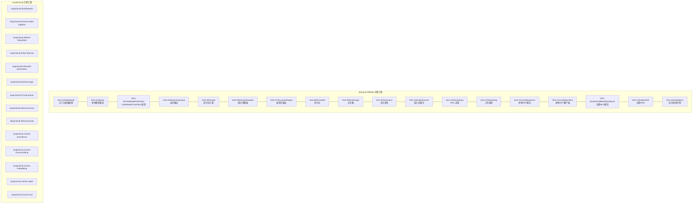
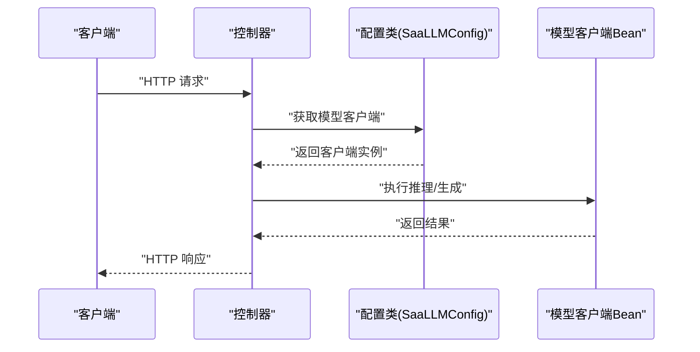
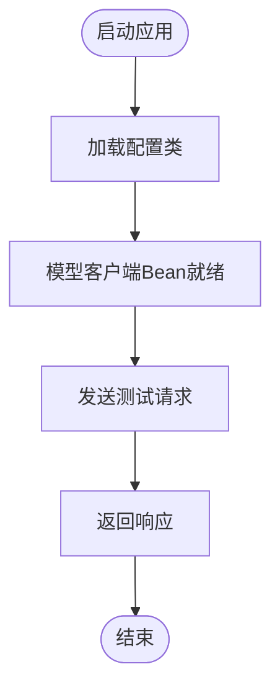
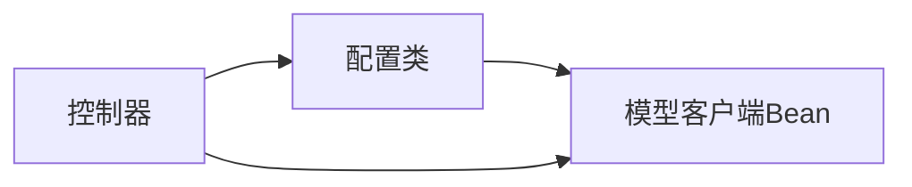

# Spring AI Alibaba框架学习

<cite>
**本文引用的文件**
- [SAA-01HelloWorld 应用入口](file://【1】SpringAIAlibaba-atguiguV1/SAA-01HelloWorld/src/main/java/com/atguigu/study/Saa01HelloWorldApplication.java)
- [SAA-01HelloWorld 配置类](file://【1】SpringAIAlibaba-atguiguV1/SAA-01HelloWorld/src/main/java/com/atguigu/study/config/SaaLLMConfig.java)
- [SAA-01HelloWorld 控制器](file://【1】SpringAIAlibaba-atguiguV1/SAA-01HelloWorld/src/main/java/com/atguigu/study/controller/ChatHelloController.java)
- [SAA-01HelloWorld 应用配置](file://【1】SpringAIAlibaba-atguiguV1/SAA-01HelloWorld/src/main/resources/application.properties)
- [SAA-02Ollama 应用入口](file://【1】SpringAIAlibaba-atguiguV1/SAA-02Ollama/src/main/java/com/atguigu/study/Saa02OllamaApplication.java)
- [SAA-02Ollama 控制器](file://【1】SpringAIAlibaba-atguiguV1/SAA-02Ollama/src/main/java/com/atguigu/study/controller/OllamaController.java)
- [SAA-02Ollama 应用配置](file://【1】SpringAIAlibaba-atguiguV1/SAA-02Ollama/src/main/resources/application.properties)
- [SAA-03ChatModelChatClient 应用入口](file://【1】SpringAIAlibaba-atguiguV1/SAA-03ChatModelChatClient/src/main/java/com/atguigu/study/Saa03ChatModelChatClientApplication.java)
- [SAA-03ChatModelChatClient 配置类](file://【1】SpringAIAlibaba-atguiguV1/SAA-03ChatModelChatClient/src/main/java/com/atguigu/study/config/SaaLLMConfig.java)
- [SAA-03ChatModelChatClient 控制器](file://【1】SpringAIAlibaba-atguiguV1/SAA-03ChatModelChatClient/src/main/java/com/atguigu/study/controller/ChatModelController.java)
- [SAA-03ChatModelChatClient 控制器V2](file://【1】SpringAIAlibaba-atguiguV1/SAA-03ChatModelChatClient/src/main/java/com/atguigu/study/controller/ChatClientController.java)
- [SAA-03ChatModelChatClient 控制器V3](file://【1】SpringAIAlibaba-atguiguV1/SAA-03ChatModelChatClient/src/main/java/com/atguigu/study/controller/ChatClientControllerV2.java)
- [SAA-04StreamingOutput 应用入口](file://【1】SpringAIAlibaba-atguiguV1/SAA-04StreamingOutput/src/main/java/com/atguigu/study/Saa04StreamingOutputApplication.java)
- [SAA-04StreamingOutput 配置类](file://【1】SpringAIAlibaba-atguiguV1/SAA-04StreamingOutput/src/main/java/com/atguigu/study/config/SaaLLMConfig.java)
- [SAA-04StreamingOutput 控制器](file://【1】SpringAIAlibaba-atguiguV1/SAA-04StreamingOutput/src/main/java/com/atguigu/study/controller/StreamOutputController.java)
- [SAA-05Prompt 应用入口](file://【1】SpringAIAlibaba-atguiguV1/SAA-05Prompt/src/main/java/com/atguigu/study/Saa05PromptApplication.java)
- [SAA-05Prompt 配置类](file://【1】SpringAIAlibaba-atguiguV1/SAA-05Prompt/src/main/java/com/atguigu/study/config/SaaLLMConfig.java)
- [SAA-05Prompt 控制器](file://【1】SpringAIAlibaba-atguiguV1/SAA-05Prompt/src/main/java/com/atguigu/study/controller/PromptController.java)
- [SAA-06PromptTemplate 应用入口](file://【1】SpringAIAlibaba-atguiguV1/SAA-06PromptTemplate/src/main/java/com/atguigu/study/Saa06PromptTemplateApplication.java)
- [SAA-06PromptTemplate 配置类](file://【1】SpringAIAlibaba-atguiguV1/SAA-06PromptTemplate/src/main/java/com/atguigu/study/config/SaaLLMConfig.java)
- [SAA-07StructuredOutput 应用入口](file://【1】SpringAIAlibaba-atguiguV1/SAA-07StructuredOutput/src/main/java/com/atguigu/study/Saa07StructuredOutputApplication.java)
- [SAA-07StructuredOutput 配置类](file://【1】SpringAIAlibaba-atguiguV1/SAA-07StructuredOutput/src/main/java/com/atguigu/study/config/SaaLLMConfig.java)
- [SAA-07StructuredOutput 记录类](file://【1】SpringAIAlibaba-atguiguV1/SAA-07StructuredOutput/src/main/java/com/atguigu/study/records/WeatherRecord.java)
- [SAA-07StructuredOutput 记录类2](file://【1】SpringAIAlibaba-atguiguV1/SAA-07StructuredOutput/src/main/java/com/atguigu/study/records/PersonRecord.java)
- [SAA-08Persistent 应用入口](file://【1】SpringAIAlibaba-atguiguV1/SAA-08Persistent/src/main/java/com/atguigu/study/Saa08PersistentApplication.java)
- [SAA-08Persistent 配置类](file://【1】SpringAIAlibaba-atguiguV1/SAA-08Persistent/src/main/java/com/atguigu/study/config/SaaLLMConfig.java)
- [SAA-08Persistent 控制器](file://【1】SpringAIAlibaba-atguiguV1/SAA-08Persistent/src/main/java/com/atguigu/study/controller/PersistentController.java)
- [SAA-09Text2image 应用入口](file://【1】SpringAIAlibaba-atguiguV1/SAA-09Text2image/src/main/java/com/atguigu/study/Saa09Text2imageApplication.java)
- [SAA-09Text2image 控制器](file://【1】SpringAIAlibaba-atguiguV1/SAA-09Text2image/src/main/java/com/atguigu/study/controller/TextToImageController.java)
- [SAA-09Text2image 应用配置](file://【1】SpringAIAlibaba-atguiguV1/SAA-09Text2image/src/main/resources/application.properties)
- [SAA-10Text2voice 应用入口](file://【1】SpringAIAlibaba-atguiguV1/SAA-10Text2voice/src/main/java/com/atguigu/study/Saa10Text2voiceApplication.java)
- [SAA-10Text2voice 控制器](file://【1】SpringAIAlibaba-atguiguV1/SAA-10Text2voice/src/main/java/com/atguigu/study/controller/TextToVoiceController.java)
- [SAA-10Text2voice 应用配置](file://【1】SpringAIAlibaba-atguiguV1/SAA-10Text2voice/src/main/resources/application.properties)
- [SAA-11Embed2vector 应用入口](file://【1】SpringAIAlibaba-atguiguV1/SAA-11Embed2vector/src/main/java/com/atguigu/study/Saa11Embed2vectorApplication.java)
- [SAA-11Embed2vector 控制器](file://【1】SpringAIAlibaba-atguiguV1/SAA-11Embed2vector/src/main/java/com/atguigu/study/controller/EmbeddingController.java)
- [SAA-11Embed2vector 应用配置](file://【1】SpringAIAlibaba-atguiguV1/SAA-11Embed2vector/src/main/resources/application.properties)
- [SAA-12RAG4AiOps 应用入口](file://【1】SpringAIAlibaba-atguiguV1/SAA-12RAG4AiOps/src/main/java/com/atguigu/study/Saa12Rag4AiOpsApplication.java)
- [SAA-12RAG4AiOps 配置类](file://【1】SpringAIAlibaba-atguiguV1/SAA-12RAG4AiOps/src/main/java/com/atguigu/study/config/SaaLLMConfig.java)
- [SAA-12RAG4AiOps 控制器](file://【1】SpringAIAlibaba-atguiguV1/SAA-12RAG4AiOps/src/main/java/com/atguigu/study/controller/RagController.java)
- [SAA-12RAG4AiOps 应用配置](file://【1】SpringAIAlibaba-atguiguV1/SAA-12RAG4AiOps/src/main/resources/application.properties)
- [SAA-12RAG4AiOps 运维文本](file://【1】SpringAIAlibaba-atguiguV1/SAA-12RAG4AiOps/src/main/resources/ops.txt)
- [SAA-13ToolCalling 应用入口](file://【1】SpringAIAlibaba-atguiguV1/SAA-13ToolCalling/src/main/java/com/atguigu/study/Saa13ToolCallingApplication.java)
- [SAA-13ToolCalling 配置类](file://【1】SpringAIAlibaba-atguiguV1/SAA-13ToolCalling/src/main/java/com/atguigu/study/config/SaaLLMConfig.java)
- [SAA-13ToolCalling 控制器](file://【1】SpringAIAlibaba-atguiguV1/SAA-13ToolCalling/src/main/java/com/atguigu/study/controller/ToolController.java)
- [SAA-13ToolCalling 工具类](file://【1】SpringAIAlibaba-atguiguV1/SAA-13ToolCalling/src/main/java/com/atguigu/study/utils/ToolUtils.java)
- [SAA-14LocalMcpServer 应用入口](file://【1】SpringAIAlibaba-atguiguV1/SAA-14LocalMcpServer/src/main/java/com/atguigu/study/Saa14LocalMcpServerApplication.java)
- [SAA-14LocalMcpServer 配置类](file://【1】SpringAIAlibaba-atguiguV1/SAA-14LocalMcpServer/src/main/java/com/atguigu/study/config/SaaLLMConfig.java)
- [SAA-14LocalMcpServer 服务类](file://【1】SpringAIAlibaba-atguiguV1/SAA-14LocalMcpServer/src/main/java/com/atguigu/study/service/McpService.java)
- [SAA-15LocalMcpClient 应用入口](file://【1】SpringAIAlibaba-atguiguV1/SAA-15LocalMcpClient/src/main/java/com/atguigu/study/Saa15LocalMcpClientApplication.java)
- [SAA-15LocalMcpClient 配置类](file://【1】SpringAIAlibaba-atguiguV1/SAA-15LocalMcpClient/src/main/java/com/atguigu/study/config/SaaLLMConfig.java)
- [SAA-15LocalMcpClient 控制器](file://【1】SpringAIAlibaba-atguiguV1/SAA-15LocalMcpClient/src/main/java/com/atguigu/study/controller/LocalMcpController.java)
- [SAA-16ClientCallBaiduMcpServer 应用入口](file://【1】SpringAIAlibaba-atguiguV1/SAA-16ClientCallBaiduMcpServer/src/main/java/com/atguigu/study/Saa16ClientCallBaiduMcpServerApplication.java)
- [SAA-16ClientCallBaiduMcpServer 配置类](file://【1】SpringAIAlibaba-atguiguV1/SAA-16ClientCallBaiduMcpServer/src/main/java/com/atguigu/study/config/SaaLLMConfig.java)
- [SAA-16ClientCallBaiduMcpServer 控制器](file://【1】SpringAIAlibaba-atguiguV1/SAA-16ClientCallBaiduMcpServer/src/main/java/com/atguigu/study/controller/BaiduMcpController.java)
- [SAA-16ClientCallBaiduMcpServer MCP配置](file://【1】SpringAIAlibaba-atguiguV1/SAA-16ClientCallBaiduMcpServer/src/main/resources/mcp-server.json5)
- [SAA-17BailianRAG 应用入口](file://【1】SpringAIAlibaba-atguiguV1/SAA-17BailianRAG/src/main/java/com/atguigu/study/Saa17BailianRagApplication.java)
- [SAA-17BailianRAG 配置类](file://【1】SpringAIAlibaba-atguiguV1/SAA-17BailianRAG/src/main/java/com/atguigu/study/config/SaaLLMConfig.java)
- [SAA-17BailianRAG 控制器](file://【1】SpringAIAlibaba-atguiguV1/SAA-17BailianRag/src/main/java/com/atguigu/study/controller/BailianRagController.java)
- [SAA-18TodayMenu 应用入口](file://【1】SpringAIAlibaba-atguiguV1/SAA-18TodayMenu/src/main/java/com/atguigu/study/Saa18TodayMenuApplication.java)
- [SAA-18TodayMenu 配置类](file://【1】SpringAIAlibaba-atguiguV1/SAA-18TodayMenu/src/main/java/com/atguigu/study/config/SaaLLMConfig.java)
- [SAA-18TodayMenu 控制器](file://【1】SpringAIAlibaba-atguiguV1/SAA-18TodayMenu/src/main/java/com/atguigu/study/controller/TodayMenuController.java)
- [Spring AI Alibaba 总览笔记](file://3、SpringAIAlibaba-完整学习总结笔记.md)
</cite>

## 目录
1. [引言](#引言)
2. [项目结构](#项目结构)
3. [核心组件](#核心组件)
4. [架构总览](#架构总览)
5. [详细组件分析](#详细组件分析)
6. [依赖分析](#依赖分析)
7. [性能考虑](#性能考虑)
8. [故障排查指南](#故障排查指南)
9. [结论](#结论)
10. [附录](#附录)

## 引言
本学习文档围绕Spring AI Alibaba框架展开，基于仓库中的示例工程，系统讲解从Hello World到高级功能（流式输出、提示词工程、结构化输出、持久化、多模态、嵌入向量化、RAG、工具调用、MCP本地/远程集成）的完整学习路径。文档以循序渐进的方式组织内容，既提供理论解释，也结合具体示例工程的配置与控制器实现，帮助读者建立对框架的整体认知与实践能力。

## 项目结构
仓库包含两个主要部分：Spring AI Alibaba示例工程（SAA-01到SAA-18）与LangChain4j示例工程。Spring AI Alibaba示例工程按主题拆分，每个子工程独立运行，便于聚焦学习单一功能点。整体采用Spring Boot标准目录结构，包含主程序入口、配置类、控制器与资源文件。

**章节来源**
- [SAA-01HelloWorld 应用入口:1-200](file://【1】SpringAIAlibaba-atguiguV1/SAA-01HelloWorld/src/main/java/com/atguigu/study/Saa01HelloWorldApplication.java#L1-L200)
- [SAA-02Ollama 应用入口:1-200](file://【1】SpringAIAlibaba-atguiguV1/SAA-02Ollama/src/main/java/com/atguigu/study/Saa02OllamaApplication.java#L1-L200)
- [SAA-03ChatModelChatClient 应用入口:1-200](file://【1】SpringAIAlibaba-atguiguV1/SAA-03ChatModelChatClient/src/main/java/com/atguigu/study/Saa03ChatModelChatClientApplication.java#L1-L200)

## 核心组件
- 配置类（SaaLLMConfig）：统一管理模型客户端Bean的创建与参数配置，贯穿多个示例工程，体现“一次配置，多处复用”的设计思想。
- 控制器（Controller）：每个示例工程通过REST接口暴露功能，如聊天、流式输出、提示词工程、结构化输出、RAG检索、工具调用等。
- 应用入口（Application）：Spring Boot启动类，负责扫描组件与加载配置。
- 资源文件（application.properties）：定义模型访问密钥、服务地址、超时参数等运行时配置。

这些组件共同构成框架的“配置-接口-实现”三层结构，便于在不同场景下组合使用。

**章节来源**
- [SAA-01HelloWorld 配置类:1-200](file://【1】SpringAIAlibaba-atguiguV1/SAA-01HelloWorld/src/main/java/com/atguigu/study/config/SaaLLMConfig.java#L1-L200)
- [SAA-03ChatModelChatClient 配置类:1-200](file://【1】SpringAIAlibaba-atguiguV1/SAA-03ChatModelChatClient/src/main/java/com/atguigu/study/config/SaaLLMConfig.java#L1-L200)
- [SAA-04StreamingOutput 配置类:1-200](file://【1】SpringAIAlibaba-atguiguV1/SAA-04StreamingOutput/src/main/java/com/atguigu/study/config/SaaLLMConfig.java#L1-L200)
- [SAA-05Prompt 配置类:1-200](file://【1】SpringAIAlibaba-atguiguV1/SAA-05Prompt/src/main/java/com/atguigu/study/config/SaaLLMConfig.java#L1-L200)
- [SAA-07StructuredOutput 配置类:1-200](file://【1】SpringAIAlibaba-atguiguV1/SAA-07StructuredOutput/src/main/java/com/atguigu/study/config/SaaLLMConfig.java#L1-L200)
- [SAA-08Persistent 配置类:1-200](file://【1】SpringAIAlibaba-atguiguV1/SAA-08Persistent/src/main/java/com/atguigu/study/config/SaaLLMConfig.java#L1-L200)
- [SAA-11Embed2vector 配置类:1-200](file://【1】SpringAIAlibaba-atguiguV1/SAA-11Embed2vector/src/main/java/com/atguigu/study/config/SaaLLMConfig.java#L1-L200)
- [SAA-12RAG4AiOps 配置类:1-200](file://【1】SpringAIAlibaba-atguiguV1/SAA-12RAG4AiOps/src/main/java/com/atguigu/study/config/SaaLLMConfig.java#L1-L200)
- [SAA-13ToolCalling 配置类:1-200](file://【1】SpringAIAlibaba-atguiguV1/SAA-13ToolCalling/src/main/java/com/atguigu/study/config/SaaLLMConfig.java#L1-L200)
- [SAA-14LocalMcpServer 配置类:1-200](file://【1】SpringAIAlibaba-atguiguV1/SAA-14LocalMcpServer/src/main/java/com/atguigu/study/config/SaaLLMConfig.java#L1-L200)
- [SAA-15LocalMcpClient 配置类:1-200](file://【1】SpringAIAlibaba-atguiguV1/SAA-15LocalMcpClient/src/main/java/com/atguigu/study/config/SaaLLMConfig.java#L1-L200)
- [SAA-16ClientCallBaiduMcpServer 配置类:1-200](file://【1】SpringAIAlibaba-atguiguV1/SAA-16ClientCallBaiduMcpServer/src/main/java/com/atguigu/study/config/SaaLLMConfig.java#L1-L200)
- [SAA-17BailianRAG 配置类:1-200](file://【1】SpringAIAlibaba-atguiguV1/SAA-17BailianRAG/src/main/java/com/atguigu/study/config/SaaLLMConfig.java#L1-L200)
- [SAA-18TodayMenu 配置类:1-200](file://【1】SpringAIAlibaba-atguiguV1/SAA-18TodayMenu/src/main/java/com/atguigu/study/config/SaaLLMConfig.java#L1-L200)

## 架构总览
下图展示了Spring AI Alibaba示例工程的典型交互流程：客户端通过REST接口发起请求，控制器接收并调用配置类中定义的模型客户端Bean，完成推理或生成任务，并返回结果。该流程在多个示例中重复出现，体现了统一的“配置-接口-实现”架构。

**图示来源**
- [SAA-03ChatModelChatClient 控制器:1-200](file://【1】SpringAIAlibaba-atguiguV1/SAA-03ChatModelChatClient/src/main/java/com/atguigu/study/controller/ChatModelController.java#L1-L200)
- [SAA-03ChatModelChatClient 配置类:1-200](file://【1】SpringAIAlibaba-atguiguV1/SAA-03ChatModelChatClient/src/main/java/com/atguigu/study/config/SaaLLMConfig.java#L1-L200)

**章节来源**
- [SAA-03ChatModelChatClient 控制器:1-200](file://【1】SpringAIAlibaba-atguiguV1/SAA-03ChatModelChatClient/src/main/java/com/atguigu/study/controller/ChatModelController.java#L1-L200)
- [SAA-03ChatModelChatClient 控制器V2:1-200](file://【1】SpringAIAlibaba-atguiguV1/SAA-03ChatModelChatClient/src/main/java/com/atguigu/study/controller/ChatClientController.java#L1-L200)
- [SAA-03ChatModelChatClient 控制器V3:1-200](file://【1】SpringAIAlibaba-atguiguV1/SAA-03ChatModelChatClient/src/main/java/com/atguigu/study/controller/ChatClientControllerV2.java#L1-L200)

## 详细组件分析

### Hello World（SAA-01）
- 功能概述：展示最基础的模型调用流程，强调配置类统一管理客户端Bean的重要性。
- 关键实现：
  - 应用入口：启动Spring Boot应用。
  - 配置类：定义模型客户端Bean及必要参数。
  - 控制器：提供简单接口用于测试模型连通性与基本输出。
- 实践要点：确保application.properties中模型访问参数正确；通过控制器验证连通性。

**图示来源**
- [SAA-01HelloWorld 应用入口:1-200](file://【1】SpringAIAlibaba-atguiguV1/SAA-01HelloWorld/src/main/java/com/atguigu/study/Saa01HelloWorldApplication.java#L1-L200)
- [SAA-01HelloWorld 配置类:1-200](file://【1】SpringAIAlibaba-atguiguV1/SAA-01HelloWorld/src/main/java/com/atguigu/study/config/SaaLLMConfig.java#L1-L200)
- [SAA-01HelloWorld 控制器:1-200](file://【1】SpringAIAlibaba-atguiguV1/SAA-01HelloWorld/src/main/java/com/atguigu/study/controller/ChatHelloController.java#L1-L200)

**章节来源**
- [SAA-01HelloWorld 应用入口:1-200](file://【1】SpringAIAlibaba-atguiguV1/SAA-01HelloWorld/src/main/java/com/atguigu/study/Saa01HelloWorldApplication.java#L1-L200)
- [SAA-01HelloWorld 配置类:1-200](file://【1】SpringAIAlibaba-atguiguV1/SAA-01HelloWorld/src/main/java/com/atguigu/study/config/SaaLLMConfig.java#L1-L200)
- [SAA-01HelloWorld 控制器:1-200](file://【1】SpringAIAlibaba-atguiguV1/SAA-01HelloWorld/src/main/java/com/atguigu/study/controller/ChatHelloController.java#L1-L200)
- [SAA-01HelloWorld 应用配置:1-200](file://【1】SpringAIAlibaba-atguiguV1/SAA-01HelloWorld/src/main/resources/application.properties#L1-L200)

### 本地模型集成（SAA-02 Ollama）
- 功能概述：演示如何通过本地Ollama服务进行模型推理，适合离线或低延迟场景。
- 关键实现：
  - 控制器：封装与Ollama服务的交互逻辑。
  - 应用配置：设置Ollama服务地址与相关参数。
- 实践要点：确保本地Ollama服务已启动且可访问；合理设置超时与并发参数。

**章节来源**
- [SAA-02Ollama 应用入口:1-200](file://【1】SpringAIAlibaba-atguiguV1/SAA-02Ollama/src/main/java/com/atguigu/study/Saa02OllamaApplication.java#L1-L200)
- [SAA-02Ollama 控制器:1-200](file://【1】SpringAIAlibaba-atguiguV1/SAA-02Ollama/src/main/java/com/atguigu/study/controller/OllamaController.java#L1-L200)
- [SAA-02Ollama 应用配置:1-200](file://【1】SpringAIAlibaba-atguiguV1/SAA-02Ollama/src/main/resources/application.properties#L1-L200)

### ChatModel 与 ChatClient（SAA-03）
- 功能概述：对比ChatModel与ChatClient两种调用方式，理解其适用场景与差异。
- 关键实现：
  - ChatModelController：面向模型的直接调用。
  - ChatClientController：面向客户端的抽象封装。
  - ChatClientControllerV2：扩展版本，支持更多参数与行为。
- 实践要点：根据业务复杂度选择合适的调用方式；注意参数传递与错误处理。

**章节来源**
- [SAA-03ChatModelChatClient 应用入口:1-200](file://【1】SpringAIAlibaba-atguiguV1/SAA-03ChatModelChatClient/src/main/java/com/atguigu/study/Saa03ChatModelChatClientApplication.java#L1-L200)
- [SAA-03ChatModelChatClient 控制器:1-200](file://【1】SpringAIAlibaba-atguiguV1/SAA-03ChatModelChatClient/src/main/java/com/atguigu/study/controller/ChatModelController.java#L1-L200)
- [SAA-03ChatModelChatClient 控制器V2:1-200](file://【1】SpringAIAlibaba-atguiguV1/SAA-03ChatModelChatClient/src/main/java/com/atguigu/study/controller/ChatClientController.java#L1-L200)
- [SAA-03ChatModelChatClient 控制器V3:1-200](file://【1】SpringAIAlibaba-atguiguV1/SAA-03ChatModelChatClient/src/main/java/com/atguigu/study/controller/ChatClientControllerV2.java#L1-L200)

### 流式输出（SAA-04）
- 功能概述：实现模型输出的流式传输，提升用户体验与实时性。
- 关键实现：
  - 配置类：启用流式输出相关参数。
  - 控制器：处理流式数据并向前端推送。
- 实践要点：注意流式数据的缓冲与异常恢复；前端需支持事件流解析。

**章节来源**
- [SAA-04StreamingOutput 应用入口:1-200](file://【1】SpringAIAlibaba-atguiguV1/SAA-04StreamingOutput/src/main/java/com/atguigu/study/Saa04StreamingOutputApplication.java#L1-L200)
- [SAA-04StreamingOutput 配置类:1-200](file://【1】SpringAIAlibaba-atguiguV1/SAA-04StreamingOutput/src/main/java/com/atguigu/study/config/SaaLLMConfig.java#L1-L200)
- [SAA-04StreamingOutput 控制器:1-200](file://【1】SpringAIAlibaba-atguiguV1/SAA-04StreamingOutput/src/main/java/com/atguigu/study/controller/StreamOutputController.java#L1-L200)

### 提示词工程（SAA-05）
- 功能概述：通过精心设计的提示词提升模型输出质量与稳定性。
- 关键实现：
  - 配置类：设置提示词相关参数。
  - 控制器：接收用户输入并构造提示词，调用模型生成结果。
- 实践要点：提示词模板化、参数化与版本化管理；结合上下文与角色设定。

**章节来源**
- [SAA-05Prompt 应用入口:1-200](file://【1】SpringAIAlibaba-atguiguV1/SAA-05Prompt/src/main/java/com/atguigu/study/Saa05PromptApplication.java#L1-L200)
- [SAA-05Prompt 配置类:1-200](file://【1】SpringAIAlibaba-atguiguV1/SAA-05Prompt/src/main/java/com/atguigu/study/config/SaaLLMConfig.java#L1-L200)
- [SAA-05Prompt 控制器:1-200](file://【1】SpringAIAlibaba-atguiguV1/SAA-05Prompt/src/main/java/com/atguigu/study/controller/PromptController.java#L1-L200)

### 提示词模板（SAA-06）
- 功能概述：引入模板机制，支持动态参数注入与多语言提示词管理。
- 关键实现：模板文件与参数绑定，控制器负责渲染与调用。
- 实践要点：模板命名规范、参数校验与回退策略。

**章节来源**
- [SAA-06PromptTemplate 应用入口:1-200](file://【1】SpringAIAlibaba-atguiguV1/SAA-06PromptTemplate/src/main/java/com/atguigu/study/Saa06PromptTemplateApplication.java#L1-L200)
- [SAA-06PromptTemplate 配置类:1-200](file://【1】SpringAIAlibaba-atguiguV1/SAA-06PromptTemplate/src/main/java/com/atguigu/study/config/SaaLLMConfig.java#L1-L200)

### 结构化输出（SAA-07）
- 功能概述：引导模型输出符合特定结构的数据，便于后续解析与处理。
- 关键实现：
  - 配置类：启用结构化输出模式。
  - 记录类：定义输出数据结构（如天气、人员信息）。
- 实践要点：输出格式约束、Schema校验与错误重试。

**章节来源**
- [SAA-07StructuredOutput 应用入口:1-200](file://【1】SpringAIAlibaba-atguiguV1/SAA-07StructuredOutput/src/main/java/com/atguigu/study/Saa07StructuredOutputApplication.java#L1-L200)
- [SAA-07StructuredOutput 配置类:1-200](file://【1】SpringAIAlibaba-atguiguV1/SAA-07StructuredOutput/src/main/java/com/atguigu/study/config/SaaLLMConfig.java#L1-L200)
- [SAA-07StructuredOutput 记录类:1-200](file://【1】SpringAIAlibaba-atguiguV1/SAA-07StructuredOutput/src/main/java/com/atguigu/study/records/WeatherRecord.java#L1-L200)
- [SAA-07StructuredOutput 记录类2:1-200](file://【1】SpringAIAlibaba-atguiguV1/SAA-07StructuredOutput/src/main/java/com/atguigu/study/records/PersonRecord.java#L1-L200)

### 持久化（SAA-08）
- 功能概述：将对话或生成结果持久化，支持后续检索与审计。
- 关键实现：
  - 配置类：配置持久化参数。
  - 控制器：对接持久化存储，提供查询与管理接口。
- 实践要点：数据模型设计、索引优化与隐私保护。

**章节来源**
- [SAA-08Persistent 应用入口:1-200](file://【1】SpringAIAlibaba-atguiguV1/SAA-08Persistent/src/main/java/com/atguigu/study/Saa08PersistentApplication.java#L1-L200)
- [SAA-08Persistent 配置类:1-200](file://【1】SpringAIAlibaba-atguiguV1/SAA-08Persistent/src/main/java/com/atguigu/study/config/SaaLLMConfig.java#L1-L200)
- [SAA-08Persistent 控制器:1-200](file://【1】SpringAIAlibaba-atguiguV1/SAA-08Persistent/src/main/java/com/atguigu/study/controller/PersistentController.java#L1-L200)

### 文生图（SAA-09）
- 功能概述：将文本描述转换为图像，拓展模型的应用边界。
- 关键实现：
  - 控制器：接收文本描述，调用文生图模型生成图片。
  - 应用配置：设置文生图服务参数。
- 实践要点：提示词优化、分辨率与风格控制。

**章节来源**
- [SAA-09Text2image 应用入口:1-200](file://【1】SpringAIAlibaba-atguiguV1/SAA-09Text2image/src/main/java/com/atguigu/study/Saa09Text2imageApplication.java#L1-L200)
- [SAA-09Text2image 控制器:1-200](file://【1】SpringAIAlibaba-atguiguV1/SAA-09Text2image/src/main/java/com/atguigu/study/controller/TextToImageController.java#L1-L200)
- [SAA-09Text2image 应用配置:1-200](file://【1】SpringAIAlibaba-atguiguV1/SAA-09Text2image/src/main/resources/application.properties#L1-L200)

### 文生语音（SAA-10）
- 功能概述：将文本转换为语音，实现多模态交互。
- 关键实现：
  - 控制器：接收文本，调用语音合成模型生成音频。
  - 应用配置：设置语音服务参数。
- 实践要点：语速、音色与情感参数调节。

**章节来源**
- [SAA-10Text2voice 应用入口:1-200](file://【1】SpringAIAlibaba-atguiguV1/SAA-10Text2voice/src/main/java/com/atguigu/study/Saa10Text2voiceApplication.java#L1-L200)
- [SAA-10Text2voice 控制器:1-200](file://【1】SpringAIAlibaba-atguiguV1/SAA-10Text2voice/src/main/java/com/atguigu/study/controller/TextToVoiceController.java#L1-L200)
- [SAA-10Text2voice 应用配置:1-200](file://【1】SpringAIAlibaba-atguiguV1/SAA-10Text2voice/src/main/resources/application.properties#L1-L200)

### 嵌入向量化（SAA-11）
- 功能概述：将文本映射为向量，支撑检索与相似度计算。
- 关键实现：
  - 控制器：接收文本，调用嵌入模型生成向量。
  - 应用配置：设置嵌入服务参数。
- 实践要点：向量维度、归一化与存储策略。

**章节来源**
- [SAA-11Embed2vector 应用入口:1-200](file://【1】SpringAIAlibaba-atguiguV1/SAA-11Embed2vector/src/main/java/com/atguigu/study/Saa11Embed2vectorApplication.java#L1-L200)
- [SAA-11Embed2vector 控制器:1-200](file://【1】SpringAIAlibaba-atguiguV1/SAA-11Embed2vector/src/main/java/com/atguigu/study/controller/EmbeddingController.java#L1-L200)
- [SAA-11Embed2vector 应用配置:1-200](file://【1】SpringAIAlibaba-atguiguV1/SAA-11Embed2vector/src/main/resources/application.properties#L1-L200)

### RAG 应用（SAA-12）
- 功能概述：结合检索增强生成，提升回答准确性与可解释性。
- 关键实现：
  - 配置类：配置RAG相关参数。
  - 控制器：整合检索与生成流程。
  - 运维文本：提供运维场景下的知识片段。
- 实践要点：检索策略、上下文拼接与去重。

**章节来源**
- [SAA-12RAG4AiOps 应用入口:1-200](file://【1】SpringAIAlibaba-atguiguV1/SAA-12RAG4AiOps/src/main/java/com/atguigu/study/Saa12Rag4AiOpsApplication.java#L1-L200)
- [SAA-12RAG4AiOps 配置类:1-200](file://【1】SpringAIAlibaba-atguiguV1/SAA-12RAG4AiOps/src/main/java/com/atguigu/study/config/SaaLLMConfig.java#L1-L200)
- [SAA-12RAG4AiOps 控制器:1-200](file://【1】SpringAIAlibaba-atguiguV1/SAA-12RAG4AiOps/src/main/java/com/atguigu/study/controller/RagController.java#L1-L200)
- [SAA-12RAG4AiOps 应用配置:1-200](file://【1】SpringAIAlibaba-atguiguV1/SAA-12RAG4AiOps/src/main/resources/application.properties#L1-L200)
- [SAA-12RAG4AiOps 运维文本:1-200](file://【1】SpringAIAlibaba-atguiguV1/SAA-12RAG4AiOps/src/main/resources/ops.txt#L1-L200)

### 工具调用（SAA-13）
- 功能概述：通过工具调用扩展模型能力，实现外部系统联动。
- 关键实现：
  - 配置类：启用工具调用相关参数。
  - 控制器：编排工具调用流程。
  - 工具类：封装具体工具逻辑。
- 实践要点：工具注册、参数传递与结果合并。

**章节来源**
- [SAA-13ToolCalling 应用入口:1-200](file://【1】SpringAIAlibaba-atguiguV1/SAA-13ToolCalling/src/main/java/com/atguigu/study/Saa13ToolCallingApplication.java#L1-L200)
- [SAA-13ToolCalling 配置类:1-200](file://【1】SpringAIAlibaba-atguiguV1/SAA-13ToolCalling/src/main/java/com/atguigu/study/config/SaaLLMConfig.java#L1-L200)
- [SAA-13ToolCalling 控制器:1-200](file://【1】SpringAIAlibaba-atguiguV1/SAA-13ToolCalling/src/main/java/com/atguigu/study/controller/ToolController.java#L1-L200)
- [SAA-13ToolCalling 工具类:1-200](file://【1】SpringAIAlibaba-atguiguV1/SAA-13ToolCalling/src/main/java/com/atguigu/study/utils/ToolUtils.java#L1-L200)

### 本地MCP服务（SAA-14）
- 功能概述：在本地启动MCP服务，供其他组件调用。
- 关键实现：
  - 配置类：配置MCP服务参数。
  - 服务类：实现MCP协议的服务端逻辑。
- 实践要点：协议兼容性与安全控制。

**章节来源**
- [SAA-14LocalMcpServer 应用入口:1-200](file://【1】SpringAIAlibaba-atguiguV1/SAA-14LocalMcpServer/src/main/java/com/atguigu/study/Saa14LocalMcpServerApplication.java#L1-L200)
- [SAA-14LocalMcpServer 配置类:1-200](file://【1】SpringAIAlibaba-atguiguV1/SAA-14LocalMcpServer/src/main/java/com/atguigu/study/config/SaaLLMConfig.java#L1-L200)
- [SAA-14LocalMcpServer 服务类:1-200](file://【1】SpringAIAlibaba-atguiguV1/SAA-14LocalMcpServer/src/main/java/com/atguigu/study/service/McpService.java#L1-L200)

### 本地MCP客户端（SAA-15）
- 功能概述：作为MCP客户端调用本地MCP服务。
- 关键实现：
  - 配置类：配置MCP客户端参数。
  - 控制器：发起MCP调用并处理响应。
- 实践要点：连接管理与错误重试。

**章节来源**
- [SAA-15LocalMcpClient 应用入口:1-200](file://【1】SpringAIAlibaba-atguiguV1/SAA-15LocalMcpClient/src/main/java/com/atguigu/study/Saa15LocalMcpClientApplication.java#L1-L200)
- [SAA-15LocalMcpClient 配置类:1-200](file://【1】SpringAIAlibaba-atguiguV1/SAA-15LocalMcpClient/src/main/java/com/atguigu/study/config/SaaLLMConfig.java#L1-L200)
- [SAA-15LocalMcpClient 控制器:1-200](file://【1】SpringAIAlibaba-atguiguV1/SAA-15LocalMcpClient/src/main/java/com/atguigu/study/controller/LocalMcpController.java#L1-L200)

### 远程MCP服务（SAA-16）
- 功能概述：客户端调用远程MCP服务（如百度MCP服务器）。
- 关键实现：
  - 配置类：配置远程MCP服务参数。
  - 控制器：发起远程调用。
  - MCP配置：定义服务端点与能力声明。
- 实践要点：网络连通性与鉴权配置。

**章节来源**
- [SAA-16ClientCallBaiduMcpServer 应用入口:1-200](file://【1】SpringAIAlibaba-atguiguV1/SAA-16ClientCallBaiduMcpServer/src/main/java/com/atguigu/study/Saa16ClientCallBaiduMcpServerApplication.java#L1-L200)
- [SAA-16ClientCallBaiduMcpServer 配置类:1-200](file://【1】SpringAIAlibaba-atguiguV1/SAA-16ClientCallBaiduMcpServer/src/main/java/com/atguigu/study/config/SaaLLMConfig.java#L1-L200)
- [SAA-16ClientCallBaiduMcpServer 控制器:1-200](file://【1】SpringAIAlibaba-atguiguV1/SAA-16ClientCallBaiduMcpServer/src/main/java/com/atguigu/study/controller/BaiduMcpController.java#L1-L200)
- [SAA-16ClientCallBaiduMcpServer MCP配置:1-200](file://【1】SpringAIAlibaba-atguiguV1/SAA-16ClientCallBaiduMcpServer/src/main/resources/mcp-server.json5#L1-L200)

### 百炼RAG（SAA-17）
- 功能概述：基于百炼平台的RAG应用示例。
- 关键实现：配置类与控制器封装百炼RAG能力。
- 实践要点：平台API接入与参数适配。

**章节来源**
- [SAA-17BailianRAG 应用入口:1-200](file://【1】SpringAIAlibaba-atguiguV1/SAA-17BailianRag/src/main/java/com/atguigu/study/Saa17BailianRagApplication.java#L1-L200)
- [SAA-17BailianRAG 配置类:1-200](file://【1】SpringAIAlibaba-atguiguV1/SAA-17BailianRag/src/main/java/com/atguigu/study/config/SaaLLMConfig.java#L1-L200)
- [SAA-17BailianRAG 控制器:1-200](file://【1】SpringAIAlibaba-atguiguV1/SAA-17BailianRag/src/main/java/com/atguigu/study/controller/BailianRagController.java#L1-L200)

### 综合场景（SAA-18 TodayMenu）
- 功能概述：整合多种能力的综合示例，如提示词工程、结构化输出、RAG等。
- 关键实现：配置类与控制器串联多个能力。
- 实践要点：流程编排与错误处理。

**章节来源**
- [SAA-18TodayMenu 应用入口:1-200](file://【1】SpringAIAlibaba-atguiguV1/SAA-18TodayMenu/src/main/java/com/atguigu/study/Saa18TodayMenuApplication.java#L1-L200)
- [SAA-18TodayMenu 配置类:1-200](file://【1】SpringAIAlibaba-atguiguV1/SAA-18TodayMenu/src/main/java/com/atguigu/study/config/SaaLLMConfig.java#L1-L200)
- [SAA-18TodayMenu 控制器:1-200](file://【1】SpringAIAlibaba-atguiguV1/SAA-18TodayMenu/src/main/java/com/atguigu/study/controller/TodayMenuController.java#L1-L200)

## 依赖分析
- 组件耦合：控制器依赖配置类提供的客户端Bean；配置类统一管理第三方服务参数。
- 外部依赖：各示例工程通过application.properties配置模型服务地址与密钥；部分示例依赖本地服务（如Ollama）或远程平台（如百炼）。
- 可能的循环依赖：示例工程间无直接依赖，避免循环依赖风险。

**图示来源**
- [SAA-03ChatModelChatClient 控roller:1-200](file://【1】SpringAIAlibaba-atguiguV1/SAA-03ChatModelChatClient/src/main/java/com/atguigu/study/controller/ChatModelController.java#L1-L200)
- [SAA-03ChatModelChatClient 配置类:1-200](file://【1】SpringAIAlibaba-atguiguV1/SAA-03ChatModelChatClient/src/main/java/com/atguigu/study/config/SaaLLMConfig.java#L1-L200)

**章节来源**
- [SAA-03ChatModelChatClient 控roller:1-200](file://【1】SpringAIAlibaba-atguiguV1/SAA-03ChatModelChatClient/src/main/java/com/atguigu/study/controller/ChatModelController.java#L1-L200)
- [SAA-03ChatModelChatClient 配置类:1-200](file://【1】SpringAIAlibaba-atguiguV1/SAA-03ChatModelChatClient/src/main/java/com/atguigu/study/config/SaaLLMConfig.java#L1-L200)

## 性能考虑
- 连接池与超时：合理设置模型服务的连接池大小与超时时间，避免阻塞与资源耗尽。
- 流式输出：在需要实时反馈的场景启用流式输出，减少等待时间。
- 缓存策略：对频繁使用的提示词模板与结构化Schema进行缓存，降低重复计算。
- 并发控制：在高并发场景下限制同时请求数，避免下游服务过载。
- 存储优化：对持久化的对话与向量数据进行索引与压缩，提升查询效率。

## 故障排查指南
- 配置错误：检查application.properties中的模型服务地址与密钥是否正确。
- 网络问题：确认本地Ollama服务或远程平台可达；检查防火墙与代理设置。
- 参数异常：核对提示词、结构化输出Schema与工具调用参数是否匹配。
- 错误日志：关注控制器与配置类的日志输出，定位异常发生点。
- 资源限制：监控内存与CPU使用情况，必要时调整JVM参数与并发配置。

**章节来源**
- [SAA-02Ollama 应用配置:1-200](file://【1】SpringAIAlibaba-atguiguV1/SAA-02Ollama/src/main/resources/application.properties#L1-L200)
- [SAA-09Text2image 应用配置:1-200](file://【1】SpringAIAlibaba-atguiguV1/SAA-09Text2image/src/main/resources/application.properties#L1-L200)
- [SAA-10Text2voice 应用配置:1-200](file://【1】SpringAIAlibaba-atguiguV1/SAA-10Text2voice/src/main/resources/application.properties#L1-L200)
- [SAA-11Embed2vector 应用配置:1-200](file://【1】SpringAIAlibaba-atguiguV1/SAA-11Embed2vector/src/main/resources/application.properties#L1-L200)

## 结论
通过从Hello World到高级功能的系统学习，读者可以掌握Spring AI Alibaba框架的核心概念与使用模式。建议按照示例工程顺序逐步实践，先理解配置与接口的关系，再深入到流式输出、提示词工程、结构化输出、RAG与工具调用等高级特性。结合仓库中的学习笔记，可进一步加深对框架设计理念与最佳实践的理解。

## 附录
- 学习笔记参考：Spring AI Alibaba完整学习总结笔记，涵盖概念、配置与实践要点，便于复习与查阅。

**章节来源**
- [Spring AI Alibaba 总览笔记:1-2000](file://3、SpringAIAlibaba-完整学习总结笔记.md#L1-L2000)