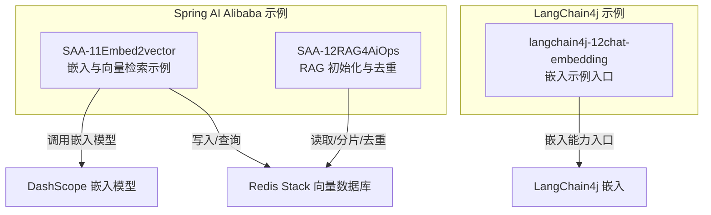
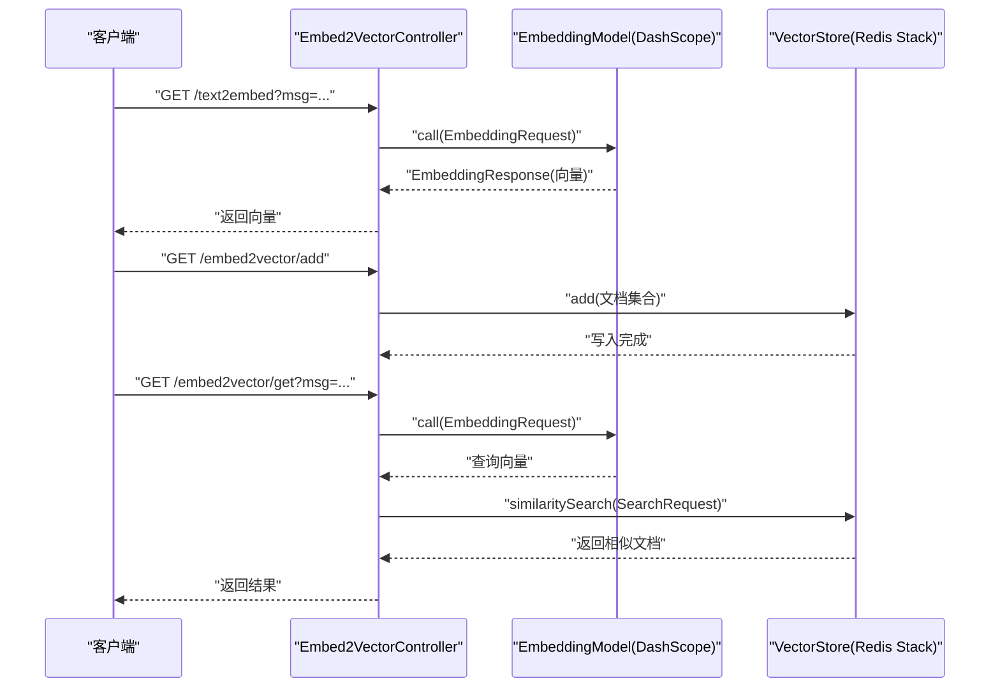
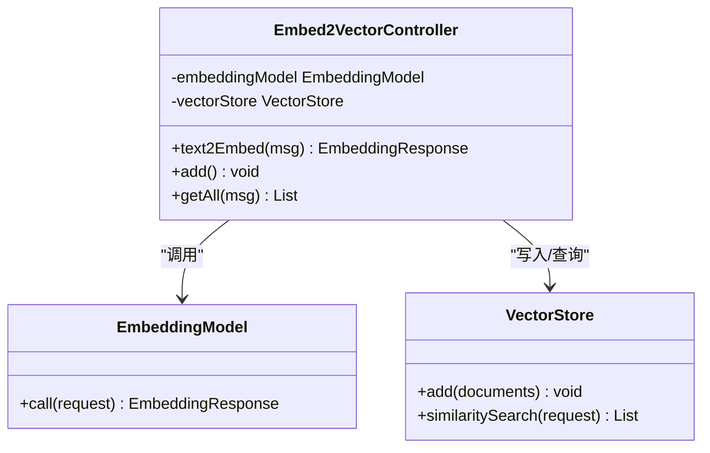
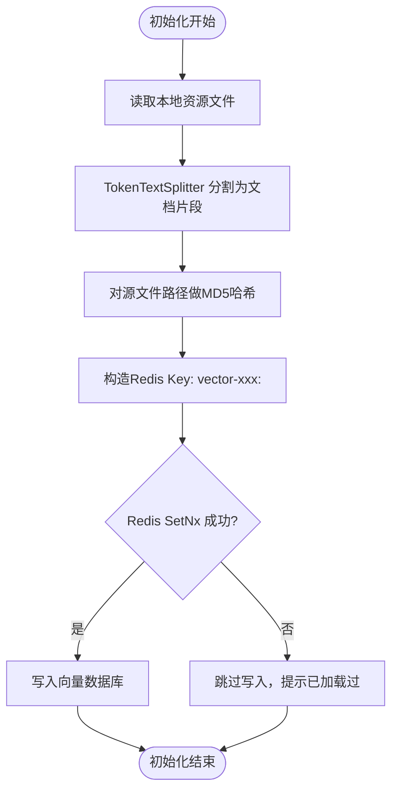
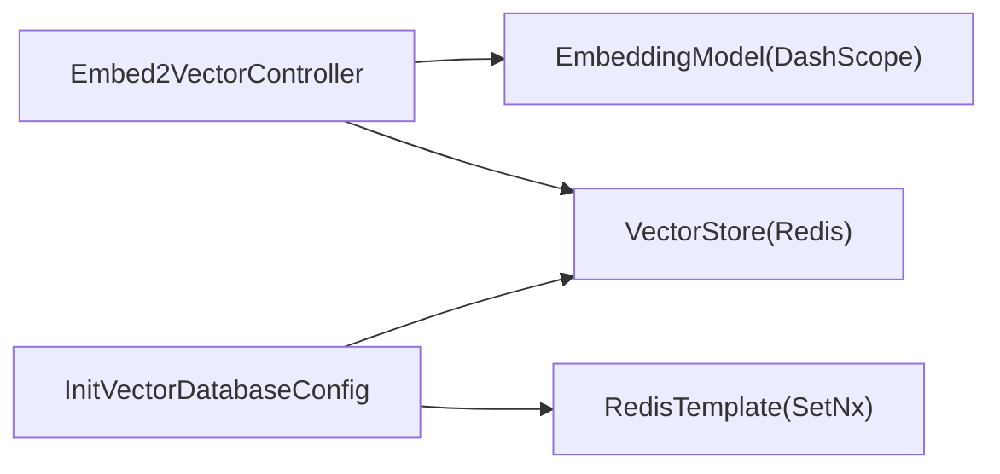

# 向量嵌入

<cite>
**本文引用的文件**
- [Embed2VectorController.java](file://【1】SpringAIAlibaba-atguiguV1/SAA-11Embed2vector/src/main/java/com/atguigu/study/controller/Embed2VectorController.java)
- [application.properties](file://【1】SpringAIAlibaba-atguiguV1/SAA-11Embed2vector/src/main/resources/application.properties)
- [pom.xml](file://【1】SpringAIAlibaba-atguiguV1/SAA-11Embed2vector/pom.xml)
- [Saa11Embed2vectorApplication.java](file://【1】SpringAIAlibaba-atguiguV1/SAA-11Embed2vector/src/main/java/com/atguigu/study/Saa11Embed2vectorApplication.java)
- [InitVectorDatabaseConfig.java](file://【1】SpringAIAlibaba-atguiguV1/SAA-12RAG4AiOps/src/main/java/com/atguigu/study/config/InitVectorDatabaseConfig.java)
- [ChatEmbeddingLangChain4JApp.java](file://【2】langchain4j-atguiguV5/langchain4j-12chat-embedding/src/main/java/com/atguigu/study/ChatEmbeddingLangChain4JApp.java)
</cite>

## 目录
1. [引言](#引言)
2. [项目结构](#项目结构)
3. [核心组件](#核心组件)
4. [架构总览](#架构总览)
5. [详细组件分析](#详细组件分析)
6. [依赖分析](#依赖分析)
7. [性能考虑](#性能考虑)
8. [故障排查指南](#故障排查指南)
9. [结论](#结论)
10. [附录](#附录)

## 引言
本技术文档围绕向量嵌入模块展开，系统性介绍文本向量化处理的基本概念与实现方法，涵盖词嵌入、句子嵌入与文档嵌入的区别与典型应用场景；深入分析主流嵌入模型（如基于上下文的嵌入与基于预训练语言模型的嵌入）在 Spring AI Alibaba 中的集成方式；提供完整的向量生成与相似度计算示例，展示文本匹配、聚类分析与推荐系统的落地思路；并解释向量存储与检索的技术方案，包括向量数据库的选择、索引建立与查询优化策略，最后给出性能调优、内存管理与大规模向量处理的最佳实践。

## 项目结构
本仓库中与向量嵌入直接相关的后端示例位于 Spring AI Alibaba 示例工程 SAA-11Embed2vector，以及 RAG 场景配置 InitVectorDatabaseConfig。同时，LangChain4j 示例工程 langchain4j-12chat-embedding 展示了嵌入能力在 LangChain4j 生态中的使用入口。

- SAA-11Embed2vector：提供嵌入模型调用、向量写入 Redis Stack 向量数据库、相似度检索的最小可运行示例。
- SAA-12RAG4AiOps：演示如何将文档读取、分片与去重后写入向量数据库，避免重复初始化。
- langchain4j-12chat-embedding：LangChain4j 的嵌入示例入口，便于理解嵌入在更高层框架中的使用方式。

**章节来源**
- [Embed2VectorController.java:1-91](file://【1】SpringAIAlibaba-atguiguV1/SAA-11Embed2vector/src/main/java/com/atguigu/study/controller/Embed2VectorController.java#L1-L91)
- [application.properties:1-24](file://【1】SpringAIAlibaba-atguiguV1/SAA-11Embed2vector/src/main/resources/application.properties#L1-L24)
- [pom.xml:1-81](file://【1】SpringAIAlibaba-atguiguV1/SAA-11Embed2vector/pom.xml#L1-L81)
- [InitVectorDatabaseConfig.java:1-75](file://【1】SpringAIAlibaba-atguiguV1/SAA-12RAG4AiOps/src/main/java/com/atguigu/study/config/InitVectorDatabaseConfig.java#L1-L75)
- [ChatEmbeddingLangChain4JApp.java:1-19](file://【2】langchain4j-atguiguV5/langchain4j-12chat-embedding/src/main/java/com/atguigu/study/ChatEmbeddingLangChain4JApp.java#L1-L19)

## 核心组件
- 嵌入控制器（Embed2VectorController）
  - 负责对外提供 HTTP 接口，完成文本到向量的转换、向量写入向量数据库、相似度检索。
  - 集成 DashScope 嵌入模型，并通过 EmbeddingOptions 指定具体模型。
  - 使用 VectorStore 进行向量数据的增删查改与相似度搜索。
- 应用配置（application.properties）
  - 定义 DashScope API Key、嵌入模型名称、Redis 连接参数及向量索引命名与前缀。
- 依赖声明（pom.xml）
  - 引入 spring-ai-alibaba DashScope Starter 与 Redis 向量存储 Starter，以及测试与编译插件。
- RAG 初始化配置（InitVectorDatabaseConfig）
  - 读取本地资源文件，使用 TokenTextSplitter 分割为文档片段，结合 Redis SetNx 去重后写入向量数据库。
- LangChain4j 入口（ChatEmbeddingLangChain4JApp）
  - LangChain4j 的嵌入示例启动类，便于理解嵌入在更高层框架中的使用方式。

**章节来源**
- [Embed2VectorController.java:24-91](file://【1】SpringAIAlibaba-atguiguV1/SAA-11Embed2vector/src/main/java/com/atguigu/study/controller/Embed2VectorController.java#L24-L91)
- [application.properties:10-24](file://【1】SpringAIAlibaba-atguiguV1/SAA-11Embed2vector/src/main/resources/application.properties#L10-L24)
- [pom.xml:14-46](file://【1】SpringAIAlibaba-atguiguV1/SAA-11Embed2vector/pom.xml#L14-L46)
- [InitVectorDatabaseConfig.java:25-75](file://【1】SpringAIAlibaba-atguiguV1/SAA-12RAG4AiOps/src/main/java/com/atguigu/study/config/InitVectorDatabaseConfig.java#L25-L75)
- [ChatEmbeddingLangChain4JApp.java:11-18](file://【2】langchain4j-atguiguV5/langchain4j-12chat-embedding/src/main/java/com/atguigu/study/ChatEmbeddingLangChain4JApp.java#L11-L18)

## 架构总览
下图展示了向量嵌入在系统中的整体交互：客户端通过 HTTP 接口发起请求，后端控制器调用嵌入模型生成向量，随后将向量写入 Redis Stack 向量数据库；检索时根据查询语句生成向量并执行相似度搜索，返回最相似的文档片段。

**图表来源**
- [Embed2VectorController.java:41-90](file://【1】SpringAIAlibaba-atguiguV1/SAA-11Embed2vector/src/main/java/com/atguigu/study/controller/Embed2VectorController.java#L41-L90)

**章节来源**
- [Embed2VectorController.java:28-90](file://【1】SpringAIAlibaba-atguiguV1/SAA-11Embed2vector/src/main/java/com/atguigu/study/controller/Embed2VectorController.java#L28-L90)

## 详细组件分析

### 组件一：嵌入控制器（Embed2VectorController）
- 功能职责
  - 文本向量化：接收单条或多条文本，调用嵌入模型生成向量。
  - 向量入库：将文档集合写入向量数据库。
  - 相似度检索：根据查询文本生成向量并执行相似度搜索，返回 TopK 结果。
- 关键点
  - 使用 DashScopeEmbeddingOptions 指定嵌入模型名称。
  - 通过 SearchRequest.topK 控制返回数量。
  - 输出日志便于观察向量维度与检索结果。

**图表来源**
- [Embed2VectorController.java:26-33](file://【1】SpringAIAlibaba-atguiguV1/SAA-11Embed2vector/src/main/java/com/atguigu/study/controller/Embed2VectorController.java#L26-L33)

**章节来源**
- [Embed2VectorController.java:26-90](file://【1】SpringAIAlibaba-atguiguV1/SAA-11Embed2vector/src/main/java/com/atguigu/study/controller/Embed2VectorController.java#L26-L90)

### 组件二：RAG 初始化与去重（InitVectorDatabaseConfig）
- 功能职责
  - 读取本地资源文件，使用 TextReader 读取文本。
  - 使用 TokenTextSplitter 将长文本按 Token 数量切分为多个文档片段。
  - 通过 Redis SetNx 去重，避免重复初始化导致的数据冗余。
  - 将去重后的文档集合写入向量数据库。
- 关键点
  - 以源文件路径的哈希作为 Redis Key，确保幂等性。
  - 若 Key 已存在则跳过写入，避免重复初始化。

**图表来源**
- [InitVectorDatabaseConfig.java:36-72](file://【1】SpringAIAlibaba-atguiguV1/SAA-12RAG4AiOps/src/main/java/com/atguigu/study/config/InitVectorDatabaseConfig.java#L36-L72)

**章节来源**
- [InitVectorDatabaseConfig.java:33-72](file://【1】SpringAIAlibaba-atguiguV1/SAA-12RAG4AiOps/src/main/java/com/atguigu/study/config/InitVectorDatabaseConfig.java#L33-L72)

### 组件三：应用配置与依赖（application.properties、pom.xml）
- application.properties
  - 设置 DashScope API Key、模型名称、Redis 连接参数、向量索引名与前缀。
- pom.xml
  - 引入 spring-ai-alibaba DashScope Starter 与 Redis 向量存储 Starter，启用参数编译插件与 Spring Boot Maven 插件。

**章节来源**
- [application.properties:10-24](file://【1】SpringAIAlibaba-atguiguV1/SAA-11Embed2vector/src/main/resources/application.properties#L10-L24)
- [pom.xml:14-46](file://【1】SpringAIAlibaba-atguiguV1/SAA-11Embed2vector/pom.xml#L14-L46)

### 组件四：LangChain4j 嵌入入口（ChatEmbeddingLangChain4JApp）
- 作用
  - LangChain4j 的嵌入示例启动类，便于理解嵌入在更高层框架中的使用方式与扩展点。

**章节来源**
- [ChatEmbeddingLangChain4JApp.java:11-18](file://【2】langchain4j-atguiguV5/langchain4j-12chat-embedding/src/main/java/com/atguigu/study/ChatEmbeddingLangChain4JApp.java#L11-L18)

## 依赖分析
- 外部依赖
  - DashScope 嵌入模型：通过 spring-ai-alibaba starter 提供的 EmbeddingModel 实现。
  - Redis Stack：通过 spring-ai-starter-vector-store-redis 提供的 VectorStore 实现向量存储与相似度检索。
- 内部依赖
  - 控制器依赖 EmbeddingModel 与 VectorStore。
  - RAG 初始化配置依赖 VectorStore 与 RedisTemplate，用于去重与幂等写入。

**图表来源**
- [Embed2VectorController.java:28-33](file://【1】SpringAIAlibaba-atguiguV1/SAA-11Embed2vector/src/main/java/com/atguigu/study/controller/Embed2VectorController.java#L28-L33)
- [InitVectorDatabaseConfig.java:28-32](file://【1】SpringAIAlibaba-atguiguV1/SAA-12RAG4AiOps/src/main/java/com/atguigu/study/config/InitVectorDatabaseConfig.java#L28-L32)

**章节来源**
- [pom.xml:20-28](file://【1】SpringAIAlibaba-atguiguV1/SAA-11Embed2vector/pom.xml#L20-L28)
- [Embed2VectorController.java:28-33](file://【1】SpringAIAlibaba-atguiguV1/SAA-11Embed2vector/src/main/java/com/atguigu/study/controller/Embed2VectorController.java#L28-L33)
- [InitVectorDatabaseConfig.java:28-32](file://【1】SpringAIAlibaba-atguiguV1/SAA-12RAG4AiOps/src/main/java/com/atguigu/study/config/InitVectorDatabaseConfig.java#L28-L32)

## 性能考虑
- 嵌入模型选择
  - 根据业务场景选择合适的嵌入模型，平衡精度与延迟；在高并发场景建议评估模型的吞吐与延迟指标。
- 批量处理
  - 对多条文本进行批量嵌入，减少网络往返次数；在写入向量数据库时采用批量写入以提升吞吐。
- 索引与查询优化
  - 在 Redis Stack 中合理设置索引名与前缀，避免与其他应用冲突；根据查询模式调整 topK 与过滤条件。
- 去重与幂等
  - 使用 Redis SetNx 或类似机制保证初始化幂等，避免重复写入造成资源浪费与查询偏差。
- 内存与序列化
  - 注意向量数组的内存占用，避免一次性加载过多向量；对中间结果及时释放引用，防止内存泄漏。
- 缓存与预热
  - 对热点查询结果进行缓存，降低重复相似度检索的开销；在系统启动阶段预热常用向量索引。

## 故障排查指南
- 嵌入模型调用失败
  - 检查 DashScope API Key 是否正确配置；确认模型名称与可用性；查看网络连通性与超时设置。
- 向量写入异常
  - 确认 Redis 连接参数与权限；检查向量维度与索引配置是否一致；验证文档元数据是否完整。
- 相似度检索结果为空或不准确
  - 检查查询文本是否过短或包含噪声；适当提高 topK 并增加过滤条件；确认嵌入模型与检索模型的一致性。
- 重复初始化问题
  - 检查 Redis Key 是否正确生成与去重逻辑是否生效；确认资源文件路径变更后哈希是否更新。
- 日志与监控
  - 开启控制器与向量存储的日志输出，定位异常发生的具体环节；结合指标监控观察延迟与错误率。

**章节来源**
- [application.properties:10-24](file://【1】SpringAIAlibaba-atguiguV1/SAA-11Embed2vector/src/main/resources/application.properties#L10-L24)
- [InitVectorDatabaseConfig.java:53-72](file://【1】SpringAIAlibaba-atguiguV1/SAA-12RAG4AiOps/src/main/java/com/atguigu/study/config/InitVectorDatabaseConfig.java#L53-L72)

## 结论
本向量嵌入模块通过 Spring AI Alibaba 与 Redis Stack 实现了从文本到向量的完整链路：嵌入生成、向量入库与相似度检索。配合 LangChain4j 的嵌入能力，可在更高层框架中灵活扩展。通过合理的索引设计、去重与幂等策略、批量处理与缓存机制，可以在保证准确性的同时显著提升性能与稳定性。建议在生产环境中持续监控延迟、吞吐与错误率，并结合业务场景迭代优化嵌入模型与检索策略。

## 附录
- 快速体验
  - 启动 SAA-11Embed2vector 应用后，访问以下接口进行体验：
    - 文本向量化：GET /text2embed?msg=...
    - 写入向量：GET /embed2vector/add
    - 相似度检索：GET /embed2vector/get?msg=...
- RAG 初始化
  - 启动 SAA-12RAG4AiOps 应用后，自动读取 classpath:ops.txt 并进行分片与去重初始化。

**章节来源**
- [Embed2VectorController.java:41-90](file://【1】SpringAIAlibaba-atguiguV1/SAA-11Embed2vector/src/main/java/com/atguigu/study/controller/Embed2VectorController.java#L41-L90)
- [InitVectorDatabaseConfig.java:36-72](file://【1】SpringAIAlibaba-atguiguV1/SAA-12RAG4AiOps/src/main/java/com/atguigu/study/config/InitVectorDatabaseConfig.java#L36-L72)