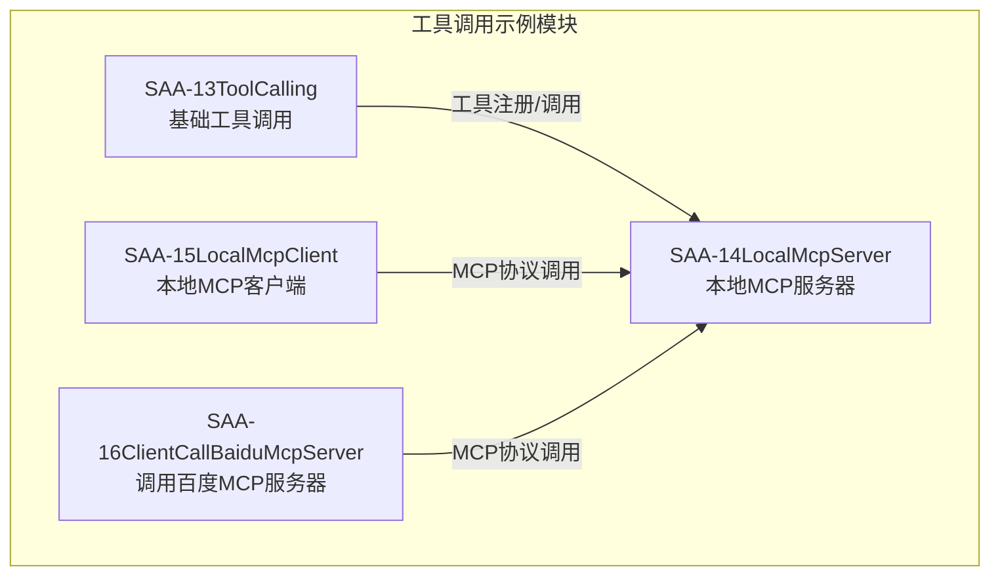
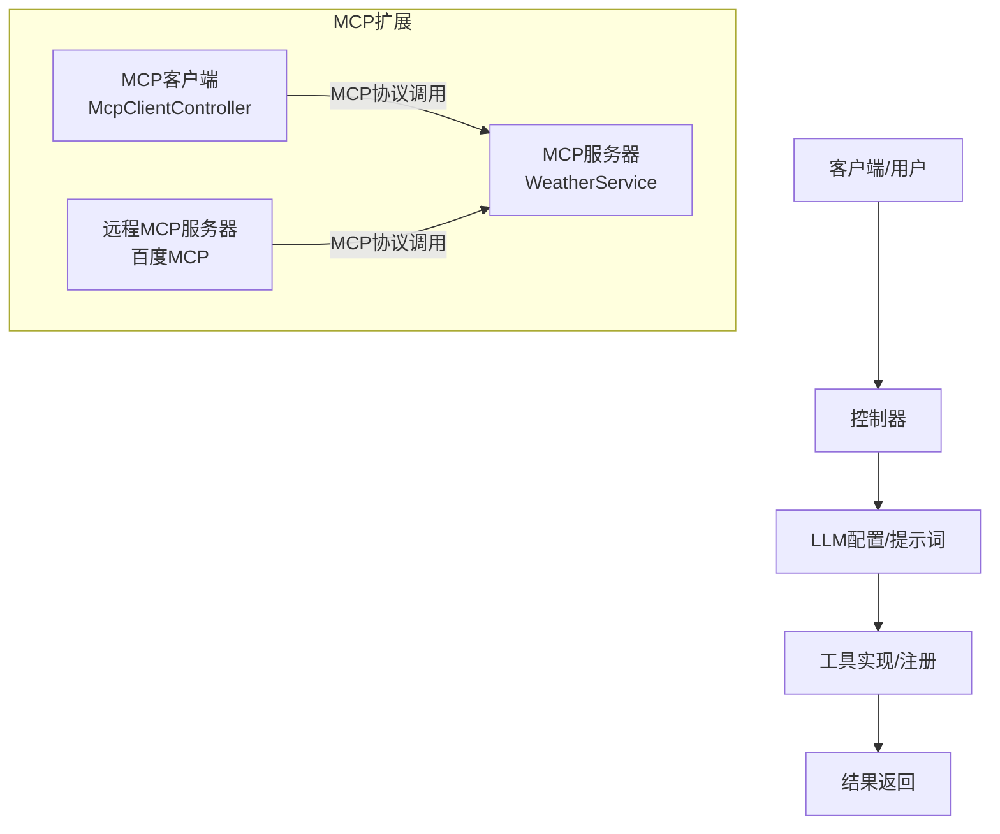
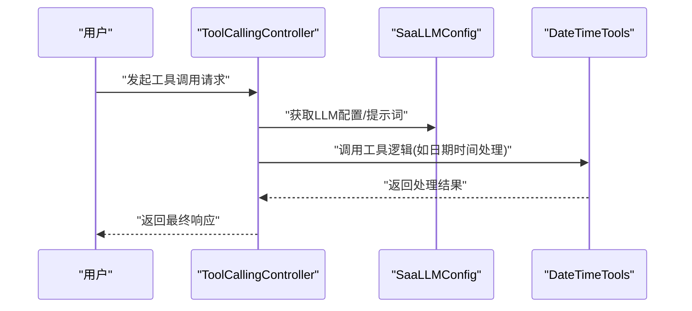
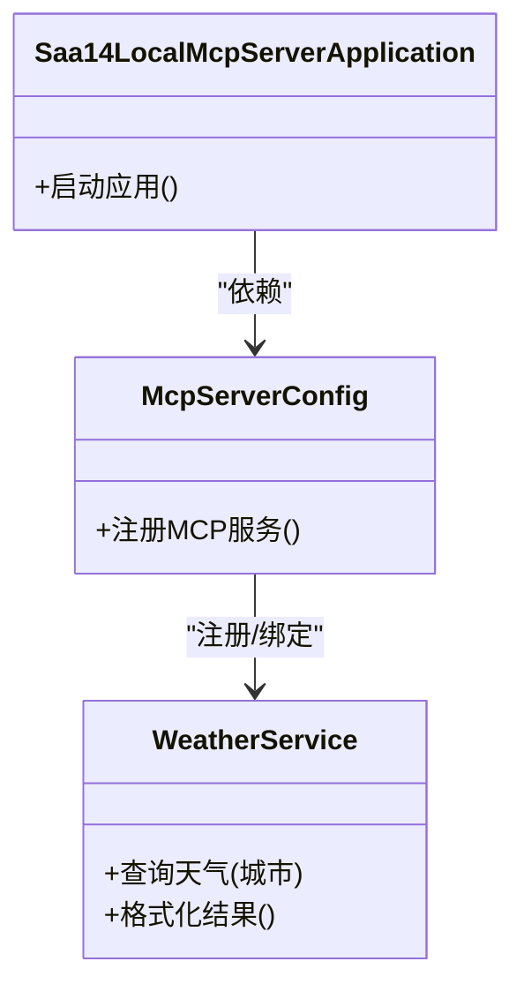
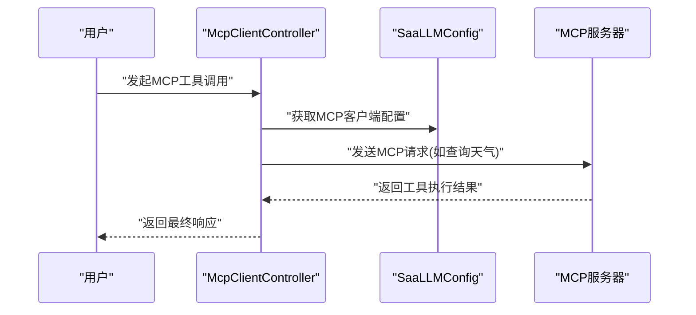
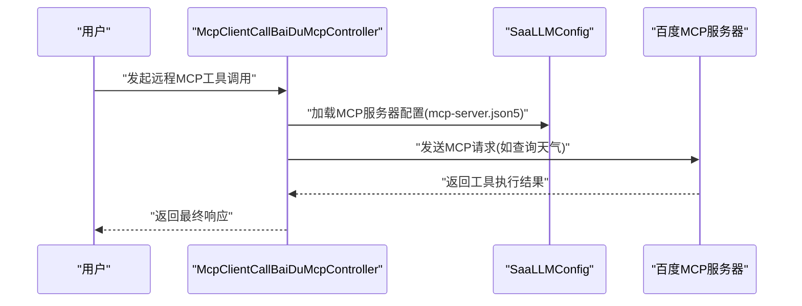
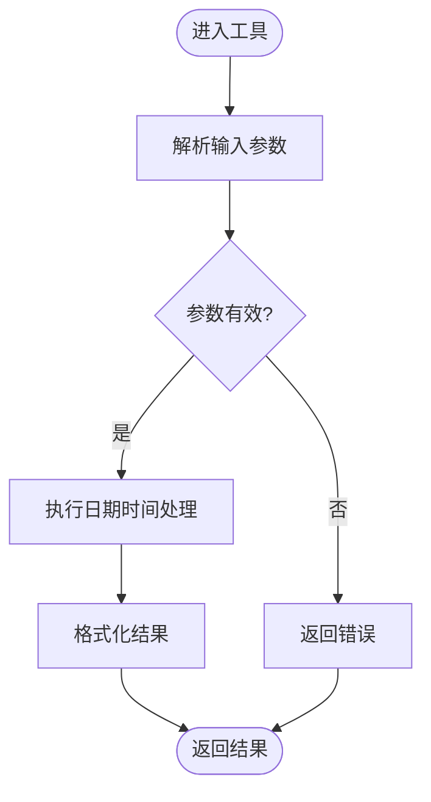
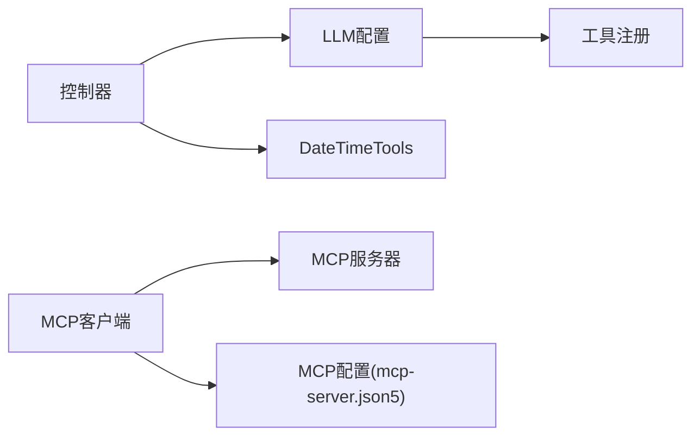

# 工具调用

<cite>
**本文引用的文件**
- [Saa13ToolCallingApplication.java](file://【1】SpringAIAlibaba-atguiguV1/SAA-13ToolCalling/src/main/java/com/atguigu/study/Saa13ToolCallingApplication.java)
- [SaaLLMConfig.java](file://【1】SpringAIAlibaba-atguiguV1/SAA-13ToolCalling/src/main/java/com/atguigu/study/config/SaaLLMConfig.java)
- [ToolCallingController.java](file://【1】SpringAIAlibaba-atguiguV1/SAA-13ToolCalling/src/main/java/com/atguigu/study/controller/ToolCallingController.java)
- [NoToolCallingController.java](file://【1】SpringAIAlibaba-atguiguV1/SAA-13ToolCalling/src/main/java/com/atguigu/study/controller/NoToolCallingController.java)
- [DateTimeTools.java](file://【1】SpringAIAlibaba-atguiguV1/SAA-13ToolCalling/src/main/java/com/atguigu/study/utils/DateTimeTools.java)
- [application.properties](file://【1】SpringAIAlibaba-atguiguV1/SAA-13ToolCalling/src/main/resources/application.properties)
- [Saa14LocalMcpServerApplication.java](file://【1】SpringAIAlibaba-atguiguV1/SAA-14LocalMcpServer/src/main/java/com/atguigu/study/Saa14LocalMcpServerApplication.java)
- [McpServerConfig.java](file://【1】SpringAIAlibaba-atguiguV1/SAA-14LocalMcpServer/src/main/java/com/atguigu/study/config/McpServerConfig.java)
- [WeatherService.java](file://【1】SpringAIAlibaba-atguiguV1/SAA-14LocalMcpServer/src/main/java/com/atguigu/study/service/WeatherService.java)
- [Saa15LocalMcpClientApplication.java](file://【1】SpringAIAlibaba-atguiguV1/SAA-15LocalMcpClient/src/main/java/com/atguigu/study/Saa15LocalMcpClientApplication.java)
- [SaaLLMConfig.java](file://【1】SpringAIAlibaba-atguiguV1/SAA-15LocalMcpClient/src/main/java/com/atguigu/study/config/SaaLLMConfig.java)
- [McpClientController.java](file://【1】SpringAIAlibaba-atguiguV1/SAA-15LocalMcpClient/src/main/java/com/atguigu/study/controller/McpClientController.java)
- [Saa16ClientCallBaiduMcpServerApplication.java](file://【1】SpringAIAlibaba-atguiguV1/SAA-16ClientCallBaiduMcpServer/src/main/java/com/atguigu/study/Saa16ClientCallBaiduMcpServerApplication.java)
- [SaaLLMConfig.java](file://【1】SpringAIAlibaba-atguiguV1/SAA-16ClientCallBaiduMcpServer/src/main/java/com/atguigu/study/config/SaaLLMConfig.java)
- [McpClientCallBaiDuMcpController.java](file://【1】SpringAIAlibaba-atguiguV1/SAA-16ClientCallBaiduMcpServer/src/main/java/com/atguigu/study/controller/McpClientCallBaiDuMcpController.java)
- [mcp-server.json5](file://【1】SpringAIAlibaba-atguiguV1/SAA-16ClientCallBaiduMcpServer/src/main/resources/mcp-server.json5)
</cite>

## 目录
1. [引言](#引言)
2. [项目结构](#项目结构)
3. [核心组件](#核心组件)
4. [架构总览](#架构总览)
5. [详细组件分析](#详细组件分析)
6. [依赖分析](#依赖分析)
7. [性能考虑](#性能考虑)
8. [故障排查指南](#故障排查指南)
9. [结论](#结论)
10. [附录](#附录)

## 引言
本文件围绕“工具调用”主题，系统化梳理并阐述在智能应用中通过工具注册、参数传递与结果处理实现外部能力扩展的关键机制。结合仓库中的 Spring AI 示例工程，重点覆盖以下方面：
- 工具调用在智能应用中的作用：如日期时间处理、外部 API 调用、业务逻辑执行等。
- 工具调用的实现原理与使用方法：从控制器到 LLM 配置、从工具接口到工具实现、再到集成到 AI 工作流。
- 安全考虑与最佳实践：参数验证、错误处理、权限控制。
- 扩展方法、性能优化策略与调试技巧。

## 项目结构
本仓库与“工具调用”直接相关的模块位于 Spring AI 教程工程中，包含三个子模块：
- SAA-13ToolCalling：演示基础工具调用与无工具调用两种场景。
- SAA-14LocalMcpServer：本地 MCP 服务器，提供天气查询等工具服务。
- SAA-15LocalMcpClient：本地 MCP 客户端，作为工具调用的消费者。
- SAA-16ClientCallBaiduMcpServer：客户端调用百度 MCP 服务器，演示跨服务工具调用。

**图表来源**
- [Saa13ToolCallingApplication.java:1-200](file://【1】SpringAIAlibaba-atguiguV1/SAA-13ToolCalling/src/main/java/com/atguigu/study/Saa13ToolCallingApplication.java#L1-L200)
- [Saa14LocalMcpServerApplication.java:1-200](file://【1】SpringAIAlibaba-atguiguV1/SAA-14LocalMcpServer/src/main/java/com/atguigu/study/Saa14LocalMcpServerApplication.java#L1-L200)
- [Saa15LocalMcpClientApplication.java:1-200](file://【1】SpringAIAlibaba-atguiguV1/SAA-15LocalMcpClient/src/main/java/com/atguigu/study/Saa15LocalMcpClientApplication.java#L1-L200)
- [Saa16ClientCallBaiduMcpServerApplication.java:1-200](file://【1】SpringAIAlibaba-atguiguV1/SAA-16ClientCallBaiduMcpServer/src/main/java/com/atguigu/study/Saa16ClientCallBaiduMcpServerApplication.java#L1-L200)

**章节来源**
- [Saa13ToolCallingApplication.java:1-200](file://【1】SpringAIAlibaba-atguiguV1/SAA-13ToolCalling/src/main/java/com/atguigu/study/Saa13ToolCallingApplication.java#L1-L200)
- [Saa14LocalMcpServerApplication.java:1-200](file://【1】SpringAIAlibaba-atguiguV1/SAA-14LocalMcpServer/src/main/java/com/atguigu/study/Saa14LocalMcpServerApplication.java#L1-L200)
- [Saa15LocalMcpClientApplication.java:1-200](file://【1】SpringAIAlibaba-atguiguV1/SAA-15LocalMcpClient/src/main/java/com/atguigu/study/Saa15LocalMcpClientApplication.java#L1-L200)
- [Saa16ClientCallBaiduMcpServerApplication.java:1-200](file://【1】SpringAIAlibaba-atguiguV1/SAA-16ClientCallBaiduMcpServer/src/main/java/com/atguigu/study/Saa16ClientCallBaiduMcpServerApplication.java#L1-L200)

## 核心组件
- 控制器层：负责接收用户请求、触发工具调用或无工具调用流程，并返回结果。
- LLM 配置层：集中管理模型参数、提示词模板与工具注册。
- 工具实现层：封装具体业务逻辑（如日期时间处理），并通过统一接口暴露。
- MCP 服务层：以 MCP 协议对外提供工具服务，便于跨进程/跨服务复用。
- MCP 客户端层：以 MCP 协议消费远程工具服务，实现松耦合扩展。

**章节来源**
- [ToolCallingController.java:1-200](file://【1】SpringAIAlibaba-atguiguV1/SAA-13ToolCalling/src/main/java/com/atguigu/study/controller/ToolCallingController.java#L1-L200)
- [NoToolCallingController.java:1-200](file://【1】SpringAIAlibaba-atguiguV1/SAA-13ToolCalling/src/main/java/com/atguigu/study/controller/NoToolCallingController.java#L1-L200)
- [SaaLLMConfig.java:1-200](file://【1】SpringAIAlibaba-atguiguV1/SAA-13ToolCalling/src/main/java/com/atguigu/study/config/SaaLLMConfig.java#L1-L200)
- [DateTimeTools.java:1-200](file://【1】SpringAIAlibaba-atguiguV1/SAA-13ToolCalling/src/main/java/com/atguigu/study/utils/DateTimeTools.java#L1-L200)
- [WeatherService.java:1-200](file://【1】SpringAIAlibaba-atguiguV1/SAA-14LocalMcpServer/src/main/java/com/atguigu/study/service/WeatherService.java#L1-L200)
- [McpClientController.java:1-200](file://【1】SpringAIAlibaba-atguiguV1/SAA-15LocalMcpClient/src/main/java/com/atguigu/study/controller/McpClientController.java#L1-L200)
- [McpClientCallBaiDuMcpController.java:1-200](file://【1】SpringAIAlibaba-atguiguV1/SAA-16ClientCallBaiduMcpServer/src/main/java/com/atguigu/study/controller/McpClientCallBaiDuMcpController.java#L1-L200)

## 架构总览
下图展示了从控制器到 LLM 配置、工具实现以及 MCP 服务/客户端的整体调用链路。

**图表来源**
- [ToolCallingController.java:1-200](file://【1】SpringAIAlibaba-atguiguV1/SAA-13ToolCalling/src/main/java/com/atguigu/study/controller/ToolCallingController.java#L1-L200)
- [SaaLLMConfig.java:1-200](file://【1】SpringAIAlibaba-atguiguV1/SAA-13ToolCalling/src/main/java/com/atguigu/study/config/SaaLLMConfig.java#L1-L200)
- [DateTimeTools.java:1-200](file://【1】SpringAIAlibaba-atguiguV1/SAA-13ToolCalling/src/main/java/com/atguigu/study/utils/DateTimeTools.java#L1-L200)
- [WeatherService.java:1-200](file://【1】SpringAIAlibaba-atguiguV1/SAA-14LocalMcpServer/src/main/java/com/atguigu/study/service/WeatherService.java#L1-L200)
- [McpClientController.java:1-200](file://【1】SpringAIAlibaba-atguiguV1/SAA-15LocalMcpClient/src/main/java/com/atguigu/study/controller/McpClientController.java#L1-L200)
- [McpClientCallBaiDuMcpController.java:1-200](file://【1】SpringAIAlibaba-atguiguV1/SAA-16ClientCallBaiduMcpServer/src/main/java/com/atguigu/study/controller/McpClientCallBaiDuMcpController.java#L1-L200)

## 详细组件分析

### 组件A：基础工具调用（SAA-13ToolCalling）
该模块演示了工具注册、参数传递与结果处理的完整流程，包含两个控制器：
- 工具调用控制器：负责触发工具调用并返回结果。
- 无工具调用控制器：用于对比，展示不启用工具时的响应路径。

**图表来源**
- [ToolCallingController.java:1-200](file://【1】SpringAIAlibaba-atguiguV1/SAA-13ToolCalling/src/main/java/com/atguigu/study/controller/ToolCallingController.java#L1-L200)
- [SaaLLMConfig.java:1-200](file://【1】SpringAIAlibaba-atguiguV1/SAA-13ToolCalling/src/main/java/com/atguigu/study/config/SaaLLMConfig.java#L1-L200)
- [DateTimeTools.java:1-200](file://【1】SpringAIAlibaba-atguiguV1/SAA-13ToolCalling/src/main/java/com/atguigu/study/utils/DateTimeTools.java#L1-L200)

**章节来源**
- [ToolCallingController.java:1-200](file://【1】SpringAIAlibaba-atguiguV1/SAA-13ToolCalling/src/main/java/com/atguigu/study/controller/ToolCallingController.java#L1-L200)
- [NoToolCallingController.java:1-200](file://【1】SpringAIAlibaba-atguiguV1/SAA-13ToolCalling/src/main/java/com/atguigu/study/controller/NoToolCallingController.java#L1-L200)
- [SaaLLMConfig.java:1-200](file://【1】SpringAIAlibaba-atguiguV1/SAA-13ToolCalling/src/main/java/com/atguigu/study/config/SaaLLMConfig.java#L1-L200)
- [DateTimeTools.java:1-200](file://【1】SpringAIAlibaba-atguiguV1/SAA-13ToolCalling/src/main/java/com/atguigu/study/utils/DateTimeTools.java#L1-L200)

### 组件B：本地MCP服务器（SAA-14LocalMcpServer）
该模块以 MCP 协议对外提供工具服务，典型工具为天气查询服务。其核心职责是：
- 通过配置类注册 MCP 服务。
- 通过服务类实现具体工具逻辑。
- 以标准协议暴露工具，供客户端消费。

**图表来源**
- [McpServerConfig.java:1-200](file://【1】SpringAIAlibaba-atguiguV1/SAA-14LocalMcpServer/src/main/java/com/atguigu/study/config/McpServerConfig.java#L1-L200)
- [WeatherService.java:1-200](file://【1】SpringAIAlibaba-atguiguV1/SAA-14LocalMcpServer/src/main/java/com/atguigu/study/service/WeatherService.java#L1-L200)
- [Saa14LocalMcpServerApplication.java:1-200](file://【1】SpringAIAlibaba-atguiguV1/SAA-14LocalMcpServer/src/main/java/com/atguigu/study/Saa14LocalMcpServerApplication.java#L1-L200)

**章节来源**
- [McpServerConfig.java:1-200](file://【1】SpringAIAlibaba-atguiguV1/SAA-14LocalMcpServer/src/main/java/com/atguigu/study/config/McpServerConfig.java#L1-L200)
- [WeatherService.java:1-200](file://【1】SpringAIAlibaba-atguiguV1/SAA-14LocalMcpServer/src/main/java/com/atguigu/study/service/WeatherService.java#L1-L200)
- [Saa14LocalMcpServerApplication.java:1-200](file://【1】SpringAIAlibaba-atguiguV1/SAA-14LocalMcpServer/src/main/java/com/atguigu/study/Saa14LocalMcpServerApplication.java#L1-L200)

### 组件C：本地MCP客户端（SAA-15LocalMcpClient）
该模块作为工具调用的消费者，通过 MCP 协议访问本地 MCP 服务器提供的工具服务。

**图表来源**
- [McpClientController.java:1-200](file://【1】SpringAIAlibaba-atguiguV1/SAA-15LocalMcpClient/src/main/java/com/atguigu/study/controller/McpClientController.java#L1-L200)
- [SaaLLMConfig.java:1-200](file://【1】SpringAIAlibaba-atguiguV1/SAA-15LocalMcpClient/src/main/java/com/atguigu/study/config/SaaLLMConfig.java#L1-L200)
- [Saa14LocalMcpServerApplication.java:1-200](file://【1】SpringAIAlibaba-atguiguV1/SAA-14LocalMcpServer/src/main/java/com/atguigu/study/Saa14LocalMcpServerApplication.java#L1-L200)

**章节来源**
- [McpClientController.java:1-200](file://【1】SpringAIAlibaba-atguiguV1/SAA-15LocalMcpClient/src/main/java/com/atguigu/study/controller/McpClientController.java#L1-L200)
- [SaaLLMConfig.java:1-200](file://【1】SpringAIAlibaba-atguiguV1/SAA-15LocalMcpClient/src/main/java/com/atguigu/study/config/SaaLLMConfig.java#L1-L200)

### 组件D：调用百度MCP服务器（SAA-16ClientCallBaiduMcpServer）
该模块演示客户端如何通过 MCP 协议调用远程（百度）MCP 服务器，实现跨服务工具调用。

**图表来源**
- [McpClientCallBaiDuMcpController.java:1-200](file://【1】SpringAIAlibaba-atguiguV1/SAA-16ClientCallBaiduMcpServer/src/main/java/com/atguigu/study/controller/McpClientCallBaiDuMcpController.java#L1-L200)
- [SaaLLMConfig.java:1-200](file://【1】SpringAIAlibaba-atguiguV1/SAA-16ClientCallBaiduMcpServer/src/main/java/com/atguigu/study/config/SaaLLMConfig.java#L1-L200)
- [mcp-server.json5:1-200](file://【1】SpringAIAlibaba-atguiguV1/SAA-16ClientCallBaiduMcpServer/src/main/resources/mcp-server.json5#L1-L200)

**章节来源**
- [McpClientCallBaiDuMcpController.java:1-200](file://【1】SpringAIAlibaba-atguiguV1/SAA-16ClientCallBaiduMcpServer/src/main/java/com/atguigu/study/controller/McpClientCallBaiDuMcpController.java#L1-L200)
- [SaaLLMConfig.java:1-200](file://【1】SpringAIAlibaba-atguiguV1/SAA-16ClientCallBaiduMcpServer/src/main/java/com/atguigu/study/config/SaaLLMConfig.java#L1-L200)
- [mcp-server.json5:1-200](file://【1】SpringAIAlibaba-atguiguV1/SAA-16ClientCallBaiduMcpServer/src/main/resources/mcp-server.json5#L1-L200)

### 组件E：日期时间工具（DateTimeTools）
该工具封装了日期时间处理逻辑，作为示例工具被控制器调用，体现“工具即服务”的思想。

**图表来源**
- [DateTimeTools.java:1-200](file://【1】SpringAIAlibaba-atguiguV1/SAA-13ToolCalling/src/main/java/com/atguigu/study/utils/DateTimeTools.java#L1-L200)

**章节来源**
- [DateTimeTools.java:1-200](file://【1】SpringAIAlibaba-atguiguV1/SAA-13ToolCalling/src/main/java/com/atguigu/study/utils/DateTimeTools.java#L1-L200)

## 依赖分析
- 控制器依赖 LLM 配置进行工具注册与提示词管理。
- 工具实现依赖于统一接口，便于替换与扩展。
- MCP 客户端通过配置文件加载远端 MCP 服务器地址与能力清单。
- MCP 服务器通过配置类注册工具服务，形成可发现的服务集合。

**图表来源**
- [ToolCallingController.java:1-200](file://【1】SpringAIAlibaba-atguiguV1/SAA-13ToolCalling/src/main/java/com/atguigu/study/controller/ToolCallingController.java#L1-L200)
- [SaaLLMConfig.java:1-200](file://【1】SpringAIAlibaba-atguiguV1/SAA-13ToolCalling/src/main/java/com/atguigu/study/config/SaaLLMConfig.java#L1-L200)
- [DateTimeTools.java:1-200](file://【1】SpringAIAlibaba-atguiguV1/SAA-13ToolCalling/src/main/java/com/atguigu/study/utils/DateTimeTools.java#L1-L200)
- [McpClientController.java:1-200](file://【1】SpringAIAlibaba-atguiguV1/SAA-15LocalMcpClient/src/main/java/com/atguigu/study/controller/McpClientController.java#L1-L200)
- [mcp-server.json5:1-200](file://【1】SpringAIAlibaba-atguiguV1/SAA-16ClientCallBaiduMcpServer/src/main/resources/mcp-server.json5#L1-L200)

**章节来源**
- [ToolCallingController.java:1-200](file://【1】SpringAIAlibaba-atguiguV1/SAA-13ToolCalling/src/main/java/com/atguigu/study/controller/ToolCallingController.java#L1-L200)
- [SaaLLMConfig.java:1-200](file://【1】SpringAIAlibaba-atguiguV1/SAA-13ToolCalling/src/main/java/com/atguigu/study/config/SaaLLMConfig.java#L1-L200)
- [DateTimeTools.java:1-200](file://【1】SpringAIAlibaba-atguiguV1/SAA-13ToolCalling/src/main/java/com/atguigu/study/utils/DateTimeTools.java#L1-L200)
- [McpClientController.java:1-200](file://【1】SpringAIAlibaba-atguiguV1/SAA-15LocalMcpClient/src/main/java/com/atguigu/study/controller/McpClientController.java#L1-L200)
- [mcp-server.json5:1-200](file://【1】SpringAIAlibaba-atguiguV1/SAA-16ClientCallBaiduMcpServer/src/main/resources/mcp-server.json5#L1-L200)

## 性能考虑
- 工具调用的延迟与吞吐
  - 将工具调用与 LLM 推理解耦，避免阻塞主推理线程。
  - 对外部 API 调用采用异步或并发策略，结合连接池与超时控制。
- 结果缓存
  - 对高频、低变化的工具结果进行缓存，减少重复调用。
- 参数预处理
  - 在进入工具前完成参数校验与归一化，降低工具内部分支判断成本。
- 资源隔离
  - 将不同类型的工具置于独立线程池或容器中，防止相互影响。

## 故障排查指南
- 参数验证失败
  - 检查控制器对输入参数的校验逻辑，确保边界条件与空值处理完备。
  - 对日期时间类工具，确认输入格式与时区转换是否正确。
- 工具未注册或不可用
  - 核对 LLM 配置中的工具注册清单，确保工具名称与签名一致。
  - 对 MCP 场景，检查服务端是否已注册工具，客户端是否正确加载配置文件。
- 远程调用异常
  - 检查网络连通性与认证配置；对超时与重试策略进行合理设置。
- 结果格式不一致
  - 统一工具返回的数据结构，避免下游解析复杂度上升。

**章节来源**
- [ToolCallingController.java:1-200](file://【1】SpringAIAlibaba-atguiguV1/SAA-13ToolCalling/src/main/java/com/atguigu/study/controller/ToolCallingController.java#L1-L200)
- [NoToolCallingController.java:1-200](file://【1】SpringAIAlibaba-atguiguV1/SAA-13ToolCalling/src/main/java/com/atguigu/study/controller/NoToolCallingController.java#L1-L200)
- [SaaLLMConfig.java:1-200](file://【1】SpringAIAlibaba-atguiguV1/SAA-13ToolCalling/src/main/java/com/atguigu/study/config/SaaLLMConfig.java#L1-L200)
- [mcp-server.json5:1-200](file://【1】SpringAIAlibaba-atguiguV1/SAA-16ClientCallBaiduMcpServer/src/main/resources/mcp-server.json5#L1-L200)

## 结论
工具调用是智能应用扩展外部能力的关键手段。通过统一的工具接口、完善的参数传递与结果处理机制，以及基于 MCP 的跨进程/跨服务协作，可以实现高内聚、低耦合的智能工作流。建议在实际工程中遵循参数验证、错误处理、权限控制与性能优化的最佳实践，持续迭代工具能力，提升系统的稳定性与可维护性。

## 附录
- 工具实现示例要点
  - 定义清晰的工具接口与参数契约。
  - 实现健壮的错误处理与回退策略。
  - 提供可测试的单元测试与集成测试。
- 扩展方法
  - 新增工具时，优先考虑复用现有工具框架与配置中心。
  - 对外提供工具时，采用 MCP 协议并完善能力清单与鉴权。
- 调试技巧
  - 使用日志追踪工具调用链路，定位耗时瓶颈。
  - 对外部 API 调用进行采样与指标埋点，建立告警机制。