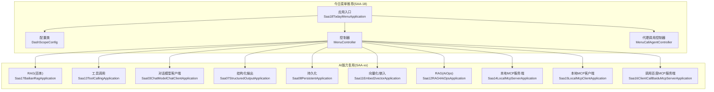
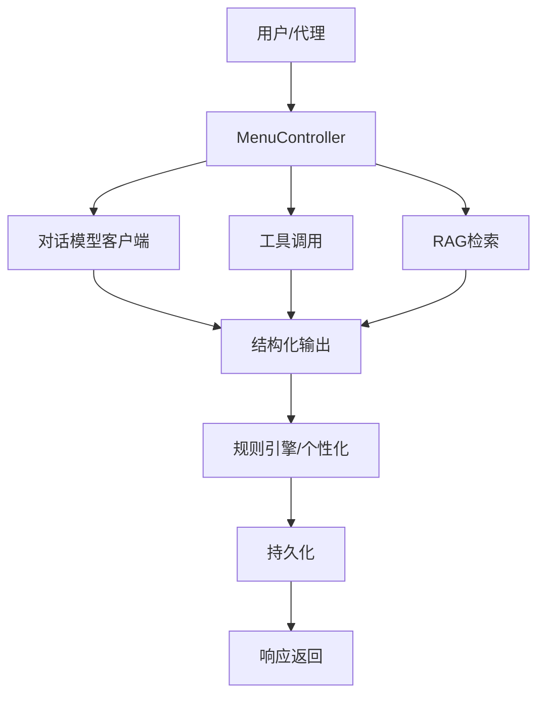
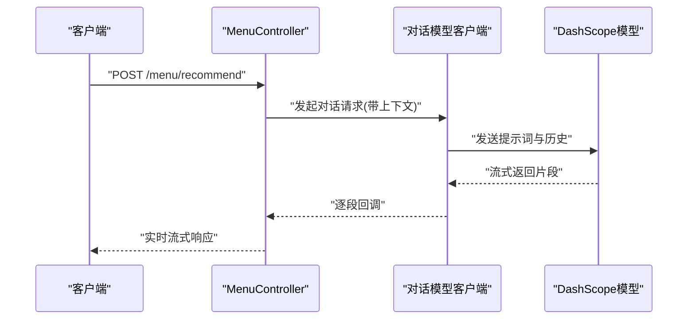
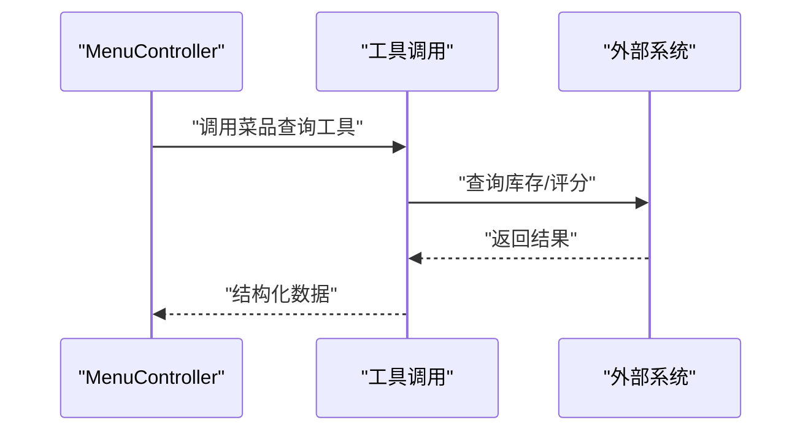
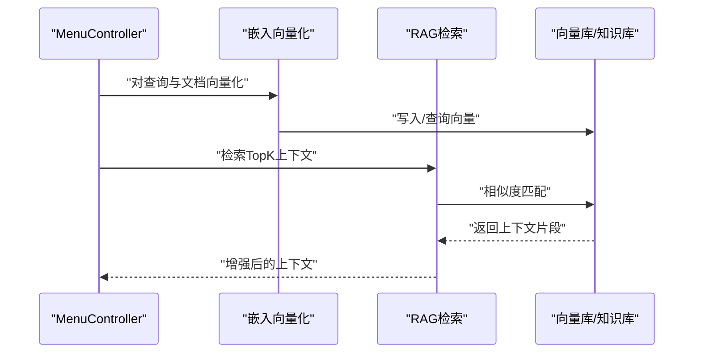
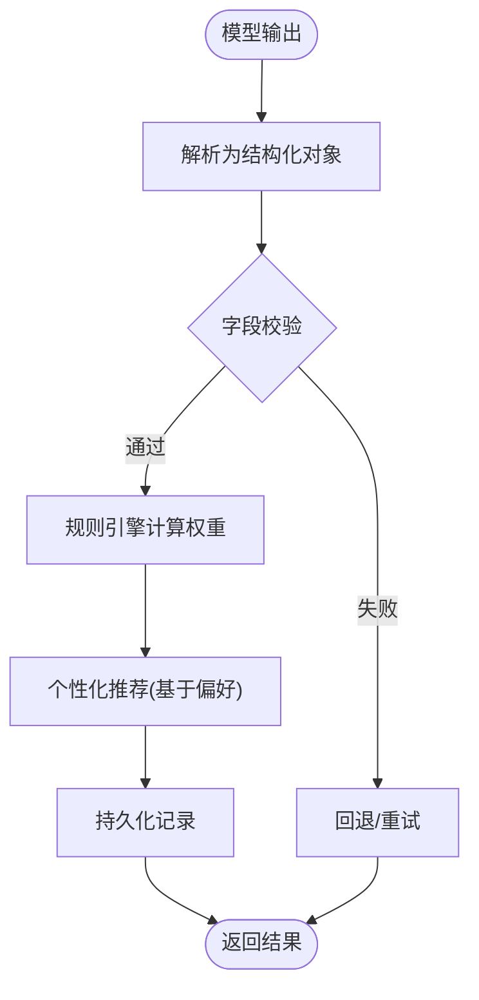
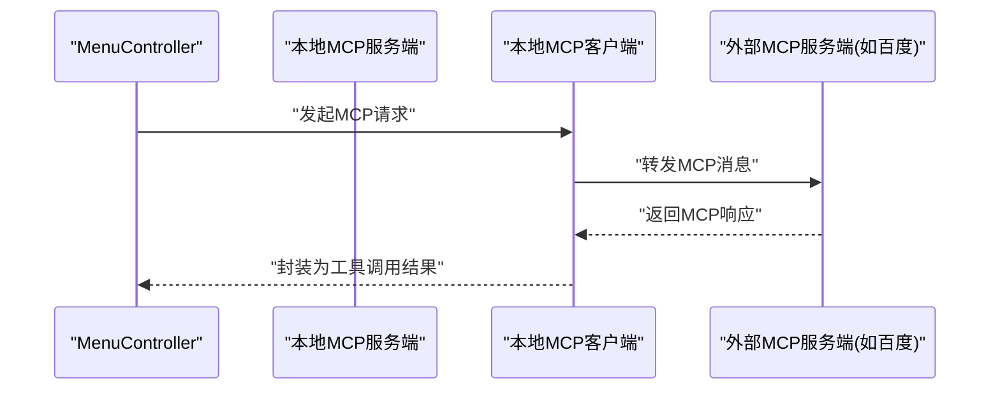
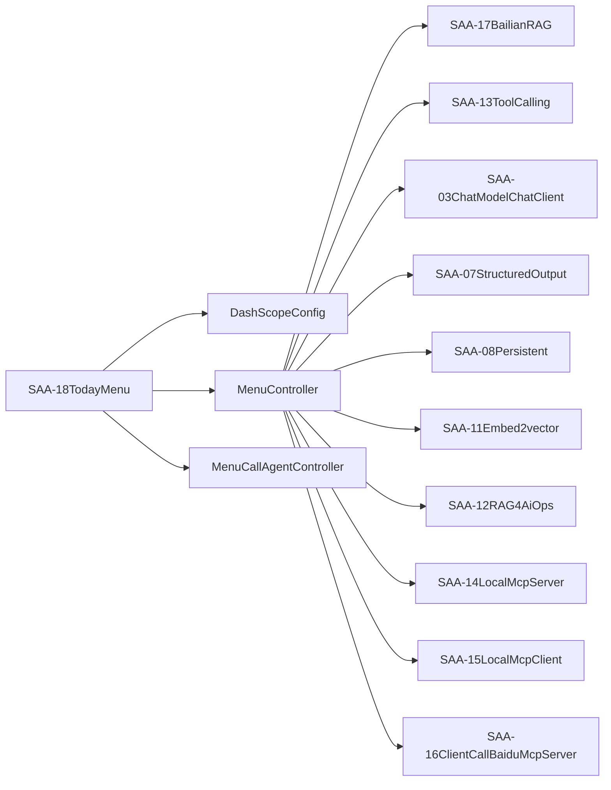

# 应用场景示例

<cite>
**本文引用的文件**
- [Saa18TodayMenuApplication.java](file://【1】SpringAIAlibaba-atguiguV1/SAA-18TodayMenu/src/main/java/com/atguigu/study/Saa18TodayMenuApplication.java)
- [DashScopeConfig.java](file://【1】SpringAIAlibaba-atguiguV1/SAA-18TodayMenu/src/main/java/com/atguigu/study/config/DashScopeConfig.java)
- [MenuController.java](file://【1】SpringAIAlibaba-atguiguV1/SAA-18TodayMenu/src/main/java/com/atguigu/study/controller/MenuController.java)
- [MenuCallAgentController.java](file://【1】SpringAIAlibaba-atguiguV1/SAA-18TodayMenu/src/main/java/com/atguigu/study/controller/MenuCallAgentController.java)
- [application.properties](file://【1】SpringAIAlibaba-atguiguV1/SAA-18TodayMenu/src/main/resources/application.properties)
- [pom.xml](file://【1】SpringAIAlibaba-atguiguV1/SAA-18TodayMenu/pom.xml)
- [Saa17BailianRagApplication.java](file://【1】SpringAIAlibaba-atguiguV1/SAA-17BailianRAG/src/main/java/com/atguigu/study/Saa17BailianRagApplication.java)
- [Saa13ToolCallingApplication.java](file://【1】SpringAIAlibaba-atguiguV1/SAA-13ToolCalling/src/main/java/com/atguigu/study/Saa13ToolCallingApplication.java)
- [Saa03ChatModelChatClientApplication.java](file://【1】SpringAIAlibaba-atguiguV1/SAA-03ChatModelChatClient/src/main/java/com/atguigu/study/Saa03ChatModelChatClientApplication.java)
- [Saa07StructuredOutputApplication.java](file://【1】SpringAIAlibaba-atguiguV1/SAA-07StructuredOutput/src/main/java/com/atguigu/study/Saa07StructuredOutputApplication.java)
- [Saa08PersistentApplication.java](file://【1】SpringAIAlibaba-atguiguV1/SAA-08Persistent/src/main/java/com/atguigu/study/Saa08PersistentApplication.java)
- [Saa11Embed2vectorApplication.java](file://【1】SpringAIAlibaba-atguiguV1/SAA-11Embed2vector/src/main/java/com/atguigu/study/Saa11Embed2vectorApplication.java)
- [Saa12RAG4AiOpsApplication.java](file://【1】SpringAIAlibaba-atguiguV1/SAA-12RAG4AiOps/src/main/java/com/atguigu/study/Saa12RAG4AiOpsApplication.java)
- [Saa14LocalMcpServerApplication.java](file://【1】SpringAIAlibaba-atguiguV1/SAA-14LocalMcpServer/src/main/java/com/atguigu/study/Saa14LocalMcpServerApplication.java)
- [Saa15LocalMcpClientApplication.java](file://【1】SpringAIAlibaba-atguiguV1/SAA-15LocalMcpClient/src/main/java/com/atguigu/study/Saa15LocalMcpClientApplication.java)
- [Saa16ClientCallBaiduMcpServerApplication.java](file://【1】SpringAIAlibaba-atguiguV1/SAA-16ClientCallBaiduMcpServer/src/main/java/com/atguigu/study/Saa16ClientCallBaiduMcpServerApplication.java)
</cite>

## 目录
1. [引言](#引言)
2. [项目结构](#项目结构)
3. [核心组件](#核心组件)
4. [架构总览](#架构总览)
5. [详细组件分析](#详细组件分析)
6. [依赖分析](#依赖分析)
7. [性能考虑](#性能考虑)
8. [故障排查指南](#故障排查指南)
9. [结论](#结论)
10. [附录](#附录)

## 引言
本指南围绕“今日菜单推荐”这一典型业务场景，系统讲解如何基于 Spring AI Alibaba 框架完成从需求分析到系统实现再到部署运维的全流程实践。该场景融合了对话管理、工具调用、RAG 检索、结构化输出、持久化与嵌入向量化等能力，帮助读者掌握多AI能力协同构建真实业务应用的方法论与最佳实践。

## 项目结构
本次示例聚焦于 SAA-18TodayMenu 模块，并结合 SAA-17BailianRAG、SAA-13ToolCalling、SAA-03ChatModelChatClient、SAA-07StructuredOutput、SAA-08Persistent、SAA-11Embed2vector、SAA-12RAG4AiOps、SAA-14LocalMcpServer、SAA-15LocalMcpClient、SAA-16ClientCallBaiduMcpServer 等模块的能力进行组合复用，形成可落地的业务闭环。

**图表来源**
- [Saa18TodayMenuApplication.java:1-200](file://【1】SpringAIAlibaba-atguiguV1/SAA-18TodayMenu/src/main/java/com/atguigu/study/Saa18TodayMenuApplication.java#L1-L200)
- [DashScopeConfig.java:1-200](file://【1】SpringAIAlibaba-atguiguV1/SAA-18TodayMenu/src/main/java/com/atguigu/study/config/DashScopeConfig.java#L1-L200)
- [MenuController.java:1-200](file://【1】SpringAIAlibaba-atguiguV1/SAA-18TodayMenu/src/main/java/com/atguigu/study/controller/MenuController.java#L1-L200)
- [MenuCallAgentController.java:1-200](file://【1】SpringAIAlibaba-atguiguV1/SAA-18TodayMenu/src/main/java/com/atguigu/study/controller/MenuCallAgentController.java#L1-L200)
- [Saa17BailianRagApplication.java:1-200](file://【1】SpringAIAlibaba-atguiguV1/SAA-17BailianRAG/src/main/java/com/atguigu/study/Saa17BailianRagApplication.java#L1-L200)
- [Saa13ToolCallingApplication.java:1-200](file://【1】SpringAIAlibaba-atguiguV1/SAA-13ToolCalling/src/main/java/com/atguigu/study/Saa13ToolCallingApplication.java#L1-L200)
- [Saa03ChatModelChatClientApplication.java:1-200](file://【1】SpringAIAlibaba-atguiguV1/SAA-03ChatModelChatClient/src/main/java/com/atguigu/study/Saa03ChatModelChatClientApplication.java#L1-L200)
- [Saa07StructuredOutputApplication.java:1-200](file://【1】SpringAIAlibaba-atguiguV1/SAA-07StructuredOutput/src/main/java/com/atguigu/study/Saa07StructuredOutputApplication.java#L1-L200)
- [Saa08PersistentApplication.java:1-200](file://【1】SpringAIAlibaba-atguiguV1/SAA-08Persistent/src/main/java/com/atguigu/study/Saa08PersistentApplication.java#L1-L200)
- [Saa11Embed2vectorApplication.java:1-200](file://【1】SpringAIAlibaba-atguiguV1/SAA-11Embed2vector/src/main/java/com/atguigu/study/Saa11Embed2vectorApplication.java#L1-L200)
- [Saa12RAG4AiOpsApplication.java:1-200](file://【1】SpringAIAlibaba-atguiguV1/SAA-12RAG4AiOps/src/main/java/com/atguigu/study/Saa12RAG4AiOpsApplication.java#L1-L200)
- [Saa14LocalMcpServerApplication.java:1-200](file://【1】SpringAIAlibaba-atguiguV1/SAA-14LocalMcpServer/src/main/java/com/atguigu/study/Saa14LocalMcpServerApplication.java#L1-L200)
- [Saa15LocalMcpClientApplication.java:1-200](file://【1】SpringAIAlibaba-atguiguV1/SAA-15LocalMcpClient/src/main/java/com/atguigu/study/Saa15LocalMcpClientApplication.java#L1-L200)
- [Saa16ClientCallBaiduMcpServerApplication.java:1-200](file://【1】SpringAIAlibaba-atguiguV1/SAA-16ClientCallBaiduMcpServer/src/main/java/com/atguigu/study/Saa16ClientCallBaiduMcpServerApplication.java#L1-L200)

**章节来源**
- [Saa18TodayMenuApplication.java:1-200](file://【1】SpringAIAlibaba-atguiguV1/SAA-18TodayMenu/src/main/java/com/atguigu/study/Saa18TodayMenuApplication.java#L1-L200)
- [application.properties:1-200](file://【1】SpringAIAlibaba-atguiguV1/SAA-18TodayMenu/src/main/resources/application.properties#L1-L200)

## 核心组件
- 应用入口与配置：应用入口负责启动 Spring Boot 容器；DashScopeConfig 负责接入 DashScope 的模型与工具能力，统一配置模型参数、鉴权与超时策略。
- 控制器层：
  - MenuController：对外提供 REST API，封装今日菜单推荐的业务流程，协调对话、工具调用与 RAG 检索。
  - MenuCallAgentController：面向代理或外部系统调用的入口，负责接收请求、路由到具体能力模块并返回结果。
- 能力复用模块：
  - RAG(百炼)：提供检索增强生成能力，用于从知识库中抽取与今日菜单相关的上下文。
  - 工具调用：封装外部系统查询（如餐厅库存、菜品评分）等工具，供对话模型按需调用。
  - 对话模型客户端：封装模型调用、流式输出与上下文管理。
  - 结构化输出：将模型输出转换为结构化数据，便于后续规则引擎与个性化推荐。
  - 持久化：保存对话历史、用户偏好与推荐记录，支撑个性化与审计。
  - 向量化/嵌入：对文本进行向量化，构建向量索引，提升检索效率。
  - RAG(AiOps)：面向运维场景的知识检索，可作为今日菜单推荐的扩展能力之一。
  - MCP 服务端/客户端：通过 MCP 协议与本地或远程工具交互，实现标准化工具调用。

**章节来源**
- [DashScopeConfig.java:1-200](file://【1】SpringAIAlibaba-atguiguV1/SAA-18TodayMenu/src/main/java/com/atguigu/study/config/DashScopeConfig.java#L1-L200)
- [MenuController.java:1-200](file://【1】SpringAIAlibaba-atguiguV1/SAA-18TodayMenu/src/main/java/com/atguigu/study/controller/MenuController.java#L1-L200)
- [MenuCallAgentController.java:1-200](file://【1】SpringAIAlibaba-atguiguV1/SAA-18TodayMenu/src/main/java/com/atguigu/study/controller/MenuCallAgentController.java#L1-L200)

## 架构总览
下图展示了“今日菜单推荐”的端到端架构：前端或代理调用进入控制器层，控制器根据业务规则选择合适的 AI 能力（对话、工具、RAG），并将结构化输出交给规则引擎与个性化模块，最终落库并返回结果。

**图表来源**
- [MenuController.java:1-200](file://【1】SpringAIAlibaba-atguiguV1/SAA-18TodayMenu/src/main/java/com/atguigu/study/controller/MenuController.java#L1-L200)
- [Saa03ChatModelChatClientApplication.java:1-200](file://【1】SpringAIAlibaba-atguiguV1/SAA-03ChatModelChatClient/src/main/java/com/atguigu/study/Saa03ChatModelChatClientApplication.java#L1-L200)
- [Saa13ToolCallingApplication.java:1-200](file://【1】SpringAIAlibaba-atguiguV1/SAA-13ToolCalling/src/main/java/com/atguigu/study/Saa13ToolCallingApplication.java#L1-L200)
- [Saa17BailianRagApplication.java:1-200](file://【1】SpringAIAlibaba-atguiguV1/SAA-17BailianRAG/src/main/java/com/atguigu/study/Saa17BailianRagApplication.java#L1-L200)
- [Saa07StructuredOutputApplication.java:1-200](file://【1】SpringAIAlibaba-atguiguV1/SAA-07StructuredOutput/src/main/java/com/atguigu/study/Saa07StructuredOutputApplication.java#L1-L200)
- [Saa08PersistentApplication.java:1-200](file://【1】SpringAIAlibaba-atguiguV1/SAA-08Persistent/src/main/java/com/atguigu/study/Saa08PersistentApplication.java#L1-L200)

## 详细组件分析

### 组件A：对话管理与流式输出
- 职责：负责与模型交互，支持非阻塞流式输出，提升用户体验。
- 关键点：上下文管理、流式回调处理、错误重试与超时控制。
- 与今日菜单的关系：作为推荐流程的“大脑”，根据用户意图生成候选菜单描述。

**图表来源**
- [MenuController.java:1-200](file://【1】SpringAIAlibaba-atguiguV1/SAA-18TodayMenu/src/main/java/com/atguigu/study/controller/MenuController.java#L1-L200)
- [Saa03ChatModelChatClientApplication.java:1-200](file://【1】SpringAIAlibaba-atguiguV1/SAA-03ChatModelChatClient/src/main/java/com/atguigu/study/Saa03ChatModelChatClientApplication.java#L1-L200)

**章节来源**
- [Saa03ChatModelChatClientApplication.java:1-200](file://【1】SpringAIAlibaba-atguiguV1/SAA-03ChatModelChatClient/src/main/java/com/atguigu/study/Saa03ChatModelChatClientApplication.java#L1-L200)

### 组件B：工具调用与外部系统集成
- 职责：封装外部查询（如菜品库存、评分、价格），供模型按需调用。
- 关键点：工具注册、参数校验、异常隔离与结果格式化。
- 与今日菜单的关系：在生成推荐时动态查询可用菜品与限制条件。

**图表来源**
- [MenuController.java:1-200](file://【1】SpringAIAlibaba-atguiguV1/SAA-18TodayMenu/src/main/java/com/atguigu/study/controller/MenuController.java#L1-L200)
- [Saa13ToolCallingApplication.java:1-200](file://【1】SpringAIAlibaba-atguiguV1/SAA-13ToolCalling/src/main/java/com/atguigu/study/Saa13ToolCallingApplication.java#L1-L200)

**章节来源**
- [Saa13ToolCallingApplication.java:1-200](file://【1】SpringAIAlibaba-atguiguV1/SAA-13ToolCalling/src/main/java/com/atguigu/study/Saa13ToolCallingApplication.java#L1-L200)

### 组件C：RAG 检索与增强生成
- 职责：从知识库检索与今日菜单相关的上下文，增强生成质量。
- 关键点：向量化、索引构建、相似度检索、上下文拼接。
- 与今日菜单的关系：引入季节性食材、节日主题、健康建议等背景信息。

**图表来源**
- [MenuController.java:1-200](file://【1】SpringAIAlibaba-atguiguV1/SAA-18TodayMenu/src/main/java/com/atguigu/study/controller/MenuController.java#L1-L200)
- [Saa11Embed2vectorApplication.java:1-200](file://【1】SpringAIAlibaba-atguiguV1/SAA-11Embed2vector/src/main/java/com/atguigu/study/Saa11Embed2vectorApplication.java#L1-L200)
- [Saa17BailianRagApplication.java:1-200](file://【1】SpringAIAlibaba-atguiguV1/SAA-17BailianRAG/src/main/java/com/atguigu/study/Saa17BailianRagApplication.java#L1-L200)

**章节来源**
- [Saa17BailianRagApplication.java:1-200](file://【1】SpringAIAlibaba-atguiguV1/SAA-17BailianRAG/src/main/java/com/atguigu/study/Saa17BailianRagApplication.java#L1-L200)
- [Saa11Embed2vectorApplication.java:1-200](file://【1】SpringAIAlibaba-atguiguV1/SAA-11Embed2vector/src/main/java/com/atguigu/study/Saa11Embed2vectorApplication.java#L1-L200)

### 组件D：结构化输出与规则引擎
- 职责：将模型输出转为结构化数据，驱动规则引擎与个性化推荐。
- 关键点：模式约束、字段映射、默认值与容错。
- 与今日菜单的关系：将候选菜单转化为可排序、可过滤的数据结构。

**图表来源**
- [Saa07StructuredOutputApplication.java:1-200](file://【1】SpringAIAlibaba-atguiguV1/SAA-07StructuredOutput/src/main/java/com/atguigu/study/Saa07StructuredOutputApplication.java#L1-L200)
- [Saa08PersistentApplication.java:1-200](file://【1】SpringAIAlibaba-atguiguV1/SAA-08Persistent/src/main/java/com/atguigu/study/Saa08PersistentApplication.java#L1-L200)

**章节来源**
- [Saa07StructuredOutputApplication.java:1-200](file://【1】SpringAIAlibaba-atguiguV1/SAA-07StructuredOutput/src/main/java/com/atguigu/study/Saa07StructuredOutputApplication.java#L1-L200)
- [Saa08PersistentApplication.java:1-200](file://【1】SpringAIAlibaba-atguiguV1/SAA-08Persistent/src/main/java/com/atguigu/study/Saa08PersistentApplication.java#L1-L200)

### 组件E：MCP 工具链与外部服务编排
- 职责：通过 MCP 协议与本地或远程工具交互，统一工具调用体验。
- 关键点：协议兼容、消息编解码、超时与重试。
- 与今日菜单的关系：可对接第三方菜单系统、支付系统或物流系统。

**图表来源**
- [MenuController.java:1-200](file://【1】SpringAIAlibaba-atguiguV1/SAA-18TodayMenu/src/main/java/com/atguigu/study/controller/MenuController.java#L1-L200)
- [Saa14LocalMcpServerApplication.java:1-200](file://【1】SpringAIAlibaba-atguiguV1/SAA-14LocalMcpServer/src/main/java/com/atguigu/study/Saa14LocalMcpServerApplication.java#L1-L200)
- [Saa15LocalMcpClientApplication.java:1-200](file://【1】SpringAIAlibaba-atguiguV1/SAA-15LocalMcpClient/src/main/java/com/atguigu/study/Saa15LocalMcpClientApplication.java#L1-L200)
- [Saa16ClientCallBaiduMcpServerApplication.java:1-200](file://【1】SpringAIAlibaba-atguiguV1/SAA-16ClientCallBaiduMcpServer/src/main/java/com/atguigu/study/Saa16ClientCallBaiduMcpServerApplication.java#L1-L200)

**章节来源**
- [Saa14LocalMcpServerApplication.java:1-200](file://【1】SpringAIAlibaba-atguiguV1/SAA-14LocalMcpServer/src/main/java/com/atguigu/study/Saa14LocalMcpServerApplication.java#L1-L200)
- [Saa15LocalMcpClientApplication.java:1-200](file://【1】SpringAIAlibaba-atguiguV1/SAA-15LocalMcpClient/src/main/java/com/atguigu/study/Saa15LocalMcpClientApplication.java#L1-L200)
- [Saa16ClientCallBaiduMcpServerApplication.java:1-200](file://【1】SpringAIAlibaba-atguiguV1/SAA-16ClientCallBaiduMcpServer/src/main/java/com/atguigu/study/Saa16ClientCallBaiduMcpServerApplication.java#L1-L200)

## 依赖分析
- 模块内聚：SAA-18TodayMenu 将各能力模块作为依赖，通过控制器编排，降低耦合度。
- 外部依赖：DashScope 配置集中管理，避免分散配置带来的维护成本。
- 运行时依赖：各能力模块均提供独立的 Spring Boot 入口，便于按需启用与扩展。

**图表来源**
- [Saa18TodayMenuApplication.java:1-200](file://【1】SpringAIAlibaba-atguiguV1/SAA-18TodayMenu/src/main/java/com/atguigu/study/Saa18TodayMenuApplication.java#L1-L200)
- [DashScopeConfig.java:1-200](file://【1】SpringAIAlibaba-atguiguV1/SAA-18TodayMenu/src/main/java/com/atguigu/study/config/DashScopeConfig.java#L1-L200)
- [MenuController.java:1-200](file://【1】SpringAIAlibaba-atguiguV1/SAA-18TodayMenu/src/main/java/com/atguigu/study/controller/MenuController.java#L1-L200)
- [MenuCallAgentController.java:1-200](file://【1】SpringAIAlibaba-atguiguV1/SAA-18TodayMenu/src/main/java/com/atguigu/study/controller/MenuCallAgentController.java#L1-L200)
- [Saa17BailianRagApplication.java:1-200](file://【1】SpringAIAlibaba-atguiguV1/SAA-17BailianRAG/src/main/java/com/atguigu/study/Saa17BailianRagApplication.java#L1-L200)
- [Saa13ToolCallingApplication.java:1-200](file://【1】SpringAIAlibaba-atguiguV1/SAA-13ToolCalling/src/main/java/com/atguigu/study/Saa13ToolCallingApplication.java#L1-L200)
- [Saa03ChatModelChatClientApplication.java:1-200](file://【1】SpringAIAlibaba-atguiguV1/SAA-03ChatModelChatClient/src/main/java/com/atguigu/study/Saa03ChatModelChatClientApplication.java#L1-L200)
- [Saa07StructuredOutputApplication.java:1-200](file://【1】SpringAIAlibaba-atguiguV1/SAA-07StructuredOutput/src/main/java/com/atguigu/study/Saa07StructuredOutputApplication.java#L1-L200)
- [Saa08PersistentApplication.java:1-200](file://【1】SpringAIAlibaba-atguiguV1/SAA-08Persistent/src/main/java/com/atguigu/study/Saa08PersistentApplication.java#L1-L200)
- [Saa11Embed2vectorApplication.java:1-200](file://【1】SpringAIAlibaba-atguiguV1/SAA-11Embed2vector/src/main/java/com/atguigu/study/Saa11Embed2vectorApplication.java#L1-L200)
- [Saa12RAG4AiOpsApplication.java:1-200](file://【1】SpringAIAlibaba-atguiguV1/SAA-12RAG4AiOps/src/main/java/com/atguigu/study/Saa12RAG4AiOpsApplication.java#L1-L200)
- [Saa14LocalMcpServerApplication.java:1-200](file://【1】SpringAIAlibaba-atguiguV1/SAA-14LocalMcpServer/src/main/java/com/atguigu/study/Saa14LocalMcpServerApplication.java#L1-L200)
- [Saa15LocalMcpClientApplication.java:1-200](file://【1】SpringAIAlibaba-atguiguV1/SAA-15LocalMcpClient/src/main/java/com/atguigu/study/Saa15LocalMcpClientApplication.java#L1-L200)
- [Saa16ClientCallBaiduMcpServerApplication.java:1-200](file://【1】SpringAIAlibaba-atguiguV1/SAA-16ClientCallBaiduMcpServer/src/main/java/com/atguigu/study/Saa16ClientCallBaiduMcpServerApplication.java#L1-L200)

**章节来源**
- [pom.xml:1-200](file://【1】SpringAIAlibaba-atguiguV1/SAA-18TodayMenu/pom.xml#L1-L200)

## 性能考虑
- 流式输出：优先采用流式响应，缩短首字节延迟，改善用户感知。
- 缓存与索引：对常用查询与热点菜品建立缓存与向量索引，减少重复检索开销。
- 并发与限流：在工具调用与模型请求处设置并发上限与超时阈值，避免雪崩效应。
- 日志与追踪：为每个请求分配唯一 TraceId，串联对话、工具与检索链路，便于定位瓶颈。
- 数据落库：批量写入与异步落盘，降低写放大对主流程的影响。

## 故障排查指南
- 配置检查：确认 DashScope 配置项、超时与重试策略已正确加载。
- 链路追踪：通过请求头或上下文传递 TraceId，核对各阶段耗时与错误码。
- 工具调用：若工具返回异常，检查参数合法性与外部系统可用性。
- RAG 检索：若召回质量差，检查向量化质量与索引构建流程。
- 结构化输出：若解析失败，检查模型输出格式与模式约束。

**章节来源**
- [DashScopeConfig.java:1-200](file://【1】SpringAIAlibaba-atguiguV1/SAA-18TodayMenu/src/main/java/com/atguigu/study/config/DashScopeConfig.java#L1-L200)
- [MenuController.java:1-200](file://【1】SpringAIAlibaba-atguiguV1/SAA-18TodayMenu/src/main/java/com/atguigu/study/controller/MenuController.java#L1-L200)

## 结论
通过将对话管理、工具调用、RAG 检索、结构化输出、持久化与 MCP 工具链等能力在 SAA-18TodayMenu 中进行有机编排，可以快速落地“今日菜单推荐”这一真实业务场景。该方法论同样适用于其他推荐、问答与工作流类应用，建议在生产环境中配套完善的监控、限流与缓存策略，持续优化用户体验与系统稳定性。

## 附录
- 快速启动：确保 DashScope 配置正确，分别启动 SAA-18TodayMenu 与其他所需能力模块，访问对应 API 即可体验。
- 扩展建议：可引入更多外部工具（如天气、物流）、丰富规则引擎（如节假日偏好、健康标签），并完善 A/B 实验与效果评估。