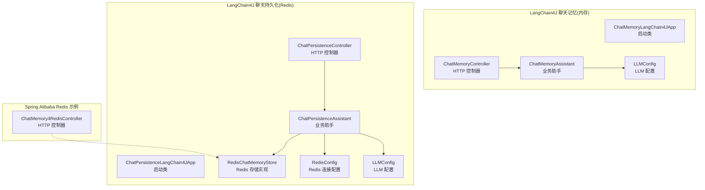
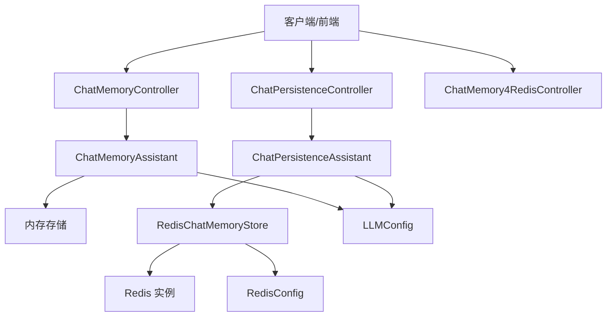
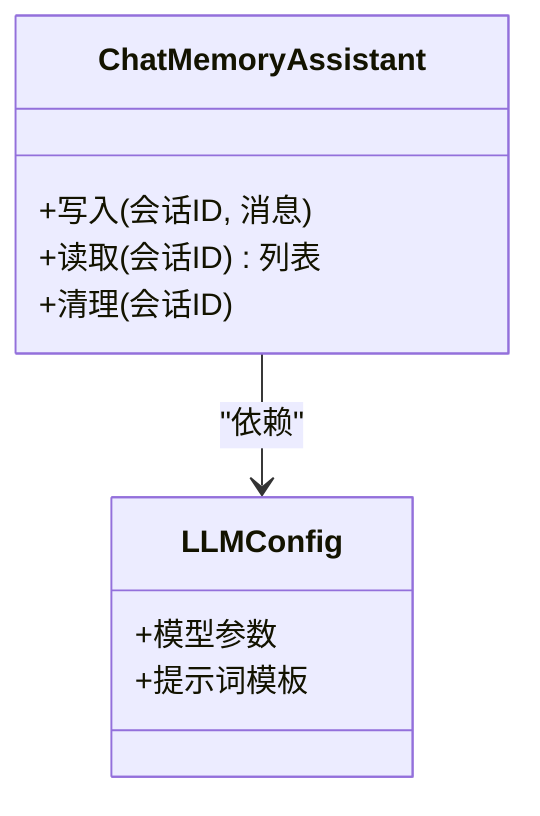
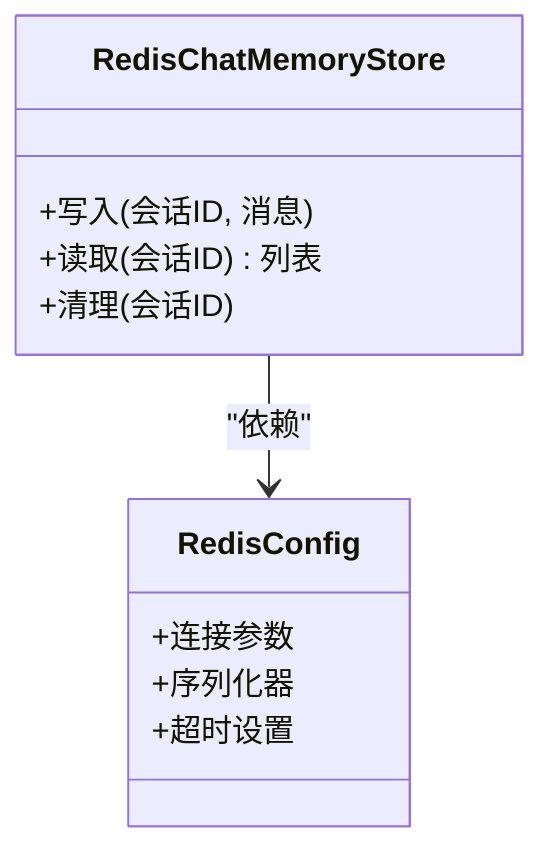
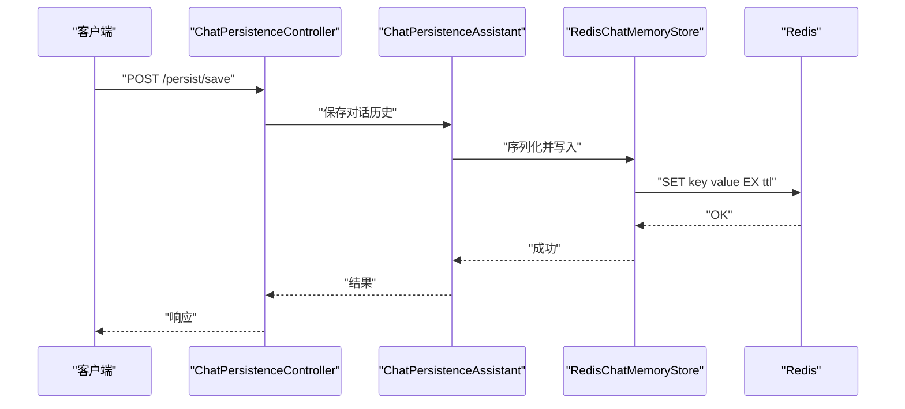
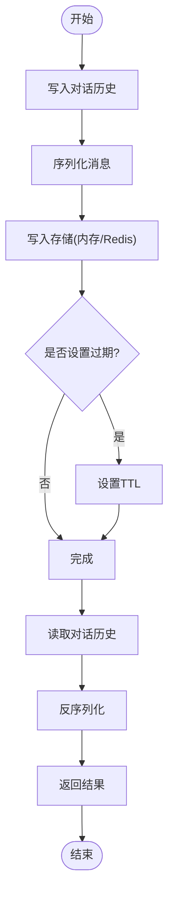
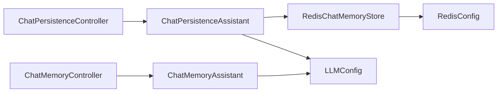

# 持久化存储

<cite>
**本文引用的文件**
- [ChatMemoryLangChain4JApp.java](file://【2】langchain4j-atguiguV5/langchain4j-08chat-memory/src/main/java/com/atguigu/study/ChatMemoryLangChain4JApp.java)
- [ChatMemoryController.java](file://【2】langchain4j-atguiguV5/langchain4j-08chat-memory/src/main/java/com/atguigu/study/controller/ChatMemoryController.java)
- [ChatMemoryAssistant.java](file://【2】langchain4j-atguiguV5/langchain4j-08chat-memory/src/main/java/com/atguigu/study/service/ChatMemoryAssistant.java)
- [ChatPersistenceLangChain4JApp.java](file://【2】langchain4j-atguiguV5/langchain4j-10chat-persistence/src/main/java/com/atguigu/study/ChatPersistenceLangChain4JApp.java)
- [RedisChatMemoryStore.java](file://【2】langchain4j-atguiguV5/langchain4j-10chat-persistence/src/main/java/com/atguigu/study/config/RedisChatMemoryStore.java)
- [RedisConfig.java](file://【2】langchain4j-atguiguV5/langchain4j-10chat-persistence/src/main/java/com/atguigu/study/config/RedisConfig.java)
- [ChatPersistenceController.java](file://【2】langchain4j-atguiguV5/langchain4j-10chat-persistence/src/main/java/com/atguigu/study/controller/ChatPersistenceController.java)
- [ChatPersistenceAssistant.java](file://【2】langchain4j-atguiguV5/langchain4j-10chat-persistence/src/main/java/com/atguigu/study/service/ChatPersistenceAssistant.java)
- [ChatMemory4RedisController.java](file://【1】SpringAIAlibaba-atguiguV1/SAA-08Persistent/src/main/java/com/atguigu/study/controller/ChatMemory4RedisController.java)
- [LLMConfig.java](file://【2】langchain4j-atguiguV5/langchain4j-08chat-memory/src/main/java/com/atguigu/study/config/LLMConfig.java)
- [LLMConfig.java](file://【2】langchain4j-atguiguV5/langchain4j-10chat-persistence/src/main/java/com/atguigu/study/config/LLMConfig.java)
</cite>

## 目录
1. [引言](#引言)
2. [项目结构](#项目结构)
3. [核心组件](#核心组件)
4. [架构总览](#架构总览)
5. [详细组件分析](#详细组件分析)
6. [依赖分析](#依赖分析)
7. [性能考虑](#性能考虑)
8. [故障排查指南](#故障排查指南)
9. [结论](#结论)
10. [附录](#附录)

## 引言
本指南围绕“对话历史持久化”主题，系统梳理并实证分析仓库中的多套实现方案：内存存储、Redis 缓存与数据库存储。文档重点覆盖以下方面：
- ChatMemory 接口的使用方式与存储策略配置
- 数据生命周期管理（写入、读取、过期、清理）
- Redis 集成的完整示例（连接配置、序列化处理、性能优化）
- 不同存储方案的特性与适用场景（内存高性能、Redis 高可用、数据库持久性）
- 备份恢复、容量规划与监控告警最佳实践

## 项目结构
本仓库中与对话历史持久化直接相关的模块主要分布在两个子项目：
- langchain4j-08chat-memory：演示基础的 ChatMemory 使用与内存存储
- langchain4j-10chat-persistence：在上述基础上扩展 Redis 存储与控制器编排
- SAA-08Persistent：Spring Alibaba 示例中的 Redis 对话存储控制器

**图表来源**
- [ChatMemoryLangChain4JApp.java:1-200](file://【2】langchain4j-atguiguV5/langchain4j-08chat-memory/src/main/java/com/atguigu/study/ChatMemoryLangChain4JApp.java#L1-L200)
- [ChatMemoryController.java:1-200](file://【2】langchain4j-atguiguV5/langchain4j-08chat-memory/src/main/java/com/atguigu/study/controller/ChatMemoryController.java#L1-L200)
- [ChatMemoryAssistant.java:1-200](file://【2】langchain4j-atguiguV5/langchain4j-08chat-memory/src/main/java/com/atguigu/study/service/ChatMemoryAssistant.java#L1-L200)
- [ChatPersistenceLangChain4JApp.java:1-200](file://【2】langchain4j-atguiguV5/langchain4j-10chat-persistence/src/main/java/com/atguigu/study/ChatPersistenceLangChain4JApp.java#L1-L200)
- [ChatPersistenceController.java:1-200](file://【2】langchain4j-atguiguV5/langchain4j-10chat-persistence/src/main/java/com/atguigu/study/controller/ChatPersistenceController.java#L1-L200)
- [ChatPersistenceAssistant.java:1-200](file://【2】langchain4j-atguiguV5/langchain4j-10chat-persistence/src/main/java/com/atguigu/study/service/ChatPersistenceAssistant.java#L1-L200)
- [RedisChatMemoryStore.java:1-200](file://【2】langchain4j-atguiguV5/langchain4j-10chat-persistence/src/main/java/com/atguigu/study/config/RedisChatMemoryStore.java#L1-L200)
- [RedisConfig.java:1-200](file://【2】langchain4j-atguiguV5/langchain4j-10chat-persistence/src/main/java/com/atguigu/study/config/RedisConfig.java#L1-L200)
- [ChatMemory4RedisController.java:1-200](file://【1】SpringAIAlibaba-atguiguV1/SAA-08Persistent/src/main/java/com/atguigu/study/controller/ChatMemory4RedisController.java#L1-L200)
- [LLMConfig.java:1-200](file://【2】langchain4j-atguiguV5/langchain4j-08chat-memory/src/main/java/com/atguigu/study/config/LLMConfig.java#L1-L200)
- [LLMConfig.java:1-200](file://【2】langchain4j-atguiguV5/langchain4j-10chat-persistence/src/main/java/com/atguigu/study/config/LLMConfig.java#L1-L200)

**章节来源**
- [ChatMemoryLangChain4JApp.java:1-200](file://【2】langchain4j-atguiguV5/langchain4j-08chat-memory/src/main/java/com/atguigu/study/ChatMemoryLangChain4JApp.java#L1-L200)
- [ChatPersistenceLangChain4JApp.java:1-200](file://【2】langchain4j-atguiguV5/langchain4j-10chat-persistence/src/main/java/com/atguigu/study/ChatPersistenceLangChain4JApp.java#L1-L200)
- [ChatMemory4RedisController.java:1-200](file://【1】SpringAIAlibaba-atguiguV1/SAA-08Persistent/src/main/java/com/atguigu/study/controller/ChatMemory4RedisController.java#L1-L200)

## 核心组件
- ChatMemory 接口与实现
  - 内存存储：通过 ChatMemoryAssistant 在内存中维护会话历史，适合开发测试与低延迟场景
  - Redis 存储：通过 RedisChatMemoryStore 将历史序列化后存入 Redis，适合高并发与跨实例共享
- 控制器层
  - ChatMemoryController：面向内存的交互入口
  - ChatPersistenceController：面向 Redis 的交互入口
  - ChatMemory4RedisController：Spring Alibaba 示例中的 Redis 控制器
- 配置层
  - LLMConfig：统一注入 LLM 相关配置
  - RedisConfig：Redis 连接与序列化配置

**章节来源**
- [ChatMemoryAssistant.java:1-200](file://【2】langchain4j-atguiguV5/langchain4j-08chat-memory/src/main/java/com/atguigu/study/service/ChatMemoryAssistant.java#L1-L200)
- [RedisChatMemoryStore.java:1-200](file://【2】langchain4j-atguiguV5/langchain4j-10chat-persistence/src/main/java/com/atguigu/study/config/RedisChatMemoryStore.java#L1-L200)
- [RedisConfig.java:1-200](file://【2】langchain4j-atguiguV5/langchain4j-10chat-persistence/src/main/java/com/atguigu/study/config/RedisConfig.java#L1-L200)
- [LLMConfig.java:1-200](file://【2】langchain4j-atguiguV5/langchain4j-08chat-memory/src/main/java/com/atguigu/study/config/LLMConfig.java#L1-L200)
- [LLMConfig.java:1-200](file://【2】langchain4j-atguiguV5/langchain4j-10chat-persistence/src/main/java/com/atguigu/study/config/LLMConfig.java#L1-L200)

## 架构总览
下图展示了从控制器到业务助手再到存储实现的数据流向与职责划分。

**图表来源**
- [ChatMemoryController.java:1-200](file://【2】langchain4j-atguiguV5/langchain4j-08chat-memory/src/main/java/com/atguigu/study/controller/ChatMemoryController.java#L1-L200)
- [ChatPersistenceController.java:1-200](file://【2】langchain4j-atguiguV5/langchain4j-10chat-persistence/src/main/java/com/atguigu/study/controller/ChatPersistenceController.java#L1-L200)
- [ChatMemory4RedisController.java:1-200](file://【1】SpringAIAlibaba-atguiguV1/SAA-08Persistent/src/main/java/com/atguigu/study/controller/ChatMemory4RedisController.java#L1-L200)
- [ChatMemoryAssistant.java:1-200](file://【2】langchain4j-atguiguV5/langchain4j-08chat-memory/src/main/java/com/atguigu/study/service/ChatMemoryAssistant.java#L1-L200)
- [ChatPersistenceAssistant.java:1-200](file://【2】langchain4j-atguiguV5/langchain4j-10chat-persistence/src/main/java/com/atguigu/study/service/ChatPersistenceAssistant.java#L1-L200)
- [RedisChatMemoryStore.java:1-200](file://【2】langchain4j-atguiguV5/langchain4j-10chat-persistence/src/main/java/com/atguigu/study/config/RedisChatMemoryStore.java#L1-L200)
- [RedisConfig.java:1-200](file://【2】langchain4j-atguiguV5/langchain4j-10chat-persistence/src/main/java/com/atguigu/study/config/RedisConfig.java#L1-L200)
- [LLMConfig.java:1-200](file://【2】langchain4j-atguiguV5/langchain4j-08chat-memory/src/main/java/com/atguigu/study/config/LLMConfig.java#L1-L200)
- [LLMConfig.java:1-200](file://【2】langchain4j-atguiguV5/langchain4j-10chat-persistence/src/main/java/com/atguigu/study/config/LLMConfig.java#L1-L200)

## 详细组件分析

### 组件一：内存存储（ChatMemoryAssistant）
- 角色定位
  - 作为 ChatMemory 的内存实现，负责在进程内缓存对话历史
  - 适合单实例部署、低延迟、无外部依赖的场景
- 关键行为
  - 写入：接收用户/模型消息，追加到内存列表
  - 读取：按会话 ID 返回历史消息
  - 清理：可结合 TTL 或最大条数策略进行淘汰
- 适用场景
  - 开发联调、小规模内部应用、临时会话

**图表来源**
- [ChatMemoryAssistant.java:1-200](file://【2】langchain4j-atguiguV5/langchain4j-08chat-memory/src/main/java/com/atguigu/study/service/ChatMemoryAssistant.java#L1-L200)
- [LLMConfig.java:1-200](file://【2】langchain4j-atguiguV5/langchain4j-08chat-memory/src/main/java/com/atguigu/study/config/LLMConfig.java#L1-L200)

**章节来源**
- [ChatMemoryAssistant.java:1-200](file://【2】langchain4j-atguiguV5/langchain4j-08chat-memory/src/main/java/com/atguigu/study/service/ChatMemoryAssistant.java#L1-L200)
- [ChatMemoryController.java:1-200](file://【2】langchain4j-atguiguV5/langchain4j-08chat-memory/src/main/java/com/atguigu/study/controller/ChatMemoryController.java#L1-L200)

### 组件二：Redis 存储（RedisChatMemoryStore + RedisConfig）
- 角色定位
  - RedisChatMemoryStore：实现 ChatMemory 的 Redis 版本，负责序列化/反序列化与键空间管理
  - RedisConfig：提供连接池、序列化器、超时等配置
- 关键行为
  - 写入：序列化消息对象，设置过期时间，写入 Redis
  - 读取：根据会话 ID 获取序列化数据并反序列化
  - 过期：利用 Redis TTL 实现自动清理
- 性能优化建议
  - 使用连接池与合适的序列化策略（如 JSON/MessagePack）
  - 键命名规范（命名空间前缀），避免键冲突
  - 批量操作与管道化减少 RTT
  - 合理设置过期时间与内存上限，避免 OOM

**图表来源**
- [RedisChatMemoryStore.java:1-200](file://【2】langchain4j-atguiguV5/langchain4j-10chat-persistence/src/main/java/com/atguigu/study/config/RedisChatMemoryStore.java#L1-L200)
- [RedisConfig.java:1-200](file://【2】langchain4j-atguiguV5/langchain4j-10chat-persistence/src/main/java/com/atguigu/study/config/RedisConfig.java#L1-L200)

**章节来源**
- [RedisChatMemoryStore.java:1-200](file://【2】langchain4j-atguiguV5/langchain4j-10chat-persistence/src/main/java/com/atguigu/study/config/RedisChatMemoryStore.java#L1-L200)
- [RedisConfig.java:1-200](file://【2】langchain4j-atguiguV5/langchain4j-10chat-persistence/src/main/java/com/atguigu/study/config/RedisConfig.java#L1-L200)

### 组件三：控制器与业务编排
- ChatMemoryController（内存）
  - 提供 REST 接口用于写入/读取内存中的对话历史
- ChatPersistenceController（Redis）
  - 提供 REST 接口用于写入/读取 Redis 中的对话历史
- ChatMemory4RedisController（Spring Alibaba）
  - 展示在 Spring Alibaba 场景下的 Redis 对话存储控制器用法

**图表来源**
- [ChatPersistenceController.java:1-200](file://【2】langchain4j-atguiguV5/langchain4j-10chat-persistence/src/main/java/com/atguigu/study/controller/ChatPersistenceController.java#L1-L200)
- [ChatPersistenceAssistant.java:1-200](file://【2】langchain4j-atguiguV5/langchain4j-10chat-persistence/src/main/java/com/atguigu/study/service/ChatPersistenceAssistant.java#L1-L200)
- [RedisChatMemoryStore.java:1-200](file://【2】langchain4j-atguiguV5/langchain4j-10chat-persistence/src/main/java/com/atguigu/study/config/RedisChatMemoryStore.java#L1-L200)

**章节来源**
- [ChatMemoryController.java:1-200](file://【2】langchain4j-atguiguV5/langchain4j-08chat-memory/src/main/java/com/atguigu/study/controller/ChatMemoryController.java#L1-L200)
- [ChatPersistenceController.java:1-200](file://【2】langchain4j-atguiguV5/langchain4j-10chat-persistence/src/main/java/com/atguigu/study/controller/ChatPersistenceController.java#L1-L200)
- [ChatMemory4RedisController.java:1-200](file://【1】SpringAIAlibaba-atguiguV1/SAA-08Persistent/src/main/java/com/atguigu/study/controller/ChatMemory4RedisController.java#L1-L200)

### 组件四：数据生命周期管理
- 写入流程
  - 控制器接收请求 -> 业务助手组织消息 -> 存储实现序列化并落盘
- 读取流程
  - 控制器发起查询 -> 业务助手调用存储 -> 反序列化返回
- 过期与清理
  - Redis：基于 TTL 自动过期；可结合最大长度策略限制历史数量
  - 内存：基于 LRU 或固定窗口大小的淘汰策略
- 备份与恢复
  - Redis：定期 RDB/AOF 备份；恢复时按键空间重建
  - 内存：进程重启即丢失，需依赖上游重放或外部存储

**图表来源**
- [ChatPersistenceAssistant.java:1-200](file://【2】langchain4j-atguiguV5/langchain4j-10chat-persistence/src/main/java/com/atguigu/study/service/ChatPersistenceAssistant.java#L1-L200)
- [RedisChatMemoryStore.java:1-200](file://【2】langchain4j-atguiguV5/langchain4j-10chat-persistence/src/main/java/com/atguigu/study/config/RedisChatMemoryStore.java#L1-L200)

**章节来源**
- [ChatPersistenceAssistant.java:1-200](file://【2】langchain4j-atguiguV5/langchain4j-10chat-persistence/src/main/java/com/atguigu/study/service/ChatPersistenceAssistant.java#L1-L200)
- [RedisChatMemoryStore.java:1-200](file://【2】langchain4j-atguiguV5/langchain4j-10chat-persistence/src/main/java/com/atguigu/study/config/RedisChatMemoryStore.java#L1-L200)

## 依赖分析
- 组件耦合
  - 控制器仅依赖业务助手，业务助手依赖存储实现与配置
  - 存储实现与 RedisConfig 解耦，便于替换与扩展
- 外部依赖
  - Redis 客户端、连接池、序列化库
  - LLM 配置（模型参数、提示词模板等）

**图表来源**
- [ChatMemoryController.java:1-200](file://【2】langchain4j-atguiguV5/langchain4j-08chat-memory/src/main/java/com/atguigu/study/controller/ChatMemoryController.java#L1-L200)
- [ChatPersistenceController.java:1-200](file://【2】langchain4j-atguiguV5/langchain4j-10chat-persistence/src/main/java/com/atguigu/study/controller/ChatPersistenceController.java#L1-L200)
- [ChatMemoryAssistant.java:1-200](file://【2】langchain4j-atguiguV5/langchain4j-08chat-memory/src/main/java/com/atguigu/study/service/ChatMemoryAssistant.java#L1-L200)
- [ChatPersistenceAssistant.java:1-200](file://【2】langchain4j-atguiguV5/langchain4j-10chat-persistence/src/main/java/com/atguigu/study/service/ChatPersistenceAssistant.java#L1-L200)
- [RedisChatMemoryStore.java:1-200](file://【2】langchain4j-atguiguV5/langchain4j-10chat-persistence/src/main/java/com/atguigu/study/config/RedisChatMemoryStore.java#L1-L200)
- [RedisConfig.java:1-200](file://【2】langchain4j-atguiguV5/langchain4j-10chat-persistence/src/main/java/com/atguigu/study/config/RedisConfig.java#L1-L200)
- [LLMConfig.java:1-200](file://【2】langchain4j-atguiguV5/langchain4j-08chat-memory/src/main/java/com/atguigu/study/config/LLMConfig.java#L1-L200)
- [LLMConfig.java:1-200](file://【2】langchain4j-atguiguV5/langchain4j-10chat-persistence/src/main/java/com/atguigu/study/config/LLMConfig.java#L1-L200)

**章节来源**
- [ChatPersistenceLangChain4JApp.java:1-200](file://【2】langchain4j-atguiguV5/langchain4j-10chat-persistence/src/main/java/com/atguigu/study/ChatPersistenceLangChain4JApp.java#L1-L200)
- [ChatMemoryLangChain4JApp.java:1-200](file://【2】langchain4j-atguiguV5/langchain4j-08chat-memory/src/main/java/com/atguigu/study/ChatMemoryLangChain4JApp.java#L1-L200)

## 性能考虑
- 内存存储
  - 优势：极低延迟、简单易用
  - 劣势：无法跨实例共享、进程重启丢失
- Redis 存储
  - 优势：高并发、可横向扩展、支持持久化与集群
  - 劣势：网络开销、序列化成本、运维复杂度
- 序列化与编码
  - 优先选择高效且稳定的序列化格式（如 JSON/MessagePack）
  - 控制消息体积，避免超长上下文导致内存压力
- 连接与池化
  - 合理配置连接池大小、超时与重试
  - 使用管道与批处理降低 RTT
- 过期与淘汰
  - 设置合理的 TTL 与最大长度，避免无限增长
  - 结合热点会话与冷数据分层存储策略

[本节为通用性能建议，无需特定文件引用]

## 故障排查指南
- 常见问题
  - Redis 连接失败：检查主机、端口、认证与网络连通性
  - 序列化异常：确认消息结构与序列化器一致
  - TTL 不生效：核对过期时间设置与键空间策略
  - 内存泄漏：检查会话清理策略与最大长度限制
- 排查步骤
  - 控制台日志与链路追踪
  - Redis Keyspace 事件与慢查询日志
  - 内存占用与 GC 情况
- 建议工具
  - Redis 客户端命令行、监控面板
  - JVM 诊断工具（堆转储、GC 日志）
  - APM/Trace 工具定位瓶颈

**章节来源**
- [RedisChatMemoryStore.java:1-200](file://【2】langchain4j-atguiguV5/langchain4j-10chat-persistence/src/main/java/com/atguigu/study/config/RedisChatMemoryStore.java#L1-L200)
- [RedisConfig.java:1-200](file://【2】langchain4j-atguiguV5/langchain4j-10chat-persistence/src/main/java/com/atguigu/study/config/RedisConfig.java#L1-L200)

## 结论
- 内存存储适合开发与小规模场景，Redis 更适合生产级高并发与跨实例共享
- 通过清晰的控制器-业务助手-存储实现分层，可灵活替换与扩展存储后端
- 建议以 Redis 为主、内存为辅的混合策略，并配套完善的备份、容量与监控体系

[本节为总结性内容，无需特定文件引用]

## 附录
- 最佳实践清单
  - 备份恢复：Redis RDB/AOF、定期快照；内存会话建议上游重放
  - 容量规划：评估消息长度、会话数量、峰值 QPS，预留 20%-30% 缓冲
  - 监控告警：延迟、错误率、内存/磁盘使用率、Redis 连接数与慢查询
  - 安全加固：Redis 认证、网络隔离、只读副本与备份加密

[本节为通用实践建议，无需特定文件引用]