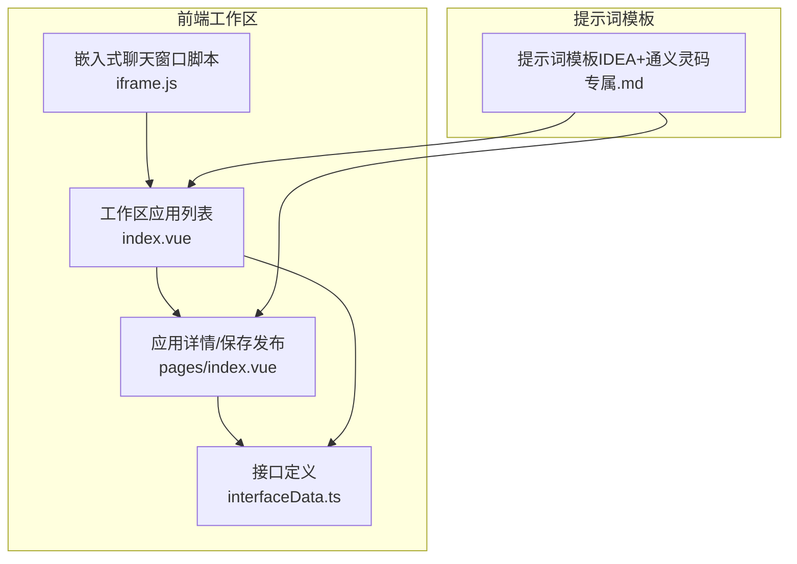
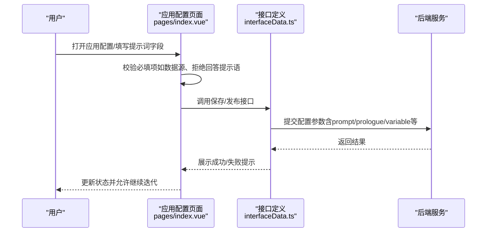
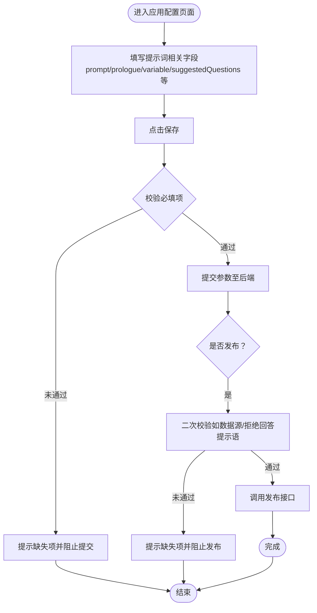
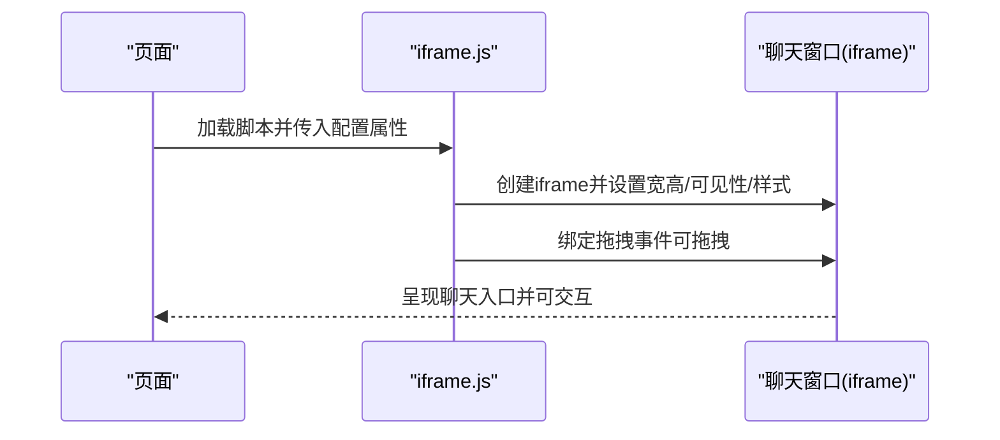
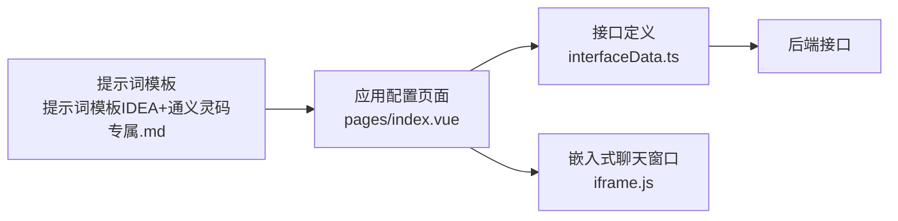

# 提示词工程

<cite>
**本文引用的文件**   
- [提示词模板（IDEA+通义灵码专属）.md](file://【3】工作资料/仓颉项目系统功能文档梳理/提示词模板（IDEA+通义灵码专属）.md)
- [index.vue](file://【3】工作资料/code/仓颉智能体/nlp-frontend-web/src/views/workspace/pages/workApps/pages/index.vue)
- [index.vue](file://【3】工作资料/code/仓颉智能体/nlp-frontend-web/src/views/workspace/pages/workApps/index.vue)
- [iframe.js](file://【3】工作资料/code/仓颉智能体/nlp-frontend-web/public/iframe.js)
- [interfaceData.ts](file://【3】工作资料/code/仓颉智能体/nlp-frontend-web/src/views/workspace/interfaceData.ts)
</cite>

## 目录
1. [引言](#引言)
2. [项目结构](#项目结构)
3. [核心组件](#核心组件)
4. [架构总览](#架构总览)
5. [详细组件分析](#详细组件分析)
6. [依赖分析](#依赖分析)
7. [性能考虑](#性能考虑)
8. [故障排查指南](#故障排查指南)
9. [结论](#结论)
10. [附录](#附录)

## 引言
本指南面向提示词工程实践者，系统阐述提示词设计的基本原则、最佳实践与调试优化策略，并结合仓库中的“IDEA+通义灵码专属”提示词模板，给出可复用的模板与实例路径。文档同时分析前端工作区应用配置中与提示词相关的关键字段（如 prompt、prologue、variable、suggestedQuestions 等），并从工程化角度说明提示词在不同任务类型（问答、创作、推理、分类）中的应用要点与效果评估方法。

## 项目结构
本仓库与提示词工程相关的内容主要分布在以下位置：
- 提示词模板与使用示例：【3】工作资料/仓颉项目系统功能文档梳理/提示词模板（IDEA+通义灵码专属）.md
- 前端工作区应用配置页面：nlp-frontend-web/src/views/workspace/pages/workApps/pages/index.vue
- 前端工作区应用列表与标签页：nlp-frontend-web/src/views/workspace/pages/workApps/index.vue
- 嵌入式聊天窗口脚本：nlp-frontend-web/public/iframe.js
- 前端接口定义：nlp-frontend-web/src/views/workspace/interfaceData.ts

**图表来源**
- [index.vue:154-188](file://【3】工作资料/code/仓颉智能体/nlp-frontend-web/src/views/workspace/pages/workApps/index.vue#L154-L188)
- [index.vue:226-261](file://【3】工作资料/code/仓颉智能体/nlp-frontend-web/src/views/workspace/pages/workApps/pages/index.vue#L226-L261)
- [iframe.js:1-168](file://【3】工作资料/code/仓颉智能体/nlp-frontend-web/public/iframe.js#L1-L168)
- [interfaceData.ts:1-54](file://【3】工作资料/code/仓颉智能体/nlp-frontend-web/src/views/workspace/interfaceData.ts#L1-L54)
- [提示词模板（IDEA+通义灵码专属）.md:1-83](file://【3】工作资料/仓颉项目系统功能文档梳理/提示词模板（IDEA+通义灵码专属）.md#L1-L83)

**章节来源**
- [提示词模板（IDEA+通义灵码专属）.md:1-83](file://【3】工作资料/仓颉项目系统功能文档梳理/提示词模板（IDEA+通义灵码专属）.md#L1-L83)
- [index.vue:154-188](file://【3】工作资料/code/仓颉智能体/nlp-frontend-web/src/views/workspace/pages/workApps/index.vue#L154-L188)
- [index.vue:226-261](file://【3】工作资料/code/仓颉智能体/nlp-frontend-web/src/views/workspace/pages/workApps/pages/index.vue#L226-L261)
- [iframe.js:1-168](file://【3】工作资料/code/仓颉智能体/nlp-frontend-web/public/iframe.js#L1-L168)
- [interfaceData.ts:1-54](file://【3】工作资料/code/仓颉智能体/nlp-frontend-web/src/views/workspace/interfaceData.ts#L1-L54)

## 核心组件
- 提示词模板与示例：提供标准化的提示词结构、角色设定、任务拆解、约束条件与输出格式，便于在不同场景下快速复用与迭代。
- 工作区应用配置页面：承载提示词相关配置项（prompt、prologue、variable、suggestedQuestions 等），并支持保存与发布流程。
- 嵌入式聊天窗口：通过 iframe 脚本实现可拖拽、可配置尺寸的聊天入口，便于在业务页面内集成 LLM 能力。
- 接口定义：统一管理与后端交互的 API，支撑应用配置的增删改查与发布操作。

**章节来源**
- [提示词模板（IDEA+通义灵码专属）.md:1-83](file://【3】工作资料/仓颉项目系统功能文档梳理/提示词模板（IDEA+通义灵码专属）.md#L1-L83)
- [index.vue:375-422](file://【3】工作资料/code/仓颉智能体/nlp-frontend-web/src/views/workspace/pages/workApps/pages/index.vue#L375-L422)
- [iframe.js:1-168](file://【3】工作资料/code/仓颉智能体/nlp-frontend-web/public/iframe.js#L1-L168)
- [interfaceData.ts:1-54](file://【3】工作资料/code/仓颉智能体/nlp-frontend-web/src/views/workspace/interfaceData.ts#L1-L54)

## 架构总览
提示词工程在前端侧的流转路径如下：
- 设计阶段：使用模板生成初稿，明确角色、任务、约束与输出格式。
- 开发阶段：在工作区应用配置页面填写提示词相关字段，并进行保存与验证。
- 集成阶段：通过嵌入式脚本将聊天窗口挂载到业务页面，支持拖拽与尺寸调整。
- 发布阶段：校验配置完整性（如数据源、拒绝回答提示语等），通过接口提交并发布。

**图表来源**
- [index.vue:249-261](file://【3】工作资料/code/仓颉智能体/nlp-frontend-web/src/views/workspace/pages/workApps/pages/index.vue#L249-L261)
- [index.vue:366-373](file://【3】工作资料/code/仓颉智能体/nlp-frontend-web/src/views/workspace/pages/workApps/pages/index.vue#L366-L373)
- [interfaceData.ts:1-54](file://【3】工作资料/code/仓颉智能体/nlp-frontend-web/src/views/workspace/interfaceData.ts#L1-L54)

## 详细组件分析

### 组件A：提示词模板与最佳实践
- 模板结构建议
  - 角色与背景：明确模型身份与系统边界（如“你是资深Java后端工程师，已熟悉仓颉智能体平台的基础架构与核心能力”）。
  - 上下文补充：限定需要追加的参考文档数量，避免上下文溢出；版本更新时可重新发送以覆盖旧认知。
  - 任务拆解：将复杂需求拆分为定位模块、实现思路、数据库表梳理、技术风险与规避、代码实现顺序等步骤。
  - 输出约束：强调只输出与当前需求相关的内容，遵循代码规范，确保方案可直接落地。
- 使用示例
  - 工作流相关需求：限定追加文档范围，聚焦定时触发与应用发布流程。
  - 文件上传与解析需求：结合文件上传与流式输出机制，给出实现顺序与风险点。
- 实操建议
  - 控制文档数量：每次不超过3个，避免上下文过载。
  - 版本同步：文档更新后重新发送，AI会自动覆盖旧认知。
  - 快速复用：将模板存入IDEA的Live Template，一键调用提升效率。

**章节来源**
- [提示词模板（IDEA+通义灵码专属）.md:1-83](file://【3】工作资料/仓颉项目系统功能文档梳理/提示词模板（IDEA+通义灵码专属）.md#L1-L83)

### 组件B：应用配置页面与提示词字段
- 关键字段说明
  - prompt：核心提示词内容，决定模型行为与输出方向。
  - prologue：开场白或引导语，用于建立对话初始状态。
  - variable：变量占位符，支持动态注入上下文。
  - suggestedQuestions：建议问题，提升用户交互体验。
  - llmConfig、dataset、fileUpload、history、modelDeleteFlag、modelStatus、tableMetaDataList、vdbInfo、externalInfo、mcps、processConfigure、retrieval：与模型参数、数据集、文件上传、历史记录、外部信息、流程配置、检索配置等相关的综合配置。
- 保存与发布流程
  - 保存：将当前配置序列化为参数，提交至后端。
  - 发布：在发布前进行必要性校验（如数据源存在、拒绝回答提示语等），通过后端接口完成发布。

**图表来源**
- [index.vue:226-261](file://【3】工作资料/code/仓颉智能体/nlp-frontend-web/src/views/workspace/pages/workApps/pages/index.vue#L226-L261)
- [index.vue:366-373](file://【3】工作资料/code/仓颉智能体/nlp-frontend-web/src/views/workspace/pages/workApps/pages/index.vue#L366-L373)
- [index.vue:375-422](file://【3】工作资料/code/仓颉智能体/nlp-frontend-web/src/views/workspace/pages/workApps/pages/index.vue#L375-L422)

**章节来源**
- [index.vue:226-261](file://【3】工作资料/code/仓颉智能体/nlp-frontend-web/src/views/workspace/pages/workApps/pages/index.vue#L226-L261)
- [index.vue:366-373](file://【3】工作资料/code/仓颉智能体/nlp-frontend-web/src/views/workspace/pages/workApps/pages/index.vue#L366-L373)
- [index.vue:375-422](file://【3】工作资料/code/仓颉智能体/nlp-frontend-web/src/views/workspace/pages/workApps/pages/index.vue#L375-L422)

### 组件C：嵌入式聊天窗口与提示词联动
- 功能特性
  - 支持自定义宽度与高度、默认打开、拖拽移动。
  - 通过 data-* 属性传入 bot-src、图标等，实现灵活配置。
- 与提示词的关系
  - 聊天窗口作为提示词驱动的交互入口，其样式与行为由前端脚本控制；提示词内容由后端配置并通过应用页面下发。

**图表来源**
- [iframe.js:1-168](file://【3】工作资料/code/仓颉智能体/nlp-frontend-web/public/iframe.js#L1-L168)

**章节来源**
- [iframe.js:1-168](file://【3】工作资料/code/仓颉智能体/nlp-frontend-web/public/iframe.js#L1-L168)

### 组件D：接口定义与提示词配置提交
- 接口职责
  - 列表查询、新增、删除、详情、编辑、批量操作、默认设置、应用发布等。
- 与提示词的关系
  - 应用配置页面通过接口提交包含 prompt、prologue、variable、suggestedQuestions 等字段的参数，后端据此生成或更新提示词配置。

**章节来源**
- [interfaceData.ts:1-54](file://【3】工作资料/code/仓颉智能体/nlp-frontend-web/src/views/workspace/interfaceData.ts#L1-L54)

## 依赖分析
- 前端依赖
  - axios：HTTP 请求客户端，用于调用后端接口。
  - pinia/vue-i18n/markdown-it/mermaid 等：提供状态管理、国际化、Markdown 渲染与流程图绘制等能力。
- 提示词工程相关耦合点
  - 应用配置页面与接口层耦合：配置变更通过接口提交，发布流程依赖接口返回状态。
  - 模板与页面耦合：模板用于生成提示词初稿，页面用于落地配置与保存发布。

**图表来源**
- [提示词模板（IDEA+通义灵码专属）.md:1-83](file://【3】工作资料/仓颉项目系统功能文档梳理/提示词模板（IDEA+通义灵码专属）.md#L1-L83)
- [index.vue:226-261](file://【3】工作资料/code/仓颉智能体/nlp-frontend-web/src/views/workspace/pages/workApps/pages/index.vue#L226-L261)
- [interfaceData.ts:1-54](file://【3】工作资料/code/仓颉智能体/nlp-frontend-web/src/views/workspace/interfaceData.ts#L1-L54)
- [iframe.js:1-168](file://【3】工作资料/code/仓颉智能体/nlp-frontend-web/public/iframe.js#L1-L168)

**章节来源**
- [提示词模板（IDEA+通义灵码专属）.md:1-83](file://【3】工作资料/仓颉项目系统功能文档梳理/提示词模板（IDEA+通义灵码专属）.md#L1-L83)
- [index.vue:226-261](file://【3】工作资料/code/仓颉智能体/nlp-frontend-web/src/views/workspace/pages/workApps/pages/index.vue#L226-L261)
- [interfaceData.ts:1-54](file://【3】工作资料/code/仓颉智能体/nlp-frontend-web/src/views/workspace/interfaceData.ts#L1-L54)
- [iframe.js:1-168](file://【3】工作资料/code/仓颉智能体/nlp-frontend-web/public/iframe.js#L1-L168)

## 性能考虑
- 上下文长度控制：限制每次追加的参考文档数量，避免上下文溢出导致性能下降与输出不稳定。
- 配置缓存与增量更新：在前端页面中对配置进行本地缓存与增量更新，减少重复提交与网络开销。
- 图形渲染与资源加载：合理使用 markdown-it、mermaid 等渲染库，避免一次性渲染过多图表造成卡顿。
- 发布前置校验：在前端进行必要的必填项校验，减少无效请求与后端压力。

## 故障排查指南
- 发布失败
  - 现象：发布按钮点击后无响应或报错。
  - 排查：检查数据源是否存在、拒绝回答提示语是否填写；确认接口返回状态与错误提示。
- 配置未生效
  - 现象：修改提示词后刷新仍显示旧内容。
  - 排查：确认保存是否成功、浏览器缓存是否清除、sessionStorage 中的配置是否正确更新。
- 聊天窗口不可拖拽
  - 现象：点击拖拽无效。
  - 排查：检查 iframe.js 的拖拽绑定事件、元素定位与边界计算逻辑。

**章节来源**
- [index.vue:249-261](file://【3】工作资料/code/仓颉智能体/nlp-frontend-web/src/views/workspace/pages/workApps/pages/index.vue#L249-L261)
- [index.vue:366-373](file://【3】工作资料/code/仓颉智能体/nlp-frontend-web/src/views/workspace/pages/workApps/pages/index.vue#L366-L373)
- [iframe.js:129-158](file://【3】工作资料/code/仓颉智能体/nlp-frontend-web/public/iframe.js#L129-L158)

## 结论
提示词工程应以“结构化模板 + 场景化实践 + 工程化落地”为核心路径。通过标准化模板明确角色、任务与约束，结合前端应用配置页面的字段管理与发布流程，最终在业务页面中以嵌入式聊天窗口实现提示词驱动的交互体验。建议持续沉淀模板与最佳实践，形成可复用的知识资产，并在发布前进行严格的前置校验与效果评估。

## 附录
- 提示词模板与示例路径
  - [提示词模板（IDEA+通义灵码专属）.md:1-83](file://【3】工作资料/仓颉项目系统功能文档梳理/提示词模板（IDEA+通义灵码专属）.md#L1-L83)
- 应用配置页面字段说明
  - [应用配置页面 index.vue:375-422](file://【3】工作资料/code/仓颉智能体/nlp-frontend-web/src/views/workspace/pages/workApps/pages/index.vue#L375-L422)
- 嵌入式聊天窗口脚本
  - [iframe.js:1-168](file://【3】工作资料/code/仓颉智能体/nlp-frontend-web/public/iframe.js#L1-L168)
- 接口定义
  - [interfaceData.ts:1-54](file://【3】工作资料/code/仓颉智能体/nlp-frontend-web/src/views/workspace/interfaceData.ts#L1-L54)