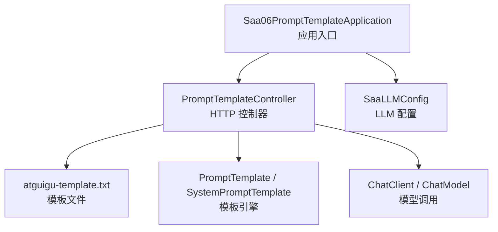
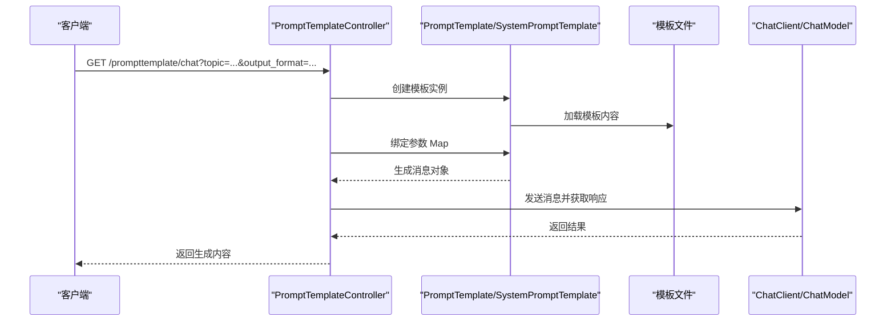
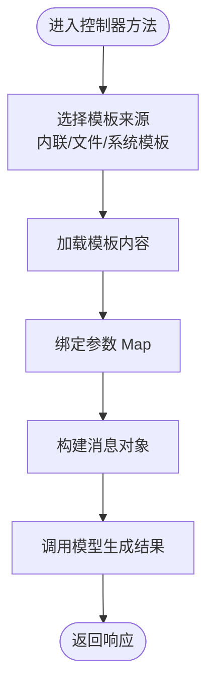
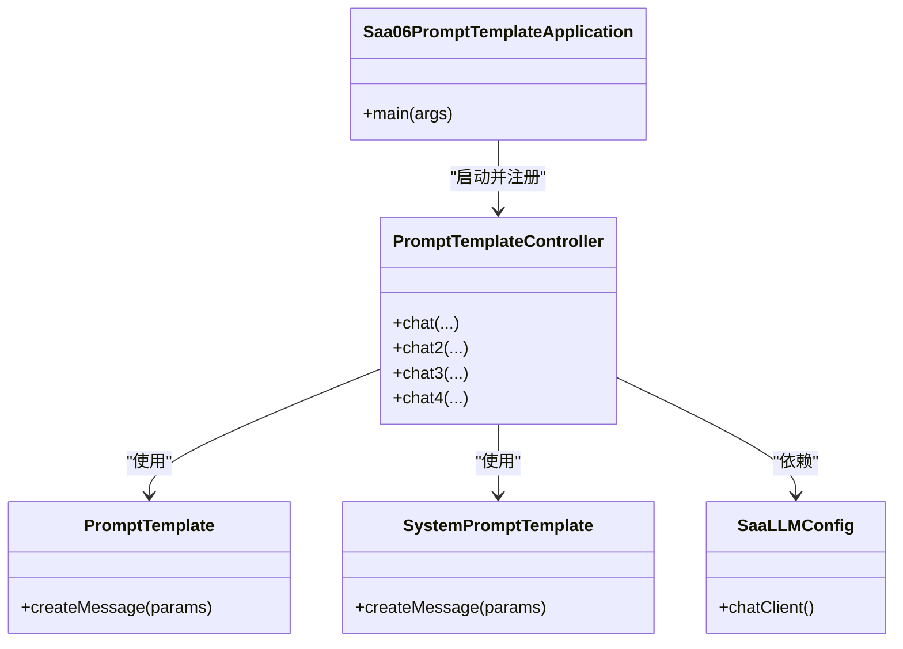
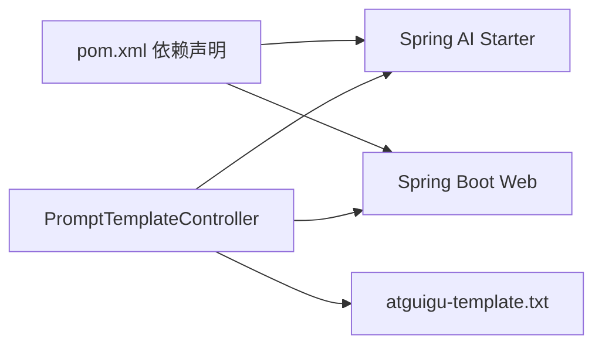

# 提示词模板

<cite>
**本文引用的文件**
- [Saa06PromptTemplateApplication.java](file://【1】SpringAIAlibaba-atguiguV1/SAA-06PromptTemplate/src/main/java/com/atguigu/study/Saa06PromptTemplateApplication.java)
- [application.properties](file://【1】SpringAIAlibaba-atguiguV1/SAA-06PromptTemplate/src/main/resources/application.properties)
- [PromptTemplateController.java](file://【1】SpringAIAlibaba-atguiguV1/SAA-06PromptTemplate/src/main/java/com/atguigu/study/controller/PromptTemplateController.java)
- [SaaLLMConfig.java](file://【1】SpringAIAlibaba-atguiguV1/SAA-06PromptTemplate/src/main/java/com/atguigu/study/config/SaaLLMConfig.java)
- [atguigu-template.txt](file://【1】SpringAIAlibaba-atguiguV1/SAA-06PromptTemplate/src/main/resources/prompttemplate/atguigu-template.txt)
- [Saa06PromptTemplateApplicationTests.java](file://【1】SpringAIAlibaba-atguiguV1/SAA-06PromptTemplate/src/test/java/com/atguigu/study/Saa06PromptTemplateApplicationTests.java)
- [pom.xml](file://【1】SpringAIAlibaba-atguiguV1/SAA-06PromptTemplate/pom.xml)
</cite>

## 目录
1. [引言](#引言)
2. [项目结构](#项目结构)
3. [核心组件](#核心组件)
4. [架构总览](#架构总览)
5. [详细组件分析](#详细组件分析)
6. [依赖分析](#依赖分析)
7. [性能考虑](#性能考虑)
8. [故障排查指南](#故障排查指南)
9. [结论](#结论)
10. [附录](#附录)

## 引言
本指南围绕“提示词模板”模块，系统阐述模板化提示词的设计理念、实现方式与最佳实践。内容涵盖模板语法、参数占位符、动态内容替换、模板加载与参数绑定、结果生成流程，并结合仓库中的 Spring AI 示例工程，给出可复用模板的设计思路与落地方法。通过标准化模板与统一的参数绑定机制，提升开发效率、降低维护成本并改善团队协作。

## 项目结构
该模块位于 Spring AI 示例工程中，采用标准 Spring Boot 结构：入口类、控制器、配置类、资源文件（模板）、测试类与构建配置。模板文件放置于 resources 下的 prompttemplate 目录，控制器负责加载模板、绑定参数并生成最终提示内容。

图表来源
- [Saa06PromptTemplateApplication.java:1-20](file://【1】SpringAIAlibaba-atguiguV1/SAA-06PromptTemplate/src/main/java/com/atguigu/study/Saa06PromptTemplateApplication.java#L1-L20)
- [PromptTemplateController.java:25-140](file://【1】SpringAIAlibaba-atguiguV1/SAA-06PromptTemplate/src/main/java/com/atguigu/study/controller/PromptTemplateController.java#L25-L140)
- [SaaLLMConfig.java:1-200](file://【1】SpringAIAlibaba-atguiguV1/SAA-06PromptTemplate/src/main/java/com/atguigu/study/config/SaaLLMConfig.java#L1-L200)
- [atguigu-template.txt:1-200](file://【1】SpringAIAlibaba-atguiguV1/SAA-06PromptTemplate/src/main/resources/prompttemplate/atguigu-template.txt#L1-L200)

章节来源
- [Saa06PromptTemplateApplication.java:1-20](file://【1】SpringAIAlibaba-atguiguV1/SAA-06PromptTemplate/src/main/java/com/atguigu/study/Saa06PromptTemplateApplication.java#L1-L20)
- [application.properties:1-200](file://【1】SpringAIAlibaba-atguiguV1/SAA-06PromptTemplate/src/main/resources/application.properties#L1-L200)
- [pom.xml:1-200](file://【1】SpringAIAlibaba-atguiguV1/SAA-06PromptTemplate/pom.xml#L1-L200)

## 核心组件
- 应用入口：启动 Spring Boot 应用，扫描组件与配置。
- 控制器：提供多个接口，演示不同模板使用方式（内联模板、外部模板文件、系统提示模板等）。
- 配置类：定义 LLM 客户端或模型 Bean，供控制器注入使用。
- 模板文件：存放可复用的提示词模板，便于集中管理与版本控制。
- 测试类：验证模板加载与参数绑定流程。

章节来源
- [PromptTemplateController.java:25-140](file://【1】SpringAIAlibaba-atguiguV1/SAA-06PromptTemplate/src/main/java/com/atguigu/study/controller/PromptTemplateController.java#L25-L140)
- [SaaLLMConfig.java:1-200](file://【1】SpringAIAlibaba-atguiguV1/SAA-06PromptTemplate/src/main/java/com/atguigu/study/config/SaaLLMConfig.java#L1-L200)
- [atguigu-template.txt:1-200](file://【1】SpringAIAlibaba-atguiguV1/SAA-06PromptTemplate/src/main/resources/prompttemplate/atguigu-template.txt#L1-L200)
- [Saa06PromptTemplateApplicationTests.java:1-200](file://【1】SpringAIAlibaba-atguiguV1/SAA-06PromptTemplate/src/test/java/com/atguigu/study/Saa06PromptTemplateApplicationTests.java#L1-L200)

## 架构总览
下图展示了从 HTTP 请求到模板解析与结果生成的整体流程，包括模板加载、参数绑定、消息构造与模型调用的关键步骤。

图表来源
- [PromptTemplateController.java:44-140](file://【1】SpringAIAlibaba-atguiguV1/SAA-06PromptTemplate/src/main/java/com/atguigu/study/controller/PromptTemplateController.java#L44-L140)
- [atguigu-template.txt:1-200](file://【1】SpringAIAlibaba-atguiguV1/SAA-06PromptTemplate/src/main/resources/prompttemplate/atguigu-template.txt#L1-L200)
- [SaaLLMConfig.java:1-200](file://【1】SpringAIAlibaba-atguiguV1/SAA-06PromptTemplate/src/main/java/com/atguigu/study/config/SaaLLMConfig.java#L1-L200)

## 详细组件分析

### 模板语法与参数占位符
- 占位符语法：使用花括号包裹的变量名作为占位符，如 {topic}、{output_format}、{wordCount}、{systemTopic}、{userTopic} 等。
- 参数绑定：通过 Map 将占位符映射到具体值，实现动态替换。
- 模板来源：既可内嵌在 Java 代码中，也可从类路径下的模板文件加载。

章节来源
- [PromptTemplateController.java:44-140](file://【1】SpringAIAlibaba-atguiguV1/SAA-06PromptTemplate/src/main/java/com/atguigu/study/controller/PromptTemplateController.java#L44-L140)
- [atguigu-template.txt:1-200](file://【1】SpringAIAlibaba-atguiguV1/SAA-06PromptTemplate/src/main/resources/prompttemplate/atguigu-template.txt#L1-L200)

### 模板加载与参数绑定流程
- 内联模板：直接在代码中定义模板字符串，适合简单场景。
- 文件模板：通过 @Value 读取类路径下的模板文件，适合复杂模板与多人协作维护。
- 系统提示模板：使用 SystemPromptTemplate 构造系统级提示，再与用户提示组合。

图表来源
- [PromptTemplateController.java:44-140](file://【1】SpringAIAlibaba-atguiguV1/SAA-06PromptTemplate/src/main/java/com/atguigu/study/controller/PromptTemplateController.java#L44-L140)

### 接口与使用示例
- /prompttemplate/chat：演示内联模板与参数绑定。
- /prompttemplate/chat2：演示从模板文件加载模板并绑定参数。
- /prompttemplate/chat3：演示系统提示模板与用户提示模板的组合使用。
- /prompttemplate/chat4：演示更复杂的参数与模板交互。

章节来源
- [PromptTemplateController.java:44-140](file://【1】SpringAIAlibaba-atguiguV1/SAA-06PromptTemplate/src/main/java/com/atguigu/study/controller/PromptTemplateController.java#L44-L140)

### 类关系与职责

图表来源
- [Saa06PromptTemplateApplication.java:1-20](file://【1】SpringAIAlibaba-atguiguV1/SAA-06PromptTemplate/src/main/java/com/atguigu/study/Saa06PromptTemplateApplication.java#L1-L20)
- [PromptTemplateController.java:25-140](file://【1】SpringAIAlibaba-atguiguV1/SAA-06PromptTemplate/src/main/java/com/atguigu/study/controller/PromptTemplateController.java#L25-L140)
- [SaaLLMConfig.java:1-200](file://【1】SpringAIAlibaba-atguiguV1/SAA-06PromptTemplate/src/main/java/com/atguigu/study/config/SaaLLMConfig.java#L1-L200)

## 依赖分析
- Spring AI Starter：提供 PromptTemplate、SystemPromptTemplate、ChatClient 等能力。
- Spring Boot Web：提供 Web 控制器与自动配置。
- 模板文件依赖：通过 @Value 读取类路径资源，确保模板与代码解耦。

图表来源
- [pom.xml:1-200](file://【1】SpringAIAlibaba-atguiguV1/SAA-06PromptTemplate/pom.xml#L1-L200)
- [PromptTemplateController.java:44-140](file://【1】SpringAIAlibaba-atguiguV1/SAA-06PromptTemplate/src/main/java/com/atguigu/study/controller/PromptTemplateController.java#L44-L140)

章节来源
- [pom.xml:1-200](file://【1】SpringAIAlibaba-atguiguV1/SAA-06PromptTemplate/pom.xml#L1-L200)

## 性能考虑
- 模板缓存：对频繁使用的模板进行缓存，避免重复加载与解析。
- 参数校验：在绑定前校验必填参数，减少无效调用与模型往返。
- 批量处理：对多条请求合并处理时，注意模板与参数的隔离与线程安全。
- 资源定位：模板文件应放置在类路径且命名规范，避免 IO 开销与路径错误。
- 日志与监控：记录模板命中率、参数缺失与异常情况，辅助性能优化。

## 故障排查指南
- 模板未加载：确认模板文件路径与名称正确，检查类路径资源是否打包。
- 占位符未替换：核对 Map 中键名与模板占位符一致，注意大小写与空格。
- 参数缺失：在绑定前进行参数校验，必要时提供默认值或抛出明确异常。
- 接口访问失败：检查控制器方法签名与请求路径，确认依赖注入与配置正确。
- 单元测试：通过测试类验证模板加载与参数绑定流程，确保回归稳定。

章节来源
- [Saa06PromptTemplateApplicationTests.java:1-200](file://【1】SpringAIAlibaba-atguiguV1/SAA-06PromptTemplate/src/test/java/com/atguigu/study/Saa06PromptTemplateApplicationTests.java#L1-L200)
- [PromptTemplateController.java:44-140](file://【1】SpringAIAlibaba-atguiguV1/SAA-06PromptTemplate/src/main/java/com/atguigu/study/controller/PromptTemplateController.java#L44-L140)

## 结论
通过将提示词模板化，可以显著提升提示词的可复用性、可维护性与一致性。结合 Spring AI 的 PromptTemplate 与 SystemPromptTemplate，配合文件化模板与参数绑定机制，能够快速构建标准化的提示词流水线，从而提升开发效率与团队协作质量。建议在团队内制定模板命名规范、参数约定与版本管理策略，持续优化模板性能与稳定性。

## 附录

### 模板文件示例（路径）
- [atguigu-template.txt:1-200](file://【1】SpringAIAlibaba-atguiguV1/SAA-06PromptTemplate/src/main/resources/prompttemplate/atguigu-template.txt#L1-L200)

### Java 实现要点（路径）
- [PromptTemplateController.java:44-140](file://【1】SpringAIAlibaba-atguiguV1/SAA-06PromptTemplate/src/main/java/com/atguigu/study/controller/PromptTemplateController.java#L44-L140)
- [SaaLLMConfig.java:1-200](file://【1】SpringAIAlibaba-atguiguV1/SAA-06PromptTemplate/src/main/java/com/atguigu/study/config/SaaLLMConfig.java#L1-L200)

### 关键接口定义（路径）
- [PromptTemplateController.java:44-140](file://【1】SpringAIAlibaba-atguiguV1/SAA-06PromptTemplate/src/main/java/com/atguigu/study/controller/PromptTemplateController.java#L44-L140)