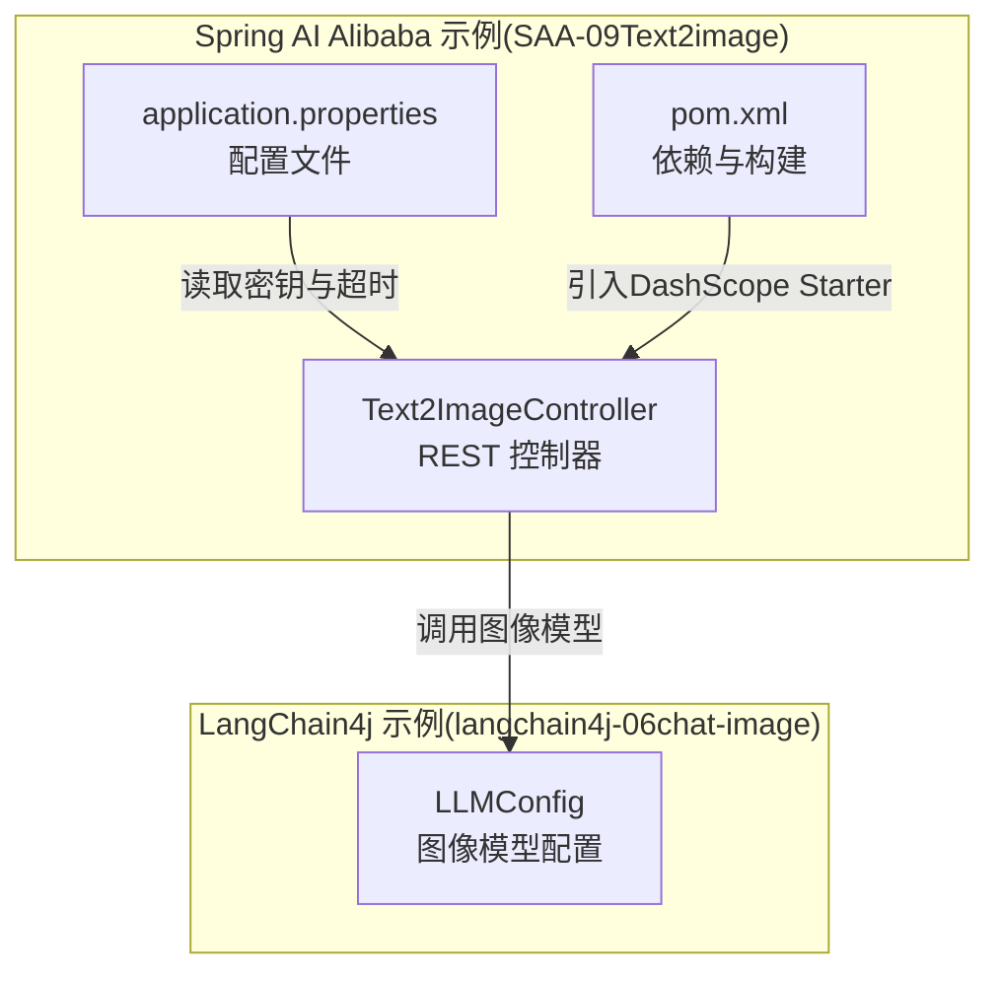
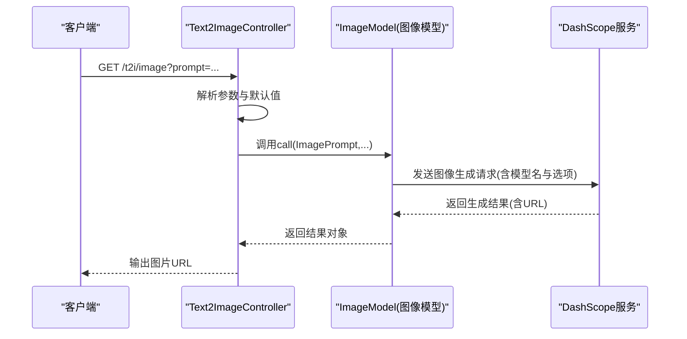
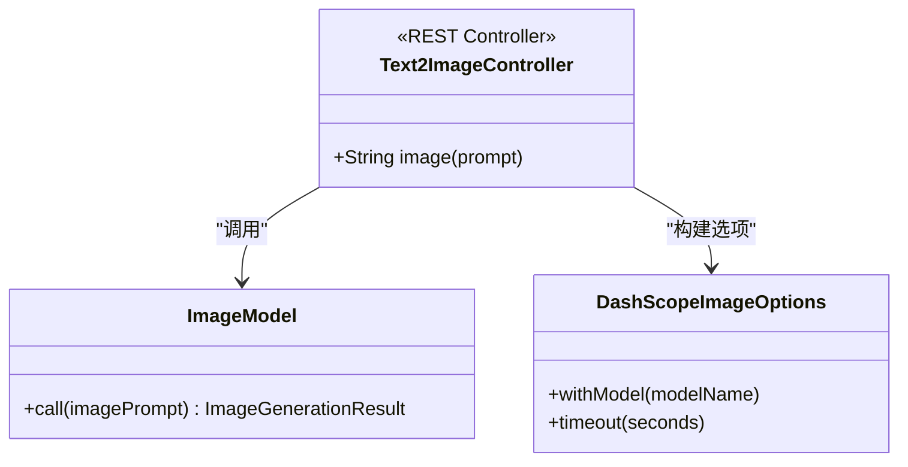
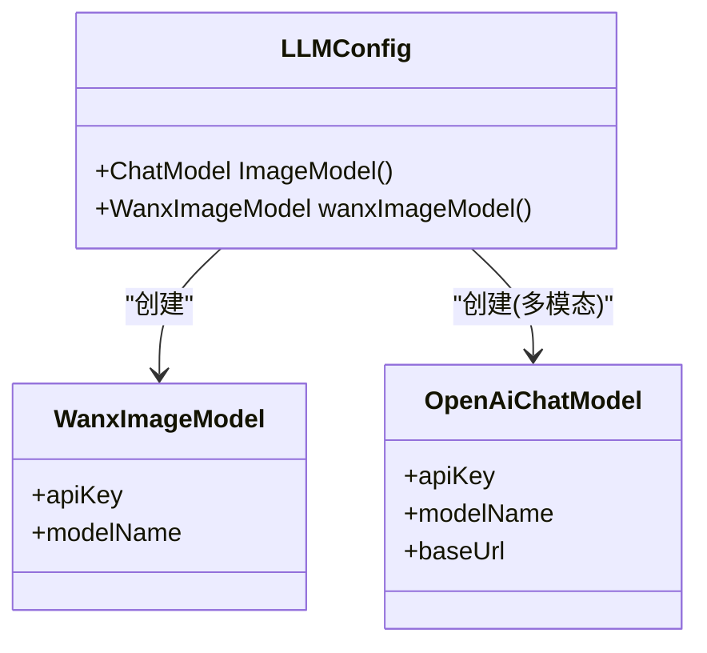
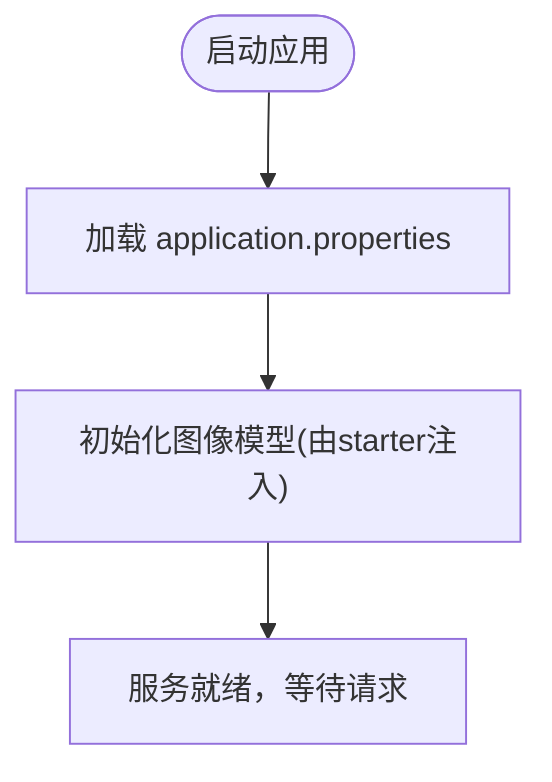
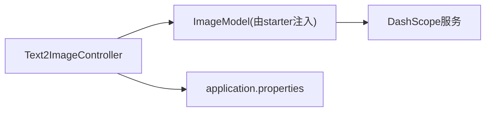

# 文本到图像

<cite>
**本文引用的文件**
- [Text2ImageController.java](file://【1】SpringAIAlibaba-atguiguV1/SAA-09Text2image/src/main/java/com/atguigu/study/controller/Text2ImageController.java)
- [application.properties](file://【1】SpringAIAlibaba-atguiguV1/SAA-09Text2image/src/main/resources/application.properties)
- [pom.xml](file://【1】SpringAIAlibaba-atguiguV1/SAA-09Text2image/pom.xml)
- [LLMConfig.java](file://【2】langchain4j-atguiguV5/langchain4j-06chat-image/src/main/java/com/atguigu/study/config/LLMConfig.java)
</cite>

## 目录
1. [引言](#引言)
2. [项目结构](#项目结构)
3. [核心组件](#核心组件)
4. [架构总览](#架构总览)
5. [详细组件分析](#详细组件分析)
6. [依赖分析](#依赖分析)
7. [性能考虑](#性能考虑)
8. [故障排查指南](#故障排查指南)
9. [结论](#结论)
10. [附录](#附录)

## 引言
本技术文档围绕“文本到图像”模块展开，目标是帮助开发者与使用者理解并高效使用AI模型将自然语言描述转化为图像。文档覆盖以下方面：
- 模型选择与适配：重点介绍通义千问系列图像生成模型（如 wanx2.1-t2i-turbo）与多模态模型（如 qwen-vl-max）在本仓库中的应用方式。
- 参数配置与输出格式：说明提示词处理、图像生成选项（如超时、模型名）、以及返回结果的URL获取路径。
- API调用示例：给出REST接口的调用步骤与关键参数，便于快速集成。
- 质量控制与风格调整：解释分辨率、风格标签等可调项在当前代码中的体现与扩展方向。
- 性能优化与成本控制：基于现有配置提出优化建议，并强调安全合规与版权注意事项。

## 项目结构
本仓库中与“文本到图像”直接相关的核心模块位于两个子项目中：
- Spring AI Alibaba 示例模块（SAA-09Text2image）：提供基于Spring Web的最小可用REST接口，调用DashScope图像生成能力。
- LangChain4j 示例模块（langchain4j-06chat-image）：通过配置类注入Wanx图像模型，演示图像生成能力与多模态模型的组合使用。

**图表来源**
- [Text2ImageController.java:31-58](file://【1】SpringAIAlibaba-atguiguV1/SAA-09Text2image/src/main/java/com/atguigu/study/controller/Text2ImageController.java#L31-L58)
- [application.properties:10-15](file://【1】SpringAIAlibaba-atguiguV1/SAA-09Text2image/src/main/resources/application.properties#L10-L15)
- [pom.xml:14-41](file://【1】SpringAIAlibaba-atguiguV1/SAA-09Text2image/pom.xml#L14-L41)
- [LLMConfig.java:35-42](file://【2】langchain4j-atguiguV5/langchain4j-06chat-image/src/main/java/com/atguigu/study/config/LLMConfig.java#L35-L42)

**章节来源**
- [Text2ImageController.java:1-59](file://【1】SpringAIAlibaba-atguiguV1/SAA-09Text2image/src/main/java/com/atguigu/study/controller/Text2ImageController.java#L1-L59)
- [application.properties:1-15](file://【1】SpringAIAlibaba-atguiguV1/SAA-09Text2image/src/main/resources/application.properties#L1-L15)
- [pom.xml:1-76](file://【1】SpringAIAlibaba-atguiguV1/SAA-09Text2image/pom.xml#L1-L76)
- [LLMConfig.java:1-44](file://【2】langchain4j-atguiguV5/langchain4j-06chat-image/src/main/java/com/atguigu/study/config/LLMConfig.java#L1-L44)

## 核心组件
- REST控制器（SAA-09Text2image）
  - 提供GET接口用于接收文本提示词，调用图像模型生成结果，并返回图片URL。
  - 关键点：固定使用图像生成模型名；通过DashScope图像选项进行调用封装。
- 配置文件（SAA-09Text2image）
  - 设置DashScope API密钥与图像生成超时时间，保障调用稳定性。
- 依赖声明（SAA-09Text2image）
  - 引入spring-ai-alibaba DashScope Starter，支撑图像生成能力。
- 图像模型配置（LangChain4j）
  - 通过@Bean定义Wanx图像模型，指定API密钥与模型名；同时提供多模态模型配置作为对比参考。

**章节来源**
- [Text2ImageController.java:31-58](file://【1】SpringAIAlibaba-atguiguV1/SAA-09Text2image/src/main/java/com/atguigu/study/controller/Text2ImageController.java#L31-L58)
- [application.properties:10-15](file://【1】SpringAIAlibaba-atguiguV1/SAA-09Text2image/src/main/resources/application.properties#L10-L15)
- [pom.xml:14-41](file://【1】SpringAIAlibaba-atguiguV1/SAA-09Text2image/pom.xml#L14-L41)
- [LLMConfig.java:35-42](file://【2】langchain4j-atguiguV5/langchain4j-06chat-image/src/main/java/com/atguigu/study/config/LLMConfig.java#L35-L42)

## 架构总览
下图展示了从HTTP请求到图像生成与结果返回的关键流程：

**图表来源**
- [Text2ImageController.java:46-57](file://【1】SpringAIAlibaba-atguiguV1/SAA-09Text2image/src/main/java/com/atguigu/study/controller/Text2ImageController.java#L46-L57)

## 详细组件分析

### 组件A：文本到图像控制器（SAA-09Text2image）
该控制器提供单一REST接口，负责接收提示词、构造图像生成请求并返回结果URL。其职责清晰、耦合度低，便于独立部署与测试。

**图表来源**
- [Text2ImageController.java:31-58](file://【1】SpringAIAlibaba-atguiguV1/SAA-09Text2image/src/main/java/com/atguigu/study/controller/Text2ImageController.java#L31-L58)

**章节来源**
- [Text2ImageController.java:1-59](file://【1】SpringAIAlibaba-atguiguV1/SAA-09Text2image/src/main/java/com/atguigu/study/controller/Text2ImageController.java#L1-L59)

### 组件B：图像生成模型配置（LangChain4j）
LangChain4j示例通过配置类注入Wanx图像模型，便于在更复杂的链路中复用。该配置展示了模型名、API密钥与基础地址的设定方式。

**图表来源**
- [LLMConfig.java:16-43](file://【2】langchain4j-atguiguV5/langchain4j-06chat-image/src/main/java/com/atguigu/study/config/LLMConfig.java#L16-L43)

**章节来源**
- [LLMConfig.java:1-44](file://【2】langchain4j-atguiguV5/langchain4j-06chat-image/src/main/java/com/atguigu/study/config/LLMConfig.java#L1-L44)

### 组件C：配置与依赖（SAA-09Text2image）
- application.properties：集中管理DashScope API密钥与图像生成超时时间，确保调用稳定与可观察性。
- pom.xml：引入DashScope Starter，简化SDK接入与版本管理。

**图表来源**
- [application.properties:10-15](file://【1】SpringAIAlibaba-atguiguV1/SAA-09Text2image/src/main/resources/application.properties#L10-L15)
- [pom.xml:14-41](file://【1】SpringAIAlibaba-atguiguV1/SAA-09Text2image/pom.xml#L14-L41)

**章节来源**
- [application.properties:1-15](file://【1】SpringAIAlibaba-atguiguV1/SAA-09Text2image/src/main/resources/application.properties#L1-L15)
- [pom.xml:1-76](file://【1】SpringAIAlibaba-atguiguV1/SAA-09Text2image/pom.xml#L1-L76)

## 依赖分析
- 组件内聚与解耦
  - 控制器仅关注HTTP请求与结果返回，模型调用细节由框架注入的ImageModel承担，保持高内聚、低耦合。
- 外部依赖
  - spring-ai-alibaba DashScope Starter：提供统一的图像生成SDK封装，简化认证与调用流程。
- 潜在循环依赖
  - 当前模块间无循环依赖，接口清晰，利于扩展。

**图表来源**
- [Text2ImageController.java:36-37](file://【1】SpringAIAlibaba-atguiguV1/SAA-09Text2image/src/main/java/com/atguigu/study/controller/Text2ImageController.java#L36-L37)
- [application.properties:10-15](file://【1】SpringAIAlibaba-atguiguV1/SAA-09Text2image/src/main/resources/application.properties#L10-L15)
- [pom.xml:14-41](file://【1】SpringAIAlibaba-atguiguV1/SAA-09Text2image/pom.xml#L14-L41)

**章节来源**
- [Text2ImageController.java:1-59](file://【1】SpringAIAlibaba-atguiguV1/SAA-09Text2image/src/main/java/com/atguigu/study/controller/Text2ImageController.java#L1-L59)
- [application.properties:1-15](file://【1】SpringAIAlibaba-atguiguV1/SAA-09Text2image/src/main/resources/application.properties#L1-L15)
- [pom.xml:1-76](file://【1】SpringAIAlibaba-atguiguV1/SAA-09Text2image/pom.xml#L1-L76)

## 性能考虑
- 超时与重试
  - 已在配置中设置图像生成超时时间，建议根据业务SLA进一步评估是否需要增加重试策略或超时阈值。
- 并发与资源
  - 在高并发场景下，建议对控制器层增加限流与熔断保护，避免上游服务压力过大。
- 结果缓存
  - 对于重复提示词的图像生成，可在应用层引入缓存策略以降低调用频次与成本。
- 日志与监控
  - 建议在控制器与模型调用处埋点，记录耗时、成功率与错误码，便于后续性能优化。

[本节为通用建议，无需特定文件引用]

## 故障排查指南
- 认证失败
  - 检查配置文件中的API密钥是否正确、有效且未过期。
- 调用超时
  - 观察超时配置是否合理，必要时适当提高超时阈值或优化网络环境。
- 返回空结果
  - 确认提示词是否符合模型要求，避免过于敏感或模糊的描述。
- 版权与合规
  - 严格遵守模型服务条款与使用范围，避免生成涉及侵权或违规内容。

**章节来源**
- [application.properties:10-15](file://【1】SpringAIAlibaba-atguiguV1/SAA-09Text2image/src/main/resources/application.properties#L10-L15)
- [Text2ImageController.java:46-57](file://【1】SpringAIAlibaba-atguiguV1/SAA-09Text2image/src/main/java/com/atguigu/study/controller/Text2ImageController.java#L46-L57)

## 结论
本模块以简洁的REST接口与标准的DashScope SDK封装，实现了从文本提示词到图像URL的快速落地。通过LangChain4j示例，还可进一步探索多模态模型与复杂链路的集成方式。建议在生产环境中完善超时与重试、限流与缓存、日志与监控等机制，并始终遵循版权与合规要求。

[本节为总结性内容，无需特定文件引用]

## 附录

### API调用示例（步骤说明）
- 请求方法与路径
  - GET /t2i/image
- 查询参数
  - prompt：文本提示词（默认值为示例提示词）
- 返回内容
  - 图像URL字符串
- 调用要点
  - 确保已正确配置DashScope API密钥与超时时间
  - 如需自定义模型或生成选项，可在控制器中扩展DashScope图像选项

**章节来源**
- [Text2ImageController.java:46-57](file://【1】SpringAIAlibaba-atguiguV1/SAA-09Text2image/src/main/java/com/atguigu/study/controller/Text2ImageController.java#L46-L57)
- [application.properties:10-15](file://【1】SpringAIAlibaba-atguiguV1/SAA-09Text2image/src/main/resources/application.properties#L10-L15)

### 模型与参数对照（基于仓库实现）
- 图像生成模型
  - 模型名：wanx2.1-t2i-turbo（在控制器与LangChain4j配置中均有体现）
- 多模态模型
  - 模型名：qwen-vl-max（LangChain4j配置中提供）
- 关键参数
  - API密钥：通过配置文件集中管理
  - 超时：图像生成超时时间在配置文件中设置

**章节来源**
- [Text2ImageController.java:33-34](file://【1】SpringAIAlibaba-atguiguV1/SAA-09Text2image/src/main/java/com/atguigu/study/controller/Text2ImageController.java#L33-L34)
- [LLMConfig.java:35-42](file://【2】langchain4j-atguiguV5/langchain4j-06chat-image/src/main/java/com/atguigu/study/config/LLMConfig.java#L35-L42)
- [application.properties:10-15](file://【1】SpringAIAlibaba-atguiguV1/SAA-09Text2image/src/main/resources/application.properties#L10-L15)