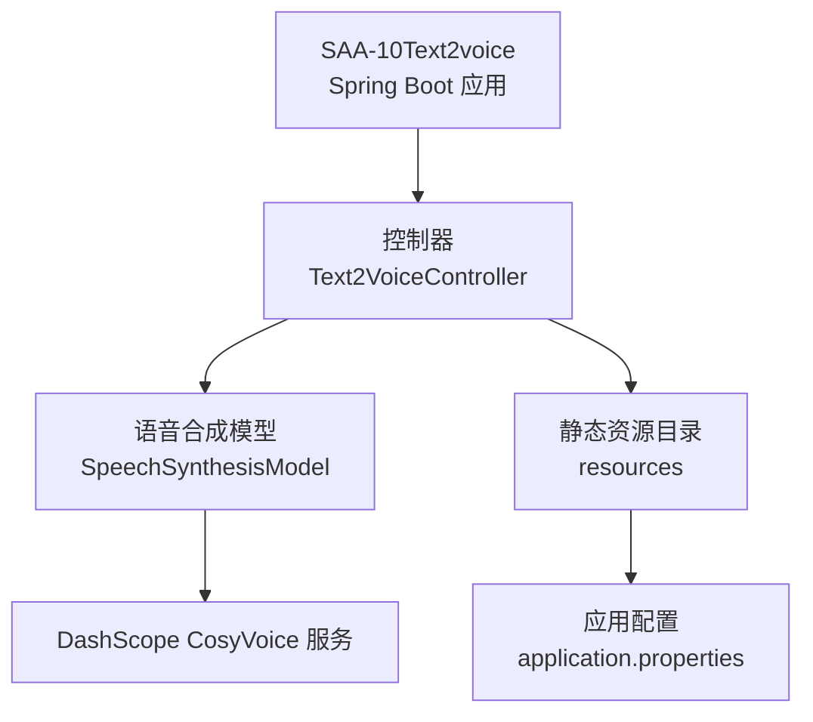
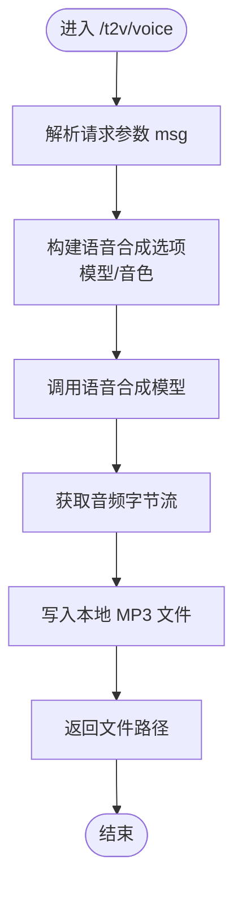
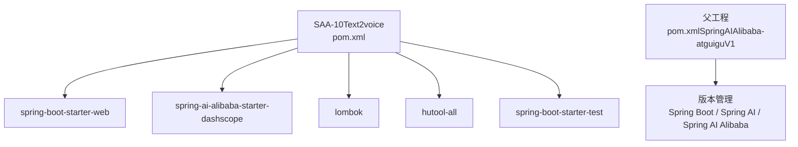

# 文本到语音

<cite>
**本文引用的文件**   
- [Text2VoiceController.java](file://【1】SpringAIAlibaba-atguiguV1/SAA-10Text2voice/src/main/java/com/atguigu/study/controller/Text2VoiceController.java)
- [application.properties](file://【1】SpringAIAlibaba-atguiguV1/SAA-10Text2voice/src/main/resources/application.properties)
- [pom.xml](file://【1】SpringAIAlibaba-atguiguV1/SAA-10Text2voice/pom.xml)
- [pom.xml（父工程）](file://【1】SpringAIAlibaba-atguiguV1/pom.xml)
- [HELP.md（SAA-10Text2voice）](file://【1】SpringAIAlibaba-atguiguV1/SAA-10Text2voice/HELP.md)
</cite>

## 目录
1. [引言](#引言)
2. [项目结构](#项目结构)
3. [核心组件](#核心组件)
4. [架构总览](#架构总览)
5. [详细组件分析](#详细组件分析)
6. [依赖分析](#依赖分析)
7. [性能考虑](#性能考虑)
8. [故障排查指南](#故障排查指南)
9. [结论](#结论)
10. [附录](#附录)

## 引言
本技术实现指南围绕“文本到语音”模块展开，基于仓库中的 Spring AI Alibaba 示例工程，系统讲解从文本输入到音频输出的完整链路：文本预处理、语音参数配置、调用云端语音合成模型、音频字节流落盘与播放。同时给出语音模型选择建议、参数调节方法、音频质量优化策略、延迟优化与用户体验改进建议，帮助读者在实际项目中快速落地并持续优化 TTS 能力。

## 项目结构
该模块位于 Spring AI Alibaba 示例工程中，采用标准 Spring Boot 结构，核心入口为控制器层，负责接收文本、构建语音合成参数、调用 DashScope CosyVoice 模型并保存音频文件。

**图表来源**
- [Text2VoiceController.java:1-66](file://【1】SpringAIAlibaba-atguiguV1/SAA-10Text2voice/src/main/java/com/atguigu/study/controller/Text2VoiceController.java#L1-L66)
- [application.properties:1-12](file://【1】SpringAIAlibaba-atguiguV1/SAA-10Text2voice/src/main/resources/application.properties#L1-L12)

**章节来源**
- [Text2VoiceController.java:1-66](file://【1】SpringAIAlibaba-atguiguV1/SAA-10Text2voice/src/main/java/com/atguigu/study/controller/Text2VoiceController.java#L1-L66)
- [application.properties:1-12](file://【1】SpringAIAlibaba-atguiguV1/SAA-10Text2voice/src/main/resources/application.properties#L1-L12)

## 核心组件
- 控制器层：提供 REST 接口，接收文本参数，构建语音合成选项，调用模型并落盘音频文件。
- 语音合成模型：封装 DashScope 的 CosyVoice 语音合成能力，支持模型与音色选择。
- 应用配置：设置服务端口、字符集与 DashScope API Key。

关键要点
- 文本输入：通过 GET 请求参数接收待合成文本，默认值便于快速测试。
- 语音参数：模型名、音色名在控制器内常量定义，便于统一管理与切换。
- 输出：将模型返回的音频字节流写入本地 MP3 文件，返回文件路径以供下载或播放。

**章节来源**
- [Text2VoiceController.java:33-64](file://【1】SpringAIAlibaba-atguiguV1/SAA-10Text2voice/src/main/java/com/atguigu/study/controller/Text2VoiceController.java#L33-L64)
- [application.properties:1-12](file://【1】SpringAIAlibaba-atguiguV1/SAA-10Text2voice/src/main/resources/application.properties#L1-L12)

## 架构总览
下图展示了从客户端到云端语音模型的调用链路，以及本地落盘的关键步骤。

```mermaid
sequenceDiagram
participant Client as "客户端"
participant Controller as "Text2VoiceController"
participant Model as "SpeechSynthesisModel"
participant DashScope as "DashScope CosyVoice"
participant FS as "本地文件系统"
Client->>Controller : GET /t2v/voice?msg=...
Controller->>Controller : 解析参数/构造选项
Controller->>Model : call(SpeechSynthesisPrompt, Options)
Model->>DashScope : 发送合成请求
DashScope-->>Model : 返回音频字节流
Model-->>Controller : 返回响应结果
Controller->>FS : 写入MP3文件
Controller-->>Client : 返回文件路径
```

**图表来源**
- [Text2VoiceController.java:38-64](file://【1】SpringAIAlibaba-atguiguV1/SAA-10Text2voice/src/main/java/com/atguigu/study/controller/Text2VoiceController.java#L38-L64)

## 详细组件分析

### 控制器与路由
- 路由：GET /t2v/voice
- 参数：msg（默认提示文本）
- 行为：构建 DashScope 语音合成选项，调用模型，将音频字节流写入 MP3 文件，返回文件路径

**图表来源**
- [Text2VoiceController.java:38-64](file://【1】SpringAIAlibaba-atguiguV1/SAA-10Text2voice/src/main/java/com/atguigu/study/controller/Text2VoiceController.java#L38-L64)

**章节来源**
- [Text2VoiceController.java:33-64](file://【1】SpringAIAlibaba-atguiguV1/SAA-10Text2voice/src/main/java/com/atguigu/study/controller/Text2VoiceController.java#L33-L64)

### 语音参数配置与音色选择
- 模型：CosyVoice（在控制器中以常量形式指定）
- 音色：通过常量定义，便于集中管理与切换
- 语速：当前示例未显式设置；可在扩展时引入对应选项进行调节

最佳实践
- 将模型与音色配置放入配置文件或环境变量，避免硬编码
- 提供多音色枚举与映射，支持动态选择
- 在业务层对语速、音高等参数进行统一抽象

**章节来源**
- [Text2VoiceController.java:27-31](file://【1】SpringAIAlibaba-atguiguV1/SAA-10Text2voice/src/main/java/com/atguigu/study/controller/Text2VoiceController.java#L27-L31)

### 音频生成与落盘
- 输入：文本字符串
- 处理：DashScope 语音合成模型返回音频字节流
- 输出：本地 MP3 文件，返回文件绝对路径

注意事项
- 文件路径需确保可写权限
- 建议为每个请求生成唯一文件名，避免并发冲突
- 可根据业务需要返回字节流或直接流式传输，减少磁盘 IO

**章节来源**
- [Text2VoiceController.java:40-64](file://【1】SpringAIAlibaba-atguiguV1/SAA-10Text2voice/src/main/java/com/atguigu/study/controller/Text2VoiceController.java#L40-L64)

### 语音模型选择与对比（概念性说明）
以下为常见 TTS 模型的特性与适用场景，便于在实际项目中进行模型选择与参数权衡（概念性内容，非代码实现）：

- Tacotron 系列
  - 特点：端到端神经声学建模，适合高保真语音合成
  - 适用：对音质要求较高、可接受较长推理时延的场景
  - 注意：训练成本高，部署需注意显存与推理时延

- FastSpeech 系列
  - 特点：非自回归、端到端，推理速度快
  - 适用：实时性要求高、对音质略有妥协的场景
  - 注意：需关注韵律与自然度的平衡

- CosyVoice（本示例所用）
  - 特点：支持中文多音色、可定制音色与语速
  - 适用：中文场景、多音色需求、云端调用便捷
  - 注意：网络依赖与带宽影响首包时延

选择标准
- 语言与音色：是否覆盖目标语言与音色需求
- 实时性：推理时延与首包时延要求
- 音质：主观听感与客观指标（如 MOS）
- 成本：训练/部署/调用成本与资源占用
- 易用性：SDK/接口易用性与生态支持

## 依赖分析
该模块通过 Spring AI Alibaba Starter 与 DashScope SDK 进行集成，核心依赖如下：

**图表来源**
- [pom.xml（SAA-10Text2voice）:14-41](file://【1】SpringAIAlibaba-atguiguV1/SAA-10Text2voice/pom.xml#L14-L41)
- [pom.xml（父工程）:38-78](file://【1】SpringAIAlibaba-atguiguV1/pom.xml#L38-L78)

**章节来源**
- [pom.xml（SAA-10Text2voice）:14-41](file://【1】SpringAIAlibaba-atguiguV1/SAA-10Text2voice/pom.xml#L14-L41)
- [pom.xml（父工程）:38-78](file://【1】SpringAIAlibaba-atguiguV1/pom.xml#L38-L78)

## 性能考虑
- 首包时延
  - 减少网络往返：优先使用就近地域的 DashScope 服务
  - 预热模型：在业务低峰期预热实例，降低首次调用时延
- 并发与吞吐
  - 控制线程池与连接池大小，避免过载
  - 对高频短文本可采用缓存策略（如相同文本命中缓存）
- I/O 优化
  - 直接流式传输音频字节流给客户端，减少磁盘写入
  - 若必须落盘，使用异步写入与唯一文件名，避免阻塞主线程
- 编解码与格式
  - 优先使用 MP3/WAV 等通用格式，兼顾体积与兼容性
  - 对实时场景可考虑更低开销的音频格式（如 PCM），但需评估带宽与延迟
- 资源与成本
  - 合理设置超时与重试策略，避免资源浪费
  - 监控调用量与错误率，按需扩容实例

## 故障排查指南
- 网络与鉴权
  - 确认 DashScope API Key 正确且有效
  - 检查网络连通性与代理设置
- 参数校验
  - 文本长度与特殊字符处理，避免模型拒绝
  - 模型与音色名称是否正确
- I/O 与路径
  - 确认目标路径存在且具备写权限
  - 避免并发写入同一文件名导致冲突
- 错误处理
  - 捕获异常并记录日志，返回明确的错误信息
  - 对网络抖动与超时进行重试与降级

**章节来源**
- [application.properties:11-12](file://【1】SpringAIAlibaba-atguiguV1/SAA-10Text2voice/src/main/resources/application.properties#L11-L12)
- [Text2VoiceController.java:56-61](file://【1】SpringAIAlibaba-atguiguV1/SAA-10Text2voice/src/main/java/com/atguigu/study/controller/Text2VoiceController.java#L56-L61)

## 结论
本指南基于仓库中的 SAA-10Text2voice 示例，给出了从文本到音频的完整实现路径，并结合实际工程实践提出参数配置、音色选择、音频落盘与性能优化建议。对于更复杂的业务场景，可进一步扩展参数维度（如语速、音高、韵律）、引入缓存与流式传输、完善监控与告警体系，从而在保证音质的同时提升用户体验与系统稳定性。

## 附录
- 快速开始
  - 启动应用后访问 GET /t2v/voice?msg=你的文本
  - 查看返回的文件路径并打开 MP3 播放
- 扩展方向
  - 引入配置中心与环境变量，支持动态切换模型与音色
  - 增加语速、音高等参数的动态调节
  - 支持流式输出与 WebSocket 推送，改善交互体验