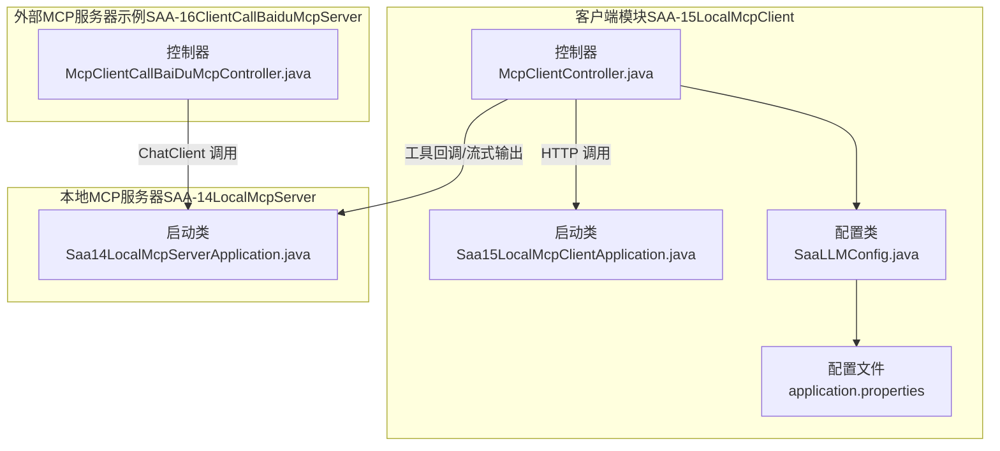
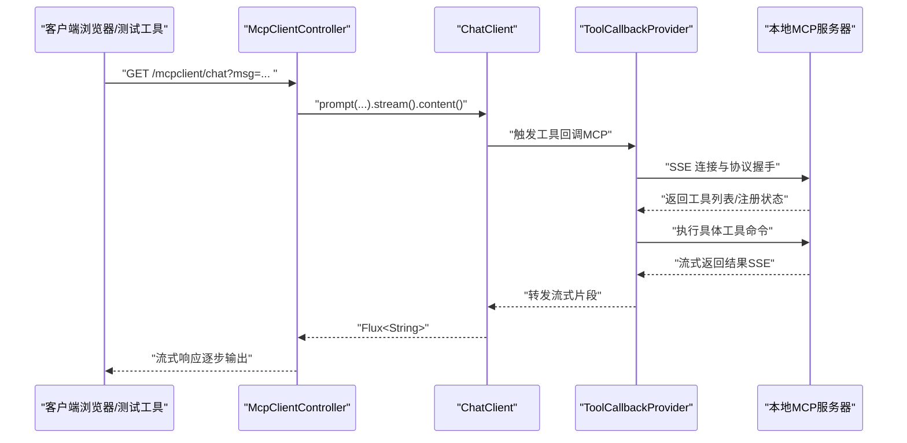
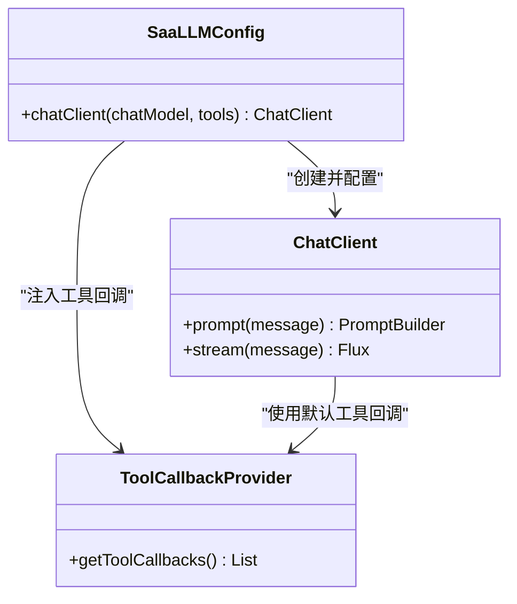
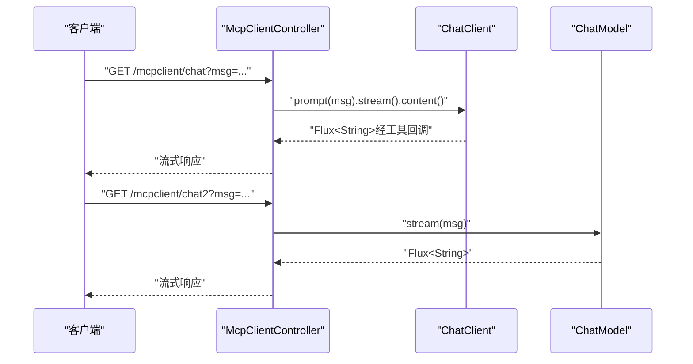
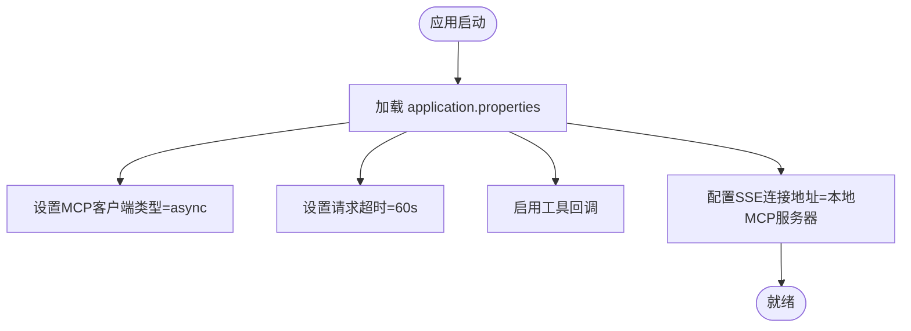
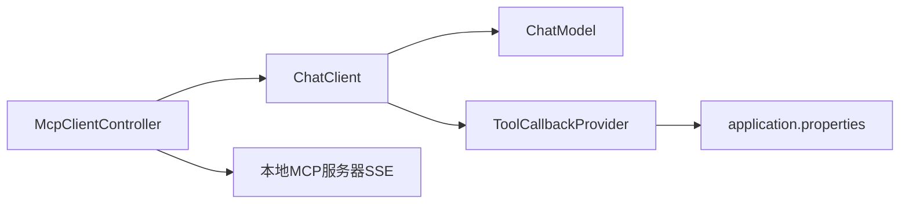

# 本地MCP客户端

<cite>
**本文引用的文件**
- [Saa15LocalMcpClientApplication.java](file://【1】SpringAIAlibaba-atguiguV1/SAA-15LocalMcpClient/src/main/java/com/atguigu/study/Saa15LocalMcpClientApplication.java)
- [SaaLLMConfig.java](file://【1】SpringAIAlibaba-atguiguV1/SAA-15LocalMcpClient/src/main/java/com/atguigu/study/config/SaaLLMConfig.java)
- [McpClientController.java](file://【1】SpringAIAlibaba-atguiguV1/SAA-15LocalMcpClient/src/main/java/com/atguigu/study/controller/McpClientController.java)
- [application.properties](file://【1】SpringAIAlibaba-atguiguV1/SAA-15LocalMcpClient/src/main/resources/application.properties)
- [Saa14LocalMcpServerApplication.java](file://【1】SpringAIAlibaba-atguiguV1/SAA-14LocalMcpServer/src/main/java/com/atguigu/study/Saa14LocalMcpServerApplication.java)
- [McpClientCallBaiDuMcpController.java](file://【1】SpringAIAlibaba-atguiguV1/SAA-16ClientCallBaiduMcpServer/src/main/java/com/atguigu/study/controller/McpClientCallBaiDuMcpController.java)
</cite>

## 目录
1. [引言](#引言)
2. [项目结构](#项目结构)
3. [核心组件](#核心组件)
4. [架构总览](#架构总览)
5. [详细组件分析](#详细组件分析)
6. [依赖分析](#依赖分析)
7. [性能考虑](#性能考虑)
8. [故障排查指南](#故障排查指南)
9. [结论](#结论)
10. [附录](#附录)

## 引言
本指南面向在Spring AI Alibaba应用中集成本地MCP客户端的开发者，围绕以下目标展开：如何配置MCP客户端、如何通过工具回调实现工具调用、如何与本地MCP服务器进行协议握手与命令执行、如何处理错误与重连、以及性能优化与最佳实践。文中所有实现细节均来自仓库中的实际代码文件。

## 项目结构
本地MCP客户端位于“SAA-15LocalMcpClient”模块，核心由启动类、配置类、控制器与应用配置组成；本地MCP服务器位于“SAA-14LocalMcpServer”模块；另有“SAA-16ClientCallBaiduMcpServer”演示了通过ChatClient调用外部MCP服务器的模式，可作为对比参考。

**图示来源**
- [Saa15LocalMcpClientApplication.java:1-16](file://【1】SpringAIAlibaba-atguiguV1/SAA-15LocalMcpClient/src/main/java/com/atguigu/study/Saa15LocalMcpClientApplication.java#L1-L16)
- [SaaLLMConfig.java:1-25](file://【1】SpringAIAlibaba-atguiguV1/SAA-15LocalMcpClient/src/main/java/com/atguigu/study/config/SaaLLMConfig.java#L1-L25)
- [McpClientController.java:1-42](file://【1】SpringAIAlibaba-atguiguV1/SAA-15LocalMcpClient/src/main/java/com/atguigu/study/controller/McpClientController.java#L1-L42)
- [application.properties:1-17](file://【1】SpringAIAlibaba-atguiguV1/SAA-15LocalMcpClient/src/main/resources/application.properties#L1-L17)
- [Saa14LocalMcpServerApplication.java:1-20](file://【1】SpringAIAlibaba-atguiguV1/SAA-14LocalMcpServer/src/main/java/com/atguigu/study/Saa14LocalMcpServerApplication.java#L1-L20)
- [McpClientCallBaiDuMcpController.java:1-60](file://【1】SpringAIAlibaba-atguiguV1/SAA-16ClientCallBaiduMcpServer/src/main/java/com/atguigu/study/controller/McpClientCallBaiDuMcpController.java#L1-L60)

**章节来源**
- [Saa15LocalMcpClientApplication.java:1-16](file://【1】SpringAIAlibaba-atguiguV1/SAA-15LocalMcpClient/src/main/java/com/atguigu/study/Saa15LocalMcpClientApplication.java#L1-L16)
- [SaaLLMConfig.java:1-25](file://【1】SpringAIAlibaba-atguiguV1/SAA-15LocalMcpClient/src/main/java/com/atguigu/study/config/SaaLLMConfig.java#L1-L25)
- [McpClientController.java:1-42](file://【1】SpringAIAlibaba-atguiguV1/SAA-15LocalMcpClient/src/main/java/com/atguigu/study/controller/McpClientController.java#L1-L42)
- [application.properties:1-17](file://【1】SpringAIAlibaba-atguiguV1/SAA-15LocalMcpClient/src/main/resources/application.properties#L1-L17)

## 核心组件
- 启动类：负责应用引导与上下文加载。
- 配置类：定义ChatClient Bean，启用工具回调（ToolCallbackProvider），使ChatClient具备MCP工具调用能力。
- 控制器：提供HTTP接口，分别演示“使用MCP工具回调”的流式对话与“不使用MCP”的普通对话。
- 应用配置：设置MCP客户端类型、超时、回调开关及SSE连接地址（指向本地MCP服务器）。

关键要点
- ChatClient通过默认工具回调启用MCP工具调用，工具注册与执行由工具回调提供者统一管理。
- 控制器暴露两个接口：/mcpclient/chat（走MCP工具回调）、/mcpclient/chat2（直连ChatModel，不走工具回调）。

**章节来源**
- [SaaLLMConfig.java:17-23](file://【1】SpringAIAlibaba-atguiguV1/SAA-15LocalMcpClient/src/main/java/com/atguigu/study/config/SaaLLMConfig.java#L17-L23)
- [McpClientController.java:27-40](file://【1】SpringAIAlibaba-atguiguV1/SAA-15LocalMcpClient/src/main/java/com/atguigu/study/controller/McpClientController.java#L27-L40)
- [application.properties:13-17](file://【1】SpringAIAlibaba-atguiguV1/SAA-15LocalMcpClient/src/main/resources/application.properties#L13-L17)

## 架构总览
下图展示了客户端与本地MCP服务器的交互路径：客户端通过ChatClient发起请求，经由工具回调触发本地MCP服务器的工具注册与命令执行，最终以SSE流式返回结果。

**图示来源**
- [McpClientController.java:27-33](file://【1】SpringAIAlibaba-atguiguV1/SAA-15LocalMcpClient/src/main/java/com/atguigu/study/controller/McpClientController.java#L27-L33)
- [SaaLLMConfig.java:17-23](file://【1】SpringAIAlibaba-atguiguV1/SAA-15LocalMcpClient/src/main/java/com/atguigu/study/config/SaaLLMConfig.java#L17-L23)
- [application.properties:14-17](file://【1】SpringAIAlibaba-atguiguV1/SAA-15LocalMcpClient/src/main/resources/application.properties#L14-L17)
- [Saa14LocalMcpServerApplication.java:1-20](file://【1】SpringAIAlibaba-atguiguV1/SAA-14LocalMcpServer/src/main/java/com/atguigu/study/Saa14LocalMcpServerApplication.java#L1-L20)

## 详细组件分析

### 组件A：MCP客户端配置（SaaLLMConfig）
职责
- 定义ChatClient Bean，注入ChatModel与ToolCallbackProvider。
- 将工具回调集合设置为ChatClient的默认工具回调，从而启用MCP工具调用。

实现要点
- 通过builder模式构建ChatClient，并设置默认工具回调。
- 工具回调来源于ToolCallbackProvider，其内部管理MCP工具注册与执行。

**图示来源**
- [SaaLLMConfig.java:17-23](file://【1】SpringAIAlibaba-atguiguV1/SAA-15LocalMcpClient/src/main/java/com/atguigu/study/config/SaaLLMConfig.java#L17-L23)

**章节来源**
- [SaaLLMConfig.java:1-25](file://【1】SpringAIAlibaba-atguiguV1/SAA-15LocalMcpClient/src/main/java/com/atguigu/study/config/SaaLLMConfig.java#L1-L25)

### 组件B：MCP客户端控制器（McpClientController）
职责
- 提供HTTP接口，演示两种对话模式：
  - 使用MCP工具回调的流式对话（/mcpclient/chat）
  - 不使用MCP的普通对话（/mcpclient/chat2）

关键流程
- /mcpclient/chat：通过ChatClient.prompt(...).stream().content()触发工具回调，最终以Flux<String>流式输出。
- /mcpclient/chat2：直接调用ChatModel.stream(...)，不经过工具回调。

**图示来源**
- [McpClientController.java:27-40](file://【1】SpringAIAlibaba-atguiguV1/SAA-15LocalMcpClient/src/main/java/com/atguigu/study/controller/McpClientController.java#L27-L40)

**章节来源**
- [McpClientController.java:1-42](file://【1】SpringAIAlibaba-atguiguV1/SAA-15LocalMcpClient/src/main/java/com/atguigu/study/controller/McpClientController.java#L1-L42)

### 组件C：应用配置（application.properties）
职责
- 设置MCP客户端类型（异步）、请求超时、工具回调开关。
- 配置SSE连接地址，指向本地MCP服务器。

关键项
- spring.ai.mcp.client.type=async：启用异步MCP客户端。
- spring.ai.mcp.client.request-timeout=60s：请求超时配置。
- spring.ai.mcp.client.toolcallback.enabled=true：启用工具回调。
- spring.ai.mcp.client.sse.connections.mcp-server1.url=http://localhost:8014：本地MCP服务器SSE地址。

**图示来源**
- [application.properties:13-17](file://【1】SpringAIAlibaba-atguiguV1/SAA-15LocalMcpClient/src/main/resources/application.properties#L13-L17)

**章节来源**
- [application.properties:1-17](file://【1】SpringAIAlibaba-atguiguV1/SAA-15LocalMcpClient/src/main/resources/application.properties#L1-L17)

### 组件D：本地MCP服务器（SAA-14LocalMcpServer）
职责
- 作为本地MCP服务器，提供工具注册与命令执行能力，供客户端通过SSE连接与协议握手使用。

注意
- 该模块的启动类用于验证本地MCP服务器可用性，确保客户端SSE连接可达。

**章节来源**
- [Saa14LocalMcpServerApplication.java:1-20](file://【1】SpringAIAlibaba-atguiguV1/SAA-14LocalMcpServer/src/main/java/com/atguigu/study/Saa14LocalMcpServerApplication.java#L1-L20)

### 组件E：外部MCP服务器调用示例（SAA-16ClientCallBaiduMcpServer）
职责
- 展示通过ChatClient调用外部MCP服务器的方式，便于对比本地与远程MCP调用差异。

要点
- 控制器中声明了ChatClient（具备MCP调用能力）与ChatModel（不具备MCP调用能力），用于演示对比。

**章节来源**
- [McpClientCallBaiDuMcpController.java:1-60](file://【1】SpringAIAlibaba-atguiguV1/SAA-16ClientCallBaiduMcpServer/src/main/java/com/atguigu/study/controller/McpClientCallBaiDuMcpController.java#L1-L60)

## 依赖分析
- 组件耦合
  - McpClientController依赖ChatClient与ChatModel。
  - ChatClient依赖ChatModel与ToolCallbackProvider。
  - ToolCallbackProvider的工具回调集合由配置文件中的MCP客户端参数驱动。
- 外部依赖
  - 本地MCP服务器通过SSE连接提供工具注册与命令执行。
  - 外部MCP服务器示例（百度）通过ChatClient进行调用，可作为远程场景参考。

**图示来源**
- [McpClientController.java:21-25](file://【1】SpringAIAlibaba-atguiguV1/SAA-15LocalMcpClient/src/main/java/com/atguigu/study/controller/McpClientController.java#L21-L25)
- [SaaLLMConfig.java:17-23](file://【1】SpringAIAlibaba-atguiguV1/SAA-15LocalMcpClient/src/main/java/com/atguigu/study/config/SaaLLMConfig.java#L17-L23)
- [application.properties:13-17](file://【1】SpringAIAlibaba-atguiguV1/SAA-15LocalMcpClient/src/main/resources/application.properties#L13-L17)
- [Saa14LocalMcpServerApplication.java:1-20](file://【1】SpringAIAlibaba-atguiguV1/SAA-14LocalMcpServer/src/main/java/com/atguigu/study/Saa14LocalMcpServerApplication.java#L1-L20)

**章节来源**
- [McpClientController.java:1-42](file://【1】SpringAIAlibaba-atguiguV1/SAA-15LocalMcpClient/src/main/java/com/atguigu/study/controller/McpClientController.java#L1-L42)
- [SaaLLMConfig.java:1-25](file://【1】SpringAIAlibaba-atguiguV1/SAA-15LocalMcpClient/src/main/java/com/atguigu/study/config/SaaLLMConfig.java#L1-L25)
- [application.properties:1-17](file://【1】SpringAIAlibaba-atguiguV1/SAA-15LocalMcpClient/src/main/resources/application.properties#L1-L17)

## 性能考虑
- 异步客户端类型：配置为异步（async）可提升并发与吞吐，适合高负载场景。
- 请求超时：合理设置超时时间，避免长时间阻塞影响用户体验。
- 流式输出：使用Flux进行流式输出，降低首字节延迟，改善交互体验。
- SSE连接：确保本地MCP服务器SSE连接稳定，避免频繁断连导致重试开销。

## 故障排查指南
- 无法连接本地MCP服务器
  - 检查SSE连接地址是否正确（application.properties中配置）。
  - 确认本地MCP服务器已启动且端口可用。
- 工具回调未生效
  - 确认工具回调开关已启用。
  - 检查ChatClient默认工具回调是否正确注入。
- 超时或响应缓慢
  - 调整请求超时配置。
  - 评估本地MCP服务器处理能力与网络状况。
- 对比远程MCP调用
  - 可参考外部MCP服务器调用示例，确认ChatClient配置一致。

**章节来源**
- [application.properties:13-17](file://【1】SpringAIAlibaba-atguiguV1/SAA-15LocalMcpClient/src/main/resources/application.properties#L13-L17)
- [SaaLLMConfig.java:17-23](file://【1】SpringAIAlibaba-atguiguV1/SAA-15LocalMcpClient/src/main/java/com/atguigu/study/config/SaaLLMConfig.java#L17-L23)
- [McpClientController.java:27-40](file://【1】SpringAIAlibaba-atguiguV1/SAA-15LocalMcpClient/src/main/java/com/atguigu/study/controller/McpClientController.java#L27-L40)
- [Saa14LocalMcpServerApplication.java:1-20](file://【1】SpringAIAlibaba-atguiguV1/SAA-14LocalMcpServer/src/main/java/com/atguigu/study/Saa14LocalMcpServerApplication.java#L1-L20)
- [McpClientCallBaiDuMcpController.java:1-60](file://【1】SpringAIAlibaba-atguiguV1/SAA-16ClientCallBaiduMcpServer/src/main/java/com/atguigu/study/controller/McpClientCallBaiDuMcpController.java#L1-L60)

## 结论
通过在Spring AI Alibaba中引入MCP客户端，结合工具回调与SSE流式输出，可以实现对本地MCP服务器的高效工具调用。配置上建议采用异步客户端、合理设置超时与SSE连接地址；在运行时关注工具回调开关与服务器可用性，以获得稳定、低延迟的智能应用扩展能力。

## 附录
- 快速开始
  - 启动本地MCP服务器模块，确保SSE端口可用。
  - 启动本地MCP客户端模块，访问控制器接口进行测试。
- 最佳实践
  - 明确区分“使用MCP工具回调”与“不使用MCP”的接口用途。
  - 对外暴露的接口应统一编码与字符集设置，保证兼容性。
  - 在生产环境适当调整超时与并发参数，结合监控指标持续优化。