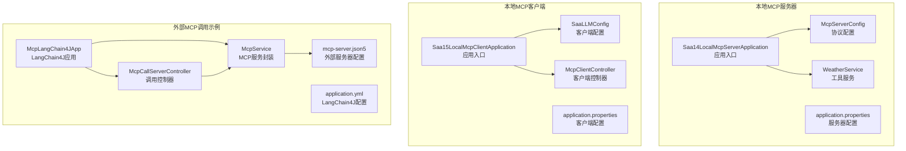
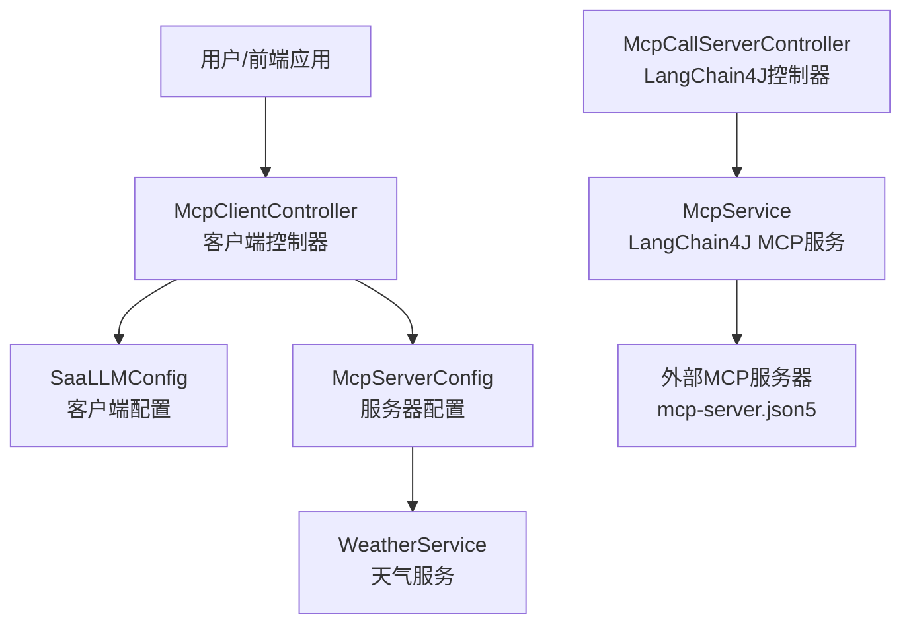
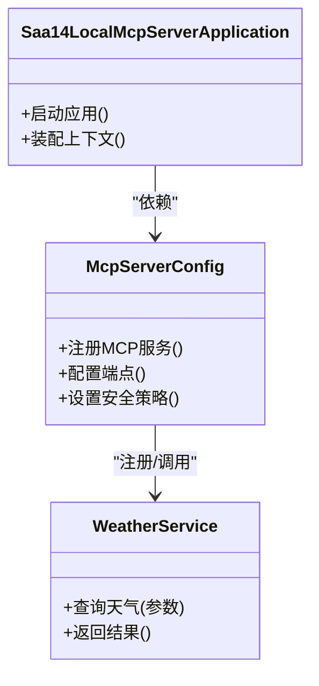
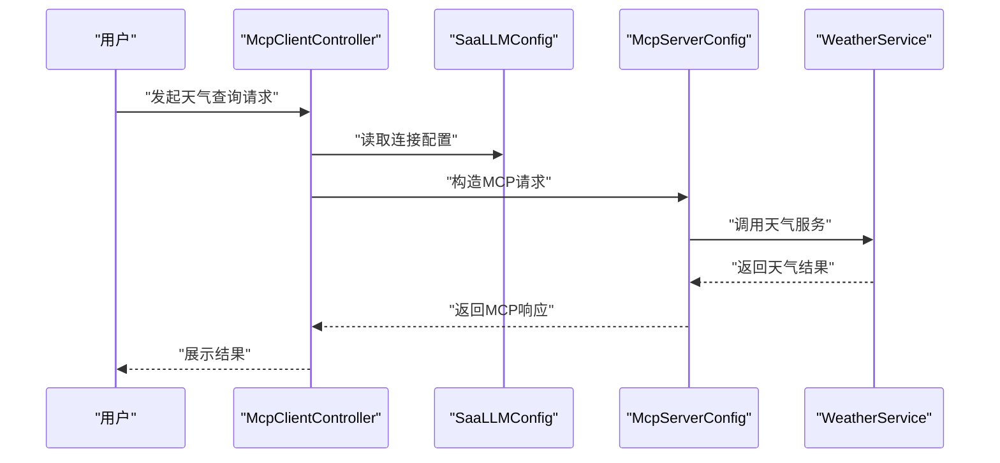
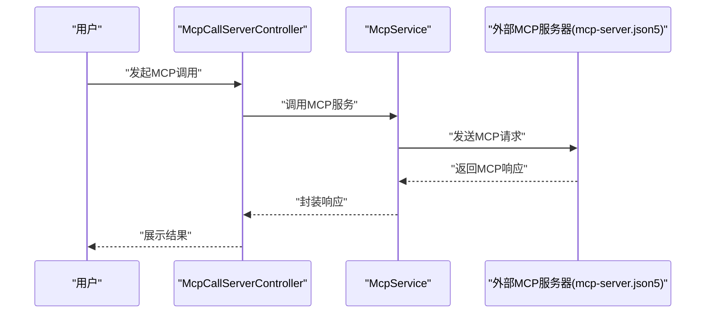
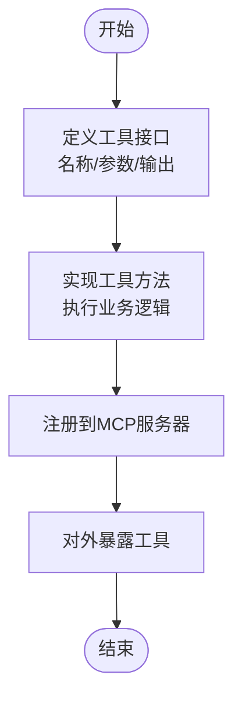
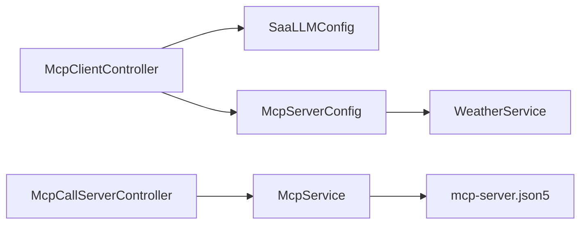
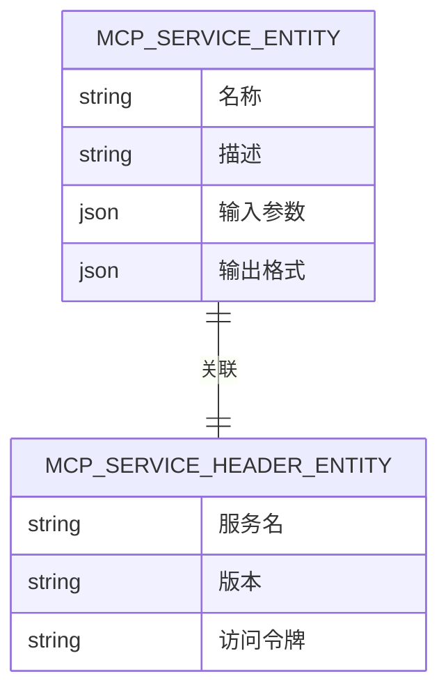

# 本地MCP服务器

<cite>
**本文引用的文件**
- [Saa14LocalMcpServerApplication.java](file://【1】SpringAIAlibaba-atguiguV1/SAA-14LocalMcpServer/src/main/java/com/atguigu/study/Saa14LocalMcpServerApplication.java)
- [McpServerConfig.java](file://【1】SpringAIAlibaba-atguiguV1/SAA-14LocalMcpServer/src/main/java/com/atguigu/study/config/McpServerConfig.java)
- [WeatherService.java](file://【1】SpringAIAlibaba-atguiguV1/SAA-14LocalMcpServer/src/main/java/com/atguigu/study/service/WeatherService.java)
- [application.properties](file://【1】SpringAIAlibaba-atguiguV1/SAA-14LocalMcpServer/src/main/resources/application.properties)
- [Saa15LocalMcpClientApplication.java](file://【1】SpringAIAlibaba-atguiguV1/SAA-15LocalMcpClient/src/main/java/com/atguigu/study/Saa15LocalMcpClientApplication.java)
- [SaaLLMConfig.java](file://【1】SpringAIAlibaba-atguiguV1/SAA-15LocalMcpClient/src/main/java/com/atguigu/study/config/SaaLLMConfig.java)
- [McpClientController.java](file://【1】SpringAIAlibaba-atguiguV1/SAA-15LocalMcpClient/src/main/java/com/atguigu/study/controller/McpClientController.java)
- [application.properties](file://【1】SpringAIAlibaba-atguiguV1/SAA-15LocalMcpClient/src/main/resources/application.properties)
- [mcp-server.json5](file://【1】SpringAIAlibaba-atguiguV1/SAA-16ClientCallBaiduMcpServer/src/main/resources/mcp-server.json5)
- [McpLangChain4JApp.java](file://【2】langchain4j-atguiguV5/langchain4j-14chat-mcp/src/main/java/com/atguigu/study/McpLangChain4JApp.java)
- [McpCallServerController.java](file://【2】langchain4j-atguiguV5/langchain4j-14chat-mcp/src/main/java/com/atguigu/study/controller/McpCallServerController.java)
- [McpService.java](file://【2】langchain4j-atguiguV5/langchain4j-14chat-mcp/src/main/java/com/atguigu/study/service/McpService.java)
- [application.yml](file://【2】langchain4j-atguiguV5/langchain4j-14chat-mcp/src/main/resources/application.yml)
- [McpServiceController.java](file://【3】工作资料/code/仓颉智能体/nlp-agent/agent-builder/agent-build-core/src/main/java/com/yundingtech/agent/build/modules/tool/mcp/controller/McpServiceController.java)
- [McpServiceEntity.java](file://【3】工作资料/code/仓颉智能体/nlp-agent/agent-builder/agent-build-core/src/main/java/com/yundingtech/agent/build/modules/tool/mcp/entity/McpServiceEntity.java)
- [McpServiceHeaderEntity.java](file://【3】工作资料/code/仓颉智能体/nlp-agent/agent-builder/agent-build-core/src/main/java/com/yundingtech/agent/build/modules/tool/mcp/entity/McpServiceHeaderEntity.java)
</cite>

## 目录
1. [引言](#引言)
2. [项目结构](#项目结构)
3. [核心组件](#核心组件)
4. [架构总览](#架构总览)
5. [详细组件分析](#详细组件分析)
6. [依赖分析](#依赖分析)
7. [性能考虑](#性能考虑)
8. [故障排查指南](#故障排查指南)
9. [结论](#结论)
10. [附录](#附录)

## 引言
本指南围绕本地MCP（Model Context Protocol）服务器模块展开，系统阐述MCP协议在本地环境中的实现方式与最佳实践。文档从协议基础入手，结合仓库中已有的本地MCP服务器与客户端实现，给出可操作的构建步骤、服务注册与客户端连接管理要点，并以“天气服务”为例演示工具服务的定义、实现与暴露流程。同时，讨论MCP在AI应用中的价值：标准化工具调用、跨平台兼容性与生态扩展性，并提供集成建议与排错路径。

## 项目结构
本仓库包含三类与MCP相关的关键工程：
- 本地MCP服务器（Spring Boot）
  - 应用入口、配置与天气服务实现
- 本地MCP客户端（Spring Boot）
  - 客户端配置与控制器
- 调用外部MCP服务器的客户端示例（LangChain4J）
  - 展示MCP客户端调用模式与配置

**图表来源**
- [Saa14LocalMcpServerApplication.java:1-200](file://【1】SpringAIAlibaba-atguiguV1/SAA-14LocalMcpServer/src/main/java/com/atguigu/study/Saa14LocalMcpServerApplication.java#L1-L200)
- [McpServerConfig.java:1-200](file://【1】SpringAIAlibaba-atguiguV1/SAA-14LocalMcpServer/src/main/java/com/atguigu/study/config/McpServerConfig.java#L1-L200)
- [WeatherService.java:1-200](file://【1】SpringAIAlibaba-atguiguV1/SAA-14LocalMcpServer/src/main/java/com/atguigu/study/service/WeatherService.java#L1-L200)
- [application.properties:1-200](file://【1】SpringAIAlibaba-atguiguV1/SAA-14LocalMcpServer/src/main/resources/application.properties#L1-L200)
- [Saa15LocalMcpClientApplication.java:1-200](file://【1】SpringAIAlibaba-atguiguV1/SAA-15LocalMcpClient/src/main/java/com/atguigu/study/Saa15LocalMcpClientApplication.java#L1-L200)
- [SaaLLMConfig.java:1-200](file://【1】SpringAIAlibaba-atguiguV1/SAA-15LocalMcpClient/src/main/java/com/atguigu/study/config/SaaLLMConfig.java#L1-L200)
- [McpClientController.java:1-200](file://【1】SpringAIAlibaba-atguiguV1/SAA-15LocalMcpClient/src/main/java/com/atguigu/study/controller/McpClientController.java#L1-L200)
- [application.properties:1-200](file://【1】SpringAIAlibaba-atguiguV1/SAA-15LocalMcpClient/src/main/resources/application.properties#L1-L200)
- [McpLangChain4JApp.java:1-200](file://【2】langchain4j-atguiguV5/langchain4j-14chat-mcp/src/main/java/com/atguigu/study/McpLangChain4JApp.java#L1-L200)
- [McpCallServerController.java:1-200](file://【2】langchain4j-atguiguV5/langchain4j-14chat-mcp/src/main/java/com/atguigu/study/controller/McpCallServerController.java#L1-L200)
- [McpService.java:1-200](file://【2】langchain4j-atguiguV5/langchain4j-14chat-mcp/src/main/java/com/atguigu/study/service/McpService.java#L1-L200)
- [application.yml:1-200](file://【2】langchain4j-atguiguV5/langchain4j-14chat-mcp/src/main/resources/application.yml#L1-L200)
- [mcp-server.json5:1-200](file://【1】SpringAIAlibaba-atguiguV1/SAA-16ClientCallBaiduMcpServer/src/main/resources/mcp-server.json5#L1-L200)

**章节来源**
- [Saa14LocalMcpServerApplication.java:1-200](file://【1】SpringAIAlibaba-atguiguV1/SAA-14LocalMcpServer/src/main/java/com/atguigu/study/Saa14LocalMcpServerApplication.java#L1-L200)
- [Saa15LocalMcpClientApplication.java:1-200](file://【1】SpringAIAlibaba-atguiguV1/SAA-15LocalMcpClient/src/main/java/com/atguigu/study/Saa15LocalMcpClientApplication.java#L1-L200)
- [McpLangChain4JApp.java:1-200](file://【2】langchain4j-atguiguV5/langchain4j-14chat-mcp/src/main/java/com/atguigu/study/McpLangChain4JApp.java#L1-L200)

## 核心组件
- 本地MCP服务器
  - 应用入口负责启动与上下文装配
  - 协议配置模块负责MCP服务注册与端点暴露
  - 工具服务模块提供具体能力（如天气查询）
- 本地MCP客户端
  - 客户端配置负责连接参数与认证设置
  - 控制器负责接收用户指令并调用MCP服务器工具
- 外部MCP调用示例
  - LangChain4J应用通过控制器与服务封装调用外部MCP服务器
  - 配置文件描述外部服务器地址与访问凭据

**章节来源**
- [McpServerConfig.java:1-200](file://【1】SpringAIAlibaba-atguiguV1/SAA-14LocalMcpServer/src/main/java/com/atguigu/study/config/McpServerConfig.java#L1-L200)
- [WeatherService.java:1-200](file://【1】SpringAIAlibaba-atguiguV1/SAA-14LocalMcpServer/src/main/java/com/atguigu/study/service/WeatherService.java#L1-L200)
- [SaaLLMConfig.java:1-200](file://【1】SpringAIAlibaba-atguiguV1/SAA-15LocalMcpClient/src/main/java/com/atguigu/study/config/SaaLLMConfig.java#L1-L200)
- [McpClientController.java:1-200](file://【1】SpringAIAlibaba-atguiguV1/SAA-15LocalMcpClient/src/main/java/com/atguigu/study/controller/McpClientController.java#L1-L200)
- [McpService.java:1-200](file://【2】langchain4j-atguiguV5/langchain4j-14chat-mcp/src/main/java/com/atguigu/study/service/McpService.java#L1-L200)

## 架构总览
下图展示了本地MCP服务器与客户端的整体交互关系，以及外部MCP调用示例的参考路径。

**图表来源**
- [McpClientController.java:1-200](file://【1】SpringAIAlibaba-atguiguV1/SAA-15LocalMcpClient/src/main/java/com/atguigu/study/controller/McpClientController.java#L1-L200)
- [SaaLLMConfig.java:1-200](file://【1】SpringAIAlibaba-atguiguV1/SAA-15LocalMcpClient/src/main/java/com/atguigu/study/config/SaaLLMConfig.java#L1-L200)
- [McpServerConfig.java:1-200](file://【1】SpringAIAlibaba-atguiguV1/SAA-14LocalMcpServer/src/main/java/com/atguigu/study/config/McpServerConfig.java#L1-L200)
- [WeatherService.java:1-200](file://【1】SpringAIAlibaba-atguiguV1/SAA-14LocalMcpServer/src/main/java/com/atguigu/study/service/WeatherService.java#L1-L200)
- [McpCallServerController.java:1-200](file://【2】langchain4j-atguiguV5/langchain4j-14chat-mcp/src/main/java/com/atguigu/study/controller/McpCallServerController.java#L1-L200)
- [McpService.java:1-200](file://【2】langchain4j-atguiguV5/langchain4j-14chat-mcp/src/main/java/com/atguigu/study/service/McpService.java#L1-L200)
- [mcp-server.json5:1-200](file://【1】SpringAIAlibaba-atguiguV1/SAA-16ClientCallBaiduMcpServer/src/main/resources/mcp-server.json5#L1-L200)

## 详细组件分析

### 本地MCP服务器组件
- 应用入口
  - 负责启动Spring Boot应用上下文，加载MCP相关配置与服务
- 协议配置
  - 定义MCP服务注册、端点暴露与安全策略
  - 统一管理工具服务的生命周期与路由
- 工具服务（天气服务）
  - 实现具体的业务能力，如查询天气
  - 提供标准化输入输出格式，便于客户端调用

**图表来源**
- [Saa14LocalMcpServerApplication.java:1-200](file://【1】SpringAIAlibaba-atguiguV1/SAA-14LocalMcpServer/src/main/java/com/atguigu/study/Saa14LocalMcpServerApplication.java#L1-L200)
- [McpServerConfig.java:1-200](file://【1】SpringAIAlibaba-atguiguV1/SAA-14LocalMcpServer/src/main/java/com/atguigu/study/config/McpServerConfig.java#L1-L200)
- [WeatherService.java:1-200](file://【1】SpringAIAlibaba-atguiguV1/SAA-14LocalMcpServer/src/main/java/com/atguigu/study/service/WeatherService.java#L1-L200)

**章节来源**
- [Saa14LocalMcpServerApplication.java:1-200](file://【1】SpringAIAlibaba-atguiguV1/SAA-14LocalMcpServer/src/main/java/com/atguigu/study/Saa14LocalMcpServerApplication.java#L1-L200)
- [McpServerConfig.java:1-200](file://【1】SpringAIAlibaba-atguiguV1/SAA-14LocalMcpServer/src/main/java/com/atguigu/study/config/McpServerConfig.java#L1-L200)
- [WeatherService.java:1-200](file://【1】SpringAIAlibaba-atguiguV1/SAA-14LocalMcpServer/src/main/java/com/atguigu/study/service/WeatherService.java#L1-L200)

### 本地MCP客户端组件
- 客户端配置
  - 定义连接参数（如服务器地址、端口、鉴权头等）
- 客户端控制器
  - 接收用户指令，构造MCP调用请求
  - 调用MCP服务器工具并处理响应

**图表来源**
- [McpClientController.java:1-200](file://【1】SpringAIAlibaba-atguiguV1/SAA-15LocalMcpClient/src/main/java/com/atguigu/study/controller/McpClientController.java#L1-L200)
- [SaaLLMConfig.java:1-200](file://【1】SpringAIAlibaba-atguiguV1/SAA-15LocalMcpClient/src/main/java/com/atguigu/study/config/SaaLLMConfig.java#L1-L200)
- [McpServerConfig.java:1-200](file://【1】SpringAIAlibaba-atguiguV1/SAA-14LocalMcpServer/src/main/java/com/atguigu/study/config/McpServerConfig.java#L1-L200)
- [WeatherService.java:1-200](file://【1】SpringAIAlibaba-atguiguV1/SAA-14LocalMcpServer/src/main/java/com/atguigu/study/service/WeatherService.java#L1-L200)

**章节来源**
- [McpClientController.java:1-200](file://【1】SpringAIAlibaba-atguiguV1/SAA-15LocalMcpClient/src/main/java/com/atguigu/study/controller/McpClientController.java#L1-L200)
- [SaaLLMConfig.java:1-200](file://【1】SpringAIAlibaba-atguiguV1/SAA-15LocalMcpClient/src/main/java/com/atguigu/study/config/SaaLLMConfig.java#L1-L200)

### 外部MCP调用示例（LangChain4J）
- 应用入口与控制器
  - 通过LangChain4J封装MCP调用流程
- 服务封装
  - 将MCP调用抽象为服务方法，便于在控制器中复用
- 配置文件
  - 描述外部MCP服务器地址与访问凭据

**图表来源**
- [McpCallServerController.java:1-200](file://【2】langchain4j-atguiguV5/langchain4j-14chat-mcp/src/main/java/com/atguigu/study/controller/McpCallServerController.java#L1-L200)
- [McpService.java:1-200](file://【2】langchain4j-atguiguV5/langchain4j-14chat-mcp/src/main/java/com/atguigu/study/service/McpService.java#L1-L200)
- [mcp-server.json5:1-200](file://【1】SpringAIAlibaba-atguiguV1/SAA-16ClientCallBaiduMcpServer/src/main/resources/mcp-server.json5#L1-L200)

**章节来源**
- [McpLangChain4JApp.java:1-200](file://【2】langchain4j-atguiguV5/langchain4j-14chat-mcp/src/main/java/com/atguigu/study/McpLangChain4JApp.java#L1-L200)
- [McpCallServerController.java:1-200](file://【2】langchain4j-atguiguV5/langchain4j-14chat-mcp/src/main/java/com/atguigu/study/controller/McpCallServerController.java#L1-L200)
- [McpService.java:1-200](file://【2】langchain4j-atguiguV5/langchain4j-14chat-mcp/src/main/java/com/atguigu/study/service/McpService.java#L1-L200)
- [application.yml:1-200](file://【2】langchain4j-atguiguV5/langchain4j-14chat-mcp/src/main/resources/application.yml#L1-L200)

### 工具服务定义与暴露（天气服务）
- 服务定义
  - 明确定义工具名称、输入参数与输出格式
- 服务实现
  - 在工具方法中完成业务逻辑与结果封装
- 服务注册
  - 在MCP服务器配置中注册工具，使其可被客户端发现与调用

**图表来源**
- [WeatherService.java:1-200](file://【1】SpringAIAlibaba-atguiguV1/SAA-14LocalMcpServer/src/main/java/com/atguigu/study/service/WeatherService.java#L1-L200)
- [McpServerConfig.java:1-200](file://【1】SpringAIAlibaba-atguiguV1/SAA-14LocalMcpServer/src/main/java/com/atguigu/study/config/McpServerConfig.java#L1-L200)

**章节来源**
- [WeatherService.java:1-200](file://【1】SpringAIAlibaba-atguiguV1/SAA-14LocalMcpServer/src/main/java/com/atguigu/study/service/WeatherService.java#L1-L200)
- [McpServerConfig.java:1-200](file://【1】SpringAIAlibaba-atguiguV1/SAA-14LocalMcpServer/src/main/java/com/atguigu/study/config/McpServerConfig.java#L1-L200)

### MCP协议在AI应用中的价值
- 标准化工具调用
  - 统一工具接口与调用协议，降低集成成本
- 跨平台兼容性
  - 通过标准协议实现不同平台间的互操作
- 生态扩展性
  - 通过工具注册与发现机制，支持第三方工具接入

[本节为概念性内容，无需列出章节来源]

## 依赖分析
- 组件耦合
  - 客户端控制器依赖客户端配置与服务器配置
  - 服务器配置依赖工具服务
  - LangChain4J示例依赖MCP服务封装与外部服务器配置
- 外部依赖
  - Spring Boot用于应用启动与依赖注入
  - LangChain4J用于MCP调用封装
  - JSON5用于外部服务器配置描述

**图表来源**
- [McpClientController.java:1-200](file://【1】SpringAIAlibaba-atguiguV1/SAA-15LocalMcpClient/src/main/java/com/atguigu/study/controller/McpClientController.java#L1-L200)
- [SaaLLMConfig.java:1-200](file://【1】SpringAIAlibaba-atguiguV1/SAA-15LocalMcpClient/src/main/java/com/atguigu/study/config/SaaLLMConfig.java#L1-L200)
- [McpServerConfig.java:1-200](file://【1】SpringAIAlibaba-atguiguV1/SAA-14LocalMcpServer/src/main/java/com/atguigu/study/config/McpServerConfig.java#L1-L200)
- [WeatherService.java:1-200](file://【1】SpringAIAlibaba-atguiguV1/SAA-14LocalMcpServer/src/main/java/com/atguigu/study/service/WeatherService.java#L1-L200)
- [McpCallServerController.java:1-200](file://【2】langchain4j-atguiguV5/langchain4j-14chat-mcp/src/main/java/com/atguigu/study/controller/McpCallServerController.java#L1-L200)
- [McpService.java:1-200](file://【2】langchain4j-atguiguV5/langchain4j-14chat-mcp/src/main/java/com/atguigu/study/service/McpService.java#L1-L200)
- [mcp-server.json5:1-200](file://【1】SpringAIAlibaba-atguiguV1/SAA-16ClientCallBaiduMcpServer/src/main/resources/mcp-server.json5#L1-L200)

**章节来源**
- [Saa14LocalMcpServerApplication.java:1-200](file://【1】SpringAIAlibaba-atguiguV1/SAA-14LocalMcpServer/src/main/java/com/atguigu/study/Saa14LocalMcpServerApplication.java#L1-L200)
- [Saa15LocalMcpClientApplication.java:1-200](file://【1】SpringAIAlibaba-atguiguV1/SAA-15LocalMcpClient/src/main/java/com/atguigu/study/Saa15LocalMcpClientApplication.java#L1-L200)
- [McpLangChain4JApp.java:1-200](file://【2】langchain4j-atguiguV5/langchain4j-14chat-mcp/src/main/java/com/atguigu/study/McpLangChain4JApp.java#L1-L200)

## 性能考虑
- 连接池与超时
  - 客户端与服务器间建立合理的连接池与超时策略，避免阻塞
- 并发与限流
  - 在高并发场景下对工具调用进行限流与排队，保障稳定性
- 缓存策略
  - 对热点查询（如天气）采用缓存减少重复计算与网络开销
- 日志与监控
  - 记录关键调用链路与错误信息，便于定位性能瓶颈

[本节为一般性建议，无需列出章节来源]

## 故障排查指南
- 服务器未启动或端口占用
  - 检查服务器配置与端口占用情况
- 客户端无法连接
  - 校验客户端配置中的服务器地址与端口
- 工具调用失败
  - 查看工具实现与注册是否正确，确认输入参数与输出格式
- 外部服务器配置错误
  - 校验JSON5配置文件中的服务器地址与凭据

**章节来源**
- [application.properties:1-200](file://【1】SpringAIAlibaba-atguiguV1/SAA-14LocalMcpServer/src/main/resources/application.properties#L1-L200)
- [application.properties:1-200](file://【1】SpringAIAlibaba-atguiguV1/SAA-15LocalMcpClient/src/main/resources/application.properties#L1-L200)
- [mcp-server.json5:1-200](file://【1】SpringAIAlibaba-atguiguV1/SAA-16ClientCallBaiduMcpServer/src/main/resources/mcp-server.json5#L1-L200)

## 结论
本地MCP服务器模块通过标准化协议与清晰的服务注册机制，实现了工具能力的统一暴露与调用。结合客户端控制器与LangChain4J示例，可快速构建跨平台、可扩展的AI工具生态。建议在生产环境中完善连接管理、限流与缓存策略，并加强日志与监控，确保系统的稳定性与可观测性。

[本节为总结性内容，无需列出章节来源]

## 附录
- 数据模型（概念示意）
  - 工具服务实体与头部信息可作为工具元数据的载体，便于统一管理与发现

**图表来源**
- [McpServiceEntity.java:1-200](file://【3】工作资料/code/仓颉智能体/nlp-agent/agent-builder/agent-build-core/src/main/java/com/yundingtech/agent/build/modules/tool/mcp/entity/McpServiceEntity.java#L1-L200)
- [McpServiceHeaderEntity.java:1-200](file://【3】工作资料/code/仓颉智能体/nlp-agent/agent-builder/agent-build-core/src/main/java/com/yundingtech/agent/build/modules/tool/mcp/entity/McpServiceHeaderEntity.java#L1-L200)