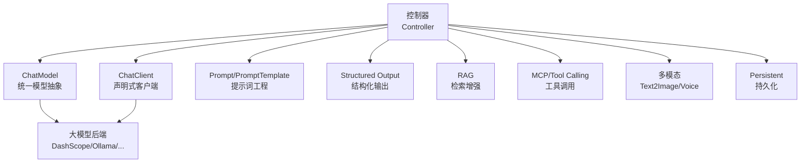
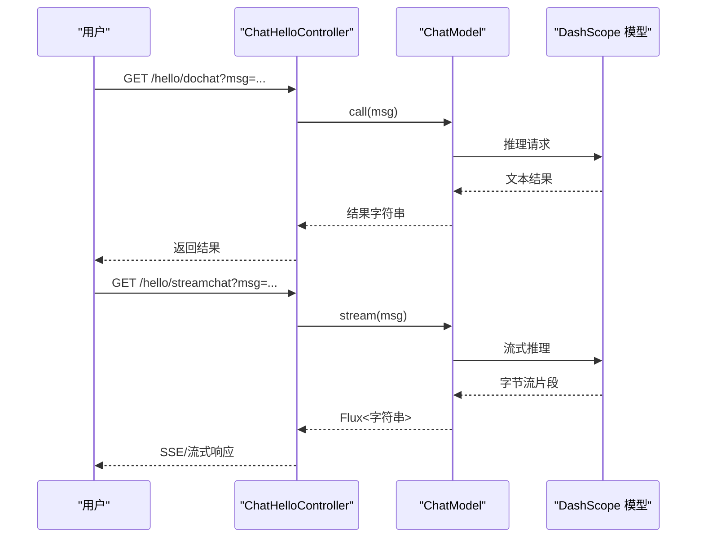
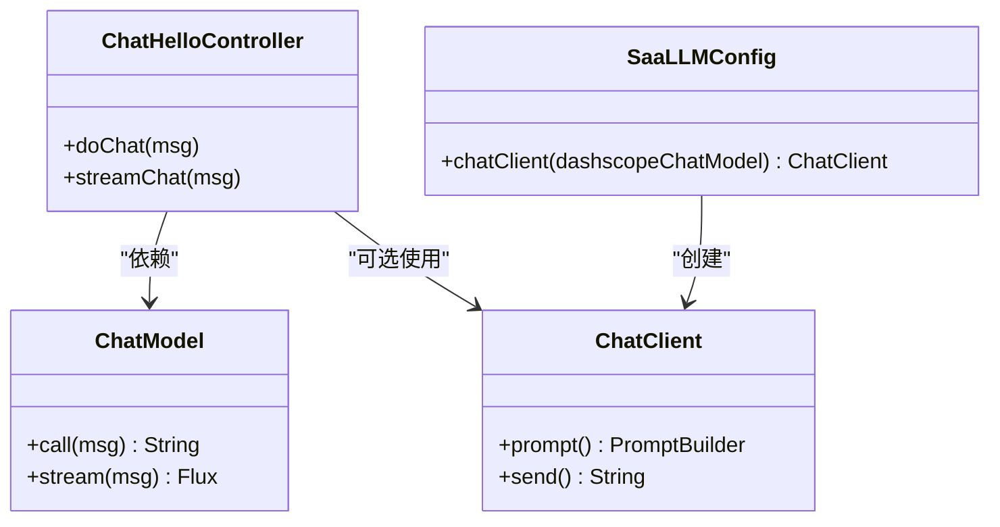
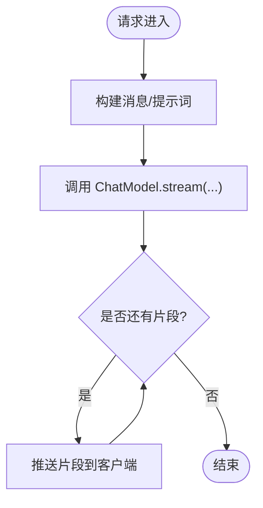
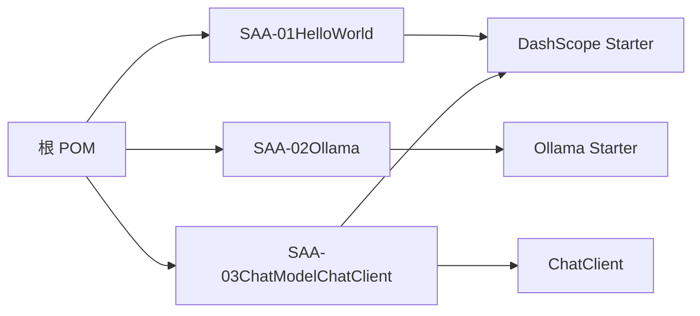

# 框架概述与基础

<cite>
**本文引用的文件**
- [SAA-01HelloWorld/pom.xml](file://【1】SpringAIAlibaba-atguiguV1/SAA-01HelloWorld/pom.xml)
- [SAA-01HelloWorld/application.properties](file://【1】SpringAIAlibaba-atguiguV1/SAA-01HelloWorld/src/main/resources/application.properties)
- [SAA-01HelloWorld/Saa01HelloWorldApplication.java](file://【1】SpringAIAlibaba-atguiguV1/SAA-01HelloWorld/src/main/java/com/atguigu/study/Saa01HelloWorldApplication.java)
- [SAA-01HelloWorld/ChatHelloController.java](file://【1】SpringAIAlibaba-atguiguV1/SAA-01HelloWorld/src/main/java/com/atguigu/study/controller/ChatHelloController.java)
- [SAA-01HelloWorld/SaaLLMConfig.java](file://【1】SpringAIAlibaba-atguiguV1/SAA-01HelloWorld/src/main/java/com/atguigu/study/config/SaaLLMConfig.java)
- [SAA-02Ollama/pom.xml](file://【1】SpringAIAlibaba-atguiguV1/SAA-02Ollama/pom.xml)
- [SAA-02Ollama/application.properties](file://【1】SpringAIAlibaba-atguiguV1/SAA-02Ollama/src/main/resources/application.properties)
- [SAA-03ChatModelChatClient/pom.xml](file://【1】SpringAIAlibaba-atguiguV1/SAA-03ChatModelChatClient/pom.xml)
- [SAA-03ChatModelChatClient/SaaLLMConfig.java](file://【1】SpringAIAlibaba-atguiguV1/SAA-03ChatModelChatClient/src/main/java/com/atguigu/study/config/SaaLLMConfig.java)
- [SAA-03ChatModelChatClient/ChatClientController.java](file://【1】SpringAIAlibaba-atguiguV1/SAA-03ChatModelChatClient/src/main/java/com/atguigu/study/controller/ChatClientController.java)
- [SAA-04StreamingOutput/pom.xml](file://【1】SpringAIAlibaba-atguiguV1/SAA-04StreamingOutput/pom.xml)
- [SAA-05Prompt/pom.xml](file://【1】SpringAIAlibaba-atguiguV1/SAA-05Prompt/pom.xml)
- [SAA-06PromptTemplate/pom.xml](file://【1】SpringAIAlibaba-atguiguV1/SAA-06PromptTemplate/pom.xml)
- [SAA-07StructuredOutput/pom.xml](file://【1】SpringAIAlibaba-atguiguV1/SAA-07StructuredOutput/pom.xml)
- [SAA-08Persistent/pom.xml](file://【1】SpringAIAlibaba-atguiguV1/SAA-08Persistent/pom.xml)
- [SAA-09Text2image/pom.xml](file://【1】SpringAIAlibaba-atguiguV1/SAA-09Text2image/pom.xml)
- [SAA-10Text2voice/pom.xml](file://【1】SpringAIAlibaba-atguiguV1/SAA-10Text2voice/pom.xml)
- [SAA-11Embed2vector/pom.xml](file://【1】SpringAIAlibaba-atguiguV1/SAA-11Embed2vector/pom.xml)
- [SAA-12RAG4AiOps/pom.xml](file://【1】SpringAIAlibaba-atguiguV1/SAA-12RAG4AiOps/pom.xml)
- [SAA-13ToolCalling/pom.xml](file://【1】SpringAIAlibaba-atguiguV1/SAA-13ToolCalling/pom.xml)
- [SAA-14LocalMcpServer/pom.xml](file://【1】SpringAIAlibaba-atguiguV1/SAA-14LocalMcpServer/pom.xml)
- [SAA-15LocalMcpClient/pom.xml](file://【1】SpringAIAlibaba-atguiguV1/SAA-15LocalMcpClient/pom.xml)
- [SAA-16ClientCallBaiduMcpServer/pom.xml](file://【1】SpringAIAlibaba-atguiguV1/SAA-16ClientCallBaiduMcpServer/pom.xml)
- [SAA-17BailianRAG/pom.xml](file://【1】SpringAIAlibaba-atguiguV1/SAA-17BailianRAG/pom.xml)
- [SAA-18TodayMenu/pom.xml](file://【1】SpringAIAlibaba-atguiguV1/SAA-18TodayMenu/pom.xml)
- [SAA-01HelloWorld/HELP.md](file://【1】SpringAIAlibaba-atguiguV1/SAA-01HelloWorld/HELP.md)
</cite>

## 目录
1. [引言](#引言)
2. [项目结构](#项目结构)
3. [核心组件](#核心组件)
4. [架构总览](#架构总览)
5. [详细组件分析](#详细组件分析)
6. [依赖分析](#依赖分析)
7. [性能考虑](#性能考虑)
8. [故障排查指南](#故障排查指南)
9. [结论](#结论)
10. [附录](#附录)

## 引言
本文件面向初学者与开发者，系统化介绍 Spring AI Alibaba 在本仓库中的实践形态与使用方式。该框架以 Spring Boot 为基础，通过引入 Spring AI Alibaba 的适配 Starter，将大模型能力（如通义千问 DashScope、Ollama 本地模型等）无缝集成到 Spring 应用中，提供统一的 ChatModel、ChatClient、Prompt、RAG、工具调用（MCP）、向量化与持久化等能力抽象，降低 AI 应用开发门槛。

与传统 Spring Boot 的区别与优势：
- 统一抽象：屏蔽不同大模型厂商或本地推理引擎的差异，统一编程模型。
- 快速集成：通过 Starter 一键接入，减少样板代码与配置成本。
- 能力覆盖：从基础对话、流式输出、提示词工程、结构化输出，到 RAG、工具调用、多模态（文生图/文生音）均有示例。
- 易于扩展：可灵活替换后端模型提供商或本地推理服务，便于迁移与灰度。

在 AI 应用开发中的定位与价值：
- 快速原型：通过 Hello World 示例与 ChatClient/ChatModel，快速验证业务逻辑。
- 工程化落地：借助 Prompt/PromptTemplate、Structured Output、RAG、MCP 等能力，构建生产级 AI 应用。
- 低耦合演进：通过配置与依赖切换，平滑过渡到不同推理后端。

## 项目结构
本仓库以“示例项目”为主线组织，每个示例对应一个 Maven 子模块，演示不同能力点的使用方式。核心模块包括：
- Hello World：最小可用示例，展示 ChatModel 与 ChatClient 的基础用法。
- Ollama：演示本地推理引擎对接。
- ChatModel 与 ChatClient：对比两种编程范式。
- Streaming Output：流式输出体验。
- Prompt 与 Prompt Template：提示词工程与模板化。
- Structured Output：结构化输出，便于下游解析。
- Persistent/RAG/Embedding/Text2Image/Text2Voice/MCP/Tool Calling 等：覆盖典型 AI 应用场景。

```mermaid
graph TB
subgraph "示例模块"
H1["SAA-01HelloWorld"]
H2["SAA-02Ollama"]
H3["SAA-03ChatModelChatClient"]
H4["SAA-04StreamingOutput"]
H5["SAA-05Prompt"]
H6["SAA-06PromptTemplate"]
H7["SAA-07StructuredOutput"]
H8["SAA-08Persistent"]
H9["SAA-09Text2image"]
H10["SAA-10Text2voice"]
H11["SAA-11Embed2vector"]
H12["SAA-12RAG4AiOps"]
H13["SAA-13ToolCalling"]
H14["SAA-14LocalMcpServer"]
H15["SAA-15LocalMcpClient"]
H16["SAA-16ClientCallBaiduMcpServer"]
H17["SAA-17BailianRAG"]
H18["SAA-18TodayMenu"]
end
Root["根 POM聚合"] --> H1
Root --> H2
Root --> H3
Root --> H4
Root --> H5
Root --> H6
Root --> H7
Root --> H8
Root --> H9
Root --> H10
Root --> H11
Root --> H12
Root --> H13
Root --> H14
Root --> H15
Root --> H16
Root --> H17
Root --> H18
```

**章节来源**
- [SAA-01HelloWorld/pom.xml:1-60](file://【1】SpringAIAlibaba-atguiguV1/SAA-01HelloWorld/pom.xml#L1-L60)
- [SAA-02Ollama/pom.xml:1-60](file://【1】SpringAIAlibaba-atguiguV1/SAA-02Ollama/pom.xml#L1-L60)
- [SAA-03ChatModelChatClient/pom.xml:1-60](file://【1】SpringAIAlibaba-atguiguV1/SAA-03ChatModelChatClient/pom.xml#L1-L60)

## 核心组件
- ChatModel：统一的大模型调用抽象，支持同步与流式输出。
- ChatClient：声明式客户端，通过链式 API 构建对话与提示词。
- Prompt/PromptTemplate：提示词工程与模板化，提升可维护性与复用性。
- Structured Output：结构化输出，便于下游解析与落库。
- RAG：检索增强生成，结合 Embedding 与检索库。
- MCP/Tool Calling：本地或云端 MCP 服务器的工具调用，扩展 LLM 能力。
- Text2Image/Text2Voice：多模态输出能力。
- Persistent：会话与消息的持久化方案。

这些组件在各示例模块中以不同组合出现，形成从入门到进阶的学习路径。

**章节来源**
- [SAA-01HelloWorld/ChatHelloController.java:1-80](file://【1】SpringAIAlibaba-atguiguV1/SAA-01HelloWorld/src/main/java/com/atguigu/study/controller/ChatHelloController.java#L1-L80)
- [SAA-03ChatModelChatClient/ChatClientController.java:1-80](file://【1】SpringAIAlibaba-atguiguV1/SAA-03ChatModelChatClient/src/main/java/com/atguigu/study/controller/ChatClientController.java#L1-L80)

## 架构总览
下图展示了基于 Spring AI Alibaba 的典型调用链路：控制器接收请求，通过 ChatModel 或 ChatClient 调用大模型；根据场景可叠加 Prompt、Structured Output、RAG、MCP、多模态与持久化等环节。

**图表来源**
- [SAA-01HelloWorld/ChatHelloController.java:1-80](file://【1】SpringAIAlibaba-atguiguV1/SAA-01HelloWorld/src/main/java/com/atguigu/study/controller/ChatHelloController.java#L1-L80)
- [SAA-03ChatModelChatClient/ChatClientController.java:1-80](file://【1】SpringAIAlibaba-atguiguV1/SAA-03ChatModelChatClient/src/main/java/com/atguigu/study/controller/ChatClientController.java#L1-L80)

## 详细组件分析

### Hello World（SAA-01HelloWorld）
- 目标：最简示例，展示 ChatModel 的同步与流式调用。
- 关键点：
  - 依赖：引入 DashScope Starter 以对接通义千问。
  - 配置：设置 DashScope API Key 与可选的 base-url/model。
  - 控制器：提供两个接口，分别进行同步与流式对话。
  - 应用入口：标准 Spring Boot 启动类。
- 适用场景：快速验证模型连通性与输出质量，作为后续示例的基线。

**图表来源**
- [SAA-01HelloWorld/ChatHelloController.java:1-80](file://【1】SpringAIAlibaba-atguiguV1/SAA-01HelloWorld/src/main/java/com/atguigu/study/controller/ChatHelloController.java#L1-L80)

**章节来源**
- [SAA-01HelloWorld/pom.xml:1-60](file://【1】SpringAIAlibaba-atguiguV1/SAA-01HelloWorld/pom.xml#L1-L60)
- [SAA-01HelloWorld/application.properties:1-30](file://【1】SpringAIAlibaba-atguiguV1/SAA-01HelloWorld/src/main/resources/application.properties#L1-L30)
- [SAA-01HelloWorld/Saa01HelloWorldApplication.java:1-100](file://【1】SpringAIAlibaba-atguiguV1/SAA-01HelloWorld/src/main/java/com/atguigu/study/Saa01HelloWorldApplication.java#L1-L100)
- [SAA-01HelloWorld/ChatHelloController.java:1-80](file://【1】SpringAIAlibaba-atguiguV1/SAA-01HelloWorld/src/main/java/com/atguigu/study/controller/ChatHelloController.java#L1-L80)

### ChatModel 与 ChatClient 对比（SAA-03ChatModelChatClient）
- 目标：对比两种编程范式，理解各自的适用场景。
- 关键点：
  - ChatModel：更贴近“直接调用”的风格，适合简单场景。
  - ChatClient：声明式、可链式组合，适合复杂提示词与多步交互。
- 配置：通过 @Bean 注册 ChatClient，并注入 ChatModel 实现。

**图表来源**
- [SAA-03ChatModelChatClient/ChatClientController.java:1-80](file://【1】SpringAIAlibaba-atguiguV1/SAA-03ChatModelChatClient/src/main/java/com/atguigu/study/controller/ChatClientController.java#L1-L80)
- [SAA-03ChatModelChatClient/SaaLLMConfig.java:1-80](file://【1】SpringAIAlibaba-atguiguV1/SAA-03ChatModelChatClient/src/main/java/com/atguigu/study/config/SaaLLMConfig.java#L1-L80)

**章节来源**
- [SAA-03ChatModelChatClient/pom.xml:1-60](file://【1】SpringAIAlibaba-atguiguV1/SAA-03ChatModelChatClient/pom.xml#L1-L60)
- [SAA-03ChatModelChatClient/SaaLLMConfig.java:1-80](file://【1】SpringAIAlibaba-atguiguV1/SAA-03ChatModelChatClient/src/main/java/com/atguigu/study/config/SaaLLMConfig.java#L1-L80)
- [SAA-03ChatModelChatClient/ChatClientController.java:1-80](file://【1】SpringAIAlibaba-atguiguV1/SAA-03ChatModelChatClient/src/main/java/com/atguigu/study/controller/ChatClientController.java#L1-L80)

### 流式输出（SAA-04StreamingOutput）
- 目标：演示流式输出，提升用户体验。
- 关键点：返回类型为 Flux<String>，逐段推送结果。
- 场景：长文本生成、逐步反馈、SSE/WebSocket 场景。

**图表来源**
- [SAA-04StreamingOutput/pom.xml:1-60](file://【1】SpringAIAlibaba-atguiguV1/SAA-04StreamingOutput/pom.xml#L1-L60)
- [SAA-01HelloWorld/ChatHelloController.java:1-80](file://【1】SpringAIAlibaba-atguiguV1/SAA-01HelloWorld/src/main/java/com/atguigu/study/controller/ChatHelloController.java#L1-L80)

**章节来源**
- [SAA-04StreamingOutput/pom.xml:1-60](file://【1】SpringAIAlibaba-atguiguV1/SAA-04StreamingOutput/pom.xml#L1-L60)

### 提示词工程（SAA-05Prompt 与 SAA-06PromptTemplate）
- 目标：通过 Prompt 与 PromptTemplate 提升提示词的可维护性与复用性。
- 关键点：将提示词与业务参数解耦，支持模板化与动态拼装。
- 场景：标准化回答格式、角色设定、上下文注入等。

**章节来源**
- [SAA-05Prompt/pom.xml:1-60](file://【1】SpringAIAlibaba-atguiguV1/SAA-05Prompt/pom.xml#L1-L60)
- [SAA-06PromptTemplate/pom.xml:1-60](file://【1】SpringAIAlibaba-atguiguV1/SAA-06PromptTemplate/pom.xml#L1-L60)

### 结构化输出（SAA-07StructuredOutput）
- 目标：将模型输出约束为结构化格式，便于下游解析与入库。
- 关键点：通过 JSON Schema 或结构化提示词，引导模型按固定结构输出。
- 场景：抽取实体、生成结构化报告、与数据库映射。

**章节来源**
- [SAA-07StructuredOutput/pom.xml:1-60](file://【1】SpringAIAlibaba-atguiguV1/SAA-07StructuredOutput/pom.xml#L1-L60)

### 持久化与会话（SAA-08Persistent）
- 目标：将对话与消息持久化，支持多轮会话与审计。
- 关键点：结合 ChatClient 的消息构建与存储策略，实现可追溯的对话历史。
- 场景：客服系统、知识问答、智能助手等。

**章节来源**
- [SAA-08Persistent/pom.xml:1-60](file://【1】SpringAIAlibaba-atguiguV1/SAA-08Persistent/pom.xml#L1-L60)

### 多模态（SAA-09Text2image 与 SAA-10Text2voice）
- 目标：演示文生图与文生音能力，扩展 AI 应用边界。
- 关键点：配置相应模型与参数，处理异步任务与资源管理。
- 场景：创意设计、语音播报、多媒体内容生成。

**章节来源**
- [SAA-09Text2image/pom.xml:1-60](file://【1】SpringAIAlibaba-atguiguV1/SAA-09Text2image/pom.xml#L1-L60)
- [SAA-10Text2voice/pom.xml:1-60](file://【1】SpringAIAlibaba-atguiguV1/SAA-10Text2voice/pom.xml#L1-L60)

### 向量化与嵌入（SAA-11Embed2vector）
- 目标：将文本转换为向量，支撑检索与相似度计算。
- 关键点：选择合适的 Embedding 模型与维度，优化向量存储与查询。
- 场景：RAG、相似内容推荐、语义搜索。

**章节来源**
- [SAA-11Embed2vector/pom.xml:1-60](file://【1】SpringAIAlibaba-atguiguV1/SAA-11Embed2vector/pom.xml#L1-L60)

### RAG（SAA-12RAG4AiOps 与 SAA-17BailianRAG）
- 目标：通过检索增强生成，提升回答准确性与可控性。
- 关键点：结合 Embedding、检索库与提示词工程，形成闭环。
- 场景：运维知识库问答、企业内部文档检索、FAQ 扩展。

**章节来源**
- [SAA-12RAG4AiOps/pom.xml:1-60](file://【1】SpringAIAlibaba-atguiguV1/SAA-12RAG4AiOps/pom.xml#L1-L60)
- [SAA-17BailianRAG/pom.xml:1-60](file://【1】SpringAIAlibaba-atguiguV1/SAA-17BailianRAG/pom.xml#L1-L60)

### 工具调用与 MCP（SAA-13ToolCalling、SAA-14LocalMcpServer、SAA-15LocalMcpClient、SAA-16ClientCallBaiduMcpServer）
- 目标：通过 MCP 协议扩展 LLM 能力，实现外部系统调用。
- 关键点：本地 MCP Server/Client 与云端 MCP 服务的对接方式。
- 场景：查询数据库、调用第三方 API、执行业务操作。

**章节来源**
- [SAA-13ToolCalling/pom.xml:1-60](file://【1】SpringAIAlibaba-atguiguV1/SAA-13ToolCalling/pom.xml#L1-L60)
- [SAA-14LocalMcpServer/pom.xml:1-60](file://【1】SpringAIAlibaba-atguiguV1/SAA-14LocalMcpServer/pom.xml#L1-L60)
- [SAA-15LocalMcpClient/pom.xml:1-60](file://【1】SpringAIAlibaba-atguiguV1/SAA-15LocalMcpClient/pom.xml#L1-L60)
- [SAA-16ClientCallBaiduMcpServer/pom.xml:1-60](file://【1】SpringAIAlibaba-atguiguV1/SAA-16ClientCallBaiduMcpServer/pom.xml#L1-L60)

### 其他示例（SAA-18TodayMenu 等）
- 目标：覆盖更多业务场景，如菜单生成、工作流编排等。
- 关键点：结合 ChatClient、Prompt、RAG、MCP 等能力，形成端到端方案。

**章节来源**
- [SAA-18TodayMenu/pom.xml:1-60](file://【1】SpringAIAlibaba-atguiguV1/SAA-18TodayMenu/pom.xml#L1-L60)

## 依赖分析
- 根 POM 聚合所有示例模块，便于统一管理与构建。
- 各示例模块按需引入对应的 Starter：
  - DashScope Starter：对接通义千问系列模型。
  - Ollama Starter：对接本地推理引擎。
  - 其他 Starter：覆盖多模态、嵌入、RAG、MCP 等能力。
- 配置文件集中管理 API Key、base-url、模型参数等运行时配置。

**图表来源**
- [SAA-01HelloWorld/pom.xml:1-60](file://【1】SpringAIAlibaba-atguiguV1/SAA-01HelloWorld/pom.xml#L1-L60)
- [SAA-02Ollama/pom.xml:1-60](file://【1】SpringAIAlibaba-atguiguV1/SAA-02Ollama/pom.xml#L1-L60)
- [SAA-03ChatModelChatClient/pom.xml:1-60](file://【1】SpringAIAlibaba-atguiguV1/SAA-03ChatModelChatClient/pom.xml#L1-L60)

**章节来源**
- [SAA-01HelloWorld/pom.xml:1-60](file://【1】SpringAIAlibaba-atguiguV1/SAA-01HelloWorld/pom.xml#L1-L60)
- [SAA-02Ollama/pom.xml:1-60](file://【1】SpringAIAlibaba-atguiguV1/SAA-02Ollama/pom.xml#L1-L60)
- [SAA-03ChatModelChatClient/pom.xml:1-60](file://【1】SpringAIAlibaba-atguiguV1/SAA-03ChatModelChatClient/pom.xml#L1-L60)

## 性能考虑
- 流式输出：优先采用流式接口，降低首字节延迟，改善用户体验。
- 提示词优化：通过 PromptTemplate 与结构化输出，减少无效重试与修正成本。
- 向量化与检索：合理选择 Embedding 模型与检索策略，平衡精度与速度。
- 工具调用：对 MCP 服务进行限流与超时控制，避免阻塞主流程。
- 配置参数：根据模型特性调整温度、最大生成长度等参数，兼顾效果与性能。

## 故障排查指南
- API Key 与 base-url：确认配置文件中的密钥与地址正确，必要时启用代理或更换区域。
- 本地模型：确保 Ollama 服务已启动且模型已拉取，检查端口与模型名称。
- 流式输出：确认客户端支持 SSE/Flux 推送，网络稳定性与超时设置。
- 结构化输出：若解析失败，检查提示词是否明确约束输出格式，必要时引入 JSON Schema。
- RAG：核对向量维度与检索库一致性，确保索引构建完成。
- MCP：检查 MCP Server/Client 的协议版本与鉴权配置，关注超时与重试策略。

**章节来源**
- [SAA-01HelloWorld/application.properties:1-30](file://【1】SpringAIAlibaba-atguiguV1/SAA-01HelloWorld/src/main/resources/application.properties#L1-L30)
- [SAA-02Ollama/application.properties:1-20](file://【1】SpringAIAlibaba-atguiguV1/SAA-02Ollama/src/main/resources/application.properties#L1-L20)

## 结论
Spring AI Alibaba 将大模型能力以统一抽象与 Starter 形式融入 Spring 生态，显著降低了 AI 应用的开发与运维成本。通过本仓库的示例模块，开发者可以循序渐进地掌握从基础对话到复杂 RAG、工具调用与多模态的全栈能力，并在此基础上快速扩展到实际业务场景。

## 附录

### 环境搭建与依赖配置
- JDK 版本：建议使用较新 LTS 版本。
- Maven：使用仓库内提供的 pom.xml 进行依赖管理与构建。
- API Key：在 application.properties 中配置 DashScope/OpenAI 等后端的密钥与基础地址。
- 本地模型：如需使用 Ollama，请先安装并启动服务，再在配置中指定 base-url 与模型名。

**章节来源**
- [SAA-01HelloWorld/application.properties:1-30](file://【1】SpringAIAlibaba-atguiguV1/SAA-01HelloWorld/src/main/resources/application.properties#L1-L30)
- [SAA-02Ollama/application.properties:1-20](file://【1】SpringAIAlibaba-atguiguV1/SAA-02Ollama/src/main/resources/application.properties#L1-L20)
- [SAA-01HelloWorld/HELP.md:1-200](file://【1】SpringAIAlibaba-atguiguV1/SAA-01HelloWorld/HELP.md#L1-L200)

### 基本项目结构说明
- 每个示例模块包含：
  - src/main/java：控制器、配置类、业务逻辑。
  - src/main/resources：application.properties、静态资源与模板。
  - pom.xml：模块依赖与构建配置。
- 根目录的 pom.xml 负责聚合与版本管理。

**章节来源**
- [SAA-01HelloWorld/pom.xml:1-60](file://【1】SpringAIAlibaba-atguiguV1/SAA-01HelloWorld/pom.xml#L1-L60)
- [SAA-01HelloWorld/Saa01HelloWorldApplication.java:1-100](file://【1】SpringAIAlibaba-atguiguV1/SAA-01HelloWorld/src/main/java/com/atguigu/study/Saa01HelloWorldApplication.java#L1-L100)