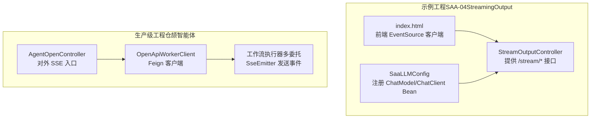
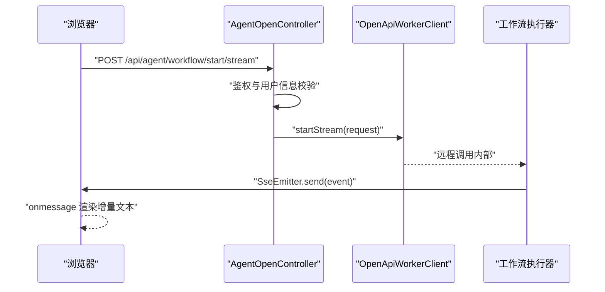
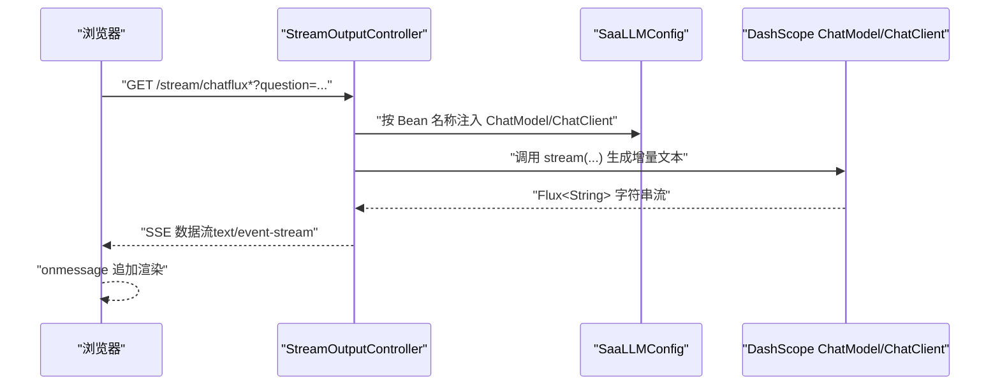
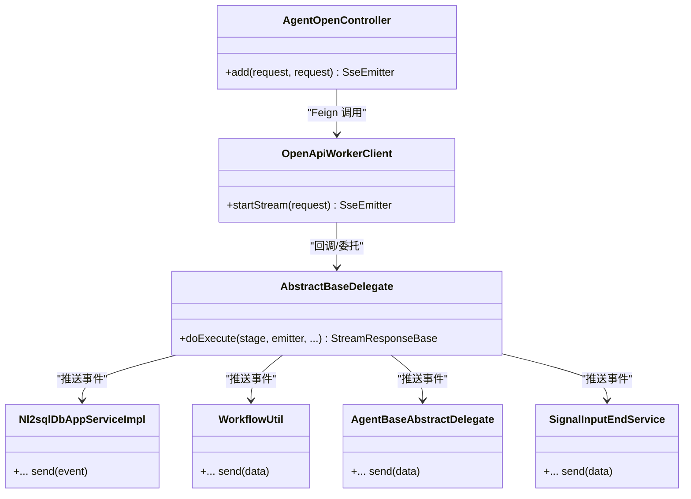
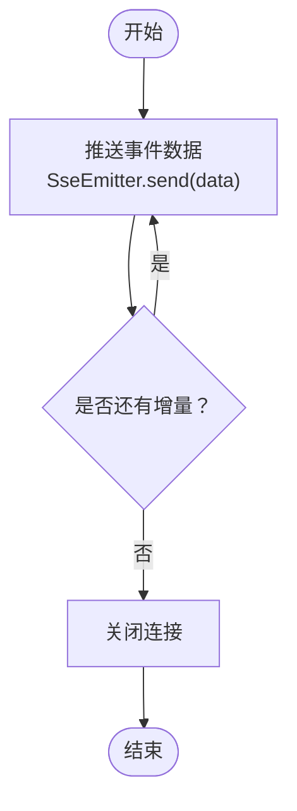
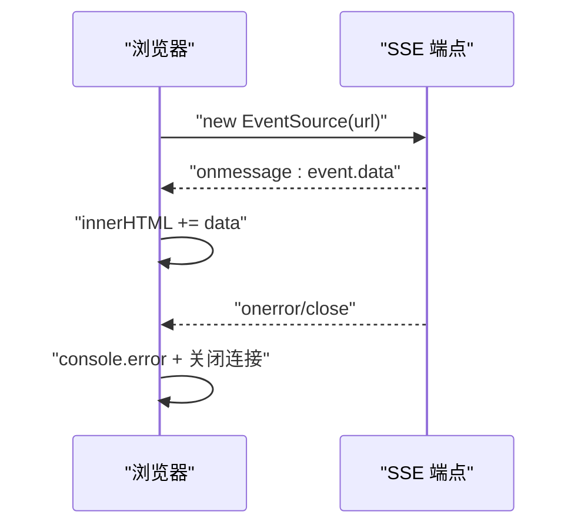
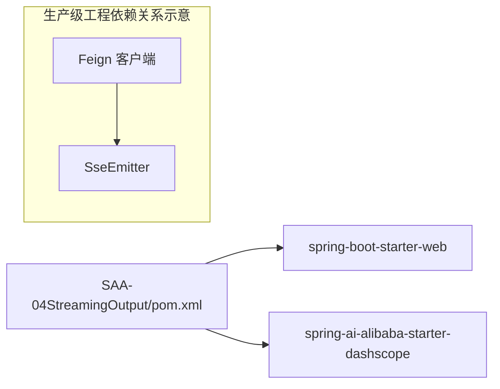

# 流式输出SSE

<cite>
**本文引用的文件**
- [StreamOutputController.java](file://【1】SpringAIAlibaba-atguiguV1/SAA-04StreamingOutput/src/main/java/com/atguigu/study/controller/StreamOutputController.java)
- [SaaLLMConfig.java](file://【1】SpringAIAlibaba-atguiguV1/SAA-04StreamingOutput/src/main/java/com/atguigu/study/config/SaaLLMConfig.java)
- [index.html](file://【1】SpringAIAlibaba-atguiguV1/SAA-04StreamingOutput/src/main/resources/static/index.html)
- [pom.xml](file://【1】SpringAIAlibaba-atguiguV1/SAA-04StreamingOutput/pom.xml)
- [OpenApiWorkerClient.java](file://【3】工作资料/code/仓颉智能体/nlp-agent/agent-builder/agent-build-core/src/main/java/com/yundingtech/agent/build/client/worker/OpenApiWorkerClient.java)
- [AgentOpenController.java](file://【3】工作资料/code/仓颉智能体/nlp-agent/agent-builder/agent-build-core/src/main/java/com/yundingtech/agent/build/modules/apikey/controller/AgentOpenController.java)
- [AbstractBaseDelegate.java](file://【3】工作资料/code/仓颉智能体/nlp-agent/agent-builder/agent-build-core/src/main/java/com/yundingtech/agent/build/modules/nl2sql/delegate/AbstractBaseDelegate.java)
- [Nl2sqlDbAppServiceImpl.java](file://【3】工作资料/code/仓颉智能体/nlp-agent/agent-builder/agent-build-core/src/main/java/com/yundingtech/agent/build/modules/nl2sql/service/impl/Nl2sqlDbAppServiceImpl.java)
- [WorkflowUtil.java](file://【3】工作资料/code/仓颉智能体/nlp-agent/agent-worker/src/main/java/com/yundingtech/agent/work/common/util/WorkflowUtil.java)
- [AgentBaseAbstractDelegate.java](file://【3】工作资料/code/仓颉智能体/nlp-agent/agent-worker/src/main/java/com/yundingtech/agent/work/modules/workflow/service/delegate/AgentBaseAbstractDelegate.java)
- [SignalInputEndService.java](file://【3】工作资料/code/仓颉智能体/nlp-agent/agent-worker/src/main/java/com/yundingtech/agent/work/modules/workflow/service/delegate/SignalInputEndService.java)
</cite>

## 目录
1. [引言](#引言)
2. [项目结构](#项目结构)
3. [核心组件](#核心组件)
4. [架构总览](#架构总览)
5. [组件详细分析](#组件详细分析)
6. [依赖关系分析](#依赖关系分析)
7. [性能考量](#性能考量)
8. [故障排查指南](#故障排查指南)
9. [结论](#结论)
10. [附录](#附录)

## 引言
本文件围绕“流式输出SSE”主题，系统性阐述基于 Spring Web MVC 的 Server-Sent Events（SSE）实现与在 AI 应用中的典型场景。文档聚焦以下目标：
- 解释 SSE 协议的工作原理及其在实时文本生成中的价值
- 说明如何在后端通过 SseEmitter 或响应式流（Flux）实现事件推送与连接管理
- 提供前端 EventSource 的集成示例，展示浏览器端接收与渲染实时文本流
- 分析流式输出的性能优势与用户体验提升
- 给出错误处理、自动重连与最佳实践建议

## 项目结构
本次文档涉及两个层面的实现：
- 示例工程：基于 Spring Boot + Spring AI Alibaba DashScope 的最小可运行流式输出示例
- 生产级工程：基于 Feign + SseEmitter 的工作流对话流式输出，覆盖鉴权、代理转发与事件分发

**图表来源**
- [StreamOutputController.java:17-54](file://【1】SpringAIAlibaba-atguiguV1/SAA-04StreamingOutput/src/main/java/com/atguigu/study/controller/StreamOutputController.java#L17-L54)
- [SaaLLMConfig.java:19-63](file://【1】SpringAIAlibaba-atguiguV1/SAA-04StreamingOutput/src/main/java/com/atguigu/study/config/SaaLLMConfig.java#L19-L63)
- [index.html:64-89](file://【1】SpringAIAlibaba-atguiguV1/SAA-04StreamingOutput/src/main/resources/static/index.html#L64-L89)
- [AgentOpenController.java:55-91](file://【3】工作资料/code/仓颉智能体/nlp-agent/agent-builder/agent-build-core/src/main/java/com/yundingtech/agent/build/modules/apikey/controller/AgentOpenController.java#L55-L91)
- [OpenApiWorkerClient.java:18-22](file://【3】工作资料/code/仓颉智能体/nlp-agent/agent-builder/agent-build-core/src/main/java/com/yundingtech/agent/build/client/worker/OpenApiWorkerClient.java#L18-L22)

**章节来源**
- [pom.xml:14-41](file://【1】SpringAIAlibaba-atguiguV1/SAA-04StreamingOutput/pom.xml#L14-L41)

## 核心组件
- 示例工程（SAA-04StreamingOutput）
  - 控制器：提供多个 /stream/* 接口，分别使用 ChatModel 和 ChatClient 的流式能力返回数据
  - 配置：注册 DashScope ChatModel 与 ChatClient，并注入不同模型别名
  - 前端：静态页面通过 EventSource 订阅 SSE，逐段拼接显示
- 生产级工程（仓颉智能体）
  - 对外入口：鉴权校验后，将请求转发给内部 Feign 客户端
  - 内部客户端：声明返回 SseEmitter 的远程方法
  - 工作流执行器：在各阶段委托中通过 SseEmitter.send(...) 推送事件

**章节来源**
- [StreamOutputController.java:17-54](file://【1】SpringAIAlibaba-atguiguV1/SAA-04StreamingOutput/src/main/java/com/atguigu/study/controller/StreamOutputController.java#L17-L54)
- [SaaLLMConfig.java:19-63](file://【1】SpringAIAlibaba-atguiguV1/SAA-04StreamingOutput/src/main/java/com/atguigu/study/config/SaaLLMConfig.java#L19-L63)
- [index.html:64-89](file://【1】SpringAIAlibaba-atguiguV1/SAA-04StreamingOutput/src/main/resources/static/index.html#L64-L89)
- [AgentOpenController.java:55-91](file://【3】工作资料/code/仓颉智能体/nlp-agent/agent-builder/agent-build-core/src/main/java/com/yundingtech/agent/build/modules/apikey/controller/AgentOpenController.java#L55-L91)
- [OpenApiWorkerClient.java:18-22](file://【3】工作资料/code/仓颉智能体/nlp-agent/agent-builder/agent-build-core/src/main/java/com/yundingtech/agent/build/client/worker/OpenApiWorkerClient.java#L18-L22)

## 架构总览
下图展示了从浏览器到后端再到工作流执行器的完整链路，以及事件推送的关键节点。

**图表来源**
- [AgentOpenController.java:55-91](file://【3】工作资料/code/仓颉智能体/nlp-agent/agent-builder/agent-build-core/src/main/java/com/yundingtech/agent/build/modules/apikey/controller/AgentOpenController.java#L55-L91)
- [OpenApiWorkerClient.java:18-22](file://【3】工作资料/code/仓颉智能体/nlp-agent/agent-builder/agent-build-core/src/main/java/com/yundingtech/agent/build/client/worker/OpenApiWorkerClient.java#L18-L22)

## 组件详细分析

### 示例工程：基于 ChatModel/ChatClient 的流式输出
- 控制器层
  - 提供多条 /stream/* 接口，分别使用 ChatModel 和 ChatClient 的流式能力
  - 返回类型为字符串流，适合纯文本增量输出
- 配置层
  - 注册多个 ChatModel 与对应 ChatClient，便于在同一系统内多模型共存
  - 通过默认选项指定模型名称，确保调用一致性
- 前端层
  - 使用 EventSource 连接到后端 SSE 端点
  - onmessage 事件中将收到的数据片段追加到页面容器

**图表来源**
- [StreamOutputController.java:25-53](file://【1】SpringAIAlibaba-atguiguV1/SAA-04StreamingOutput/src/main/java/com/atguigu/study/controller/StreamOutputController.java#L25-L53)
- [SaaLLMConfig.java:29-63](file://【1】SpringAIAlibaba-atguiguV1/SAA-04StreamingOutput/src/main/java/com/atguigu/study/config/SaaLLMConfig.java#L29-L63)
- [index.html:64-89](file://【1】SpringAIAlibaba-atguiguV1/SAA-04StreamingOutput/src/main/resources/static/index.html#L64-L89)

**章节来源**
- [StreamOutputController.java:17-54](file://【1】SpringAIAlibaba-atguiguV1/SAA-04StreamingOutput/src/main/java/com/atguigu/study/controller/StreamOutputController.java#L17-L54)
- [SaaLLMConfig.java:19-63](file://【1】SpringAIAlibaba-atguiguV1/SAA-04StreamingOutput/src/main/java/com/atguigu/study/config/SaaLLMConfig.java#L19-L63)
- [index.html:64-89](file://【1】SpringAIAlibaba-atguiguV1/SAA-04StreamingOutput/src/main/resources/static/index.html#L64-L89)

### 生产级工程：基于 SseEmitter 的工作流流式输出
- 对外入口
  - 在控制器中进行鉴权与用户信息校验，通过 Feign 客户端转发请求
  - 设置响应类型为 TEXT_EVENT_STREAM_VALUE，确保浏览器以 SSE 方式接收
- 内部客户端
  - 声明返回 SseEmitter 的远程方法，用于承接工作流执行过程中的事件推送
- 工作流执行器
  - 在各阶段委托中，通过 SseEmitter.send(...) 推送事件
  - 支持命名事件（如阶段标识）与心跳事件（ping），增强前端可读性与稳定性

**图表来源**
- [AgentOpenController.java:55-91](file://【3】工作资料/code/仓颉智能体/nlp-agent/agent-builder/agent-build-core/src/main/java/com/yundingtech/agent/build/modules/apikey/controller/AgentOpenController.java#L55-L91)
- [OpenApiWorkerClient.java:18-22](file://【3】工作资料/code/仓颉智能体/nlp-agent/agent-builder/agent-build-core/src/main/java/com/yundingtech/agent/build/client/worker/OpenApiWorkerClient.java#L18-L22)
- [AbstractBaseDelegate.java:23-80](file://【3】工作资料/code/仓颉智能体/nlp-agent/agent-builder/agent-build-core/src/main/java/com/yundingtech/agent/build/modules/nl2sql/delegate/AbstractBaseDelegate.java#L23-L80)
- [Nl2sqlDbAppServiceImpl.java:336-399](file://【3】工作资料/code/仓颉智能体/nlp-agent/agent-builder/agent-build-core/src/main/java/com/yundingtech/agent/build/modules/nl2sql/service/impl/Nl2sqlDbAppServiceImpl.java#L336-L399)
- [WorkflowUtil.java](file://【3】工作资料/code/仓颉智能体/nlp-agent/agent-worker/src/main/java/com/yundingtech/agent/work/common/util/WorkflowUtil.java#L297)
- [AgentBaseAbstractDelegate.java](file://【3】工作资料/code/仓颉智能体/nlp-agent/agent-worker/src/main/java/com/yundingtech/agent/work/modules/workflow/service/delegate/AgentBaseAbstractDelegate.java#L125)
- [SignalInputEndService.java](file://【3】工作资料/code/仓颉智能体/nlp-agent/agent-worker/src/main/java/com/yundingtech/agent/work/modules/workflow/service/delegate/SignalInputEndService.java#L60)

**章节来源**
- [AgentOpenController.java:55-91](file://【3】工作资料/code/仓颉智能体/nlp-agent/agent-builder/agent-build-core/src/main/java/com/yundingtech/agent/build/modules/apikey/controller/AgentOpenController.java#L55-L91)
- [OpenApiWorkerClient.java:18-22](file://【3】工作资料/code/仓颉智能体/nlp-agent/agent-builder/agent-build-core/src/main/java/com/yundingtech/agent/build/client/worker/OpenApiWorkerClient.java#L18-L22)
- [AbstractBaseDelegate.java:23-80](file://【3】工作资料/code/仓颉智能体/nlp-agent/agent-builder/agent-build-core/src/main/java/com/yundingtech/agent/build/modules/nl2sql/delegate/AbstractBaseDelegate.java#L23-L80)
- [Nl2sqlDbAppServiceImpl.java:336-399](file://【3】工作资料/code/仓颉智能体/nlp-agent/agent-builder/agent-build-core/src/main/java/com/yundingtech/agent/build/modules/nl2sql/service/impl/Nl2sqlDbAppServiceImpl.java#L336-L399)
- [WorkflowUtil.java](file://【3】工作资料/code/仓颉智能体/nlp-agent/agent-worker/src/main/java/com/yundingtech/agent/work/common/util/WorkflowUtil.java#L297)
- [AgentBaseAbstractDelegate.java](file://【3】工作资料/code/仓颉智能体/nlp-agent/agent-worker/src/main/java/com/yundingtech/agent/work/modules/workflow/service/delegate/AgentBaseAbstractDelegate.java#L125)
- [SignalInputEndService.java](file://【3】工作资料/code/仓颉智能体/nlp-agent/agent-worker/src/main/java/com/yundingtech/agent/work/modules/workflow/service/delegate/SignalInputEndService.java#L60)

### 流式文本生成与事件推送机制
- 事件格式
  - 使用 SseEmitter.event().data(...) 推送增量数据
  - 可选地设置事件名称（如阶段标识）与心跳事件（ping），帮助前端区分与保活
- 连接管理
  - 通过 SseEmitter.send(...) 在工作流各阶段持续推送，直至完成或异常
  - 前端监听 onerror/close 并进行重连或提示
- 增量渲染
  - 前端在 onmessage 中将收到的数据片段追加到显示区域，实现“打字机”效果

**图表来源**
- [AbstractBaseDelegate.java](file://【3】工作资料/code/仓颉智能体/nlp-agent/agent-builder/agent-build-core/src/main/java/com/yundingtech/agent/build/modules/nl2sql/delegate/AbstractBaseDelegate.java#L27)
- [Nl2sqlDbAppServiceImpl.java:336-399](file://【3】工作资料/code/仓颉智能体/nlp-agent/agent-builder/agent-build-core/src/main/java/com/yundingtech/agent/build/modules/nl2sql/service/impl/Nl2sqlDbAppServiceImpl.java#L336-L399)

**章节来源**
- [AbstractBaseDelegate.java:23-80](file://【3】工作资料/code/仓颉智能体/nlp-agent/agent-builder/agent-build-core/src/main/java/com/yundingtech/agent/build/modules/nl2sql/delegate/AbstractBaseDelegate.java#L23-L80)
- [Nl2sqlDbAppServiceImpl.java:336-399](file://【3】工作资料/code/仓颉智能体/nlp-agent/agent-builder/agent-build-core/src/main/java/com/yundingtech/agent/build/modules/nl2sql/service/impl/Nl2sqlDbAppServiceImpl.java#L336-L399)

### 前端集成示例（浏览器端）
- 连接建立
  - 使用 EventSource 指向后端 SSE 端点
- 事件处理
  - onmessage：将收到的数据片段追加到页面容器
  - onerror：记录错误并关闭连接
- 交互优化
  - 输入校验、按钮禁用、加载态提示等

**图表来源**
- [index.html:64-89](file://【1】SpringAIAlibaba-atguiguV1/SAA-04StreamingOutput/src/main/resources/static/index.html#L64-L89)

**章节来源**
- [index.html:64-89](file://【1】SpringAIAlibaba-atguiguV1/SAA-04StreamingOutput/src/main/resources/static/index.html#L64-L89)

## 依赖关系分析
- 示例工程
  - spring-boot-starter-web：提供 Web MVC 与嵌入式服务器
  - spring-ai-alibaba-starter-dashscope：接入 DashScope 大模型服务
- 生产级工程
  - Feign 客户端：用于内部服务间以声明式方式调用
  - SseEmitter：用于将工作流执行过程中的事件推送给前端

**图表来源**
- [pom.xml:14-41](file://【1】SpringAIAlibaba-atguiguV1/SAA-04StreamingOutput/pom.xml#L14-L41)

**章节来源**
- [pom.xml:14-41](file://【1】SpringAIAlibaba-atguiguV1/SAA-04StreamingOutput/pom.xml#L14-L41)

## 性能考量
- 增量传输
  - SSE 以事件流形式推送，避免一次性大响应，降低首屏延迟与内存占用
- 连接复用
  - 单连接持续推送，减少握手成本；配合心跳事件（ping）维持长连接稳定
- 前端渲染
  - 采用增量拼接渲染，避免全量重绘，提升滚动与交互流畅度
- 后端背压
  - 在工作流委托中按阶段推送，避免阻塞；必要时可引入限速或缓冲策略

## 故障排查指南
- 常见问题
  - CORS 未配置：浏览器跨域访问被拒绝
  - Content-Type 错误：未设置为 text/event-stream
  - 连接提前关闭：后端异常或超时导致
  - 前端未处理 onerror：无法感知断线
- 建议措施
  - 后端：捕获异常并优雅关闭 SseEmitter；记录请求 ID 便于追踪
  - 前端：onerror 中关闭连接并发起指数退避重连；区分断线与错误
  - 心跳：定期发送 ping 事件，检测连接健康
  - 日志：记录事件名称、数据长度与耗时，辅助定位卡顿或丢包

**章节来源**
- [index.html:84-88](file://【1】SpringAIAlibaba-atguiguV1/SAA-04StreamingOutput/src/main/resources/static/index.html#L84-L88)
- [Nl2sqlDbAppServiceImpl.java](file://【3】工作资料/code/仓颉智能体/nlp-agent/agent-builder/agent-build-core/src/main/java/com/yundingtech/agent/build/modules/nl2sql/service/impl/Nl2sqlDbAppServiceImpl.java#L399)

## 结论
SSE 在 AI 应用的流式输出场景中具有显著优势：低延迟、增量渲染、连接复用与易于扩展。结合示例工程与生产级工程的最佳实践，可以快速搭建稳定可靠的流式对话体验。建议在生产环境中完善鉴权、心跳、重连与监控告警，以获得更佳的用户体验与系统稳定性。

## 附录
- 最佳实践
  - 后端：按阶段推送事件，命名事件便于前端识别；定期发送心跳；异常时关闭连接并返回错误信息
  - 前端：使用 EventSource 订阅；onmessage 增量拼接；onerror 关闭并重连；提供取消与中断能力
  - 配置：合理设置超时、缓冲与并发；对敏感信息进行脱敏与加密
- 扩展方向
  - 引入事件过滤与去重
  - 支持二进制事件（如图片/音频流）
  - 增加前端断点续传与回放能力