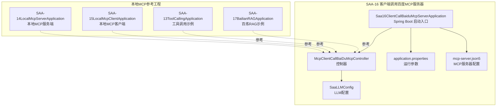
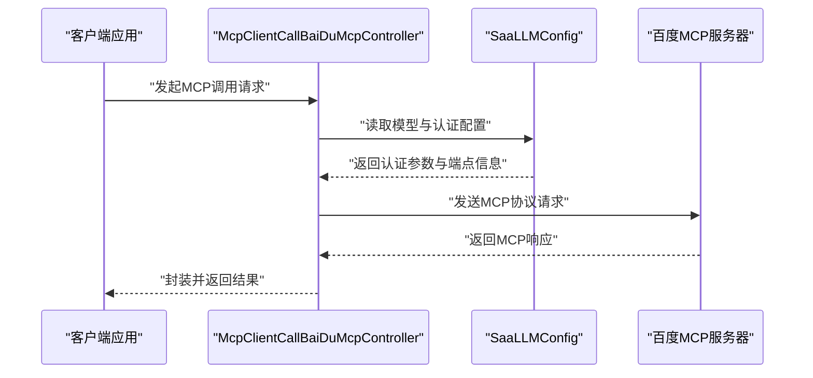
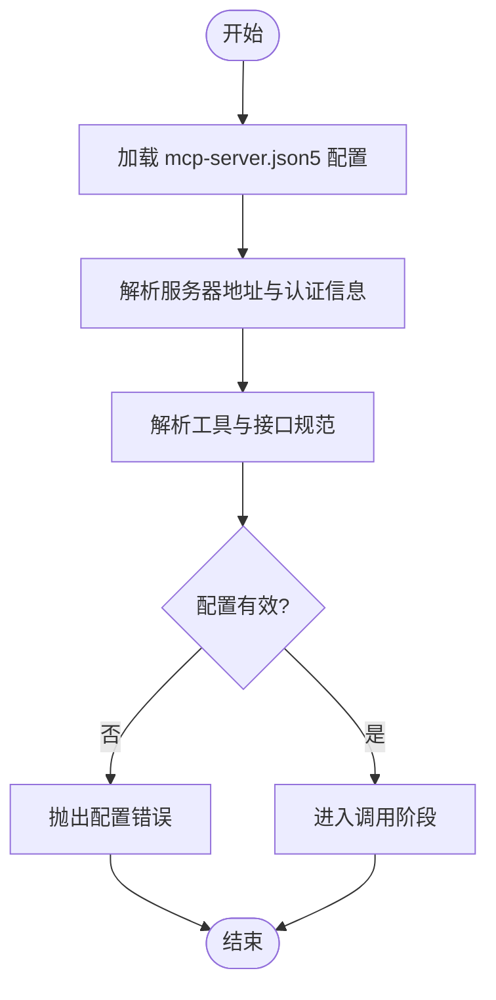
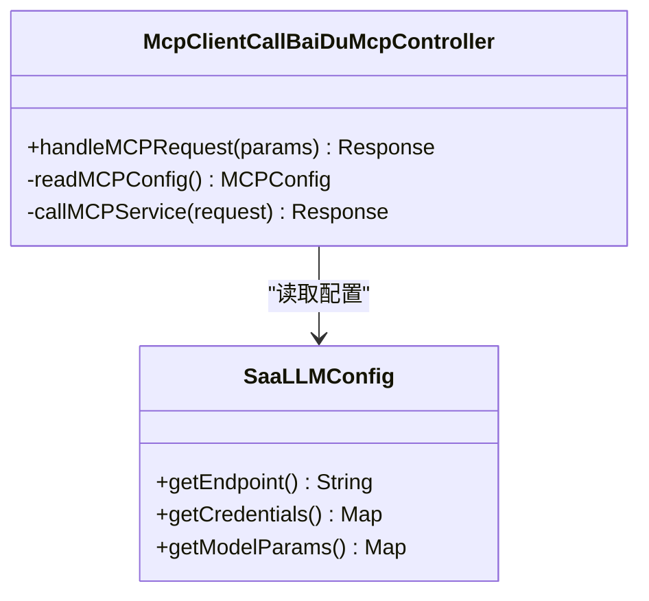
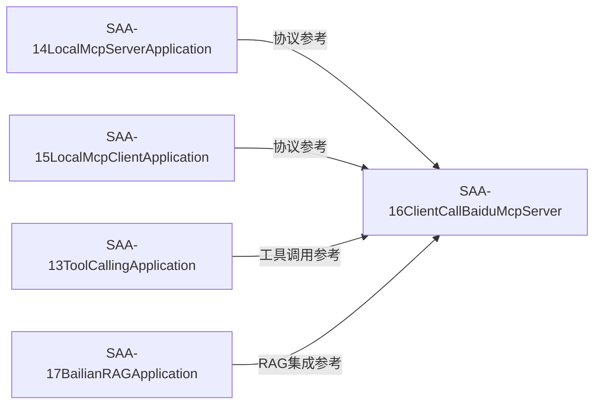
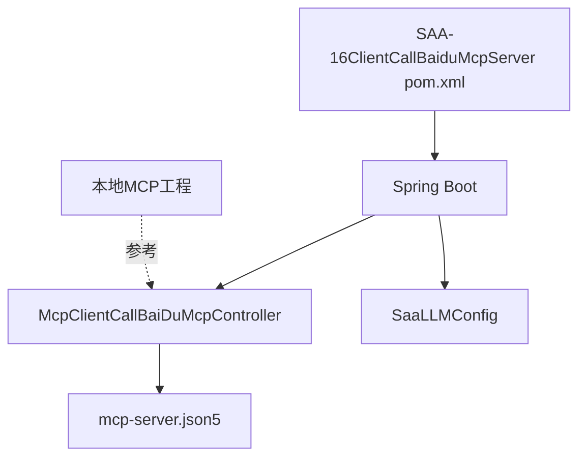

# 百度MCP服务器集成

<cite>
**本文引用的文件**
- [Saa16ClientCallBaiduMcpServerApplication.java](file://【1】SpringAIAlibaba-atguiguV1/SAA-16ClientCallBaiduMcpServer/src/main/java/com/atguigu/study/Saa16ClientCallBaiduMcpServerApplication.java)
- [McpClientCallBaiDuMcpController.java](file://【1】SpringAIAlibaba-atguiguV1/SAA-16ClientCallBaiduMcpServer/src/main/java/com/atguigu/study/controller/McpClientCallBaiDuMcpController.java)
- [SaaLLMConfig.java](file://【1】SpringAIAlibaba-atguiguV1/SAA-16ClientCallBaiduMcpServer/src/main/java/com/atguigu/study/config/SaaLLMConfig.java)
- [application.properties](file://【1】SpringAIAlibaba-atguiguV1/SAA-16ClientCallBaiduMcpServer/src/main/resources/application.properties)
- [mcp-server.json5](file://【1】SpringAIAlibaba-atguiguV1/SAA-16ClientCallBaiduMcpServer/src/main/resources/mcp-server.json5)
- [SAA-16ClientCallBaiduMcpServer pom.xml](file://【1】SpringAIAlibaba-atguiguV1/SAA-16ClientCallBaiduMcpServer/pom.xml)
- [SAA-14LocalMcpServerApplication.java](file://【1】SpringAIAlibaba-atguiguV1/SAA-14LocalMcpServer/src/main/java/com/atguigu/study/Saa14LocalMcpServerApplication.java)
- [SAA-15LocalMcpClientApplication.java](file://【1】SpringAIAlibaba-atguiguV1/SAA-15LocalMcpClient/src/main/java/com/atguigu/study/Saa15LocalMcpClientApplication.java)
- [SAA-13ToolCallingApplication.java](file://【1】SpringAIAlibaba-atguiguV1/SAA-13ToolCalling/src/main/java/com/atguigu/study/Saa13ToolCallingApplication.java)
- [SAA-17BailianRAGApplication.java](file://【1】SpringAIAlibaba-atguiguV1/SAA-17BailianRAG/src/main/java/com/atguigu/study/Saa17BailianRagApplication.java)
</cite>

## 目录
1. [引言](#引言)
2. [项目结构](#项目结构)
3. [核心组件](#核心组件)
4. [架构总览](#架构总览)
5. [详细组件分析](#详细组件分析)
6. [依赖分析](#依赖分析)
7. [性能考虑](#性能考虑)
8. [故障排除指南](#故障排除指南)
9. [结论](#结论)
10. [附录](#附录)

## 引言
本指南面向需要在Spring AI生态中集成百度百炼平台MCP服务器的开发者，目标是提供从服务器配置、认证设置到连接建立的完整操作步骤，并结合仓库中的本地MCP示例工程，帮助读者理解MCP协议在工具服务与接口规范上的落地方式。同时，文档将给出调试方法、故障排除与监控告警的最佳实践，以提升服务可靠性、性能表现与成本控制能力。

## 项目结构
本次集成涉及的关键模块位于“SpringAIAlibaba-atguiguV1”工程下的SAA-16工程，其资源目录包含MCP服务器配置文件与Spring Boot启动入口；同时，仓库提供了本地MCP服务端与客户端示例，便于对照理解MCP协议交互流程。

**图表来源**
- [Saa16ClientCallBaiduMcpServerApplication.java:1-200](file://【1】SpringAIAlibaba-atguiguV1/SAA-16ClientCallBaiduMcpServer/src/main/java/com/atguigu/study/Saa16ClientCallBaiduMcpServerApplication.java#L1-L200)
- [McpClientCallBaiDuMcpController.java:1-200](file://【1】SpringAIAlibaba-atguiguV1/SAA-16ClientCallBaiduMcpServer/src/main/java/com/atguigu/study/controller/McpClientCallBaiDuMcpController.java#L1-L200)
- [SaaLLMConfig.java:1-200](file://【1】SpringAIAlibaba-atguiguV1/SAA-16ClientCallBaiduMcpServer/src/main/java/com/atguigu/study/config/SaaLLMConfig.java#L1-L200)
- [application.properties:1-200](file://【1】SpringAIAlibaba-atguiguV1/SAA-16ClientCallBaiduMcpServer/src/main/resources/application.properties#L1-L200)
- [mcp-server.json5:1-200](file://【1】SpringAIAlibaba-atguiguV1/SAA-16ClientCallBaiduMcpServer/src/main/resources/mcp-server.json5#L1-L200)
- [SAA-14LocalMcpServerApplication.java:1-200](file://【1】SpringAIAlibaba-atguiguV1/SAA-14LocalMcpServer/src/main/java/com/atguigu/study/Saa14LocalMcpServerApplication.java#L1-L200)
- [SAA-15LocalMcpClientApplication.java:1-200](file://【1】SpringAIAlibaba-atguiguV1/SAA-15LocalMcpClient/src/main/java/com/atguigu/study/Saa15LocalMcpClientApplication.java#L1-L200)
- [SAA-13ToolCallingApplication.java:1-200](file://【1】SpringAIAlibaba-atguiguV1/SAA-13ToolCalling/src/main/java/com/atguigu/study/Saa13ToolCallingApplication.java#L1-L200)
- [SAA-17BailianRAGApplication.java:1-200](file://【1】SpringAIAlibaba-atguiguV1/SAA-17BailianRAG/src/main/java/com/atguigu/study/Saa17BailianRagApplication.java#L1-L200)

**章节来源**
- [Saa16ClientCallBaiduMcpServerApplication.java:1-200](file://【1】SpringAIAlibaba-atguiguV1/SAA-16ClientCallBaiduMcpServer/src/main/java/com/atguigu/study/Saa16ClientCallBaiduMcpServerApplication.java#L1-L200)
- [McpClientCallBaiDuMcpController.java:1-200](file://【1】SpringAIAlibaba-atguiguV1/SAA-16ClientCallBaiduMcpServer/src/main/java/com/atguigu/study/controller/McpClientCallBaiDuMcpController.java#L1-L200)
- [SaaLLMConfig.java:1-200](file://【1】SpringAIAlibaba-atguiguV1/SAA-16ClientCallBaiduMcpServer/src/main/java/com/atguigu/study/config/SaaLLMConfig.java#L1-L200)
- [application.properties:1-200](file://【1】SpringAIAlibaba-atguiguV1/SAA-16ClientCallBaiduMcpServer/src/main/resources/application.properties#L1-L200)
- [mcp-server.json5:1-200](file://【1】SpringAIAlibaba-atguiguV1/SAA-16ClientCallBaiduMcpServer/src/main/resources/mcp-server.json5#L1-L200)

## 核心组件
- Spring Boot启动类：负责加载应用上下文与MCP相关配置。
- 控制器：封装对MCP服务器的调用逻辑，作为客户端入口。
- LLM配置：集中管理模型参数与认证信息。
- 运行配置：application.properties用于端口、日志级别等基础参数。
- MCP服务器配置：mcp-server.json5定义远程工具服务与接口规范。

上述组件共同构成“客户端调用百度MCP服务器”的最小可用闭环。

**章节来源**
- [Saa16ClientCallBaiduMcpServerApplication.java:1-200](file://【1】SpringAIAlibaba-atguiguV1/SAA-16ClientCallBaiduMcpServer/src/main/java/com/atguigu/study/Saa16ClientCallBaiduMcpServerApplication.java#L1-L200)
- [McpClientCallBaiDuMcpController.java:1-200](file://【1】SpringAIAlibaba-atguiguV1/SAA-16ClientCallBaiduMcpServer/src/main/java/com/atguigu/study/controller/McpClientCallBaiDuMcpController.java#L1-L200)
- [SaaLLMConfig.java:1-200](file://【1】SpringAIAlibaba-atguiguV1/SAA-16ClientCallBaiduMcpServer/src/main/java/com/atguigu/study/config/SaaLLMConfig.java#L1-L200)
- [application.properties:1-200](file://【1】SpringAIAlibaba-atguiguV1/SAA-16ClientCallBaiduMcpServer/src/main/resources/application.properties#L1-L200)
- [mcp-server.json5:1-200](file://【1】SpringAIAlibaba-atguiguV1/SAA-16ClientCallBaiduMcpServer/src/main/resources/mcp-server.json5#L1-L200)

## 架构总览
下图展示了客户端调用百度MCP服务器的整体流程：客户端通过控制器发起请求，控制器根据mcp-server.json5中的服务器地址与凭据，经由LLM配置完成认证，最终与MCP服务器交互并返回结果。

**图表来源**
- [McpClientCallBaiDuMcpController.java:1-200](file://【1】SpringAIAlibaba-atguiguV1/SAA-16ClientCallBaiduMcpServer/src/main/java/com/atguigu/study/controller/McpClientCallBaiDuMcpController.java#L1-L200)
- [SaaLLMConfig.java:1-200](file://【1】SpringAIAlibaba-atguiguV1/SAA-16ClientCallBaiduMcpServer/src/main/java/com/atguigu/study/config/SaaLLMConfig.java#L1-L200)
- [mcp-server.json5:1-200](file://【1】SpringAIAlibaba-atguiguV1/SAA-16ClientCallBaiduMcpServer/src/main/resources/mcp-server.json5#L1-L200)

## 详细组件分析

### 组件A：MCP服务器配置文件（mcp-server.json5）
该文件用于声明远程MCP服务器的地址、凭据与工具/接口规范。建议关注以下要点：
- 服务器地址与端口：确保与百度百炼平台提供的MCP服务端一致。
- 认证方式：可采用API Key、Token或其他平台要求的鉴权方案。
- 工具与接口规范：定义远程工具的服务名、方法签名、参数与返回格式，以便客户端按规范调用。

**图表来源**
- [mcp-server.json5:1-200](file://【1】SpringAIAlibaba-atguiguV1/SAA-16ClientCallBaiduMcpServer/src/main/resources/mcp-server.json5#L1-L200)

**章节来源**
- [mcp-server.json5:1-200](file://【1】SpringAIAlibaba-atguiguV1/SAA-16ClientCallBaiduMcpServer/src/main/resources/mcp-server.json5#L1-L200)

### 组件B：控制器（McpClientCallBaiDuMcpController）
控制器负责接收业务请求，读取LLM配置与MCP服务器配置，组装MCP协议请求并转发至MCP服务器，最后将响应返回给调用方。建议：
- 在控制器中统一处理异常与超时重试。
- 将MCP请求与业务参数解耦，便于扩展新的工具或接口。

**图表来源**
- [McpClientCallBaiDuMcpController.java:1-200](file://【1】SpringAIAlibaba-atguiguV1/SAA-16ClientCallBaiduMcpServer/src/main/java/com/atguigu/study/controller/McpClientCallBaiDuMcpController.java#L1-L200)
- [SaaLLMConfig.java:1-200](file://【1】SpringAIAlibaba-atguiguV1/SAA-16ClientCallBaiduMcpServer/src/main/java/com/atguigu/study/config/SaaLLMConfig.java#L1-L200)

**章节来源**
- [McpClientCallBaiDuMcpController.java:1-200](file://【1】SpringAIAlibaba-atguiguV1/SAA-16ClientCallBaiduMcpServer/src/main/java/com/atguigu/study/controller/McpClientCallBaiDuMcpController.java#L1-L200)
- [SaaLLMConfig.java:1-200](file://【1】SpringAIAlibaba-atguiguV1/SAA-16ClientCallBaiduMcpServer/src/main/java/com/atguigu/study/config/SaaLLMConfig.java#L1-L200)

### 组件C：Spring Boot启动类（Saa16ClientCallBaiduMcpServerApplication）
启动类负责加载Spring上下文，确保控制器、配置与MCP客户端组件被正确注册与初始化。

**章节来源**
- [Saa16ClientCallBaiduMcpServerApplication.java:1-200](file://【1】SpringAIAlibaba-atguiguV1/SAA-16ClientCallBaiduMcpServer/src/main/java/com/atguigu/study/Saa16ClientCallBaiduMcpServerApplication.java#L1-L200)

### 组件D：本地MCP参考工程
为帮助理解MCP协议交互，仓库提供了本地MCP服务端与客户端示例，以及工具调用与百炼RAG示例。这些工程可作为：
- 协议行为的对照样例
- 工具服务开发的参考模板
- RAG场景下的集成思路

**图表来源**
- [SAA-14LocalMcpServerApplication.java:1-200](file://【1】SpringAIAlibaba-atguiguV1/SAA-14LocalMcpServer/src/main/java/com/atguigu/study/Saa14LocalMcpServerApplication.java#L1-L200)
- [SAA-15LocalMcpClientApplication.java:1-200](file://【1】SpringAIAlibaba-atguiguV1/SAA-15LocalMcpClient/src/main/java/com/atguigu/study/Saa15LocalMcpClientApplication.java#L1-L200)
- [SAA-13ToolCallingApplication.java:1-200](file://【1】SpringAIAlibaba-atguiguV1/SAA-13ToolCalling/src/main/java/com/atguigu/study/Saa13ToolCallingApplication.java#L1-L200)
- [SAA-17BailianRAGApplication.java:1-200](file://【1】SpringAIAlibaba-atguiguV1/SAA-17BailianRAG/src/main/java/com/atguigu/study/Saa17BailianRagApplication.java#L1-L200)

**章节来源**
- [SAA-14LocalMcpServerApplication.java:1-200](file://【1】SpringAIAlibaba-atguiguV1/SAA-14LocalMcpServer/src/main/java/com/atguigu/study/Saa14LocalMcpServerApplication.java#L1-L200)
- [SAA-15LocalMcpClientApplication.java:1-200](file://【1】SpringAIAlibaba-atguiguV1/SAA-15LocalMcpClient/src/main/java/com/atguigu/study/Saa15LocalMcpClientApplication.java#L1-L200)
- [SAA-13ToolCallingApplication.java:1-200](file://【1】SpringAIAlibaba-atguiguV1/SAA-13ToolCalling/src/main/java/com/atguigu/study/Saa13ToolCallingApplication.java#L1-L200)
- [SAA-17BailianRAGApplication.java:1-200](file://【1】SpringAIAlibaba-atguiguV1/SAA-17BailianRAG/src/main/java/com/atguigu/study/Saa17BailianRagApplication.java#L1-L200)

## 依赖分析
- Maven依赖：SAA-16工程通过POM引入Spring Boot与相关AI/HTTP客户端依赖，确保MCP客户端与Web层正常运行。
- 组件耦合：控制器依赖LLM配置与MCP服务器配置；启动类负责装配上下文；本地MCP工程提供行为参考。

**图表来源**
- [SAA-16ClientCallBaiduMcpServer pom.xml:1-200](file://【1】SpringAIAlibaba-atguiguV1/SAA-16ClientCallBaiduMcpServer/pom.xml#L1-L200)

**章节来源**
- [SAA-16ClientCallBaiduMcpServer pom.xml:1-200](file://【1】SpringAIAlibaba-atguiguV1/SAA-16ClientCallBaiduMcpServer/pom.xml#L1-L200)

## 性能考虑
- 连接池与并发：合理配置HTTP客户端连接池大小与超时时间，避免阻塞与资源耗尽。
- 缓存策略：对频繁调用的工具元数据与认证令牌进行缓存，减少重复开销。
- 分页与限流：在调用MCP工具时遵循平台限流规则，必要时采用分页或批量处理。
- 监控指标：埋点记录请求延迟、失败率与重试次数，辅助容量规划与性能优化。

## 故障排除指南
- 配置校验
  - 确认mcp-server.json5中的服务器地址与端口正确无误。
  - 检查认证参数是否完整且未过期。
- 日志与追踪
  - 开启DEBUG级别日志，定位请求/响应细节。
  - 使用分布式追踪（如链路ID）关联控制器、配置读取与MCP调用环节。
- 常见问题
  - 认证失败：核对API Key/TOKEN有效性与权限范围。
  - 超时与熔断：调整超时阈值与重试策略，必要时启用熔断降级。
  - 工具不可用：确认工具名称与版本在远端MCP服务器上已发布并可用。
- 监控告警
  - 设置成功率、P95/P99延迟与错误率阈值告警。
  - 对关键工具调用建立SLA基线，异常波动及时预警。

## 结论
通过SAA-16工程与本地MCP参考工程，开发者可以快速搭建基于MCP协议的百度百炼平台集成方案。建议以mcp-server.json5为配置中心，结合控制器与LLM配置实现标准化调用，并辅以完善的监控与告警体系，持续优化服务可靠性、性能与成本。

## 附录
- 客户端调用示例（步骤化）
  1) 准备mcp-server.json5：填写服务器地址、端口与认证信息。
  2) 配置SaaLLMConfig：注入模型参数与认证凭据。
  3) 编写控制器：在McpClientCallBaiDuMcpController中组织MCP请求。
  4) 启动应用：通过Saa16ClientCallBaiduMcpServerApplication启动。
  5) 调试验证：查看日志与指标，确认工具调用成功。
- 第三方MCP集成优势与挑战
  - 优势：标准化协议、工具复用、跨平台互操作性强。
  - 挑战：网络抖动与超时处理、认证与权限管理、工具版本兼容性与灰度发布。
- 成本控制建议
  - 合理设置并发与重试上限，避免无效流量放大。
  - 对热点工具建立缓存与预热策略。
  - 基于SLA设定预算阈值，超出自动告警与限流。