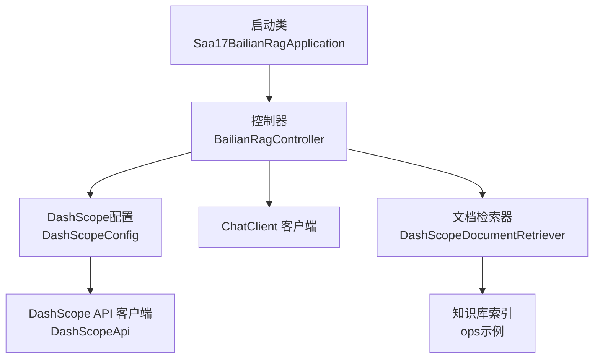
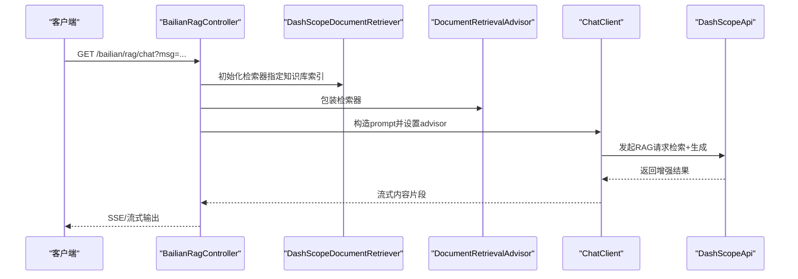
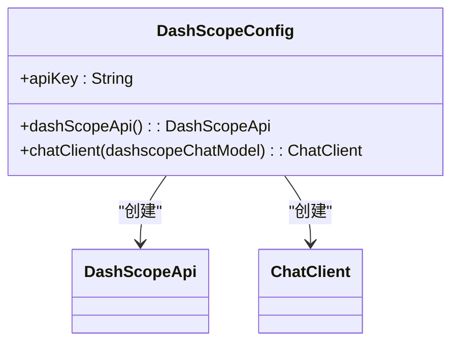
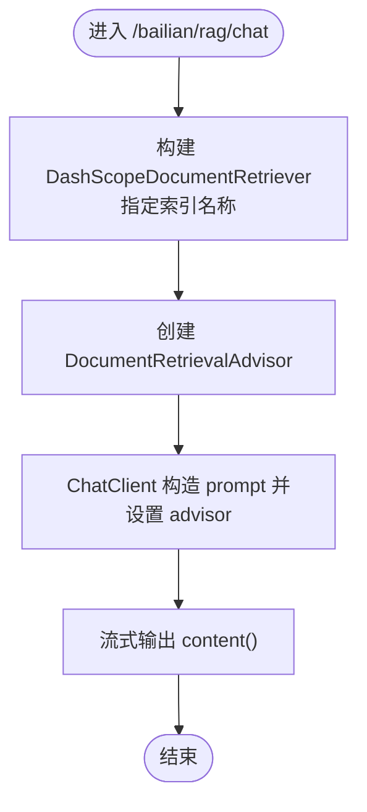
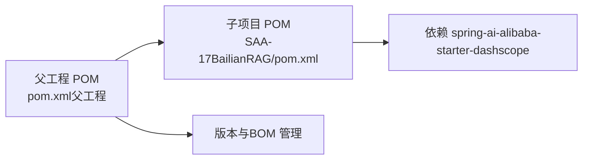

# 百炼RAG应用

<cite>
**本文引用的文件**
- [Saa17BailianRagApplication.java](file://【1】SpringAIAlibaba-atguiguV1/SAA-17BailianRAG/src/main/java/com/atguigu/study/Saa17BailianRagApplication.java)
- [DashScopeConfig.java](file://【1】SpringAIAlibaba-atguiguV1/SAA-17BailianRAG/src/main/java/com/atguigu/study/config/DashScopeConfig.java)
- [BailianRagController.java](file://【1】SpringAIAlibaba-atguiguV1/SAA-17BailianRAG/src/main/java/com/atguigu/study/controller/BailianRagController.java)
- [application.properties](file://【1】SpringAIAlibaba-atguiguV1/SAA-17BailianRAG/src/main/resources/application.properties)
- [pom.xml（百炼RAG子项目）](file://【1】SpringAIAlibaba-atguiguV1/SAA-17BailianRAG/pom.xml)
- [pom.xml（父工程）](file://【1】SpringAIAlibaba-atguiguV1/pom.xml)
- [RagController.java（AiOps示例）](file://【1】SpringAIAlibaba-atguiguV1/SAA-12RAG4AiOps/src/main/java/com/atguigu/study/controller/RagController.java)
</cite>

## 目录
1. [引言](#引言)
2. [项目结构](#项目结构)
3. [核心组件](#核心组件)
4. [架构总览](#架构总览)
5. [详细组件分析](#详细组件分析)
6. [依赖分析](#依赖分析)
7. [性能考虑](#性能考虑)
8. [故障排查指南](#故障排查指南)
9. [结论](#结论)
10. [附录](#附录)

## 引言
本指南面向希望在Spring AI Alibaba生态中集成阿里云百炼平台RAG能力的开发者与运维人员。文档基于仓库中的SAA-17BailianRAG示例，系统讲解如何完成DashScope SDK配置、API密钥管理、服务调用实现，并结合百炼平台的RAG特性（向量检索、知识库管理、对话增强等），提供可落地的实践步骤与最佳实践。同时，对比自建RAG方案，突出百炼平台在“开箱即用、性能优化、运维简化”方面的优势，并给出生产部署、监控与成本优化建议。

## 项目结构
SAA-17BailianRAG是Spring AI Alibaba系列中的一个独立子模块，采用Spring Boot Starter方式接入DashScope服务，通过ChatClient与DocumentRetriever构建RAG对话流。其关键目录与文件如下：
- 启动类：Saa17BailianRagApplication.java
- 配置类：DashScopeConfig.java（定义DashScopeApi与ChatClient Bean）
- 控制器：BailianRagController.java（对外提供REST接口，集成百炼RAG）
- 配置文件：application.properties（端口、应用名、DashScope API Key）
- 依赖管理：SAA-17BailianRAG/pom.xml（引入spring-ai-alibaba-starter-dashscope）
- 父工程：SpringAIAlibaba-atguiguV1/pom.xml（统一版本与BOM）

**图表来源**
- [Saa17BailianRagApplication.java:1-16](file://【1】SpringAIAlibaba-atguiguV1/SAA-17BailianRAG/src/main/java/com/atguigu/study/Saa17BailianRagApplication.java#L1-L16)
- [DashScopeConfig.java:1-30](file://【1】SpringAIAlibaba-atguiguV1/SAA-17BailianRAG/src/main/java/com/atguigu/study/config/DashScopeConfig.java#L1-L30)
- [BailianRagController.java:1-52](file://【1】SpringAIAlibaba-atguiguV1/SAA-17BailianRAG/src/main/java/com/atguigu/study/controller/BailianRagController.java#L1-L52)

**章节来源**
- [Saa17BailianRagApplication.java:1-16](file://【1】SpringAIAlibaba-atguiguV1/SAA-17BailianRAG/src/main/java/com/atguigu/study/Saa17BailianRagApplication.java#L1-L16)
- [DashScopeConfig.java:1-30](file://【1】SpringAIAlibaba-atguiguV1/SAA-17BailianRAG/src/main/java/com/atguigu/study/config/DashScopeConfig.java#L1-L30)
- [BailianRagController.java:1-52](file://【1】SpringAIAlibaba-atguiguV1/SAA-17BailianRAG/src/main/java/com/atguigu/study/controller/BailianRagController.java#L1-L52)
- [application.properties:1-13](file://【1】SpringAIAlibaba-atguiguV1/SAA-17BailianRAG/src/main/resources/application.properties#L1-L13)
- [pom.xml（百炼RAG子项目）:1-80](file://【1】SpringAIAlibaba-atguiguV1/SAA-17BailianRAG/pom.xml#L1-L80)
- [pom.xml（父工程）:1-103](file://【1】SpringAIAlibaba-atguiguV1/pom.xml#L1-L103)

## 核心组件
- DashScope配置（DashScopeConfig）
  - 负责注入API Key并构建DashScopeApi实例，供上层组件使用。
  - 同时注册ChatClient Bean，作为与大模型交互的统一入口。
- 百炼RAG控制器（BailianRagController）
  - 提供/streaming接口，接收用户消息，通过DashScopeDocumentRetriever进行向量检索，再交由ChatClient进行对话增强与流式输出。
- 应用配置（application.properties）
  - 设置服务端口、字符集与DashScope API Key。
- 依赖与版本（pom.xml）
  - 子项目引入spring-ai-alibaba-starter-dashscope，父工程通过BOM统一管理Spring Boot、Spring AI与Spring AI Alibaba版本。

**章节来源**
- [DashScopeConfig.java:1-30](file://【1】SpringAIAlibaba-atguiguV1/SAA-17BailianRAG/src/main/java/com/atguigu/study/config/DashScopeConfig.java#L1-L30)
- [BailianRagController.java:1-52](file://【1】SpringAIAlibaba-atguiguV1/SAA-17BailianRAG/src/main/java/com/atguigu/study/controller/BailianRagController.java#L1-L52)
- [application.properties:1-13](file://【1】SpringAIAlibaba-atguiguV1/SAA-17BailianRAG/src/main/resources/application.properties#L1-L13)
- [pom.xml（百炼RAG子项目）:1-80](file://【1】SpringAIAlibaba-atguiguV1/SAA-17BailianRAG/pom.xml#L1-L80)
- [pom.xml（父工程）:38-79](file://【1】SpringAIAlibaba-atguiguV1/pom.xml#L38-L79)

## 架构总览
下图展示了从客户端到百炼RAG的完整调用链路：客户端发起HTTP请求，控制器构造DashScopeDocumentRetriever检索器，结合ChatClient与DocumentRetrievalAdvisor，最终通过流式响应返回增强后的回答。

**图表来源**
- [BailianRagController.java:34-48](file://【1】SpringAIAlibaba-atguiguV1/SAA-17BailianRAG/src/main/java/com/atguigu/study/controller/BailianRagController.java#L34-L48)
- [DashScopeConfig.java:25-28](file://【1】SpringAIAlibaba-atguiguV1/SAA-17BailianRAG/src/main/java/com/atguigu/study/config/DashScopeConfig.java#L25-L28)

## 详细组件分析

### DashScope配置组件
- 关键点
  - 通过@Value注入API Key，构建DashScopeApi。
  - 注册ChatClient Bean，复用DashScope ChatModel。
  - 示例中注释了工作空间ID，避免与API Key不匹配导致的鉴权失败。
- 最佳实践
  - 将API Key置于环境变量或配置中心，避免硬编码。
  - 在多租户场景下，按需区分工作空间与模型资源。

**图表来源**
- [DashScopeConfig.java:1-30](file://【1】SpringAIAlibaba-atguiguV1/SAA-17BailianRAG/src/main/java/com/atguigu/study/config/DashScopeConfig.java#L1-L30)

**章节来源**
- [DashScopeConfig.java:14-28](file://【1】SpringAIAlibaba-atguiguV1/SAA-17BailianRAG/src/main/java/com/atguigu/study/config/DashScopeConfig.java#L14-L28)

### 百炼RAG控制器
- 关键点
  - 使用DashScopeDocumentRetriever与DashScopeDocumentRetrieverOptions，绑定知识库索引名称（示例：ops）。
  - 通过DocumentRetrievalAdvisor将检索器注入到ChatClient的prompt流程。
  - 返回Flux<String>，实现服务端事件（SSE）式的流式输出。
- 扩展建议
  - 支持多索引切换、检索参数（topK、scoreThreshold）动态配置。
  - 结合业务上下文，定制system提示词与检索前缀。

**图表来源**
- [BailianRagController.java:34-48](file://【1】SpringAIAlibaba-atguiguV1/SAA-17BailianRAG/src/main/java/com/atguigu/study/controller/BailianRagController.java#L34-L48)

**章节来源**
- [BailianRagController.java:34-48](file://【1】SpringAIAlibaba-atguiguV1/SAA-17BailianRAG/src/main/java/com/atguigu/study/controller/BailianRagController.java#L34-L48)

### 与自建RAG的对比（概念性说明）
- 开箱即用
  - 百炼平台提供托管的知识库索引与检索服务，无需自行搭建向量数据库与检索服务。
- 性能优化
  - 平台侧对检索与生成进行资源调度与缓存优化，减少延迟与抖动。
- 运维简化
  - 无需维护向量索引、分词器、嵌入模型等基础设施，降低SRE负担。

（本节为概念性说明，不直接分析具体文件）

### 生产部署要点（概念性说明）
- 配置与密钥
  - 使用环境变量或配置中心注入API Key；在容器编排中通过Secret管理敏感信息。
- 弹性与高可用
  - 通过负载均衡与多副本部署提升可用性；对检索超时与重试策略进行合理配置。
- 监控与可观测性
  - 记录请求耗时、检索命中率、错误率与成本指标；对异常进行告警。
- 成本优化
  - 合理设置检索Top-K、阈值与模型参数；对冷数据进行归档或降级策略。

（本节为概念性说明，不直接分析具体文件）

## 依赖分析
- 版本与BOM
  - 父工程通过dependencyManagement统一管理Spring Boot、Spring AI与Spring AI Alibaba的版本，确保兼容性。
- 子项目依赖
  - 引入spring-ai-alibaba-starter-dashscope，自动装配DashScope相关组件。
- 与其他RAG示例的关系
  - SAA-12RAG4AiOps展示了基于VectorStore的自建RAG流程，便于理解RAG增强的通用模式与差异点。

**图表来源**
- [pom.xml（父工程）:52-79](file://【1】SpringAIAlibaba-atguiguV1/pom.xml#L52-L79)
- [pom.xml（百炼RAG子项目）:19-46](file://【1】SpringAIAlibaba-atguiguV1/SAA-17BailianRAG/pom.xml#L19-L46)

**章节来源**
- [pom.xml（父工程）:38-79](file://【1】SpringAIAlibaba-atguiguV1/pom.xml#L38-L79)
- [pom.xml（百炼RAG子项目）:19-46](file://【1】SpringAIAlibaba-atguiguV1/SAA-17BailianRAG/pom.xml#L19-L46)
- [RagController.java（AiOps示例）:40-42](file://【1】SpringAIAlibaba-atguiguV1/SAA-12RAG4AiOps/src/main/java/com/atguigu/study/controller/RagController.java#L40-L42)

## 性能考虑
- 检索参数调优
  - Top-K与相似度阈值直接影响召回质量与响应时延，应结合业务数据分布进行A/B测试。
- 流式输出
  - 使用Flux进行流式传输，降低首字节延迟，改善用户体验。
- 缓存策略
  - 对热点问题与检索结果进行缓存，减少重复检索与调用次数。
- 资源隔离
  - 在多租户或多索引场景下，对检索与生成资源进行隔离，避免相互干扰。

（本节为通用性能建议，不直接分析具体文件）

## 故障排查指南
- API Key无效或不匹配
  - 确认application.properties中的API Key正确；若使用工作空间，请确保与API Key一致。
- 端口占用
  - 默认端口为8017，若冲突请修改application.properties中的server.port。
- 知识库索引不可用
  - 确认DashScope控制台中已创建并启用索引名称（示例：ops），且具备足够文档。
- 流式输出异常
  - 检查客户端是否正确处理SSE；服务端需确保Flux未被提前终止。

**章节来源**
- [application.properties:1-13](file://【1】SpringAIAlibaba-atguiguV1/SAA-17BailianRAG/src/main/resources/application.properties#L1-L13)
- [DashScopeConfig.java:14-22](file://【1】SpringAIAlibaba-atguiguV1/SAA-17BailianRAG/src/main/java/com/atguigu/study/config/DashScopeConfig.java#L14-L22)
- [BailianRagController.java:34-48](file://【1】SpringAIAlibaba-atguiguV1/SAA-17BailianRAG/src/main/java/com/atguigu/study/controller/BailianRagController.java#L34-L48)

## 结论
通过SAA-17BailianRAG示例，可以快速在Spring AI Alibaba中集成百炼平台的RAG能力。其核心在于：正确的DashScope配置、合适的检索器与Advisor组合、以及流式输出的客户端体验。相较自建RAG，百炼平台提供了更高的可用性与更低的运维成本，适合在生产环境中快速落地。建议在生产部署中完善密钥管理、弹性扩缩容、监控告警与成本优化策略，以获得稳定高效的RAG服务。

## 附录
- 快速开始
  - 启动应用后，访问GET /bailian/rag/chat?msg=...即可体验RAG增强对话。
- 参考示例
  - SAA-12RAG4AiOps展示了基于VectorStore的RAG流程，可作为自建RAG的参考实现。

**章节来源**
- [Saa17BailianRagApplication.java:10-13](file://【1】SpringAIAlibaba-atguiguV1/SAA-17BailianRAG/src/main/java/com/atguigu/study/Saa17BailianRagApplication.java#L10-L13)
- [RagController.java（AiOps示例）:33-51](file://【1】SpringAIAlibaba-atguiguV1/SAA-12RAG4AiOps/src/main/java/com/atguigu/study/controller/RagController.java#L33-L51)