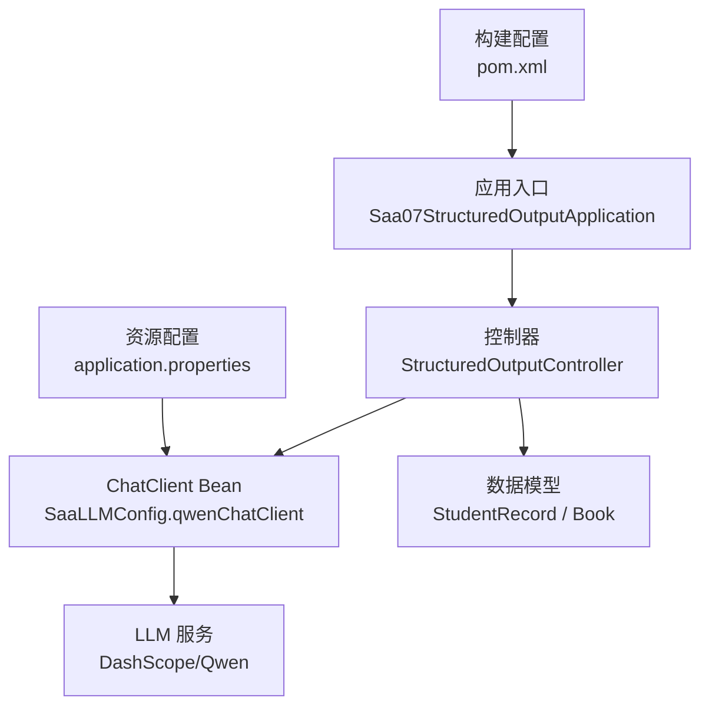
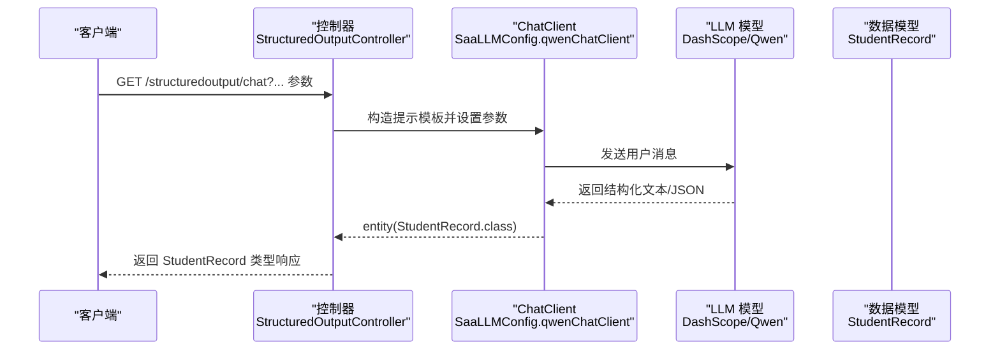
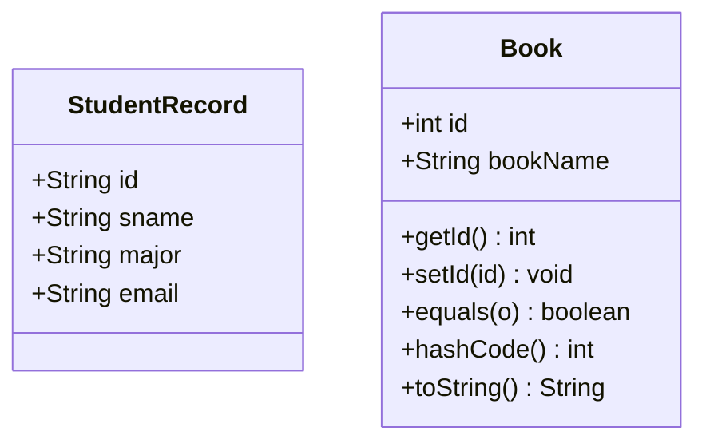
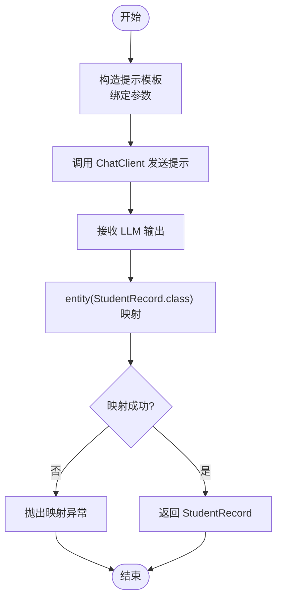
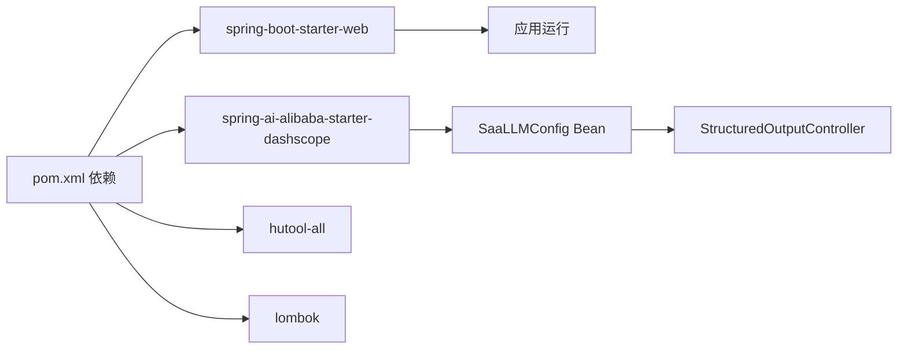

# 结构化输出

<cite>
**本文引用的文件列表**
- [Saa07StructuredOutputApplication.java](file://【1】SpringAIAlibaba-atguiguV1/SAA-07StructuredOutput/src/main/java/com/atguigu/study/Saa07StructuredOutputApplication.java)
- [StructuredOutputController.java](file://【1】SpringAIAlibaba-atguiguV1/SAA-07StructuredOutput/src/main/java/com/atguigu/study/controller/StructuredOutputController.java)
- [StudentRecord.java](file://【1】SpringAIAlibaba-atguiguV1/SAA-07StructuredOutput/src/main/java/com/atguigu/study/records/StudentRecord.java)
- [Book.java](file://【1】SpringAIAlibaba-atguiguV1/SAA-07StructuredOutput/src/main/java/com/atguigu/study/records/Book.java)
- [SaaLLMConfig.java](file://【1】SpringAIAlibaba-atguiguV1/SAA-07StructuredOutput/src/main/java/com/atguigu/study/config/SaaLLMConfig.java)
- [application.properties](file://【1】SpringAIAlibaba-atguiguV1/SAA-07StructuredOutput/src/main/resources/application.properties)
- [pom.xml](file://【1】SpringAIAlibaba-atguiguV1/SAA-07StructuredOutput/pom.xml)
</cite>

## 目录
1. [引言](#引言)
2. [项目结构](#项目结构)
3. [核心组件](#核心组件)
4. [架构总览](#架构总览)
5. [详细组件分析](#详细组件分析)
6. [依赖分析](#依赖分析)
7. [性能考量](#性能考量)
8. [故障排查指南](#故障排查指南)
9. [结论](#结论)
10. [附录](#附录)

## 引言
本文件围绕“结构化输出”模块，系统阐述如何基于 Java Records 实现类型安全的结构化数据输出，涵盖数据模型设计、类型约束与验证机制、与自由文本输出的对比优势、在实际业务中的应用场景（数据提取、格式化报告、自动化处理），以及最佳实践与常见陷阱。该模块通过 Spring AI Alibaba 的 ChatClient 将 LLM 输出直接映射到强类型的 Java 记录类，从而显著降低解析成本、提升业务集成稳定性与可维护性。

## 项目结构
该模块位于 SpringAIAlibaba-atguiguV1 工程下的 SAA-07StructuredOutput 子工程，采用标准 Spring Boot 目录结构，关键文件如下：
- 应用入口：Saa07StructuredOutputApplication
- 控制器：StructuredOutputController（对外暴露结构化输出接口）
- 数据模型：StudentRecord（Java Records）、Book（传统实体）
- 配置：SaaLLMConfig（DashScope ChatClient Bean 定义）
- 资源：application.properties（端口、编码、API Key）
- 构建：pom.xml（依赖、编译参数）

**图表来源**
- [Saa07StructuredOutputApplication.java:1-21](file://【1】SpringAIAlibaba-atguiguV1/SAA-07StructuredOutput/src/main/java/com/atguigu/study/Saa07StructuredOutputApplication.java#L1-L21)
- [StructuredOutputController.java:1-66](file://【1】SpringAIAlibaba-atguiguV1/SAA-07StructuredOutput/src/main/java/com/atguigu/study/controller/StructuredOutputController.java#L1-L66)
- [SaaLLMConfig.java:1-76](file://【1】SpringAIAlibaba-atguiguV1/SAA-07StructuredOutput/src/main/java/com/atguigu/study/config/SaaLLMConfig.java#L1-L76)
- [application.properties:1-11](file://【1】SpringAIAlibaba-atguiguV1/SAA-07StructuredOutput/src/main/resources/application.properties#L1-L11)
- [pom.xml:1-77](file://【1】SpringAIAlibaba-atguiguV1/SAA-07StructuredOutput/pom.xml#L1-L77)

**章节来源**
- [Saa07StructuredOutputApplication.java:1-21](file://【1】SpringAIAlibaba-atguiguV1/SAA-07StructuredOutput/src/main/java/com/atguigu/study/Saa07StructuredOutputApplication.java#L1-L21)
- [application.properties:1-11](file://【1】SpringAIAlibaba-atguiguV1/SAA-07StructuredOutput/src/main/resources/application.properties#L1-L11)
- [pom.xml:1-77](file://【1】SpringAIAlibaba-atguiguV1/SAA-07StructuredOutput/pom.xml#L1-L77)

## 核心组件
- 数据模型层
  - StudentRecord：使用 Java Records 定义不可变结构化数据，字段类型明确，具备构造器与紧凑语法，便于类型安全的结构化输出。
  - Book：传统实体类，演示与 Records 的对比，体现结构化输出在不同模型上的统一处理能力。
- 控制器层
  - StructuredOutputController：提供两个接口，分别通过字符串模板与字符串模板字面量向 LLM 发送提示，随后将输出映射为 StudentRecord。
- 配置层
  - SaaLLMConfig：定义 DashScope ChatModel 与 ChatClient Bean，支持多模型并存与默认模型配置，确保结构化输出的稳定调用。

**章节来源**
- [StudentRecord.java:1-9](file://【1】SpringAIAlibaba-atguiguV1/SAA-07StructuredOutput/src/main/java/com/atguigu/study/records/StudentRecord.java#L1-L9)
- [Book.java:1-63](file://【1】SpringAIAlibaba-atguiguV1/SAA-07StructuredOutput/src/main/java/com/atguigu/study/records/Book.java#L1-L63)
- [StructuredOutputController.java:1-66](file://【1】SpringAIAlibaba-atguiguV1/SAA-07StructuredOutput/src/main/java/com/atguigu/study/controller/StructuredOutputController.java#L1-L66)
- [SaaLLMConfig.java:1-76](file://【1】SpringAIAlibaba-atguiguV1/SAA-07StructuredOutput/src/main/java/com/atguigu/study/config/SaaLLMConfig.java#L1-L76)

## 架构总览
结构化输出的关键流程是：控制器接收请求参数，构造提示模板，调用 ChatClient 发送到 LLM，再将返回的 JSON/文本结构映射为 Java Records 或实体对象，最终以强类型响应返回。

**图表来源**
- [StructuredOutputController.java:28-42](file://【1】SpringAIAlibaba-atguiguV1/SAA-07StructuredOutput/src/main/java/com/atguigu/study/controller/StructuredOutputController.java#L28-L42)
- [SaaLLMConfig.java:56-64](file://【1】SpringAIAlibaba-atguiguV1/SAA-07StructuredOutput/src/main/java/com/atguigu/study/config/SaaLLMConfig.java#L56-L64)

## 详细组件分析

### 数据模型设计与类型约束
- StudentRecord（Java Records）
  - 不可变性：字段在构造时即确定，避免运行期被修改，天然保证线程安全与数据一致性。
  - 紧凑声明：仅需字段列表即可生成构造器、equals/hashCode、toString 等，减少样板代码。
  - 类型约束：字段类型明确，调用方与 LLM 输出之间形成强契约，便于静态校验与 IDE 支持。
- Book（传统实体）
  - 展示了与 Records 的对比，同样可作为结构化输出的目标类型，但需要额外的 getter/setter/equals/hashCode 等实现。

**图表来源**
- [StudentRecord.java:1-9](file://【1】SpringAIAlibaba-atguiguV1/SAA-07StructuredOutput/src/main/java/com/atguigu/study/records/StudentRecord.java#L1-L9)
- [Book.java:1-63](file://【1】SpringAIAlibaba-atguiguV1/SAA-07StructuredOutput/src/main/java/com/atguigu/study/records/Book.java#L1-L63)

**章节来源**
- [StudentRecord.java:1-9](file://【1】SpringAIAlibaba-atguiguV1/SAA-07StructuredOutput/src/main/java/com/atguigu/study/records/StudentRecord.java#L1-L9)
- [Book.java:1-63](file://【1】SpringAIAlibaba-atguiguV1/SAA-07StructuredOutput/src/main/java/com/atguigu/study/records/Book.java#L1-L63)

### 类型约束与验证机制
- 运行时映射约束
  - 控制器通过 ChatClient 的 entity(...) 方法将 LLM 输出映射到 StudentRecord，若输出字段与记录类不匹配，将抛出异常，从而在第一时间暴露结构不一致问题。
- 字段类型约束
  - StudentRecord 的字段类型在编译期即确定，避免运行期类型转换错误；与 LLM 的提示模板配合，可减少因类型不一致导致的解析失败。
- 参数注入与模板绑定
  - 控制器在构造提示时使用参数占位符与模板字面量，确保输入参数与输出结构的一致性，降低自由文本解析的歧义风险。

**图表来源**
- [StructuredOutputController.java:28-42](file://【1】SpringAIAlibaba-atguiguV1/SAA-07StructuredOutput/src/main/java/com/atguigu/study/controller/StructuredOutputController.java#L28-L42)

**章节来源**
- [StructuredOutputController.java:28-42](file://【1】SpringAIAlibaba-atguiguV1/SAA-07StructuredOutput/src/main/java/com/atguigu/study/controller/StructuredOutputController.java#L28-L42)

### 与自由文本输出的对比优势
- 数据解析便利性
  - 自由文本输出需要复杂的正则或解析器，易出错且难以维护；结构化输出直接映射到强类型对象，解析成本几乎为零。
- 业务逻辑集成
  - 强类型对象可直接参与业务逻辑运算、序列化、缓存等操作，减少中间转换步骤，降低耦合度。
- 错误率降低
  - 编译期类型检查与运行期映射校验共同作用，提前暴露字段缺失、类型不匹配等问题，显著降低生产环境错误率。

### 实际业务场景应用
- 数据提取
  - 从非结构化文本中抽取固定字段（如学号、姓名、专业、邮箱），直接映射为 StudentRecord，便于后续入库或二次加工。
- 格式化报告
  - 将 LLM 生成的摘要、指标、标签等按预设结构输出，统一格式，便于前端渲染与报表系统消费。
- 自动化处理
  - 在工作流或工具链中，结构化输出可作为下游服务的稳定输入，减少手工适配成本，提高自动化程度。

### 最佳实践与常见陷阱
- 最佳实践
  - 明确提示模板中的字段与 StudentRecord 字段一一对应，避免遗漏或多余字段。
  - 使用参数化提示，确保输入参数与模板占位符严格匹配。
  - 在控制器层捕获映射异常，进行统一错误处理与日志记录。
  - 对于复杂结构，优先使用 Records，简化模型定义与维护。
- 常见陷阱
  - 忽视字段类型差异：例如将数字型 ID 作为字符串传入，导致映射失败。
  - 模板字段与模型字段不一致：提示模板中缺少或多出字段，引发映射异常。
  - 未设置正确的默认模型或 API Key，导致调用失败。

**章节来源**
- [StructuredOutputController.java:28-42](file://【1】SpringAIAlibaba-atguiguV1/SAA-07StructuredOutput/src/main/java/com/atguigu/study/controller/StructuredOutputController.java#L28-L42)
- [application.properties:1-11](file://【1】SpringAIAlibaba-atguiguV1/SAA-07StructuredOutput/src/main/resources/application.properties#L1-L11)

## 依赖分析
- Spring Boot Web：提供 Web 控制器与 HTTP 服务器能力。
- Spring AI Alibaba（DashScope）：提供 ChatModel 与 ChatClient，支持多模型并存与默认模型配置。
- Hutool：提供常用工具类（本模块未直接使用，保留以备扩展）。
- Lombok：提供注解简化实体类（本模块未直接使用，保留以备扩展）。

**图表来源**
- [pom.xml:15-42](file://【1】SpringAIAlibaba-atguiguV1/SAA-07StructuredOutput/pom.xml#L15-L42)
- [SaaLLMConfig.java:56-64](file://【1】SpringAIAlibaba-atguiguV1/SAA-07StructuredOutput/src/main/java/com/atguigu/study/config/SaaLLMConfig.java#L56-L64)

**章节来源**
- [pom.xml:1-77](file://【1】SpringAIAlibaba-atguiguV1/SAA-07StructuredOutput/pom.xml#L1-L77)
- [SaaLLMConfig.java:1-76](file://【1】SpringAIAlibaba-atguiguV1/SAA-07StructuredOutput/src/main/java/com/atguigu/study/config/SaaLLMConfig.java#L1-L76)

## 性能考量
- 映射开销：entity(...) 映射在 JVM 内完成，通常远小于自由文本解析的 CPU 与内存消耗。
- 模型选择：通过多模型 Bean 并存，可在不同场景选择合适模型，平衡速度与质量。
- 参数编译：编译参数启用 -parameters，有助于框架更好地识别参数名，减少运行时反射成本。

**章节来源**
- [pom.xml:54-61](file://【1】SpringAIAlibaba-atguiguV1/SAA-07StructuredOutput/pom.xml#L54-L61)
- [SaaLLMConfig.java:29-54](file://【1】SpringAIAlibaba-atguiguV1/SAA-07StructuredOutput/src/main/java/com/atguigu/study/config/SaaLLMConfig.java#L29-L54)

## 故障排查指南
- 映射异常
  - 症状：entity(...) 映射失败，抛出异常。
  - 排查：检查提示模板字段与 StudentRecord 字段是否一致；确认字段类型匹配；核对参数注入是否正确。
- 模型调用失败
  - 症状：ChatClient 调用失败。
  - 排查：确认 application.properties 中的 API Key 是否正确；检查默认模型配置是否有效。
- 端口与编码
  - 症状：访问异常或中文乱码。
  - 排查：确认 server.port 设置；检查字符集与编码配置。

**章节来源**
- [application.properties:1-11](file://【1】SpringAIAlibaba-atguiguV1/SAA-07StructuredOutput/src/main/resources/application.properties#L1-L11)
- [StructuredOutputController.java:28-42](file://【1】SpringAIAlibaba-atguiguV1/SAA-07StructuredOutput/src/main/java/com/atguigu/study/controller/StructuredOutputController.java#L28-L42)

## 结论
通过 Java Records 与 Spring AI Alibaba 的结构化输出能力，可以将 LLM 的非结构化输出直接映射为强类型对象，显著降低解析成本、提升业务集成稳定性与可维护性。结合清晰的提示模板与严格的字段约束，能够在数据提取、格式化报告与自动化处理等场景中发挥巨大价值。建议在实际项目中优先采用 Records 定义数据模型，并建立完善的提示模板与参数校验机制，持续优化模型选择与错误处理策略。

## 附录
- 示例接口
  - GET /structuredoutput/chat?...：将 LLM 输出映射为 StudentRecord。
  - GET /structuredoutput/chat2?...：使用字符串模板字面量进行结构化输出。
- 关键配置
  - application.properties：端口、编码、API Key。
  - pom.xml：依赖与编译参数。

**章节来源**
- [StructuredOutputController.java:28-64](file://【1】SpringAIAlibaba-atguiguV1/SAA-07StructuredOutput/src/main/java/com/atguigu/study/controller/StructuredOutputController.java#L28-L64)
- [application.properties:1-11](file://【1】SpringAIAlibaba-atguiguV1/SAA-07StructuredOutput/src/main/resources/application.properties#L1-L11)
- [pom.xml:1-77](file://【1】SpringAIAlibaba-atguiguV1/SAA-07StructuredOutput/pom.xml#L1-L77)