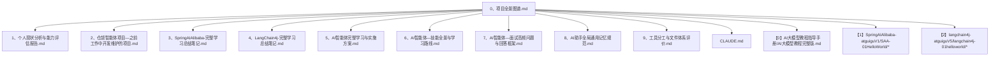
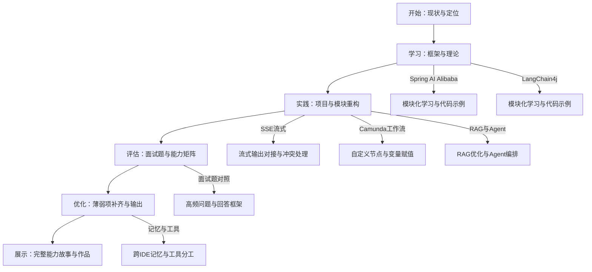
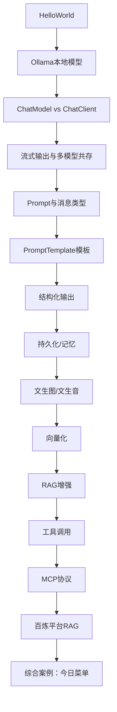
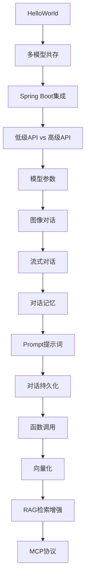
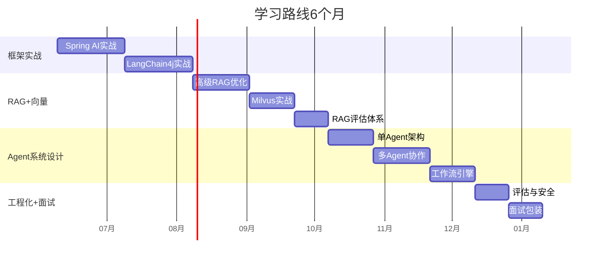

# 学习资源与笔记

<cite>
**本文引用的文件**   
- [0、项目全景图谱.md](file://0、项目全景图谱.md)
- [1、个人现状分析与能力评估报告.md](file://1、个人现状分析与能力评估报告.md)
- [2、仓颉智能体项目—之前工作中开发维护的项目.md](file://2、仓颉智能体项目—之前工作中开发维护的项目.md)
- [3、SpringAIAlibaba-完整学习总结笔记.md](file://3、SpringAIAlibaba-完整学习总结笔记.md)
- [4、LangChain4j-完整学习总结笔记.md](file://4、LangChain4j-完整学习总结笔记.md)
- [5、AI智能体完整学习与实施方案.md](file://5、AI智能体完整学习与实施方案.md)
- [6、AI智能体—技能全景与学习路线.md](file://6、AI智能体—技能全景与学习路线.md)
- [7、AI智能体—面试高频问题与回答框架.md](file://7、AI智能体—面试高频问题与回答框架.md)
- [8、AI助手全局通用记忆规范.md](file://8、AI助手全局通用记忆规范.md)
- [9、工具分工与文件体系评价.md](file://9、工具分工与文件体系评价.md)
- [CLAUDE.md](file://CLAUDE.md)
- [【0】AI大模型教程（指导手册）/AI大模型教程完整版.md](file://【0】AI大模型教程（指导手册）/AI大模型教程完整版.md)
- [【1】SpringAIAlibaba-atguiguV1/SAA-01HelloWorld/src/main/java/com/atguigu/study/Saa01HelloWorldApplication.java](file://【1】SpringAIAlibaba-atguiguV1/SAA-01HelloWorld/src/main/java/com/atguigu/study/Saa01HelloWorldApplication.java)
- [【1】SpringAIAlibaba-atguiguV1/SAA-01HelloWorld/src/main/resources/application.properties](file://【1】SpringAIAlibaba-atguiguV1/SAA-01HelloWorld/src/main/resources/application.properties)
- [【1】SpringAIAlibaba-atguiguV1/pom.xml](file://【1】SpringAIAlibaba-atguiguV1/pom.xml)
- [【2】langchain4j-atguiguV5/langchain4j-01helloworld/pom.xml](file://【2】langchain4j-atguiguV5/langchain4j-01helloworld/pom.xml)
- [【2】langchain4j-atguiguV5/langchain4j-01helloworld/src/main/java/com/atguigu/study/HelloLangChain4JApp.java](file://【2】langchain4j-atguiguV5/langchain4j-01helloworld/src/main/java/com/atguigu/study/HelloLangChain4JApp.java)
</cite>

## 更新摘要
**变更内容**   
- 更新了AI智能体完整学习与实施方案文档的简化版本说明
- 调整了学习路径规划的表述，从完整的365行学习方案简化为更精简的操作指南
- 优化了实施策略的描述，突出面试导向的学习方法
- 更新了项目实践与面试准备的整合方式

## 目录
1. [引言](#引言)
2. [项目结构](#项目结构)
3. [核心组件](#核心组件)
4. [架构总览](#架构总览)
5. [详细组件分析](#详细组件分析)
6. [依赖分析](#依赖分析)
7. [性能考量](#性能考量)
8. [故障排查指南](#故障排查指南)
9. [结论](#结论)
10. [附录](#附录)

## 引言
本文件为学习资源与笔记的综合性参考资料，围绕 Spring AI Alibaba、LangChain4j 以及 AI 智能体相关主题，系统整理学习路径、技能评估与能力发展计划，结合个人项目实践与面试准备，提供可操作的学习建议与资源推荐。内容覆盖从入门到进阶的完整体系，兼顾不同水平学习者的需求。

**更新** 本次更新重点反映了学习方案从完整365行详细规划简化为更实用的操作指南的转变，更加注重面试导向和实践效率。

## 项目结构
本仓库由"个人现状与项目经验""框架学习笔记""实施方案与路线图""面试准备""工具与记忆体系"等模块构成，形成"现状—学习—实践—面试—工具"的闭环。



**图示来源**
- [0、项目全景图谱.md:124-196](file://0、项目全景图谱.md#L124-L196)
- [3、SpringAIAlibaba-完整学习总结笔记.md:1-50](file://3、SpringAIAlibaba-完整学习总结笔记.md#L1-L50)
- [4、LangChain4j-完整学习总结笔记.md:1-50](file://4、LangChain4j-完整学习总结笔记.md#L1-L50)
- [5、AI智能体完整学习与实施方案.md:1-50](file://5、AI智能体完整学习与实施方案.md#L1-L50)
- [6、AI智能体—技能全景与学习路线.md:1-50](file://6、AI智能体—技能全景与学习路线.md#L1-L50)
- [7、AI智能体—面试高频问题与回答框架.md:1-50](file://7、AI智能体—面试高频问题与回答框架.md#L1-L50)
- [8、AI助手全局通用记忆规范.md:1-50](file://8、AI助手全局通用记忆规范.md#L1-L50)
- [9、工具分工与文件体系评价.md:1-50](file://9、工具分工与文件体系评价.md#L1-L50)
- [CLAUDE.md:1-50](file://CLAUDE.md#L1-L50)
- [【0】AI大模型教程（指导手册）/AI大模型教程完整版.md:1-50](file://【0】AI大模型教程（指导手册）/AI大模型教程完整版.md#L1-L50)
- [【1】SpringAIAlibaba-atguiguV1/SAA-01HelloWorld/src/main/java/com/atguigu/study/Saa01HelloWorldApplication.java:1-16](file://【1】SpringAIAlibaba-atguiguV1/SAA-01HelloWorld/src/main/java/com/atguigu/study/Saa01HelloWorldApplication.java#L1-L16)
- [【2】langchain4j-atguiguV5/langchain4j-01helloworld/src/main/java/com/atguigu/study/HelloLangChain4JApp.java:1-19](file://【2】langchain4j-atguiguV5/langchain4j-01helloworld/src/main/java/com/atguigu/study/HelloLangChain4JApp.java#L1-L19)

**章节来源**
- [0、项目全景图谱.md:124-196](file://0、项目全景图谱.md#L124-L196)

## 核心组件
- 框架学习笔记：系统记录 Spring AI Alibaba 与 LangChain4j 的模块化学习成果，覆盖从 HelloWorld 到高级特性（Prompt、RAG、Tool Calling、MCP、多模态等）。
- 实施方案与路线：提供以面试题驱动的学习策略、阶段化学习路径与项目重构建议，强调"理论+实践+项目经验"的串联。
- 面试准备：整理高频面试题与"仓颉项目对照"，形成"有经验/需补理论"的分级准备清单。
- 工具与记忆：建立跨 IDE 的通用记忆规范与工具分工体系，保障学习与工作的连续性。

**更新** 学习方案已从详细的365行完整规划简化为更实用的操作指南，更加注重面试导向和实际应用效率。

**章节来源**
- [3、SpringAIAlibaba-完整学习总结笔记.md:1-50](file://3、SpringAIAlibaba-完整学习总结笔记.md#L1-L50)
- [4、LangChain4j-完整学习总结笔记.md:1-50](file://4、LangChain4j-完整学习总结笔记.md#L1-L50)
- [5、AI智能体完整学习与实施方案.md:1-50](file://5、AI智能体完整学习与实施方案.md#L1-L50)
- [6、AI智能体—技能全景与学习路线.md:1-50](file://6、AI智能体—技能全景与学习路线.md#L1-L50)
- [7、AI智能体—面试高频问题与回答框架.md:1-50](file://7、AI智能体—面试高频问题与回答框架.md#L1-L50)
- [8、AI助手全局通用记忆规范.md:1-50](file://8、AI助手全局通用记忆规范.md#L1-L50)
- [9、工具分工与文件体系评价.md:1-50](file://9、工具分工与文件体系评价.md#L1-L50)

## 架构总览
从"个人现状—框架学习—项目实践—面试准备—工具体系"的视角，形成可迁移、可持续的学习与能力发展路径。



**图示来源**
- [1、个人现状分析与能力评估报告.md:187-203](file://1、个人现状分析与能力评估报告.md#L187-L203)
- [3、SpringAIAlibaba-完整学习总结笔记.md:1-50](file://3、SpringAIAlibaba-完整学习总结笔记.md#L1-L50)
- [4、LangChain4j-完整学习总结笔记.md:1-50](file://4、LangChain4j-完整学习总结笔记.md#L1-L50)
- [5、AI智能体完整学习与实施方案.md:1-50](file://5、AI智能体完整学习与实施方案.md#L1-L50)
- [6、AI智能体—技能全景与学习路线.md:90-113](file://6、AI智能体—技能全景与学习路线.md#L90-L113)
- [7、AI智能体—面试高频问题与回答框架.md:1-50](file://7、AI智能体—面试高频问题与回答框架.md#L1-L50)
- [8、AI助手全局通用记忆规范.md:1-50](file://8、AI助手全局通用记忆规范.md#L1-L50)
- [9、工具分工与文件体系评价.md:1-50](file://9、工具分工与文件体系评价.md#L1-L50)

## 详细组件分析

### 组件A：Spring AI Alibaba 学习体系
- 模块化覆盖：从 HelloWorld 到综合案例，包含 ChatModel/ChatClient、Prompt/PromptTemplate、结构化输出、持久化/记忆、文生图/音、向量化、RAG、工具调用、MCP 协议、百炼平台 RAG、今日菜单等。
- 技术要点：ChatModel 与 ChatClient 的对比、流式输出、多模型共存、System Prompt 与消息类型、模板化 Prompt、结构化输出、向量化、RAG 检索增强、工具调用、MCP 服务端/客户端、百炼平台集成。
- 实践建议：以模块为单位完成接口测试与参数调优，结合项目中的 SSE 流式输出与工作流节点经验，加深对"生产级流式与节点冲突处理"的理解。



**图示来源**
- [3、SpringAIAlibaba-完整学习总结笔记.md:11-36](file://3、SpringAIAlibaba-完整学习总结笔记.md#L11-L36)

**章节来源**
- [3、SpringAIAlibaba-完整学习总结笔记.md:40-310](file://3、SpringAIAlibaba-完整学习总结笔记.md#L40-L310)

### 组件B：LangChain4j 学习体系
- 模块化覆盖：HelloWorld、多模型共存、Spring Boot 集成、低级/高级 API、模型参数、图像对话、流式对话、对话记忆、Prompt、对话持久化、函数调用、向量化、RAG、MCP 等。
- 技术要点：OpenAI 兼容模式调用阿里云模型、ChatModel 与 AiServices 的对比、工具注册与函数调用、对话记忆与持久化、Prompt 工程、向量化与 RAG、MCP 协议。
- 实践建议：结合 Spring AI Alibaba 的 ChatClient 与 LangChain4j 的 AiServices，对比两种高级 API 的差异与适用场景。



**图示来源**
- [4、LangChain4j-完整学习总结笔记.md:15-31](file://4、LangChain4j-完整学习总结笔记.md#L15-L31)

**章节来源**
- [4、LangChain4j-完整学习总结笔记.md:260-720](file://4、LangChain4j-完整学习总结笔记.md#L260-L720)

### 组件C：智能体实施方案与学习路线
- 学习策略：以面试题驱动，结合仓颉项目经验，补齐 RAG 优化、Agent 编排、向量数据库、模型微调、评估监控等薄弱项。
- 阶段化路径：框架深度实战、高级 RAG 与向量数据库、Agent 系统设计、工程化与面试包装。
- 技术选型：基于数据规模、检索策略、复杂度与团队能力，选择合适的向量数据库与 Agent 架构模式。

**更新** 学习方案已从完整的365行详细规划简化为更实用的操作指南，更加注重面试导向和实际应用效率。



**图示来源**
- [6、AI智能体—技能全景与学习路线.md:90-113](file://6、AI智能体—技能全景与学习路线.md#L90-L113)

**章节来源**
- [5、AI智能体完整学习与实施方案.md:416-594](file://5、AI智能体完整学习与实施方案.md#L416-L594)
- [6、AI智能体—技能全景与学习路线.md:117-152](file://6、AI智能体—技能全景与学习路线.md#L117-L152)

### 组件D：面试准备与能力矩阵
- 题目分级：将面试题按"项目中有经验/需要补理论"进行分级，形成"有经验串讲 + 理论补强"的策略。
- 能力画像：明确强项（SSE 流式输出、Camunda 工作流、跨系统对接、对话系统维护）与弱项（RAG 深度、向量数据库、Agent 编排、模型微调、评估体系）。
- 面试叙事：以"10年底座 + 仓颉生产经验 + 框架理论补全"为主线，串联真实项目经验与学习成果。


**图示来源**
- [1、个人现状分析与能力评估报告.md:187-203](file://1、个人现状分析与能力评估报告.md#L187-L203)
- [7、AI智能体—面试高频问题与回答框架.md:1-50](file://7、AI智能体—面试高频问题与回答框架.md#L1-L50)

**章节来源**
- [7、AI智能体—面试高频问题与回答框架.md:17-120](file://7、AI智能体—面试高频问题与回答框架.md#L17-L120)
- [1、个人现状分析与能力评估报告.md:71-100](file://1、个人现状分析与能力评估报告.md#L71-L100)

### 组件E：工具与记忆体系
- 跨 IDE 记忆规范：建立通用层/工具层/项目层三层记忆架构，支持 VSCode 与 IDEA 的记忆同步与自动加载。
- 工具分工：明确 IDEA 写代码、VSCode 管理文档的边界，保持工作流一致性与效率。

```mermaid
graph TB
subgraph "IDEA"
IDEA["写代码与模块开发"]
end
subgraph "VSCode"
VS["文档与记忆管理"]
end
subgraph "记忆系统"
GEN["通用层记忆"]
TOOL["工具层记忆"]
PROJ["项目层记忆"]
end
IDEA --> PROJ
VS --> TOOL
VS --> GEN
PROJ --> GEN
TOOL --> GEN
```

**图示来源**
- [8、AI助手全局通用记忆规范.md:1-50](file://8、AI助手全局通用记忆规范.md#L1-L50)
- [9、工具分工与文件体系评价.md:1-50](file://9、工具分工与文件体系评价.md#L1-L50)

**章节来源**
- [8、AI助手全局通用记忆规范.md:1-50](file://8、AI助手全局通用记忆规范.md#L1-L50)
- [9、工具分工与文件体系评价.md:1-50](file://9、工具分工与文件体系评价.md#L1-L50)

## 依赖分析
- 技术栈与版本：Spring Boot 3.5.5、Spring AI 1.0.0、Spring AI Alibaba 1.0.0.2、Java 21；LangChain4j 1.0.1、OpenAI 兼容模式。
- 模块依赖：Spring AI Alibaba 与 Spring AI 的 BOM 管理；LangChain4j 的 open-ai 与 langchain4j 依赖组合。
- 实践建议：在模块化学习中，优先掌握 ChatClient 与 AiServices 的对比与适用场景，结合项目中的 SSE 流式输出与工作流节点，形成"框架能力 + 工程经验"的综合能力。


**图示来源**
- [【1】SpringAIAlibaba-atguiguV1/pom.xml:13-31](file://【1】SpringAIAlibaba-atguiguV1/pom.xml#L13-L31)
- [【2】langchain4j-atguiguV5/langchain4j-01helloworld/pom.xml:23-46](file://【2】langchain4j-atguiguV5/langchain4j-01helloworld/pom.xml#L23-L46)

**章节来源**
- [【1】SpringAIAlibaba-atguiguV1/pom.xml:38-79](file://【1】SpringAIAlibaba-atguiguV1/pom.xml#L38-L79)
- [【2】langchain4j-atguiguV5/langchain4j-01helloworld/pom.xml:23-46](file://【2】langchain4j-atguiguV5/langchain4j-01helloworld/pom.xml#L23-L46)

## 性能考量
- 流式输出体验：SSE 流式推送与前端渲染的延迟优化、chunk 分块大小与推送节奏的平衡。
- 检索性能：向量检索与关键词检索的融合策略、Rerank 重排序的成本与收益权衡、索引类型（HNSW/IVF）的选择与参数调优。
- 生成质量：Temperature、TopP、频率/存在惩罚等参数对稳定性与多样性的影响，结合业务场景进行调优。

## 故障排查指南
- 接口对接与参数校验：通过 CURL + Postman 复现问题，定位是应用侧参数组装问题还是下游算法/模型问题。
- 流式输出冲突：在流式输出与下游回复节点之间建立职责分离与状态标记，避免重复推送与内容不完整。
- 工作流节点异常：利用流程变量与节点日志追踪数据流转，结合 BPMN 网关自动修复机制，保证流程收敛与可审计。

**章节来源**
- [2、仓颉智能体项目—之前工作中开发维护的项目.md:159-177](file://2、仓颉智能体项目—之前工作中开发维护的项目.md#L159-L177)
- [7、AI智能体—面试高频问题与回答框架.md:565-629](file://7、AI智能体—面试高频问题与回答框架.md#L565-L629)

## 结论
本学习资源与笔记以"个人现状—框架学习—项目实践—面试准备—工具体系"为主线，构建了可迁移、可持续的能力发展路径。通过模块化学习与阶段性实践，结合面试题驱动与项目经验翻译，既能补齐理论短板，又能形成可展示的作品与完整叙事，助力在 AI 智能体方向的职业发展。

**更新** 学习方案的简化体现了从理论深度向实践效率的转变，更加注重面试导向和实际应用能力的培养。

## 附录
- 代码示例入口：Spring AI Alibaba 的 HelloWorld 应用入口与配置文件；LangChain4j 的 HelloWorld 应用入口与依赖配置。
- 教程与指导：AI 大模型教程完整版，提供系统化的入门指导与最佳实践。

**章节来源**
- [【1】SpringAIAlibaba-atguiguV1/SAA-01HelloWorld/src/main/java/com/atguigu/study/Saa01HelloWorldApplication.java:1-16](file://【1】SpringAIAlibaba-atguiguV1/SAA-01HelloWorld/src/main/java/com/atguigu/study/Saa01HelloWorldApplication.java#L1-L16)
- [【1】SpringAIAlibaba-atguiguV1/SAA-01HelloWorld/src/main/resources/application.properties:1-20](file://【1】SpringAIAlibaba-atguiguV1/SAA-01HelloWorld/src/main/resources/application.properties#L1-L20)
- [【2】langchain4j-atguiguV5/langchain4j-01helloworld/src/main/java/com/atguigu/study/HelloLangChain4JApp.java:1-19](file://【2】langchain4j-atguiguV5/langchain4j-01helloworld/src/main/java/com/atguigu/study/HelloLangChain4JApp.java#L1-L19)
- [【0】AI大模型教程（指导手册）/AI大模型教程完整版.md:1-50](file://【0】AI大模型教程（指导手册）/AI大模型教程完整版.md#L1-L50)