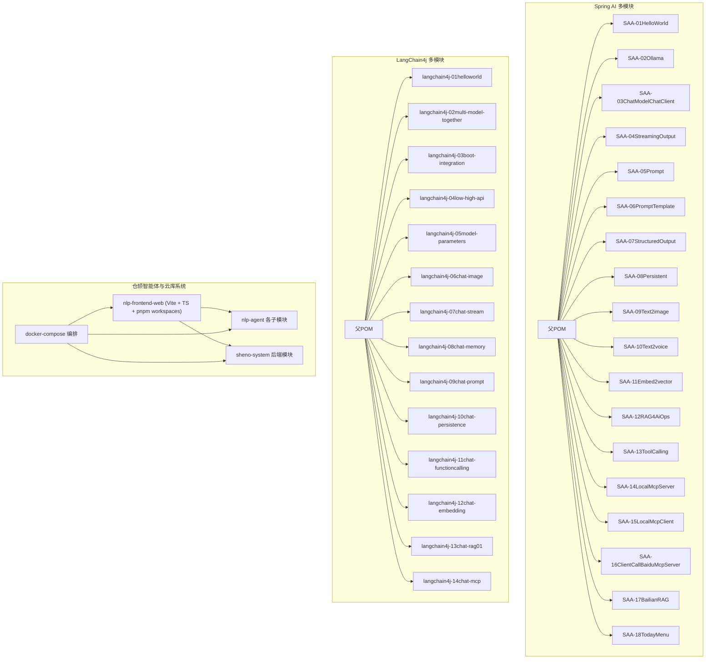
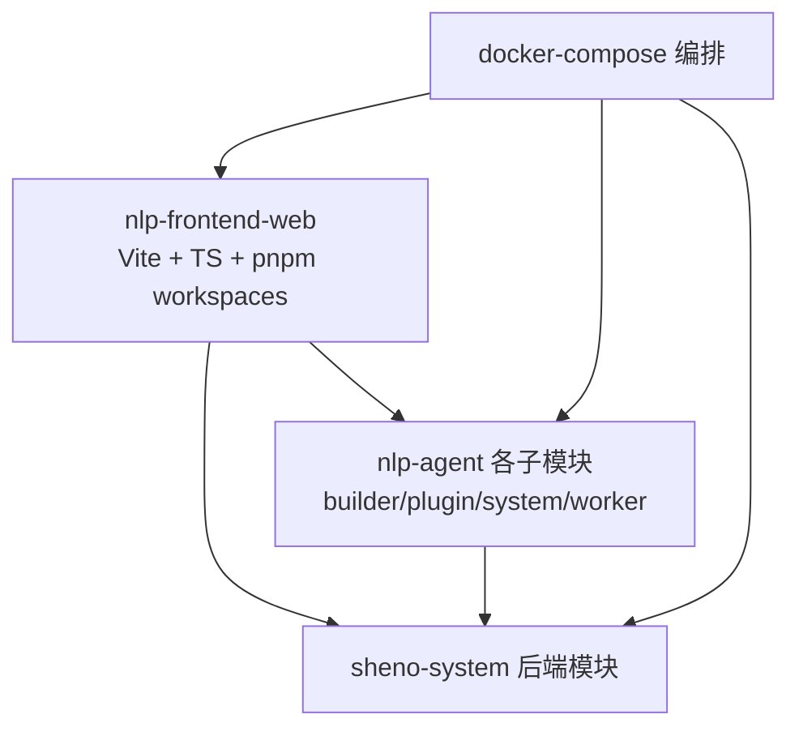
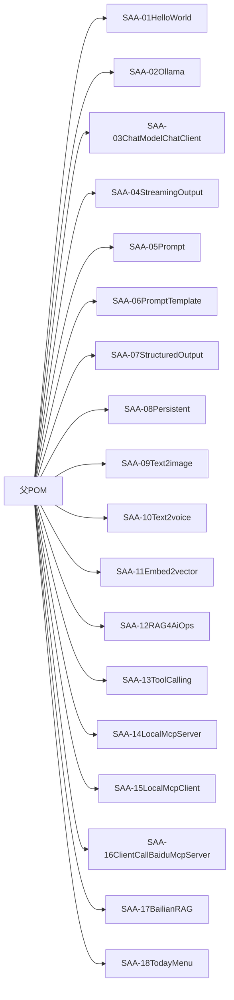
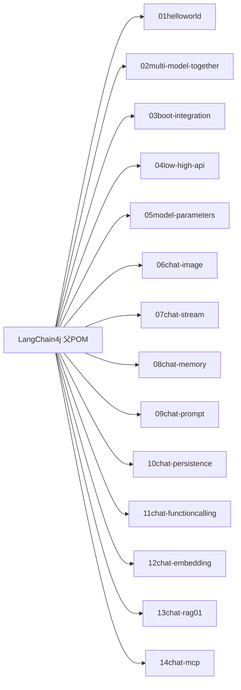
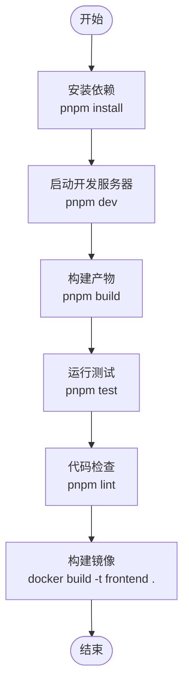
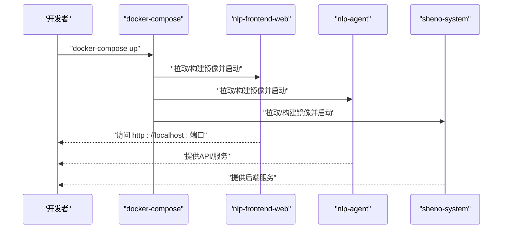
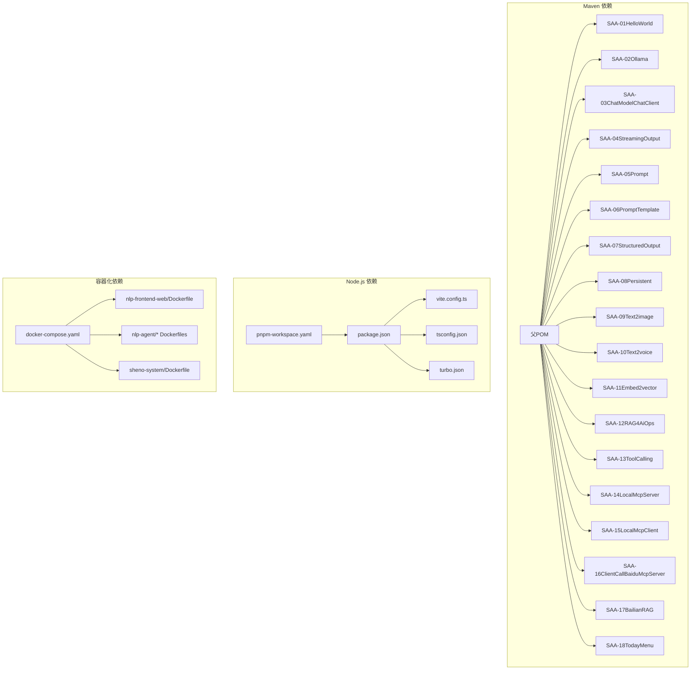

# 开发工具与环境

<cite>
**本文引用的文件**
- [pom.xml](file://【1】SpringAIAlibaba-atguiguV1/pom.xml)
- [pom.xml](file://【1】SpringAIAlibaba-atguiguV1/SAA-01HelloWorld/pom.xml)
- [pom.xml](file://【1】SpringAIAlibaba-atguiguV1/SAA-02Ollama/pom.xml)
- [pom.xml](file://【1】SpringAIAlibaba-atguiguV1/SAA-03ChatModelChatClient/pom.xml)
- [pom.xml](file://【1】SpringAIAlibaba-atguiguV1/SAA-04StreamingOutput/pom.xml)
- [pom.xml](file://【1】SpringAIAlibaba-atguiguV1/SAA-05Prompt/pom.xml)
- [pom.xml](file://【1】SpringAIAlibaba-atguiguV1/SAA-06PromptTemplate/pom.xml)
- [pom.xml](file://【1】SpringAIAlibaba-atguiguV1/SAA-07StructuredOutput/pom.xml)
- [pom.xml](file://【1】SpringAIAlibaba-atguiguV1/SAA-08Persistent/pom.xml)
- [pom.xml](file://【1】SpringAIAlibaba-atguiguV1/SAA-09Text2image/pom.xml)
- [pom.xml](file://【1】SpringAIAlibaba-atguiguV1/SAA-10Text2voice/pom.xml)
- [pom.xml](file://【1】SpringAIAlibaba-atguiguV1/SAA-11Embed2vector/pom.xml)
- [pom.xml](file://【1】SpringAIAlibaba-atguiguV1/SAA-12RAG4AiOps/pom.xml)
- [pom.xml](file://【1】SpringAIAlibaba-atguiguV1/SAA-13ToolCalling/pom.xml)
- [pom.xml](file://【1】SpringAIAlibaba-atguiguV1/SAA-14LocalMcpServer/pom.xml)
- [pom.xml](file://【1】SpringAIAlibaba-atguiguV1/SAA-15LocalMcpClient/pom.xml)
- [pom.xml](file://【1】SpringAIAlibaba-atguiguV1/SAA-16ClientCallBaiduMcpServer/pom.xml)
- [pom.xml](file://【1】SpringAIAlibaba-atguiguV1/SAA-17BailianRAG/pom.xml)
- [pom.xml](file://【1】SpringAIAlibaba-atguiguV1/SAA-18TodayMenu/pom.xml)
- [pom.xml](file://【2】langchain4j-atguiguV5/langchain4j-01helloworld/pom.xml)
- [pom.xml](file://【2】langchain4j-atguiguV5/langchain4j-02multi-model-together/pom.xml)
- [pom.xml](file://【2】langchain4j-atguiguV5/langchain4j-03boot-integration/pom.xml)
- [pom.xml](file://【2】langchain4j-atguiguV5/langchain4j-04low-high-api/pom.xml)
- [pom.xml](file://【2】langchain4j-atguiguV1/V5/langchain4j-05model-parameters/pom.xml)
- [pom.xml](file://【2】langchain4j-atguiguV1/V5/langchain4j-06chat-image/pom.xml)
- [pom.xml](file://【2】langchain4j-atguiguV1/V5/langchain4j-07chat-stream/pom.xml)
- [pom.xml](file://【2】langchain4j-atguiguV1/V5/langchain4j-08chat-memory/pom.xml)
- [pom.xml](file://【2】langchain4j-atguiguV1/V5/langchain4j-09chat-prompt/pom.xml)
- [pom.xml](file://【2】langchain4j-atguiguV1/V5/langchain4j-10chat-persistence/pom.xml)
- [pom.xml](file://【2】langchain4j-atguiguV1/V5/langchain4j-11chat-functioncalling/pom.xml)
- [pom.xml](file://【2】langchain4j-atguiguV1/V5/langchain4j-12chat-embedding/pom.xml)
- [pom.xml](file://【2】langchain4j-atguiguV1/V5/langchain4j-13chat-rag01/pom.xml)
- [pom.xml](file://【2】langchain4j-atguiguV1/V5/langchain4j-14chat-mcp/pom.xml)
- [package.json](file://【3】工作资料/code/仓颉智能体/nlp-frontend-web/package.json)
- [pnpm-workspace.yaml](file://【3】工作资料/code/仓颉智能体/nlp-frontend-web/pnpm-workspace.yaml)
- [vite.config.ts](file://【3】工作资料/code/仓颉智能体/nlp-frontend-web/vite.config.ts)
- [tsconfig.json](file://【3】工作资料/code/仓颉智能体/nlp-frontend-web/tsconfig.json)
- [turbo.json](file://【3】工作资料/code/仓颉智能体/nlp-frontend-web/turbo.json)
- [Dockerfile](file://【3】工作资料/code/仓颉智能体/nlp-frontend-web/Dockerfile)
- [docker-compose.yaml](file://【3】工作资料/code/云库系统/knowledge-backend-boot/docker-compose.yaml)
- [Dockerfile](file://【3】工作资料/code/云库系统/sheno-system/sheno-modules/sheno-server/Dockerfile)
- [Dockerfile](file://【3】工作资料/code/仓颉智能体/nlp-agent/agent-builder/agent-build-server/Dockerfile)
- [Dockerfile](file://【3】工作资料/code/仓颉智能体/nlp-agent/agent-plugin/agent-plugin-server/Dockerfile)
- [Dockerfile](file://【3】工作资料/code/仓颉智能体/nlp-agent/agent-system/sheno-system-server/Dockerfile)
- [Dockerfile](file://【3】工作资料/code/仓颉智能体/nlp-agent/agent-worker/Dockerfile)
- [.gitignore](file://【1】SpringAIAlibaba-atguiguV1/SAA-01HelloWorld/.gitignore)
- [.gitignore](file://【1】SpringAIAlibaba-atguiguV1/SAA-02Ollama/.gitignore)
- [.gitignore](file://【1】SpringAIAlibaba-atguiguV1/SAA-03ChatModelChatClient/.gitignore)
- [.gitignore](file://【1】SpringAIAlibaba-atguiguV1/SAA-04StreamingOutput/.gitignore)
- [.gitignore](file://【1】SpringAIAlibaba-atguiguV1/SAA-05Prompt/.gitignore)
- [.gitignore](file://【1】SpringAIAlibaba-atguiguV1/SAA-06PromptTemplate/.gitignore)
- [.gitignore](file://【1】SpringAIAlibaba-atguiguV1/SAA-07StructuredOutput/.gitignore)
- [.gitignore](file://【1】SpringAIAlibaba-atguiguV1/SAA-08Persistent/.gitignore)
- [.gitignore](file://【1】SpringAIAlibaba-atguiguV1/SAA-09Text2image/.gitignore)
- [.gitignore](file://【1】SpringAIAlibaba-atguiguV1/SAA-10Text2voice/.gitignore)
- [.gitignore](file://【1】SpringAIAlibaba-atguiguV1/SAA-11Embed2vector/.gitignore)
- [.gitignore](file://【1】SpringAIAlibaba-atguiguV1/SAA-12RAG4AiOps/.gitignore)
- [.gitignore](file://【1】SpringAIAlibaba-atguiguV1/SAA-13ToolCalling/.gitignore)
- [.gitignore](file://【1】SpringAIAlibaba-atguiguV1/SAA-14LocalMcpServer/.gitignore)
- [.gitignore](file://【1】SpringAIAlibaba-atguiguV1/SAA-15LocalMcpClient/.gitignore)
- [.gitignore](file://【1】SpringAIAlibaba-atguiguV1/SAA-16ClientCallBaiduMcpServer/.gitignore)
- [.gitignore](file://【1】SpringAIAlibaba-atguiguV1/SAA-17BailianRAG/.gitignore)
- [.gitignore](file://【1】SpringAIAlibaba-atguiguV1/SAA-18TodayMenu/.gitignore)
- [.gitignore](file://【3】工作资料/code/仓颉智能体/nlp-frontend-web/.gitignore)
- [.gitignore](file://【3】工作资料/code/云库系统/knowledge-backend-boot/sheno-biz-demo/.gitignore)
- [.gitignore](file://【3】工作资料/code/云库系统/sheno-system/.gitignore)
- [.gitignore](file://【3】工作资料/code/仓颉智能体/nlp-agent/.gitignore)
- [.gitignore](file://【3】工作资料/code/仓颉智能体/nlp-frontend-web/.gitignore)
- [maven-wrapper.properties](file://【1】SpringAIAlibaba-atguiguV1/SAA-01HelloWorld/.mvn/wrapper/maven-wrapper.properties)
- [maven-wrapper.properties](file://【1】SpringAIAlibaba-atguiguV1/SAA-02Ollama/.mvn/wrapper/maven-wrapper.properties)
- [maven-wrapper.properties](file://【1】SpringAIAlibaba-atguiguV1/SAA-03ChatModelChatClient/.mvn/wrapper/maven-wrapper.properties)
- [maven-wrapper.properties](file://【1】SpringAIAlibaba-atguiguV1/SAA-04StreamingOutput/.mvn/wrapper/maven-wrapper.properties)
- [maven-wrapper.properties](file://【1】SpringAIAlibaba-atguiguV1/SAA-05Prompt/.mvn/wrapper/maven-wrapper.properties)
- [maven-wrapper.properties](file://【1】SpringAIAlibaba-atguiguV1/SAA-06PromptTemplate/.mvn/wrapper/maven-wrapper.properties)
- [maven-wrapper.properties](file://【1】SpringAIAlibaba-atguiguV1/SAA-07StructuredOutput/.mvn/wrapper/maven-wrapper.properties)
- [maven-wrapper.properties](file://【1】SpringAIAlibaba-atguiguV1/SAA-08Persistent/.mvn/wrapper/maven-wrapper.properties)
- [maven-wrapper.properties](file://【1】SpringAIAlibaba-atguiguV1/SAA-09Text2image/.mvn/wrapper/maven-wrapper.properties)
- [maven-wrapper.properties](file://【1】SpringAIAlibaba-atguiguV1/SAA-10Text2voice/.mvn/wrapper/maven-wrapper.properties)
- [maven-wrapper.properties](file://【1】SpringAIAlibaba-atguiguV1/SAA-11Embed2vector/.mvn/wrapper/maven-wrapper.properties)
- [maven-wrapper.properties](file://【1】SpringAIAlibaba-atguiguV1/SAA-12RAG4AiOps/.mvn/wrapper/maven-wrapper.properties)
- [maven-wrapper.properties](file://【1】SpringAIAlibaba-atguiguV1/SAA-13ToolCalling/.mvn/wrapper/maven-wrapper.properties)
- [maven-wrapper.properties](file://【1】SpringAIAlibaba-atguiguV1/SAA-14LocalMcpServer/.mvn/wrapper/maven-wrapper.properties)
- [maven-wrapper.properties](file://【1】SpringAIAlibaba-atguiguV1/SAA-15LocalMcpClient/.mvn/wrapper/maven-wrapper.properties)
- [maven-wrapper.properties](file://【1】SpringAIAlibaba-atguiguV1/SAA-16ClientCallBaiduMcpServer/.mvn/wrapper/maven-wrapper.properties)
- [maven-wrapper.properties](file://【1】SpringAIAlibaba-atguiguV1/SAA-17BailianRAG/.mvn/wrapper/maven-wrapper.properties)
- [maven-wrapper.properties](file://【1】SpringAIAlibaba-atguiguV1/SAA-18TodayMenu/.mvn/wrapper/maven-wrapper.properties)
- [README.md](file://【3】工作资料/code/仓颉智能体/nlp-frontend-web/README.md)
- [README.md](file://【3】工作资料/code/仓颉智能体/nlp-frontend-web/README.en.md)
- [必读.md](file://【3】工作资料/code/云库系统/knowledge-backend-boot/sheno-biz-demo/.gitignore)
- [CLAUDE.md](file://CLAUDE.md)
- [PROJECT_CONTEXT.md](file://.ai-memory/PROJECT_CONTEXT.md)
- [README_IDEA.md](file://.ai-memory/README_IDEA.md)
- [quick_start.txt](file://.ai-memory/quick_start.txt)
</cite>

## 目录
1. [引言](#引言)
2. [项目结构](#项目结构)
3. [核心组件](#核心组件)
4. [架构总览](#架构总览)
5. [详细组件分析](#详细组件分析)
6. [依赖分析](#依赖分析)
7. [性能考虑](#性能考虑)
8. [故障排除指南](#故障排除指南)
9. [结论](#结论)
10. [附录](#附录)

## 引言
本指南面向在该仓库中进行开发的工程师，覆盖从IDE设置、构建工具、版本控制到容器化部署的全流程。重点包含：
- Maven多模块项目的管理与最佳实践
- Node.js单体/多包工作区（pnpm workspaces）的开发环境配置
- Docker容器化部署流程与Compose编排
- 开发工作流中的代码规范、测试策略与持续集成建议
- 面向不同子项目的具体落地步骤与注意事项

## 项目结构
仓库包含三大类工程：
- Spring AI 多模块工程：以Spring Boot为基础的大模型应用系列，采用Maven多模块组织，便于复用与分层。
- LangChain4j 学习工程：围绕LangChain4j的多个示例模块，展示从低级到高级API、图像、流式输出、函数调用、嵌入与RAG等能力。
- 仓颉智能体与云库系统：前端Web工程（Vite + TypeScript + pnpm workspaces）、后端Agent与系统模块，以及容器化部署。

**图表来源**
- [pom.xml](file://【1】SpringAIAlibaba-atguiguV1/pom.xml)
- [pom.xml](file://【2】langchain4j-atguiguV5/langchain4j-01helloworld/pom.xml)
- [pnpm-workspace.yaml](file://【3】工作资料/code/仓颉智能体/nlp-frontend-web/pnpm-workspace.yaml)
- [docker-compose.yaml](file://【3】工作资料/code/云库系统/knowledge-backend-boot/docker-compose.yaml)

**章节来源**
- [pom.xml](file://【1】SpringAIAlibaba-atguiguV1/pom.xml)
- [pom.xml](file://【2】langchain4j-atguiguV5/langchain4j-01helloworld/pom.xml)
- [pnpm-workspace.yaml](file://【3】工作资料/code/仓颉智能体/nlp-frontend-web/pnpm-workspace.yaml)
- [docker-compose.yaml](file://【3】工作资料/code/云库系统/knowledge-backend-boot/docker-compose.yaml)

## 核心组件
- Maven多模块工程（Spring AI系列与LangChain4j系列）
  - 通过父POM统一管理版本、插件与依赖，子模块按功能拆分，便于独立开发与测试。
  - 使用Maven Wrapper保证团队成员使用一致的构建工具版本。
- Node.js工程（仓颉智能体前端）
  - pnpm workspaces组织多包，Turbo加速构建与缓存，Vite提供开发服务器与打包。
  - TypeScript配置与ESLint/Prettier/Stylelint等规范工具链。
- 容器化与编排
  - 各模块提供Dockerfile，使用docker-compose进行服务编排，便于本地联调与部署。

**章节来源**
- [pom.xml](file://【1】SpringAIAlibaba-atguiguV1/pom.xml)
- [pom.xml](file://【2】langchain4j-atguiguV5/langchain4j-01helloworld/pom.xml)
- [package.json](file://【3】工作资料/code/仓颉智能体/nlp-frontend-web/package.json)
- [pnpm-workspace.yaml](file://【3】工作资料/code/仓颉智能体/nlp-frontend-web/pnpm-workspace.yaml)
- [turbo.json](file://【3】工作资料/code/仓颉智能体/nlp-frontend-web/turbo.json)
- [vite.config.ts](file://【3】工作资料/code/仓颉智能体/nlp-frontend-web/vite.config.ts)
- [tsconfig.json](file://【3】工作资料/code/仓颉智能体/nlp-frontend-web/tsconfig.json)
- [Dockerfile](file://【3】工作资料/code/仓颉智能体/nlp-frontend-web/Dockerfile)
- [docker-compose.yaml](file://【3】工作资料/code/云库系统/knowledge-backend-boot/docker-compose.yaml)

## 架构总览
下图展示了前端、Agent系统与后端服务的交互关系，并映射到实际的Dockerfile与Compose配置：

**图表来源**
- [Dockerfile](file://【3】工作资料/code/仓颉智能体/nlp-frontend-web/Dockerfile)
- [Dockerfile](file://【3】工作资料/code/仓颉智能体/nlp-agent/agent-builder/agent-build-server/Dockerfile)
- [Dockerfile](file://【3】工作资料/code/仓颉智能体/nlp-agent/agent-plugin/agent-plugin-server/Dockerfile)
- [Dockerfile](file://【3】工作资料/code/仓颉智能体/nlp-agent/agent-system/sheno-system-server/Dockerfile)
- [Dockerfile](file://【3】工作资料/code/仓颉智能体/nlp-agent/agent-worker/Dockerfile)
- [Dockerfile](file://【3】工作资料/code/云库系统/sheno-system/sheno-modules/sheno-server/Dockerfile)
- [docker-compose.yaml](file://【3】工作资料/code/云库系统/knowledge-backend-boot/docker-compose.yaml)

## 详细组件分析

### Maven多模块项目管理（Spring AI系列）
- 父POM职责
  - 统一版本管理、插件配置与依赖聚合，避免重复声明。
  - 在子模块中仅声明必要的依赖，减少耦合。
- 子模块划分
  - 功能导向：HelloWorld、Ollama、ChatClient、Streaming、Prompt、PromptTemplate、StructuredOutput、Persistent、Text2image、Text2voice、Embed2vector、RAG4AiOps、ToolCalling、LocalMcpServer、LocalMcpClient、ClientCallBaiduMcpServer、BailianRAG、TodayMenu。
- 最佳实践
  - 使用Maven Wrapper确保团队成员使用一致的Maven版本。
  - 子模块间尽量保持无循环依赖；如需共享代码，抽取为独立模块或共享包。
  - 单元测试与集成测试分离，确保可运行性与稳定性。
  - 使用属性与插件配置集中管理，避免分散重复。

**图表来源**
- [pom.xml](file://【1】SpringAIAlibaba-atguiguV1/pom.xml)
- [pom.xml](file://【1】SpringAIAlibaba-atguiguV1/SAA-01HelloWorld/pom.xml)
- [pom.xml](file://【1】SpringAIAlibaba-atguiguV1/SAA-02Ollama/pom.xml)
- [pom.xml](file://【1】SpringAIAlibaba-atguiguV1/SAA-03ChatModelChatClient/pom.xml)
- [pom.xml](file://【1】SpringAIAlibaba-atguiguV1/SAA-04StreamingOutput/pom.xml)
- [pom.xml](file://【1】SpringAIAlibaba-atguiguV1/SAA-05Prompt/pom.xml)
- [pom.xml](file://【1】SpringAIAlibaba-atguiguV1/SAA-06PromptTemplate/pom.xml)
- [pom.xml](file://【1】SpringAIAlibaba-atguiguV1/SAA-07StructuredOutput/pom.xml)
- [pom.xml](file://【1】SpringAIAlibaba-atguiguV1/SAA-08Persistent/pom.xml)
- [pom.xml](file://【1】SpringAIAlibaba-atguiguV1/SAA-09Text2image/pom.xml)
- [pom.xml](file://【1】SpringAIAlibaba-atguiguV1/SAA-10Text2voice/pom.xml)
- [pom.xml](file://【1】SpringAIAlibaba-atguiguV1/SAA-11Embed2vector/pom.xml)
- [pom.xml](file://【1】SpringAIAlibaba-atguiguV1/SAA-12RAG4AiOps/pom.xml)
- [pom.xml](file://【1】SpringAIAlibaba-atguiguV1/SAA-13ToolCalling/pom.xml)
- [pom.xml](file://【1】SpringAIAlibaba-atguiguV1/SAA-14LocalMcpServer/pom.xml)
- [pom.xml](file://【1】SpringAIAlibaba-atguiguV1/SAA-15LocalMcpClient/pom.xml)
- [pom.xml](file://【1】SpringAIAlibaba-atguiguV1/SAA-16ClientCallBaiduMcpServer/pom.xml)
- [pom.xml](file://【1】SpringAIAlibaba-atguiguV1/SAA-17BailianRAG/pom.xml)
- [pom.xml](file://【1】SpringAIAlibaba-atguiguV1/SAA-18TodayMenu/pom.xml)

**章节来源**
- [pom.xml](file://【1】SpringAIAlibaba-atguiguV1/pom.xml)
- [maven-wrapper.properties](file://【1】SpringAIAlibaba-atguiguV1/SAA-01HelloWorld/.mvn/wrapper/maven-wrapper.properties)
- [maven-wrapper.properties](file://【1】SpringAIAlibaba-atguiguV1/SAA-02Ollama/.mvn/wrapper/maven-wrapper.properties)
- [maven-wrapper.properties](file://【1】SpringAIAlibaba-atguiguV1/SAA-03ChatModelChatClient/.mvn/wrapper/maven-wrapper.properties)
- [maven-wrapper.properties](file://【1】SpringAIAlibaba-atguiguV1/SAA-04StreamingOutput/.mvn/wrapper/maven-wrapper.properties)
- [maven-wrapper.properties](file://【1】SpringAIAlibaba-atguiguV1/SAA-05Prompt/.mvn/wrapper/maven-wrapper.properties)
- [maven-wrapper.properties](file://【1】SpringAIAlibaba-atguiguV1/SAA-06PromptTemplate/.mvn/wrapper/maven-wrapper.properties)
- [maven-wrapper.properties](file://【1】SpringAIAlibaba-atguiguV1/SAA-07StructuredOutput/.mvn/wrapper/maven-wrapper.properties)
- [maven-wrapper.properties](file://【1】SpringAIAlibaba-atguiguV1/SAA-08Persistent/.mvn/wrapper/maven-wrapper.properties)
- [maven-wrapper.properties](file://【1】SpringAIAlibaba-atguiguV1/SAA-09Text2image/.mvn/wrapper/maven-wrapper.properties)
- [maven-wrapper.properties](file://【1】SpringAIAlibaba-atguiguV1/SAA-10Text2voice/.mvn/wrapper/maven-wrapper.properties)
- [maven-wrapper.properties](file://【1】SpringAIAlibaba-atguiguV1/SAA-11Embed2vector/.mvn/wrapper/maven-wrapper.properties)
- [maven-wrapper.properties](file://【1】SpringAIAlibaba-atguiguV1/SAA-12RAG4AiOps/.mvn/wrapper/maven-wrapper.properties)
- [maven-wrapper.properties](file://【1】SpringAIAlibaba-atguiguV1/SAA-13ToolCalling/.mvn/wrapper/maven-wrapper.properties)
- [maven-wrapper.properties](file://【1】SpringAIAlibaba-atguiguV1/SAA-14LocalMcpServer/.mvn/wrapper/maven-wrapper.properties)
- [maven-wrapper.properties](file://【1】SpringAIAlibaba-atguiguV1/SAA-15LocalMcpClient/.mvn/wrapper/maven-wrapper.properties)
- [maven-wrapper.properties](file://【1】SpringAIAlibaba-atguiguV1/SAA-16ClientCallBaiduMcpServer/.mvn/wrapper/maven-wrapper.properties)
- [maven-wrapper.properties](file://【1】SpringAIAlibaba-atguiguV1/SAA-17BailianRAG/.mvn/wrapper/maven-wrapper.properties)
- [maven-wrapper.properties](file://【1】SpringAIAlibaba-atguiguV1/SAA-18TodayMenu/.mvn/wrapper/maven-wrapper.properties)

### Maven多模块项目管理（LangChain4j系列）
- 父POM职责
  - 统一版本与插件，子模块聚焦不同能力点：helloworld、multi-model-together、boot-integration、low/high-api、model-parameters、chat-image、chat-stream、chat-memory、chat-prompt、chat-persistence、chat-functioncalling、chat-embedding、chat-rag01、chat-mcp。
- 最佳实践
  - 将公共配置抽取到共享模块或父POM，减少重复。
  - 为每个能力模块编写最小可运行示例，便于学习与回归测试。

**图表来源**
- [pom.xml](file://【2】langchain4j-atguiguV5/langchain4j-01helloworld/pom.xml)
- [pom.xml](file://【2】langchain4j-atguiguV5/langchain4j-02multi-model-together/pom.xml)
- [pom.xml](file://【2】langchain4j-atguiguV5/langchain4j-03boot-integration/pom.xml)
- [pom.xml](file://【2】langchain4j-atguiguV5/langchain4j-04low-high-api/pom.xml)
- [pom.xml](file://【2】langchain4j-atguiguV5/langchain4j-05model-parameters/pom.xml)
- [pom.xml](file://【2】langchain4j-atguiguV5/langchain4j-06chat-image/pom.xml)
- [pom.xml](file://【2】langchain4j-atguiguV5/langchain4j-07chat-stream/pom.xml)
- [pom.xml](file://【2】langchain4j-atguiguV5/langchain4j-08chat-memory/pom.xml)
- [pom.xml](file://【2】langchain4j-atguiguV5/langchain4j-09chat-prompt/pom.xml)
- [pom.xml](file://【2】langchain4j-atguiguV5/langchain4j-10chat-persistence/pom.xml)
- [pom.xml](file://【2】langchain4j-atguiguV5/langchain4j-11chat-functioncalling/pom.xml)
- [pom.xml](file://【2】langchain4j-atguiguV5/langchain4j-12chat-embedding/pom.xml)
- [pom.xml](file://【2】langchain4j-atguiguV5/langchain4j-13chat-rag01/pom.xml)
- [pom.xml](file://【2】langchain4j-atguiguV5/langchain4j-14chat-mcp/pom.xml)

**章节来源**
- [pom.xml](file://【2】langchain4j-atguiguV5/langchain4j-01helloworld/pom.xml)
- [pom.xml](file://【2】langchain4j-atguiguV5/langchain4j-02multi-model-together/pom.xml)
- [pom.xml](file://【2】langchain4j-atguiguV5/langchain4j-03boot-integration/pom.xml)
- [pom.xml](file://【2】langchain4j-atguiguV5/langchain4j-04low-high-api/pom.xml)
- [pom.xml](file://【2】langchain4j-atguiguV5/langchain4j-05model-parameters/pom.xml)
- [pom.xml](file://【2】langchain4j-atguiguV5/langchain4j-06chat-image/pom.xml)
- [pom.xml](file://【2】langchain4j-atguiguV5/langchain4j-07chat-stream/pom.xml)
- [pom.xml](file://【2】langchain4j-atguiguV5/langchain4j-08chat-memory/pom.xml)
- [pom.xml](file://【2】langchain4j-atguiguV5/langchain4j-09chat-prompt/pom.xml)
- [pom.xml](file://【2】langchain4j-atguiguV5/langchain4j-10chat-persistence/pom.xml)
- [pom.xml](file://【2】langchain4j-atguiguV5/langchain4j-11chat-functioncalling/pom.xml)
- [pom.xml](file://【2】langchain4j-atguiguV5/langchain4j-12chat-embedding/pom.xml)
- [pom.xml](file://【2】langchain4j-atguiguV5/langchain4j-13chat-rag01/pom.xml)
- [pom.xml](file://【2】langchain4j-atguiguV5/langchain4j-14chat-mcp/pom.xml)

### Node.js项目开发环境配置（仓颉智能体前端）
- 包管理与工作区
  - 使用 pnpm 作为包管理器，配合 pnpm-workspace.yaml 组织多包。
  - package.json 中定义脚本命令，如 dev、build、lint、test 等。
- 构建与开发
  - Vite 作为开发服务器与打包工具，支持热更新与快速启动。
  - TypeScript 严格模式与统一 tsconfig，确保类型安全。
  - ESLint、Prettier、Stylelint 规范代码风格与质量。
- 性能与缓存
  - Turbo 加速构建与缓存，提升多包协作效率。
- 容器化
  - 提供 Dockerfile，便于本地与CI/CD中统一构建与部署。

**图表来源**
- [package.json](file://【3】工作资料/code/仓颉智能体/nlp-frontend-web/package.json)
- [pnpm-workspace.yaml](file://【3】工作资料/code/仓颉智能体/nlp-frontend-web/pnpm-workspace.yaml)
- [vite.config.ts](file://【3】工作资料/code/仓颉智能体/nlp-frontend-web/vite.config.ts)
- [tsconfig.json](file://【3】工作资料/code/仓颉智能体/nlp-frontend-web/tsconfig.json)
- [turbo.json](file://【3】工作资料/code/仓颉智能体/nlp-frontend-web/turbo.json)
- [Dockerfile](file://【3】工作资料/code/仓颉智能体/nlp-frontend-web/Dockerfile)

**章节来源**
- [package.json](file://【3】工作资料/code/仓颉智能体/nlp-frontend-web/package.json)
- [pnpm-workspace.yaml](file://【3】工作资料/code/仓颉智能体/nlp-frontend-web/pnpm-workspace.yaml)
- [vite.config.ts](file://【3】工作资料/code/仓颉智能体/nlp-frontend-web/vite.config.ts)
- [tsconfig.json](file://【3】工作资料/code/仓颉智能体/nlp-frontend-web/tsconfig.json)
- [turbo.json](file://【3】工作资料/code/仓颉智能体/nlp-frontend-web/turbo.json)
- [Dockerfile](file://【3】工作资料/code/仓颉智能体/nlp-frontend-web/Dockerfile)

### Docker容器化部署流程
- 前端与各Agent模块均提供Dockerfile，便于独立构建与部署。
- docker-compose.yaml 将前端、Agent与后端服务编排在一起，简化本地联调。
- 建议在CI/CD中使用相同Dockerfile与Compose配置，确保环境一致性。

**图表来源**
- [docker-compose.yaml](file://【3】工作资料/code/云库系统/knowledge-backend-boot/docker-compose.yaml)
- [Dockerfile](file://【3】工作资料/code/仓颉智能体/nlp-frontend-web/Dockerfile)
- [Dockerfile](file://【3】工作资料/code/仓颉智能体/nlp-agent/agent-builder/agent-build-server/Dockerfile)
- [Dockerfile](file://【3】工作资料/code/仓颉智能体/nlp-agent/agent-plugin/agent-plugin-server/Dockerfile)
- [Dockerfile](file://【3】工作资料/code/仓颉智能体/nlp-agent/agent-system/sheno-system-server/Dockerfile)
- [Dockerfile](file://【3】工作资料/code/仓颉智能体/nlp-agent/agent-worker/Dockerfile)
- [Dockerfile](file://【3】工作资料/code/云库系统/sheno-system/sheno-modules/sheno-server/Dockerfile)

**章节来源**
- [docker-compose.yaml](file://【3】工作资料/code/云库系统/knowledge-backend-boot/docker-compose.yaml)
- [Dockerfile](file://【3】工作资料/code/仓颉智能体/nlp-frontend-web/Dockerfile)
- [Dockerfile](file://【3】工作资料/code/仓颉智能体/nlp-agent/agent-builder/agent-build-server/Dockerfile)
- [Dockerfile](file://【3】工作资料/code/仓颉智能体/nlp-agent/agent-plugin/agent-plugin-server/Dockerfile)
- [Dockerfile](file://【3】工作资料/code/仓颉智能体/nlp-agent/agent-system/sheno-system-server/Dockerfile)
- [Dockerfile](file://【3】工作资料/code/仓颉智能体/nlp-agent/agent-worker/Dockerfile)
- [Dockerfile](file://【3】工作资料/code/云库系统/sheno-system/sheno-modules/sheno-server/Dockerfile)

## 依赖分析
- Maven模块间依赖
  - 父POM统一管理版本与插件，子模块按需引入依赖，避免循环依赖。
  - 建议将跨模块共享的配置与依赖抽取到独立模块，降低耦合度。
- Node.js工作区依赖
  - pnpm workspaces 管理多包依赖，避免重复安装与版本冲突。
  - 通过 package.json 的 scripts 聚合常用命令，提升开发效率。
- 容器化依赖
  - 各模块的Dockerfile与docker-compose.yaml共同构成部署依赖链，确保服务可被正确编排与启动。

**图表来源**
- [pom.xml](file://【1】SpringAIAlibaba-atguiguV1/pom.xml)
- [pom.xml](file://【2】langchain4j-atguiguV5/langchain4j-01helloworld/pom.xml)
- [pnpm-workspace.yaml](file://【3】工作资料/code/仓颉智能体/nlp-frontend-web/pnpm-workspace.yaml)
- [package.json](file://【3】工作资料/code/仓颉智能体/nlp-frontend-web/package.json)
- [vite.config.ts](file://【3】工作资料/code/仓颉智能体/nlp-frontend-web/vite.config.ts)
- [tsconfig.json](file://【3】工作资料/code/仓颉智能体/nlp-frontend-web/tsconfig.json)
- [turbo.json](file://【3】工作资料/code/仓颉智能体/nlp-frontend-web/turbo.json)
- [docker-compose.yaml](file://【3】工作资料/code/云库系统/knowledge-backend-boot/docker-compose.yaml)
- [Dockerfile](file://【3】工作资料/code/仓颉智能体/nlp-frontend-web/Dockerfile)
- [Dockerfile](file://【3】工作资料/code/仓颉智能体/nlp-agent/agent-builder/agent-build-server/Dockerfile)
- [Dockerfile](file://【3】工作资料/code/仓颉智能体/nlp-agent/agent-plugin/agent-plugin-server/Dockerfile)
- [Dockerfile](file://【3】工作资料/code/仓颉智能体/nlp-agent/agent-system/sheno-system-server/Dockerfile)
- [Dockerfile](file://【3】工作资料/code/仓颉智能体/nlp-agent/agent-worker/Dockerfile)
- [Dockerfile](file://【3】工作资料/code/云库系统/sheno-system/sheno-modules/sheno-server/Dockerfile)

**章节来源**
- [pom.xml](file://【1】SpringAIAlibaba-atguiguV1/pom.xml)
- [pom.xml](file://【2】langchain4j-atguiguV5/langchain4j-01helloworld/pom.xml)
- [pnpm-workspace.yaml](file://【3】工作资料/code/仓颉智能体/nlp-frontend-web/pnpm-workspace.yaml)
- [package.json](file://【3】工作资料/code/仓颉智能体/nlp-frontend-web/package.json)
- [docker-compose.yaml](file://【3】工作资料/code/云库系统/knowledge-backend-boot/docker-compose.yaml)

## 性能考虑
- Maven
  - 使用Maven Wrapper与中央仓库镜像，减少网络波动影响。
  - 合理拆分子模块，避免一次性构建过多模块。
  - 在CI中启用增量构建与缓存，缩短构建时间。
- Node.js
  - pnpm相比npm更快更节省磁盘空间；结合Turbo缓存显著提升多包构建速度。
  - Vite开发服务器默认启用HMR，合理配置别名与外部依赖可进一步优化启动速度。
- 容器化
  - 使用多阶段构建减少镜像体积；在CI中缓存依赖层；Compose中合理设置资源限制与健康检查。

## 故障排除指南
- 版本与环境
  - Maven：确认使用Maven Wrapper，避免版本差异导致的构建失败。
  - Node.js：确认pnpm版本与Node版本满足项目要求；清理node_modules与lock文件后重装依赖。
- 构建与运行
  - Maven：优先执行父POM的clean与install，再进入子模块验证。
  - Node.js：先执行pnpm install，再运行dev；若端口占用，修改Vite端口或释放端口。
- 容器化
  - docker-compose：确认所有服务的Dockerfile路径正确，镜像标签一致；先停止旧容器再重新构建。
  - 端口冲突：修改docker-compose中的端口映射或停止占用进程。
- 代码规范
  - ESLint/Prettier/Stylelint：先执行格式化，再进行静态检查；修复告警后再提交。
- 版本控制
  - .gitignore：确保忽略target、node_modules、.DS_Store、IDE生成文件等；避免误提交。

**章节来源**
- [maven-wrapper.properties](file://【1】SpringAIAlibaba-atguiguV1/SAA-01HelloWorld/.mvn/wrapper/maven-wrapper.properties)
- [package.json](file://【3】工作资料/code/仓颉智能体/nlp-frontend-web/package.json)
- [docker-compose.yaml](file://【3】工作资料/code/云库系统/knowledge-backend-boot/docker-compose.yaml)
- [.gitignore](file://【1】SpringAIAlibaba-atguiguV1/SAA-01HelloWorld/.gitignore)
- [.gitignore](file://【3】工作资料/code/仓颉智能体/nlp-frontend-web/.gitignore)

## 结论
本指南提供了从IDE设置、构建工具、版本控制到容器化部署的完整开发环境配置方案。通过Maven多模块与Node.js工作区的规范化管理，结合Docker编排与统一的代码规范，开发者可以高效地进行项目开发与维护。建议在团队内推广使用相同的工具链与流程，以确保一致性与可维护性。

## 附录
- IDE推荐
  - Java：IntelliJ IDEA（Spring Boot插件、Maven视图）
  - TypeScript/Vite：VS Code（ESLint、Prettier、TypeScript语言特性）
- 版本控制
  - Git：使用分支策略（如Git Flow），提交前执行lint与测试
- 持续集成
  - 建议在CI中执行：安装依赖、构建、测试、代码检查、构建镜像、推送镜像
- 记忆与协作
  - 项目记忆文件与IDEA快速开始文档可用于新成员快速上手

**章节来源**
- [README.md](file://【3】工作资料/code/仓颉智能体/nlp-frontend-web/README.md)
- [README.md](file://【3】工作资料/code/仓颉智能体/nlp-frontend-web/README.en.md)
- [CLAUDE.md](file://CLAUDE.md)
- [PROJECT_CONTEXT.md](file://.ai-memory/PROJECT_CONTEXT.md)
- [README_IDEA.md](file://.ai-memory/README_IDEA.md)
- [quick_start.txt](file://.ai-memory/quick_start.txt)