# 开发工具与环境

<cite>
**本文档引用的文件**
- [pom.xml](file://pom.xml)
- [package.json](file://package.json)
- [pnpm-workspace.yaml](file://pnpm-workspace.yaml)
- [vite.config.ts](file://vite.config.ts)
- [tsconfig.json](file://tsconfig.json)
- [turbo.json](file://turbo.json)
- [Dockerfile](file://Dockerfile)
- [docker-compose.yaml](file://docker-compose.yaml)
- [.gitignore](file://.gitignore)
- [maven-wrapper.properties](file://.mvn/wrapper/maven-wrapper.properties)
- [run.js](file://benchmarks/run.js)
- [result.md](file://benchmarks/result.md)
- [global-archive.sh](file://scripts/parallel/global-archive.sh)
- [worktree-merge.sh](file://scripts/parallel/worktree-merge.sh)
- [worktree-parallel.sh](file://scripts/parallel/worktree-parallel.sh)
- [setup.sh](file://.workspace/setup.sh)
- [workspace.env](file://.workspace/workspace.env)
- [mcp.json](file://.claude/mcp.json)
- [settings.local.json](file://.claude/settings.local.json)
- [README.md](file://README.md)
- [CLAUDE.md](file://CLAUDE.md)
</cite>

## 更新摘要
**所做更改**
- 新增性能基准测试工具链章节，包含fetch、文件操作和SQLite基准测试
- 新增自动化脚本工具链章节，涵盖并行工作树管理和全局归档功能
- 新增Claude AI开发工具链章节，包含MCP服务器配置和本地设置
- 新增工作空间管理工具章节，提供统一的开发环境初始化
- 更新项目结构图以反映新增的工具链组件
- 新增包管理最佳实践章节，涵盖pnpm工作区和依赖管理策略

## 目录
1. [引言](#引言)
2. [项目结构](#项目结构)
3. [核心组件](#核心组件)
4. [架构总览](#架构总览)
5. [详细组件分析](#详细组件分析)
6. [性能基准测试工具链](#性能基准测试工具链)
7. [自动化脚本工具链](#自动化脚本工具链)
8. [Claude AI开发工具链](#claude-ai开发工具链)
9. [工作空间管理工具](#工作空间管理工具)
10. [包管理最佳实践](#包管理最佳实践)
11. [依赖分析](#依赖分析)
12. [性能考虑](#性能考虑)
13. [故障排除指南](#故障排除指南)
14. [结论](#结论)
15. [附录](#附录)

## 引言
本指南面向在该仓库中进行开发的工程师，覆盖从IDE设置、构建工具、版本控制到容器化部署的全流程。重点包含：
- Maven多模块项目的管理与最佳实践
- Node.js单体/多包工作区（pnpm workspaces）的开发环境配置
- Docker容器化部署流程与Compose编排
- **新增**：性能基准测试工具链，用于量化评估系统性能
- **新增**：自动化脚本工具链，支持并行开发和工作流自动化
- **新增**：Claude AI开发工具链，包含MCP服务器和本地配置
- **新增**：工作空间管理工具，提供统一的开发环境初始化
- 开发工作流中的代码规范、测试策略与持续集成建议
- 面向不同子项目的具体落地步骤与注意事项

## 项目结构
仓库包含四大类工程和工具链：
- Spring AI 多模块工程：以Spring Boot为基础的大模型应用系列，采用Maven多模块组织，便于复用与分层。
- LangChain4j 学习工程：围绕LangChain4j的多个示例模块，展示从低级到高级API、图像、流式输出、函数调用、嵌入与RAG等能力。
- 仓颉智能体与云库系统：前端Web工程（Vite + TypeScript + pnpm workspaces）、后端Agent与系统模块，以及容器化部署。
- **新增**：开发工具链：性能基准测试、自动化脚本、Claude AI工具和工作空间管理。

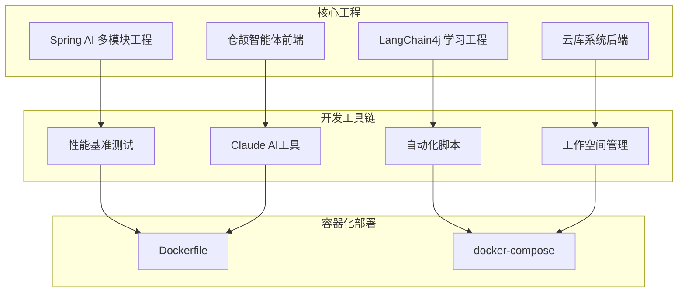

**图表来源**
- [pom.xml](file://pom.xml)
- [package.json](file://package.json)
- [run.js](file://benchmarks/run.js)
- [global-archive.sh](file://scripts/parallel/global-archive.sh)
- [mcp.json](file://.claude/mcp.json)
- [setup.sh](file://.workspace/setup.sh)
- [Dockerfile](file://Dockerfile)
- [docker-compose.yaml](file://docker-compose.yaml)

## 核心组件
- Maven多模块工程（Spring AI系列与LangChain4j系列）
  - 通过父POM统一管理版本、插件与依赖，子模块按功能拆分，便于独立开发与测试。
  - 使用Maven Wrapper保证团队成员使用一致的构建工具版本。
- Node.js工程（仓颉智能体前端）
  - pnpm workspaces组织多包，Turbo加速构建与缓存，Vite提供开发服务器与打包。
  - TypeScript配置与ESLint/Prettier/Stylelint等规范工具链。
- 容器化与编排
  - 各模块提供Dockerfile，使用docker-compose进行服务编排，便于本地联调与部署。
- **新增**：性能基准测试工具链
  - 提供fetch、文件操作和SQLite三种类型的性能测试脚本。
  - 支持结果统计、报告生成和性能对比分析。
- **新增**：自动化脚本工具链
  - 并行工作树管理，支持多分支并行开发和合并。
  - 全局归档功能，统一管理项目历史快照。
- **新增**：Claude AI开发工具链
  - MCP服务器配置，支持多模态内容处理。
  - 本地设置管理，提供灵活的开发环境配置。
- **新增**：工作空间管理工具
  - 统一的开发环境初始化脚本。
  - 环境变量管理，确保开发一致性。

**章节来源**
- [pom.xml](file://pom.xml)
- [package.json](file://package.json)
- [run.js](file://benchmarks/run.js)
- [global-archive.sh](file://scripts/parallel/global-archive.sh)
- [mcp.json](file://.claude/mcp.json)
- [setup.sh](file://.workspace/setup.sh)

## 架构总览
下图展示了前端、Agent系统、后端服务与开发工具链的交互关系：

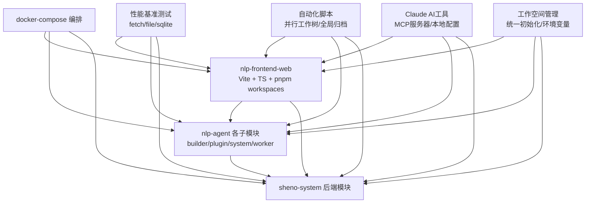

**图表来源**
- [Dockerfile](file://Dockerfile)
- [docker-compose.yaml](file://docker-compose.yaml)
- [run.js](file://benchmarks/run.js)
- [worktree-parallel.sh](file://scripts/parallel/worktree-parallel.sh)
- [global-archive.sh](file://scripts/parallel/global-archive.sh)
- [mcp.json](file://.claude/mcp.json)
- [setup.sh](file://.workspace/setup.sh)

## 详细组件分析

### Maven多模块项目管理（Spring AI系列）
- 父POM职责
  - 统一版本管理、插件配置与依赖聚合，避免重复声明。
  - 在子模块中仅声明必要的依赖，减少耦合。
- 子模块划分
  - 功能导向：HelloWorld、Ollama、ChatClient、Streaming、Prompt、PromptTemplate、StructuredOutput、Persistent、Text2image、Text2voice、Embed2vector、RAG4AiOps、ToolCalling、LocalMcpServer、LocalMcpClient、ClientCallBaiduMcpServer、BailianRAG、TodayMenu。
- 最佳实践
  - 使用Maven Wrapper确保团队成员使用一致的Maven版本。
  - 子模块间尽量保持无循环依赖；如需共享代码，抽取为独立模块或共享包。
  - 单元测试与集成测试分离，确保可运行性与稳定性。
  - 使用属性与插件配置集中管理，避免分散重复。

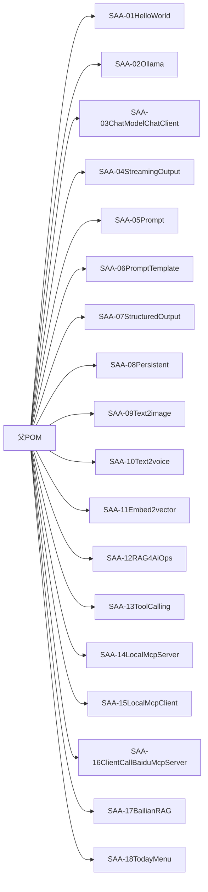

**图表来源**
- [pom.xml](file://pom.xml)

**章节来源**
- [pom.xml](file://pom.xml)
- [maven-wrapper.properties](file://.mvn/wrapper/maven-wrapper.properties)

### Maven多模块项目管理（LangChain4j系列）
- 父POM职责
  - 统一版本与插件，子模块聚焦不同能力点：helloworld、multi-model-together、boot-integration、low/high-api、model-parameters、chat-image、chat-stream、chat-memory、chat-prompt、chat-persistence、chat-functioncalling、chat-embedding、chat-rag01、chat-mcp。
- 最佳实践
  - 将公共配置抽取到共享模块或父POM，减少重复。
  - 为每个能力模块编写最小可运行示例，便于学习与回归测试。

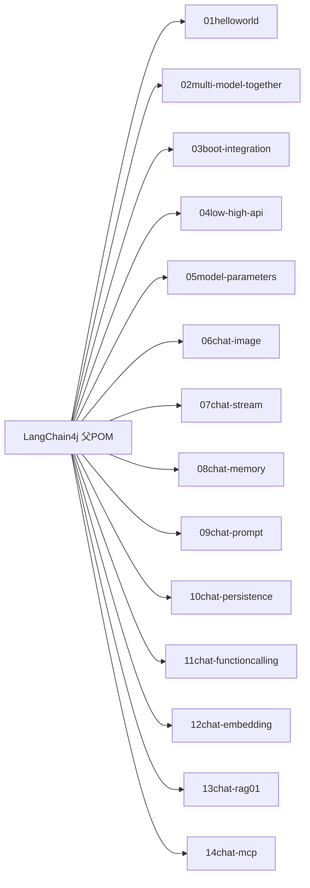

**图表来源**
- [pom.xml](file://pom.xml)

**章节来源**
- [pom.xml](file://pom.xml)

### Node.js项目开发环境配置（仓颉智能体前端）
- 包管理与工作区
  - 使用 pnpm 作为包管理器，配合 pnpm-workspace.yaml 组织多包。
  - package.json 中定义脚本命令，如 dev、build、lint、test 等。
- 构建与开发
  - Vite 作为开发服务器与打包工具，支持热更新与快速启动。
  - TypeScript 严格模式与统一 tsconfig，确保类型安全。
  - ESLint、Prettier、Stylelint 规范代码风格与质量。
- 性能与缓存
  - Turbo 加速构建与缓存，提升多包协作效率。
- 容器化
  - 提供 Dockerfile，便于本地与CI/CD中统一构建与部署。

**图表来源**
- [package.json](file://package.json)
- [pnpm-workspace.yaml](file://pnpm-workspace.yaml)
- [vite.config.ts](file://vite.config.ts)
- [tsconfig.json](file://tsconfig.json)
- [turbo.json](file://turbo.json)
- [Dockerfile](file://Dockerfile)

**章节来源**
- [package.json](file://package.json)
- [pnpm-workspace.yaml](file://pnpm-workspace.yaml)
- [vite.config.ts](file://vite.config.ts)
- [tsconfig.json](file://tsconfig.json)
- [turbo.json](file://turbo.json)
- [Dockerfile](file://Dockerfile)

### Docker容器化部署流程
- 前端与各Agent模块均提供Dockerfile，便于独立构建与部署。
- docker-compose.yaml 将前端、Agent与后端服务编排在一起，简化本地联调。
- 建议在CI/CD中使用相同Dockerfile与Compose配置，确保环境一致性。

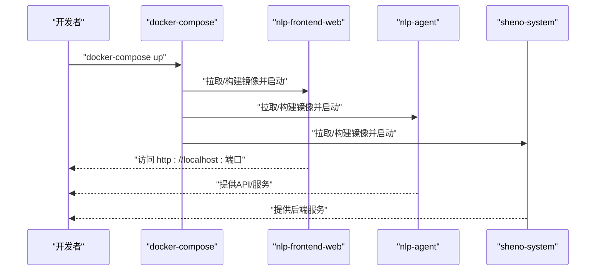

**图表来源**
- [docker-compose.yaml](file://docker-compose.yaml)
- [Dockerfile](file://Dockerfile)

**章节来源**
- [docker-compose.yaml](file://docker-compose.yaml)
- [Dockerfile](file://Dockerfile)

## 性能基准测试工具链
**新增** 本工具链提供系统性能量化评估能力，包含多种基准测试场景。

### 基准测试类型
- **fetch-bench.js**：HTTP请求性能测试，评估网络请求延迟和吞吐量
- **file-bench.js**：文件操作性能测试，测量文件读写速度和I/O性能
- **sqlite-bench.js**：数据库操作性能测试，评估SQLite查询和事务性能

### 运行流程
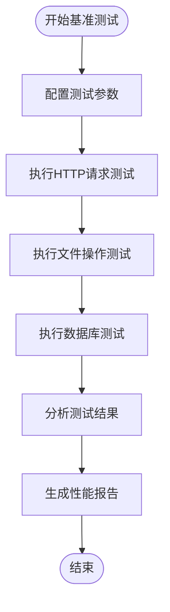

**图表来源**
- [run.js](file://benchmarks/run.js)
- [fetch-bench.js](file://benchmarks/tasks/fetch-bench.js)
- [file-bench.js](file://benchmarks/tasks/file-bench.js)
- [sqlite-bench.js](file://benchmarks/tasks/sqlite-bench.js)

### 测试执行
- 使用 `node benchmarks/run.js` 执行完整的基准测试套件
- 自动生成 `benchmarks/result.json` 和 `benchmarks/result.md` 报告文件
- 支持自定义测试参数和重复次数配置

**章节来源**
- [run.js](file://benchmarks/run.js)
- [result.md](file://benchmarks/result.md)
- [fetch-bench.js](file://benchmarks/tasks/fetch-bench.js)
- [file-bench.js](file://benchmarks/tasks/file-bench.js)
- [sqlite-bench.js](file://benchmarks/tasks/sqlite-bench.js)

## 自动化脚本工具链
**新增** 本工具链提供开发工作流自动化能力，支持并行开发和项目管理。

### 并行工作树管理
- **worktree-parallel.sh**：创建并行工作树，支持多分支同时开发
- **worktree-merge.sh**：合并并行工作树，统一代码变更
- **test-worktree-effect.js**：测试并行工作树效果，验证开发流程

### 全局归档功能
- **global-archive.sh**：全局项目归档，统一管理历史快照
- **plan-snapshot.js**：计划快照生成，支持项目里程碑管理
- **mermaid-generator.js**：Mermaid图表生成，可视化项目结构

### 会话快照管理
- **backup-history.js**：历史备份，保护重要开发进度
- **fix-paths.js**：路径修复，解决文件路径问题
- **save.js/load.js**：会话保存与加载，支持断点续开发

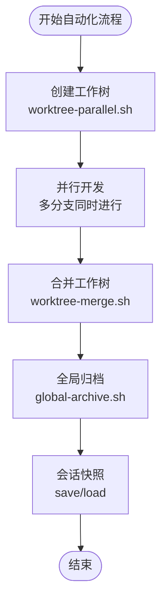

**图表来源**
- [worktree-parallel.sh](file://scripts/parallel/worktree-parallel.sh)
- [worktree-merge.sh](file://scripts/parallel/worktree-merge.sh)
- [global-archive.sh](file://scripts/parallel/global-archive.sh)
- [plan-snapshot.js](file://scripts/parallel/plan-snapshot.js)

### 脚本执行
- 使用 `bash scripts/parallel/worktree-parallel.sh` 创建并行工作树
- 使用 `bash scripts/parallel/worktree-merge.sh` 合并工作树变更
- 使用 `bash scripts/parallel/global-archive.sh` 执行全局归档

**章节来源**
- [worktree-parallel.sh](file://scripts/parallel/worktree-parallel.sh)
- [worktree-merge.sh](file://scripts/parallel/worktree-merge.sh)
- [global-archive.sh](file://scripts/parallel/global-archive.sh)
- [plan-snapshot.js](file://scripts/parallel/plan-snapshot.js)
- [save.js](file://scripts/会话快照/save.js)
- [load.js](file://scripts/会话快照/load.js)

## Claude AI开发工具链
**新增** 本工具链提供Claude AI集成开发环境，支持多模态内容处理和智能代理。

### MCP服务器配置
- **mcp.json**：主配置文件，定义MCP服务器连接信息
- **mcp.json.template**：配置模板，提供标准配置示例
- 支持多模态内容处理，包括文本、图像和音频

### 本地开发设置
- **settings.local.json**：本地配置文件，存储开发环境特定设置
- **agents/**：智能体管理目录，包含各种AI代理配置
- **skills/**：技能模块，提供预定义的AI能力

### 开发工具集
- **commands/**：命令定义，支持自定义AI命令
- **hooks/**：钩子机制，实现事件驱动的AI交互
- **orchestrator/**：编排器，协调多个AI组件的工作流程

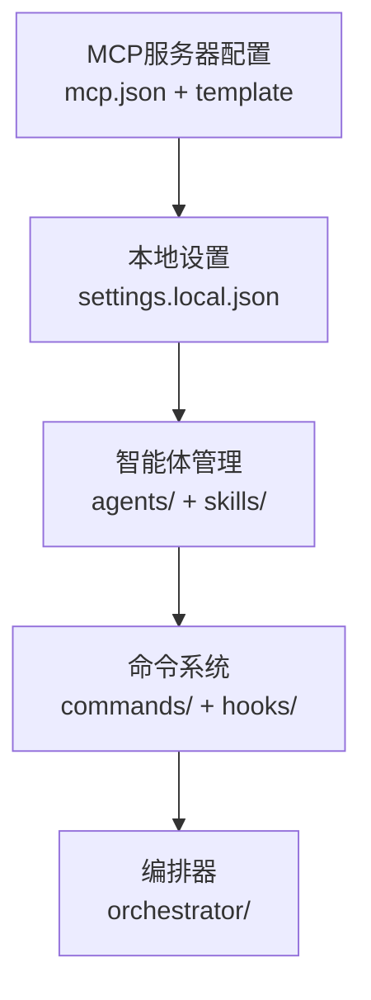

**图表来源**
- [mcp.json](file://.claude/mcp.json)
- [mcp.json.template](file://.claude/mcp.json.template)
- [settings.local.json](file://.claude/settings.local.json)

### 配置管理
- 使用 `mcp.json` 配置MCP服务器连接
- 在 `settings.local.json` 中添加本地开发配置
- 通过 `commands/` 目录扩展AI命令功能
- 利用 `hooks/` 实现事件驱动的AI交互

**章节来源**
- [mcp.json](file://.claude/mcp.json)
- [mcp.json.template](file://.claude/mcp.json.template)
- [settings.local.json](file://.claude/settings.local.json)

## 工作空间管理工具
**新增** 本工具链提供统一的开发环境初始化和管理能力。

### 环境初始化
- **setup.sh**：开发环境初始化脚本，自动配置开发工具和依赖
- **workspace.env**：环境变量配置文件，定义项目特定的环境设置
- 支持一键初始化完整的开发环境

### 工具链集成
- 统一管理开发工具版本和配置
- 自动检测和修复环境问题
- 提供开发环境状态监控

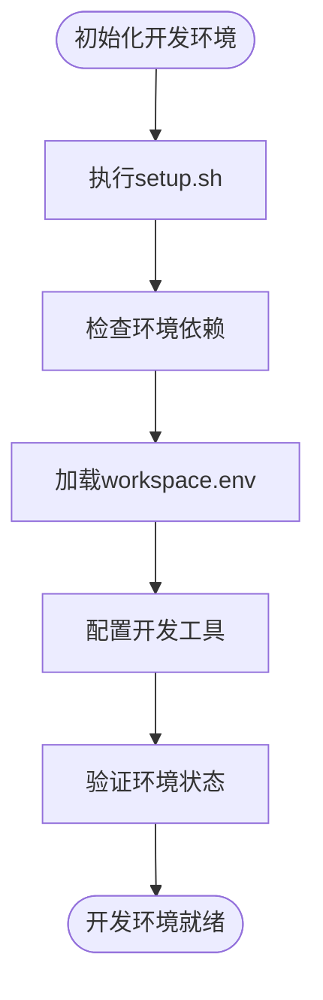

**图表来源**
- [setup.sh](file://.workspace/setup.sh)
- [workspace.env](file://.workspace/workspace.env)

### 使用方法
- 执行 `bash .workspace/setup.sh` 初始化开发环境
- 验证环境配置是否正确
- 根据需要调整 `.workspace/workspace.env` 中的环境变量

**章节来源**
- [setup.sh](file://.workspace/setup.sh)
- [workspace.env](file://.workspace/workspace.env)

## 包管理最佳实践
**新增** 本节提供现代化的包管理策略和最佳实践。

### pnpm工作区管理
- 使用 `pnpm-workspace.yaml` 统一管理多包依赖
- 通过 `package.json` 的 scripts 聚合常用命令
- 利用 pnpm 的硬链接机制提高磁盘空间利用率

### 依赖管理策略
- 采用语义化版本控制，确保依赖兼容性
- 使用 `pnpm audit` 定期检查安全漏洞
- 通过 `pnpm why` 分析依赖树，避免重复依赖

### 构建优化
- 结合 Turbo 提升多包构建效率
- 使用 TypeScript 严格模式确保类型安全
- 配置 ESLint、Prettier、Stylelint 统一代码规范

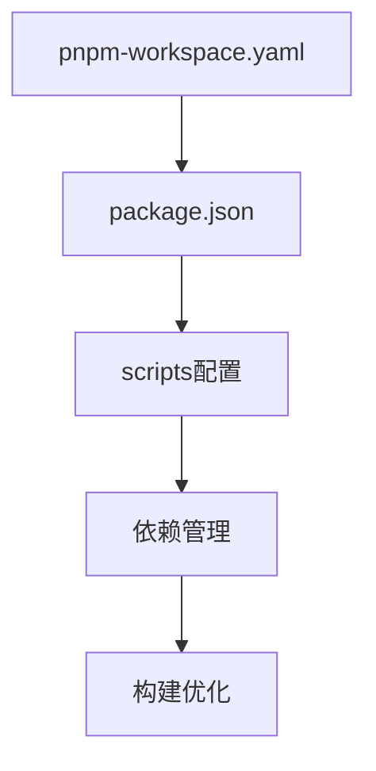

**图表来源**
- [pnpm-workspace.yaml](file://pnpm-workspace.yaml)
- [package.json](file://package.json)

**章节来源**
- [pnpm-workspace.yaml](file://pnpm-workspace.yaml)
- [package.json](file://package.json)

## 依赖分析
- Maven模块间依赖
  - 父POM统一管理版本与插件，子模块按需引入依赖，避免循环依赖。
  - 建议将跨模块共享的配置与依赖抽取到独立模块，降低耦合度。
- Node.js工作区依赖
  - pnpm workspaces 管理多包依赖，避免重复安装与版本冲突。
  - 通过 package.json 的 scripts 聚合常用命令，提升开发效率。
- 容器化依赖
  - 各模块的Dockerfile与docker-compose.yaml共同构成部署依赖链，确保服务可被正确编排与启动。
- **新增**：工具链依赖
  - 性能基准测试依赖 Node.js 运行时和相关测试库
  - 自动化脚本依赖 Bash 环境和 Git 工作树功能
  - Claude AI工具依赖 MCP 协议和本地配置文件
  - 工作空间管理依赖 Shell 脚本和环境变量配置

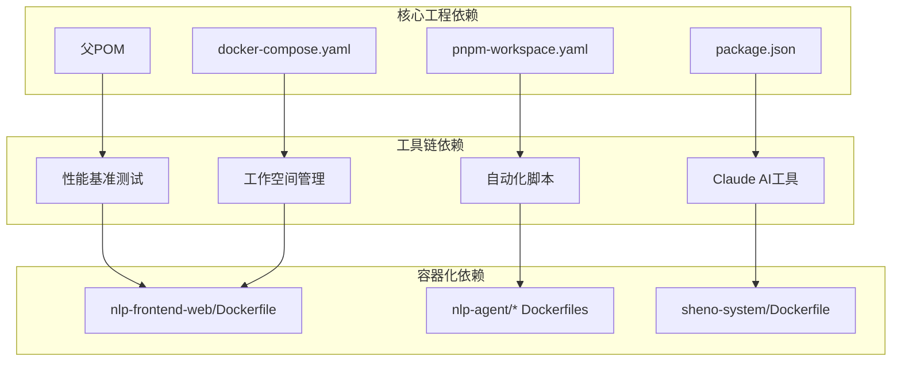

**图表来源**
- [pom.xml](file://pom.xml)
- [pnpm-workspace.yaml](file://pnpm-workspace.yaml)
- [package.json](file://package.json)
- [docker-compose.yaml](file://docker-compose.yaml)
- [run.js](file://benchmarks/run.js)
- [worktree-parallel.sh](file://scripts/parallel/worktree-parallel.sh)
- [mcp.json](file://.claude/mcp.json)
- [setup.sh](file://.workspace/setup.sh)

**章节来源**
- [pom.xml](file://pom.xml)
- [pnpm-workspace.yaml](file://pnpm-workspace.yaml)
- [package.json](file://package.json)
- [docker-compose.yaml](file://docker-compose.yaml)

## 性能考虑
- Maven
  - 使用Maven Wrapper与中央仓库镜像，减少网络波动影响。
  - 合理拆分子模块，避免一次性构建过多模块。
  - 在CI中启用增量构建与缓存，缩短构建时间。
- Node.js
  - pnpm相比npm更快更节省磁盘空间；结合Turbo缓存显著提升多包构建速度。
  - Vite开发服务器默认启用HMR，合理配置别名与外部依赖可进一步优化启动速度。
- 容器化
  - 使用多阶段构建减少镜像体积；在CI中缓存依赖层；Compose中合理设置资源限制与健康检查。
- **新增**：性能基准测试
  - 定期运行基准测试，监控系统性能变化趋势
  - 使用标准化测试场景，确保测试结果可比性
  - 建立性能基线，及时发现性能回归问题
- **新增**：自动化脚本优化
  - 使用并行工作树减少开发等待时间
  - 通过全局归档避免重复工作
  - 利用会话快照快速恢复开发状态

## 故障排除指南
- 版本与环境
  - Maven：确认使用Maven Wrapper，避免版本差异导致的构建失败。
  - Node.js：确认pnpm版本与Node版本满足项目要求；清理node_modules与lock文件后重装依赖。
- 构建与运行
  - Maven：优先执行父POM的clean与install，再进入子模块验证。
  - Node.js：先执行pnpm install，再运行dev；若端口占用，修改Vite端口或释放端口。
- 容器化
  - docker-compose：确认所有服务的Dockerfile路径正确，镜像标签一致；先停止旧容器再重新构建。
  - 端口冲突：修改docker-compose中的端口映射或停止占用进程。
- 代码规范
  - ESLint/Prettier/Stylelint：先执行格式化，再进行静态检查；修复告警后再提交。
- 版本控制
  - .gitignore：确保忽略target、node_modules、.DS_Store、IDE生成文件等；避免误提交。
- **新增**：性能基准测试
  - 确认 Node.js 运行时可用且版本兼容
  - 检查测试数据文件是否存在且可访问
  - 验证测试结果文件权限，确保可写入
- **新增**：自动化脚本
  - 确认 Bash 环境可用，脚本具有执行权限
  - 检查 Git 工作树功能是否正常
  - 验证临时文件夹权限，确保可读写
- **新增**：Claude AI工具
  - 确认 MCP 服务器配置正确，网络连接正常
  - 检查本地设置文件格式，避免JSON解析错误
  - 验证智能体配置文件完整性
- **新增**：工作空间管理
  - 确认 Shell 脚本语法正确，无语法错误
  - 检查环境变量文件格式，避免配置解析失败
  - 验证依赖工具是否已安装并可执行

**章节来源**
- [maven-wrapper.properties](file://.mvn/wrapper/maven-wrapper.properties)
- [package.json](file://package.json)
- [docker-compose.yaml](file://docker-compose.yaml)
- [run.js](file://benchmarks/run.js)
- [worktree-parallel.sh](file://scripts/parallel/worktree-parallel.sh)
- [mcp.json](file://.claude/mcp.json)
- [setup.sh](file://.workspace/setup.sh)

## 结论
本指南提供了从IDE设置、构建工具、版本控制到容器化部署的完整开发环境配置方案。通过Maven多模块与Node.js工作区的规范化管理，结合Docker编排、性能基准测试、自动化脚本、Claude AI工具链和工作空间管理，开发者可以高效地进行项目开发与维护。新增的现代化开发工具链进一步提升了开发效率和质量保证能力。建议在团队内推广使用相同的工具链与流程，以确保一致性与可维护性。

## 附录
- IDE推荐
  - Java：IntelliJ IDEA（Spring Boot插件、Maven视图）
  - TypeScript/Vite：VS Code（ESLint、Prettier、TypeScript语言特性）
- 版本控制
  - Git：使用分支策略（如Git Flow），提交前执行lint与测试
- 持续集成
  - 建议在CI中执行：安装依赖、构建、测试、代码检查、构建镜像、推送镜像
- 记忆与协作
  - 项目记忆文件与IDEA快速开始文档可用于新成员快速上手
- **新增**：工具链使用建议
  - 定期运行性能基准测试，建立性能监控机制
  - 利用自动化脚本提升开发效率，减少重复劳动
  - 结合Claude AI工具增强开发智能化水平
  - 使用工作空间管理工具确保开发环境一致性

**章节来源**
- [README.md](file://README.md)
- [CLAUDE.md](file://CLAUDE.md)