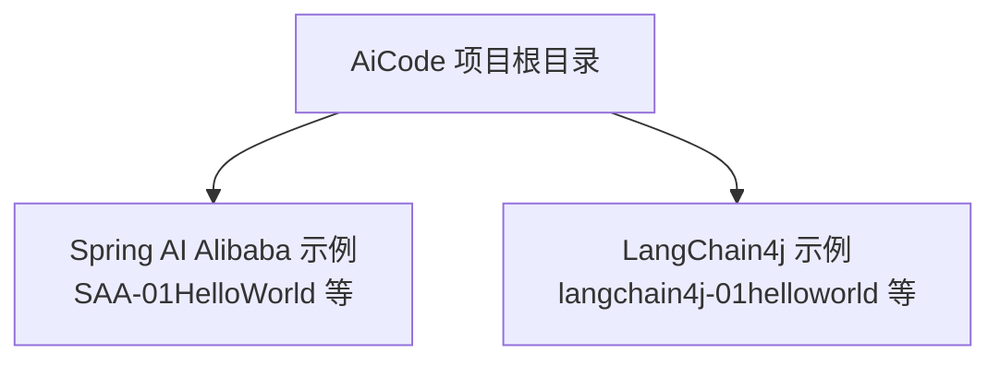
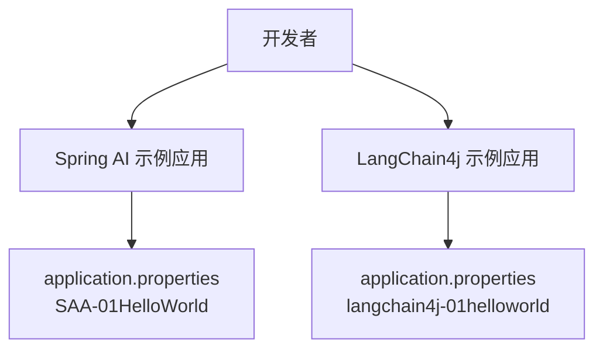
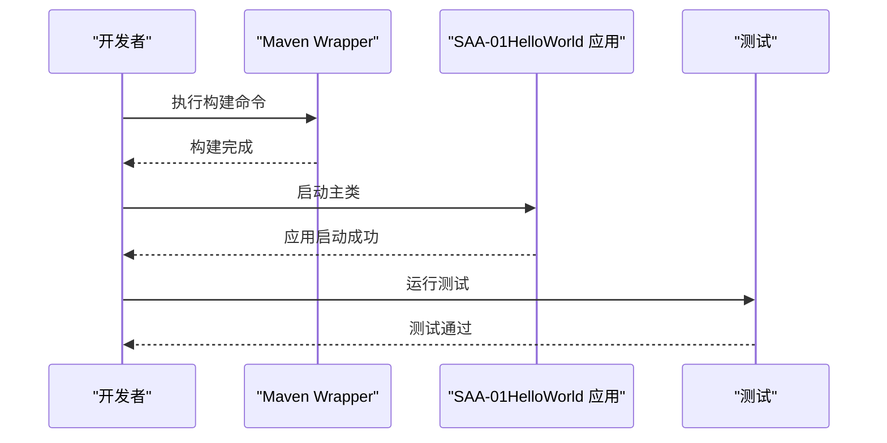
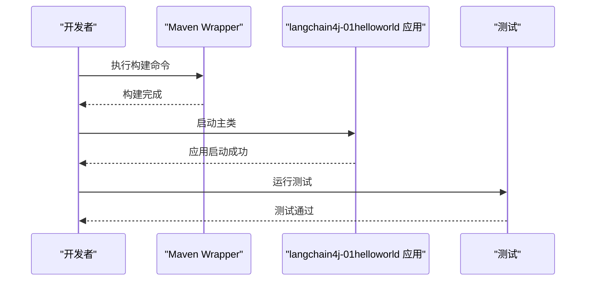
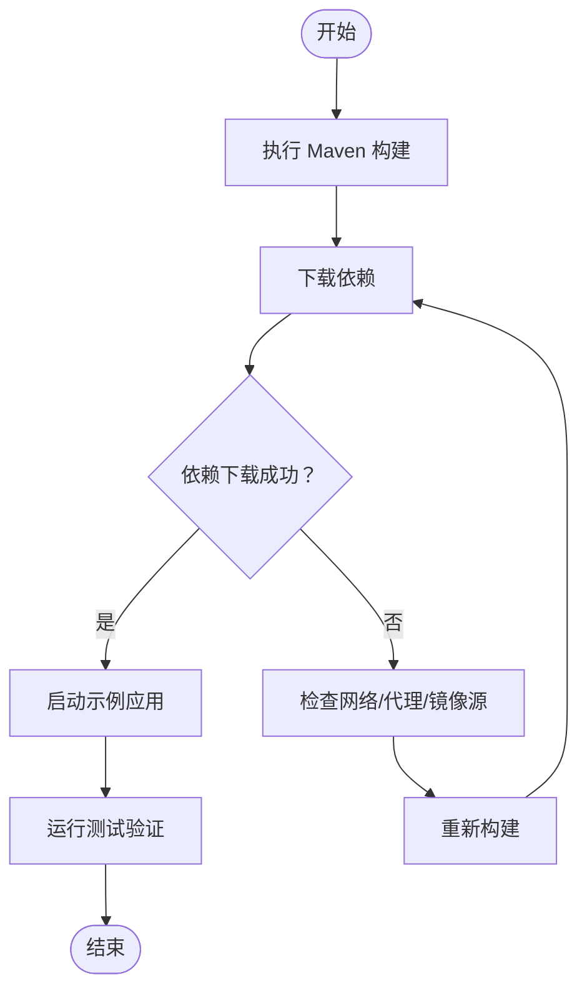

# 快速开始

<cite>
**本文引用的文件**
- [SAA-01HelloWorld/pom.xml](file://【1】SpringAIAlibaba-atguiguV1/SAA-01HelloWorld/pom.xml)
- [SAA-01HelloWorld/application.properties](file://【1】SpringAIAlibaba-atguiguV1/SAA-01HelloWorld/src/main/resources/application.properties)
- [SAA-01HelloWorld/Saa01HelloWorldApplication.java](file://【1】SpringAIAlibaba-atguiguV1/SAA-01HelloWorld/src/main/java/com/atguigu/study/Saa01HelloWorldApplication.java)
- [SAA-01HelloWorld/Saa01HelloWorldApplicationTests.java](file://【1】SpringAIAlibaba-atguiguV1/SAA-01HelloWorld/src/test/java/com/atguigu/study/Saa01HelloWorldApplicationTests.java)
- [langchain4j-01helloworld/pom.xml](file://【2】langchain4j-atguiguV5/langchain4j-01helloworld/pom.xml)
- [langchain4j-01helloworld/application.properties](file://【2】langchain4j-atguiguV5/langchain4j-01helloworld/src/main/resources/application.properties)
- [langchain4j-01helloworld/HelloLangChain4JApp.java](file://【2】langchain4j-atguiguV5/langchain4j-01helloworld/src/main/java/com/atguigu/study/HelloLangChain4JApp.java)
- [langchain4j-01helloworld/HelloLangChain4JAppTests.java](file://【2】langchain4j-atguiguV5/langchain4j-01helloworld/src/test/java/HelloLangChain4JAppTests.java)
- [SAA-02Ollama/pom.xml](file://【1】SpringAIAlibaba-atguiguV1/SAA-02Ollama/pom.xml)
- [SAA-02Ollama/application.properties](file://【1】SpringAIAlibaba-atguiguV1/SAA-02Ollama/src/main/resources/application.properties)
- [langchain4j-02multi-model-together/pom.xml](file://【2】langchain4j-atguiguV5/langchain4j-02multi-model-together/pom.xml)
- [langchain4j-02multi-model-together/application.properties](file://【2】langchain4j-atguiguV5/langchain4j-02multi-model-together/src/main/resources/application.properties)
- [SAA-03ChatModelChatClient/pom.xml](file://【1】SpringAIAlibaba-atguiguV1/SAA-03ChatModelChatClient/pom.xml)
- [SAA-03ChatModelChatClient/application.properties](file://【1】SpringAIAlibaba-atguiguV1/SAA-03ChatModelChatClient/src/main/resources/application.properties)
- [langchain4j-04low-high-api/pom.xml](file://【2】langchain4j-atguiguV5/langchain4j-04low-high-api/pom.xml)
- [langchain4j-04low-high-api/application.properties](file://【2】langchain4j-atguiguV5/langchain4j-04low-high-api/src/main/resources/application.properties)
- [SAA-05Prompt/pom.xml](file://【1】SpringAIAlibaba-atguiguV1/SAA-05Prompt/pom.xml)
- [SAA-05Prompt/application.properties](file://【1】SpringAIAlibaba-atguiguV1/SAA-05Prompt/src/main/resources/application.properties)
- [langchain4j-09chat-prompt/pom.xml](file://【2】langchain4j-atguiguV5/langchain4j-09chat-prompt/pom.xml)
- [langchain4j-09chat-prompt/application.properties](file://【2】langchain4j-atguiguV5/langchain4j-09chat-prompt/src/main/resources/application.properties)
- [SAA-06PromptTemplate/pom.xml](file://【1】SpringAIAlibaba-atguiguV1/SAA-06PromptTemplate/pom.xml)
- [SAA-06PromptTemplate/application.properties](file://【1】SpringAIAlibaba-atguiguV1/SAA-06PromptTemplate/src/main/resources/application.properties)
- [langchain4j-10chat-persistence/pom.xml](file://【2】langchain4j-atguiguV5/langchain4j-10chat-persistence/pom.xml)
- [langchain4j-10chat-persistence/application.properties](file://【2】langchain4j-atguiguV5/langchain4j-10chat-persistence/src/main/resources/application.properties)
- [SAA-07StructuredOutput/pom.xml](file://【1】SpringAIAlibaba-atguiguV1/SAA-07StructuredOutput/pom.xml)
- [SAA-07StructuredOutput/application.properties](file://【1】SpringAIAlibaba-atguiguV1/SAA-07StructuredOutput/src/main/resources/application.properties)
- [langchain4j-11chat-functioncalling/pom.xml](file://【2】langchain4j-atguiguV5/langchain4j-11chat-functioncalling/pom.xml)
- [langchain4j-11chat-functioncalling/application.properties](file://【2】langchain4j-atguiguV5/langchain4j-11chat-functioncalling/src/main/resources/application.properties)
- [SAA-08Persistent/pom.xml](file://【1】SpringAIAlibaba-atguiguV1/SAA-08Persistent/pom.xml)
- [SAA-08Persistent/application.properties](file://【1】SpringAIAlibaba-atguiguV1/SAA-08Persistent/src/main/resources/application.properties)
- [langchain4j-12chat-embedding/pom.xml](file://【2】langchain4j-atguiguV5/langchain4j-12chat-embedding/pom.xml)
- [langchain4j-12chat-embedding/application.properties](file://【2】langchain4j-atguiguV5/langchain4j-12chat-embedding/src/main/resources/application.properties)
- [SAA-09Text2image/pom.xml](file://【1】SpringAIAlibaba-atguiguV1/SAA-09Text2image/pom.xml)
- [SAA-09Text2image/application.properties](file://【1】SpringAIAlibaba-atguiguV1/SAA-09Text2image/src/main/resources/application.properties)
- [langchain4j-13chat-rag01/pom.xml](file://【2】langchain4j-atguiguV5/langchain4j-13chat-rag01/pom.xml)
- [langchain4j-13chat-rag01/application.properties](file://【2】langchain4j-atguiguV5/langchain4j-13chat-rag01/src/main/resources/application.properties)
- [SAA-10Text2voice/pom.xml](file://【1】SpringAIAlibaba-atguiguV1/SAA-10Text2voice/pom.xml)
- [SAA-10Text2voice/application.properties](file://【1】SpringAIAlibaba-atguiguV1/SAA-10Text2voice/src/main/resources/application.properties)
- [SAA-11Embed2vector/pom.xml](file://【1】SpringAIAlibaba-atguiguV1/SAA-11Embed2vector/pom.xml)
- [SAA-11Embed2vector/application.properties](file://【1】SpringAIAlibaba-atguiguV1/SAA-11Embed2vector/src/main/resources/application.properties)
- [SAA-12RAG4AiOps/pom.xml](file://【1】SpringAIAlibaba-atguiguV1/SAA-12RAG4AiOps/pom.xml)
- [SAA-12RAG4AiOps/application.properties](file://【1】SpringAIAlibaba-atguiguV1/SAA-12RAG4AiOps/src/main/resources/application.properties)
- [SAA-13ToolCalling/pom.xml](file://【1】SpringAIAlibaba-atguiguV1/SAA-13ToolCalling/pom.xml)
- [SAA-13ToolCalling/application.properties](file://【1】SpringAIAlibaba-atguiguV1/SAA-13ToolCalling/src/main/resources/application.properties)
- [SAA-14LocalMcpServer/pom.xml](file://【1】SpringAIAlibaba-atguiguV1/SAA-14LocalMcpServer/pom.xml)
- [SAA-14LocalMcpServer/application.properties](file://【1】SpringAIAlibaba-atguiguV1/SAA-14LocalMcpServer/src/main/resources/application.properties)
- [SAA-15LocalMcpClient/pom.xml](file://【1】SpringAIAlibaba-atguiguV1/SAA-15LocalMcpClient/pom.xml)
- [SAA-15LocalMcpClient/application.properties](file://【1】SpringAIAlibaba-atguiguV1/SAA-15LocalMcpClient/src/main/resources/application.properties)
- [SAA-16ClientCallBaiduMcpServer/pom.xml](file://【1】SpringAIAlibaba-atguiguV1/SAA-16ClientCallBaiduMcpServer/pom.xml)
- [SAA-16ClientCallBaiduMcpServer/application.properties](file://【1】SpringAIAlibaba-atguiguV1/SAA-16ClientCallBaiduMcpServer/src/main/resources/application.properties)
- [SAA-17BailianRAG/pom.xml](file://【1】SpringAIAlibaba-atguiguV1/SAA-17BailianRAG/pom.xml)
- [SAA-17BailianRAG/application.properties](file://【1】SpringAIAlibaba-atguiguV1/SAA-17BailianRAG/src/main/resources/application.properties)
- [SAA-18TodayMenu/pom.xml](file://【1】SpringAIAlibaba-atguiguV1/SAA-18TodayMenu/pom.xml)
- [SAA-18TodayMenu/application.properties](file://【1】SpringAIAlibaba-atguiguV1/SAA-18TodayMenu/src/main/resources/application.properties)
- [SAA-04StreamingOutput/pom.xml](file://【1】SpringAIAlibaba-atguiguV1/SAA-04StreamingOutput/pom.xml)
- [SAA-04StreamingOutput/application.properties](file://【1】SpringAIAlibaba-atguiguV1/SAA-04StreamingOutput/src/main/resources/application.properties)
- [langchain4j-07chat-stream/pom.xml](file://【2】langchain4j-atguiguV5/langchain4j-07chat-stream/pom.xml)
- [langchain4j-07chat-stream/application.properties](file://【2】langchain4j-atguiguV5/langchain4j-07chat-stream/src/main/resources/application.properties)
- [langchain4j-08chat-memory/pom.xml](file://【2】langchain4j-atguiguV5/langchain4j-08chat-memory/pom.xml)
- [langchain4j-08chat-memory/application.properties](file://【2】langchain4j-atguiguV5/langchain4j-08chat-memory/src/main/resources/application.properties)
- [langchain4j-14chat-mcp/pom.xml](file://【2】langchain4j-atguiguV5/langchain4j-14chat-mcp/pom.xml)
- [langchain4j-14chat-mcp/application.properties](file://【2】langchain4j-atguiguV5/langchain4j-14chat-mcp/src/main/resources/application.properties)
- [SAA-01HelloWorld/mvnw.cmd](file://【1】SpringAIAlibaba-atguiguV1/SAA-01HelloWorld/mvnw.cmd)
- [SAA-01HelloWorld/.mvn/wrapper/maven-wrapper.properties](file://【1】SpringAIAlibaba-atguiguV1/SAA-01HelloWorld/.mvn/wrapper/maven-wrapper.properties)
- [langchain4j-01helloworld/pom.xml](file://【2】langchain4j-atguiguV5/langchain4j-01helloworld/pom.xml)
- [langchain4j-01helloworld/src/main/resources/application.properties](file://【2】langchain4j-atguiguV5/langchain4j-01helloworld/src/main/resources/application.properties)
- [langchain4j-01helloworld/src/main/java/com/atguigu/study/HelloLangChain4JApp.java](file://【2】langchain4j-atguiguV5/langchain4j-01helloworld/src/main/java/com/atguigu/study/HelloLangChain4JApp.java)
- [langchain4j-01helloworld/src/test/java/HelloLangChain4JAppTests.java](file://【2】langchain4j-atguiguV5/langchain4j-01helloworld/src/test/java/HelloLangChain4JAppTests.java)
</cite>

## 目录
1. [引言](#引言)
2. [项目结构](#项目结构)
3. [核心组件](#核心组件)
4. [架构总览](#架构总览)
5. [详细组件分析](#详细组件分析)
6. [依赖分析](#依赖分析)
7. [性能考虑](#性能考虑)
8. [故障排查指南](#故障排查指南)
9. [结论](#结论)
10. [附录](#附录)

## 引言
本指南面向首次接触 AiCode 项目的开发者，目标是在约 30 分钟内完成环境准备、项目克隆、依赖配置与首个示例程序的运行，并理解 Spring AI Alibaba 与 LangChain4j 的基础用法。文档覆盖 JDK、Maven、Node.js 等环境要求，提供分步操作与常见问题排查建议。

## 项目结构
AiCode 仓库包含两套教学示例：
- Spring AI Alibaba 教学示例（以 SAA- 开头的多个子工程）
- LangChain4j 教学示例（以 langchain4j- 开头的多个子工程）

每个示例均包含标准 Maven 结构：src/main/java、src/main/resources、pom.xml、测试代码与可选的 Maven Wrapper 文件。你可以按需选择任一框架下的入门示例进行快速体验。

[无图表来源；该图为概念性结构示意]

**章节来源**
- [SAA-01HelloWorld/pom.xml](file://【1】SpringAIAlibaba-atguiguV1/SAA-01HelloWorld/pom.xml)
- [langchain4j-01helloworld/pom.xml](file://【2】langchain4j-atguiguV5/langchain4j-01helloworld/pom.xml)

## 核心组件
- Spring AI Alibaba 示例（以 SAA- 开头）：通过 Spring Boot 应用启动，使用 application.properties 配置模型访问参数，示例涵盖提示词、流式输出、RAG、工具调用、本地 MCP 服务/客户端等主题。
- LangChain4j 示例（以 langchain4j- 开头）：同样基于 Spring Boot，通过 application.properties 配置模型参数，示例涵盖多模型、低/高阶 API、流式输出、内存、提示词、持久化、函数调用、嵌入、RAG、MCP 等主题。

**章节来源**
- [SAA-01HelloWorld/Saa01HelloWorldApplication.java](file://【1】SpringAIAlibaba-atguiguV1/SAA-01HelloWorld/src/main/java/com/atguigu/study/Saa01HelloWorldApplication.java)
- [langchain4j-01helloworld/HelloLangChain4JApp.java](file://【2】langchain4j-atguiguV5/langchain4j-01helloworld/src/main/java/com/atguigu/study/HelloLangChain4JApp.java)

## 架构总览
下图展示了“快速开始”阶段的核心交互：开发者在本地运行示例应用，应用通过配置文件中的参数连接到本地或云端的大模型服务，随后返回结果或流式输出。

**图表来源**
- [SAA-01HelloWorld/application.properties](file://【1】SpringAIAlibaba-atguiguV1/SAA-01HelloWorld/src/main/resources/application.properties)
- [langchain4j-01helloworld/application.properties](file://【2】langchain4j-atguiguV5/langchain4j-01helloworld/src/main/resources/application.properties)

**章节来源**
- [SAA-01HelloWorld/application.properties](file://【1】SpringAIAlibaba-atguiguV1/SAA-01HelloWorld/src/main/resources/application.properties)
- [langchain4j-01helloworld/application.properties](file://【2】langchain4j-atguiguV5/langchain4j-01helloworld/src/main/resources/application.properties)

## 详细组件分析

### 环境准备与安装
- JDK
  - 建议使用 Java 17 或更高版本，确保 JAVA_HOME 正确指向安装路径。
- Maven
  - 推荐使用 Maven 3.6+。项目自带 Maven Wrapper（如 mvnw.cmd 与 .mvn/wrapper），无需全局安装 Maven 即可构建。
- Node.js（仅用于前端相关工作区，示例应用为后端 Spring Boot，非必需）
  - 若需运行前端工程，请安装 Node.js 16+ 并使用包管理器（如 pnpm）安装依赖。

**章节来源**
- [SAA-01HelloWorld/mvnw.cmd](file://【1】SpringAIAlibaba-atguiguV1/SAA-01HelloWorld/mvnw.cmd)
- [SAA-01HelloWorld/.mvn/wrapper/maven-wrapper.properties](file://【1】SpringAIAlibaba-atguiguV1/SAA-01HelloWorld/.mvn/wrapper/maven-wrapper.properties)

### 克隆与依赖配置
- 克隆仓库到本地后，进入任一示例目录（例如 SAA-01HelloWorld 或 langchain4j-01helloworld）。
- 使用 Maven Wrapper 执行构建与测试：
  - Windows：执行 mvnw.cmd clean install
  - Linux/macOS：执行 ./mvnw clean install
- 如需跳过测试：mvnw.cmd clean install -DskipTests

**章节来源**
- [SAA-01HelloWorld/pom.xml](file://【1】SpringAIAlibaba-atguiguV1/SAA-01HelloWorld/pom.xml)
- [langchain4j-01helloworld/pom.xml](file://【2】langchain4j-atguiguV5/langchain4j-01helloworld/pom.xml)

### 运行第一个示例（Spring AI Alibaba）
- 目标：运行 SAA-01HelloWorld，验证最简示例是否可启动。
- 步骤：
  1. 在示例目录执行构建命令（见上节）。
  2. 启动应用入口类对应的 Spring Boot 主类。
  3. 查看控制台输出，确认应用已启动。
  4. 运行单元测试以验证示例逻辑。

**图表来源**
- [SAA-01HelloWorld/Saa01HelloWorldApplication.java](file://【1】SpringAIAlibaba-atguiguV1/SAA-01HelloWorld/src/main/java/com/atguigu/study/Saa01HelloWorldApplication.java)
- [SAA-01HelloWorld/Saa01HelloWorldApplicationTests.java](file://【1】SpringAIAlibaba-atguiguV1/SAA-01HelloWorld/src/test/java/com/atguigu/study/Saa01HelloWorldApplicationTests.java)

**章节来源**
- [SAA-01HelloWorld/Saa01HelloWorldApplication.java](file://【1】SpringAIAlibaba-atguiguV1/SAA-01HelloWorld/src/main/java/com/atguigu/study/Saa01HelloWorldApplication.java)
- [SAA-01HelloWorld/Saa01HelloWorldApplicationTests.java](file://【1】SpringAIAlibaba-atguiguV1/SAA-01HelloWorld/src/test/java/com/atguigu/study/Saa01HelloWorldApplicationTests.java)

### 运行第一个示例（LangChain4j）
- 目标：运行 langchain4j-01helloworld，验证最简示例是否可启动。
- 步骤：
  1. 在示例目录执行构建命令。
  2. 启动应用入口类对应的 Spring Boot 主类。
  3. 查看控制台输出，确认应用已启动。
  4. 运行单元测试以验证示例逻辑。

**图表来源**
- [langchain4j-01helloworld/HelloLangChain4JApp.java](file://【2】langchain4j-atguiguV5/langchain4j-01helloworld/src/main/java/com/atguigu/study/HelloLangChain4JApp.java)
- [langchain4j-01helloworld/HelloLangChain4JAppTests.java](file://【2】langchain4j-atguiguV5/langchain4j-01helloworld/src/test/java/HelloLangChain4JAppTests.java)

**章节来源**
- [langchain4j-01helloworld/HelloLangChain4JApp.java](file://【2】langchain4j-atguiguV5/langchain4j-01helloworld/src/main/java/com/atguigu/study/HelloLangChain4JApp.java)
- [langchain4j-01helloworld/HelloLangChain4JAppTests.java](file://【2】langchain4j-atguiguV5/langchain4j-01helloworld/src/test/java/HelloLangChain4JAppTests.java)

### 基础演示程序运行方法（Spring AI Alibaba）
以下示例均可作为进阶实践，帮助理解不同能力：
- Ollama 集成：参考 SAA-02Ollama 的配置与运行。
- ChatModel 与 ChatClient：参考 SAA-03ChatModelChatClient 的配置与运行。
- 流式输出：参考 SAA-04StreamingOutput 的配置与运行。
- Prompt：参考 SAA-05Prompt 的配置与运行。
- PromptTemplate：参考 SAA-06PromptTemplate 的配置与运行。
- 结构化输出：参考 SAA-07StructuredOutput 的配置与运行。
- 持久化：参考 SAA-08Persistent 的配置与运行。
- 文生图：参考 SAA-09Text2image 的配置与运行。
- 文生语音：参考 SAA-10Text2voice 的配置与运行。
- 向量嵌入：参考 SAA-11Embed2vector 的配置与运行。
- RAG（AiOps）：参考 SAA-12RAG4AiOps 的配置与运行。
- 工具调用：参考 SAA-13ToolCalling 的配置与运行。
- 本地 MCP 服务/客户端：参考 SAA-14LocalMcpServer 与 SAA-15LocalMcpClient 的配置与运行。
- 客户端调用百度 MCP 服务器：参考 SAA-16ClientCallBaiduMcpServer 的配置与运行。
- Bailian RAG：参考 SAA-17BailianRAG 的配置与运行。
- 今日菜单：参考 SAA-18TodayMenu 的配置与运行。

**章节来源**
- [SAA-02Ollama/application.properties](file://【1】SpringAIAlibaba-atguiguV1/SAA-02Ollama/src/main/resources/application.properties)
- [SAA-03ChatModelChatClient/application.properties](file://【1】SpringAIAlibaba-atguiguV1/SAA-03ChatModelChatClient/src/main/resources/application.properties)
- [SAA-04StreamingOutput/application.properties](file://【1】SpringAIAlibaba-atguiguV1/SAA-04StreamingOutput/src/main/resources/application.properties)
- [SAA-05Prompt/application.properties](file://【1】SpringAIAlibaba-atguiguV1/SAA-05Prompt/src/main/resources/application.properties)
- [SAA-06PromptTemplate/application.properties](file://【1】SpringAIAlibaba-atguiguV1/SAA-06PromptTemplate/src/main/resources/application.properties)
- [SAA-07StructuredOutput/application.properties](file://【1】SpringAIAlibaba-atguiguV1/SAA-07StructuredOutput/src/main/resources/application.properties)
- [SAA-08Persistent/application.properties](file://【1】SpringAIAlibaba-atguiguV1/SAA-08Persistent/src/main/resources/application.properties)
- [SAA-09Text2image/application.properties](file://【1】SpringAIAlibaba-atguiguV1/SAA-09Text2image/src/main/resources/application.properties)
- [SAA-10Text2voice/application.properties](file://【1】SpringAIAlibaba-atguiguV1/SAA-10Text2voice/src/main/resources/application.properties)
- [SAA-11Embed2vector/application.properties](file://【1】SpringAIAlibaba-atguiguV1/SAA-11Embed2vector/src/main/resources/application.properties)
- [SAA-12RAG4AiOps/application.properties](file://【1】SpringAIAlibaba-atguiguV1/SAA-12RAG4AiOps/src/main/resources/application.properties)
- [SAA-13ToolCalling/application.properties](file://【1】SpringAIAlibaba-atguiguV1/SAA-13ToolCalling/src/main/resources/application.properties)
- [SAA-14LocalMcpServer/application.properties](file://【1】SpringAIAlibaba-atguiguV1/SAA-14LocalMcpServer/src/main/resources/application.properties)
- [SAA-15LocalMcpClient/application.properties](file://【1】SpringAIAlibaba-atguiguV1/SAA-15LocalMcpClient/src/main/resources/application.properties)
- [SAA-16ClientCallBaiduMcpServer/application.properties](file://【1】SpringAIAlibaba-atguiguV1/SAA-16ClientCallBaiduMcpServer/src/main/resources/application.properties)
- [SAA-17BailianRAG/application.properties](file://【1】SpringAIAlibaba-atguiguV1/SAA-17BailianRAG/src/main/resources/application.properties)
- [SAA-18TodayMenu/application.properties](file://【1】SpringAIAlibaba-atguiguV1/SAA-18TodayMenu/src/main/resources/application.properties)

### 基础演示程序运行方法（LangChain4j）
以下示例均可作为进阶实践，帮助理解不同能力：
- 多模型 Together：参考 langchain4j-02multi-model-together 的配置与运行。
- Spring Boot 集成：参考 langchain4j-03boot-integration 的配置与运行。
- 低/高阶 API：参考 langchain4j-04low-high-api 的配置与运行。
- 模型参数：参考 langchain4j-05model-parameters 的配置与运行。
- 图像对话：参考 langchain4j-06chat-image 的配置与运行。
- 流式输出：参考 langchain4j-07chat-stream 的配置与运行。
- 内存：参考 langchain4j-08chat-memory 的配置与运行。
- 提示词：参考 langchain4j-09chat-prompt 的配置与运行。
- 持久化：参考 langchain4j-10chat-persistence 的配置与运行。
- 函数调用：参考 langchain4j-11chat-functioncalling 的配置与运行。
- 嵌入：参考 langchain4j-12chat-embedding 的配置与运行。
- RAG：参考 langchain4j-13chat-rag01 的配置与运行。
- MCP：参考 langchain4j-14chat-mcp 的配置与运行。

**章节来源**
- [langchain4j-02multi-model-together/application.properties](file://【2】langchain4j-atguiguV5/langchain4j-02multi-model-together/src/main/resources/application.properties)
- [langchain4j-04low-high-api/application.properties](file://【2】langchain4j-atguiguV5/langchain4j-04low-high-api/src/main/resources/application.properties)
- [langchain4j-07chat-stream/application.properties](file://【2】langchain4j-atguiguV5/langchain4j-07chat-stream/src/main/resources/application.properties)
- [langchain4j-08chat-memory/application.properties](file://【2】langchain4j-atguiguV5/langchain4j-08chat-memory/src/main/resources/application.properties)
- [langchain4j-09chat-prompt/application.properties](file://【2】langchain4j-atguiguV5/langchain4j-09chat-prompt/src/main/resources/application.properties)
- [langchain4j-10chat-persistence/application.properties](file://【2】langchain4j-atguiguV5/langchain4j-10chat-persistence/src/main/resources/application.properties)
- [langchain4j-11chat-functioncalling/application.properties](file://【2】langchain4j-atguiguV5/langchain4j-11chat-functioncalling/src/main/resources/application.properties)
- [langchain4j-12chat-embedding/application.properties](file://【2】langchain4j-atguiguV5/langchain4j-12chat-embedding/src/main/resources/application.properties)
- [langchain4j-13chat-rag01/application.properties](file://【2】langchain4j-atguiguV5/langchain4j-13chat-rag01/src/main/resources/application.properties)
- [langchain4j-14chat-mcp/application.properties](file://【2】langchain4j-atguiguV5/langchain4j-14chat-mcp/src/main/resources/application.properties)

## 依赖分析
- Maven 依赖
  - 示例均通过 pom.xml 声明 Spring Boot 与对应框架依赖。建议在本地网络允许的情况下直接构建，避免代理问题导致依赖下载失败。
- 配置文件
  - application.properties 中通常包含模型访问地址、鉴权参数、超时等配置项。请根据实际模型服务调整相应参数。

[无图表来源；该图为通用流程示意]

**章节来源**
- [SAA-01HelloWorld/pom.xml](file://【1】SpringAIAlibaba-atguiguV1/SAA-01HelloWorld/pom.xml)
- [langchain4j-01helloworld/pom.xml](file://【2】langchain4j-atguiguV5/langchain4j-01helloworld/pom.xml)

## 性能考虑
- 构建性能
  - 使用 Maven Wrapper 可减少环境差异带来的问题；若网络较慢，可考虑配置本地/企业镜像源。
- 运行性能
  - 示例默认为开发模式，启动速度较快；生产部署时建议优化 JVM 参数与线程池配置。
- I/O 与流式输出
  - 流式输出示例（如 langchain4j-07chat-stream、SAA-04StreamingOutput）对网络与模型响应时间敏感，建议在稳定网络环境下测试。

[本节为通用建议，不涉及具体文件分析]

## 故障排查指南
- 构建失败（依赖下载超时/失败）
  - 检查网络连通性与代理设置；尝试更换 Maven 镜像源或使用本地代理。
  - 清理本地仓库缓存后重试：删除 ~/.m2/repository 下相关目录后重新构建。
- 应用无法启动
  - 确认 JDK 版本与项目要求一致；检查 application.properties 中的模型访问参数是否正确。
  - 端口冲突时修改 server.port 或释放占用端口。
- 流式输出无响应
  - 检查模型服务是否支持流式输出；确认网络延迟与防火墙未阻断。
- 测试失败
  - 运行单个示例的测试类，查看失败原因；必要时添加断言或模拟依赖。

**章节来源**
- [SAA-01HelloWorld/application.properties](file://【1】SpringAIAlibaba-atguiguV1/SAA-01HelloWorld/src/main/resources/application.properties)
- [langchain4j-01helloworld/application.properties](file://【2】langchain4j-atguiguV5/langchain4j-01helloworld/src/main/resources/application.properties)

## 结论
通过本指南，你可以在 30 分钟内完成环境准备、项目构建与首个示例运行，并基于 Spring AI Alibaba 与 LangChain4j 的入门示例快速理解大模型应用的基本形态。建议后续按模块逐步探索更复杂的场景（提示词工程、RAG、工具调用、MCP 等）。

## 附录
- 快速定位文件
  - Spring AI Alibaba 示例入口类：SAA-01HelloWorld/Saa01HelloWorldApplication.java
  - LangChain4j 示例入口类：langchain4j-01helloworld/HelloLangChain4JApp.java
  - 示例配置文件：各示例目录下的 src/main/resources/application.properties

**章节来源**
- [SAA-01HelloWorld/Saa01HelloWorldApplication.java](file://【1】SpringAIAlibaba-atguiguV1/SAA-01HelloWorld/src/main/java/com/atguigu/study/Saa01HelloWorldApplication.java)
- [langchain4j-01helloworld/HelloLangChain4JApp.java](file://【2】langchain4j-atguiguV5/langchain4j-01helloworld/src/main/java/com/atguigu/study/HelloLangChain4JApp.java)