# 智能体平台开发

<cite>
**本文引用的文件**
- [0、项目全景图谱.md](file://0、项目全景图谱.md)
- [README.md](file://【3】工作资料/仓颉智能体/nlp-agent/README.md)
- [pom.xml](file://【1】SpringAIAlibaba-atguiguV1/pom.xml)
- [SAA-01HelloWorldApplication.java](file://【1】SpringAIAlibaba-atguiguV1/SAA-01HelloWorld/src/main/java/com/atguigu/study/Saa01HelloWorldApplication.java)
- [SAA-03ChatModelChatClientApplication.java](file://【1】SpringAIAlibaba-atguiguV1/SAA-03ChatModelChatClient/src/main/java/com/atguigu/study/Saa03ChatModelChatClientApplication.java)
- [SAA-04StreamingOutputApplication.java](file://【1】SpringAIAlibaba-atguiguV1/SAA-04StreamingOutput/src/main/java/com/atguigu/study/Saa04StreamingOutputApplication.java)
- [SAA-05PromptApplication.java](file://【1】SpringAIAlibaba-atguiguV1/SAA-05Prompt/src/main/java/com/atguigu/study/Saa05PromptApplication.java)
- [SAA-06PromptTemplateApplication.java](file://【1】SpringAIAlibaba-atguiguV1/SAA-06PromptTemplate/src/main/java/com/atguigu/study/Saa06PromptTemplateApplication.java)
- [SAA-07StructuredOutputApplication.java](file://【1】SpringAIAlibaba-atguiguV1/SAA-07StructuredOutput/src/main/java/com/atguigu/study/Saa07StructuredOutputApplication.java)
- [SAA-08PersistentApplication.java](file://【1】SpringAIAlibaba-atguiguV1/SAA-08Persistent/src/main/java/com/atguigu/study/Saa08PersistentApplication.java)
- [SAA-09Text2imageApplication.java](file://【1】SpringAIAlibaba-atguiguV1/SAA-09Text2image/src/main/java/com/atguigu/study/Saa09Text2imageApplication.java)
- [SAA-10Text2voiceApplication.java](file://【1】SpringAIAlibaba-atguiguV1/SAA-10Text2voice/src/main/java/com/atguigu/study/Saa10Text2voiceApplication.java)
- [SAA-11Embed2vectorApplication.java](file://【1】SpringAIAlibaba-atguiguV1/SAA-11Embed2vector/src/main/java/com/atguigu/study/Saa11Embed2vectorApplication.java)
- [SAA-12RAG4AiOpsApplication.java](file://【1】SpringAIAlibaba-atguiguV1/SAA-12RAG4AiOps/src/main/java/com/atguigu/study/Saa12Rag4AiOpsApplication.java)
- [SAA-13ToolCallingApplication.java](file://【1】SpringAIAlibaba-atguiguV1/SAA-13ToolCalling/src/main/java/com/atguigu/study/Saa13ToolCallingApplication.java)
- [SAA-14LocalMcpServerApplication.java](file://【1】SpringAIAlibaba-atguiguV1/SAA-14LocalMcpServer/src/main/java/com/atguigu/study/Saa14LocalMcpServerApplication.java)
- [SAA-15LocalMcpClientApplication.java](file://【1】SpringAIAlibaba-atguiguV1/SAA-15LocalMcpClient/src/main/java/com/atguigu/study/Saa15LocalMcpClientApplication.java)
- [SAA-16ClientCallBaiduMcpServerApplication.java](file://【1】SpringAIAlibaba-atguiguV1/SAA-16ClientCallBaiduMcpServer/src/main/java/com/atguigu/study/Saa16ClientCallBaiduMcpServerApplication.java)
- [SAA-17BailianRAGApplication.java](file://【1】SpringAIAlibaba-atguiguV1/SAA-17BailianRAG/src/main/java/com/atguigu/study/Saa17BailianRagApplication.java)
- [SAA-18TodayMenuApplication.java](file://【1】SpringAIAlibaba-atguiguV1/SAA-18TodayMenu/src/main/java/com/atguigu/study/Saa18TodayMenuApplication.java)
- [application.properties](file://【1】SpringAIAlibaba-atguiguV1/SAA-01HelloWorld/src/main/resources/application.properties)
- [application.properties](file://【1】SpringAIAlibaba-atguiguV1/SAA-03ChatModelChatClient/src/main/resources/application.properties)
- [application.properties](file://【1】SpringAIAlibaba-atguiguV1/SAA-04StreamingOutput/src/main/resources/application.properties)
- [application.properties](file://【1】SpringAIAlibaba-atguiguV1/SAA-05Prompt/src/main/resources/application.properties)
- [application.properties](file://【1】SpringAIAlibaba-atguiguV1/SAA-06PromptTemplate/src/main/resources/application.properties)
- [application.properties](file://【1】SpringAIAlibaba-atguiguV1/SAA-07StructuredOutput/src/main/resources/application.properties)
- [application.properties](file://【1】SpringAIAlibaba-atguiguV1/SAA-08Persistent/src/main/resources/application.properties)
- [application.properties](file://【1】SpringAIAlibaba-atguiguV1/SAA-09Text2image/src/main/resources/application.properties)
- [application.properties](file://【1】SpringAIAlibaba-atguiguV1/SAA-10Text2voice/src/main/resources/application.properties)
- [application.properties](file://【1】SpringAIAlibaba-atguiguV1/SAA-11Embed2vector/src/main/resources/application.properties)
- [application.properties](file://【1】SpringAIAlibaba-atguiguV1/SAA-12RAG4AiOps/src/main/resources/application.properties)
- [application.properties](file://【1】SpringAIAlibaba-atguiguV1/SAA-13ToolCalling/src/main/resources/application.properties)
- [application.properties](file://【1】SpringAIAlibaba-atguiguV1/SAA-14LocalMcpServer/src/main/resources/application.properties)
- [application.properties](file://【1】SpringAIAlibaba-atguiguV1/SAA-15LocalMcpClient/src/main/resources/application.properties)
- [application.properties](file://【1】SpringAIAlibaba-atguiguV1/SAA-16ClientCallBaiduMcpServer/src/main/resources/application.properties)
- [application.properties](file://【1】SpringAIAlibaba-atguiguV1/SAA-17BailianRAG/src/main/resources/application.properties)
- [application.properties](file://【1】SpringAIAlibaba-atguiguV1/SAA-18TodayMenu/src/main/resources/application.properties)
- [package.json](file://【3】工作资料/仓颉智能体/nlp-frontend-web/package.json)
- [vite.config.ts](file://【3】工作资料/仓颉智能体/nlp-frontend-web/vite.config.ts)
- [tsconfig.json](file://【3】工作资料/仓颉智能体/nlp-frontend-web/tsconfig.json)
- [Dockerfile](file://【3】工作资料/仓颉智能体/nlp-frontend-web/Dockerfile)
- [docker-compose.yaml](file://【3】工作资料/code/云库系统/knowledge-backend-boot/docker-compose.yaml)
- [必读.md](file://【3】工作资料/code/云库系统/knowledge-backend-boot/必读.md)
- [llm.sql](file://【3】工作资料/仓颉智能体/nlp-agent/llm.sql)
- [v1.2.0.sql](file://【3】工作资料/仓颉智能体/nlp-agent/v1.2.0.sql)
- [主服务初始化.sql](file://【3】工作资料/仓颉智能体/nlp-agent/主服务初始化.sql)
- [查询定时触发器配置.sql](file://【3】工作资料/仓颉智能体/nlp-agent/查询定时触发器配置.sql)
- [1、知识问答深度分析.md](file://【3】工作资料/仓颉项目系统功能文档梳理/1、知识问答/1、知识问答深度分析.md)
- [智能问数深入分析.md](file://【3】工作资料/仓颉项目系统功能文档梳理/2、智能问数/智能问数深入分析.md)
- [对话流深度分析.md](file://【3】工作资料/仓颉项目系统功能文档梳理/3、对话流/对话流深度分析.md)
- [工作流深度分析.md](file://【3】工作资料/仓颉项目系统功能文档梳理/4、工作流/工作流深度分析.md)
- [对话消息处理流程.md](file://【3】工作资料/仓颉项目系统功能文档梳理/10、对话消息处理流程.md)
- [文件上传与解析流程.md](file://【3】工作资料/仓颉项目系统功能文档梳理/11、文件上传与解析流程.md)
- [流式输出机制详解.md.md](file://【3】工作资料/仓颉项目系统功能文档梳理/12、流式输出机制详解.md.md)
- [MCP 工具调用机制.md](file://【3】工作资料/仓颉项目系统功能文档梳理/13、MCP 工具调用机制.md)
- [RAG 检索流程.md.md](file://【3】工作资料/仓颉项目系统功能文档梳理/14、RAG 检索流程.md.md)
- [核心数据表关系图.md](file://【3】工作资料/仓颉项目系统功能文档梳理/15、核心数据表关系图.md)
- [权限与授权机制.md](file://【3】工作资料/仓颉项目系统功能文档梳理/16、权限与授权机制.md)
- [运营数据统计机制.md](file://【3】工作资料/仓颉项目系统功能文档梳理/17、运营数据统计机制.md)
- [常见问题与解决方案.md](file://【3】工作资料/仓颉项目系统功能文档梳理/18、常见问题与解决方案.md)
- [本地调试指南.md](file://【3】工作资料/仓颉项目系统功能文档梳理/19、本地调试指南.md)
</cite>

## 目录
1. [引言](#引言)
2. [项目结构](#项目结构)
3. [核心组件](#核心组件)
4. [架构总览](#架构总览)
5. [详细组件分析](#详细组件分析)
6. [依赖分析](#依赖分析)
7. [性能考虑](#性能考虑)
8. [故障排查指南](#故障排查指南)
9. [结论](#结论)
10. [附录](#附录)

## 引言
本指导文档面向智能体平台的开发与实施，围绕后端Spring Boot服务、前端Vue.js界面与Camunda工作流引擎的集成展开，覆盖知识问答、智能问数、对话流、工作流等不同类型的智能体应用。文档基于仓库中的实际工程与技术文档，提供从架构设计、模块划分到开发流程、API规范与部署指南的完整实践路径。

## 项目结构
智能体平台由三大层面构成：
- 后端Spring Boot服务：提供统一的智能体能力接入与编排，包含多模块示例与能力演示。
- 前端Vue.js界面：提供可视化配置、流程编排与交互体验。
- Camunda工作流引擎：用于流程编排与任务调度，支撑复杂业务流程的自动化执行。

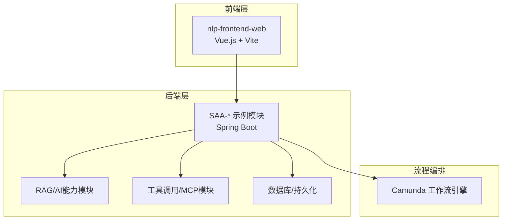

**章节来源**
- [0、项目全景图谱.md](file://0、项目全景图谱.md)
- [README.md](file://【3】工作资料/仓颉智能体/nlp-agent/README.md)

## 核心组件
- Spring Boot后端模块（SAA-*系列）
  - 覆盖Hello World、流式输出、提示词工程、结构化输出、持久化、文生图、文生语音、嵌入向量化、RAG、工具调用、本地MCP服务/客户端、外部MCP服务调用、菜单生成等场景，形成可复用的能力基座。
- Vue.js前端工程
  - 基于Vite与TypeScript，提供工程化构建、类型定义与容器化部署能力。
- Camunda工作流
  - 通过SQL脚本与定时触发器配置，支撑流程发布、任务调度与监控。

**章节来源**
- [pom.xml](file://【1】SpringAIAlibaba-atguiguV1/pom.xml)
- [package.json](file://【3】工作资料/仓颉智能体/nlp-frontend-web/package.json)
- [vite.config.ts](file://【3】工作资料/仓颉智能体/nlp-frontend-web/vite.config.ts)
- [docker-compose.yaml](file://【3】工作资料/code/云库系统/knowledge-backend-boot/docker-compose.yaml)

## 架构总览
平台采用“前端-后端-工作流”三层架构，后端以Spring Boot为核心，结合RAG、工具调用、MCP、流式输出等能力，前端通过Vue.js提供可视化编排与交互，Camunda负责流程编排与任务调度。

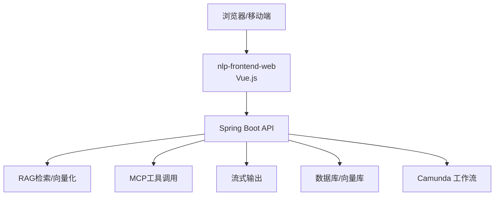

**图表来源**
- [SAA-03ChatModelChatClientApplication.java](file://【1】SpringAIAlibaba-atguiguV1/SAA-03ChatModelChatClient/src/main/java/com/atguigu/study/Saa03ChatModelChatClientApplication.java)
- [SAA-04StreamingOutputApplication.java](file://【1】SpringAIAlibaba-atguiguV1/SAA-04StreamingOutput/src/main/java/com/atguigu/study/Saa04StreamingOutputApplication.java)
- [SAA-11Embed2vectorApplication.java](file://【1】SpringAIAlibaba-atguiguV1/SAA-11Embed2vector/src/main/java/com/atguigu/study/Saa11Embed2vectorApplication.java)
- [SAA-13ToolCallingApplication.java](file://【1】SpringAIAlibaba-atguiguV1/SAA-13ToolCalling/src/main/java/com/atguigu/study/Saa13ToolCallingApplication.java)
- [SAA-16ClientCallBaiduMcpServerApplication.java](file://【1】SpringAIAlibaba-atguiguV1/SAA-16ClientCallBaiduMcpServer/src/main/java/com/atguigu/study/Saa16ClientCallBaiduMcpServerApplication.java)

## 详细组件分析

### 后端Spring Boot服务（SAA-*模块）
- 组件职责
  - 提供智能体能力的HTTP接口，包括对话、流式输出、提示词工程、结构化输出、RAG检索、工具调用、MCP集成、文生图/语音等。
  - 配置管理与环境隔离，通过application.properties进行参数化。
- 关键模块
  - Hello World：基础启动与健康检查。
  - Streaming Output：流式响应，支持实时输出。
  - Prompt/Prompt Template：提示词工程与模板化。
  - Structured Output：结构化输出，便于前端渲染。
  - Persistent：会话与消息持久化。
  - Text2Image/Text2Voice：多模态输出。
  - Embed2Vector：向量化与RAG检索。
  - Tool Calling/MCP：工具调用与外部服务集成。
  - Client Call Baidu MCP Server：远程MCP服务调用。
  - Bailian RAG：特定厂商RAG集成。
  - Today Menu：示例业务能力。
- 开发要点
  - 使用Spring Boot Starter简化依赖管理。
  - 通过application.properties集中配置模型参数、服务地址与功能开关。
  - 结合流式输出与结构化输出，满足不同前端渲染需求。

```mermaid
classDiagram
class Saa01HelloWorldApplication
class Saa03ChatModelChatClientApplication
class Saa04StreamingOutputApplication
class Saa05PromptApplication
class Saa06PromptTemplateApplication
class Saa07StructuredOutputApplication
class Saa08PersistentApplication
class Saa09Text2imageApplication
class Saa10Text2voiceApplication
class Saa11Embed2vectorApplication
class Saa12Rag4AiOpsApplication
class Saa13ToolCallingApplication
class Saa14LocalMcpServerApplication
class Saa15LocalMcpClientApplication
class Saa16ClientCallBaiduMcpServerApplication
class Saa17BailianRagApplication
class Saa18TodayMenuApplication
Saa03ChatModelChatClientApplication --> Saa04StreamingOutputApplication : "依赖流式输出"
Saa12Rag4AiOpsApplication --> Saa11Embed2vectorApplication : "依赖向量化"
Saa16ClientCallBaiduMcpServerApplication --> Saa13ToolCallingApplication : "依赖工具调用"
```

**图表来源**
- [SAA-01HelloWorldApplication.java](file://【1】SpringAIAlibaba-atguiguV1/SAA-01HelloWorld/src/main/java/com/atguigu/study/Saa01HelloWorldApplication.java)
- [SAA-03ChatModelChatClientApplication.java](file://【1】SpringAIAlibaba-atguiguV1/SAA-03ChatModelChatClient/src/main/java/com/atguigu/study/Saa03ChatModelChatClientApplication.java)
- [SAA-04StreamingOutputApplication.java](file://【1】SpringAIAlibaba-atguiguV1/SAA-04StreamingOutput/src/main/java/com/atguigu/study/Saa04StreamingOutputApplication.java)
- [SAA-11Embed2vectorApplication.java](file://【1】SpringAIAlibaba-atguiguV1/SAA-11Embed2vector/src/main/java/com/atguigu/study/Saa11Embed2vectorApplication.java)
- [SAA-13ToolCallingApplication.java](file://【1】SpringAIAlibaba-atguiguV1/SAA-13ToolCalling/src/main/java/com/atguigu/study/Saa13ToolCallingApplication.java)
- [SAA-16ClientCallBaiduMcpServerApplication.java](file://【1】SpringAIAlibaba-atguiguV1/SAA-16ClientCallBaiduMcpServer/src/main/java/com/atguigu/study/Saa16ClientCallBaiduMcpServerApplication.java)

**章节来源**
- [SAA-01HelloWorldApplication.java](file://【1】SpringAIAlibaba-atguiguV1/SAA-01HelloWorld/src/main/java/com/atguigu/study/Saa01HelloWorldApplication.java)
- [SAA-03ChatModelChatClientApplication.java](file://【1】SpringAIAlibaba-atguiguV1/SAA-03ChatModelChatClient/src/main/java/com/atguigu/study/Saa03ChatModelChatClientApplication.java)
- [SAA-04StreamingOutputApplication.java](file://【1】SpringAIAlibaba-atguiguV1/SAA-04StreamingOutput/src/main/java/com/atguigu/study/Saa04StreamingOutputApplication.java)
- [SAA-05PromptApplication.java](file://【1】SpringAIAlibaba-atguiguV1/SAA-05Prompt/src/main/java/com/atguigu/study/Saa05PromptApplication.java)
- [SAA-06PromptTemplateApplication.java](file://【1】SpringAIAlibaba-atguiguV1/SAA-06PromptTemplate/src/main/java/com/atguigu/study/Saa06PromptTemplateApplication.java)
- [SAA-07StructuredOutputApplication.java](file://【1】SpringAIAlibaba-atguiguV1/SAA-07StructuredOutput/src/main/java/com/atguigu/study/Saa07StructuredOutputApplication.java)
- [SAA-08PersistentApplication.java](file://【1】SpringAIAlibaba-atguiguV1/SAA-08Persistent/src/main/java/com/atguigu/study/Saa08PersistentApplication.java)
- [SAA-09Text2imageApplication.java](file://【1】SpringAIAlibaba-atguiguV1/SAA-09Text2image/src/main/java/com/atguigu/study/Saa09Text2imageApplication.java)
- [SAA-10Text2voiceApplication.java](file://【1】SpringAIAlibaba-atguiguV1/SAA-10Text2voice/src/main/java/com/atguigu/study/Saa10Text2voiceApplication.java)
- [SAA-11Embed2vectorApplication.java](file://【1】SpringAIAlibaba-atguiguV1/SAA-11Embed2vector/src/main/java/com/atguigu/study/Saa11Embed2vectorApplication.java)
- [SAA-12RAG4AiOpsApplication.java](file://【1】SpringAIAlibaba-atguiguV1/SAA-12RAG4AiOps/src/main/java/com/atguigu/study/Saa12Rag4AiOpsApplication.java)
- [SAA-13ToolCallingApplication.java](file://【1】SpringAIAlibaba-atguiguV1/SAA-13ToolCalling/src/main/java/com/atguigu/study/Saa13ToolCallingApplication.java)
- [SAA-14LocalMcpServerApplication.java](file://【1】SpringAIAlibaba-atguiguV1/SAA-14LocalMcpServer/src/main/java/com/atguigu/study/Saa14LocalMcpServerApplication.java)
- [SAA-15LocalMcpClientApplication.java](file://【1】SpringAIAlibaba-atguiguV1/SAA-15LocalMcpClient/src/main/java/com/atguigu/study/Saa15LocalMcpClientApplication.java)
- [SAA-16ClientCallBaiduMcpServerApplication.java](file://【1】SpringAIAlibaba-atguiguV1/SAA-16ClientCallBaiduMcpServer/src/main/java/com/atguigu/study/Saa16ClientCallBaiduMcpServerApplication.java)
- [SAA-17BailianRAGApplication.java](file://【1】SpringAIAlibaba-atguiguV1/SAA-17BailianRAG/src/main/java/com/atguigu/study/Saa17BailianRagApplication.java)
- [SAA-18TodayMenuApplication.java](file://【1】SpringAIAlibaba-atguiguV1/SAA-18TodayMenu/src/main/java/com/atguigu/study/Saa18TodayMenuApplication.java)

### 前端Vue.js界面
- 技术栈
  - Vue 3 + TypeScript + Vite，提供现代化开发体验与强类型保障。
  - 工程化配置与Dockerfile，支持本地开发与容器化部署。
- 功能范围
  - 可视化流程编排、智能体配置、对话展示与交互。
  - 与后端API对接，支持流式输出与结构化数据渲染。
- 开发流程
  - 本地开发：npm run dev
  - 构建：npm run build
  - 容器化：Dockerfile与docker-compose.yaml

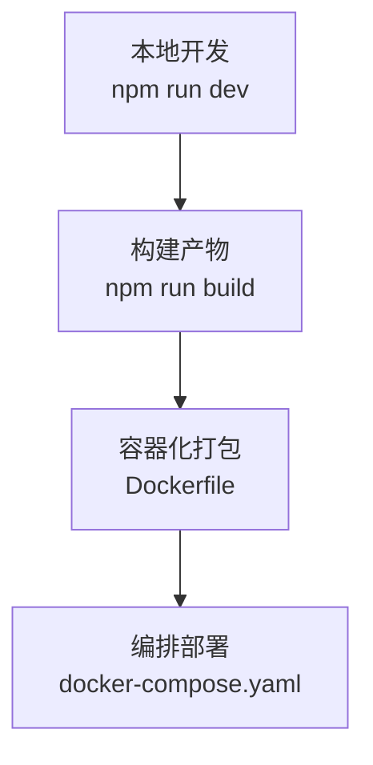

**图表来源**
- [package.json](file://【3】工作资料/仓颉智能体/nlp-frontend-web/package.json)
- [vite.config.ts](file://【3】工作资料/仓颉智能体/nlp-frontend-web/vite.config.ts)
- [Dockerfile](file://【3】工作资料/仓颉智能体/nlp-frontend-web/Dockerfile)
- [docker-compose.yaml](file://【3】工作资料/code/云库系统/knowledge-backend-boot/docker-compose.yaml)

**章节来源**
- [package.json](file://【3】工作资料/仓颉智能体/nlp-frontend-web/package.json)
- [vite.config.ts](file://【3】工作资料/仓颉智能体/nlp-frontend-web/vite.config.ts)
- [tsconfig.json](file://【3】工作资料/仓颉智能体/nlp-frontend-web/tsconfig.json)
- [Dockerfile](file://【3】工作资料/仓颉智能体/nlp-frontend-web/Dockerfile)
- [docker-compose.yaml](file://【3】工作资料/code/云库系统/knowledge-backend-boot/docker-compose.yaml)

### Camunda工作流引擎集成
- 数据与配置
  - 通过SQL脚本初始化表结构、版本升级与定时触发器配置，确保流程发布与任务调度的稳定性。
- 集成要点
  - 将流程定义与任务节点映射到后端服务，实现业务流程的自动化执行。
  - 结合前端可视化编排，完成流程的创建、发布与监控。

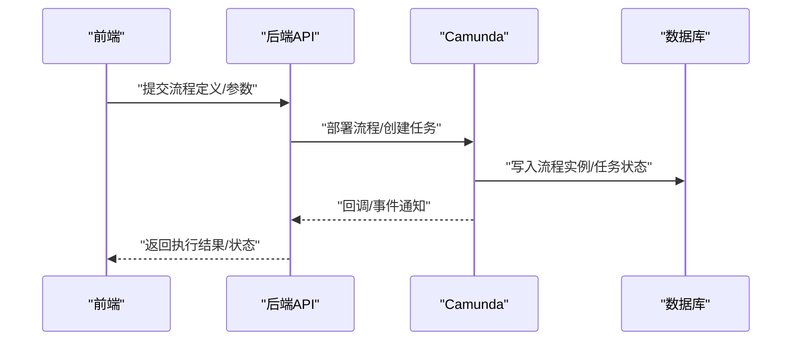

**图表来源**
- [llm.sql](file://【3】工作资料/仓颉智能体/nlp-agent/llm.sql)
- [v1.2.0.sql](file://【3】工作资料/仓颉智能体/nlp-agent/v1.2.0.sql)
- [主服务初始化.sql](file://【3】工作资料/仓颉智能体/nlp-agent/主服务初始化.sql)
- [查询定时触发器配置.sql](file://【3】工作资料/仓颉智能体/nlp-agent/查询定时触发器配置.sql)

**章节来源**
- [llm.sql](file://【3】工作资料/仓颉智能体/nlp-agent/llm.sql)
- [v1.2.0.sql](file://【3】工作资料/仓颉智能体/nlp-agent/v1.2.0.sql)
- [主服务初始化.sql](file://【3】工作资料/仓颉智能体/nlp-agent/主服务初始化.sql)
- [查询定时触发器配置.sql](file://【3】工作资料/仓颉智能体/nlp-agent/查询定时触发器配置.sql)

### 智能体应用类型与开发方法

#### 知识问答
- 核心流程
  - 用户输入 -> RAG检索 -> 结构化输出 -> 前端渲染。
- 关键实现点
  - 提示词工程与模板化，保证检索质量。
  - 结构化输出便于前端展示与二次加工。
- 参考文档
  - [1、知识问答深度分析.md](file://【3】工作资料/仓颉项目系统功能文档梳理/1、知识问答/1、知识问答深度分析.md)

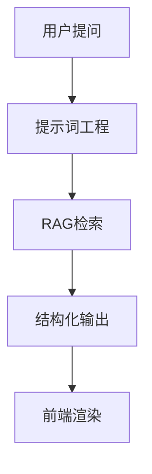

**图表来源**
- [SAA-05PromptApplication.java](file://【1】SpringAIAlibaba-atguiguV1/SAA-05Prompt/src/main/java/com/atguigu/study/Saa05PromptApplication.java)
- [SAA-06PromptTemplateApplication.java](file://【1】SpringAIAlibaba-atguiguV1/SAA-06PromptTemplate/src/main/java/com/atguigu/study/Saa06PromptTemplateApplication.java)
- [SAA-11Embed2vectorApplication.java](file://【1】SpringAIAlibaba-atguiguV1/SAA-11Embed2vector/src/main/java/com/atguigu/study/Saa11Embed2vectorApplication.java)
- [SAA-07StructuredOutputApplication.java](file://【1】SpringAIAlibaba-atguiguV1/SAA-07StructuredOutput/src/main/java/com/atguigu/study/Saa07StructuredOutputApplication.java)

**章节来源**
- [1、知识问答深度分析.md](file://【3】工作资料/仓颉项目系统功能文档梳理/1、知识问答/1、知识问答深度分析.md)

#### 智能问数
- 核心流程
  - 自然语言转结构化查询 -> 执行查询 -> 结果聚合 -> 可视化呈现。
- 关键实现点
  - 导入导出配置、流程参数配置与定时任务触发。
- 参考文档
  - [智能问数深入分析.md](file://【3】工作资料/仓颉项目系统功能文档梳理/2、智能问数/智能问数深入分析.md)

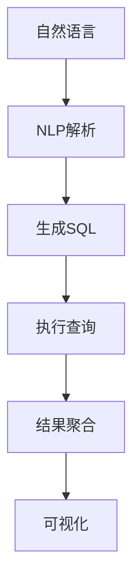

**图表来源**
- [智能问数深入分析.md](file://【3】工作资料/仓颉项目系统功能文档梳理/2、智能问数/智能问数深入分析.md)

**章节来源**
- [智能问数深入分析.md](file://【3】工作资料/仓颉项目系统功能文档梳理/2、智能问数/智能问数深入分析.md)

#### 对话流
- 核心流程
  - 输入预处理 -> 多轮对话 -> 工具调用 -> 流式输出 -> 状态持久化。
- 关键实现点
  - 流式输出与状态持久化，提升用户体验与可追溯性。
- 参考文档
  - [对话流深度分析.md](file://【3】工作资料/仓颉项目系统功能文档梳理/3、对话流/对话流深度分析.md)
  - [对话消息处理流程.md](file://【3】工作资料/仓颉项目系统功能文档梳理/10、对话消息处理流程.md)
  - [流式输出机制详解.md.md](file://【3】工作资料/仓颉项目系统功能文档梳理/12、流式输出机制详解.md.md)

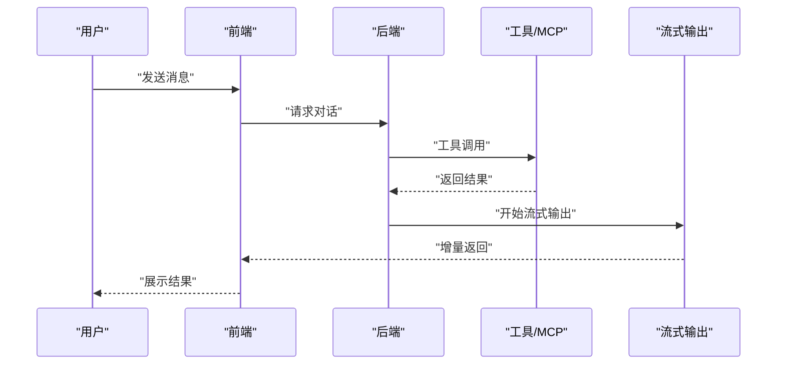

**图表来源**
- [SAA-04StreamingOutputApplication.java](file://【1】SpringAIAlibaba-atguiguV1/SAA-04StreamingOutput/src/main/java/com/atguigu/study/Saa04StreamingOutputApplication.java)
- [SAA-13ToolCallingApplication.java](file://【1】SpringAIAlibaba-atguiguV1/SAA-13ToolCalling/src/main/java/com/atguigu/study/Saa13ToolCallingApplication.java)

**章节来源**
- [对话流深度分析.md](file://【3】工作资料/仓颉项目系统功能文档梳理/3、对话流/对话流深度分析.md)
- [对话消息处理流程.md](file://【3】工作资料/仓颉项目系统功能文档梳理/10、对话消息处理流程.md)
- [流式输出机制详解.md.md](file://【3】工作资料/仓颉项目系统功能文档梳理/12、流式输出机制详解.md.md)

#### 工作流
- 核心流程
  - 流程定义 -> 发布 -> 任务调度 -> 执行 -> 监控。
- 关键实现点
  - 定时任务触发与流程状态管理。
- 参考文档
  - [工作流深度分析.md](file://【3】工作资料/仓颉项目系统功能文档梳理/4、工作流/工作流深度分析.md)

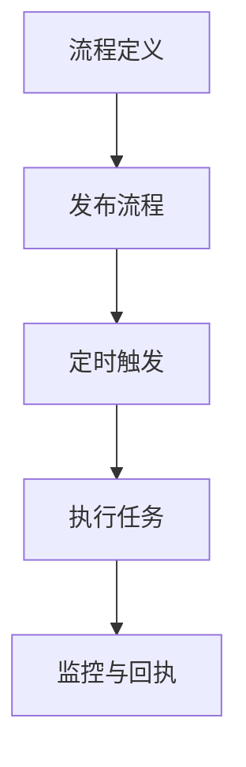

**图表来源**
- [工作流深度分析.md](file://【3】工作资料/仓颉项目系统功能文档梳理/4、工作流/工作流深度分析.md)
- [查询定时触发器配置.sql](file://【3】工作资料/仓颉智能体/nlp-agent/查询定时触发器配置.sql)

**章节来源**
- [工作流深度分析.md](file://【3】工作资料/仓颉项目系统功能文档梳理/4、工作流/工作流深度分析.md)

### API设计规范
- 统一响应结构
  - 成功/失败标识、错误码、消息与数据体，便于前端一致化处理。
- 请求参数
  - 明确必填项、可选项与默认值；对敏感参数进行脱敏或加密。
- 流式输出
  - 使用Server-Sent Events或WebSocket，支持增量返回与断线重连。
- 工具调用
  - 规范工具签名、参数校验与异常处理，确保幂等与可观测性。
- 权限与鉴权
  - 基于角色的访问控制（RBAC），接口级鉴权与审计日志。

**章节来源**
- [权限与授权机制.md](file://【3】工作资料/仓颉项目系统功能文档梳理/16、权限与授权机制.md)

## 依赖分析
- 后端模块依赖
  - Spring Boot Starter与各能力模块（RAG、MCP、流式输出等）通过POM聚合管理。
  - 前端工程通过package.json管理依赖，Vite与TypeScript提供构建与类型支持。
- 外部依赖
  - Camunda工作流引擎、数据库与向量库作为基础设施，通过docker-compose统一编排。

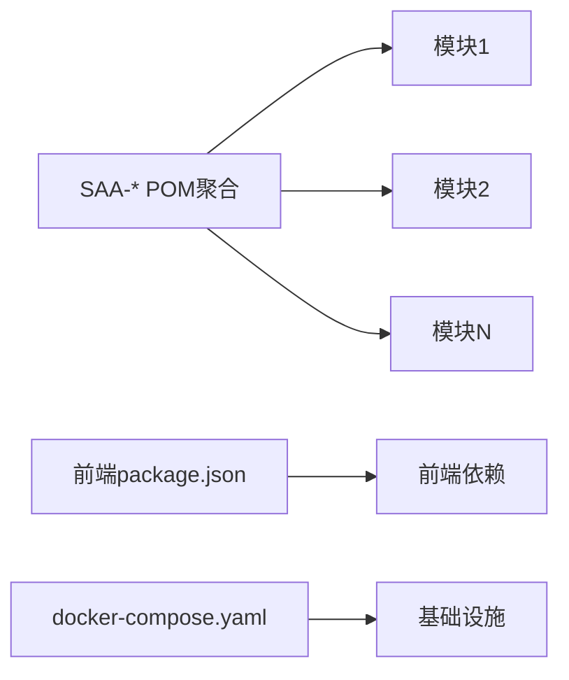

**图表来源**
- [pom.xml](file://【1】SpringAIAlibaba-atguiguV1/pom.xml)
- [package.json](file://【3】工作资料/仓颉智能体/nlp-frontend-web/package.json)
- [docker-compose.yaml](file://【3】工作资料/code/云库系统/knowledge-backend-boot/docker-compose.yaml)

**章节来源**
- [pom.xml](file://【1】SpringAIAlibaba-atguiguV1/pom.xml)
- [package.json](file://【3】工作资料/仓颉智能体/nlp-frontend-web/package.json)
- [docker-compose.yaml](file://【3】工作资料/code/云库系统/knowledge-backend-boot/docker-compose.yaml)

## 性能考虑
- 流式输出优化
  - 控制批次大小与刷新频率，避免前端渲染压力过大。
- RAG检索优化
  - 向量化索引与缓存策略，减少重复检索开销。
- 工具调用超时与重试
  - 设置合理超时与指数退避策略，防止级联阻塞。
- 并发与限流
  - 基于令牌桶或漏桶算法限制请求速率，保护下游服务。

## 故障排查指南
- 常见问题
  - 流式输出中断：检查网络波动与后端缓冲区设置。
  - RAG检索无结果：确认向量化是否成功、索引是否更新。
  - 工具调用失败：核对工具签名、鉴权与参数格式。
- 调试建议
  - 启用详细日志与链路追踪，定位瓶颈与异常。
  - 使用本地调试指南进行端到端验证。

**章节来源**
- [常见问题与解决方案.md](file://【3】工作资料/仓颉项目系统功能文档梳理/18、常见问题与解决方案.md)
- [本地调试指南.md](file://【3】工作资料/仓颉项目系统功能文档梳理/19、本地调试指南.md)

## 结论
本平台以Spring Boot为核心，结合Vue.js前端与Camunda工作流，形成覆盖知识问答、智能问数、对话流与工作流的完整智能体应用体系。通过模块化设计与标准化API，能够快速扩展新能力并稳定交付业务价值。

## 附录
- 数据模型概览
  - 核心数据表关系图可用于理解实体间关联与数据流转。

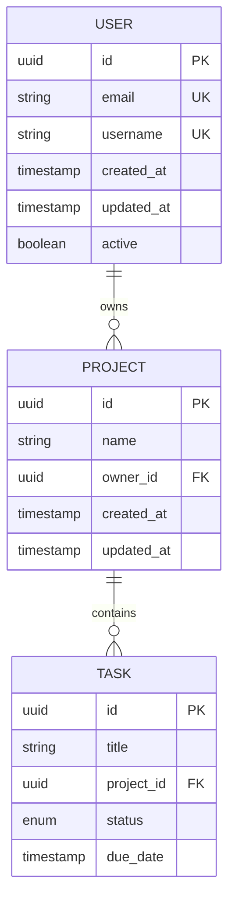

**图表来源**
- [核心数据表关系图.md](file://【3】工作资料/仓颉项目系统功能文档梳理/15、核心数据表关系图.md)

**章节来源**
- [核心数据表关系图.md](file://【3】工作资料/仓颉项目系统功能文档梳理/15、核心数据表关系图.md)