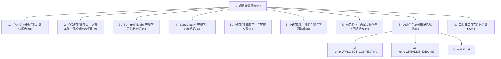
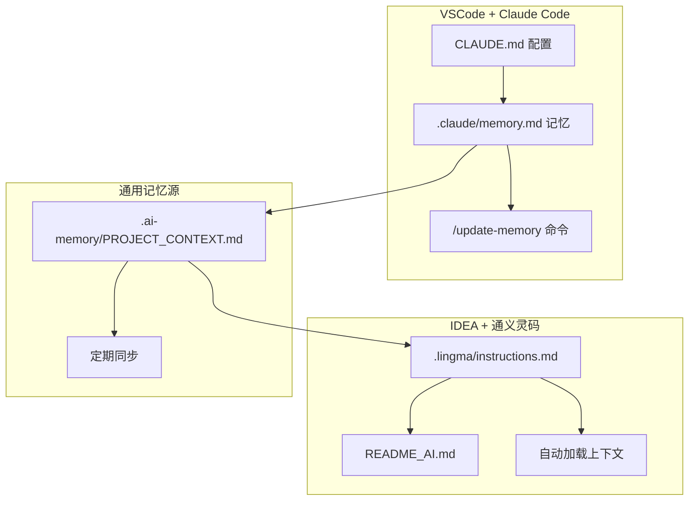
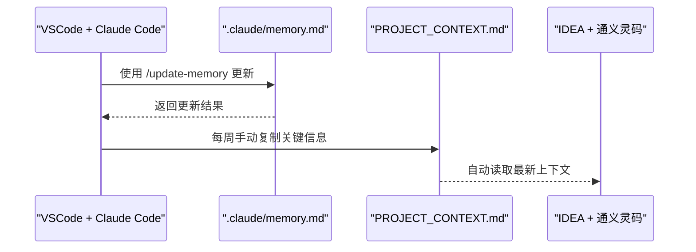
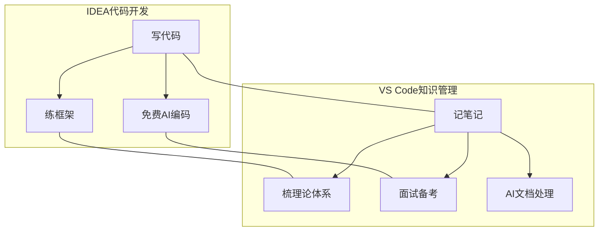
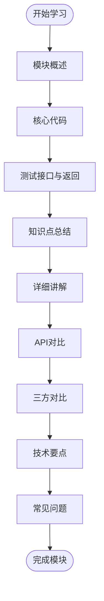
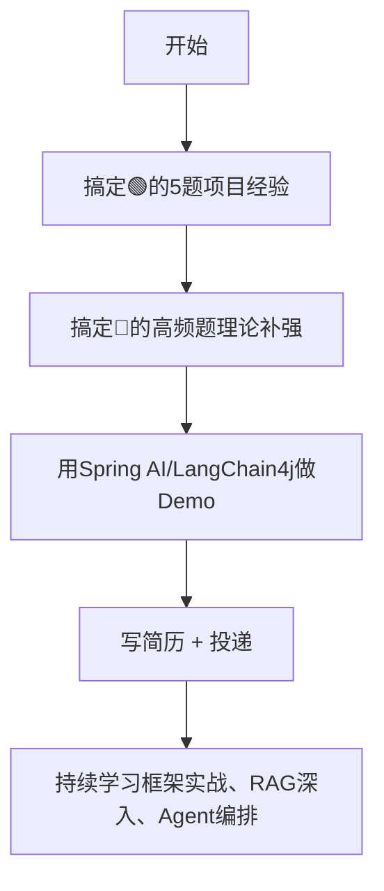
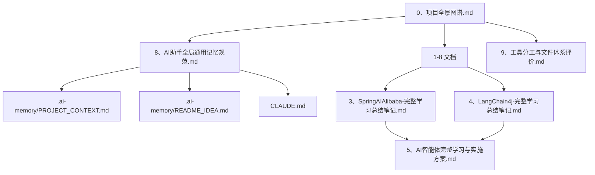

# 项目文档与规范

<cite>
**本文档引用的文件**
- [8、AI助手全局通用记忆规范.md](file://8、AI助手全局通用记忆规范.md)
- [9、工具分工与文件体系评价.md](file://9、工具分工与文件体系评价.md)
- [0、项目全景图谱.md](file://0、项目全景图谱.md)
- [CLAUDE.md](file://CLAUDE.md)
- [.ai-memory/PROJECT_CONTEXT.md](file://.ai-memory/PROJECT_CONTEXT.md)
- [.ai-memory/README_IDEA.md](file://.ai-memory/README_IDEA.md)
- [3、SpringAIAlibaba-完整学习总结笔记.md](file://3、SpringAIAlibaba-完整学习总结笔记.md)
- [4、LangChain4j-完整学习总结笔记.md](file://4、LangChain4j-完整学习总结笔记.md)
- [5、AI智能体完整学习与实施方案.md](file://5、AI智能体完整学习与实施方案.md)
- [6、AI智能体—技能全景与学习路线.md](file://6、AI智能体—技能全景与学习路线.md)
- [7、AI智能体—面试高频问题与回答框架.md](file://7、AI智能体—面试高频问题与回答框架.md)
</cite>

## 目录
1. [引言](#引言)
2. [项目结构](#项目结构)
3. [核心组件](#核心组件)
4. [架构总览](#架构总览)
5. [详细组件分析](#详细组件分析)
6. [依赖分析](#依赖分析)
7. [性能考虑](#性能考虑)
8. [故障排查指南](#故障排查指南)
9. [结论](#结论)
10. [附录](#附录)

## 引言
本文件旨在为项目文档与规范创建标准化指导，覆盖文档编写规范、版本管理策略、质量保证体系，以及AI助手通用记忆规范的制定与实施方法。通过对仓库中现有文档的系统化梳理，形成可落地的规范与流程，指导团队协作、知识传承与项目管理。

## 项目结构
项目采用“知识库 + 工程实践 + 记忆系统”的三位一体结构：
- 知识库：以“项目全景图谱”为核心入口，串联个人现状、项目经验、学习记录、面试准备与工具分工。
- 工程实践：Spring AI Alibaba 与 LangChain4j 的学习笔记，配套模块化代码与测试接口。
- 记忆系统：三层记忆架构（通用层/工具层/项目层），跨 IDE 同步，支持 VSCode + Claude Code 与 IDEA + 通义灵码。

**图表来源**
- [0、项目全景图谱.md:124-196](file://0、项目全景图谱.md#L124-L196)
- [8、AI助手全局通用记忆规范.md:15-33](file://8、AI助手全局通用记忆规范.md#L15-L33)
- [9、工具分工与文件体系评价.md:67-125](file://9、工具分工与文件体系评价.md#L67-L125)

**章节来源**
- [0、项目全景图谱.md:124-196](file://0、项目全景图谱.md#L124-L196)
- [8、AI助手全局通用记忆规范.md:15-33](file://8、AI助手全局通用记忆规范.md#L15-L33)
- [9、工具分工与文件体系评价.md:67-125](file://9、工具分工与文件体系评价.md#L67-L125)

## 核心组件
- 三层记忆架构
  - L1 通用记忆层：跨 IDE 共享，包含项目核心上下文、技术栈、学习进度与下一步行动优先级。
  - L2 工具专用层：Claude Code 的记忆与配置，支持自动加载与更新。
  - L3 项目专用层：IDEA 项目级的通义灵码自定义指令，按项目独立配置。
- 工具分工与文件体系
  - IDEA + VS Code 拆分使用，明确边界与成本控制策略。
  - 文件体系结构化、目标导向，配套资源形成证据链。
- 文档规范与质量保证
  - 学习笔记采用统一格式，强调流程图、代码说明顺序与对比分析。
  - 面试准备采用“项目对照 + 理论补充”的方法论，确保产出可落地。

**章节来源**
- [8、AI助手全局通用记忆规范.md:15-42](file://8、AI助手全局通用记忆规范.md#L15-L42)
- [9、工具分工与文件体系评价.md:17-64](file://9、工具分工与文件体系评价.md#L17-L64)
- [4、LangChain4j-完整学习总结笔记.md:34-256](file://4、LangChain4j-完整学习总结笔记.md#L34-L256)
- [7、AI智能体—面试高频问题与回答框架.md:1-15](file://7、AI智能体—面试高频问题与回答框架.md#L1-L15)

## 架构总览
跨 IDE 记忆同步架构通过三层记忆与同步机制实现：
- VSCode + Claude Code：自动加载 CLAUDE.md 配置与 .claude/memory.md，支持 /update-memory 命令。
- IDEA + 通义灵码：自动加载 .lingma/instructions.md 或 README_AI.md，亦可手动粘贴。
- 通用记忆源：.ai-memory/PROJECT_CONTEXT.md，定期同步关键信息。

**图表来源**
- [8、AI助手全局通用记忆规范.md:125-168](file://8、AI助手全局通用记忆规范.md#L125-L168)
- [.ai-memory/README_IDEA.md:19-120](file://.ai-memory/README_IDEA.md#L19-L120)
- [CLAUDE.md:9-108](file://CLAUDE.md#L9-L108)

**章节来源**
- [8、AI助手全局通用记忆规范.md:125-168](file://8、AI助手全局通用记忆规范.md#L125-L168)
- [.ai-memory/README_IDEA.md:19-120](file://.ai-memory/README_IDEA.md#L19-L120)
- [CLAUDE.md:9-108](file://CLAUDE.md#L9-L108)

## 详细组件分析

### 组件A：三层记忆架构与同步机制
- L1 通用记忆层：PROJECT_CONTEXT.md 作为所有 AI 助手的共享记忆源，包含用户背景、项目结构、技术栈、学习进度与下一步行动优先级。
- L2 工具专用层：CLAUDE.md 定义启动行为、记忆文件检查与自动加载、/update-memory 命令与更新规则。
- L3 项目专用层：.lingma/instructions.md 与 README_AI.md 提供项目级上下文，支持自动加载与手动引用。
- 同步机制：定期将 .claude/memory.md 的关键信息复制到 PROJECT_CONTEXT.md，数据库级记忆通过 create_memory 工具跨 IDE 共享。

**图表来源**
- [8、AI助手全局通用记忆规范.md:125-168](file://8、AI助手全局通用记忆规范.md#L125-L168)
- [.ai-memory/README_IDEA.md:191-211](file://.ai-memory/README_IDEA.md#L191-L211)

**章节来源**
- [8、AI助手全局通用记忆规范.md:15-42](file://8、AI助手全局通用记忆规范.md#L15-L42)
- [.ai-memory/PROJECT_CONTEXT.md:1-202](file://.ai-memory/PROJECT_CONTEXT.md#L1-L202)
- [.ai-memory/README_IDEA.md:19-120](file://.ai-memory/README_IDEA.md#L19-L120)
- [CLAUDE.md:48-108](file://CLAUDE.md#L48-L108)

### 组件B：工具分工与文件体系评价
- 工具分工：IDEA 专注代码开发，VS Code 专注知识管理与文档编辑，AI 搭配策略成本可控。
- 文件体系：总纲 + 分支的树形结构，内容定位贴合 Java 后端 + AI 应用/智能体求职目标，配套资源形成证据链。
- 评价：结构化、目标导向、可落地，具备长期价值与思维层面的务实清醒。

**图表来源**
- [9、工具分工与文件体系评价.md:47-58](file://9、工具分工与文件体系评价.md#L47-L58)

**章节来源**
- [9、工具分工与文件体系评价.md:17-64](file://9、工具分工与文件体系评价.md#L17-L64)
- [9、工具分工与文件体系评价.md:67-125](file://9、工具分工与文件体系评价.md#L67-L125)

### 组件C：学习笔记规范与质量保证
- Spring AI Alibaba 学习笔记：模块化记录 + 接口测试 + 知识点总结，强调流程图与代码说明顺序。
- LangChain4j 学习笔记：统一格式（模块概述、核心代码、测试接口、知识点总结、详细讲解、API对比、三方对比、技术要点、常见问题），确保内容完整、结构清晰、易于理解。
- 质量保证：标准化格式、流程图与代码示例、对比分析、学习优先级矩阵，形成可复用的模板。

**图表来源**
- [4、LangChain4j-完整学习总结笔记.md:34-256](file://4、LangChain4j-完整学习总结笔记.md#L34-L256)

**章节来源**
- [3、SpringAIAlibaba-完整学习总结笔记.md:9-38](file://3、SpringAIAlibaba-完整学习总结笔记.md#L9-L38)
- [4、LangChain4j-完整学习总结笔记.md:34-256](file://4、LangChain4j-完整学习总结笔记.md#L34-L256)

### 组件D：面试准备与学习实施方案
- 面试题驱动 + 项目对照：先看仓颉项目经验，再补理论，确保每一分学习都有用。
- 学习路径：按优先级推进，结合框架实战与理论深化，形成完整面试叙事。
- 评估与监控：建立检索与生成评估指标，结合 A/B 测试与用户反馈，持续优化。

**图表来源**
- [5、AI智能体完整学习与实施方案.md:102-112](file://5、AI智能体完整学习与实施方案.md#L102-L112)

**章节来源**
- [5、AI智能体完整学习与实施方案.md:41-72](file://5、AI智能体完整学习与实施方案.md#L41-L72)
- [5、AI智能体完整学习与实施方案.md:114-171](file://5、AI智能体完整学习与实施方案.md#L114-L171)
- [7、AI智能体—面试高频问题与回答框架.md:1-15](file://7、AI智能体—面试高频问题与回答框架.md#L1-L15)

## 依赖分析
- 文档间依赖：0、项目全景图谱.md 作为总纲，串联 1-8 文档；8、AI助手全局通用记忆规范.md 与 .ai-memory 下文件共同构成记忆系统；9、工具分工与文件体系评价.md 为工具选型与文件体系提供决策依据。
- 工具依赖：VSCode + Claude Code 与 IDEA + 通义灵码分别依赖各自的配置文件与记忆文件。
- 学习依赖：3、SpringAIAlibaba-完整学习总结笔记.md 与 4、LangChain4j-完整学习总结笔记.md 为 5、AI智能体完整学习与实施方案.md 提供理论基础。

**图表来源**
- [0、项目全景图谱.md:214-235](file://0、项目全景图谱.md#L214-L235)
- [8、AI助手全局通用记忆规范.md:15-33](file://8、AI助手全局通用记忆规范.md#L15-L33)
- [9、工具分工与文件体系评价.md:67-125](file://9、工具分工与文件体系评价.md#L67-L125)

**章节来源**
- [0、项目全景图谱.md:214-235](file://0、项目全景图谱.md#L214-L235)
- [8、AI助手全局通用记忆规范.md:15-33](file://8、AI助手全局通用记忆规范.md#L15-L33)
- [9、工具分工与文件体系评价.md:67-125](file://9、工具分工与文件体系评价.md#L67-L125)

## 性能考虑
- 工具选择的成本控制：免费 AI 覆盖日常，付费 AI 仅用于复杂任务，精准控制 Token 成本。
- VS Code 侧：安装 Markdown 插件、开启全局搜索，提升检索效率。
- 记忆系统：定期同步 PROJECT_CONTEXT.md，避免重复说明背景，提升对话效率。
- 学习笔记：统一格式与流程图，减少理解成本，提升学习效率。

**章节来源**
- [9、工具分工与文件体系评价.md:140-154](file://9、工具分工与文件体系评价.md#L140-L154)
- [8、AI助手全局通用记忆规范.md:162-168](file://8、AI助手全局通用记忆规范.md#L162-L168)

## 故障排查指南
- 通义灵码未自动读取 .lingma/instructions.md：检查文件格式、版本、缓存与备用方案（quick_start.txt）。
- 记忆文件过多难以管理：精简信息、分类存储、定期清理与索引机制。
- VSCode 与 IDEA 记忆不同步：使用 PROJECT_CONTEXT.md 定期同步、create_memory 工具跨 IDE 共享、建立更新习惯。

**章节来源**
- [8、AI助手全局通用记忆规范.md:246-272](file://8、AI助手全局通用记忆规范.md#L246-L272)
- [.ai-memory/README_IDEA.md:246-273](file://.ai-memory/README_IDEA.md#L246-L273)

## 结论
本项目通过标准化的文档规范、版本管理策略与质量保证体系，结合三层记忆架构与工具分工，形成了可落地、可复用、可持续的知识库模板。建议团队在现有基础上持续优化文档格式、强化检索与自动化处理能力，并将记忆系统与学习实施方案深度融合，以支撑求职与技术复盘的长期价值。

## 附录
- 版本管理建议：为关键文档维护版本号与修订记录，使用语义化命名与目录结构，确保可追溯性。
- 质量控制流程：建立文档评审机制、学习笔记模板校验与面试题对照表更新流程。
- 知识传承机制：定期回顾与更新 PROJECT_CONTEXT.md，组织团队分享与复盘，沉淀最佳实践。