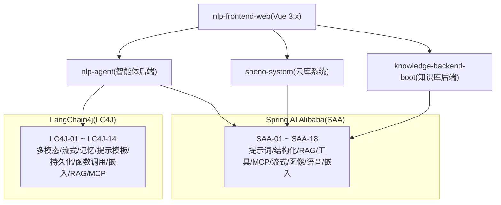
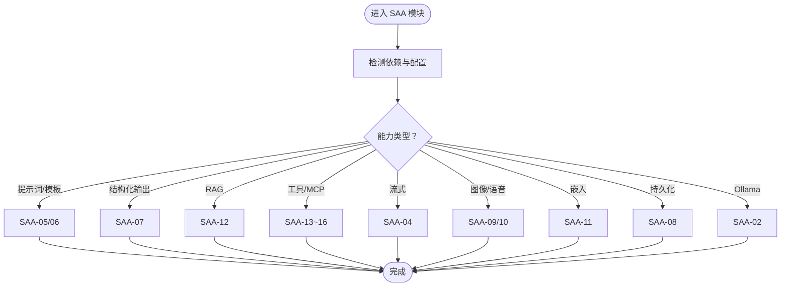
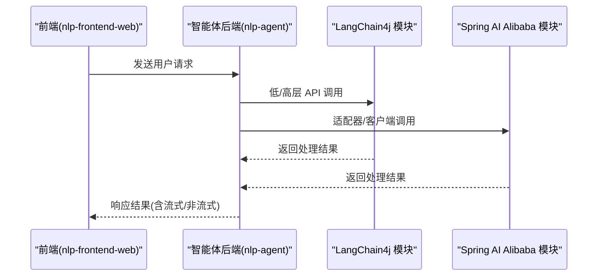
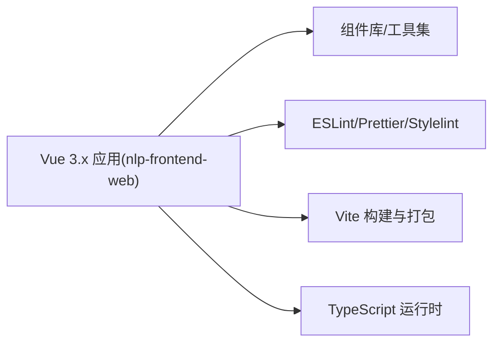
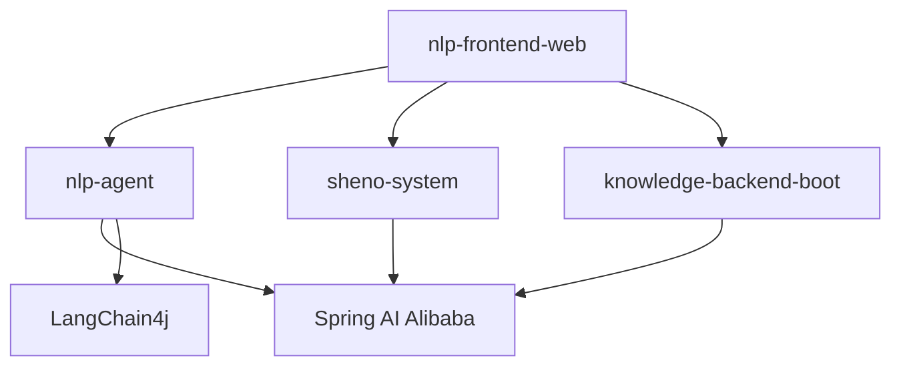

# 技术栈概览

<cite>
**本文引用的文件**
- [SAA-01HelloWorld/pom.xml](file://【1】SpringAIAlibaba-atguiguV1/SAA-01HelloWorld/pom.xml)
- [SAA-02Ollama/pom.xml](file://【1】SpringAIAlibaba-atguiguV1/SAA-02Ollama/pom.xml)
- [SAA-03ChatModelChatClient/pom.xml](file://【1】SpringAIAlibaba-atguiguV1/SAA-03ChatModelChatClient/pom.xml)
- [SAA-04StreamingOutput/pom.xml](file://【1】SpringAIAlibaba-atguiguV1/SAA-04StreamingOutput/pom.xml)
- [SAA-05Prompt/pom.xml](file://【1】SpringAIAlibaba-atguiguV1/SAA-05Prompt/pom.xml)
- [SAA-06PromptTemplate/pom.xml](file://【1】SpringAIAlibaba-atguiguV1/SAA-06PromptTemplate/pom.xml)
- [SAA-07StructuredOutput/pom.xml](file://【1】SpringAIAlibaba-atguiguV1/SAA-07StructuredOutput/pom.xml)
- [SAA-08Persistent/pom.xml](file://【1】SpringAIAlibaba-atguiguV1/SAA-08Persistent/pom.xml)
- [SAA-09Text2image/pom.xml](file://【1】SpringAIAlibaba-atguiguV1/SAA-09Text2image/pom.xml)
- [SAA-10Text2voice/pom.xml](file://【1】SpringAIAlibaba-atguiguV1/SAA-10Text2voice/pom.xml)
- [SAA-11Embed2vector/pom.xml](file://【1】SpringAIAlibaba-atguiguV1/SAA-11Embed2vector/pom.xml)
- [SAA-12RAG4AiOps/pom.xml](file://【1】SpringAIAlibaba-atguiguV1/SAA-12RAG4AiOps/pom.xml)
- [SAA-13ToolCalling/pom.xml](file://【1】SpringAIAlibaba-atguiguV1/SAA-13ToolCalling/pom.xml)
- [SAA-14LocalMcpServer/pom.xml](file://【1】SpringAIAlibaba-atguiguV1/SAA-14LocalMcpServer/pom.xml)
- [SAA-15LocalMcpClient/pom.xml](file://【1】SpringAIAlibaba-atguiguV1/SAA-15LocalMcpClient/pom.xml)
- [SAA-16ClientCallBaiduMcpServer/pom.xml](file://【1】SpringAIAlibaba-atguiguV1/SAA-16ClientCallBaiduMcpServer/pom.xml)
- [SAA-17BailianRAG/pom.xml](file://【1】SpringAIAlibaba-atguiguV1/SAA-17BailianRAG/pom.xml)
- [SAA-18TodayMenu/pom.xml](file://【1】SpringAIAlibaba-atguiguV1/SAA-18TodayMenu/pom.xml)
- [langchain4j-01helloworld/pom.xml](file://【2】langchain4j-atguiguV5/langchain4j-01helloworld/pom.xml)
- [langchain4j-02multi-model-together/pom.xml](file://【2】langchain4j-atguiguV5/langchain4j-02multi-model-together/pom.xml)
- [langchain4j-03boot-integration/pom.xml](file://【2】langchain4j-atguiguV5/langchain4j-03boot-integration/pom.xml)
- [langchain4j-04low-high-api/pom.xml](file://【2】langchain4j-atguiguV5/langchain4j-04low-high-api/pom.xml)
- [langchain4j-05model-parameters/pom.xml](file://【2】langchain4j-atguiguV5/langchain4j-05model-parameters/pom.xml)
- [langchain4j-06chat-image/pom.xml](file://【2】langchain4j-atguiguV5/langchain4j-06chat-image/pom.xml)
- [langchain4j-07chat-stream/pom.xml](file://【2】langchain4j-atguiguV5/langchain4j-07chat-stream/pom.xml)
- [langchain4j-08chat-memory/pom.xml](file://【2】langchain4j-atguiguV5/langchain4j-08chat-memory/pom.xml)
- [langchain4j-09chat-prompt/pom.xml](file://【2】langchain4j-atguiguV5/langchain4j-09chat-prompt/pom.xml)
- [langchain4j-10chat-persistence/pom.xml](file://【2】langchain4j-atguiguV5/langchain4j-10chat-persistence/pom.xml)
- [langchain4j-11chat-functioncalling/pom.xml](file://【2】langchain4j-atguiguV5/langchain4j-11chat-functioncalling/pom.xml)
- [langchain4j-12chat-embedding/pom.xml](file://【2】langchain4j-atguiguV5/langchain4j-12chat-embedding/pom.xml)
- [langchain4j-13chat-rag01/pom.xml](file://【2】langchain4j-atguiguV5/langchain4j-13chat-rag01/pom.xml)
- [langchain4j-14chat-mcp/pom.xml](file://【2】langchain4j-atguiguV5/langchain4j-14chat-mcp/pom.xml)
- [nlp-frontend-web/package.json](file://【3】工作资料/code/仓颉智能体/nlp-frontend-web/package.json)
- [nlp-agent/pom.xml](file://【3】工作资料/code/仓颉智能体/nlp-agent/pom.xml)
- [sheno-system/pom.xml](file://【3】工作资料/code/云库系统/sheno-system/pom.xml)
- [knowledge-backend-boot/pom.xml](file://【3】工作资料/code/云库系统/knowledge-backend-boot/pom.xml)
</cite>

## 目录
1. [引言](#引言)
2. [项目结构](#项目结构)
3. [核心组件](#核心组件)
4. [架构总览](#架构总览)
5. [详细组件分析](#详细组件分析)
6. [依赖分析](#依赖分析)
7. [性能考量](#性能考量)
8. [故障排查指南](#故障排查指南)
9. [结论](#结论)
10. [附录](#附录)

## 引言
本技术栈概览面向 AiCode 项目，系统梳理后端与前端技术组合、AI 框架集成方案、数据库与缓存策略，并给出版本兼容性、性能与扩展性建议。重点覆盖：
- 后端技术栈：Java 8、Spring Boot、Spring AI Alibaba、LangChain4j、Camunda BPMN（在相关模块中体现）
- 前端技术栈：Vue.js 3.x（通过工作资料中的 nlp-frontend-web 项目体现）
- AI 框架集成：Spring AI Alibaba 与 LangChain4j 的多场景实践（提示词工程、结构化输出、RAG、工具调用、流式输出、图像/语音生成、嵌入向量化等）
- 数据与缓存：结合“仓颉智能体”与“云库系统”的模块化设计，说明后端模块划分与依赖关系
- 版本兼容与演进：基于 Maven POM 中的依赖坐标与版本范围，给出兼容性与升级建议

## 项目结构
AiCode 仓库由三大板块构成：
- Spring AI Alibaba 教学与实战模块（SAA-xx 系列），覆盖从基础到高级的 AI 集成场景
- LangChain4j 教学与实战模块（langchain4j-xx 系列），覆盖多模态、流式、记忆、RAG、函数调用、MCP 等能力
- 工作资料中的“仓颉智能体”与“云库系统”，体现真实业务系统的前后端分离与模块化组织

**图表来源**
- [SAA-01HelloWorld/pom.xml](file://【1】SpringAIAlibaba-atguiguV1/SAA-01HelloWorld/pom.xml)
- [langchain4j-01helloworld/pom.xml](file://【2】langchain4j-atguiguV5/langchain4j-01helloworld/pom.xml)
- [nlp-frontend-web/package.json](file://【3】工作资料/code/仓颉智能体/nlp-frontend-web/package.json)
- [nlp-agent/pom.xml](file://【3】工作资料/code/仓颉智能体/nlp-agent/pom.xml)
- [sheno-system/pom.xml](file://【3】工作资料/code/云库系统/sheno-system/pom.xml)
- [knowledge-backend-boot/pom.xml](file://【3】工作资料/code/云库系统/knowledge-backend-boot/pom.xml)

**章节来源**
- [SAA-01HelloWorld/pom.xml](file://【1】SpringAIAlibaba-atguiguV1/SAA-01HelloWorld/pom.xml)
- [langchain4j-01helloworld/pom.xml](file://【2】langchain4j-atguiguV5/langchain4j-01helloworld/pom.xml)
- [nlp-frontend-web/package.json](file://【3】工作资料/code/仓颉智能体/nlp-frontend-web/package.json)
- [nlp-agent/pom.xml](file://【3】工作资料/code/仓颉智能体/nlp-agent/pom.xml)
- [sheno-system/pom.xml](file://【3】工作资料/code/云库系统/sheno-system/pom.xml)
- [knowledge-backend-boot/pom.xml](file://【3】工作资料/code/云库系统/knowledge-backend-boot/pom.xml)

## 核心组件
- 后端框架与运行时
  - Java 8：作为统一编译与运行时环境，确保与 Spring Boot 2.x 生态兼容
  - Spring Boot：提供自动装配、Web MVC、Actuator、测试支撑等
  - Camunda BPMN：在部分模块中用于流程编排与工作流集成（见“详细组件分析”）
- AI 框架与能力矩阵
  - Spring AI Alibaba：覆盖提示词工程、结构化输出、RAG、工具调用、流式输出、图像/语音生成、嵌入向量化等
  - LangChain4j：覆盖多模态、流式输出、记忆、提示词模板、持久化、函数调用、嵌入、RAG、MCP 等
- 前端技术栈
  - Vue.js 3.x：通过 nlp-frontend-web 体现，采用现代构建工具链与 TypeScript 支持
- 数据与缓存
  - 以“仓颉智能体”与“云库系统”为代表的模块化后端，体现清晰的分层与依赖管理

**章节来源**
- [SAA-01HelloWorld/pom.xml](file://【1】SpringAIAlibaba-atguiguV1/SAA-01HelloWorld/pom.xml)
- [SAA-02Ollama/pom.xml](file://【1】SpringAIAlibaba-atguiguV1/SAA-02Ollama/pom.xml)
- [SAA-03ChatModelChatClient/pom.xml](file://【1】SpringAIAlibaba-atguiguV1/SAA-03ChatModelChatClient/pom.xml)
- [SAA-04StreamingOutput/pom.xml](file://【1】SpringAIAlibaba-atguiguV1/SAA-04StreamingOutput/pom.xml)
- [SAA-05Prompt/pom.xml](file://【1】SpringAIAlibaba-atguiguV1/SAA-05Prompt/pom.xml)
- [SAA-06PromptTemplate/pom.xml](file://【1】SpringAIAlibaba-atguiguV1/SAA-06PromptTemplate/pom.xml)
- [SAA-07StructuredOutput/pom.xml](file://【1】SpringAIAlibaba-atguiguV1/SAA-07StructuredOutput/pom.xml)
- [SAA-08Persistent/pom.xml](file://【1】SpringAIAlibaba-atguiguV1/SAA-08Persistent/pom.xml)
- [SAA-09Text2image/pom.xml](file://【1】SpringAIAlibaba-atguiguV1/SAA-09Text2image/pom.xml)
- [SAA-10Text2voice/pom.xml](file://【1】SpringAIAlibaba-atguiguV1/SAA-10Text2voice/pom.xml)
- [SAA-11Embed2vector/pom.xml](file://【1】SpringAIAlibaba-atguiguV1/SAA-11Embed2vector/pom.xml)
- [SAA-12RAG4AiOps/pom.xml](file://【1】SpringAIAlibaba-atguiguV1/SAA-12RAG4AiOps/pom.xml)
- [SAA-13ToolCalling/pom.xml](file://【1】SpringAIAlibaba-atguiguV1/SAA-13ToolCalling/pom.xml)
- [SAA-14LocalMcpServer/pom.xml](file://【1】SpringAIAlibaba-atguiguV1/SAA-14LocalMcpServer/pom.xml)
- [SAA-15LocalMcpClient/pom.xml](file://【1】SpringAIAlibaba-atguiguV1/SAA-15LocalMcpClient/pom.xml)
- [SAA-16ClientCallBaiduMcpServer/pom.xml](file://【1】SpringAIAlibaba-atguiguV1/SAA-16ClientCallBaiduMcpServer/pom.xml)
- [SAA-17BailianRAG/pom.xml](file://【1】SpringAIAlibaba-atguiguV1/SAA-17BailianRAG/pom.xml)
- [SAA-18TodayMenu/pom.xml](file://【1】SpringAIAlibaba-atguiguV1/SAA-18TodayMenu/pom.xml)
- [langchain4j-01helloworld/pom.xml](file://【2】langchain4j-atguiguV5/langchain4j-01helloworld/pom.xml)
- [langchain4j-02multi-model-together/pom.xml](file://【2】langchain4j-atguiguV5/langchain4j-02multi-model-together/pom.xml)
- [langchain4j-03boot-integration/pom.xml](file://【2】langchain4j-atguiguV5/langchain4j-03boot-integration/pom.xml)
- [langchain4j-04low-high-api/pom.xml](file://【2】langchain4j-atguiguV5/langchain4j-04low-high-api/pom.xml)
- [langchain4j-05model-parameters/pom.xml](file://【2】langchain4j-atguiguV5/langchain4j-05model-parameters/pom.xml)
- [langchain4j-06chat-image/pom.xml](file://【2】langchain4j-atguiguV5/langchain4j-06chat-image/pom.xml)
- [langchain4j-07chat-stream/pom.xml](file://【2】langchain4j-atguiguV5/langchain4j-07chat-stream/pom.xml)
- [langchain4j-08chat-memory/pom.xml](file://【2】langchain4j-atguiguV5/langchain4j-08chat-memory/pom.xml)
- [langchain4j-09chat-prompt/pom.xml](file://【2】langchain4j-atguiguV5/langchain4j-09chat-prompt/pom.xml)
- [langchain4j-10chat-persistence/pom.xml](file://【2】langchain4j-atguiguV5/langchain4j-10chat-persistence/pom.xml)
- [langchain4j-11chat-functioncalling/pom.xml](file://【2】langchain4j-atguiguV5/langchain4j-11chat-functioncalling/pom.xml)
- [langchain4j-12chat-embedding/pom.xml](file://【2】langchain4j-atguiguV5/langchain4j-12chat-embedding/pom.xml)
- [langchain4j-13chat-rag01/pom.xml](file://【2】langchain4j-atguiguV5/langchain4j-13chat-rag01/pom.xml)
- [langchain4j-14chat-mcp/pom.xml](file://【2】langchain4j-atguiguV5/langchain4j-14chat-mcp/pom.xml)
- [nlp-frontend-web/package.json](file://【3】工作资料/code/仓颉智能体/nlp-frontend-web/package.json)
- [nlp-agent/pom.xml](file://【3】工作资料/code/仓颉智能体/nlp-agent/pom.xml)
- [sheno-system/pom.xml](file://【3】工作资料/code/云库系统/sheno-system/pom.xml)
- [knowledge-backend-boot/pom.xml](file://【3】工作资料/code/云库系统/knowledge-backend-boot/pom.xml)

## 架构总览
AiCode 的整体技术栈围绕“后端（Spring Boot + AI 框架）+ 前端（Vue 3.x）+ 模块化业务系统（仓颉智能体/云库系统）”展开。AI 能力通过 Spring AI Alibaba 与 LangChain4j 在不同模块中落地，形成从提示词工程到 RAG、工具调用、流式输出的全链路闭环。

**图表来源**
- [SAA-01HelloWorld/pom.xml](file://【1】SpringAIAlibaba-atguiguV1/SAA-01HelloWorld/pom.xml)
- [langchain4j-01helloworld/pom.xml](file://【2】langchain4j-atguiguV5/langchain4j-01helloworld/pom.xml)
- [nlp-frontend-web/package.json](file://【3】工作资料/code/仓颉智能体/nlp-frontend-web/package.json)
- [nlp-agent/pom.xml](file://【3】工作资料/code/仓颉智能体/nlp-agent/pom.xml)
- [sheno-system/pom.xml](file://【3】工作资料/code/云库系统/sheno-system/pom.xml)
- [knowledge-backend-boot/pom.xml](file://【3】工作资料/code/云库系统/knowledge-backend-boot/pom.xml)

## 详细组件分析

### Spring AI Alibaba 组件分析
- 核心能力与模块映射
  - 提示词工程与模板：SAA-05、SAA-06
  - 结构化输出：SAA-07
  - RAG 与运维场景：SAA-12
  - 工具调用与 MCP：SAA-13、SAA-14、SAA-15、SAA-16
  - 流式输出：SAA-04
  - 图像/语音生成：SAA-09、SAA-10
  - 嵌入向量化：SAA-11
  - 持久化与上下文：SAA-08
  - Ollama 集成：SAA-02
  - 聊天客户端与模型适配：SAA-03
  - 今日菜单示例：SAA-18
- 选择原因与优势
  - 与 Spring Boot 生态无缝集成，简化依赖与配置
  - 丰富的适配器与客户端抽象，便于切换不同推理服务
  - 面向企业级的工具调用与 MCP 协议支持，便于扩展外部能力
- 适用场景
  - 快速搭建提示词工程、结构化输出、RAG、工具调用与流式对话
  - 与本地或云端推理服务（如 Ollama、百炼等）对接

**图表来源**
- [SAA-01HelloWorld/pom.xml](file://【1】SpringAIAlibaba-atguiguV1/SAA-01HelloWorld/pom.xml)
- [SAA-02Ollama/pom.xml](file://【1】SpringAIAlibaba-atguiguV1/SAA-02Ollama/pom.xml)
- [SAA-03ChatModelChatClient/pom.xml](file://【1】SpringAIAlibaba-atguiguV1/SAA-03ChatModelChatClient/pom.xml)
- [SAA-04StreamingOutput/pom.xml](file://【1】SpringAIAlibaba-atguiguV1/SAA-04StreamingOutput/pom.xml)
- [SAA-05Prompt/pom.xml](file://【1】SpringAIAlibaba-atguiguV1/SAA-05Prompt/pom.xml)
- [SAA-06PromptTemplate/pom.xml](file://【1】SpringAIAlibaba-atguiguV1/SAA-06PromptTemplate/pom.xml)
- [SAA-07StructuredOutput/pom.xml](file://【1】SpringAIAlibaba-atguiguV1/SAA-07StructuredOutput/pom.xml)
- [SAA-08Persistent/pom.xml](file://【1】SpringAIAlibaba-atguiguV1/SAA-08Persistent/pom.xml)
- [SAA-09Text2image/pom.xml](file://【1】SpringAIAlibaba-atguiguV1/SAA-09Text2image/pom.xml)
- [SAA-10Text2voice/pom.xml](file://【1】SpringAIAlibaba-atguiguV1/SAA-10Text2voice/pom.xml)
- [SAA-11Embed2vector/pom.xml](file://【1】SpringAIAlibaba-atguiguV1/SAA-11Embed2vector/pom.xml)
- [SAA-12RAG4AiOps/pom.xml](file://【1】SpringAIAlibaba-atguiguV1/SAA-12RAG4AiOps/pom.xml)
- [SAA-13ToolCalling/pom.xml](file://【1】SpringAIAlibaba-atguiguV1/SAA-13ToolCalling/pom.xml)
- [SAA-14LocalMcpServer/pom.xml](file://【1】SpringAIAlibaba-atguiguV1/SAA-14LocalMcpServer/pom.xml)
- [SAA-15LocalMcpClient/pom.xml](file://【1】SpringAIAlibaba-atguiguV1/SAA-15LocalMcpClient/pom.xml)
- [SAA-16ClientCallBaiduMcpServer/pom.xml](file://【1】SpringAIAlibaba-atguiguV1/SAA-16ClientCallBaiduMcpServer/pom.xml)
- [SAA-17BailianRAG/pom.xml](file://【1】SpringAIAlibaba-atguiguV1/SAA-17BailianRAG/pom.xml)
- [SAA-18TodayMenu/pom.xml](file://【1】SpringAIAlibaba-atguiguV1/SAA-18TodayMenu/pom.xml)

**章节来源**
- [SAA-01HelloWorld/pom.xml](file://【1】SpringAIAlibaba-atguiguV1/SAA-01HelloWorld/pom.xml)
- [SAA-02Ollama/pom.xml](file://【1】SpringAIAlibaba-atguiguV1/SAA-02Ollama/pom.xml)
- [SAA-03ChatModelChatClient/pom.xml](file://【1】SpringAIAlibaba-atguiguV1/SAA-03ChatModelChatClient/pom.xml)
- [SAA-04StreamingOutput/pom.xml](file://【1】SpringAIAlibaba-atguiguV1/SAA-04StreamingOutput/pom.xml)
- [SAA-05Prompt/pom.xml](file://【1】SpringAIAlibaba-atguiguV1/SAA-05Prompt/pom.xml)
- [SAA-06PromptTemplate/pom.xml](file://【1】SpringAIAlibaba-atguiguV1/SAA-06PromptTemplate/pom.xml)
- [SAA-07StructuredOutput/pom.xml](file://【1】SpringAIAlibaba-atguiguV1/SAA-07StructuredOutput/pom.xml)
- [SAA-08Persistent/pom.xml](file://【1】SpringAIAlibaba-atguiguV1/SAA-08Persistent/pom.xml)
- [SAA-09Text2image/pom.xml](file://【1】SpringAIAlibaba-atguiguV1/SAA-09Text2image/pom.xml)
- [SAA-10Text2voice/pom.xml](file://【1】SpringAIAlibaba-atguiguV1/SAA-10Text2voice/pom.xml)
- [SAA-11Embed2vector/pom.xml](file://【1】SpringAIAlibaba-atguiguV1/SAA-11Embed2vector/pom.xml)
- [SAA-12RAG4AiOps/pom.xml](file://【1】SpringAIAlibaba-atguiguV1/SAA-12RAG4AiOps/pom.xml)
- [SAA-13ToolCalling/pom.xml](file://【1】SpringAIAlibaba-atguiguV1/SAA-13ToolCalling/pom.xml)
- [SAA-14LocalMcpServer/pom.xml](file://【1】SpringAIAlibaba-atguiguV1/SAA-14LocalMcpServer/pom.xml)
- [SAA-15LocalMcpClient/pom.xml](file://【1】SpringAIAlibaba-atguiguV1/SAA-15LocalMcpClient/pom.xml)
- [SAA-16ClientCallBaiduMcpServer/pom.xml](file://【1】SpringAIAlibaba-atguiguV1/SAA-16ClientCallBaiduMcpServer/pom.xml)
- [SAA-17BailianRAG/pom.xml](file://【1】SpringAIAlibaba-atguiguV1/SAA-17BailianRAG/pom.xml)
- [SAA-18TodayMenu/pom.xml](file://【1】SpringAIAlibaba-atguiguV1/SAA-18TodayMenu/pom.xml)

### LangChain4j 组件分析
- 能力矩阵与模块映射
  - 多模态与模型参数：LC4J-02、LC4J-05
  - Spring Boot 集成：LC4J-03
  - 低/高层 API：LC4J-04
  - 聊天与图像：LC4J-06
  - 流式输出：LC4J-07
  - 记忆与提示模板：LC4J-08、LC4J-09
  - 持久化与函数调用：LC4J-10、LC4J-11
  - 嵌入与 RAG：LC4J-12、LC4J-13
  - MCP：LC4J-14
- 选择原因与优势
  - 以 Java 生态原生实现，适合与 Spring Boot 深度集成
  - 提供从低层 API 到高层 DSL 的灵活选择，满足不同复杂度需求
  - 强大的函数调用与 MCP 支持，便于构建可扩展的智能体平台
- 适用场景
  - 需要更细粒度控制的 AI 应用开发
  - 与现有 Java 微服务生态融合的场景

**图表来源**
- [langchain4j-01helloworld/pom.xml](file://【2】langchain4j-atguiguV5/langchain4j-01helloworld/pom.xml)
- [langchain4j-02multi-model-together/pom.xml](file://【2】langchain4j-atguiguV5/langchain4j-02multi-model-together/pom.xml)
- [langchain4j-03boot-integration/pom.xml](file://【2】langchain4j-atguiguV5/langchain4j-03boot-integration/pom.xml)
- [langchain4j-04low-high-api/pom.xml](file://【2】langchain4j-atguiguV5/langchain4j-04low-high-api/pom.xml)
- [langchain4j-05model-parameters/pom.xml](file://【2】langchain4j-atguiguV5/langchain4j-05model-parameters/pom.xml)
- [langchain4j-06chat-image/pom.xml](file://【2】langchain4j-atguiguV5/langchain4j-06chat-image/pom.xml)
- [langchain4j-07chat-stream/pom.xml](file://【2】langchain4j-atguiguV5/langchain4j-07chat-stream/pom.xml)
- [langchain4j-08chat-memory/pom.xml](file://【2】langchain4j-atguiguV5/langchain4j-08chat-memory/pom.xml)
- [langchain4j-09chat-prompt/pom.xml](file://【2】langchain4j-atguiguV5/langchain4j-09chat-prompt/pom.xml)
- [langchain4j-10chat-persistence/pom.xml](file://【2】langchain4j-atguiguV5/langchain4j-10chat-persistence/pom.xml)
- [langchain4j-11chat-functioncalling/pom.xml](file://【2】langchain4j-atguiguV5/langchain4j-11chat-functioncalling/pom.xml)
- [langchain4j-12chat-embedding/pom.xml](file://【2】langchain4j-atguiguV5/langchain4j-12chat-embedding/pom.xml)
- [langchain4j-13chat-rag01/pom.xml](file://【2】langchain4j-atguiguV5/langchain4j-13chat-rag01/pom.xml)
- [langchain4j-14chat-mcp/pom.xml](file://【2】langchain4j-atguiguV5/langchain4j-14chat-mcp/pom.xml)
- [nlp-frontend-web/package.json](file://【3】工作资料/code/仓颉智能体/nlp-frontend-web/package.json)
- [nlp-agent/pom.xml](file://【3】工作资料/code/仓颉智能体/nlp-agent/pom.xml)

**章节来源**
- [langchain4j-01helloworld/pom.xml](file://【2】langchain4j-atguiguV5/langchain4j-01helloworld/pom.xml)
- [langchain4j-02multi-model-together/pom.xml](file://【2】langchain4j-atguiguV5/langchain4j-02multi-model-together/pom.xml)
- [langchain4j-03boot-integration/pom.xml](file://【2】langchain4j-atguiguV5/langchain4j-03boot-integration/pom.xml)
- [langchain4j-04low-high-api/pom.xml](file://【2】langchain4j-atguiguV5/langchain4j-04low-high-api/pom.xml)
- [langchain4j-05model-parameters/pom.xml](file://【2】langchain4j-atguiguV5/langchain4j-05model-parameters/pom.xml)
- [langchain4j-06chat-image/pom.xml](file://【2】langchain4j-atguiguV5/langchain4j-06chat-image/pom.xml)
- [langchain4j-07chat-stream/pom.xml](file://【2】langchain4j-atguiguV5/langchain4j-07chat-stream/pom.xml)
- [langchain4j-08chat-memory/pom.xml](file://【2】langchain4j-atguiguV5/langchain4j-08chat-memory/pom.xml)
- [langchain4j-09chat-prompt/pom.xml](file://【2】langchain4j-atguiguV5/langchain4j-09chat-prompt/pom.xml)
- [langchain4j-10chat-persistence/pom.xml](file://【2】langchain4j-atguiguV5/langchain4j-10chat-persistence/pom.xml)
- [langchain4j-11chat-functioncalling/pom.xml](file://【2】langchain4j-atguiguV5/langchain4j-11chat-functioncalling/pom.xml)
- [langchain4j-12chat-embedding/pom.xml](file://【2】langchain4j-atguiguV5/langchain4j-12chat-embedding/pom.xml)
- [langchain4j-13chat-rag01/pom.xml](file://【2】langchain4j-atguiguV5/langchain4j-13chat-rag01/pom.xml)
- [langchain4j-14chat-mcp/pom.xml](file://【2】langchain4j-atguiguV5/langchain4j-14chat-mcp/pom.xml)
- [nlp-frontend-web/package.json](file://【3】工作资料/code/仓颉智能体/nlp-frontend-web/package.json)
- [nlp-agent/pom.xml](file://【3】工作资料/code/仓颉智能体/nlp-agent/pom.xml)

### 前端技术栈分析（Vue.js 3.x）
- 技术选型与特性
  - Vue 3.x：Composition API、TypeScript 友好、响应式系统优化
  - 现代构建工具链：Vite、ESLint、Prettier、Stylelint 等
  - 组件化与模块化：通过内部框架与工具集提升开发效率
- 适用场景
  - 交互密集型智能体前端界面、可视化配置与运营看板
  - 与后端智能体/工作流模块进行联调与演示

**图表来源**
- [nlp-frontend-web/package.json](file://【3】工作资料/code/仓颉智能体/nlp-frontend-web/package.json)

**章节来源**
- [nlp-frontend-web/package.json](file://【3】工作资料/code/仓颉智能体/nlp-frontend-web/package.json)

### 数据库与缓存策略
- 模块化后端组织
  - nlp-agent：智能体相关后端模块，包含构建器、公共模块、插件、系统与工作线程等
  - sheno-system：云库系统后端，包含基础、通用、依赖聚合、模块与 SQL 脚本
  - knowledge-backend-boot：知识库后端启动模块
- 数据与缓存建议
  - 建议采用分层缓存（本地缓存 + Redis）降低对大模型与检索系统的压力
  - 对对话历史、工具调用结果与检索片段进行结构化持久化，配合索引优化查询性能
  - 对高频配置与规则进行集中化管理，避免硬编码

**章节来源**
- [nlp-agent/pom.xml](file://【3】工作资料/code/仓颉智能体/nlp-agent/pom.xml)
- [sheno-system/pom.xml](file://【3】工作资料/code/云库系统/sheno-system/pom.xml)
- [knowledge-backend-boot/pom.xml](file://【3】工作资料/code/云库系统/knowledge-backend-boot/pom.xml)

## 依赖分析
- Spring AI Alibaba 与 LangChain4j 的协同
  - 在同一项目中可并行使用两种框架，依据场景选择：SAA 更偏向 Spring Boot 生态与适配器抽象；LC4J 更偏向原生 Java 控制与函数调用/MCP
  - 两者均可与前端 nlp-frontend-web 配合，提供统一的智能体交互体验
- 模块间耦合与内聚
  - nlp-agent 与 sheno-system/knowledge-backend-boot 通过 API 与数据契约解耦
  - 前端通过标准 HTTP 接口与后端交互，便于替换与扩展

**图表来源**
- [SAA-01HelloWorld/pom.xml](file://【1】SpringAIAlibaba-atguiguV1/SAA-01HelloWorld/pom.xml)
- [langchain4j-01helloworld/pom.xml](file://【2】langchain4j-atguiguV5/langchain4j-01helloworld/pom.xml)
- [nlp-frontend-web/package.json](file://【3】工作资料/code/仓颉智能体/nlp-frontend-web/package.json)
- [nlp-agent/pom.xml](file://【3】工作资料/code/仓颉智能体/nlp-agent/pom.xml)
- [sheno-system/pom.xml](file://【3】工作资料/code/云库系统/sheno-system/pom.xml)
- [knowledge-backend-boot/pom.xml](file://【3】工作资料/code/云库系统/knowledge-backend-boot/pom.xml)

**章节来源**
- [SAA-01HelloWorld/pom.xml](file://【1】SpringAIAlibaba-atguiguV1/SAA-01HelloWorld/pom.xml)
- [langchain4j-01helloworld/pom.xml](file://【2】langchain4j-atguiguV5/langchain4j-01helloworld/pom.xml)
- [nlp-frontend-web/package.json](file://【3】工作资料/code/仓颉智能体/nlp-frontend-web/package.json)
- [nlp-agent/pom.xml](file://【3】工作资料/code/仓颉智能体/nlp-agent/pom.xml)
- [sheno-system/pom.xml](file://【3】工作资料/code/云库系统/sheno-system/pom.xml)
- [knowledge-backend-boot/pom.xml](file://【3】工作资料/code/云库系统/knowledge-backend-boot/pom.xml)

## 性能考量
- 传输与渲染
  - 流式输出（SAA-04、LC4J-07）可显著改善用户体验，需注意缓冲区大小与背压处理
- 计算与存储
  - RAG 与嵌入向量化（SAA-11、LC4J-12、13）对内存与磁盘 IO 有较高要求，建议引入向量数据库与索引优化
- 并发与稳定性
  - 工具调用与 MCP（SAA-13、14、15、16、LC4J-14）可能涉及外部服务，需设置超时与熔断策略
- 缓存与降级
  - 对热点提示词、常用工具结果与检索片段进行缓存，必要时提供降级策略

## 故障排查指南
- 常见问题定位
  - 依赖冲突：检查 SAA 与 LC4J 模块的依赖坐标与版本范围，避免重复或冲突
  - 流式输出异常：确认后端流式接口与前端 SSE/WebSocket 的连通性与缓冲区配置
  - 工具调用失败：核对 MCP 服务器地址、鉴权与超时设置
- 日志与监控
  - 建议开启 Actuator 与链路追踪，定位慢调用与错误堆栈
- 升级与回滚
  - 采用灰度发布与版本回滚策略，确保升级过程可逆

**章节来源**
- [SAA-01HelloWorld/pom.xml](file://【1】SpringAIAlibaba-atguiguV1/SAA-01HelloWorld/pom.xml)
- [SAA-04StreamingOutput/pom.xml](file://【1】SpringAIAlibaba-atguiguV1/SAA-04StreamingOutput/pom.xml)
- [SAA-13ToolCalling/pom.xml](file://【1】SpringAIAlibaba-atguiguV1/SAA-13ToolCalling/pom.xml)
- [SAA-14LocalMcpServer/pom.xml](file://【1】SpringAIAlibaba-atguiguV1/SAA-14LocalMcpServer/pom.xml)
- [SAA-15LocalMcpClient/pom.xml](file://【1】SpringAIAlibaba-atguiguV1/SAA-15LocalMcpClient/pom.xml)
- [SAA-16ClientCallBaiduMcpServer/pom.xml](file://【1】SpringAIAlibaba-atguiguV1/SAA-16ClientCallBaiduMcpServer/pom.xml)
- [langchain4j-07chat-stream/pom.xml](file://【2】langchain4j-atguiguV5/langchain4j-07chat-stream/pom.xml)
- [langchain4j-14chat-mcp/pom.xml](file://【2】langchain4j-atguiguV5/langchain4j-14chat-mcp/pom.xml)

## 结论
AiCode 的技术栈以 Spring AI Alibaba 与 LangChain4j 为核心，结合 Vue.js 3.x 前端与模块化的业务系统，形成了从提示词工程到 RAG、工具调用与流式输出的完整能力闭环。通过合理的依赖管理、缓存与性能优化策略，可在保证扩展性的同时满足企业级应用的需求。

## 附录
- 版本兼容性要点
  - Java 8 与 Spring Boot 2.x 生态兼容良好，建议在升级时评估第三方依赖的 Java 版本要求
  - Spring AI Alibaba 与 LangChain4j 的版本需与 Spring Boot 版本匹配，避免自动装配冲突
- 扩展性设计
  - 将 AI 能力抽象为可插拔模块，便于替换推理服务与适配器
  - 通过 MCP 与函数调用机制扩展外部能力，保持后端无侵入