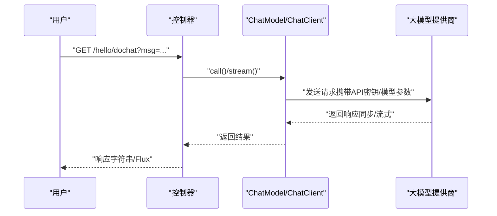
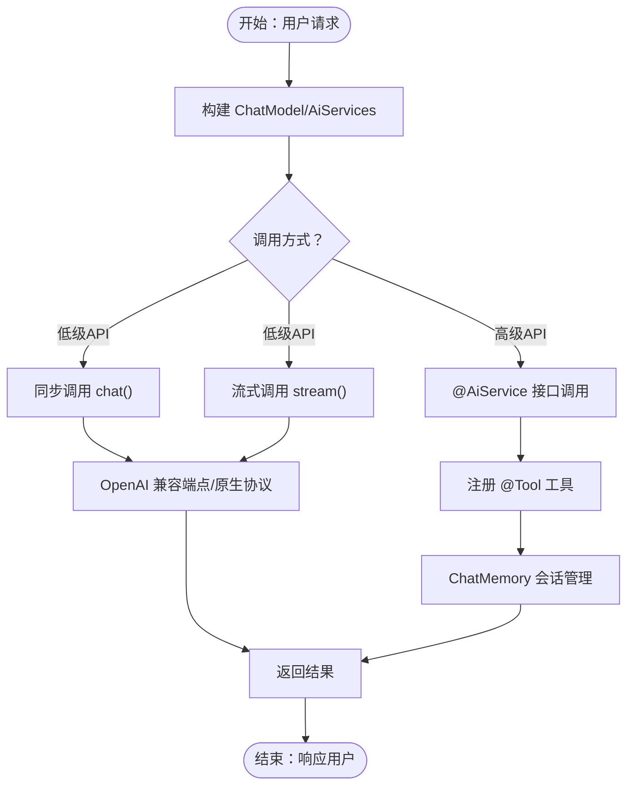
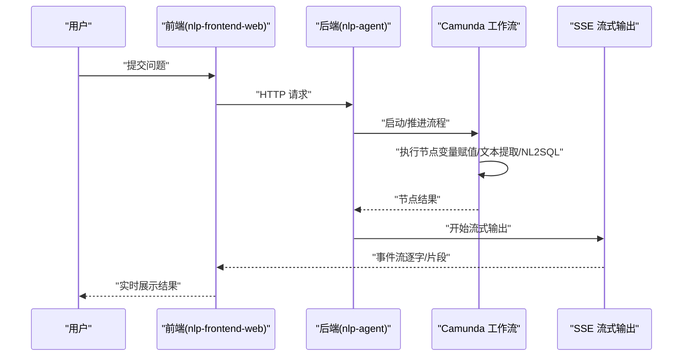

# 整体架构设计

<cite>
**本文引用的文件**
- [0、项目全景图谱.md](file://0、项目全景图谱.md)
- [3、SpringAIAlibaba-完整学习总结笔记.md](file://3、SpringAIAlibaba-完整学习总结笔记.md)
- [4、LangChain4j-完整学习总结笔记.md](file://4、LangChain4j-完整学习总结笔记.md)
- [【1】SpringAIAlibaba-atguiguV1\pom.xml](file://【1】SpringAIAlibaba-atguiguV1\pom.xml)
- [【2】langchain4j-atguiguV5\pom.xml](file://【2】langchain4j-atguiguV5\pom.xml)
- [【1】SpringAIAlibaba-atguiguV1\SAA-01HelloWorld\src\main\resources\application.properties](file://【1】SpringAIAlibaba-atguiguV1\SAA-01HelloWorld\src\main\resources\application.properties)
- [【2】langchain4j-atguiguV5\langchain4j-01helloworld\src\main\resources\application.properties](file://【2】langchain4j-atguiguV5\langchain4j-01helloworld\src\main\resources\application.properties)
- [【1】SpringAIAlibaba-atguiguV1\SAA-01HelloWorld\src\main\java\com\atguigu\study\Saa01HelloWorldApplication.java](file://【1】SpringAIAlibaba-atguiguV1\SAA-01HelloWorld\src\main\java\com\atguigu\study\Saa01HelloWorldApplication.java)
- [【2】langchain4j-atguiguV5\langchain4j-01helloworld\src\main\java\com\atguigu\study\HelloLangChain4JApp.java](file://【2】langchain4j-atguiguV5\langchain4j-01helloworld\src\main\java\com\atguigu\study\HelloLangChain4JApp.java)
</cite>

## 目录
1. [引言](#引言)
2. [项目结构](#项目结构)
3. [核心组件](#核心组件)
4. [架构总览](#架构总览)
5. [详细组件分析](#详细组件分析)
6. [依赖分析](#依赖分析)
7. [性能考虑](#性能考虑)
8. [故障排查指南](#故障排查指南)
9. [结论](#结论)
10. [附录](#附录)

## 引言
本架构设计文档面向AiCode项目，系统化阐述项目整体架构理念、设计原则与核心组件关系，重点覆盖：
- Spring AI Alibaba模块化架构与各Demo模块的职责边界与数据流
- LangChain4j框架集成架构与从低级API到高级API的演进路径
- 智能体平台微服务架构的设计思路与扩展点
- 各架构层次之间的职责划分、数据流向与交互模式
- 系统边界定义、模块划分原则、接口设计规范与扩展点设计
- 架构决策的技术考量、权衡分析与约束条件
- 架构演进路线图、性能优化策略与可扩展性设计
- 为系统设计者提供架构参考，为开发者提供实现指导

## 项目结构
AiCode仓库包含三大主线：
- 教学级Spring AI Alibaba模块化Demo（18个子模块，覆盖HelloWorld到综合案例）
- 教学级LangChain4j模块化Demo（12个子模块，覆盖HelloWorld到Embedding）
- 仓颉智能体平台（nlp-agent）微服务架构与前端工程，体现真实生产经验

```mermaid
graph TB
A["AiCode 项目根目录"] --> B["Spring AI Alibaba 教学模块<br/>18个子模块"]
A --> C["LangChain4j 教学模块<br/>12个子模块"]
A --> D["仓颉智能体平台<br/>nlp-agent 微服务 + 前端"]
B --> B1["SAA-01HelloWorld"]
B --> B2["SAA-02Ollama"]
B --> B3["SAA-03ChatModelChatClient"]
B --> B4["SAA-04StreamingOutput"]
B --> B5["SAA-05Prompt"]
B --> B6["SAA-06PromptTemplate"]
B --> B7["SAA-07StructuredOutput"]
B --> B8["SAA-08Persistent"]
B --> B9["SAA-09Text2image"]
B --> B10["SAA-10Text2voice"]
B --> B11["SAA-11Embed2vector"]
B --> B12["SAA-12RAG4AiOps"]
B --> B13["SAA-13ToolCalling"]
B --> B14["SAA-14LocalMcpServer"]
B --> B15["SAA-15LocalMcpClient"]
B --> B16["SAA-16ClientCallBaiduMcpServer"]
B --> B17["SAA-17BailianRAG"]
B --> B18["SAA-18TodayMenu"]
C --> C1["langchain4j-01helloworld"]
C --> C2["langchain4j-02multi-model-together"]
C --> C3["langchain4j-03boot-integration"]
C --> C4["langchain4j-04low-high-api"]
C --> C5["langchain4j-05model-parameters"]
C --> C6["langchain4j-06chat-image"]
C --> C7["langchain4j-07chat-stream"]
C --> C8["langchain4j-08chat-memory"]
C --> C9["langchain4j-09chat-prompt"]
C --> C10["langchain4j-10chat-persistence"]
C --> C11["langchain4j-11chat-functioncalling"]
C --> C12["langchain4j-12chat-embedding"]
C --> C13["langchain4j-13chat-rag01"]
C --> C14["langchain4j-14chat-mcp"]
```

**图表来源**
- [【1】SpringAIAlibaba-atguiguV1\pom.xml:13-31](file://【1】SpringAIAlibaba-atguiguV1\pom.xml#L13-L31)
- [【2】langchain4j-atguiguV5\pom.xml:13-28](file://【2】langchain4j-atguiguV5\pom.xml#L13-L28)

**章节来源**
- [0、项目全景图谱.md:124-196](file://0、项目全景图谱.md#L124-L196)

## 核心组件
- Spring AI Alibaba模块化架构
  - 以Spring Boot为运行载体，通过配置文件与自动配置实现模型提供商解耦（OpenAI兼容/阿里云DashScope原生）
  - Demo模块覆盖ChatModel/ChatClient、流式输出、Prompt模板、结构化输出、持久化、文生图/音、向量化、RAG、工具调用、MCP等能力
  - 通过多模块并行运行（不同端口）验证多模型共存、流式输出与工具链集成

- LangChain4j框架集成架构
  - 低级API（OpenAiChatModel/ChatModel）：直接调用，适合快速原型与简单问答
  - 高级API（AiServices、@Tool、ChatMemory、@P等）：声明式服务、工具调用、对话记忆、Prompt模板等，适合企业级复杂业务
  - 兼容模式：通过OpenAI兼容端点调用阿里云DashScope，降低厂商锁定

- 智能体平台微服务架构（仓颉项目）
  - 基于Camunda BPMN工作流，结合SSE流式输出、节点间变量传递、NL2SQL接口对接
  - 后端nlp-agent微服务与前端nlp-frontend-web协同，形成完整的智能体平台闭环

**章节来源**
- [3、SpringAIAlibaba-完整学习总结笔记.md:1-32](file://3、SpringAIAlibaba-完整学习总结笔记.md#L1-L32)
- [4、LangChain4j-完整学习总结笔记.md:1-32](file://4、LangChain4j-完整学习总结笔记.md#L1-L32)
- [0、项目全景图谱.md:27-61](file://0、项目全景图谱.md#L27-L61)

## 架构总览
AiCode的整体架构由“教学模块 + 生产经验”两条主线构成，二者互补：
- 教学模块提供“可运行、可对比”的能力验证与迁移路径
- 生产经验提供“真实场景、工程化落地”的参考范式

```mermaid
graph TB
subgraph "Spring AI Alibaba 教学模块"
SA1["SAA-01HelloWorld"]
SA2["SAA-02Ollama"]
SA3["SAA-03ChatModelChatClient"]
SA4["SAA-04StreamingOutput"]
SA5["SAA-05Prompt"]
SA6["SAA-06PromptTemplate"]
SA7["SAA-07StructuredOutput"]
SA8["SAA-08Persistent"]
SA9["SAA-09Text2image"]
SA10["SAA-10Text2voice"]
SA11["SAA-11Embed2vector"]
SA12["SAA-12RAG4AiOps"]
SA13["SAA-13ToolCalling"]
SA14["SAA-14LocalMcpServer"]
SA15["SAA-15LocalMcpClient"]
SA16["SAA-16ClientCallBaiduMcpServer"]
SA17["SAA-17BailianRAG"]
SA18["SAA-18TodayMenu"]
end
subgraph "LangChain4j 教学模块"
LC1["langchain4j-01helloworld"]
LC2["langchain4j-02multi-model-together"]
LC3["langchain4j-03boot-integration"]
LC4["langchain4j-04low-high-api"]
LC5["langchain4j-05model-parameters"]
LC6["langchain4j-06chat-image"]
LC7["langchain4j-07chat-stream"]
LC8["langchain4j-08chat-memory"]
LC9["langchain4j-09chat-prompt"]
LC10["langchain4j-10chat-persistence"]
LC11["langchain4j-11chat-functioncalling"]
LC12["langchain4j-12chat-embedding"]
LC13["langchain4j-13chat-rag01"]
LC14["langchain4j-14chat-mcp"]
end
subgraph "智能体平台生产经验"
AG["nlp-agent 微服务"]
FE["nlp-frontend-web 前端"]
WF["Camunda BPMN 工作流"]
SSE["SSE 流式输出"]
NL2SQL["NL2SQL 接口对接"]
end
SA1 --> LC1
SA18 --> LC13
AG --> SSE
AG --> WF
AG --> NL2SQL
FE --> AG
```

**图表来源**
- [【1】SpringAIAlibaba-atguiguV1\pom.xml:13-31](file://【1】SpringAIAlibaba-atguiguV1\pom.xml#L13-L31)
- [【2】langchain4j-atguiguV5\pom.xml:13-28](file://【2】langchain4j-atguiguV5\pom.xml#L13-L28)
- [0、项目全景图谱.md:27-61](file://0、项目全景图谱.md#L27-L61)

## 详细组件分析

### Spring AI Alibaba 模块化架构
- 模块化设计原则
  - 单一职责：每个模块聚焦一个能力点（如流式输出、Prompt模板、工具调用等）
  - 可插拔：通过配置文件切换模型提供商与参数，便于横向对比
  - 可扩展：新增模块不影响既有模块，便于持续演进

- 关键模块与职责
  - SAA-01HelloWorld：基础对话调用，验证ChatModel/ChatClient
  - SAA-04StreamingOutput：流式输出与多模型共存
  - SAA-05Prompt/SAA-06PromptTemplate：提示词与模板工程化
  - SAA-07StructuredOutput：结构化输出，便于下游解析
  - SAA-08Persistent：对话记忆与持久化
  - SAA-11Embed2vector：向量化能力
  - SAA-12RAG4AiOps：RAG检索增强生成
  - SAA-13ToolCalling：工具调用
  - SAA-14/15/16：本地与远程MCP服务集成
  - SAA-17BailianRAG：百炼平台RAG
  - SAA-18TodayMenu：综合案例

- 数据流与交互模式
  - 控制器接收请求 → 依赖注入ChatModel/ChatClient → 调用模型 → 返回结果
  - 流式输出通过Flux实现逐字返回，支持多模型并存
  - Prompt模板通过占位符替换与System/User消息组合，形成可复用的提示词工程

**图表来源**
- [3、SpringAIAlibaba-完整学习总结笔记.md:42-132](file://3、SpringAIAlibaba-完整学习总结笔记.md#L42-L132)

**章节来源**
- [3、SpringAIAlibaba-完整学习总结笔记.md:42-311](file://3、SpringAIAlibaba-完整学习总结笔记.md#L42-L311)

### LangChain4j 框架集成架构
- 低级API（OpenAiChatModel/ChatModel）
  - 适合快速原型与简单问答，直接调用模型，返回字符串
  - 通过OpenAI兼容端点调用阿里云DashScope，降低厂商锁定

- 高级API（AiServices/@Tool/@P/ChatMemory等）
  - 声明式服务：通过接口定义服务契约，框架自动绑定模型与工具
  - 工具调用：@Tool注解定义工具，支持多工具注册与调度
  - 对话记忆：ChatMemory管理会话上下文，支持多轮对话
  - Prompt模板：@P注解与PromptTemplate实现提示词工程化

- 兼容模式与原生协议
  - 兼容模式：通过OpenAI兼容端点调用阿里云DashScope，便于多模型切换
  - 原生协议：Spring AI Alibaba直接调用DashScope原生协议，性能更优

**图表来源**
- [4、LangChain4j-完整学习总结笔记.md:260-500](file://4、LangChain4j-完整学习总结笔记.md#L260-L500)

**章节来源**
- [4、LangChain4j-完整学习总结笔记.md:260-727](file://4、LangChain4j-完整学习总结笔记.md#L260-L727)

### 智能体平台微服务架构（仓颉项目）
- 系统边界与模块划分
  - nlp-agent：后端微服务，负责工作流编排、SSE流式输出、节点间变量传递、NL2SQL对接
  - nlp-frontend-web：前端工程，负责用户交互与消息展示
  - Camunda：工作流引擎，支撑自定义节点开发与流程编排

- 数据流与交互模式
  - 用户输入 → 前端 → 后端控制器 → Camunda工作流 → 节点执行（文本提取/变量赋值/NL2SQL等） → SSE流式返回 → 前端展示
  - 对话流维护：会话管理与消息存储，支持流式输出与下游节点冲突处理

**图表来源**
- [0、项目全景图谱.md:27-61](file://0、项目全景图谱.md#L27-L61)

**章节来源**
- [0、项目全景图谱.md:27-61](file://0、项目全景图谱.md#L27-L61)

## 依赖分析
- Spring AI Alibaba 父工程
  - 通过BOM统一管理Spring Boot、Spring AI、Spring AI Alibaba版本，确保依赖一致性
  - 模块化组织18个子模块，便于按需运行与对比

- LangChain4j 父工程
  - 通过BOM统一管理Spring Boot、Spring AI、Spring AI Alibaba、LangChain4j及其社区依赖
  - 模块化组织12个子模块，覆盖从HelloWorld到Embedding的完整学习路径

**图表来源**
- [【1】SpringAIAlibaba-atguiguV1\pom.xml:13-31](file://【1】SpringAIAlibaba-atguiguV1\pom.xml#L13-L31)
- [【2】langchain4j-atguiguV5\pom.xml:13-28](file://【2】langchain4j-atguiguV5\pom.xml#L13-L28)

**章节来源**
- [【1】SpringAIAlibaba-atguiguV1\pom.xml:38-79](file://【1】SpringAIAlibaba-atguiguV1\pom.xml#L38-L79)
- [【2】langchain4j-atguiguV5\pom.xml:53-98](file://【2】langchain4j-atguiguV5\pom.xml#L53-L98)

## 性能考虑
- 流式输出与用户体验
  - 通过Flux实现逐字返回，显著改善用户等待体验，尤其适用于长文本生成
  - 多模型共存时，需关注延迟差异（如DeepSeek较快、Qwen较慢但内容更丰富）

- 模型切换与兼容性
  - 兼容模式通过OpenAI兼容端点调用阿里云DashScope，便于多模型切换与横向对比
  - 原生协议（Spring AI Alibaba）可获得更优性能，但需权衡厂商锁定风险

- 工程化优化建议
  - 对话记忆与持久化：合理设置缓存与落库策略，平衡实时性与一致性
  - 工具调用：异步化工具执行，避免阻塞主流程
  - SSE流式输出：注意背压与异常恢复，保证实时性与稳定性

[本节为通用性能讨论，无需具体文件分析]

## 故障排查指南
- 配置问题
  - API密钥与模型参数：确认application.properties中的密钥与模型配置正确
  - 编码问题：确保UTF-8编码配置，避免中文乱码

- 模块运行问题
  - 端口冲突：18个Spring AI Alibaba模块与12个LangChain4j模块分别占用不同端口，避免冲突
  - 依赖缺失：确保父POM正确引入BOM，避免版本不一致导致的运行时异常

- 生产经验问题
  - SSE流式输出：关注下游节点冲突与缓冲区溢出
  - Camunda自定义节点：检查变量传递与节点状态，确保流程稳定

**章节来源**
- [【1】SpringAIAlibaba-atguiguV1\SAA-01HelloWorld\src\main\resources\application.properties:1-20](file://【1】SpringAIAlibaba-atguiguV1\SAA-01HelloWorld\src\main\resources\application.properties#L1-L20)
- [【2】langchain4j-atguiguV5\langchain4j-01helloworld\src\main\resources\application.properties:1-3](file://【2】langchain4j-atguiguV5\langchain4j-01helloworld\src\main\resources\application.properties#L1-L3)
- [0、项目全景图谱.md:27-61](file://0、项目全景图谱.md#L27-L61)

## 结论
AiCode项目通过“教学模块 + 生产经验”的双轨架构，既提供了可运行、可对比的能力验证路径，又展示了真实智能体平台的工程化落地范式。Spring AI Alibaba与LangChain4j两大框架在模块化、兼容性与可扩展性方面各有侧重，结合使用可在不同阶段满足多样化需求。智能体平台微服务架构则体现了工作流编排、流式输出与工具链集成的工程实践。

[本节为总结性内容，无需具体文件分析]

## 附录
- 应用入口与配置
  - Spring AI Alibaba：SAA-01HelloWorld应用入口与基础配置
  - LangChain4j：langchain4j-01helloworld应用入口与基础配置

**章节来源**
- [【1】SpringAIAlibaba-atguiguV1\SAA-01HelloWorld\src\main\java\com\atguigu\study\Saa01HelloWorldApplication.java:1-16](file://【1】SpringAIAlibaba-atguiguV1\SAA-01HelloWorld\src\main\java\com\atguigu\study\Saa01HelloWorldApplication.java#L1-L16)
- [【2】langchain4j-atguiguV5\langchain4j-01helloworld\src\main\java\com\atguigu\study\HelloLangChain4JApp.java:1-19](file://【2】langchain4j-atguiguV5\langchain4j-01helloworld\src\main\java\com\atguigu\study\HelloLangChain4JApp.java#L1-L19)