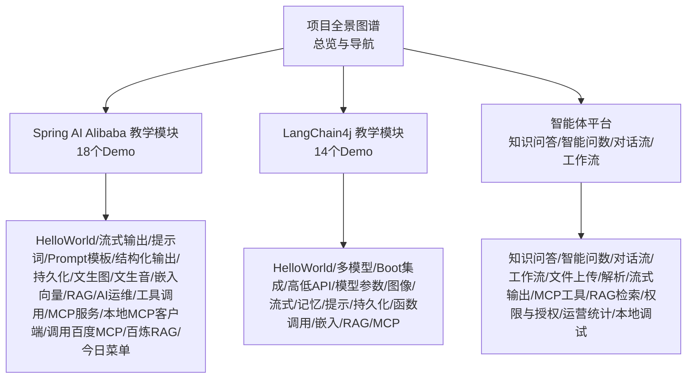
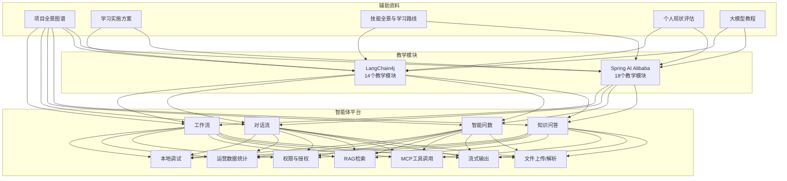
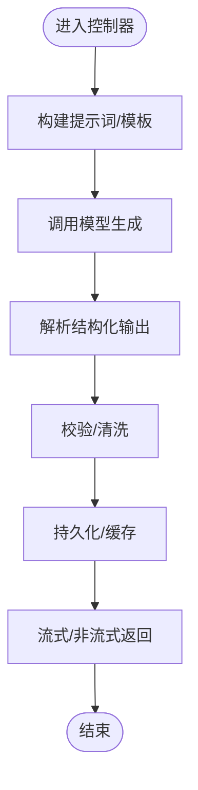
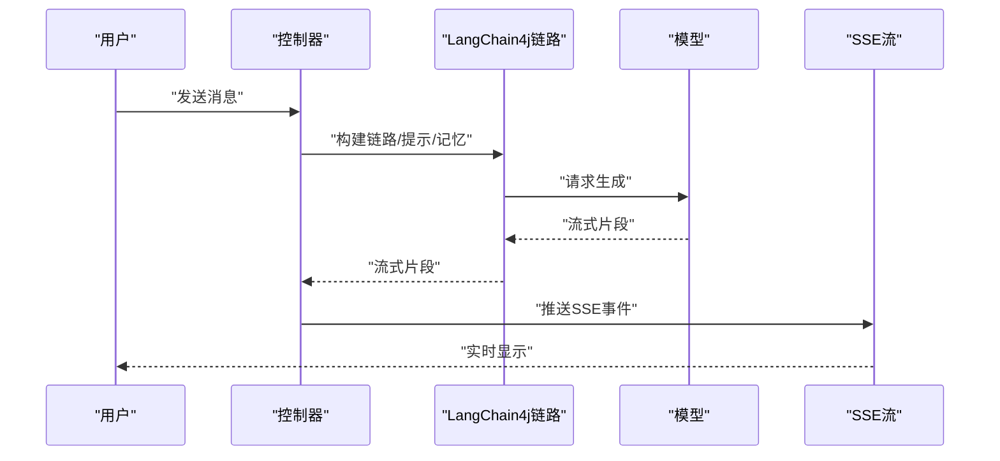
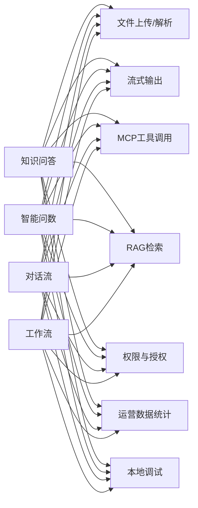
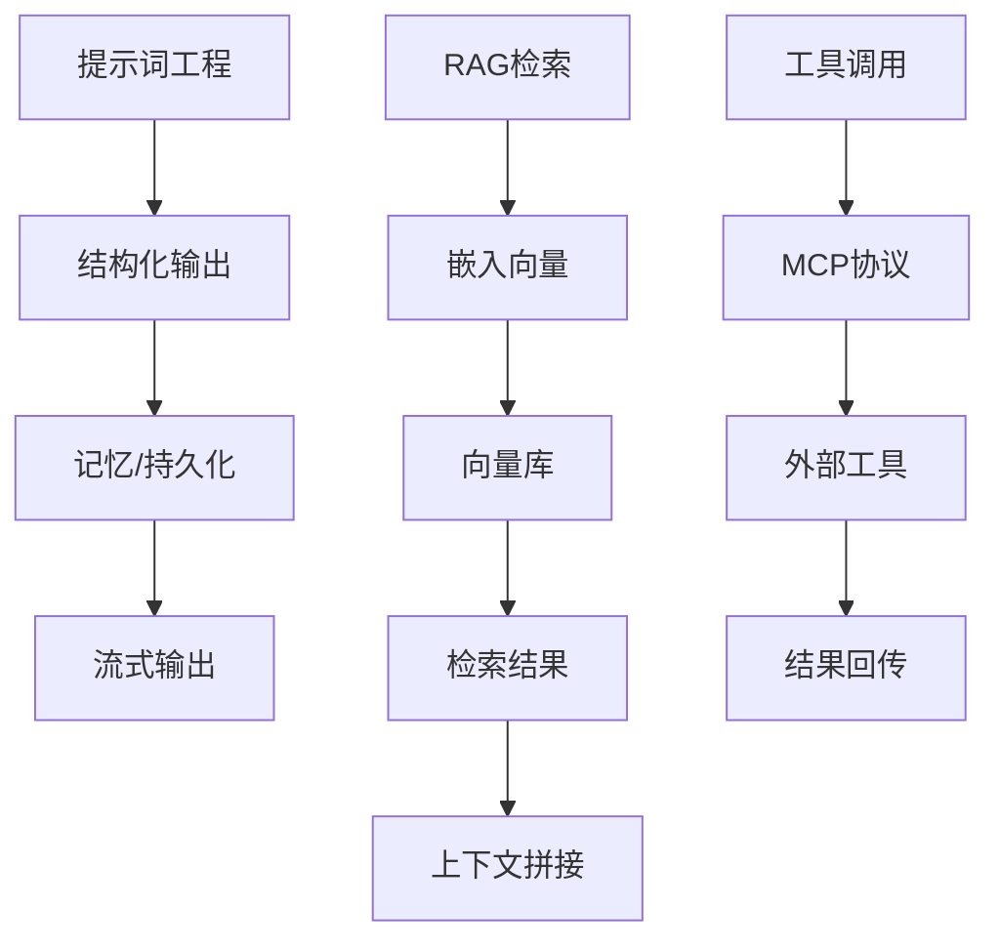

# 核心功能特性

<cite>
**本文引用的文件**
- [0、项目全景图谱.md](file://0、项目全景图谱.md)
- [3、SpringAIAlibaba-完整学习总结笔记.md](file://3、SpringAIAlibaba-完整学习总结笔记.md)
- [4、LangChain4j-完整学习总结笔记.md](file://4、LangChain4j-完整学习总结笔记.md)
- [5、AI智能体完整学习与实施方案.md](file://5、AI智能体完整学习与实施方案.md)
- [6、AI智能体—技能全景与学习路线.md](file://6、AI智能体—技能全景与学习路线.md)
- [2、仓颉智能体项目—之前工作中开发维护的项目.md](file://2、仓颉智能体项目—之前工作中开发维护的项目.md)
- [1、个人现状分析与能力评估报告.md](file://1、个人现状分析与能力评估报告.md)
- [AI大模型教程完整版.md](file://【0】AI大模型教程（指导手册）\AI大模型教程完整版.md)
- [SAA-01HelloWorld\HELP.md](file://【1】SpringAIAlibaba-atguiguV1\SAA-01HelloWorld\HELP.md)
- [SAA-03ChatModelChatClient\HELP.md](file://【1】SpringAIAlibaba-atguiguV1\SAA-03ChatModelChatClient\HELP.md)
- [SAA-04StreamingOutput\HELP.md](file://【1】SpringAIAlibaba-atguiguV1\SAA-04StreamingOutput\HELP.md)
- [SAA-05Prompt\HELP.md](file://【1】SpringAIAlibaba-atguiguV1\SAA-05Prompt\HELP.md)
- [SAA-06PromptTemplate\HELP.md](file://【1】SpringAIAlibaba-atguiguV1\SAA-06PromptTemplate\HELP.md)
- [SAA-07StructuredOutput\HELP.md](file://【1】SpringAIAlibaba-atguiguV1\SAA-07StructuredOutput\HELP.md)
- [SAA-08Persistent\HELP.md](file://【1】SpringAIAlibaba-atguiguV1\SAA-08Persistent\HELP.md)
- [SAA-09Text2image\HELP.md](file://【1】SpringAIAlibaba-atguiguV1\SAA-09Text2image\HELP.md)
- [SAA-10Text2voice\HELP.md](file://【1】SpringAIAlibaba-atguiguV1\SAA-10Text2voice\HELP.md)
- [SAA-11Embed2vector\HELP.md](file://【1】SpringAIAlibaba-atguiguV1\SAA-11Embed2vector\HELP.md)
- [SAA-12RAG4AiOps\HELP.md](file://【1】SpringAIAlibaba-atguiguV1\SAA-12RAG4AiOps\HELP.md)
- [SAA-13ToolCalling\HELP.md](file://【1】SpringAIAlibaba-atguiguV1\SAA-13ToolCalling\HELP.md)
- [SAA-14LocalMcpServer\HELP.md](file://【1】SpringAIAlibaba-atguiguV1\SAA-14LocalMcpServer\HELP.md)
- [SAA-15LocalMcpClient\HELP.md](file://【1】SpringAIAlibaba-atguiguV1\SAA-15LocalMcpClient\HELP.md)
- [SAA-16ClientCallBaiduMcpServer\HELP.md](file://【1】SpringAIAlibaba-atguiguV1\SAA-16ClientCallBaiduMcpServer\HELP.md)
- [SAA-17BailianRAG\HELP.md](file://【1】SpringAIAlibaba-atguiguV1\SAA-17BailianRAG\HELP.md)
- [SAA-18TodayMenu\HELP.md](file://【1】SpringAIAlibaba-atguiguV1\SAA-18TodayMenu\HELP.md)
- [langchain4j-01helloworld\HELP.md](file://【2】langchain4j-atguiguV5\langchain4j-01helloworld\HELP.md)
- [langchain4j-02multi-model-together\HELP.md](file://【2】langchain4j-atguiguV5\langchain4j-02multi-model-together\HELP.md)
- [langchain4j-03boot-integration\HELP.md](file://【2】langchain4j-atguiguV5\langchain4j-03boot-integration\HELP.md)
- [langchain4j-04low-high-api\HELP.md](file://【2】langchain4j-atguiguV5\langchain4j-04low-high-api\HELP.md)
- [langchain4j-05model-parameters\HELP.md](file://【2】langchain4j-atguiguV5\langchain4j-05model-parameters\HELP.md)
- [langchain4j-06chat-image\HELP.md](file://【2】langchain4j-atguiguV5\langchain4j-06chat-image\HELP.md)
- [langchain4j-07chat-stream\HELP.md](file://【2】langchain4j-atguiguV5\langchain4j-07chat-stream\HELP.md)
- [langchain4j-08chat-memory\HELP.md](file://【2】langchain4j-atguiguV5\langchain4j-08chat-memory\HELP.md)
- [langchain4j-09chat-prompt\HELP.md](file://【2】langchain4j-atguiguV5\langchain4j-09chat-prompt\HELP.md)
- [langchain4j-10chat-persistence\HELP.md](file://【2】langchain4j-atguiguV5\langchain4j-10chat-persistence\HELP.md)
- [langchain4j-11chat-functioncalling\HELP.md](file://【2】langchain4j-atguiguV5\langchain4j-11chat-functioncalling\HELP.md)
- [langchain4j-12chat-embedding\HELP.md](file://【2】langchain4j-atguiguV5\langchain4j-12chat-embedding\HELP.md)
- [langchain4j-13chat-rag01\HELP.md](file://【2】langchain4j-atguiguV5\langchain4j-13chat-rag01\HELP.md)
- [langchain4j-14chat-mcp\HELP.md](file://【2】langchain4j-atguiguV5\langchain4j-14chat-mcp\HELP.md)
</cite>

## 目录
1. [引言](#引言)
2. [项目结构](#项目结构)
3. [核心组件](#核心组件)
4. [架构总览](#架构总览)
5. [详细组件分析](#详细组件分析)
6. [依赖分析](#依赖分析)
7. [性能考虑](#性能考虑)
8. [故障排查指南](#故障排查指南)
9. [结论](#结论)
10. [附录](#附录)

## 引言
本文件面向AiCode项目的“核心功能特性”，系统梳理以下能力主线：
- Spring AI Alibaba 教学模块（18个教学模块）
- LangChain4j 教学模块（14个教学模块）
- 智能体平台四大应用类型（知识问答、智能问数、对话流、工作流）

文档从功能价值、技术实现、应用场景、模块间关联、数据流转与业务逻辑出发，提供对比分析、扩展建议、集成方案与最佳实践，并为学习者提供导航，为开发者提供技术参考。

## 项目结构
AiCode仓库由三大主线构成：
- 教学与学习笔记：Spring AI Alibaba 与 LangChain4j 的教学模块与学习总结
- 智能体平台：基于 nlp-agent 的企业级智能体平台（知识问答、智能问数、对话流、工作流等）
- 辅助资料：项目全景图谱、学习实施方案、技能路线、个人现状评估、大模型教程等

**章节来源**
- [0、项目全景图谱.md:15-30](file://0、项目全景图谱.md#L15-L30)
- [0、项目全景图谱.md:26-35](file://0、项目全景图谱.md#L26-L35)
- [0、项目全景图谱.md:133-160](file://0、项目全景图谱.md#L133-L160)

## 核心组件
- Spring AI Alibaba 教学模块（SAA-01 至 SAA-18）：覆盖从“Hello World”到“今日菜单”的完整链路，涵盖提示词工程、结构化输出、流式输出、RAG、工具调用、MCP、嵌入向量、文生图/文生音等。
- LangChain4j 教学模块（LC4J-01 至 LC4J-14）：覆盖从“Hello World”到“MCP”的完整链路，强调低/高阶API、参数配置、流式输出、记忆、提示、持久化、函数调用、嵌入、RAG等。
- 智能体平台（nlp-agent）：以“应用类型”为核心，提供知识问答、智能问数、对话流、工作流四类应用，配套文件上传/解析、流式输出、MCP工具、RAG检索、权限与授权、运营统计、本地调试等支撑能力。

**章节来源**
- [3、SpringAIAlibaba-完整学习总结笔记.md:1968-1970](file://3、SpringAIAlibaba-完整学习总结笔记.md#L1968-L1970)
- [4、LangChain4j-完整学习总结笔记.md:0-10](file://4、LangChain4j-完整学习总结笔记.md#L0-L10)
- [2、仓颉智能体项目—之前工作中开发维护的项目.md:5-25](file://2、仓颉智能体项目—之前工作中开发维护的项目.md#L5-L25)

## 架构总览
下图展示 AiCode 的三层能力架构：教学模块（训练场）、智能体平台（生产场）、辅助资料（导航与方法论）。

**图表来源**
- [0、项目全景图谱.md:133-160](file://0、项目全景图谱.md#L133-L160)
- [2、仓颉智能体项目—之前工作中开发维护的项目.md:20-60](file://2、仓颉智能体项目—之前工作中开发维护的项目.md#L20-L60)
- [3、SpringAIAlibaba-完整学习总结笔记.md:1968-1970](file://3、SpringAIAlibaba-完整学习总结笔记.md#L1968-L1970)
- [4、LangChain4j-完整学习总结笔记.md:0-10](file://4、LangChain4j-完整学习总结笔记.md#L0-L10)

## 详细组件分析

### Spring AI Alibaba 教学模块（SAA-01 至 SAA-18）
- 模块概览与价值
  - HelloWorld：入门与环境搭建，验证基础连通性
  - 流式输出：SSE/流式响应，提升交互体验
  - 提示词与模板：提示词工程与模板复用，提高可控性
  - 结构化输出：约束生成，便于下游解析
  - 持久化：会话/消息持久化，支持回放与审计
  - 文生图/文生音：多模态输出，拓展应用场景
  - 嵌入向量：向量化文本，支撑检索与相似度计算
  - RAG/AI运维：结合知识库与运维场景，落地检索增强
  - 工具调用：函数/工具调用，扩展外部能力
  - MCP：本地/远程MCP服务，统一工具协议
  - 百炼RAG/今日菜单：典型业务场景封装

- 技术实现要点
  - 配置驱动：通过配置文件管理模型参数、提示词、工具等
  - 控制器编排：以控制器为入口，串联模型、提示、工具、存储
  - 流式与非流式：根据场景选择合适输出方式
  - 工具注册与调用：将外部能力抽象为工具，按需调用
  - 向量化与检索：文本嵌入 + 向量库检索，形成RAG闭环

- 应用场景
  - 快速原型验证、教学演示、业务场景封装（如今日菜单）
  - 运维知识问答、文档问答、客服问答等

- 模块导航（节选）
  - HelloWorld/SAA-01：[SAA-01HelloWorld\HELP.md](file://【1】SpringAIAlibaba-atguiguV1\SAA-01HelloWorld\HELP.md)
  - 流式输出/SAA-04：[SAA-04StreamingOutput\HELP.md](file://【1】SpringAIAlibaba-atguiguV1\SAA-04StreamingOutput\HELP.md)
  - 提示词/SAA-05：[SAA-05Prompt\HELP.md](file://【1】SpringAIAlibaba-atguiguV1\SAA-05Prompt\HELP.md)
  - Prompt模板/SAA-06：[SAA-06PromptTemplate\HELP.md](file://【1】SpringAIAlibaba-atguiguV1\SAA-06PromptTemplate\HELP.md)
  - 结构化输出/SAA-07：[SAA-07StructuredOutput\HELP.md](file://【1】SpringAIAlibaba-atguiguV1\SAA-07StructuredOutput\HELP.md)
  - 持久化/SAA-08：[SAA-08Persistent\HELP.md](file://【1】SpringAIAlibaba-atguiguV1\SAA-08Persistent\HELP.md)
  - 文生图/SAA-09：[SAA-09Text2image\HELP.md](file://【1】SpringAIAlibaba-atguiguV1\SAA-09Text2image\HELP.md)
  - 文生音/SAA-10：[SAA-10Text2voice\HELP.md](file://【1】SpringAIAlibaba-atguiguV1\SAA-10Text2voice\HELP.md)
  - 嵌入向量/SAA-11：[SAA-11Embed2vector\HELP.md](file://【1】SpringAIAlibaba-atguiguV1\SAA-11Embed2vector\HELP.md)
  - RAG/AI运维/SAA-12：[SAA-12RAG4AiOps\HELP.md](file://【1】SpringAIAlibaba-atguiguV1\SAA-12RAG4AiOps\HELP.md)
  - 工具调用/SAA-13：[SAA-13ToolCalling\HELP.md](file://【1】SpringAIAlibaba-atguiguV1\SAA-13ToolCalling\HELP.md)
  - 本地MCP服务/SAA-14：[SAA-14LocalMcpServer\HELP.md](file://【1】SpringAIAlibaba-atguiguV1\SAA-14LocalMcpServer\HELP.md)
  - 本地MCP客户端/SAA-15：[SAA-15LocalMcpClient\HELP.md](file://【1】SpringAIAlibaba-atguiguV1\SAA-15LocalMcpClient\HELP.md)
  - 调用百度MCP/SAA-16：[SAA-16ClientCallBaiduMcpServer\HELP.md](file://【1】SpringAIAlibaba-atguiguV1\SAA-16ClientCallBaiduMcpServer\HELP.md)
  - 百炼RAG/SAA-17：[SAA-17BailianRAG\HELP.md](file://【1】SpringAIAlibaba-atguiguV1\SAA-17BailianRAG\HELP.md)
  - 今日菜单/SAA-18：[SAA-18TodayMenu\HELP.md](file://【1】SpringAIAlibaba-atguiguV1\SAA-18TodayMenu\HELP.md)

- 数据流与业务逻辑（以“结构化输出”为例）

**图表来源**
- [SAA-07StructuredOutput\HELP.md](file://【1】SpringAIAlibaba-atguiguV1\SAA-07StructuredOutput\HELP.md)
- [SAA-05Prompt\HELP.md](file://【1】SpringAIAlibaba-atguiguV1\SAA-05Prompt\HELP.md)
- [SAA-06PromptTemplate\HELP.md](file://【1】SpringAIAlibaba-atguiguV1\SAA-06PromptTemplate\HELP.md)

**章节来源**
- [3、SpringAIAlibaba-完整学习总结笔记.md:1968-1970](file://3、SpringAIAlibaba-完整学习总结笔记.md#L1968-L1970)
- [SAA-01HelloWorld\HELP.md:1-20](file://【1】SpringAIAlibaba-atguiguV1\SAA-01HelloWorld\HELP.md#L1-L20)
- [SAA-04StreamingOutput\HELP.md:1-20](file://【1】SpringAIAlibaba-atguiguV1\SAA-04StreamingOutput\HELP.md#L1-L20)
- [SAA-07StructuredOutput\HELP.md:1-20](file://【1】SpringAIAlibaba-atguiguV1\SAA-07StructuredOutput\HELP.md#L1-L20)
- [SAA-12RAG4AiOps\HELP.md:1-20](file://【1】SpringAIAlibaba-atguiguV1\SAA-12RAG4AiOps\HELP.md#L1-L20)
- [SAA-13ToolCalling\HELP.md:1-20](file://【1】SpringAIAlibaba-atguiguV1\SAA-13ToolCalling\HELP.md#L1-L20)
- [SAA-14LocalMcpServer\HELP.md:1-20](file://【1】SpringAIAlibaba-atguiguV1\SAA-14LocalMcpServer\HELP.md#L1-L20)
- [SAA-17BailianRAG\HELP.md:1-20](file://【1】SpringAIAlibaba-atguiguV1\SAA-17BailianRAG\HELP.md#L1-L20)
- [SAA-18TodayMenu\HELP.md:1-20](file://【1】SpringAIAlibaba-atguiguV1\SAA-18TodayMenu\HELP.md#L1-L20)

### LangChain4j 教学模块（LC4J-01 至 LC4J-14）
- 模块概览与价值
  - HelloWorld：最小可用对话链路
  - 多模型/Boot集成：多模型切换与Spring Boot集成
  - 低/高阶API：理解LangChain4j的两套API范式
  - 模型参数：温度、最大长度等参数调优
  - 图像/流式/记忆/提示/持久化：完善对话体验与可追溯性
  - 函数调用/嵌入/RAG/MCP：进阶能力补齐

- 技术实现要点
  - 低阶API：直连模型接口，适合快速验证
  - 高阶API：通过链路、提示、记忆、持久化等组件组合，形成稳定工程化能力
  - 参数化：通过配置或代码控制模型行为
  - 流式输出：SSE/事件流，改善用户体验
  - 记忆与持久化：上下文管理与审计
  - 函数调用与嵌入：扩展工具与检索能力
  - RAG与MCP：检索增强与工具协议

- 应用场景
  - 教学演示、原型验证、工程化封装（如RAG/MCP）

- 模块导航（节选）
  - HelloWorld/LC4J-01：[langchain4j-01helloworld\HELP.md](file://【2】langchain4j-atguiguV5\langchain4j-01helloworld\HELP.md)
  - 多模型/LC4J-02：[langchain4j-02multi-model-together\HELP.md](file://【2】langchain4j-atguiguV5\langchain4j-02multi-model-together\HELP.md)
  - Boot集成/LC4J-03：[langchain4j-03boot-integration\HELP.md](file://【2】langchain4j-atguiguV5\langchain4j-03boot-integration\HELP.md)
  - 低/高阶API/LC4J-04：[langchain4j-04low-high-api\HELP.md](file://【2】langchain4j-atguiguV5\langchain4j-04low-high-api\HELP.md)
  - 模型参数/LC4J-05：[langchain4j-05model-parameters\HELP.md](file://【2】langchain4j-atguiguV5\langchain4j-05model-parameters\HELP.md)
  - 图像/LC4J-06：[langchain4j-06chat-image\HELP.md](file://【2】langchain4j-atguiguV5\langchain4j-06chat-image\HELP.md)
  - 流式/LC4J-07：[langchain4j-07chat-stream\HELP.md](file://【2】langchain4j-atguiguV5\langchain4j-07chat-stream\HELP.md)
  - 记忆/LC4J-08：[langchain4j-08chat-memory\HELP.md](file://【2】langchain4j-atguiguV5\langchain4j-08chat-memory\HELP.md)
  - 提示/LC4J-09：[langchain4j-09chat-prompt\HELP.md](file://【2】langchain4j-atguiguV5\langchain4j-09chat-prompt\HELP.md)
  - 持久化/LC4J-10：[langchain4j-10chat-persistence\HELP.md](file://【2】langchain4j-atguiguV5\langchain4j-10chat-persistence\HELP.md)
  - 函数调用/LC4J-11：[langchain4j-11chat-functioncalling\HELP.md](file://【2】langchain4j-atguiguV5\langchain4j-11chat-functioncalling\HELP.md)
  - 嵌入/LC4J-12：[langchain4j-12chat-embedding\HELP.md](file://【2】langchain4j-atguiguV5\langchain4j-12chat-embedding\HELP.md)
  - RAG/LC4J-13：[langchain4j-13chat-rag01\HELP.md](file://【2】langchain4j-atguiguV5\langchain4j-13chat-rag01\HELP.md)
  - MCP/LC4J-14：[langchain4j-14chat-mcp\HELP.md](file://【2】langchain4j-atguiguV5\langchain4j-14chat-mcp\HELP.md)

- 数据流与业务逻辑（以“流式输出”为例）

**图表来源**
- [langchain4j-07chat-stream\HELP.md](file://【2】langchain4j-atguiguV5\langchain4j-07chat-stream\HELP.md)
- [langchain4j-04low-high-api\HELP.md](file://【2】langchain4j-atguiguV5\langchain4j-04low-high-api\HELP.md)

**章节来源**
- [4、LangChain4j-完整学习总结笔记.md:0-10](file://4、LangChain4j-完整学习总结笔记.md#L0-L10)
- [langchain4j-01helloworld\HELP.md:1-20](file://【2】langchain4j-atguiguV5\langchain4j-01helloworld\HELP.md#L1-L20)
- [langchain4j-07chat-stream\HELP.md:1-20](file://【2】langchain4j-atguiguV5\langchain4j-07chat-stream\HELP.md#L1-L20)
- [langchain4j-11chat-functioncalling\HELP.md:1-20](file://【2】langchain4j-atguiguV5\langchain4j-11chat-functioncalling\HELP.md#L1-L20)
- [langchain4j-13chat-rag01\HELP.md:1-20](file://【2】langchain4j-atguiguV5\langchain4j-13chat-rag01\HELP.md#L1-L20)
- [langchain4j-14chat-mcp\HELP.md:1-20](file://【2】langchain4j-atguiguV5\langchain4j-14chat-mcp\HELP.md#L1-L20)

### 智能体平台四大应用类型
- 知识问答
  - 核心价值：基于知识库的精准问答，支持流式输出与工具调用
  - 技术实现：提示词工程 + RAG检索 + 流式输出 + 权限控制
  - 场景：FAQ、产品说明、政策解读、运维手册查询
- 智能问数
  - 核心价值：将自然语言转化为结构化查询，支持导入导出配置
  - 技术实现：提示词模板 + 结构化输出 + 向量库 + 运营统计
  - 场景：报表查询、指标统计、BI辅助
- 对话流
  - 核心价值：可视化编排对话节点，支持复杂交互与分支
  - 技术实现：节点编排 + 流式输出 + 文件上传/解析 + MCP工具
  - 场景：客服对话、业务引导、多轮问答
- 工作流
  - 核心价值：将对话与业务流程结合，支持定时触发与状态管理
  - 技术实现：Camunda集成 + 节点状态 + 运营监控 + 本地调试
  - 场景：审批流程、数据处理、任务调度

- 应用类型与支撑能力关系

**图表来源**
- [2、仓颉智能体项目—之前工作中开发维护的项目.md:20-60](file://2、仓颉智能体项目—之前工作中开发维护的项目.md#L20-L60)
- [2、仓颉智能体项目—之前工作中开发维护的项目.md:100-180](file://2、仓颉智能体项目—之前工作中开发维护的项目.md#L100-L180)

**章节来源**
- [2、仓颉智能体项目—之前工作中开发维护的项目.md:5-25](file://2、仓颉智能体项目—之前工作中开发维护的项目.md#L5-L25)
- [2、仓颉智能体项目—之前工作中开发维护的项目.md:205-245](file://2、仓颉智能体项目—之前工作中开发维护的项目.md#L205-L245)

## 依赖分析
- 教学模块与智能体平台的耦合关系
  - 教学模块为“能力训练场”，提供可复用的组件（提示词、结构化输出、流式输出、RAG、MCP、嵌入等）
  - 智能体平台为“生产场”，将教学模块能力进行工程化封装与编排，形成四大应用类型
- 关键依赖链
  - 提示词工程 → 结构化输出 → 持久化/记忆 → 流式输出
  - RAG检索 → 嵌入向量 → 向量库 → 检索结果 → 上下文拼接
  - 工具调用 → MCP协议 → 本地/远程工具 → 结果回传
- 潜在风险与规避
  - 参数漂移：通过配置中心与参数化文档管理
  - 流式输出延迟：通过缓冲与背压策略优化
  - RAG召回质量：通过提示词与向量质量双管齐下

**图表来源**
- [3、SpringAIAlibaba-完整学习总结笔记.md:1968-1970](file://3、SpringAIAlibaba-完整学习总结笔记.md#L1968-L1970)
- [4、LangChain4j-完整学习总结笔记.md:0-10](file://4、LangChain4j-完整学习总结笔记.md#L0-L10)

**章节来源**
- [3、SpringAIAlibaba-完整学习总结笔记.md:1968-1970](file://3、SpringAIAlibaba-完整学习总结笔记.md#L1968-L1970)
- [4、LangChain4j-完整学习总结笔记.md:0-10](file://4、LangChain4j-完整学习总结笔记.md#L0-L10)

## 性能考虑
- 流式输出
  - 优先采用SSE/事件流，降低首字节延迟，提升交互体验
  - 控制事件粒度与缓冲大小，避免频繁小包
- RAG检索
  - 向量库分片与索引优化，减少检索耗时
  - 上下文截断与重排序，保证相关性与吞吐
- 工具调用
  - 异步调用 + 超时与熔断，避免阻塞主链路
  - 工具结果缓存，减少重复调用
- 记忆与持久化
  - 分页与归档策略，控制存储成本
  - 写放大控制与批量写入，提升吞吐

## 故障排查指南
- 常见问题与定位
  - 流式输出中断：检查SSE通道与网络稳定性；确认事件边界与编码
  - RAG召回不足：检查嵌入质量、向量库索引、提示词工程
  - 工具调用失败：检查MCP服务连通性、超时设置、鉴权
  - 结构化输出解析异常：核对模板与模型输出格式，增加校验与兜底
- 本地调试
  - 使用本地MCP服务进行工具联调
  - 通过日志与指标定位瓶颈
- 运营监控
  - 关注响应时延、错误率、召回率、命中率等关键指标

**章节来源**
- [2、仓颉智能体项目—之前工作中开发维护的项目.md:160-220](file://2、仓颉智能体项目—之前工作中开发维护的项目.md#L160-L220)

## 结论
AiCode通过“教学模块 + 智能体平台 + 辅助资料”的三位一体结构，实现了从“能力训练”到“工程化应用”的完整闭环。Spring AI Alibaba 与 LangChain4j 的教学模块提供了丰富的技术能力与最佳实践，智能体平台则将这些能力编排为四大应用类型，覆盖知识问答、智能问数、对话流与工作流等典型场景。建议学习者先以教学模块打牢基础，再以智能体平台进行实战演练；开发者可在教学模块基础上进行工程化封装与性能优化，逐步形成可复用的智能体能力资产。

## 附录
- 功能特性对比分析（简表）
  - 结构化输出：Spring AI Alibaba 与 LangChain4j 均支持，前者更偏向约束生成，后者更偏向链路编排
  - 流式输出：两者均支持，LangChain4j 更强调事件流与SSE
  - RAG：两者均支持，LangChain4j 提供更多链路组件（记忆、提示、持久化）
  - 工具调用/MCP：Spring AI Alibaba 与 LangChain4j 均支持，侧重协议与工具注册
  - 嵌入向量：两者均支持，结合向量库实现检索增强
- 扩展建议
  - 引入缓存与预计算，降低重复推理成本
  - 增加A/B测试与效果追踪，持续优化提示词与参数
  - 构建工具市场与插件生态，提升可扩展性
- 集成方案
  - 以Spring Boot为统一入口，统一配置与监控
  - 以MCP为工具协议，统一外部能力接入
  - 以RAG为知识增强，统一检索与排序
- 最佳实践
  - 先验证、后集成、再优化
  - 以模块化与可测试性为导向
  - 注重可观测性与可追溯性

**章节来源**
- [4、LangChain4j-完整学习总结笔记.md:179-241](file://4、LangChain4j-完整学习总结笔记.md#L179-L241)
- [5、AI智能体完整学习与实施方案.md:1-50](file://5、AI智能体完整学习与实施方案.md#L1-L50)
- [6、AI智能体—技能全景与学习路线.md:1-50](file://6、AI智能体—技能全景与学习路线.md#L1-L50)
- [AI大模型教程完整版.md:1-50](file://【0】AI大模型教程（指导手册）\AI大模型教程完整版.md#L1-L50)
- [1、个人现状分析与能力评估报告.md:182-201](file://1、个人现状分析与能力评估报告.md#L182-L201)