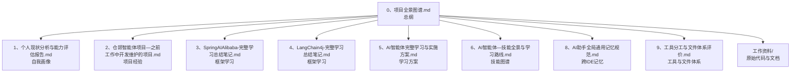
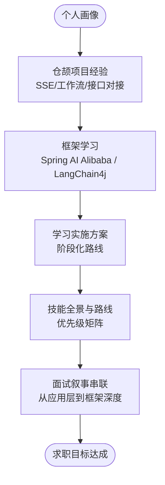
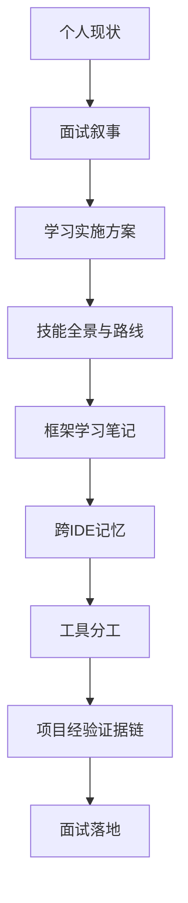

# 项目介绍与目标

<cite>
**本文引用的文件**
- [0、项目全景图谱.md](file://0、项目全景图谱.md)
- [1、个人现状分析与能力评估报告.md](file://1、个人现状分析与能力评估报告.md)
- [2、仓颉智能体项目—之前工作中开发维护的项目.md](file://2、仓颉智能体项目—之前工作中开发维护的项目.md)
- [3、SpringAIAlibaba-完整学习总结笔记.md](file://3、SpringAIAlibaba-完整学习总结笔记.md)
- [4、LangChain4j-完整学习总结笔记.md](file://4、LangChain4j-完整学习总结笔记.md)
- [5、AI智能体完整学习与实施方案.md](file://5、AI智能体完整学习与实施方案.md)
- [6、AI智能体—技能全景与学习路线.md](file://6、AI智能体—技能全景与学习路线.md)
- [8、AI助手全局通用记忆规范.md](file://8、AI助手全局通用记忆规范.md)
- [9、工具分工与文件体系评价.md](file://9、工具分工与文件体系评价.md)
</cite>

## 目录
1. [引言](#引言)
2. [项目结构](#项目结构)
3. [核心组件](#核心组件)
4. [架构总览](#架构总览)
5. [详细组件分析](#详细组件分析)
6. [依赖分析](#依赖分析)
7. [性能考量](#性能考量)
8. [故障排查指南](#故障排查指南)
9. [结论](#结论)
10. [附录](#附录)

## 引言
AiCode项目旨在为Java后端开发者提供一条从传统后端开发向AI应用开发转型的系统化路径。项目以“实战+框架+理论”的三位一体设计，帮助学习者在掌握Spring AI Alibaba与LangChain4j两大主流框架的同时，理解并能在真实智能体平台中落地RAG、Agent编排、工具调用、流式输出等关键能力。项目特别强调“生产级经验 + 框架深度 + 面试叙事”的串联，帮助学习者在求职面试中讲出“有深度、有证据、有体系”的完整故事。

## 项目结构
项目采用“总纲 + 分支”的树形结构，以0、项目全景图谱.md为唯一总入口，统揽个人背景、项目经历、技术强弱项、学习进度、文件索引与使用规则。下设个人现状、仓颉项目经验、框架学习笔记、学习实施方案、技能图谱、面试题库、工作资料（原始代码与文档）等分支，形成“导航页 + 说明书 + 证据链”的完整知识体系。

**图示来源**
- [0、项目全景图谱.md:214-235](file://0、项目全景图谱.md#L214-L235)
- [1、个人现状分析与能力评估报告.md:1-203](file://1、个人现状分析与能力评估报告.md#L1-L203)
- [2、仓颉智能体项目—之前工作中开发维护的项目.md:1-243](file://2、仓颉智能体项目—之前工作中开发维护的项目.md#L1-L243)
- [3、SpringAIAlibaba-完整学习总结笔记.md:1-800](file://3、SpringAIAlibaba-完整学习总结笔记.md#L1-L800)
- [4、LangChain4j-完整学习总结笔记.md:1-800](file://4、LangChain4j-完整学习总结笔记.md#L1-L800)
- [5、AI智能体完整学习与实施方案.md:1-800](file://5、AI智能体完整学习与实施方案.md#L1-L800)
- [6、AI智能体—技能全景与学习路线.md:1-408](file://6、AI智能体—技能全景与学习路线.md#L1-L408)
- [8、AI助手全局通用记忆规范.md:1-300](file://8、AI助手全局通用记忆规范.md#L1-L300)
- [9、工具分工与文件体系评价.md:1-206](file://9、工具分工与文件体系评价.md#L1-L206)

**章节来源**
- [0、项目全景图谱.md:124-254](file://0、项目全景图谱.md#L124-L254)

## 核心组件
- 个人现状与能力画像：明确10年Java后端经验、仓颉智能体平台应用层开发经验、SSE流式输出与Camunda工作流的实战能力，以及RAG、Agent编排、模型微调等短板。
- 仓颉智能体平台项目经验：覆盖知识问答、智能问数、对话流、工作流四大模块，强调“应用层开发维护”的真实角色与工程落地细节。
- 框架学习体系：Spring AI Alibaba 18模块与LangChain4j 12模块的系统化学习笔记，配套实施与路线图，补齐理论深度。
- 跨IDE记忆与工具分工：VSCode + Claude Code与IDEA + 通义灵码的分工策略，三层记忆架构，确保AI助手始终“了解你的背景”。

**章节来源**
- [1、个人现状分析与能力评估报告.md:1-203](file://1、个人现状分析与能力评估报告.md#L1-L203)
- [2、仓颉智能体项目—之前工作中开发维护的项目.md:1-243](file://2、仓颉智能体项目—之前工作中开发维护的项目.md#L1-L243)
- [3、SpringAIAlibaba-完整学习总结笔记.md:1-800](file://3、SpringAIAlibaba-完整学习总结笔记.md#L1-L800)
- [4、LangChain4j-完整学习总结笔记.md:1-800](file://4、LangChain4j-完整学习总结笔记.md#L1-L800)
- [8、AI助手全局通用记忆规范.md:1-300](file://8、AI助手全局通用记忆规范.md#L1-L300)
- [9、工具分工与文件体系评价.md:1-206](file://9、工具分工与文件体系评价.md#L1-L206)

## 架构总览
项目以“个人能力画像”为起点，通过“仓颉项目经验”与“框架学习”的双向串联，形成“面试叙事 + 框架实战 + 理论补强”的闭环。学习实施方案提供阶段化路线，技能全景图谱给出技术选型与优先级矩阵，确保学习与面试目标高度对齐。

**图示来源**
- [1、个人现状分析与能力评估报告.md:122-184](file://1、个人现状分析与能力评估报告.md#L122-L184)
- [5、AI智能体完整学习与实施方案.md:102-112](file://5、AI智能体完整学习与实施方案.md#L102-L112)
- [6、AI智能体—技能全景与学习路线.md:389-408](file://6、AI智能体—技能全景与学习路线.md#L389-L408)

## 详细组件分析

### 个人现状与能力画像
- 强项：Java微服务架构、SSE流式输出、Camunda工作流开发、跨系统接口对接、对话系统维护。
- 弱项：RAG深度理解、向量数据库实操、Agent编排模式、模型微调、评估体系、算法原理。
- 市场定位：以“10年Java + 生产级智能体平台经验 + 框架学习中”的差异化优势，弥补Python技术栈与架构设计经验的不足。

**章节来源**
- [1、个人现状分析与能力评估报告.md:71-151](file://1、个人现状分析与能力评估报告.md#L71-L151)

### 仓颉智能体平台项目经验
- 项目定位：企业级AI智能体平台（4个微服务 + 公共组件层），覆盖知识问答、智能问数、对话流、工作流。
- 应用层角色：在已有架构上做应用层开发维护，负责SSE流式输出、新增工作流节点、节点间变量赋值、算法接口对接、跨团队问题定位、对话流维护。
- 面试叙事：以“SSE流式输出”“Camunda工作流节点开发”“跨团队对接NL2SQL”等真实故事为核心，诚实讲清“应用层开发维护”的职责边界。

**章节来源**
- [2、仓颉智能体项目—之前工作中开发维护的项目.md:11-112](file://2、仓颉智能体项目—之前工作中开发维护的项目.md#L11-L112)
- [2、仓颉智能体项目—之前工作中开发维护的项目.md:115-196](file://2、仓颉智能体项目—之前工作中开发维护的项目.md#L115-L196)

### 框架学习体系（Spring AI Alibaba 与 LangChain4j）
- Spring AI Alibaba：18模块覆盖HelloWorld到综合案例，包含ChatModel/ChatClient、Prompt/PromptTemplate、结构化输出、持久化/记忆、文生图/音、向量化、RAG、工具调用、MCP协议、百炼平台RAG、今日菜单等。
- LangChain4j：12模块覆盖HelloWorld到Embedding，包含多模型共存、Spring Boot集成、低级/高级API、模型参数、图像对话、流式对话、对话记忆、Prompt提示词、对话持久化、函数调用、向量化等。
- 学习性质：教学级demo，能跑通、建立知识面；配合仓颉项目实战经验，价值更高。

**章节来源**
- [3、SpringAIAlibaba-完整学习总结笔记.md:9-37](file://3、SpringAIAlibaba-完整学习总结笔记.md#L9-L37)
- [4、LangChain4j-完整学习总结笔记.md:9-31](file://4、LangChain4j-完整学习总结笔记.md#L9-L31)

### 学习实施方案与技能全景
- 学习策略：面试题驱动 + 项目对照，先看仓颉项目有没有经验，没有的补理论；两条线并行：长期学习与面试驱动。
- 技能全景：从“你现在在哪里”到“学习路线图”，再到“技术栈选型决策树、RAG知识体系、Agent架构模式、面试叙事地图、优先级矩阵”，形成完整能力图谱。
- 阶段化路线：RAG召回优化 → Qdrant向量库集成 → Agent高级编排 → 评估监控体系 → 模型微调实战。

**章节来源**
- [5、AI智能体完整学习与实施方案.md:41-112](file://5、AI智能体完整学习与实施方案.md#L41-L112)
- [6、AI智能体—技能全景与学习路线.md:88-408](file://6、AI智能体—技能全景与学习路线.md#L88-L408)

### 跨IDE记忆与工具分工
- 三层记忆架构：通用层（.ai-memory/PROJECT_CONTEXT.md）、工具专用层（.claude/memory.md + CLAUDE.md）、项目专用层（.lingma/instructions.md）。
- 工具分工：IDEA专注代码开发，VS Code专注知识管理与文档编辑；AI搭配策略：通义灵码免费处理日常文档，Claude Code按需处理复杂梳理与长文档整合。
- 记忆同步：通过定期更新PROJECT_CONTEXT.md与使用/create_memory工具，实现VSCode + Claude Code与IDEA + 通义灵码的记忆互通。

**章节来源**
- [8、AI助手全局通用记忆规范.md:15-80](file://8、AI助手全局通用记忆规范.md#L15-L80)
- [8、AI助手全局通用记忆规范.md:125-168](file://8、AI助手全局通用记忆规范.md#L125-L168)
- [9、工具分工与文件体系评价.md:17-64](file://9、工具分工与文件体系评价.md#L17-L64)
- [9、工具分工与文件体系评价.md:114-182](file://9、工具分工与文件体系评价.md#L114-L182)

## 依赖分析
项目在“个人能力 + 项目经验 + 框架学习 + 实施方案 + 技能图谱 + 记忆体系 + 工具分工”之间形成强耦合与高内聚的依赖关系。个人现状决定学习优先级与面试叙事方向；仓颉项目经验提供真实证据链；框架学习笔记提供方法论与API细节；实施方案与技能图谱提供路线与优先级；跨IDE记忆与工具分工保证学习与面试准备的高效协同。

**图示来源**
- [1、个人现状分析与能力评估报告.md:187-203](file://1、个人现状分析与能力评估报告.md#L187-L203)
- [5、AI智能体完整学习与实施方案.md:41-112](file://5、AI智能体完整学习与实施方案.md#L41-L112)
- [6、AI智能体—技能全景与学习路线.md:389-408](file://6、AI智能体—技能全景与学习路线.md#L389-L408)
- [8、AI助手全局通用记忆规范.md:125-168](file://8、AI助手全局通用记忆规范.md#L125-L168)
- [9、工具分工与文件体系评价.md:17-64](file://9、工具分工与文件体系评价.md#L17-L64)

**章节来源**
- [0、项目全景图谱.md:214-235](file://0、项目全景图谱.md#L214-L235)

## 性能考量
- 学习效率：通过“面试题驱动 + 项目对照”的方法，确保每一分学习都直接服务于面试；优先级矩阵帮助在有限时间内最大化收益。
- 工具效率：IDEA + VS Code的分工策略，配合AI助手自动化处理，降低重复劳动，提升文档处理与知识复盘效率。
- 记忆同步：三层记忆架构与定期同步机制，避免信息孤岛，确保面试准备与学习过程的一致性与连贯性。

**章节来源**
- [5、AI智能体完整学习与实施方案.md:41-112](file://5、AI智能体完整学习与实施方案.md#L41-L112)
- [9、工具分工与文件体系评价.md:114-182](file://9、工具分工与文件体系评价.md#L114-L182)
- [8、AI助手全局通用记忆规范.md:125-168](file://8、AI助手全局通用记忆规范.md#L125-L168)

## 故障排查指南
- 记忆不同步：检查PROJECT_CONTEXT.md更新频率、.claude/memory.md与.lingma/instructions.md的同步策略，必要时使用/create_memory工具进行数据库级记忆共享。
- 工具不生效：确认IDEA/VS Code插件版本、文件格式与缓存问题；若自动加载失败，使用手动粘贴或快速启动模板作为备用方案。
- 学习进度滞后：利用技能全景图谱的优先级矩阵，聚焦面试高频问题；阶段性回顾与总结，确保学习闭环。

**章节来源**
- [8、AI助手全局通用记忆规范.md:246-272](file://8、AI助手全局通用记忆规范.md#L246-L272)
- [9、工具分工与文件体系评价.md:162-182](file://9、工具分工与文件体系评价.md#L162-L182)

## 结论
AiCode项目以“个人能力画像 + 项目经验 + 框架学习 + 实施方案 + 技能图谱 + 记忆体系 + 工具分工”为核心，构建了从Java后端到AI应用开发的完整转型路径。通过系统化的学习与实践，学习者不仅能在面试中讲出“有深度、有证据、有体系”的故事，还能在真实智能体平台中落地RAG、Agent编排、工具调用、流式输出等关键能力，实现从应用层开发到AI智能体全栈工程师的职业跃迁。

## 附录
- 项目定位图与学习路径：详见“技能全景与学习路线”中的多张Mermaid图谱，包括技能定位、学习路线、技术栈选型、RAG知识体系、Agent架构模式、面试叙事地图、优先级矩阵等。
- 面试叙事模板：以“10年底座 + 仓颉项目经验翻译 + 框架理论补全”为主线，结合具体故事（SSE流式输出、Camunda工作流节点开发、跨团队对接NL2SQL）组织面试回答。

**章节来源**
- [6、AI智能体—技能全景与学习路线.md:88-408](file://6、AI智能体—技能全景与学习路线.md#L88-L408)
- [2、仓颉智能体项目—之前工作中开发维护的项目.md:115-196](file://2、仓颉智能体项目—之前工作中开发维护的项目.md#L115-L196)