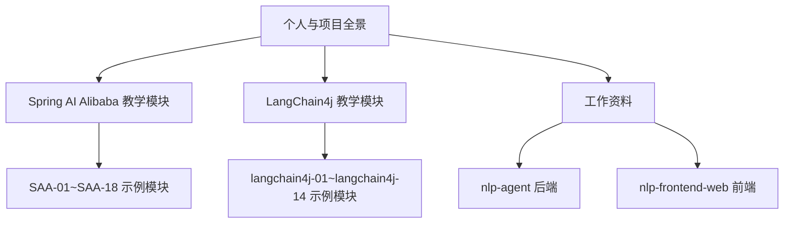
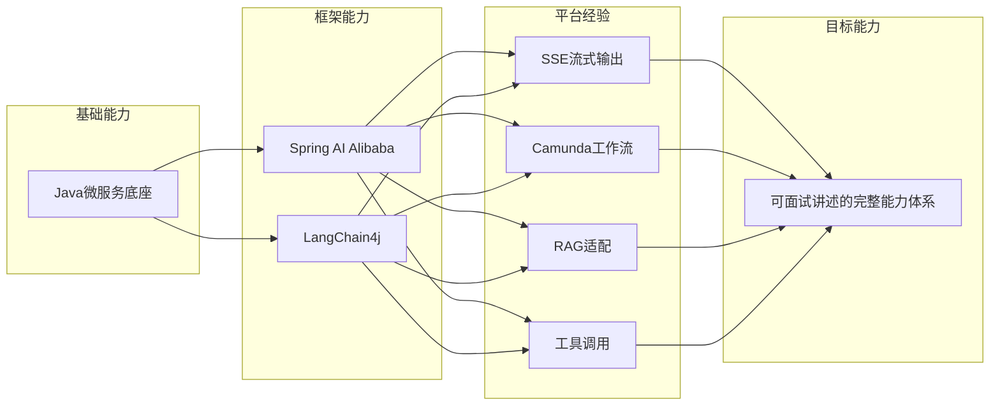
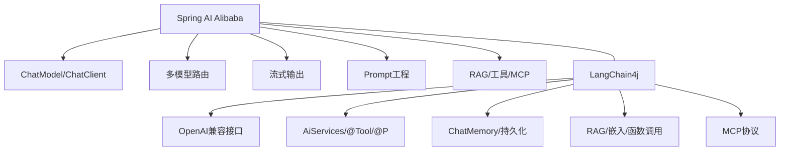
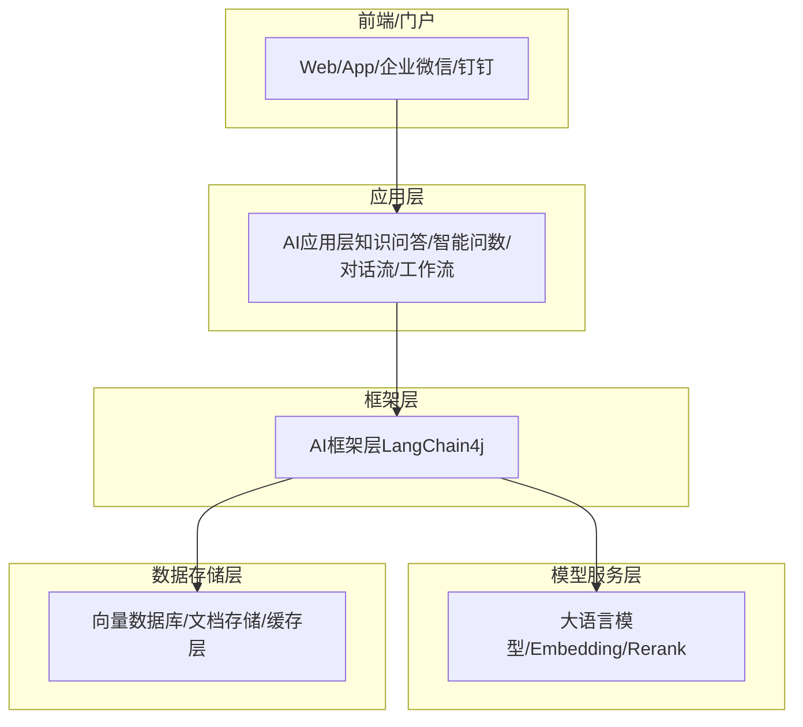
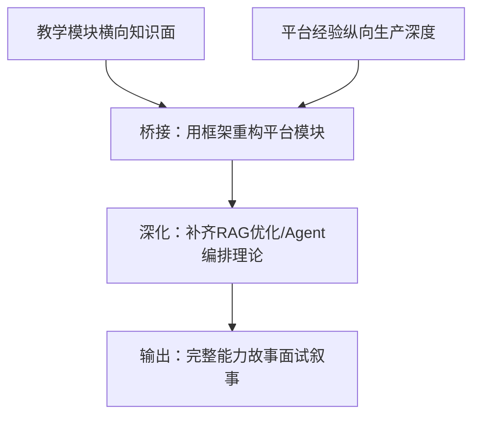
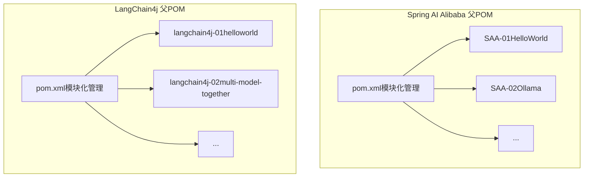

# 项目概览

<cite>
**本文引用的文件**
- [0、项目全景图谱.md](file://0、项目全景图谱.md)
- [2、仓颉智能体项目—之前工作中开发维护的项目.md](file://2、仓颉智能体项目—之前工作中开发维护的项目.md)
- [3、SpringAIAlibaba-完整学习总结笔记.md](file://3、SpringAIAlibaba-完整学习总结笔记.md)
- [4、LangChain4j-完整学习总结笔记.md](file://4、LangChain4j-完整学习总结笔记.md)
- [5、AI智能体完整学习与实施方案.md](file://5、AI智能体完整学习与实施方案.md)
- [6、AI智能体—技能全景与学习路线.md](file://6、AI智能体—技能全景与学习路线.md)
- [【1】SpringAIAlibaba-atguiguV1\pom.xml](file://【1】SpringAIAlibaba-atguiguV1\pom.xml)
- [【2】langchain4j-atguiguV5\pom.xml](file://【2】langchain4j-atguiguV5\pom.xml)
</cite>

## 目录
1. [引言](#引言)
2. [项目结构](#项目结构)
3. [核心组件](#核心组件)
4. [架构总览](#架构总览)
5. [详细组件分析](#详细组件分析)
6. [依赖分析](#依赖分析)
7. [性能考量](#性能考量)
8. [故障排查指南](#故障排查指南)
9. [结论](#结论)
10. [附录](#附录)

## 引言
本文件为AiCode项目的概览文档，面向两类读者：初学者与有经验的开发者。内容围绕项目背景、核心目标、技术架构与设计理念展开，重点阐述Spring AI Alibaba框架与LangChain4j框架的关系，以及智能体平台在整个AI生态系统中的定位。文档同时提供高层架构图与组件关系图，帮助快速理解项目全貌，并为后续深入学习与实战提供路径指引。

## 项目结构
AiCode仓库由四大部分组成：
- 个人与项目全景：包含个人现状分析、仓颉智能体项目经验、学习笔记与实施方案等
- Spring AI Alibaba教学模块：18个教学级示例，覆盖对话、流式输出、Prompt工程、RAG、工具调用、MCP协议等
- LangChain4j教学模块：14个教学级示例，覆盖基础链路、多模型、Prompt工程、记忆、函数调用、嵌入、RAG、MCP等
- 工作资料：包含智能体平台nlp-agent后端与nlp-frontend-web前端代码、系统功能文档与项目记忆规范

**章节来源**
- [0、项目全景图谱.md:124-196](file://0、项目全景图谱.md#L124-L196)
- [2、仓颉智能体项目—之前工作中开发维护的项目.md:10-51](file://2、仓颉智能体项目—之前工作中开发维护的项目.md#L10-L51)

## 核心组件
- 框架层
  - Spring AI Alibaba：提供ChatModel/ChatClient统一调用入口，支持多模型、流式输出、Prompt模板、结构化输出、RAG、工具调用、MCP协议等
  - LangChain4j：提供OpenAI兼容接口与高级API（AiServices、Memory、@Tool等），强调声明式服务与工程化能力
- 应用层
  - 以教学模块为载体，演示从HelloWorld到综合案例的完整能力闭环
  - 结合仓颉智能体平台的实际经验，形成“教学级知识面 + 生产级应用”的复合能力
- 平台层
  - 仓颉智能体平台：微服务架构，包含agent-system、agent-builder、agent-worker、agent-plugin等服务，以及公共组件层；支持SSE流式输出、Camunda工作流、RAG适配、工具调用等

**章节来源**
- [3、SpringAIAlibaba-完整学习总结笔记.md:1-132](file://3、SpringAIAlibaba-完整学习总结笔记.md#L1-L132)
- [4、LangChain4j-完整学习总结笔记.md:1-256](file://4、LangChain4j-完整学习总结笔记.md#L1-L256)
- [2、仓颉智能体项目—之前工作中开发维护的项目.md:10-51](file://2、仓颉智能体项目—之前工作中开发维护的项目.md#L10-L51)

## 架构总览
从“框架学习”到“平台应用”的能力串联路径如下：
- 以Java微服务底座为核心，串联教学框架（Spring AI Alibaba、LangChain4j）与平台经验（SSE流式、Camunda工作流、RAG适配、工具调用）
- 通过“翻译经验 + 框架重构 + 理论深化 + 工程化输出”的路径，形成可面试讲述的完整故事

**章节来源**
- [6、AI智能体—技能全景与学习路线.md:275-309](file://6、AI智能体—技能全景与学习路线.md#L275-L309)
- [5、AI智能体完整学习与实施方案.md:116-170](file://5、AI智能体完整学习与实施方案.md#L116-L170)

## 详细组件分析

### Spring AI Alibaba 与 LangChain4j 的关系与差异
- 共同点
  - 都提供OpenAI兼容接口，便于统一调用多家模型提供商
  - 都支持流式输出、Prompt工程、工具调用、RAG等核心能力
- 差异点
  - Spring AI Alibaba更偏向“Spring生态 + 阿里云DashScope原生协议”，配置简洁、自动装配友好
  - LangChain4j强调“声明式服务 + 高阶API”，适合复杂业务与工程化落地
- 选择建议
  - 快速原型与Spring生态集成：优先Spring AI Alibaba
  - 复杂业务与工程化：优先LangChain4j

**章节来源**
- [3、SpringAIAlibaba-完整学习总结笔记.md:709-800](file://3、SpringAIAlibaba-完整学习总结笔记.md#L709-L800)
- [4、LangChain4j-完整学习总结笔记.md:180-242](file://4、LangChain4j-完整学习总结笔记.md#L180-L242)

### 智能体平台在AI生态中的定位
- 业务定位：企业级AI智能体平台，覆盖知识问答、智能问数、对话流、工作流四大模块
- 技术定位：以微服务架构为基础，结合SSE流式输出、Camunda工作流、RAG适配与工具调用，形成“对话-检索-编排-执行”的闭环
- 价值主张：在已有架构上做应用层开发维护，既保证工程稳定性，又能在框架学习与平台实践中形成差异化竞争力

**章节来源**
- [2、仓颉智能体项目—之前工作中开发维护的项目.md:10-51](file://2、仓颉智能体项目—之前工作中开发维护的项目.md#L10-L51)
- [5、AI智能体完整学习与实施方案.md:116-170](file://5、AI智能体完整学习与实施方案.md#L116-L170)

### 教学模块与平台经验的串联
- 教学模块提供“横向知识面”：覆盖从HelloWorld到RAG、工具调用、MCP协议等
- 平台经验提供“纵向生产深度”：SSE流式输出、Camunda工作流节点、RAG适配器、工具调用、NL2SQL对接等
- 串联策略：将平台经验翻译为通用AI术语，用Spring AI/LangChain4j重构一个平台模块，补齐RAG优化与Agent编排的理论深度，最终形成可面试讲述的完整能力故事

**章节来源**
- [6、AI智能体—技能全景与学习路线.md:237-243](file://6、AI智能体—技能全景与学习路线.md#L237-L243)
- [5、AI智能体完整学习与实施方案.md:41-72](file://5、AI智能体完整学习与实施方案.md#L41-L72)

## 依赖分析
- 技术栈与版本
  - Spring AI Alibaba：基于Spring Boot 3.5.5、Spring AI 1.0.0、Spring AI Alibaba 1.0.0.2
  - LangChain4j：基于Spring Boot 3.5.0、Spring AI 1.0.0、LangChain4j 1.0.1
- 依赖管理
  - 通过BOM（Bill of Materials）统一管理各子模块依赖，确保版本一致性
  - 仓库中提供了父POM配置，便于模块化开发与版本控制

**章节来源**
- [【1】SpringAIAlibaba-atguiguV1\pom.xml:13-31](file://【1】SpringAIAlibaba-atguiguV1\pom.xml#L13-L31)
- [【2】langchain4j-atguiguV5\pom.xml:13-28](file://【2】langchain4j-atguiguV5\pom.xml#L13-L28)

## 性能考量
- 流式输出体验：SSE流式输出能显著改善用户体验，但需注意与下游节点的并发控制与状态管理
- 检索质量与生成质量：RAG的检索质量决定生成质量，通过混合检索、重排序、分片策略优化可显著提升准确率
- 工程化监控：建立评估指标体系（Precision@K、Recall@K、MRR、NDCG、BLEU/ROUGE等）与A/B测试框架，持续优化系统表现

[本节为通用指导，无需特定文件引用]

## 故障排查指南
- 跨系统对接问题定位：通过CURL提取请求报文，使用Postman复现，对比应用侧参数与接口文档，定位是参数组装问题还是算法模型问题
- 流式输出冲突：在流式完成前阻塞下游节点执行，通过完成标志位控制节点间数据流转，确保流式内容完整后再交给下游
- 工具调用与MCP协议：确认工具注册、参数传递与返回格式对齐，必要时通过日志与断点定位工具链路问题

**章节来源**
- [2、仓颉智能体项目—之前工作中开发维护的项目.md:159-177](file://2、仓颉智能体项目—之前工作中开发维护的项目.md#L159-L177)
- [2、仓颉智能体项目—之前工作中开发维护的项目.md:115-139](file://2、仓颉智能体项目—之前工作中开发维护的项目.md#L115-L139)

## 结论
AiCode项目通过“教学框架 + 平台经验 + 工程化实践”的组合，形成了从入门到实战的完整路径。Spring AI Alibaba与LangChain4j在生态中互补：前者强调Spring生态与阿里云原生协议，后者强调声明式服务与工程化能力。智能体平台则在企业级场景中承担“对话-检索-编排-执行”的中枢角色。建议以平台经验为锚点，用框架能力重构模块，补齐RAG优化与Agent编排的理论深度，最终输出可面试讲述的完整能力故事。

[本节为总结性内容，无需特定文件引用]

## 附录
- 学习路线与优先级：以“翻译经验 + 框架重构 + 理论深化 + 工程化输出”为主线，结合面试优先级矩阵，合理安排学习投入与回报
- 面试叙事地图：以“定位—架构—深入—优化—视野”为主线，构建可讲、可证、可演进的面试故事

**章节来源**
- [6、AI智能体—技能全景与学习路线.md:364-385](file://6、AI智能体—技能全景与学习路线.md#L364-L385)
- [5、AI智能体完整学习与实施方案.md:74-111](file://5、AI智能体完整学习与实施方案.md#L74-L111)